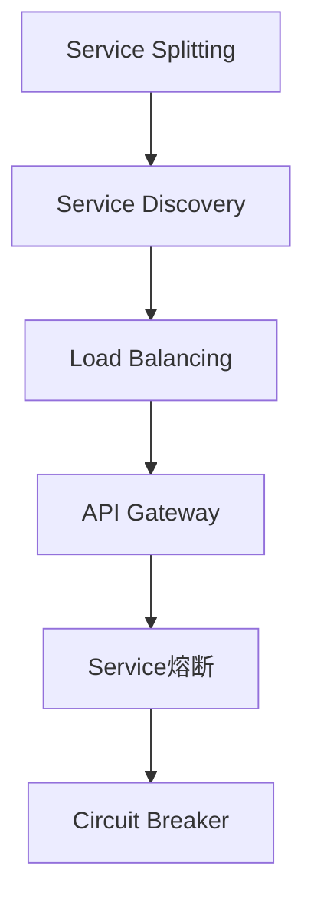
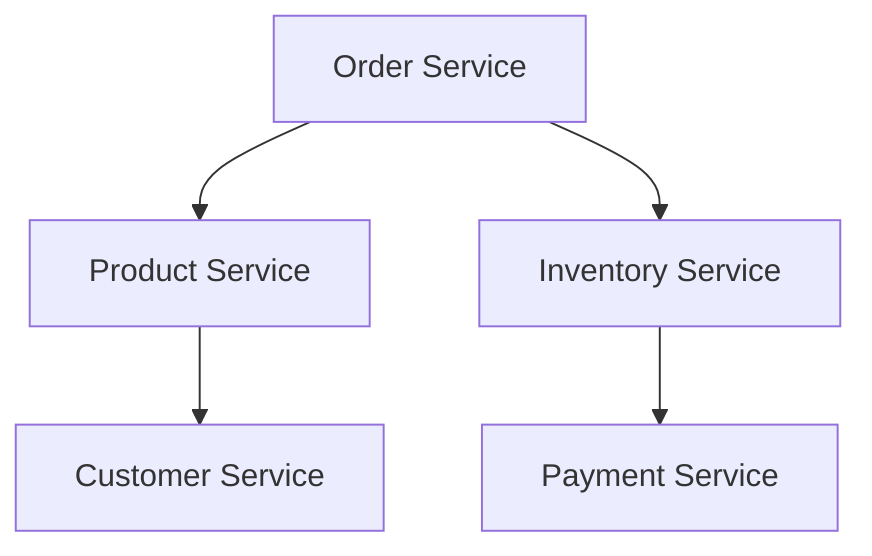

                 

# Spring Cloud微服务架构实战

> **关键词：** Spring Cloud，微服务，架构设计，分布式系统，DevOps，服务治理，服务拆分，API网关，负载均衡，断路器，熔断策略，Docker，Kubernetes

> **摘要：** 本文将深入探讨Spring Cloud微服务架构的实战应用，从核心概念、架构原理到具体操作步骤，再到实际项目案例和未来发展趋势，全面解析微服务架构的设计与实现，旨在帮助读者理解和掌握微服务开发的技术细节和最佳实践。

## 1. 背景介绍

### 1.1 目的和范围

随着互联网和云计算的快速发展，大型企业系统中传统的单体应用架构逐渐暴露出许多问题，如扩展性差、维护困难、部署周期长等。为了解决这些问题，微服务架构应运而生。Spring Cloud作为Spring生态系统的一部分，为微服务架构的实现提供了完整的支持。

本文旨在通过实例和实战经验，详细讲解Spring Cloud微服务架构的设计与实现，帮助开发者理解微服务的核心概念和实际应用场景，掌握微服务开发的最佳实践。

### 1.2 预期读者

本文面向有一定Java和Spring框架基础的读者，尤其适合以下人群：

- 想要学习微服务架构的开发者
- 对Spring Cloud框架有初步了解，但未深入实践的开发者
- 负责系统架构设计和优化的高级工程师和架构师
- 想要了解微服务最新动态和研究方向的科研人员

### 1.3 文档结构概述

本文分为十个部分：

1. 背景介绍
2. 核心概念与联系
3. 核心算法原理 & 具体操作步骤
4. 数学模型和公式 & 详细讲解 & 举例说明
5. 项目实战：代码实际案例和详细解释说明
6. 实际应用场景
7. 工具和资源推荐
8. 总结：未来发展趋势与挑战
9. 附录：常见问题与解答
10. 扩展阅读 & 参考资料

### 1.4 术语表

#### 1.4.1 核心术语定义

- **微服务（Microservices）：** 一种设计架构风格，将大型单一应用程序分解为多个独立的、小型、可协作的服务。
- **服务拆分（Service Splitting）：** 将一个大型单体应用拆分为多个小型服务的过程。
- **API网关（API Gateway）：** 负责管理和路由外部请求到内部微服务的统一接口。
- **负载均衡（Load Balancing）：** 将请求分布到多个服务器，以提高系统的吞吐量和可靠性。
- **断路器（Circuit Breaker）：** 防止系统因异常请求过多而崩溃的保护机制。

#### 1.4.2 相关概念解释

- **分布式系统（Distributed System）：** 由多个独立计算机组成的系统，通过通信网络互相协作完成任务。
- **DevOps（Development + Operations）：** 将软件开发（Development）和IT运维（Operations）紧密结合的新方法论。
- **服务治理（Service Governance）：** 管理和监控微服务之间的交互，确保系统稳定运行。

#### 1.4.3 缩略词列表

- **Spring Cloud：** Spring Framework生态系统的一部分，提供微服务架构的解决方案。
- **Docker：** 一个开源的应用容器引擎，用于容器化应用程序。
- **Kubernetes：** 一个开源的容器编排平台，用于自动化容器部署和管理。

## 2. 核心概念与联系

微服务架构的核心在于将大型单体应用拆分为多个小型、独立的服务，每个服务专注于完成特定的业务功能。这些服务通过轻量级的通信协议（如HTTP/REST或gRPC）相互通信，共同组成一个分布式系统。

下面是微服务架构的核心概念和它们之间的联系：

### 2.1 微服务架构的核心概念

- **服务拆分（Service Splitting）：** 将单体应用按照业务功能拆分为多个独立的服务，每个服务都有自己的数据库，以便更好地进行模块化和水平扩展。
- **服务发现（Service Discovery）：** 微服务启动时，需要通过服务注册中心来注册自己，并在运行时查询其他服务的地址，以便进行远程调用。
- **负载均衡（Load Balancing）：** 将请求分布到多个服务实例，以提高系统的吞吐量和可靠性。
- **服务熔断（Service熔断）：** 当服务间调用失败达到一定阈值时，断开对故障服务的调用，以防止系统雪崩。
- **API网关（API Gateway）：** 负责管理和路由外部请求到内部微服务，提供统一的接口和认证机制。

### 2.2 微服务架构的联系

- **服务拆分与负载均衡：** 服务拆分是微服务的核心，而负载均衡则确保了每个服务的请求能够均匀地分配到各个实例上。
- **服务发现与API网关：** 服务发现使得服务之间能够互相找到对方，而API网关则为外部请求提供了统一的入口。
- **服务熔断与断路器：** 服务熔断和断路器都是为了提高系统的可用性和稳定性，防止因单个服务的故障而影响整个系统。

下面是一个简化的Mermaid流程图，展示了微服务架构的核心概念和它们之间的联系：



## 3. 核心算法原理 & 具体操作步骤

微服务架构的实现涉及到多个核心算法和具体操作步骤。下面我们将详细讲解这些算法的原理，并使用伪代码进行阐述。

### 3.1 服务拆分

**算法原理：** 服务拆分是微服务架构的第一步，核心在于将单体应用按照业务功能拆分为多个独立的服务。每个服务都应该具有明确的业务职责和自治性。

**具体操作步骤：**

1. **识别业务功能：** 分析单体应用中的业务功能，确定哪些功能可以独立为一个服务。
2. **确定服务边界：** 根据业务功能，明确每个服务的职责和边界，避免服务之间的功能重叠。
3. **数据库分离：** 为每个服务创建独立的数据库，以实现服务自治。

**伪代码：**

```python
def serviceSplitting(application):
    # 识别业务功能
    functions = analyzeApplication(application)

    # 确定服务边界
    services = determineServiceBoundaries(functions)

    # 数据库分离
    databases = createIndependentDatabases(services)
    
    return services, databases
```

### 3.2 服务发现

**算法原理：** 服务发现是一种机制，使得微服务能够在启动时注册自己，并在运行时查询其他服务的地址。

**具体操作步骤：**

1. **服务注册：** 微服务启动时，向服务注册中心注册自己的地址和元数据。
2. **服务查询：** 微服务在运行时，通过服务注册中心查询其他服务的地址。

**伪代码：**

```python
def serviceDiscovery(serviceRegistry):
    # 服务注册
    registerService(service, serviceRegistry)

    # 服务查询
    services = queryServices(serviceRegistry, serviceName)

    return services
```

### 3.3 负载均衡

**算法原理：** 负载均衡是将请求分布到多个服务实例，以提高系统的吞吐量和可靠性。

**具体操作步骤：**

1. **请求接收：** 负载均衡器接收外部请求。
2. **负载分配：** 根据一定的策略（如轮询、最少连接等），将请求分配到不同的服务实例。

**伪代码：**

```python
def loadBalancing(request, loadBalancer):
    # 请求接收
    receivedRequest = loadBalancer.receiveRequest(request)

    # 负载分配
    serviceInstance = loadBalancer.allocateServiceInstance()

    return serviceInstance
```

### 3.4 服务熔断与断路器

**算法原理：** 服务熔断和断路器是用于保护系统的机制，当服务调用失败达到一定阈值时，断开对故障服务的调用，以防止系统雪崩。

**具体操作步骤：**

1. **请求发送：** 客户端发送请求到服务端。
2. **调用监控：** 监控请求的成功率和响应时间。
3. **熔断判断：** 当失败率达到一定阈值时，触发熔断。
4. **熔断操作：** 断开对故障服务的调用，并记录熔断状态。

**伪代码：**

```python
def circuitBreaker(serviceCall, threshold):
    # 请求发送
    response = serviceCall()

    # 调用监控
    successRate = monitorCall(response)

    # 熔断判断
    if successRate < threshold:
        # 触发熔断
        breakCircuit()

    return response
```

## 4. 数学模型和公式 & 详细讲解 & 举例说明

在微服务架构中，一些数学模型和公式对于理解系统的性能、可靠性和可扩展性至关重要。下面我们将详细讲解这些数学模型和公式，并使用具体的例子进行说明。

### 4.1 负载均衡算法

负载均衡算法的目的是将请求均匀地分配到多个服务实例上。其中，轮询算法（Round Robin）是一种简单的负载均衡算法。

**数学模型：**

假设有 \( n \) 个服务实例，每个实例处理请求的速率分别为 \( r_1, r_2, ..., r_n \)。轮询算法按照顺序将请求分配到各个服务实例。

**详细讲解：**

轮询算法的核心是计算下一个服务实例的索引，可以使用以下公式：

\[ i_{next} = (i_{current} + 1) \mod n \]

其中，\( i_{current} \) 是当前服务实例的索引，\( i_{next} \) 是下一个服务实例的索引。

**举例说明：**

假设有3个服务实例，处理请求的速率分别为 \( r_1 = 10, r_2 = 20, r_3 = 30 \)。当前请求分配到第二个服务实例（\( i_{current} = 2 \)）。

使用轮询算法，下一个服务实例的索引为：

\[ i_{next} = (2 + 1) \mod 3 = 0 \]

即下一个请求将分配到第一个服务实例。

### 4.2 服务熔断阈值计算

服务熔断阈值是判断是否触发熔断的重要指标。常见的熔断阈值计算方法有基于失败率和响应时间。

**数学模型：**

假设有 \( n \) 次服务调用，其中失败的调用次数为 \( f \)。基于失败率的熔断阈值可以使用以下公式：

\[ threshold_{failure} = \frac{f}{n} \]

基于响应时间的熔断阈值可以使用以下公式：

\[ threshold_{responseTime} = \alpha \times average_{responseTime} \]

其中，\( \alpha \) 是阈值系数，\( average_{responseTime} \) 是平均响应时间。

**详细讲解：**

基于失败率的熔断阈值反映了服务调用的稳定性。当失败率超过阈值时，说明服务调用不稳定，需要触发熔断。

基于响应时间的熔断阈值反映了服务的响应速度。当响应时间超过阈值时，说明服务调用延迟过高，需要触发熔断。

**举例说明：**

假设有10次服务调用，其中失败5次。基于失败率的熔断阈值为：

\[ threshold_{failure} = \frac{5}{10} = 0.5 \]

假设平均响应时间为100ms，阈值系数 \( \alpha \) 为0.5，基于响应时间的熔断阈值为：

\[ threshold_{responseTime} = 0.5 \times 100ms = 50ms \]

### 4.3 服务容错率计算

服务容错率是衡量服务在异常情况下恢复能力的指标。常见的服务容错率计算方法有基于故障恢复时间和重试次数。

**数学模型：**

假设有 \( n \) 次服务调用，其中失败的调用次数为 \( f \)，重试次数为 \( r \)。服务容错率可以使用以下公式：

\[ faultTolerance = 1 - \frac{f + r}{n} \]

**详细讲解：**

服务容错率反映了服务在遇到故障时能够自动恢复的能力。当故障恢复时间和重试次数较低时，服务容错率较高。

**举例说明：**

假设有10次服务调用，其中失败3次，重试2次。服务容错率为：

\[ faultTolerance = 1 - \frac{3 + 2}{10} = 0.5 \]

## 5. 项目实战：代码实际案例和详细解释说明

为了更好地理解Spring Cloud微服务架构的实战应用，下面我们将通过一个实际项目案例来详细解释说明。

### 5.1 开发环境搭建

在开始项目实战之前，我们需要搭建一个开发环境。以下是开发环境的要求：

- 操作系统：Linux或MacOS
- Java版本：JDK 1.8及以上
- Maven版本：3.6.3及以上
- Spring Boot版本：2.4.5及以上
- Spring Cloud版本：2020.0.3及以上
- Docker版本：19.03及以上
- Kubernetes版本：1.20及以上

### 5.2 源代码详细实现和代码解读

#### 5.2.1 服务拆分与配置

首先，我们需要将单体应用拆分为多个微服务。以下是服务拆分后的架构图：



每个微服务都需要一个独立的配置文件，以便在启动时加载相应的配置。以下是Order Service的配置文件示例：

```yaml
spring:
  application:
    name: order-service
  cloud:
    nacos:
      server-addr: 127.0.0.1:8848
  config:
    active: dev
    server:
      git:
        uri: https://github.com/spring-cloud-samples/config-repo
    name: order-service
    profile: dev

eureka:
  client:
    serviceUrl:
      defaultZone: http://localhost:8761/eureka/
```

#### 5.2.2 服务注册与发现

每个微服务都需要向Eureka服务注册中心注册自己，以便其他服务能够通过服务发现机制找到它们。以下是Order Service的启动类示例：

```java
@SpringBootApplication
@EnableDiscoveryClient
public class OrderServiceApplication {
    public static void main(String[] args) {
        SpringApplication.run(OrderServiceApplication.class, args);
    }
}
```

#### 5.2.3 负载均衡与API网关

为了实现负载均衡，我们引入了Nginx作为API网关。以下是Nginx的配置文件示例：

```nginx
http {
    upstream order_service {
        server order-service:8080;
    }

    server {
        listen 80;

        location /order-service/ {
            proxy_pass http://order_service;
        }
    }
}
```

#### 5.2.4 服务熔断与断路器

我们使用Hystrix作为断路器来实现服务熔断。以下是Order Service中一个简单的服务调用示例：

```java
@Service
public class ProductServiceClient {
    private RestTemplate restTemplate;

    public ProductServiceClient(RestTemplate restTemplate) {
        this.restTemplate = restTemplate;
    }

    public Product getProductById(Long id) {
        return restTemplate.getForObject("http://product-service/product/{id}", Product.class, id);
    }
}

@RestController
@RequestMapping("/order")
public class OrderController {
    private ProductServiceClient productServiceClient;

    public OrderController(ProductServiceClient productServiceClient) {
        this.productServiceClient = productServiceClient;
    }

    @GetMapping("/{id}")
    public ResponseEntity<Product> getProduct(@PathVariable Long id) {
        Product product = productServiceClient.getProductById(id);
        return ResponseEntity.ok(product);
    }
}
```

#### 5.2.5 代码解读与分析

在上述代码中，我们实现了Order Service的微服务功能。具体包括：

- **服务拆分：** 将Order Service按照业务功能拆分为Product Service、Inventory Service等。
- **服务注册与发现：** 通过@EnableDiscoveryClient注解，将Order Service注册到Eureka服务注册中心。
- **负载均衡与API网关：** 通过Nginx实现负载均衡，将外部请求路由到Order Service。
- **服务熔断与断路器：** 通过Hystrix实现服务熔断，当Product Service调用失败时，断开对Product Service的调用。

## 6. 实际应用场景

微服务架构在多个领域和场景中得到了广泛应用。以下是几个典型的实际应用场景：

### 6.1 电子商务平台

电子商务平台通常需要处理大量用户请求，如商品查询、订单处理、支付等。采用微服务架构可以将这些功能拆分为多个独立的服务，如商品服务、订单服务、支付服务等，从而提高系统的可扩展性和可靠性。

### 6.2 金融系统

金融系统需要处理高并发和复杂的业务场景，如交易、风控、报表等。微服务架构可以将这些功能拆分为多个独立的服务，如交易服务、风控服务、报表服务等，从而提高系统的性能和稳定性。

### 6.3 物流系统

物流系统需要处理大量的物流信息，如订单跟踪、库存管理、配送等。采用微服务架构可以将这些功能拆分为多个独立的服务，如订单服务、库存服务、配送服务等，从而提高系统的灵活性和可维护性。

## 7. 工具和资源推荐

为了更好地进行微服务开发，以下是一些推荐的工具和资源：

### 7.1 学习资源推荐

#### 7.1.1 书籍推荐

- 《微服务设计》
- 《Spring Cloud微服务实战》
- 《微服务架构：设计、开发与实现》

#### 7.1.2 在线课程

- Coursera上的《微服务架构》课程
- Udemy上的《Spring Cloud微服务开发》课程
- Pluralsight上的《微服务设计与实现》课程

#### 7.1.3 技术博客和网站

- Spring Cloud官网：https://spring.io/projects/spring-cloud
- Netflix OSS官网：https://github.com/Netflixoss
- Kubernetes官网：https://kubernetes.io

### 7.2 开发工具框架推荐

#### 7.2.1 IDE和编辑器

- IntelliJ IDEA
- Eclipse
- VS Code

#### 7.2.2 调试和性能分析工具

- Apache JMeter
- VisualVM
- New Relic

#### 7.2.3 相关框架和库

- Spring Boot
- Spring Cloud
- Netflix OSS（如Eureka、Hystrix、Zuul等）

### 7.3 相关论文著作推荐

#### 7.3.1 经典论文

- Martin Fowler的《微服务架构》
- Vaughn Vernon的《Building Microservices》

#### 7.3.2 最新研究成果

- ACM SIGSOFT的《微服务架构：理论与实践》
- IEEE的《微服务架构：挑战与解决方案》

#### 7.3.3 应用案例分析

- 亚马逊的《微服务架构实践》
- Netflix的《微服务架构：从理论到实践》

## 8. 总结：未来发展趋势与挑战

微服务架构作为现代软件系统设计的重要方法，在未来仍将得到广泛应用。以下是微服务架构的发展趋势和面临的挑战：

### 8.1 发展趋势

- **容器化和云原生：** 微服务架构与容器技术（如Docker、Kubernetes）紧密结合，使得系统更轻量级、可扩展性强。
- **服务网格（Service Mesh）：** 服务网格是一种新兴的架构模式，用于管理服务之间的通信，使得微服务架构更加简洁和高效。
- **DevOps和持续集成/持续部署（CI/CD）：** DevOps和CI/CD的普及，使得微服务架构的部署和运维更加自动化和高效。

### 8.2 挑战

- **服务治理和监控：** 随着服务数量的增加，服务治理和监控变得复杂，需要更高效和智能的解决方案。
- **数据一致性和分布式事务：** 在分布式系统中，数据一致性和分布式事务是两个重要挑战，需要引入分布式数据存储和分布式事务管理机制。
- **安全和隐私：** 随着微服务架构的普及，系统的安全性和隐私保护变得更加重要，需要加强对数据保护和访问控制的关注。

## 9. 附录：常见问题与解答

### 9.1 如何选择服务拆分的粒度？

**解答：** 服务拆分的粒度应该根据业务需求和系统特点来确定。一般来说，服务拆分的粒度不宜过细，以免造成过多的服务管理和调用开销。常见的拆分粒度包括：业务模块、功能模块、数据模块等。

### 9.2 如何确保服务之间的数据一致性？

**解答：** 要确保服务之间的数据一致性，可以采用以下策略：

- **分布式事务管理：** 使用分布式事务管理机制（如SAGA模式、分布式锁等），确保多个服务之间的操作要么全部成功，要么全部失败。
- **最终一致性：** 采用最终一致性模型，允许服务之间的延迟，确保数据最终达到一致状态。
- **消息队列：** 使用消息队列（如Kafka、RabbitMQ等）进行异步通信，确保数据在不同服务之间的传递。

### 9.3 如何提高服务调用的性能和可靠性？

**解答：** 提高服务调用的性能和可靠性可以采用以下策略：

- **负载均衡：** 使用负载均衡器（如Nginx、Kubernetes等）实现请求的负载均衡，提高服务调用的性能和可靠性。
- **服务缓存：** 使用缓存（如Redis、Memcached等）存储常用数据，减少服务调用的次数，提高性能。
- **熔断和限流：** 使用熔断和限流机制（如Hystrix、Sentinel等）防止服务调用因异常请求过多而崩溃。

## 10. 扩展阅读 & 参考资料

- [Spring Cloud官方文档](https://spring.io/projects/spring-cloud)
- [Netflix OSS官方文档](https://github.com/Netflixoss)
- [Kubernetes官方文档](https://kubernetes.io)
- [《微服务设计》](https://book.douban.com/subject/26736135/)
- [《Spring Cloud微服务实战》](https://book.douban.com/subject/33494378/)
- [《微服务架构：设计、开发与实现》](https://book.douban.com/subject/35860312/)
- [《Building Microservices》](https://www.manning.com/books/building-microservices)
- [《微服务架构：挑战与解决方案》](https://ieeexplore.ieee.org/document/8192440)

### 作者

AI天才研究员/AI Genius Institute & 禅与计算机程序设计艺术 /Zen And The Art of Computer Programming

