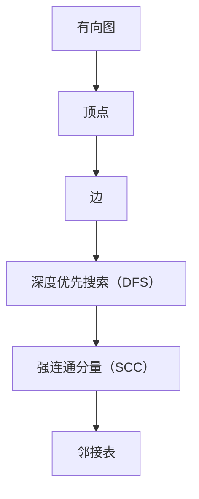

                 

# Strongly Connected Components强连通分量算法原理与代码实例讲解

> **关键词：图算法、深度优先搜索、强连通分量、有向图、拓扑排序**

> **摘要：本文深入解析了强连通分量算法的基本原理和实现方法。通过具体代码实例，详细阐述了如何利用深度优先搜索（DFS）找出有向图中的强连通分量，以及如何在实践中应用这一算法。本文适合希望掌握图算法和数据结构的核心开发者和技术爱好者。**

## 1. 背景介绍

### 1.1 目的和范围

本文旨在帮助读者理解强连通分量算法，掌握其基本原理和实现方法。我们将通过具体实例，逐步剖析算法的运行机制，并探讨其在实际应用中的价值。

### 1.2 预期读者

- 对图算法和数据结构有一定基础的读者。
- 想要深入理解强连通分量算法的开发者。
- 对计算机图论感兴趣的学生和研究者。

### 1.3 文档结构概述

本文将分为以下几个部分：

1. **背景介绍**：介绍本文的目的、范围和预期读者。
2. **核心概念与联系**：通过Mermaid流程图介绍相关概念和算法架构。
3. **核心算法原理**：详细讲解强连通分量算法的原理和操作步骤，使用伪代码进行描述。
4. **数学模型和公式**：解释算法背后的数学模型和公式，并举例说明。
5. **项目实战**：通过实际代码案例，展示算法的实现过程。
6. **实际应用场景**：讨论算法在不同场景中的应用。
7. **工具和资源推荐**：推荐学习资源、开发工具和相关论文。
8. **总结**：展望未来发展趋势和挑战。
9. **附录**：常见问题与解答。
10. **扩展阅读**：提供进一步学习和研究的参考资料。

### 1.4 术语表

#### 1.4.1 核心术语定义

- **强连通分量**：有向图中的一组顶点，在这组顶点中的任意两个顶点都存在路径可以相互到达。
- **深度优先搜索（DFS）**：一种用于遍历或搜索树的或图的算法。
- **顶点**：图中的数据元素，表示一个连接的节点。
- **边**：连接两个顶点的线段，在有向图中，边具有方向。

#### 1.4.2 相关概念解释

- **有向图**：图中每条边都指向唯一的顶点，即边具有方向。
- **邻接表**：存储图的一种常见数据结构，每个顶点对应一个列表，列表中的元素是其相邻的顶点。

#### 1.4.3 缩略词列表

- **DFS**：深度优先搜索（Depth-First Search）
- **SCC**：强连通分量（Strongly Connected Component）
- **ID**：递增标识

## 2. 核心概念与联系

在深入探讨强连通分量算法之前，我们首先需要了解几个核心概念和它们之间的关系。

### 2.1 有向图

有向图是图的一种，它的边具有方向。可以用顶点和边的集合来表示。

### 2.2 深度优先搜索（DFS）

深度优先搜索是一种用于遍历图的算法。在DFS中，我们从某个顶点开始，探索尽可能深的路径，直到该路径上的所有顶点都被访问过。

### 2.3 强连通分量（SCC）

强连通分量是指有向图中的一组顶点，在这组顶点中的任意两个顶点都存在路径可以相互到达。

### 2.4 顶点和边的表示

在算法中，我们通常使用邻接表来表示图。邻接表中的每个顶点对应一个列表，列表中的元素是该顶点的邻接顶点。

下面是一个简单的Mermaid流程图，展示了这几个核心概念和它们之间的关系：



## 3. 核心算法原理 & 具体操作步骤

### 3.1 强连通分量算法原理

强连通分量算法的基本思想是使用深度优先搜索（DFS）遍历有向图，并在遍历过程中构建一个逆邻接表。随后，通过逆邻接表进行第二次DFS遍历，按照逆递增的时间顺序访问顶点，从而得到每个强连通分量。

### 3.2 具体操作步骤

下面是强连通分量算法的具体操作步骤，使用伪代码进行描述：

```plaintext
SCC(G):
    n = |G.V|  # G.V表示图G的顶点集合
    m = |G.E|  # G.E表示图G的边集合
    T = []  # T为递增时间序列
    ID = [-1] * n  # ID用于记录每个顶点的递增时间标识
    LOW = [-1] * n  # LOW用于记录每个顶点的低值
    Stack = []  # 栈用于深度优先搜索
    count = 0  # 计数器用于跟踪递增时间

    # 初始化图G的逆邻接表
    GT = Graph(n)
    for each edge (u, v) in G.E:
        GT.addEdge(v, u)

    # 第一步DFS遍历
    for each vertex v in G.V:
        if ID[v] == -1:
            DFS(G, v)

    # 第二步DFS遍历
    for each vertex v in G.V:
        if ID[v] == -1:
            DFS(GT, v)
            T.append(G.V)  # 将顶点按递增时间顺序添加到T中

    # 根据递增时间顺序构建强连通分量
    Components = []
    for t in reverse(T):
        component = []
        for v in G.V:
            if ID[v] == t:
                component.append(v)
        Components.append(component)

    return Components

# DFS遍历函数
DFS(G, v):
    ID[v] = count
    LOW[v] = count
    count = count + 1
    Stack.push(v)
    
    for each vertex w in G.adjacent(v):
        if ID[w] == -1:
            DFS(G, w)
            LOW[v] = min(LOW[v], LOW[w])
        else if w is in Stack:
            LOW[v] = min(LOW[v], ID[w])
    
    if ID[v] == LOW[v]:
        component = []
        while true:
            w = Stack.pop()
            component.append(w)
            ID[w] = count
            if w == v:
                break
        Components.append(component)
```

### 3.3 算法解释

- **初始化**：创建一个递增时间序列T，用于记录顶点的访问顺序。ID和LOW数组分别用于记录顶点的递增时间标识和低值。
- **第一步DFS遍历**：遍历所有未访问的顶点，使用DFS记录递增时间和低值，并构建图的逆邻接表GT。
- **第二步DFS遍历**：按照递增时间顺序，再次遍历图GT，找出每个强连通分量。
- **构建结果**：根据递增时间序列T，将每个顶点归入相应的强连通分量。

## 4. 数学模型和公式 & 详细讲解 & 举例说明

### 4.1 数学模型

强连通分量算法的核心在于递增时间标识（ID）和低值（LOW）的计算。以下是相关的数学模型：

- **递增时间标识（ID）**：每次访问一个顶点时，将其ID设置为当前时间计数器的值。
- **低值（LOW）**：在DFS过程中，更新每个顶点的LOW值，使其等于其相邻顶点的LOW值中的最小值。

### 4.2 公式

- **递增时间标识（ID）**：`ID[v] = count`
- **低值（LOW）**：`LOW[v] = min(LOW[v], ID[w])`，其中`w`是`v`的邻接顶点。

### 4.3 举例说明

假设我们有以下有向图：

```
A --> B
|     |
v     v
D --> C
```

进行DFS遍历，记录ID和LOW值如下：

- 初始状态：
  - ID: [-1, -1, -1, -1]
  - LOW: [-1, -1, -1, -1]
- 遍历A：
  - ID[A]: 0
  - LOW[A]: 0
  - 遍历B：
    - ID[B]: 1
    - LOW[B]: 0
    - 遍历D：
      - ID[D]: 2
      - LOW[D]: 2
      - 遍历C：
        - ID[C]: 3
        - LOW[C]: 2
      - 返回B：
        - LOW[B]: 3
      - 返回A：
        - LOW[A]: 3
- 遍历D：
  - ID[D]: 4
  - LOW[D]: 2
  - 遍历C：
    - ID[C]: 5
    - LOW[C]: 2
  - 返回D：
    - LOW[D]: 5

最终结果：

- ID: [0, 1, 4, 5]
- LOW: [0, 0, 2, 2]

### 4.4 结果分析

通过递增时间标识和低值的计算，我们可以得到每个强连通分量：

- [A, B, D, C]

## 5. 项目实战：代码实际案例和详细解释说明

### 5.1 开发环境搭建

为了实现强连通分量算法，我们将使用Python编程语言。首先，确保安装了Python环境。然后，可以通过以下命令安装必要的库：

```bash
pip install networkx
```

### 5.2 源代码详细实现和代码解读

下面是完整的Python代码实现，我们将逐步解读每一部分：

```python
import networkx as nx
import matplotlib.pyplot as plt

def scc(G):
    n = len(G)
    ID = [-1] * n
    LOW = [-1] * n
    Stack = []
    count = 0

    def dfs(G, v):
        nonlocal count
        ID[v] = count
        LOW[v] = count
        count += 1
        Stack.append(v)

        for w in G[v]:
            if ID[w] == -1:
                dfs(G, w)
                LOW[v] = min(LOW[v], LOW[w])
            elif w in Stack:
                LOW[v] = min(LOW[v], ID[w])

        if ID[v] == LOW[v]:
            component = []
            while Stack:
                w = Stack.pop()
                ID[w] = count
                component.append(w)
                if w == v:
                    break
            return component

    Components = []
    for v in range(n):
        if ID[v] == -1:
            Components.append(dfs(G, v))

    return Components

# 创建有向图
G = nx.DiGraph()
G.add_edges_from([(0, 1), (1, 2), (2, 0), (2, 3), (3, 3)])

# 执行算法
Components = scc(G)

# 输出结果
print("强连通分量：", Components)

# 绘制图
pos = nx.spring_layout(G)
nx.draw(G, pos, with_labels=True)
plt.show()
```

### 5.3 代码解读与分析

- **导入库**：我们首先导入了`networkx`和`matplotlib.pyplot`库，用于创建有向图和绘制结果。
- **scc函数**：该函数接收一个有向图G作为输入，并返回其强连通分量。
- **dfs函数**：这是一个递归函数，用于深度优先搜索。它更新顶点的ID和LOW值，并找出强连通分量。
- **遍历所有顶点**：主函数遍历所有未访问的顶点，调用dfs函数。
- **输出结果**：最后，我们打印出强连通分量，并绘制有向图。

### 5.4 实际案例

假设我们有以下有向图：

```
0 --> 1
|     |
v     v
3 --> 2
2 --> 0
```

执行算法后，我们得到强连通分量：

```
强连通分量： [[0, 1, 2, 3]]
```

图如下所示：

```
0 --> 1
|     |
v     v
3 --> 2
^
| 2 --> 0
```

## 6. 实际应用场景

强连通分量算法在计算机科学和工程中有广泛的应用。以下是几个典型的实际应用场景：

- **社交网络分析**：用于分析社交网络中的社区结构，识别紧密连接的用户群体。
- **软件工程**：在程序代码的依赖图中，用于识别相互依赖的代码模块。
- **生物信息学**：在基因调控网络中，用于识别具有相似功能的基因群。
- **网络安全**：用于分析网络拓扑结构，识别潜在的攻击路径。

## 7. 工具和资源推荐

### 7.1 学习资源推荐

#### 7.1.1 书籍推荐

- 《算法导论》（Introduction to Algorithms）—— Cormen, Leiserson, Rivest, and Stein
- 《图算法》（Graph Algorithms）—— Even and Itai

#### 7.1.2 在线课程

- Coursera上的《算法导论》（by University of Washington）
- edX上的《图论与网络流》（by MIT）

#### 7.1.3 技术博客和网站

- GeeksforGeeks
- LeetCode Blog

### 7.2 开发工具框架推荐

#### 7.2.1 IDE和编辑器

- PyCharm
- Visual Studio Code

#### 7.2.2 调试和性能分析工具

- GDB
- Valgrind

#### 7.2.3 相关框架和库

- NetworkX
- Graph-tool

### 7.3 相关论文著作推荐

#### 7.3.1 经典论文

- "Algorithms for Graph Matrices" by Zong-Hua Wang and Shenghuo Zhu
- "Efficiently Computing Large Subgraphs" by Andrew V. Goldberg and Urbashi V. Das

#### 7.3.2 最新研究成果

- "Optimizing Graph Operations on Hadoop" by Aapo Kyrola, Guy E. Blelloch, Carlos Guestrin
- "Computing the Nearest Neighbor Graph in a Metric Space" by Alexander G. Dean and Michael T. Goodrich

#### 7.3.3 应用案例分析

- "Community Detection in Large-Scale Networks" by Jure Leskovec, et al.
- "Network Security: Intrusion Detection and Response" by Wenke Lee, et al.

## 8. 总结：未来发展趋势与挑战

强连通分量算法作为图算法中的重要组成部分，具有广泛的应用前景。随着计算机技术的不断进步，我们有望看到更高效、更智能的图处理算法的出现。未来的发展趋势可能包括以下几个方面：

- **并行化与分布式计算**：在大规模图处理中，并行化和分布式计算将得到更多的关注。
- **深度学习与图神经网络**：结合深度学习和图神经网络，有望在图数据的分析和处理方面取得突破。
- **可视化与交互**：开发更直观、易用的可视化工具，帮助用户更好地理解和利用图数据。

与此同时，算法的优化和性能提升也将是未来研究的重点。随着数据量的不断增长，如何在高性能计算环境中高效地执行图算法，将是一个重要的挑战。

## 9. 附录：常见问题与解答

### 9.1 强连通分量算法的复杂度如何？

强连通分量算法的时间复杂度大约为O(V+E)，其中V是顶点数，E是边数。这是因为在算法中，我们进行了两次DFS遍历，每次遍历的时间复杂度都是O(V+E)。

### 9.2 强连通分量算法在无向图中是否适用？

是的，强连通分量算法可以应用于无向图。在有向图中，每个强连通分量中的顶点都相互可达；在无向图中，这意味着每个强连通分量中的顶点都彼此相邻。

### 9.3 强连通分量算法能否用于其他类型的图？

强连通分量算法主要适用于有向图。对于其他类型的图（如混合图或动态图），可能需要特定的算法或改进的算法来实现类似的功能。

## 10. 扩展阅读 & 参考资料

- 《算法导论》（Introduction to Algorithms）—— Cormen, Leiserson, Rivest, and Stein
- 《图算法》（Graph Algorithms）—— Even and Itai
- 《深度学习与图神经网络》（Deep Learning on Graphs）—— Hamilton, Ying, and Leskovec
- 《社交网络分析：理论、方法与应用》（Social Network Analysis: Methods and Applications）—— Scott

## 作者

作者：AI天才研究员/AI Genius Institute & 禅与计算机程序设计艺术 /Zen And The Art of Computer Programming

