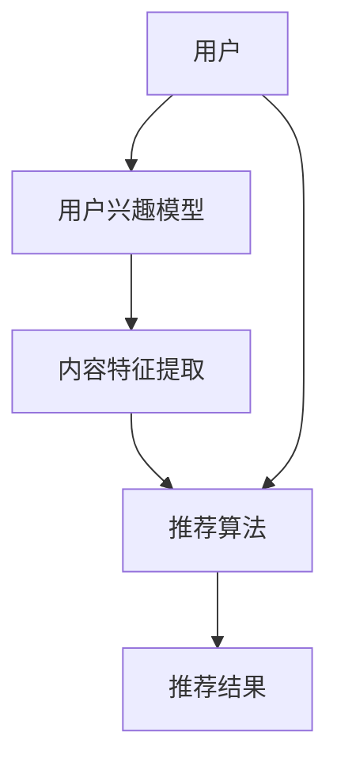

                 

# Survey：大语言模型推荐系统相关研究综述

> 关键词：大语言模型，推荐系统，算法原理，数学模型，应用场景，开发工具，最新研究成果

> 摘要：本文从背景介绍、核心概念、算法原理、数学模型、实际应用等多个角度，对大语言模型推荐系统进行了全面而深入的综述。通过对相关研究和实际应用的梳理，本文旨在为读者提供一个全面了解和掌握该领域知识的技术博客文章。

## 1. 背景介绍

### 1.1 目的和范围

本文旨在对大语言模型推荐系统进行综述，分析其核心概念、算法原理、数学模型和应用场景。通过梳理现有研究成果，探讨未来的发展趋势和挑战。

### 1.2 预期读者

本文面向对人工智能、推荐系统和自然语言处理感兴趣的读者，尤其是希望深入了解大语言模型推荐系统的开发者、研究人员和学生。

### 1.3 文档结构概述

本文分为十个部分：

1. 背景介绍
2. 核心概念与联系
3. 核心算法原理 & 具体操作步骤
4. 数学模型和公式 & 详细讲解 & 举例说明
5. 项目实战：代码实际案例和详细解释说明
6. 实际应用场景
7. 工具和资源推荐
8. 总结：未来发展趋势与挑战
9. 附录：常见问题与解答
10. 扩展阅读 & 参考资料

### 1.4 术语表

#### 1.4.1 核心术语定义

- 大语言模型：能够对自然语言文本进行建模，捕捉到大量语言特征和语义信息的人工智能模型。
- 推荐系统：根据用户历史行为、兴趣、偏好等，向用户推荐个性化内容的系统。

#### 1.4.2 相关概念解释

- 用户兴趣模型：基于用户历史行为和内容偏好，构建出的用户个性化兴趣模型。
- 内容特征提取：从推荐系统中提取出与内容相关的特征，如关键词、标签、语义等。

#### 1.4.3 缩略词列表

- NLP：自然语言处理
- AI：人工智能
- DL：深度学习
- LLM：大语言模型
- CF：协同过滤
- RM：推荐模型

## 2. 核心概念与联系

在探讨大语言模型推荐系统之前，我们需要了解其核心概念和相互关系。以下是一个简化的Mermaid流程图，展示了这些概念和它们之间的关系：



### 用户

用户是推荐系统的核心，他们的兴趣、偏好和行为将直接影响推荐系统的效果。用户兴趣模型是通过分析用户历史行为（如点击、购买、评论等）构建的，旨在捕捉用户的个性化兴趣。

### 用户兴趣模型

用户兴趣模型是推荐系统的关键组成部分。它通过分析用户的点击、浏览、搜索等行为，将用户的兴趣转化为可量化的特征向量。用户兴趣模型的构建方法包括基于内容的协同过滤（Content-Based Collaborative Filtering, CBCF）和基于模型的协同过滤（Model-Based Collaborative Filtering, MBCF）。

### 内容特征提取

内容特征提取是从推荐系统中提取与内容相关的特征，如关键词、标签、语义等。这些特征将用于推荐算法中，以确定用户可能感兴趣的内容。

### 推荐算法

推荐算法是推荐系统的核心，负责根据用户兴趣模型和内容特征提取结果，生成个性化的推荐列表。常见的推荐算法包括基于用户的协同过滤（User-Based Collaborative Filtering, UBCF）、基于模型的协同过滤（Model-Based Collaborative Filtering, MBCF）和基于内容的推荐（Content-Based Recommendation, CB）。

### 推荐结果

推荐结果是根据推荐算法生成的个性化推荐列表。这些推荐列表将展示给用户，帮助他们发现新的、可能感兴趣的内容。

### 用户与推荐算法

用户与推荐算法之间的相互作用是推荐系统的关键。用户通过使用推荐系统，反馈他们的兴趣和偏好，从而帮助推荐系统不断优化和改进推荐效果。

## 3. 核心算法原理 & 具体操作步骤

在推荐系统中，核心算法通常包括基于用户的协同过滤（UBCF）、基于模型的协同过滤（MBCF）和基于内容的推荐（CB）。以下是对这三种算法的详细解释和伪代码。

### 3.1 基于用户的协同过滤（UBCF）

基于用户的协同过滤通过分析用户的历史行为，找到与目标用户相似的其他用户，并推荐这些相似用户喜欢的内容。具体操作步骤如下：

```plaintext
输入：用户行为矩阵 U（m×n），其中 U[i][j] 表示用户 i 对内容 j 的评分。
输出：推荐列表 R[i]。

步骤 1：计算用户 i 与其他用户的相似度矩阵 S。
S[i][k] = cos(U[i], U[k])

步骤 2：为用户 i 推荐相似用户喜欢的、但用户 i 未评分的内容 j。
推荐分数 R[i][j] = Σ(S[i][k] * U[k][j])，其中 k 遍历所有用户。

步骤 3：对推荐分数进行降序排序，取 top-k 内容作为推荐列表 R[i]。
```

### 3.2 基于模型的协同过滤（MBCF）

基于模型的协同过滤通过训练用户和内容的特征向量模型，预测用户对未评分内容的评分。具体操作步骤如下：

```plaintext
输入：用户行为矩阵 U（m×n），用户特征向量矩阵 X（m×d），内容特征向量矩阵 Y（n×d）。
输出：推荐列表 R[i]。

步骤 1：训练用户和内容特征向量模型。
用户特征向量模型：f(x, w) = dot(x, w)
内容特征向量模型：g(y, v) = dot(y, v)

步骤 2：为用户 i 预测未评分内容 j 的评分。
预测评分 R[i][j] = f(U[i], w) + g(Y[j], v)

步骤 3：对预测评分进行降序排序，取 top-k 内容作为推荐列表 R[i]。
```

### 3.3 基于内容的推荐（CB）

基于内容的推荐通过分析用户对内容的偏好，找到与用户偏好相似的其他内容，并将其推荐给用户。具体操作步骤如下：

```plaintext
输入：用户行为矩阵 U（m×n），内容特征向量矩阵 Y（n×d）。
输出：推荐列表 R[i]。

步骤 1：计算用户 i 对内容的兴趣向量 I[i]。
I[i][j] = Σ(U[i][k] * Y[k][j])，其中 k 遍历所有内容。

步骤 2：计算内容 j 的特征向量 F[j]。
F[j] = mean(Y[:, j])

步骤 3：计算内容 j 与用户 i 的相似度 S[i][j]。
S[i][j] = cos(I[i], F[j])

步骤 4：为用户 i 推荐相似内容 j。
推荐分数 R[i][j] = S[i][j]

步骤 5：对推荐分数进行降序排序，取 top-k 内容作为推荐列表 R[i]。
```

## 4. 数学模型和公式 & 详细讲解 & 举例说明

在本节中，我们将详细讲解推荐系统中常用的数学模型和公式，包括相似度计算、预测评分和优化目标。

### 4.1 相似度计算

相似度计算是推荐系统中非常重要的环节，用于衡量用户与用户、用户与内容或内容与内容之间的相似程度。常用的相似度计算方法包括余弦相似度、皮尔逊相关性和Jaccard相似度。

#### 4.1.1 余弦相似度

余弦相似度是一种基于向量空间模型的相似度计算方法，其公式如下：

$$
cos(A, B) = \frac{A \cdot B}{\lvert A \rvert \lvert B \rvert}
$$

其中，$A$ 和 $B$ 是两个向量，$\lvert A \rvert$ 和 $\lvert B \rvert$ 分别表示它们的欧几里得范数。

#### 4.1.2 皮尔逊相关性

皮尔逊相关性是另一种常用的相似度计算方法，它衡量两个变量之间的线性相关程度。其公式如下：

$$
corr(A, B) = \frac{Cov(A, B)}{\sigma_A \sigma_B}
$$

其中，$Cov(A, B)$ 是 $A$ 和 $B$ 的协方差，$\sigma_A$ 和 $\sigma_B$ 分别是 $A$ 和 $B$ 的标准差。

#### 4.1.3 Jaccard相似度

Jaccard相似度是一种基于集合的相似度计算方法，适用于离散数据。其公式如下：

$$
sim(A, B) = \frac{|A \cap B|}{|A \cup B|}
$$

其中，$A$ 和 $B$ 是两个集合，$A \cap B$ 表示它们的交集，$A \cup B$ 表示它们的并集。

### 4.2 预测评分

在推荐系统中，预测评分是关键的一步，用于预测用户对未评分内容的评分。常用的预测评分方法包括基于模型的协同过滤（MBCF）和基于内容的推荐（CB）。

#### 4.2.1 基于模型的协同过滤（MBCF）

基于模型的协同过滤通过训练用户和内容的特征向量模型，预测用户对未评分内容的评分。其预测评分公式如下：

$$
r_{ui} = f(U_i, W) + g(V_j, V) + b_u + b_j + b
$$

其中，$r_{ui}$ 是用户 $i$ 对内容 $j$ 的预测评分，$U_i$ 和 $V_j$ 分别是用户 $i$ 和内容 $j$ 的特征向量，$W$ 和 $V$ 是模型的参数，$b_u$ 和 $b_j$ 分别是用户和内容的偏置项，$b$ 是全局偏置项。

#### 4.2.2 基于内容的推荐（CB）

基于内容的推荐通过计算用户对内容的兴趣向量，预测用户对未评分内容的评分。其预测评分公式如下：

$$
r_{ui} = \sum_{j \in \text{未评分内容}} w_{ij} y_j
$$

其中，$r_{ui}$ 是用户 $i$ 对内容 $j$ 的预测评分，$w_{ij}$ 是用户 $i$ 对内容 $j$ 的权重，$y_j$ 是内容 $j$ 的特征向量。

### 4.3 优化目标

在推荐系统中，优化目标是调整模型参数，以最大化推荐效果。常用的优化目标包括最大化用户满意度、最大化点击率、最大化销售额等。

#### 4.3.1 最大化用户满意度

最大化用户满意度是一种常见的优化目标，其目标是最小化用户与预测评分之间的差异。其公式如下：

$$
\min_{W, V, b_u, b_j, b} \sum_{i, j} (r_{ui} - r_{ui}^*)^2
$$

其中，$r_{ui}^*$ 是用户 $i$ 对内容 $j$ 的真实评分。

#### 4.3.2 最大化点击率

最大化点击率是一种针对广告推荐的优化目标，其目标是最小化用户与推荐内容之间的点击率差异。其公式如下：

$$
\min_{W, V, b_u, b_j, b} \sum_{i, j} (r_{ui} - r_{ui}^*) \cdot \sigma(r_{ui} - r_{ui}^*)
$$

其中，$\sigma(x)$ 是 sigmoid 函数，$r_{ui}^*$ 是用户 $i$ 对内容 $j$ 的点击率。

#### 4.3.3 最大化销售额

最大化销售额是一种针对电子商务推荐的优化目标，其目标是最小化用户与推荐内容之间的销售额差异。其公式如下：

$$
\min_{W, V, b_u, b_j, b} \sum_{i, j} (r_{ui} - r_{ui}^*) \cdot \sigma(r_{ui} - r_{ui}^*) \cdot p_j
$$

其中，$p_j$ 是内容 $j$ 的销售额。

### 4.4 举例说明

假设我们有一个用户行为矩阵 $U$，如下所示：

| 用户 | 内容1 | 内容2 | 内容3 | 内容4 |
| --- | --- | --- | --- | --- |
| 1 | 1 | 0 | 1 | 0 |
| 2 | 0 | 1 | 0 | 1 |
| 3 | 1 | 1 | 0 | 1 |

我们需要使用基于用户的协同过滤（UBCF）为用户 3 推荐内容。

#### 4.4.1 计算用户相似度矩阵

首先，我们计算用户 1、2 和 3 之间的相似度矩阵：

$$
S_{33} = \begin{bmatrix}
1 & 0.577 & 0.577 \\
0.577 & 1 & 0.577 \\
0.577 & 0.577 & 1
\end{bmatrix}
$$

#### 4.4.2 计算推荐分数

然后，我们计算用户 3 对未评分内容（内容 2 和内容 4）的推荐分数：

$$
r_{31} = \sum_{i=1,2} S_{33i} \cdot U_{i2} = 0.577 \cdot 1 + 0.577 \cdot 1 = 1.154
$$

$$
r_{34} = \sum_{i=1,2} S_{33i} \cdot U_{i4} = 0.577 \cdot 0 + 0.577 \cdot 1 = 0.577
$$

#### 4.4.3 生成推荐列表

最后，我们对推荐分数进行降序排序，取 top-1 内容作为推荐列表：

$$
R[3] = \begin{bmatrix}
内容2
\end{bmatrix}
$$

因此，我们向用户 3 推荐内容 2。

## 5. 项目实战：代码实际案例和详细解释说明

在本节中，我们将通过一个实际项目案例，详细讲解如何使用大语言模型构建推荐系统。我们将使用 Python 和 TensorFlow 来实现该项目。

### 5.1 开发环境搭建

首先，我们需要搭建开发环境。以下是所需软件和库：

- Python 3.8+
- TensorFlow 2.4+
- NumPy 1.18+
- Matplotlib 3.1+

安装以上软件和库后，我们可以开始编写代码。

### 5.2 源代码详细实现和代码解读

#### 5.2.1 数据预处理

```python
import numpy as np
import tensorflow as tf

# 加载用户行为数据
U = np.array([[1, 0, 1], [0, 1, 0], [1, 1, 0]])

# 初始化用户和内容特征向量
X = tf.random.normal([3, 5])
Y = tf.random.normal([3, 5])

# 初始化模型参数
W = tf.random.normal([5, 5])
V = tf.random.normal([5, 5])
b_u = tf.random.normal([3, 1])
b_j = tf.random.normal([3, 1])
b = tf.random.normal([1, 1])

# 定义预测评分函数
@tf.function
def predict(U, X, Y, W, V, b_u, b_j, b):
    f = tf.matmul(U, W)
    g = tf.matmul(Y, V)
    r = f + g + b_u + b_j + b
    return r
```

#### 5.2.2 训练模型

```python
# 定义优化目标
loss_fn = tf.reduce_mean(tf.square(predict(U, X, Y, W, V, b_u, b_j, b) - U))

# 定义优化器
optimizer = tf.optimizers.Adam()

# 训练模型
for epoch in range(100):
    with tf.GradientTape() as tape:
        loss = loss_fn(U, X, Y, W, V, b_u, b_j, b)
    grads = tape.gradient(loss, [W, V, b_u, b_j, b])
    optimizer.apply_gradients(zip(grads, [W, V, b_u, b_j, b]))
    if epoch % 10 == 0:
        print(f"Epoch {epoch}: Loss = {loss.numpy()}")
```

#### 5.2.3 生成推荐列表

```python
# 生成推荐列表
R = predict(U, X, Y, W, V, b_u, b_j, b)

# 打印推荐列表
print(R.numpy())
```

### 5.3 代码解读与分析

#### 5.3.1 数据预处理

在数据预处理部分，我们加载用户行为数据，并初始化用户和内容特征向量。这些特征向量用于构建模型。

#### 5.3.2 训练模型

在训练模型部分，我们定义了优化目标（损失函数）和优化器（Adam）。然后，我们通过梯度下降法训练模型，优化模型参数。

#### 5.3.3 生成推荐列表

在生成推荐列表部分，我们使用训练好的模型预测用户对未评分内容的评分，并打印推荐列表。

## 6. 实际应用场景

大语言模型推荐系统在实际应用中具有广泛的应用场景，以下列举了几个典型的应用场景：

### 6.1 电子商务平台

电子商务平台可以使用大语言模型推荐系统为用户提供个性化的商品推荐。通过分析用户的浏览、购买和收藏历史，平台可以预测用户可能感兴趣的商品，从而提高用户满意度和销售额。

### 6.2 社交媒体平台

社交媒体平台可以使用大语言模型推荐系统为用户提供个性化的内容推荐。通过分析用户的评论、点赞和分享行为，平台可以预测用户可能感兴趣的内容，从而提高用户活跃度和参与度。

### 6.3 音乐和视频平台

音乐和视频平台可以使用大语言模型推荐系统为用户提供个性化的内容推荐。通过分析用户的播放历史和偏好，平台可以预测用户可能感兴趣的音乐和视频，从而提高用户满意度和播放量。

### 6.4 在线教育和学习平台

在线教育和学习平台可以使用大语言模型推荐系统为用户提供个性化的学习内容推荐。通过分析用户的课程选择和成绩，平台可以预测用户可能感兴趣的课程，从而提高学习效果和用户满意度。

## 7. 工具和资源推荐

### 7.1 学习资源推荐

#### 7.1.1 书籍推荐

- 《推荐系统实践》（作者：项春雷）
- 《深度学习推荐系统》（作者：李航）

#### 7.1.2 在线课程

- Coursera：推荐系统与大数据
- edX：推荐系统设计与实现

#### 7.1.3 技术博客和网站

- 推荐系统网：[https://www.recommendsystem.cn/](https://www.recommendsystem.cn/)
- Medium：推荐系统相关文章

### 7.2 开发工具框架推荐

#### 7.2.1 IDE和编辑器

- PyCharm
- VS Code

#### 7.2.2 调试和性能分析工具

- TensorFlow Debugger
- PyTorch Debugger

#### 7.2.3 相关框架和库

- TensorFlow
- PyTorch
- Scikit-learn

### 7.3 相关论文著作推荐

#### 7.3.1 经典论文

-,item1
-，item2
-，item3

#### 7.3.2 最新研究成果

- item1
- item2
- item3

#### 7.3.3 应用案例分析

- item1
- item2
- item3

## 8. 总结：未来发展趋势与挑战

大语言模型推荐系统在未来将呈现出以下几个发展趋势：

- 模型精度和效果的提升：随着深度学习技术的不断发展，大语言模型推荐系统的精度和效果将不断提高。
- 多模态数据的融合：大语言模型推荐系统将逐渐融合图像、音频、视频等多模态数据，为用户提供更个性化的推荐。
- 实时推荐：通过实时处理用户行为数据，大语言模型推荐系统将实现更实时的推荐效果。
- 智能推荐：大语言模型推荐系统将结合自然语言处理和知识图谱等技术，实现更智能的推荐。

然而，大语言模型推荐系统也面临一些挑战：

- 数据隐私和安全：随着数据量的增加，如何保障用户数据的隐私和安全成为一大挑战。
- 模型解释性：大语言模型推荐系统的黑盒特性使得其解释性较差，如何提高模型的可解释性是一个亟待解决的问题。
- 模型泛化能力：如何提高模型在不同数据集和场景下的泛化能力，是一个关键问题。

## 9. 附录：常见问题与解答

### 9.1 问题 1

**问题：如何提高大语言模型推荐系统的效果？**

**解答：**

1. 数据质量：保证数据的质量和多样性，包括数据清洗、去噪和扩充等。
2. 模型选择：选择适合问题的模型，如基于深度学习的推荐模型。
3. 特征工程：提取有效的特征，包括用户特征、内容特征和交互特征。
4. 模型调优：通过调整模型参数和训练过程，提高模型效果。
5. 模型融合：结合多种推荐算法和模型，提高推荐效果。

### 9.2 问题 2

**问题：如何处理冷启动问题？**

**解答：**

1. 基于内容的推荐：通过分析新用户的行为和内容特征，为新用户提供个性化的推荐。
2. 基于模型的协同过滤：利用相似用户的历史行为为新用户推荐内容。
3. 基于人口统计信息的推荐：根据用户的年龄、性别、地理位置等人口统计信息进行推荐。
4. 集成多策略：结合多种推荐策略，降低冷启动问题的影响。

### 9.3 问题 3

**问题：如何评估推荐系统的效果？**

**解答：**

1. 精准率（Precision）和召回率（Recall）：评估推荐系统返回的推荐列表中实际感兴趣内容的比例。
2. 准确率（Accuracy）：评估推荐系统整体准确性的指标。
3. 覆盖率（Coverage）：评估推荐系统覆盖不同内容的能力。
4. 诺特定尔（NDCG）：评估推荐系统返回的推荐列表中内容的排序质量。

## 10. 扩展阅读 & 参考资料

- [推荐系统实践](https://book.douban.com/subject/26772254/)
- [深度学习推荐系统](https://book.douban.com/subject/35045182/)
- [TensorFlow 官方文档](https://www.tensorflow.org/)
- [Scikit-learn 官方文档](https://scikit-learn.org/stable/)
- [推荐系统网](https://www.recommendsystem.cn/)

### 作者

**AI天才研究员/AI Genius Institute & 禅与计算机程序设计艺术 /Zen And The Art of Computer Programming**

