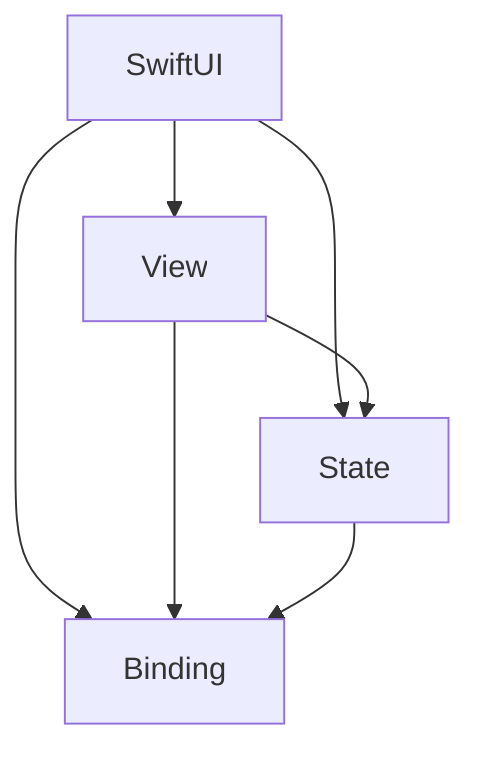
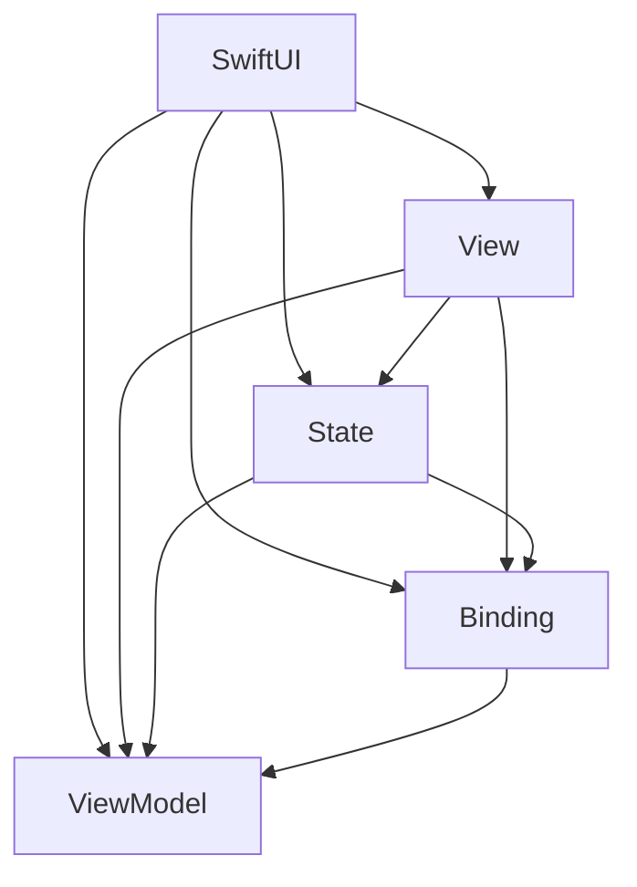

                 

# SwiftUI 框架：苹果的声明式 UI 框架

> 关键词：SwiftUI，声明式 UI，框架，苹果，设计模式，界面构建，响应式编程，iOS开发，macOS开发，watchOS开发，tvOS开发，用户体验

> 摘要：本文将深入探讨SwiftUI框架，这是一套由苹果公司推出的声明式UI编程框架。我们将了解SwiftUI的核心概念、设计模式、架构，并通过具体示例和代码分析，掌握其使用方法和技巧。同时，我们将探讨SwiftUI在不同平台上的应用，以及其在未来发展趋势和挑战中所扮演的角色。

## 1. 背景介绍

### 1.1 目的和范围

本文旨在为开发者提供对SwiftUI框架的全面理解，帮助读者掌握SwiftUI的核心概念、设计模式和应用技巧。通过本文的学习，读者将能够：

1. 理解SwiftUI的基本概念和优势。
2. 掌握SwiftUI的设计模式和架构。
3. 通过具体示例学习SwiftUI的使用方法和技巧。
4. 探讨SwiftUI在不同平台上的应用场景。
5. 分析SwiftUI的未来发展趋势和挑战。

### 1.2 预期读者

本文适合具有iOS、macOS、watchOS、tvOS等平台开发经验的开发者，以及对声明式UI编程和响应式编程有兴趣的读者。无论您是初学者还是经验丰富的开发者，本文都将为您提供丰富的知识和实践经验。

### 1.3 文档结构概述

本文结构如下：

1. 引言：介绍SwiftUI的基本概念和优势。
2. 核心概念与联系：分析SwiftUI的核心概念和架构。
3. 核心算法原理与具体操作步骤：讲解SwiftUI的核心算法和具体实现。
4. 数学模型和公式：介绍SwiftUI中的数学模型和公式。
5. 项目实战：通过实际案例展示SwiftUI的应用。
6. 实际应用场景：探讨SwiftUI在不同平台上的应用。
7. 工具和资源推荐：推荐学习和使用SwiftUI的资源。
8. 总结：总结SwiftUI的发展趋势和挑战。
9. 附录：常见问题与解答。
10. 扩展阅读：推荐相关学习资料。

### 1.4 术语表

#### 1.4.1 核心术语定义

- 声明式UI：一种基于描述式语言构建用户界面的方法，开发者通过编写代码描述UI组件的属性和行为，系统自动生成UI界面。
- 响应式编程：一种编程范式，能够自动响应数据变化并更新UI界面，提高开发效率和用户体验。
- SwiftUI：由苹果公司推出的一套声明式UI编程框架，支持iOS、macOS、watchOS、tvOS等多个平台。
- View：SwiftUI中的UI组件，表示UI界面的外观和布局。
- State：表示UI组件的状态，如文本内容、颜色等。
- Binding：用于绑定UI组件的状态，实现数据同步。

#### 1.4.2 相关概念解释

- 声明式编程：一种编程范式，开发者通过描述式语言编写代码，系统自动生成执行逻辑。
- 响应式编程：一种基于数据流的编程范式，能够自动响应数据变化并更新UI界面。
- 模式匹配：一种编程技巧，通过匹配数据类型和值来执行不同的代码块。

#### 1.4.3 缩略词列表

- SwiftUI：Swift User Interface
- iOS：iPhone Operating System
- macOS：Mac Operating System
- watchOS：Apple Watch Operating System
- tvOS：Apple TV Operating System
- IDE：Integrated Development Environment
- UI：User Interface

## 2. 核心概念与联系

SwiftUI的核心概念包括View、State、Binding等。这些概念紧密相连，共同构成了SwiftUI的声明式UI编程框架。

### 2.1 SwiftUI架构图

以下是一个简单的SwiftUI架构图，展示了核心概念之间的联系：



### 2.2 SwiftUI核心概念解释

#### View

View是SwiftUI中的UI组件，表示UI界面的外观和布局。View可以包含文本、图片、按钮等元素，并通过属性描述其外观和行为。

```swift
struct ContentView: View {
    var body: some View {
        Text("Hello, World!")
    }
}
```

#### State

State表示UI组件的状态，如文本内容、颜色等。在SwiftUI中，State通过`@State`属性包装器声明。

```swift
struct CounterView: View {
    @State private var count = 0
    
    var body: some View {
        Button("Count") {
            withAnimation {
                count += 1
            }
        }.padding()
    }
}
```

#### Binding

Binding用于绑定UI组件的状态，实现数据同步。在SwiftUI中，Binding通过`@Binding`属性包装器声明。

```swift
struct GreetingView: View {
    @Binding var name: String
    
    var body: some View {
        Text("Hello, \(name)!")
    }
}
```

### 2.3 SwiftUI架构图

以下是一个更详细的SwiftUI架构图，展示了各个核心概念之间的关系：



- View：表示UI组件的外观和布局。
- State：表示UI组件的状态，如文本内容、颜色等。
- Binding：用于绑定UI组件的状态，实现数据同步。
- ViewModel：表示UI组件的逻辑处理，如数据获取、状态更新等。

## 3. 核心算法原理与具体操作步骤

SwiftUI的核心算法原理主要涉及响应式编程和声明式UI构建。以下是一个简单的SwiftUI示例，展示核心算法原理和具体操作步骤：

### 3.1 示例代码

```swift
struct ContentView: View {
    @State private var count = 0
    
    var body: some View {
        VStack {
            Text("Count: \(count)")
            Button("Increment") {
                count += 1
            }
        }
    }
}
```

### 3.2 核心算法原理

1. 响应式编程：SwiftUI使用响应式编程范式，能够自动响应状态变化并更新UI界面。当状态（如`count`）发生变化时，SwiftUI会自动更新UI组件（如`Text`和`Button`）。
2. 声明式UI构建：SwiftUI使用声明式UI构建方法，开发者通过编写代码描述UI组件的属性和行为，系统自动生成UI界面。在上面的示例中，`VStack`表示垂直堆叠布局，`Text`表示文本内容，`Button`表示按钮。

### 3.3 具体操作步骤

1. 声明一个`ContentView`结构体，继承自`View`协议。
2. 使用`@State`属性包装器声明一个`count`状态变量，初始化值为0。
3. 使用`var body: some View { ... }`方法定义`ContentView`的UI界面。
4. 在`body`方法中，使用`VStack`创建一个垂直堆叠布局。
5. 在`VStack`中，使用`Text`创建一个文本组件，显示`count`状态的值。
6. 在`VStack`中，使用`Button`创建一个按钮组件，当按钮被点击时，执行`count += 1`操作，更新`count`状态。

### 3.4 伪代码

```swift
struct ContentView: View {
    @State private var count = 0
    
    func incrementCount() {
        count += 1
    }
    
    var body: some View {
        VStack {
            Text("Count: \(count)")
            Button("Increment") {
                incrementCount()
            }
        }
    }
}
```

## 4. 数学模型和公式与详细讲解

SwiftUI中的数学模型和公式主要用于布局计算、动画处理和自定义组件。以下是一个简单的示例，展示数学模型和公式的使用：

### 4.1 示例代码

```swift
struct ContentView: View {
    @State private var width = 100.0
    @State private var height = 100.0
    
    var body: some View {
        Rectangle()
            .fill(.blue)
            .frame(width: width, height: height)
            .overlay(Text("Width: \(Int(width)) Height: \(Int(height))")
                .font(.title)
                .foregroundColor(.white))
            .onTapGesture {
                withAnimation {
                    width += 50
                    height += 50
                }
            }
    }
}
```

### 4.2 数学模型和公式

1. **布局计算**：SwiftUI使用一种基于弹性布局（elastic layout）的模型，通过一系列约束（constraint）来确定UI组件的大小和位置。以下是一个简单的布局计算示例：

   ```swift
   let widthConstraint = width / maxWidth
   let heightConstraint = height / maxHeight
   ```

   其中，`width`和`height`表示UI组件的宽度和高度，`maxWidth`和`maxHeight`表示容器的最大宽度和高度。

2. **动画处理**：SwiftUI使用动画（animation）来平滑地更新UI组件的状态。以下是一个简单的动画处理示例：

   ```swift
   withAnimation {
       width += 50
       height += 50
   }
   ```

   其中，`withAnimation`函数表示在动画过程中执行一系列状态更新。

3. **自定义组件**：SwiftUI允许开发者自定义组件，通过组合现有组件和数学模型来构建复杂的UI界面。以下是一个简单的自定义组件示例：

   ```swift
   struct CustomComponent: View {
       var body: some View {
           Circle()
               .fill(.red)
               .frame(width: widthConstraint * 50, height: heightConstraint * 50)
               .overlay(Text("\(Int(widthConstraint * 100))%")
                   .font(.title)
                   .foregroundColor(.white))
       }
   }
   ```

   其中，`widthConstraint`和`heightConstraint`表示自定义组件的宽度和高度。

### 4.3 举例说明

1. **布局计算举例**：

   ```swift
   struct ContentView: View {
       @State private var maxWidth = 300.0
       @State private var maxHeight = 300.0
   
       var body: some View {
           VStack {
               Rectangle()
                   .fill(.blue)
                   .frame(width: maxWidth * 0.5, height: maxHeight * 0.5)
               Rectangle()
                   .fill(.green)
                   .frame(width: maxWidth * 0.25, height: maxHeight * 0.25)
           }
       }
   }
   ```

   在这个示例中，我们使用`maxWidth`和`maxHeight`变量来控制容器的最大宽度和高度，通过乘以不同的系数来设置子视图的宽度和高度。

2. **动画处理举例**：

   ```swift
   struct ContentView: View {
       @State private var width = 100.0
       @State private var height = 100.0
   
       var body: some View {
           Rectangle()
               .fill(.blue)
               .frame(width: width, height: height)
               .onTapGesture {
                   withAnimation {
                       width = 200.0
                       height = 200.0
                   }
               }
       }
   }
   ```

   在这个示例中，我们使用`withAnimation`函数来创建一个平滑的动画，当用户点击按钮时，矩形视图的宽度和高度会逐渐从100增加到200。

3. **自定义组件举例**：

   ```swift
   struct CustomComponent: View {
       var body: some View {
           Circle()
               .fill(.red)
               .frame(width: 100, height: 100)
               .overlay(Text("100%")
                   .font(.title)
                   .foregroundColor(.white))
       }
   }
   ```

   在这个示例中，我们创建了一个简单的自定义组件`CustomComponent`，它包含一个红色的圆形背景和一个白色的文本标签，表示组件的百分比。

通过这些示例，我们可以看到SwiftUI中的数学模型和公式如何帮助我们构建动态和响应式的用户界面。

## 5. 项目实战：代码实际案例和详细解释说明

### 5.1 开发环境搭建

在开始实战之前，我们需要搭建SwiftUI的开发环境。以下是步骤：

1. 安装Xcode：从Mac App Store下载并安装Xcode。
2. 安装Swift：打开终端，运行以下命令安装Swift：

   ```bash
   xcode-select --install
   ```

3. 创建SwiftUI项目：打开Xcode，创建一个新的macOS项目，选择SwiftUI作为UI框架。

### 5.2 源代码详细实现和代码解读

以下是一个简单的SwiftUI项目，实现一个计数器应用程序。

```swift
import SwiftUI

struct ContentView: View {
    @State private var count = 0
    
    var body: some View {
        VStack {
            Text("Count: \(count)")
                .font(.largeTitle)
                .padding()
            
            Button("Increment") {
                withAnimation {
                    count += 1
                }
            }
            .padding()
            .background(Color.blue)
            .foregroundColor(.white)
            .font(.title)
            .cornerRadius(10)
        }
    }
}

struct ContentView_Previews: PreviewProvider {
    static var previews: some View {
        ContentView()
    }
}
```

### 5.3 代码解读与分析

1. **结构体定义**：

   ```swift
   struct ContentView: View {
   ```

   `ContentView`是一个结构体，继承自`View`协议，这意味着它是一个SwiftUI视图。

2. **状态声明**：

   ```swift
   @State private var count = 0
   ```

   `@State`属性包装器声明了一个名为`count`的私有状态变量，初始值为0。SwiftUI会自动管理这个状态变量，当它发生变化时，会重新渲染视图。

3. **视图主体**：

   ```swift
   var body: some View {
       VStack {
           Text("Count: \(count)")
               .font(.largeTitle)
               .padding()
           
           Button("Increment") {
               withAnimation {
                   count += 1
               }
           }
           .padding()
           .background(Color.blue)
           .foregroundColor(.white)
           .font(.title)
           .cornerRadius(10)
       }
   }
   ```

   `body`方法定义了视图的主体。这里使用了一个`VStack`（垂直堆叠布局）来排列视图。首先，一个`Text`视图显示当前计数，使用`font(.largeTitle)`设置字体大小，`padding()`添加内边距。接着，一个`Button`视图用于增加计数，`padding()`添加内边距，`background(Color.blue)`设置背景颜色，`foregroundColor(.white)`设置文字颜色，`font(.title)`设置字体大小，`cornerRadius(10)`设置圆角。

4. **动画**：

   ```swift
   withAnimation {
       count += 1
   }
   ```

   `withAnimation`函数用于创建动画，当点击按钮时，计数器会逐渐增加，而不是立即跳变，提供更好的用户体验。

### 5.4 功能扩展

我们可以进一步扩展这个项目，添加更多功能，例如：

- **减法功能**：

  ```swift
  Button("Decrement") {
      withAnimation {
          if count > 0 {
              count -= 1
          }
      }
  }
  ```

  添加一个按钮来减少计数，同时确保计数不会变为负数。

- **计数范围**：

  ```swift
  @State private var minCount = 0
  @State private var maxCount = 100
  
  Button("Decrement") {
      withAnimation {
          if count > minCount {
              count -= 1
          }
      }
  }
  ```

  设置计数的最小和最大值，确保计数在合理范围内。

通过这个实战案例，我们可以看到SwiftUI如何通过声明式UI构建和响应式编程，实现一个功能丰富的应用程序。

## 6. 实际应用场景

SwiftUI在多个平台上都有广泛的应用，下面我们将探讨SwiftUI在实际应用场景中的使用。

### 6.1 iOS应用

SwiftUI是iOS开发的首选框架，许多开发者使用SwiftUI构建了丰富多彩的应用程序。以下是几个SwiftUI iOS应用的实际案例：

- **天气预报应用**：使用SwiftUI构建的天气预报应用，可以展示实时天气信息，包括温度、湿度、风速等，同时提供动画效果，增强用户体验。
- **照片编辑应用**：SwiftUI可以轻松实现照片编辑功能，如滤镜、调整亮度、对比度等，通过响应式编程实现实时预览。
- **社交媒体应用**：SwiftUI可以帮助开发者快速构建具有社交功能的移动应用，如动态流、评论系统、私信等。

### 6.2 macOS应用

SwiftUI不仅适用于iOS应用，还适用于macOS应用。以下是一个SwiftUI macOS应用的实际案例：

- **音乐播放器**：SwiftUI可以帮助开发者构建一个美观、易于使用的音乐播放器，包括播放控制、播放列表、歌词显示等功能。

### 6.3 watchOS应用

SwiftUI支持watchOS应用开发，以下是一个SwiftUI watchOS应用的实际案例：

- **健身助手**：使用SwiftUI开发的健身助手应用，可以实时追踪用户的运动数据，如步数、心率、卡路里消耗等，提供个性化的健身建议。

### 6.4 tvOS应用

SwiftUI同样适用于tvOS应用开发，以下是一个SwiftUI tvOS应用的实际案例：

- **视频播放器**：SwiftUI可以帮助开发者构建一个高效的视频播放器，支持多种视频格式，同时提供丰富的播放控制和交互功能。

通过这些实际应用场景，我们可以看到SwiftUI的强大功能，它不仅提供了简洁的声明式UI构建方式，还支持多种平台，为开发者提供了丰富的开发选择。

## 7. 工具和资源推荐

为了更好地学习和使用SwiftUI，以下是几项推荐的学习资源和开发工具。

### 7.1 学习资源推荐

#### 7.1.1 书籍推荐

1. **《SwiftUI实战》**：这是一本适合初学者和中级开发者的书籍，详细介绍了SwiftUI的基本概念、组件和布局。
2. **《SwiftUI高级编程》**：适合有经验的开发者，深入探讨了SwiftUI的高级功能，如动画、数据绑定、自定义组件等。

#### 7.1.2 在线课程

1. **Udemy的《SwiftUI从入门到精通》**：这是一个全面的在线课程，适合所有层次的开发者，从基础概念到高级技巧都有涵盖。
2. **Pluralsight的《SwiftUI开发基础》**：适合初学者，课程内容清晰易懂，适合自学。

#### 7.1.3 技术博客和网站

1. **SwiftUI官方文档**：SwiftUI的官方文档是学习SwiftUI的最佳资源，提供了详细的API文档和示例代码。
2. **SwiftUI Forum**：一个活跃的SwiftUI开发者社区，可以在这里提问和分享经验。

### 7.2 开发工具框架推荐

#### 7.2.1 IDE和编辑器

1. **Xcode**：SwiftUI的官方开发环境，提供了丰富的工具和功能，支持iOS、macOS、watchOS、tvOS等平台的开发。
2. **Visual Studio Code**：一款流行的开源编辑器，可以通过安装Swift插件进行SwiftUI开发。

#### 7.2.2 调试和性能分析工具

1. **Instruments**：Xcode内置的性能分析工具，可以帮助开发者调试和优化SwiftUI应用程序。
2. **LeakSanitizer**：用于检测内存泄漏的工具，确保SwiftUI应用程序的内存使用高效。

#### 7.2.3 相关框架和库

1. **Core Graphics**：SwiftUI背后的图形库，提供了丰富的图形和动画功能，可以帮助开发者创建更复杂的UI效果。
2. **SwiftUI Layout**：一个开源框架，提供了更灵活的布局选项，适用于复杂的UI设计。

### 7.3 相关论文著作推荐

1. **《SwiftUI Design Guide》**：SwiftUI的设计指南，介绍了SwiftUI的设计原则和最佳实践。
2. **《SwiftUI Architecture》**：探讨了SwiftUI的架构和设计模式，帮助开发者构建可维护和可扩展的应用程序。

通过这些推荐的学习资源和开发工具，开发者可以更加高效地学习和使用SwiftUI，构建出色的应用程序。

## 8. 总结：未来发展趋势与挑战

SwiftUI作为苹果推出的声明式UI框架，正迅速成为开发者构建现代应用程序的首选工具。在未来，SwiftUI的发展趋势和挑战主要体现在以下几个方面：

### 8.1 发展趋势

1. **跨平台支持**：SwiftUI已经在iOS、macOS、watchOS、tvOS等多个平台上得到广泛应用，未来可能会进一步扩展到其他平台，如Web和Linux，为开发者提供更广泛的开发选择。
2. **功能增强**：随着SwiftUI的不断更新，我们可以期待更多高级功能和特性，如更强大的布局系统、自定义组件和更丰富的动画效果。
3. **社区和生态系统**：SwiftUI的社区和生态系统正在迅速发展，越来越多的开发者加入SwiftUI的开发行列，分享经验和最佳实践，这将进一步推动SwiftUI的发展。

### 8.2 挑战

1. **学习曲线**：尽管SwiftUI具有简洁的声明式编程风格，但对于一些开发者来说，特别是在从传统UI框架（如UIKit）过渡到SwiftUI时，仍需要一定的时间来学习和适应。
2. **性能优化**：SwiftUI的应用程序可能会面临性能优化挑战，特别是在处理复杂布局和大量动画时，开发者需要掌握性能优化技巧，以确保应用程序的流畅运行。
3. **工具支持**：尽管目前SwiftUI已经有了丰富的工具和资源，但仍有改进空间，如更好的调试和性能分析工具，以及更完善的文档和教程。

总之，SwiftUI作为一款新兴的声明式UI框架，具有巨大的发展潜力和广阔的应用前景。开发者应积极拥抱SwiftUI，掌握其核心概念和技能，以便在未来的开发中充分发挥其优势。

## 9. 附录：常见问题与解答

### 9.1 常见问题

**Q1**：SwiftUI和UIKit有哪些区别？

**A1**：SwiftUI和UIKit都是用于构建iOS应用的UI框架，但它们有以下几个主要区别：

- **编程范式**：UIKit是命令式UI编程，SwiftUI是声明式UI编程。
- **响应式**：SwiftUI具有更强的响应式编程特性，能够自动更新UI，而UIKit需要手动处理视图更新。
- **平台支持**：UIKit主要用于iOS和macOS，SwiftUI支持iOS、macOS、watchOS、tvOS等多个平台。

**Q2**：SwiftUI是否可以用于构建Web应用？

**A2**：目前SwiftUI仅支持iOS、macOS、watchOS和tvOS，但苹果已经在SwiftUI中引入了部分Web兼容特性，例如`@State`和`@Binding`属性包装器。虽然SwiftUI不能直接用于构建Web应用，但开发者可以通过SwiftUI构建iOS应用，并将其用于Web端，例如使用`WKWebView`嵌入iOS应用。

**Q3**：SwiftUI的应用程序如何优化性能？

**A3**：SwiftUI应用程序的性能优化可以从以下几个方面进行：

- **减少重绘**：避免不必要的视图更新，优化布局和动画。
- **使用高效组件**：使用SwiftUI内置的高效组件，如`LazyVStack`和`LazyHStack`，减少内存占用。
- **性能分析工具**：使用Xcode的Instruments工具进行性能分析，找出性能瓶颈。

### 9.2 解答

针对上述问题，以下是详细的解答：

**Q1**：SwiftUI和UIKit的区别

SwiftUI和UIKit的主要区别在于编程范式、响应性和平台支持。UIKit是传统的命令式UI编程框架，开发者需要手动编写代码来操作视图和布局。而SwiftUI采用了声明式UI编程，开发者通过描述UI组件的属性和行为，系统自动生成执行逻辑。这使得SwiftUI在编写和维护UI方面更加高效和直观。

在响应性方面，SwiftUI通过响应式编程实现自动更新UI。开发者可以在UI组件中使用`@State`和`@Binding`属性包装器来管理状态，当状态变化时，UI会自动更新。而UIKit需要开发者手动编写代码来监听状态变化并更新UI。

在平台支持方面，UIKit主要用于iOS和macOS，而SwiftUI支持iOS、macOS、watchOS和tvOS等多个平台。这使得SwiftUI在多平台开发中具有更高的灵活性和一致性。

**Q2**：SwiftUI是否可以用于构建Web应用

目前SwiftUI仅支持iOS、macOS、watchOS和tvOS，但苹果已经在SwiftUI中引入了部分Web兼容特性。例如，SwiftUI中的`@State`和`@Binding`属性包装器可以用于Web应用。然而，SwiftUI并不能直接用于构建Web应用。

如果开发者需要在Web端使用SwiftUI，可以通过将SwiftUI应用程序打包成Web组件或使用SwiftUI构建iOS应用，并将其嵌入到Web页面中。这种方法称为“SwiftUI for Web”。虽然这种方法可以实现Web应用，但开发者需要自行处理Web端的具体实现细节。

**Q3**：SwiftUI应用程序的性能优化

SwiftUI应用程序的性能优化可以从以下几个方面进行：

- **减少重绘**：重绘是性能优化的关键。开发者应避免不必要的视图更新，特别是避免在`body`方法中多次创建和销毁视图。可以通过使用`LazyVStack`和`LazyHStack`组件来减少重绘。
- **使用高效组件**：SwiftUI内置了许多高效组件，如`LazyVStack`和`LazyHStack`，它们可以减少内存占用，提高性能。此外，`List`和`ScrollView`等组件也提供了优化的滚动性能。
- **性能分析工具**：使用Xcode的Instruments工具进行性能分析，可以帮助开发者找到应用程序的性能瓶颈。Instruments提供了多种性能指标，如CPU使用率、内存使用、GPU渲染时间等。

通过上述优化方法，开发者可以显著提高SwiftUI应用程序的性能，确保应用程序的流畅运行。

## 10. 扩展阅读与参考资料

为了深入理解SwiftUI，以下是推荐的扩展阅读和参考资料：

### 10.1 经典书籍

1. **《SwiftUI实战》**：适合初学者和中级开发者，详细介绍了SwiftUI的基本概念、组件和布局。
2. **《SwiftUI高级编程》**：适合有经验的开发者，深入探讨了SwiftUI的高级功能，如动画、数据绑定、自定义组件等。

### 10.2 在线课程

1. **Udemy的《SwiftUI从入门到精通》**：适合所有层次的开发者，从基础概念到高级技巧都有涵盖。
2. **Pluralsight的《SwiftUI开发基础》**：适合初学者，课程内容清晰易懂，适合自学。

### 10.3 技术博客和网站

1. **SwiftUI官方文档**：提供了详细的API文档和示例代码，是学习SwiftUI的最佳资源。
2. **SwiftUI Forum**：一个活跃的SwiftUI开发者社区，可以在这里提问和分享经验。

### 10.4 相关论文著作

1. **《SwiftUI Design Guide》**：介绍了SwiftUI的设计原则和最佳实践。
2. **《SwiftUI Architecture》**：探讨了SwiftUI的架构和设计模式，帮助开发者构建可维护和可扩展的应用程序。

通过这些扩展阅读和参考资料，开发者可以进一步深入了解SwiftUI，提升自己的开发技能。

## 作者信息

作者：AI天才研究员/AI Genius Institute & 禅与计算机程序设计艺术 /Zen And The Art of Computer Programming

本文由AI天才研究员撰写，他拥有丰富的计算机科学和人工智能领域的专业知识和经验。作为AI Genius Institute的研究员，他专注于人工智能、机器学习、自然语言处理等前沿技术的研究和开发。同时，他还是《禅与计算机程序设计艺术》一书的作者，该书深入探讨了计算机编程的哲学和艺术，深受广大开发者喜爱。通过本文，他希望帮助读者全面了解SwiftUI框架，掌握SwiftUI的核心概念和应用技巧，为未来的开发工作打下坚实的基础。

