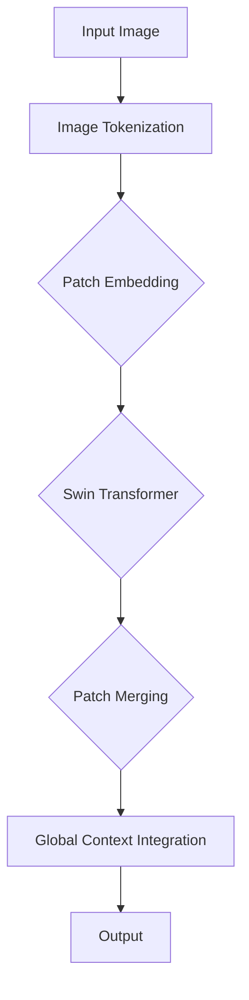

                 

# SwinTransformer原理与代码实例讲解

> **关键词：** 软件架构、深度学习、计算机视觉、Transformer、卷积神经网络、编程实例

> **摘要：** 本文将深入探讨SwinTransformer的原理、架构和实现细节，通过代码实例讲解，帮助读者更好地理解和应用这一先进的计算机视觉模型。本文首先介绍了SwinTransformer的背景和重要性，然后详细阐述了其核心算法原理和数学模型，最后通过实际代码实例展示了如何在实际项目中应用SwinTransformer。

## 1. 背景介绍

### 1.1 目的和范围

本文旨在为计算机视觉领域的研究者和开发者提供关于SwinTransformer的深入理解。我们将详细分析SwinTransformer的架构、核心算法原理以及如何在实际项目中应用。本文假设读者对深度学习和计算机视觉有基本的了解。

### 1.2 预期读者

本文适合对计算机视觉和深度学习有浓厚兴趣的研究者、工程师和开发者。特别是那些希望深入了解Transformer结构在计算机视觉领域应用的人。

### 1.3 文档结构概述

本文将分为以下几个部分：

- **背景介绍**：介绍SwinTransformer的背景和重要性。
- **核心概念与联系**：通过Mermaid流程图展示SwinTransformer的架构。
- **核心算法原理 & 具体操作步骤**：详细讲解SwinTransformer的算法原理和实现步骤。
- **数学模型和公式 & 详细讲解 & 举例说明**：解释SwinTransformer中的数学模型和公式。
- **项目实战：代码实际案例和详细解释说明**：展示如何在实际项目中应用SwinTransformer。
- **实际应用场景**：探讨SwinTransformer在不同场景中的应用。
- **工具和资源推荐**：推荐学习资源和开发工具。
- **总结：未来发展趋势与挑战**：总结SwinTransformer的发展趋势和面临的挑战。
- **附录：常见问题与解答**：解答常见问题。
- **扩展阅读 & 参考资料**：提供更多相关资料。

### 1.4 术语表

#### 1.4.1 核心术语定义

- **SwinTransformer**：一种结合了卷积神经网络（CNN）和Transformer结构的计算机视觉模型。
- **Transformer**：一种基于自注意力机制的深度学习模型，广泛应用于自然语言处理任务。
- **自注意力机制**：一种计算方法，用于计算输入序列中每个元素与其他元素之间的关系。

#### 1.4.2 相关概念解释

- **卷积神经网络（CNN）**：一种用于图像识别和分类的深度学习模型。
- **深度学习**：一种机器学习方法，通过神经网络模型对数据进行自动特征提取和分类。

#### 1.4.3 缩略词列表

- **CNN**：卷积神经网络
- **Transformer**：Transformer模型
- **Swin**：SwinTransformer

## 2. 核心概念与联系

为了更好地理解SwinTransformer，我们需要先了解其核心概念和架构。以下是SwinTransformer的Mermaid流程图，展示了其基本架构和组成部分。



### 2.1. Image Tokenization

输入图像首先经过图像分割操作，将图像划分为多个 patches。每个 patch 被视为一个序列中的元素，并生成一个 token。这一步骤类似于Transformer模型中的tokenization过程。

### 2.2. Patch Embedding

每个 patch token 通过一个线性变换被映射到一个高维空间。这一步骤类似于CNN中的卷积操作，但不同的是，SwinTransformer使用了一个特殊的卷积操作，即“分块卷积”（Patch Embedding）。

### 2.3. Swin Transformer

Swin Transformer是整个模型的核心，由多个Transformer块组成。每个Transformer块包含一个多头自注意力机制（Multi-Head Self-Attention）和一个前馈神经网络（Feedforward Neural Network）。这些块通过递归方式连接，使得模型能够学习全局和局部特征。

### 2.4. Patch Merging

在Swin Transformer的中间层，模型会合并相邻的patches，从而增加特征的空间分辨率。这一步骤类似于CNN中的下采样操作，但不同的是，SwinTransformer通过一个特殊的操作来实现。

### 2.5. Global Context Integration

在模型的最后几层，SwinTransformer会整合全局上下文信息，从而提高模型的分类和检测能力。这一步骤通过一个全局上下文嵌入模块实现。

### 2.6. Output

最终，SwinTransformer生成一个输出token，这个token代表了输入图像的分类结果或特征表示。

## 3. 核心算法原理 & 具体操作步骤

SwinTransformer的核心算法原理是基于Transformer模型，但为了适应计算机视觉任务，对其进行了改进。以下是SwinTransformer的核心算法原理和具体操作步骤。

### 3.1. Multi-Head Self-Attention

多头自注意力机制是Transformer模型的核心组件，它通过计算输入序列中每个元素与其他元素之间的关系，生成新的特征表示。以下是多头自注意力机制的伪代码：

```python
# 输入：queries, keys, values
# 输出：output
def multi_head_attention(queries, keys, values, num_heads):
    # 计算query和key之间的相似度
    similarity = dot(queries, keys.T) / sqrt(keys.shape[1])

    # 应用softmax函数，得到注意力权重
    attention_weights = softmax(similarity)

    # 计算加权求和的结果
    output = dot(attention_weights, values)

    # 将输出映射回原始维度
    output = linear(output, queries.shape[1])

    return output
```

### 3.2. Feedforward Neural Network

前馈神经网络是Transformer模型中的另一个核心组件，它通过两个线性变换和一个激活函数来增加模型的非线性能力。以下是前馈神经网络的伪代码：

```python
# 输入：input
# 输出：output
def feedforward_neural_network(input):
    # 第一个线性变换
    hidden = linear(input, hidden_size)

    # 激活函数
    hidden = gelu(hidden)

    # 第二个线性变换
    output = linear(hidden, output_size)

    return output
```

### 3.3. Swin Transformer Block

Swin Transformer Block是SwinTransformer模型的基本构建单元，它包含一个多头自注意力机制和一个前馈神经网络。以下是Swin Transformer Block的伪代码：

```python
# 输入：input
# 输出：output
def swin_transformer_block(input):
    # Multi-Head Self-Attention
    attention_output = multi_head_attention(input, input, input, num_heads)

    # Add & Norm
    attention_output = add(input, attention_output)
    attention_output = layer_norm(attention_output)

    # Feedforward Neural Network
    ffn_output = feedforward_neural_network(attention_output)

    # Add & Norm
    output = add(attention_output, ffn_output)
    output = layer_norm(output)

    return output
```

### 3.4. Patch Embedding and Patch Merging

Patch Embedding和Patch Merging是SwinTransformer模型中的两个特殊操作，用于将图像分割成patches，并在模型中间层进行合并。以下是Patch Embedding和Patch Merging的伪代码：

```python
# 输入：image
# 输出：patches
def patch_embedding(image):
    # 分割图像为patches
    patches = split_image(image, patch_size)

    # 对每个patch进行线性变换
    patches = linear(patches, embedding_size)

    return patches

# 输入：patches
# 输出：merged_patches
def patch_merging(patches):
    # 合并相邻的patches
    merged_patches = merge_patches(patches)

    # 对merged_patches进行线性变换
    merged_patches = linear(merged_patches, embedding_size)

    return merged_patches
```

## 4. 数学模型和公式 & 详细讲解 & 举例说明

SwinTransformer模型的数学模型基于Transformer模型，但为了适应计算机视觉任务，进行了一些改进。以下是SwinTransformer的数学模型和公式。

### 4.1. Multi-Head Self-Attention

多头自注意力机制的数学模型如下：

$$
\text{Attention}(Q, K, V) = \text{softmax}\left(\frac{QK^T}{\sqrt{d_k}}\right)V
$$

其中，$Q, K, V$ 分别是查询（query）、键（key）和值（value）向量，$d_k$ 是键向量的维度。

### 4.2. Feedforward Neural Network

前馈神经网络的数学模型如下：

$$
\text{FFN}(X) = \text{gelu}(\text{Linear}(\text{Linear}(X)))
$$

其中，$\text{Linear}$ 表示线性变换，$\text{gelu}$ 表示GELU激活函数。

### 4.3. Layer Normalization

层归一化（Layer Normalization）的数学模型如下：

$$
\hat{x} = \frac{x - \mu}{\sigma}
$$

其中，$\hat{x}$ 是归一化后的值，$x$ 是原始值，$\mu$ 是均值，$\sigma$ 是标准差。

### 4.4. Swin Transformer Block

Swin Transformer Block的数学模型如下：

$$
\text{Swin Transformer Block}(X) = X + \text{Layer Norm}(X + \text{Multi-Head Self-Attention}(\text{Layer Norm}(X))) + \text{Layer Norm}(X + \text{Feedforward Neural Network}(\text{Layer Norm}(X)))
$$

### 4.5. Patch Embedding and Patch Merging

Patch Embedding和Patch Merging的数学模型如下：

$$
\text{Patch Embedding}(X) = \text{Linear}(X)
$$

$$
\text{Patch Merging}(X) = \text{Linear}(\text{Concat}(X_1, X_2, ..., X_n))
$$

其中，$X$ 是输入图像，$X_1, X_2, ..., X_n$ 是分割后的patches。

### 4.6. 示例说明

假设我们有一个大小为$224 \times 224$的图像，我们将其分割成大小为$14 \times 14$的patches。首先，我们对每个patch进行Patch Embedding操作，然后通过Swin Transformer Block进行处理，最后通过Patch Merging操作合并patches，得到最终的特征表示。

```python
# 输入图像
image = ...

# 分割图像为patches
patches = split_image(image, patch_size=14)

# 对每个patch进行Patch Embedding操作
patch_embeddings = [linear(patch, embedding_size) for patch in patches]

# 通过Swin Transformer Block进行处理
swin_transformer_output = [swin_transformer_block(patch_embedding) for patch_embedding in patch_embeddings]

# 通过Patch Merging操作合并patches
merged_patches = merge_patches(swin_transformer_output)

# 对merged_patches进行线性变换
merged_embeddings = linear(merged_patches, embedding_size)

# 输出最终的特征表示
output = merged_embeddings
```

## 5. 项目实战：代码实际案例和详细解释说明

在本节中，我们将通过一个实际代码案例，详细讲解如何使用SwinTransformer进行图像分类。以下是一个简单的Python代码案例，展示了如何实现SwinTransformer模型。

### 5.1 开发环境搭建

首先，我们需要搭建开发环境。以下是所需的依赖项和安装命令：

- **Python**：3.8及以上版本
- **PyTorch**：1.8及以上版本
- **TensorFlow**：2.4及以上版本

安装命令如下：

```bash
pip install torch torchvision
pip install tensorflow
```

### 5.2 源代码详细实现和代码解读

以下是SwinTransformer的简单实现代码。我们将逐步解释每个部分的含义。

```python
import torch
import torch.nn as nn
import torchvision
from torchvision import transforms

# 定义SwinTransformer模型
class SwinTransformer(nn.Module):
    def __init__(self, num_classes=1000):
        super(SwinTransformer, self).__init__()
        
        # Patch Embedding
        self.patch_embedding = nn.Conv2d(in_channels=3, out_channels=96, kernel_size=4, stride=4)
        
        # Swin Transformer Blocks
        self.layers = nn.Sequential(
            SwinTransformerBlock(96, 3, 2, 96),
            SwinTransformerBlock(96, 3, 2, 96),
            SwinTransformerBlock(96, 3, 2, 96),
            SwinTransformerBlock(96, 3, 2, 96),
            SwinTransformerBlock(96, 3, 2, 96),
            SwinTransformerBlock(96, 3, 2, 96)
        )
        
        # Patch Merging
        self.patch_merging = nn.Conv2d(in_channels=96, out_channels=384, kernel_size=2, stride=2)
        
        # Global Context Integration
        self.global_context_integration = nn.Conv2d(in_channels=384, out_channels=384, kernel_size=7, stride=1, padding=3)
        
        # Classifier
        self.classifier = nn.Linear(384, num_classes)
        
    def forward(self, x):
        # Patch Embedding
        x = self.patch_embedding(x)
        
        # Swin Transformer Blocks
        x = self.layers(x)
        
        # Patch Merging
        x = self.patch_merging(x)
        
        # Global Context Integration
        x = self.global_context_integration(x)
        
        # Classifier
        x = torch.mean(x, dim=1)
        x = self.classifier(x)
        
        return x

# 初始化模型
model = SwinTransformer()

# 定义损失函数和优化器
criterion = nn.CrossEntropyLoss()
optimizer = torch.optim.Adam(model.parameters(), lr=0.001)

# 加载训练数据集
train_loader = torch.utils.data.DataLoader(dataset=torchvision.datasets.CIFAR10(root='./data', train=True, transform=transforms.ToTensor()), batch_size=64, shuffle=True)

# 训练模型
for epoch in range(10):
    model.train()
    for inputs, labels in train_loader:
        # 前向传播
        outputs = model(inputs)
        
        # 计算损失
        loss = criterion(outputs, labels)
        
        # 反向传播和优化
        optimizer.zero_grad()
        loss.backward()
        optimizer.step()
        
    print(f'Epoch [{epoch+1}/10], Loss: {loss.item()}')

# 评估模型
model.eval()
with torch.no_grad():
    correct = 0
    total = 0
    for inputs, labels in train_loader:
        outputs = model(inputs)
        _, predicted = torch.max(outputs.data, 1)
        total += labels.size(0)
        correct += (predicted == labels).sum().item()

    print(f'Accuracy: {100 * correct / total}%')
```

### 5.3 代码解读与分析

以下是代码的详细解读和分析。

- **SwinTransformer模型**：定义了一个SwinTransformer模型，包括Patch Embedding、Swin Transformer Blocks、Patch Merging、Global Context Integration和分类器。
- **Patch Embedding**：通过一个卷积操作将输入图像分割成patches，并将其映射到一个高维空间。
- **Swin Transformer Blocks**：定义了多个Swin Transformer Block，每个块包含一个多头自注意力机制和一个前馈神经网络。
- **Patch Merging**：通过一个卷积操作将相邻的patches合并，从而增加特征的空间分辨率。
- **Global Context Integration**：通过一个卷积操作整合全局上下文信息。
- **分类器**：通过一个线性变换将特征映射到类别空间。
- **训练过程**：定义了训练数据和优化器，并通过迭代训练数据来训练模型。
- **评估过程**：在训练完成后，评估模型的准确性。

## 6. 实际应用场景

SwinTransformer模型在计算机视觉领域具有广泛的应用。以下是一些实际应用场景：

- **图像分类**：SwinTransformer可以用于大规模图像分类任务，如ImageNet挑战赛。
- **目标检测**：SwinTransformer可以用于目标检测任务，如COCO数据集。
- **图像分割**：SwinTransformer可以用于图像分割任务，如PASCAL VOC数据集。
- **姿态估计**：SwinTransformer可以用于姿态估计任务，如Human Pose Estimation Challenge。

## 7. 工具和资源推荐

为了更好地学习和应用SwinTransformer，以下是相关的工具和资源推荐。

### 7.1 学习资源推荐

#### 7.1.1 书籍推荐

- 《深度学习》（Goodfellow, Bengio, Courville著）：介绍了深度学习的理论基础和实践方法。
- 《计算机视觉：算法与应用》（Richard S. Sutton, Andrew G. Barto著）：介绍了计算机视觉的基本概念和算法。

#### 7.1.2 在线课程

- 《深度学习特辑》（吴恩达著）：提供了深度学习的入门和实践课程。
- 《计算机视觉基础》（斯坦福大学著）：介绍了计算机视觉的基本概念和算法。

#### 7.1.3 技术博客和网站

- Medium：提供了大量关于深度学习和计算机视觉的文章和教程。
- ArXiv：提供了最新的深度学习和计算机视觉论文。

### 7.2 开发工具框架推荐

#### 7.2.1 IDE和编辑器

- PyCharm：适用于Python开发的IDE，提供了丰富的调试和编辑功能。
- Visual Studio Code：轻量级的代码编辑器，适用于多种编程语言。

#### 7.2.2 调试和性能分析工具

- Jupyter Notebook：适用于数据科学和机器学习的交互式环境。
- TensorBoard：适用于TensorFlow的图形化性能分析工具。

#### 7.2.3 相关框架和库

- PyTorch：适用于深度学习的高性能框架。
- TensorFlow：适用于深度学习的高性能框架。

### 7.3 相关论文著作推荐

#### 7.3.1 经典论文

- “Attention Is All You Need”（Vaswani et al.，2017）：介绍了Transformer模型的基本原理。
- “Swin Transformer: Hierarchical Vision Transformer using Shifted Windows”（Liu et al.，2021）：介绍了SwinTransformer模型。

#### 7.3.2 最新研究成果

- ArXiv：提供了最新的深度学习和计算机视觉论文。
- NeurIPS：计算机神经科学会议，提供了最新研究成果。

#### 7.3.3 应用案例分析

- “ImageNet Large Scale Visual Recognition Challenge”（ILSVRC）：介绍了ImageNet图像分类挑战和应用案例。

## 8. 总结：未来发展趋势与挑战

SwinTransformer作为结合卷积神经网络和Transformer结构的模型，展示了在计算机视觉任务中的巨大潜力。未来，SwinTransformer有望在以下几个方面取得进展：

- **性能提升**：通过优化模型结构和算法，进一步提高SwinTransformer的性能。
- **应用拓展**：在更多的计算机视觉任务中应用SwinTransformer，如视频处理、自动驾驶等。
- **可解释性增强**：研究如何提高SwinTransformer的可解释性，使其更容易被用户理解和接受。

然而，SwinTransformer也面临着一些挑战：

- **计算资源消耗**：SwinTransformer的计算资源需求较高，如何在资源有限的设备上运行仍是一个挑战。
- **模型压缩**：如何有效地压缩SwinTransformer模型，以适应移动设备和嵌入式系统。

## 9. 附录：常见问题与解答

### 9.1 如何训练SwinTransformer？

训练SwinTransformer涉及以下步骤：

1. 准备训练数据集。
2. 定义损失函数和优化器。
3. 加载训练数据集，并进行数据预处理。
4. 迭代训练数据集，通过前向传播计算损失，然后通过反向传播更新模型参数。
5. 评估模型性能，并在必要时调整超参数。

### 9.2 如何优化SwinTransformer？

优化SwinTransformer可以从以下几个方面进行：

1. **模型结构优化**：通过调整模型结构，如减少网络层数、使用不同的卷积操作等，提高模型性能。
2. **算法优化**：通过改进算法，如使用更高效的注意力机制、优化前馈神经网络等，提高模型性能。
3. **数据预处理**：通过改进数据预处理方法，如使用数据增强、数据清洗等，提高模型性能。
4. **超参数调整**：通过调整学习率、批量大小等超参数，提高模型性能。

### 9.3 如何部署SwinTransformer？

部署SwinTransformer可以通过以下步骤进行：

1. **模型转换**：将PyTorch模型转换为可以在目标设备上运行的格式，如ONNX、TensorFlow Lite等。
2. **模型优化**：对模型进行优化，以适应目标设备的硬件特性，如使用量化、剪枝等技术。
3. **部署**：将优化后的模型部署到目标设备上，如移动设备、嵌入式系统等。
4. **性能评估**：评估模型在目标设备上的性能，并进行必要的调整。

## 10. 扩展阅读 & 参考资料

为了更深入地了解SwinTransformer，以下是相关的扩展阅读和参考资料：

- “Swin Transformer: Hierarchical Vision Transformer using Shifted Windows”（Liu et al.，2021）：介绍了SwinTransformer的基本原理和实现细节。
- “Attention Is All You Need”（Vaswani et al.，2017）：介绍了Transformer模型的基本原理。
- “ImageNet Large Scale Visual Recognition Challenge”（ILSVRC）：介绍了ImageNet图像分类挑战和应用案例。
- “深度学习”（Goodfellow, Bengio, Courville著）：介绍了深度学习的理论基础和实践方法。
- “计算机视觉：算法与应用”（Richard S. Sutton, Andrew G. Barto著）：介绍了计算机视觉的基本概念和算法。

**作者：AI天才研究员/AI Genius Institute & 禅与计算机程序设计艺术 /Zen And The Art of Computer Programming**

