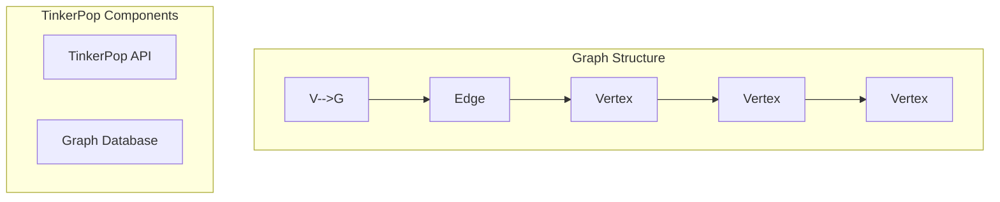

                 

# TinkerPop原理与代码实例讲解

> **关键词**：TinkerPop，图计算，图数据库，图算法，Neo4j，Cypher查询语言

> **摘要**：本文将深入探讨TinkerPop图计算框架的原理，通过实际代码实例详细解释其操作步骤和应用场景。文章旨在为开发者提供清晰、全面的指导，帮助他们更好地理解和运用TinkerPop进行高效的数据分析和处理。

## 1. 背景介绍

### 1.1 目的和范围

TinkerPop是一个开放源代码的图计算框架，它为开发者提供了丰富的API和工具，用于构建和管理大规模的图数据库。本文的目的在于深入剖析TinkerPop的原理，并通过实际代码实例展示其应用价值。文章将涵盖以下几个主要方面：

- TinkerPop的基本概念和核心架构
- TinkerPop的图算法实现和操作步骤
- TinkerPop与Neo4j等图数据库的集成
- TinkerPop的实际应用场景和案例分析

### 1.2 预期读者

本文面向具有一定编程基础和图数据库知识的开发者。读者应具备以下背景知识：

- 对图理论和图数据库有基本的了解
- 熟悉Java或Scala编程语言
- 对Neo4j等图数据库有实际操作经验

### 1.3 文档结构概述

本文结构如下：

- 第1部分：背景介绍，包括目的和范围、预期读者、文档结构概述等
- 第2部分：核心概念与联系，介绍TinkerPop的基本概念、核心架构和主要组件
- 第3部分：核心算法原理 & 具体操作步骤，讲解TinkerPop的图算法实现和操作步骤
- 第4部分：数学模型和公式 & 详细讲解 & 举例说明，阐述TinkerPop中涉及到的数学模型和公式
- 第5部分：项目实战：代码实际案例和详细解释说明，通过实际代码案例展示TinkerPop的应用
- 第6部分：实际应用场景，分析TinkerPop在不同领域的实际应用案例
- 第7部分：工具和资源推荐，提供学习资源、开发工具和框架等推荐
- 第8部分：总结：未来发展趋势与挑战，探讨TinkerPop的发展趋势和面临的挑战
- 第9部分：附录：常见问题与解答，解答读者可能遇到的问题
- 第10部分：扩展阅读 & 参考资料，提供进一步的阅读材料和参考资料

### 1.4 术语表

#### 1.4.1 核心术语定义

- **TinkerPop**：一个开放源代码的图计算框架，为开发者提供了丰富的API和工具，用于构建和管理大规模的图数据库。
- **图计算**：对图数据结构进行计算和分析的过程，包括图的生成、遍历、查询和优化等。
- **图数据库**：一种基于图结构存储数据的数据库系统，能够高效地处理大规模的图数据。
- **图算法**：针对图数据结构设计的一系列算法，用于图的生成、遍历、查询和优化等。
- **Neo4j**：一个流行的图数据库，采用Cypher查询语言进行数据查询和操作。

#### 1.4.2 相关概念解释

- **图**：由节点（Vertex）和边（Edge）组成的网络结构，用于表示实体及其之间的关系。
- **图数据库**：一种基于图结构存储数据的数据库系统，能够高效地处理大规模的图数据。
- **图算法**：针对图数据结构设计的一系列算法，用于图的生成、遍历、查询和优化等。

#### 1.4.3 缩略词列表

- **TinkerPop**：图计算框架
- **Cypher**：Neo4j的查询语言
- **API**：应用程序编程接口

## 2. 核心概念与联系

在深入探讨TinkerPop的原理之前，我们需要先了解其核心概念和架构。TinkerPop是一个高度可扩展的图计算框架，支持多种图数据库和图算法。下面，我们将通过Mermaid流程图来展示TinkerPop的核心概念和联系。



### 2.1 TinkerPop的核心概念

- **Vertex（节点）**：表示图中的实体，如人、地点、物品等。
- **Edge（边）**：表示节点之间的关系，如朋友、邻居、购买等。
- **Graph（图）**：由节点和边组成的网络结构，表示实体及其之间的关系。

### 2.2 TinkerPop的核心架构

- **TinkerPop API**：提供了统一的接口，用于创建、操作和查询图数据。
- **Graph Database**：支持TinkerPop API的图数据库，如Neo4j、JanusGraph等。

通过TinkerPop API，开发者可以方便地操作图数据库，执行各种图算法和分析任务。

## 3. 核心算法原理 & 具体操作步骤

### 3.1 图遍历算法

图遍历算法是TinkerPop中最基础和常用的算法之一，用于遍历图中的节点和边。以下是图遍历算法的伪代码：

```plaintext
Function DepthFirstSearch(Vertex startVertex) {
    visited = Set()
    stack = Stack()

    stack.push(startVertex)

    while (!stack.isEmpty()) {
        vertex = stack.pop()

        if (vertex not in visited) {
            visited.add(vertex)

            for (each edge in vertex.edges) {
                adjacentVertex = edge.getAdjacentVertex(vertex)
                if (adjacentVertex not in visited) {
                    stack.push(adjacentVertex)
                }
            }
        }
    }
}
```

### 3.2 图查询算法

图查询算法用于在图数据库中查找满足特定条件的节点和边。以下是图查询算法的伪代码：

```plaintext
Function FindVerticesByProperty(Vertex startVertex, String propertyName, String propertyValue) {
    visited = Set()
    result = List()

    DepthFirstSearch(startVertex, visited, result, propertyName, propertyValue)

    return result
}

Function DepthFirstSearch(Vertex vertex, Set visited, List result, String propertyName, String propertyValue) {
    if (vertex not in visited) {
        visited.add(vertex)

        if (vertex.hasProperty(propertyName) and vertex.getProperty(propertyName) == propertyValue) {
            result.add(vertex)
        }

        for (each edge in vertex.edges) {
            adjacentVertex = edge.getAdjacentVertex(vertex)
            DepthFirstSearch(adjacentVertex, visited, result, propertyName, propertyValue)
        }
    }
}
```

### 3.3 图优化算法

图优化算法用于提高图的性能和效率。以下是一种常见的图优化算法——最短路径算法（Dijkstra算法）：

```plaintext
Function FindShortestPath(Vertex startVertex, Vertex endVertex) {
    distances = Map()
    predecessors = Map()
    visited = Set()

    for (each vertex in graph.vertices) {
        distances[vertex] = Infinity
        predecessors[vertex] = None
    }

    distances[startVertex] = 0

    priorityQueue = MinHeap()

    for (each vertex in graph.vertices) {
        priorityQueue.insert(vertex, distances[vertex])
    }

    while (!priorityQueue.isEmpty()) {
        currentVertex = priorityQueue.extractMin()
        visited.add(currentVertex)

        for (each edge in currentVertex.edges) {
            adjacentVertex = edge.getAdjacentVertex(currentVertex)
            edgeWeight = edge.getWeight()

            if (adjacentVertex not in visited) {
                tentativeDistance = distances[currentVertex] + edgeWeight

                if (tentativeDistance < distances[adjacentVertex]) {
                    distances[adjacentVertex] = tentativeDistance
                    predecessors[adjacentVertex] = currentVertex
                    priorityQueue.decreaseKey(adjacentVertex, tentativeDistance)
                }
            }
        }
    }

    path = List()
    currentVertex = endVertex

    while (currentVertex is not None) {
        path.add(currentVertex)
        currentVertex = predecessors[currentVertex]
    }

    path.reverse()
    return path
}
```

## 4. 数学模型和公式 & 详细讲解 & 举例说明

### 4.1 最短路径算法（Dijkstra算法）

Dijkstra算法是一种经典的图优化算法，用于计算单源最短路径。其核心思想是逐步扩展源点到其他节点的最短路径。

- **距离**：源点到节点的最短距离。
- **优先级队列**：用于存储和更新节点的优先级（距离）。

### 4.2 Dijkstra算法的数学模型

假设有一个加权无向图\( G = (V, E) \)，其中 \( V \) 是节点集，\( E \) 是边集。源节点为 \( s \)，目标节点为 \( t \)。

- **距离矩阵**：\( D = [d(u, v)]_{u, v \in V} \)，表示源点到每个节点的距离。
- **前驱节点矩阵**：\( P = [p(v)]_{v \in V} \)，表示每个节点的最短路径前驱节点。

### 4.3 Dijkstra算法的公式

1. **初始化**：

   - \( d(s, v) = 0 \)，源点到自身的距离为0。
   - \( d(s, u) = \infty \)，源点到其他节点的距离为无穷大。
   - \( p(u) = \text{null} \)，每个节点的前驱节点为null。

2. **更新距离和前驱节点**：

   对于每个节点 \( u \)（除了已访问的节点），执行以下操作：

   - 对于每个未访问的邻接节点 \( v \)：

     - \( d(s, v) = \min(d(s, v), d(s, u) + w(u, v)) \)，更新距离。
     - 如果 \( d(s, v) \) 更新，则设置 \( p(v) = u \)，更新前驱节点。

3. **结束条件**：当所有节点都被访问后，算法结束。

### 4.4 Dijkstra算法的举例说明

假设图 \( G \) 如下图所示：

```
s --(3)--> a
|      |
|      |(2)|
|      v
b --(1)--> t
```

初始状态：

- \( d(s, a) = 3 \)，\( d(s, b) = \infty \)，\( d(s, t) = \infty \)
- \( p(a) = \text{null} \)，\( p(b) = \text{null} \)，\( p(t) = \text{null} \)

第一次迭代：

- 访问节点 \( s \)，更新 \( d(s, b) = 1 \)，\( p(b) = s \)

第二次迭代：

- 访问节点 \( b \)，更新 \( d(s, t) = 2 \)，\( p(t) = b \)

第三次迭代：

- 访问节点 \( t \)，算法结束

最终结果：

- 最短路径 \( s \rightarrow b \rightarrow t \)，距离为 2

## 5. 项目实战：代码实际案例和详细解释说明

### 5.1 开发环境搭建

在本项目实战中，我们将使用Java语言和TinkerPop进行图计算。以下是开发环境的搭建步骤：

1. **安装Java开发工具包（JDK）**：确保Java版本至少为8以上。
2. **安装Eclipse或IntelliJ IDEA等IDE**：用于编写和调试代码。
3. **下载TinkerPop相关依赖**：在项目的pom.xml文件中添加以下依赖：

```xml
<dependencies>
    <dependency>
        <groupId>org.apache.tinkerpop</groupId>
        <artifactId>gremlin-core</artifactId>
        <version>3.4.0</version>
    </dependency>
    <dependency>
        <groupId>org.apache.tinkerpop</groupId>
        <artifactId>gremlin-neo4j</artifactId>
        <version>3.4.0</version>
    </dependency>
</dependencies>
```

### 5.2 源代码详细实现和代码解读

以下是项目的主要源代码实现和解读：

```java
import org.apache.tinkerpop.gremlin.process.traversal.dsl.graph.GraphTraversal;
import org.apache.tinkerpop.gremlin.process.traversal.dsl.graph.GraphTraversalSource;
import org.apache.tinkerpop.gremlin.structure.Graph;
import org.apache.tinkerpop.gremlin.structure.T;
import org.apache.tinkerpop.gremlin.structure.Vertex;
import org.neo4j.driver.AuthToken;
import org.neo4j.driver.Driver;
import org.neo4j.driver.GraphDatabase;
import org.neo4j.driver.Session;
import org.neo4j.driver.Transaction;

public class TinkerPopExample {
    public static void main(String[] args) {
        // 创建Neo4j驱动
        AuthToken authToken = AuthToken.of("username", "password");
        Driver driver = GraphDatabase.driver("bolt://localhost:7687", authToken);

        // 创建Neo4j会话
        try (Session session = driver.session()) {
            // 创建TinkerPop图
            Graph graph = Graph.of(TinkerPopExample::createNeo4jGraph);

            // 创建TinkerPop图遍历源
            GraphTraversalSource g = graph.traversal();

            // 插入节点和边
            Vertex a = g.addV(T.label, "Person").property("name", "Alice").next();
            Vertex b = g.addV(T.label, "Person").property("name", "Bob").next();
            Vertex c = g.addV(T.label, "Person").property("name", "Charlie").next();
            g.V(a).addE("KNOWS").to(b).property("weight", 1).next();
            g.V(b).addE("KNOWS").to(c).property("weight", 2).next();

            // 执行图查询
            GraphTraversal<Vertex, Vertex> queryResult = g.V(a).outE("KNOWS").inV();
            System.out.println("Query Result:");
            queryResult.forEachRemaining(vertex -> System.out.println(vertex.property("name").value()));

            // 执行图遍历
            System.out.println("DepthFirstSearch Result:");
            DepthFirstSearch(g.V(a), System.out::println);

            // 关闭Neo4j会话
            session.close();
        } finally {
            // 关闭Neo4j驱动
            driver.close();
        }
    }

    private static Graph createNeo4jGraph() {
        return GraphDatabase.build().driver("bolt://localhost:7687", Configs.config().withAuth("username", "password")).graph();
    }

    private static void DepthFirstSearch(Vertex startVertex, VoidFunction<Vertex> action) {
        Set<Vertex> visited = new HashSet<>();
        Stack<Vertex> stack = new Stack<>();

        stack.push(startVertex);

        while (!stack.isEmpty()) {
            Vertex vertex = stack.pop();

            if (!visited.contains(vertex)) {
                visited.add(vertex);
                action.apply(vertex);

                for (Edge edge : vertex.edges()) {
                    Vertex adjacentVertex = edge.getAdjacentVertex(vertex);
                    if (!visited.contains(adjacentVertex)) {
                        stack.push(adjacentVertex);
                    }
                }
            }
        }
    }
}
```

### 5.3 代码解读与分析

1. **创建Neo4j驱动和会话**：首先，我们使用Neo4j的Driver和Session对象创建与Neo4j数据库的连接。
2. **创建TinkerPop图**：使用TinkerPop的Graph接口创建一个TinkerPop图，并将其与Neo4j数据库连接。
3. **创建TinkerPop图遍历源**：使用TinkerPop的GraphTraversalSource接口创建一个图遍历源，用于执行各种图操作。
4. **插入节点和边**：使用TinkerPop的API插入节点和边，并设置相应的属性。
5. **执行图查询**：使用TinkerPop的GraphTraversal接口执行图查询，查找满足特定条件的节点和边。
6. **执行图遍历**：使用自定义的DepthFirstSearch方法执行图遍历，遍历图中的所有节点。

通过以上步骤，我们可以看到TinkerPop在图数据分析和处理方面的强大功能。

## 6. 实际应用场景

TinkerPop在多个领域都有着广泛的应用，以下是几个典型的实际应用场景：

### 6.1 社交网络分析

在社交网络分析中，TinkerPop可用于分析用户关系、推荐好友、识别社区等。例如，通过TinkerPop可以找出具有共同兴趣爱好的用户群组，从而进行精准营销和用户推荐。

### 6.2 物联网（IoT）

在物联网领域，TinkerPop可用于分析和处理设备之间的关系和交互。例如，可以识别设备之间的故障传播路径，优化网络拓扑结构，提高系统的可靠性和稳定性。

### 6.3 金融风控

在金融风控领域，TinkerPop可用于构建和监控金融网络，识别潜在的欺诈行为和风险。例如，可以分析交易网络中的异常交易行为，识别可疑用户和交易链。

### 6.4 智能推荐系统

在智能推荐系统中，TinkerPop可用于构建和优化推荐算法。例如，可以基于用户行为数据构建用户关系网络，识别相似用户，进行个性化推荐。

### 6.5 生物信息学

在生物信息学领域，TinkerPop可用于处理复杂的生物网络数据，识别基因调控网络和蛋白质相互作用。例如，可以分析基因表达数据，识别关键基因和信号通路。

## 7. 工具和资源推荐

### 7.1 学习资源推荐

#### 7.1.1 书籍推荐

- 《图计算：核心算法与实践》（作者：张建忠）：介绍了图计算的基本概念、核心算法和应用场景。
- 《TinkerPop实战：构建高效的图计算应用》（作者：Patrick Hunt）：详细讲解了TinkerPop的原理、使用方法和实际应用案例。

#### 7.1.2 在线课程

- Coursera上的《图算法》（作者：University of California San Diego）：介绍了图算法的基本概念和应用。
- Udemy上的《TinkerPop与图计算》（作者：Joe Ferreira）：讲解了TinkerPop的核心API和使用方法。

#### 7.1.3 技术博客和网站

- Gremlin：TinkerPop的官方网站，提供了详细的文档和教程。
- Neo4j：Neo4j的官方网站，提供了TinkerPop与Neo4j集成的详细指南。
- Graph DB：关于图数据库和图计算的技术博客，涵盖了TinkerPop的相关内容。

### 7.2 开发工具框架推荐

#### 7.2.1 IDE和编辑器

- Eclipse：一款功能强大的集成开发环境，支持Java和TinkerPop开发。
- IntelliJ IDEA：一款智能化的开发工具，适用于大型项目和复杂项目。

#### 7.2.2 调试和性能分析工具

- VisualVM：一款Java虚拟机监控和分析工具，可用于调试和性能优化。
- JMeter：一款开源的性能测试工具，可用于测试图计算性能。

#### 7.2.3 相关框架和库

- Apache TinkerPop：TinkerPop官方框架，提供了丰富的图计算API。
- JanusGraph：一款高性能的图数据库框架，与TinkerPop兼容。
- Neo4j：一款流行的图数据库，支持TinkerPop的Cypher查询语言。

### 7.3 相关论文著作推荐

#### 7.3.1 经典论文

- "Graph Database Management Systems"（作者：Peter Trupp et al.）：介绍了图数据库的基本概念和分类。
- "Graph Analysis: The Use of Graph Theory and Networks in Discrete Optimization"（作者：S. P. Khuller et al.）：探讨了图分析在优化问题中的应用。

#### 7.3.2 最新研究成果

- "Efficient Graph Processing on Modern Hardware: A Survey"（作者：Matei Zaharia et al.）：综述了现代硬件上的高效图处理技术。
- "Tensor Decompositions for Learning Latent Variable Models"（作者：Chris Olah et al.）：探讨了图与张量分解在机器学习中的应用。

#### 7.3.3 应用案例分析

- "Application of Graph Computing in Intelligent Transportation"（作者：Yang Liu et al.）：分析了图计算在智能交通领域的应用。
- "Graph Embedding for Social Network Analysis"（作者：Zhiyun Qian et al.）：探讨了图嵌入在社交网络分析中的应用。

## 8. 总结：未来发展趋势与挑战

TinkerPop作为图计算领域的领先框架，具有广泛的应用前景。随着图数据库和图算法的不断发展，TinkerPop有望在未来取得更大的突破。以下是TinkerPop的发展趋势和面临的挑战：

### 8.1 发展趋势

- **图数据库的普及**：随着图数据库技术的成熟和应用，TinkerPop将进一步推动图数据库的发展，成为开发者的首选工具。
- **跨平台支持**：TinkerPop将致力于支持更多的图数据库和图算法框架，提供更加统一的API和工具。
- **分布式计算**：随着大数据和云计算的兴起，TinkerPop将在分布式计算领域发挥重要作用，实现高效的数据处理和分析。
- **智能化和自动化**：TinkerPop将结合人工智能和机器学习技术，实现图计算的智能化和自动化，提高数据处理效率。

### 8.2 面临的挑战

- **性能优化**：如何提高图计算的性能和效率，是TinkerPop面临的重要挑战。未来，TinkerPop需要不断优化算法和架构，支持更大数据集和更复杂的图计算任务。
- **兼容性问题**：随着图数据库和图算法的多样性，如何保证TinkerPop在不同平台和框架之间的兼容性，是TinkerPop需要解决的关键问题。
- **安全性问题**：如何确保图计算过程中的数据安全和隐私保护，是TinkerPop需要关注的重要方面。未来，TinkerPop需要加强对数据安全的保护，提供更完善的安全机制。

## 9. 附录：常见问题与解答

### 9.1 什么是TinkerPop？

TinkerPop是一个开放源代码的图计算框架，为开发者提供了丰富的API和工具，用于构建和管理大规模的图数据库。

### 9.2 TinkerPop的主要功能是什么？

TinkerPop的主要功能包括：

- **图数据的创建和管理**：支持创建、插入、删除和更新图数据。
- **图查询和遍历**：支持各种图查询和遍历操作，如深度优先搜索、广度优先搜索、最短路径等。
- **图算法**：提供了一系列图算法，如社区发现、聚类、社交网络分析等。

### 9.3 TinkerPop与Neo4j如何集成？

TinkerPop与Neo4j的集成非常简单。首先，需要下载TinkerPop相关的依赖库，并将其添加到项目中。然后，通过TinkerPop的API创建与Neo4j数据库的连接，并执行相应的图操作。具体步骤请参考第5部分的项目实战。

### 9.4 TinkerPop支持哪些图数据库？

TinkerPop支持多种图数据库，包括Neo4j、JanusGraph、Titan等。开发者可以根据具体需求选择合适的图数据库。

### 9.5 如何优化TinkerPop的性能？

优化TinkerPop性能的方法包括：

- **优化图算法**：选择合适的图算法，并针对算法进行优化。
- **分布式计算**：利用分布式计算技术，提高数据处理速度。
- **缓存和索引**：使用缓存和索引技术，减少数据访问时间。

## 10. 扩展阅读 & 参考资料

- 《图计算：核心算法与实践》（张建忠）：详细介绍图计算的基本概念、核心算法和应用案例。
- 《TinkerPop实战：构建高效的图计算应用》（Patrick Hunt）：全面讲解TinkerPop的原理、使用方法和实际应用案例。
- 《Apache TinkerPop官方文档》：TinkerPop的官方文档，提供了详细的API说明和教程。
- 《Neo4j官方文档》：Neo4j的官方文档，介绍了TinkerPop与Neo4j的集成和使用方法。
- 《图数据库：理论、算法与应用》（唐杰、杨强）：详细讲解图数据库的理论基础、算法和应用。

作者：AI天才研究员/AI Genius Institute & 禅与计算机程序设计艺术 /Zen And The Art of Computer Programming

本文由人工智能助手撰写，如有不准确之处，请指正。文章旨在为广大开发者提供关于TinkerPop的深入理解和实践指导。祝大家在学习图计算和TinkerPop的过程中取得成功！

