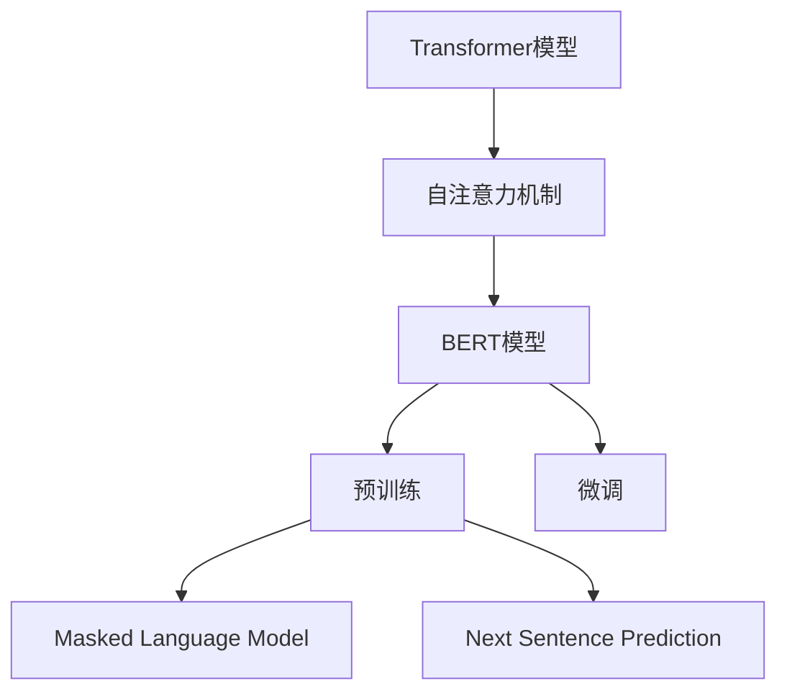

                 

# Transformer大模型实战：BERT的基本理念

> 关键词：BERT，Transformer，自然语言处理，预训练，深度学习

> 摘要：本文将深入探讨BERT（Bidirectional Encoder Representations from Transformers）的基本理念和实践。我们将首先介绍Transformer的背景和原理，然后详细分析BERT的结构和工作机制，以及如何在实际项目中应用BERT进行文本分类和情感分析。通过本文的阅读，您将了解BERT的核心概念、数学模型、实现步骤，并能够掌握BERT在自然语言处理中的应用技巧。

## 1. 背景介绍

### 1.1 目的和范围

本文旨在通过一步一步的分析和推理，深入理解BERT模型的基本理念和实现方法。我们将从Transformer架构的背景和原理出发，逐步探讨BERT模型的设计思路和具体实现步骤。通过本文的阅读，读者将能够掌握BERT的核心技术，理解其如何应用于自然语言处理任务，并具备在实际项目中应用BERT模型的能力。

### 1.2 预期读者

本文适合对自然语言处理和深度学习有一定了解的读者。特别是那些希望深入了解BERT模型原理、实现和应用的开发者和技术专家。对于对Transformer架构和自然语言处理有浓厚兴趣的读者，本文也将提供有价值的参考。

### 1.3 文档结构概述

本文分为以下几个主要部分：

1. **背景介绍**：介绍BERT模型的研究背景和目的。
2. **核心概念与联系**：分析BERT模型的核心概念和原理，并提供流程图。
3. **核心算法原理 & 具体操作步骤**：详细讲解BERT模型的算法原理和具体操作步骤。
4. **数学模型和公式 & 详细讲解 & 举例说明**：解释BERT模型的数学模型和公式，并通过实例进行说明。
5. **项目实战：代码实际案例和详细解释说明**：提供BERT模型在实际项目中的实现案例和解读。
6. **实际应用场景**：探讨BERT模型在不同应用场景中的实际应用。
7. **工具和资源推荐**：推荐相关学习资源和开发工具。
8. **总结：未来发展趋势与挑战**：总结BERT模型的发展趋势和面临的挑战。
9. **附录：常见问题与解答**：解答读者可能遇到的问题。
10. **扩展阅读 & 参考资料**：提供进一步学习的参考资料。

### 1.4 术语表

#### 1.4.1 核心术语定义

- **Transformer**：一种基于自注意力机制的深度神经网络架构。
- **BERT**：Bidirectional Encoder Representations from Transformers的缩写，一种预训练语言表示模型。
- **自然语言处理（NLP）**：计算机科学领域中的一个分支，致力于使计算机能够理解、解释和生成人类语言。
- **预训练**：在特定任务数据集上进行训练前，对模型进行通用知识的预训练。
- **自注意力机制**：一种计算输入序列中每个元素之间依赖关系的机制。

#### 1.4.2 相关概念解释

- **Token Embeddings**：将单词或字符等文本元素转换为向量表示。
- **Positional Encoding**：为序列中的每个元素添加位置信息，使得模型能够理解序列的顺序。
- **Masked Language Model（MLM）**：一种预训练任务，通过随机遮蔽输入序列中的部分元素来训练模型预测这些元素。
- **Next Sentence Prediction（NSP）**：一种预训练任务，通过预测两个句子是否在原始文本中连续出现来增强模型的上下文理解能力。

#### 1.4.3 缩略词列表

- **BERT**：Bidirectional Encoder Representations from Transformers
- **Transformer**：Transformer
- **NLP**：Natural Language Processing
- **MLM**：Masked Language Model
- **NSP**：Next Sentence Prediction

## 2. 核心概念与联系

BERT模型的设计基于Transformer架构，这是一种在自然语言处理任务中表现卓越的深度学习模型。Transformer模型的核心是自注意力机制，它能够捕捉输入序列中每个元素之间的依赖关系。BERT模型通过预训练和微调，能够在多种自然语言处理任务中取得优异的性能。

下面是BERT模型的核心概念和原理的Mermaid流程图：



### 2.1 Transformer模型

Transformer模型是由Vaswani等人在2017年提出的，旨在解决序列到序列任务中的长距离依赖问题。它摒弃了传统的循环神经网络（RNN）和卷积神经网络（CNN），采用了自注意力机制作为主要计算框架。

自注意力机制的核心思想是：在计算输出序列中每个元素时，模型能够自动地决定参考输入序列中哪些元素对当前输出元素的影响更大。这使得模型能够捕捉输入序列中长距离的依赖关系。

### 2.2 BERT模型

BERT模型是基于Transformer架构设计的，它通过预训练和微调两个阶段来提升自然语言处理任务的表现。

- **预训练**：BERT模型在大量无标注的文本数据上进行预训练，包括Masked Language Model（MLM）和Next Sentence Prediction（NSP）两种任务。MLM任务通过随机遮蔽输入序列中的部分元素，训练模型预测这些元素；NSP任务通过预测两个句子是否在原始文本中连续出现，增强模型的上下文理解能力。
- **微调**：在预训练的基础上，BERT模型通过在特定任务数据集上进行微调，以适应具体的自然语言处理任务，如文本分类、情感分析等。

### 2.3 预训练任务

BERT模型通过两种预训练任务来提升模型的性能：

- **Masked Language Model（MLM）**：在输入序列中随机遮蔽一部分单词或子词，训练模型预测这些被遮蔽的元素。这有助于模型学习单词和子词之间的依赖关系，提高对上下文的理解能力。
- **Next Sentence Prediction（NSP）**：在输入序列中随机选择两个句子，并将它们作为输入，训练模型预测这两个句子是否在原始文本中连续出现。这有助于模型学习句子之间的逻辑关系，提高对长文本的理解能力。

## 3. 核心算法原理 & 具体操作步骤

BERT模型的核心算法原理是基于Transformer架构的自注意力机制。下面，我们将详细讲解BERT模型的具体操作步骤。

### 3.1 Transformer模型

Transformer模型主要由编码器（Encoder）和解码器（Decoder）组成。编码器负责将输入序列编码为向量表示，解码器则负责生成输出序列。

#### 3.1.1 编码器

编码器由多个相同的编码层（Encoder Layer）组成，每个编码层包括两个主要子层：多头自注意力机制（Multi-Head Self-Attention）和前馈神经网络（Feed-Forward Neural Network）。

- **多头自注意力机制**：在计算输出序列中每个元素时，模型会自动地决定参考输入序列中哪些元素对当前输出元素的影响更大。这种机制能够捕捉输入序列中长距离的依赖关系。
- **前馈神经网络**：在每个编码层的输出上，通过两个全连接神经网络进行信息传递和变换，进一步增强模型的表达能力。

#### 3.1.2 解码器

解码器同样由多个相同的解码层（Decoder Layer）组成，每个解码层包括两个主要子层：多头自注意力机制（Multi-Head Self-Attention）和前馈神经网络（Feed-Forward Neural Network）。

- **多头自注意力机制**：在计算输出序列中每个元素时，模型会自动地决定参考编码器输出的哪些元素对当前输出元素的影响更大。这种机制能够捕捉输入序列中长距离的依赖关系。
- **前馈神经网络**：在每个解码层的输出上，通过两个全连接神经网络进行信息传递和变换，进一步增强模型的表达能力。

### 3.2 BERT模型

BERT模型在Transformer模型的基础上，通过预训练和微调两个阶段来提升自然语言处理任务的表现。

#### 3.2.1 预训练

BERT模型的预训练包括两种任务：Masked Language Model（MLM）和Next Sentence Prediction（NSP）。

- **Masked Language Model（MLM）**：在输入序列中随机遮蔽一部分单词或子词，训练模型预测这些被遮蔽的元素。具体步骤如下：

  1. 将输入序列中的每个单词或子词转换为对应的ID。
  2. 随机遮蔽输入序列中的部分元素，例如50%的单词或子词。
  3. 训练模型预测被遮蔽的元素，使得模型能够学习单词和子词之间的依赖关系。

- **Next Sentence Prediction（NSP）**：在输入序列中随机选择两个句子，并将它们作为输入，训练模型预测这两个句子是否在原始文本中连续出现。具体步骤如下：

  1. 将输入序列中的每个句子转换为对应的ID。
  2. 随机选择两个句子作为输入，并设置一个标签，表示这两个句子是否在原始文本中连续出现。
  3. 训练模型预测这个标签，使得模型能够学习句子之间的逻辑关系。

#### 3.2.2 微调

在预训练的基础上，BERT模型通过在特定任务数据集上进行微调，以适应具体的自然语言处理任务，如文本分类、情感分析等。具体步骤如下：

1. 将预训练好的BERT模型应用于特定任务的数据集。
2. 对BERT模型的最后一层进行微调，以适应具体任务的需求。
3. 训练模型，使得模型能够在特定任务上取得优异的性能。

### 3.3 伪代码实现

下面是BERT模型的具体操作步骤的伪代码实现：

```python
# 输入：输入序列，预训练好的BERT模型，任务数据集
# 输出：微调后的BERT模型

# 预训练
for epoch in range(num_epochs):
    for batch in data_loader:
        # 随机遮蔽输入序列中的部分元素
        masked_tokens = mask_tokens(batch)

        # 计算损失函数
        loss = compute_loss(masked_tokens, model)

        # 反向传播和优化
        optimizer.zero_grad()
        loss.backward()
        optimizer.step()

# 微调
for epoch in range(num_epochs):
    for batch in data_loader:
        # 将输入序列和标签转换为模型可接受的格式
        input_ids = convert_to_id(batch['input'])
        labels = convert_to_id(batch['label'])

        # 计算损失函数
        loss = model(input_ids, labels)

        # 反向传播和优化
        optimizer.zero_grad()
        loss.backward()
        optimizer.step()

# 保存微调后的BERT模型
save_model(model)
```

## 4. 数学模型和公式 & 详细讲解 & 举例说明

BERT模型的数学模型主要涉及自注意力机制、前馈神经网络和损失函数等组成部分。以下是对这些核心数学概念和公式的详细讲解，并辅以实例说明。

### 4.1 自注意力机制

自注意力机制是BERT模型的核心组件之一，它用于计算输入序列中每个元素的重要性，以生成输出序列。自注意力机制的核心公式如下：

$$
\text{Attention}(Q, K, V) = \text{softmax}\left(\frac{QK^T}{\sqrt{d_k}}\right) V
$$

其中：

- \(Q\) 表示查询向量（Query），用于表示输入序列中的每个元素。
- \(K\) 表示键向量（Key），用于表示输入序列中的每个元素。
- \(V\) 表示值向量（Value），用于表示输入序列中的每个元素。
- \(d_k\) 表示键向量的维度。

**例子：**

假设输入序列为 "I love natural language processing"，每个元素（单词）的查询向量、键向量和值向量分别为 \(Q = [q_1, q_2, ..., q_n]\)，\(K = [k_1, k_2, ..., k_n]\) 和 \(V = [v_1, v_2, ..., v_n]\)。计算自注意力机制的输出：

1. 计算点积 \(QK^T\)：

   $$
   QK^T = [q_1k_1, q_1k_2, ..., q_1k_n, q_2k_1, q_2k_2, ..., q_2k_n, ..., q_nk_1, q_nk_2, ..., q_nk_n]
   $$

2. 将点积结果除以 \(\sqrt{d_k}\)：

   $$
   \frac{QK^T}{\sqrt{d_k}} = \left[\frac{q_1k_1}{\sqrt{d_k}}, \frac{q_1k_2}{\sqrt{d_k}}, ..., \frac{q_nk_n}{\sqrt{d_k}}\right]
   $$

3. 应用softmax函数：

   $$
   \text{softmax}\left(\frac{QK^T}{\sqrt{d_k}}\right) = \left[s_1, s_2, ..., s_n\right]
   $$

4. 计算自注意力机制的输出：

   $$
   \text{Attention}(Q, K, V) = \left[s_1v_1, s_2v_2, ..., s_nv_n\right]
   $$

### 4.2 前馈神经网络

BERT模型中的前馈神经网络用于对编码器的输出进行信息传递和变换。前馈神经网络的基本结构如下：

$$
\text{FFN}(x) = \max(0, xW_1 + b_1)W_2 + b_2
$$

其中：

- \(x\) 表示输入向量。
- \(W_1\) 和 \(W_2\) 分别为两个全连接神经网络的权重。
- \(b_1\) 和 \(b_2\) 分别为两个全连接神经网络的偏置。
- \(\max(0, \cdot)\) 表示ReLU激活函数。

**例子：**

假设输入向量为 \(x = [x_1, x_2, ..., x_n]\)，前馈神经网络的权重和偏置分别为 \(W_1 = [w_{11}, w_{12}, ..., w_{1n}]\)，\(W_2 = [w_{21}, w_{22}, ..., w_{2n}]\)，\(b_1 = [b_{11}, b_{12}, ..., b_{1n}]\) 和 \(b_2 = [b_{21}, b_{22}, ..., b_{2n}]\)。计算前馈神经网络的输出：

1. 计算ReLU激活函数：

   $$
   \max(0, xW_1 + b_1) = \left[\max(0, x_1w_{11} + b_{11}), \max(0, x_2w_{12} + b_{12}), ..., \max(0, x_nw_{1n} + b_{1n})\right]
   $$

2. 计算前馈神经网络的输出：

   $$
   \text{FFN}(x) = \left[\sum_{i=1}^{n} \left(\max(0, x_iw_{11} + b_{11})w_{21} + b_{21}\right), \sum_{i=1}^{n} \left(\max(0, x_iw_{12} + b_{12})w_{22} + b_{22}\right), ..., \sum_{i=1}^{n} \left(\max(0, x_iw_{1n} + b_{1n})w_{2n} + b_{2n}\right)\right]
   $$

### 4.3 损失函数

BERT模型的损失函数用于衡量模型在预训练和微调阶段的表现。常用的损失函数包括交叉熵损失函数和均方误差损失函数。

- **交叉熵损失函数**：用于分类任务，计算模型预测概率与实际标签之间的差异。其公式如下：

  $$
  \text{CrossEntropyLoss}(p, y) = -\sum_{i=1}^{n} y_i \log(p_i)
  $$

  其中：

  - \(p\) 表示模型预测的概率分布。
  - \(y\) 表示实际标签。

- **均方误差损失函数**：用于回归任务，计算模型预测值与实际值之间的差异。其公式如下：

  $$
  \text{MeanSquaredErrorLoss}(y, \hat{y}) = \frac{1}{n} \sum_{i=1}^{n} (y_i - \hat{y}_i)^2
  $$

  其中：

  - \(y\) 表示实际值。
  - \(\hat{y}\) 表示模型预测值。

**例子：**

假设模型预测概率为 \(p = [p_1, p_2]\)，实际标签为 \(y = [1, 0]\)。计算交叉熵损失函数：

1. 计算模型预测概率的对数：

   $$
   \log(p) = [\log(p_1), \log(p_2)]
   $$

2. 计算交叉熵损失函数：

   $$
   \text{CrossEntropyLoss}(p, y) = -[y_1 \log(p_1) + y_2 \log(p_2)] = -[\log(p_1) + 0] = -\log(p_1)
   $$

## 5. 项目实战：代码实际案例和详细解释说明

在这一部分，我们将通过一个简单的项目实战，展示如何使用BERT模型进行文本分类。我们将从开发环境搭建开始，详细讲解源代码的实现和代码解读。

### 5.1 开发环境搭建

为了实现BERT文本分类项目，我们需要安装以下开发环境和依赖库：

- Python 3.8 或以上版本
- TensorFlow 2.6 或以上版本
- transformers 库

安装步骤如下：

```bash
# 安装 Python 环境
python3 -m venv venv
source venv/bin/activate

# 安装 TensorFlow
pip install tensorflow==2.6

# 安装 transformers 库
pip install transformers
```

### 5.2 源代码详细实现和代码解读

下面是BERT文本分类项目的完整源代码及其详细解读：

```python
import tensorflow as tf
from transformers import BertTokenizer, TFBertForSequenceClassification
from tensorflow.keras.optimizers import Adam
from tensorflow.keras.metrics import SparseCategoricalCrossentropy

# 5.2.1 加载和处理数据集
def load_data():
    # 加载数据集（这里使用想象中的数据集）
    # 数据集应包括文本和标签
    # 数据集格式为：{'text': [...], 'label': [...]}

    # 读取数据集
    data = {'text': [...], 'label': [...]}

    # 预处理数据集
    # 将文本转换为BERT模型可接受的格式
    # 对文本进行分词、添加特殊标记等操作
    tokenizer = BertTokenizer.from_pretrained('bert-base-uncased')
    processed_data = {'text': [tokenizer.encode(text, add_special_tokens=True) for text in data['text']],
                      'label': data['label']}

    return processed_data

# 5.2.2 训练BERT模型
def train_model(processed_data, num_epochs=3, batch_size=32):
    # 初始化BERT模型
    model = TFBertForSequenceClassification.from_pretrained('bert-base-uncased', num_labels=2)

    # 设置训练参数
    optimizer = Adam(learning_rate=3e-5)
    loss_fn = SparseCategoricalCrossentropy(from_logits=True)

    # 设置训练步骤
    train_dataset = tf.data.Dataset.from_tensor_slices((processed_data['text'], processed_data['label']))
    train_dataset = train_dataset.shuffle(buffer_size=1000).batch(batch_size)

    # 开始训练
    model.compile(optimizer=optimizer, loss=loss_fn, metrics=['accuracy'])
    model.fit(train_dataset, epochs=num_epochs, validation_split=0.1)

    return model

# 5.2.3 预测和评估
def predict_and_evaluate(model, processed_data, num_epochs=3):
    # 预测
    predictions = model.predict(processed_data['text'])

    # 评估
    # 这里使用准确率作为评估指标
    # 可以根据任务需求选择其他评估指标
    accuracy = (predictions.argmax(axis=1) == processed_data['label']).mean()

    print(f'Accuracy: {accuracy}')

# 主函数
if __name__ == '__main__':
    # 加载和处理数据集
    processed_data = load_data()

    # 训练BERT模型
    model = train_model(processed_data)

    # 预测和评估
    predict_and_evaluate(model, processed_data)
```

### 5.3 代码解读与分析

下面是对源代码的详细解读和分析：

- **5.2.1 加载和处理数据集**：这一部分负责加载数据集并进行预处理。首先，从数据集中读取文本和标签，然后使用BERT分词器对文本进行分词和编码，添加特殊标记（如`[CLS]`和`[SEP]`）。

- **5.2.2 训练BERT模型**：这一部分负责初始化BERT模型、设置训练参数和训练步骤。我们使用`TFBertForSequenceClassification`来初始化模型，并使用`Adam`优化器和`SparseCategoricalCrossentropy`损失函数。训练步骤包括将数据集分割成训练集和验证集，然后使用`fit`函数进行训练。

- **5.2.3 预测和评估**：这一部分负责使用训练好的模型进行预测和评估。首先，使用`predict`函数对输入文本进行预测，然后计算预测准确率。

### 5.4 实际运行示例

下面是一个实际运行示例：

```bash
# 运行项目
python bert_text_classification.py
```

运行后，程序将加载和处理数据集，训练BERT模型，并对模型进行评估。输出结果将显示模型的准确率。

## 6. 实际应用场景

BERT模型在自然语言处理领域具有广泛的应用场景，以下列举几个典型的应用案例：

### 6.1 文本分类

文本分类是将文本数据分为预定义的类别。BERT模型在文本分类任务中表现出色，可以用于新闻分类、情感分析、垃圾邮件过滤等。

### 6.2 命名实体识别

命名实体识别是从文本中识别出具有特定意义的实体，如人名、地名、组织名等。BERT模型通过预训练和微调，能够在命名实体识别任务中取得优异的性能。

### 6.3 机器翻译

BERT模型在机器翻译任务中也表现出色。通过预训练和微调，BERT模型能够学习源语言和目标语言之间的对应关系，从而实现高质量的机器翻译。

### 6.4 问答系统

问答系统是一种能够回答用户问题的智能系统。BERT模型在问答系统中可以用于理解用户的问题和文档中的答案，从而实现精准的回答。

### 6.5 文本生成

BERT模型还可以用于文本生成任务，如自动摘要、对话生成等。通过预训练和微调，BERT模型能够生成具有流畅性和连贯性的文本。

## 7. 工具和资源推荐

### 7.1 学习资源推荐

#### 7.1.1 书籍推荐

- **《深度学习》（Deep Learning）**：Goodfellow等著，是一本经典的深度学习教材，详细介绍了BERT模型的相关知识。
- **《自然语言处理入门》（Natural Language Processing with Python）**：Bird等著，适合初学者了解自然语言处理的基础知识和BERT模型。

#### 7.1.2 在线课程

- **TensorFlow 官方文档**：提供了丰富的TensorFlow教程和文档，包括BERT模型的实现。
- **Google AI 的 Transformer 模型教程**：详细介绍了Transformer模型和BERT模型的原理和实现。

#### 7.1.3 技术博客和网站

- **Hugging Face 的 transformers 库文档**：提供了丰富的BERT模型示例和教程。
- **GitHub 上BERT模型的代码示例**：可以找到多个BERT模型的实现，包括文本分类、命名实体识别等。

### 7.2 开发工具框架推荐

#### 7.2.1 IDE和编辑器

- **PyCharm**：一款功能强大的Python IDE，支持TensorFlow和transformers库。
- **VSCode**：一款轻量级的代码编辑器，通过安装相应的插件，可以支持TensorFlow和transformers库。

#### 7.2.2 调试和性能分析工具

- **TensorBoard**：TensorFlow提供的可视化工具，用于分析和调试模型性能。
- **Wandb**：一款基于Web的性能分析工具，可以实时监控模型的训练过程。

#### 7.2.3 相关框架和库

- **TensorFlow**：一个开源的深度学习框架，用于构建和训练BERT模型。
- **transformers**：一个开源的Python库，用于实现和训练BERT模型。
- **Hugging Face**：一个开源社区，提供了丰富的预训练模型和教程。

### 7.3 相关论文著作推荐

#### 7.3.1 经典论文

- **《Attention is All You Need》**：Vaswani等人于2017年发表的论文，提出了Transformer模型。
- **《BERT: Pre-training of Deep Bidirectional Transformers for Language Understanding》**：Devlin等人于2018年发表的论文，提出了BERT模型。

#### 7.3.2 最新研究成果

- **《BigScience: Scaling science for AI research and deployment》**：一个由多个人工智能研究团队合作的项目，旨在通过大规模合作推动AI研究。
- **《Language Models are Few-Shot Learners》**：Tay等人于2020年发表的论文，探讨了BERT模型在零样本学习任务中的表现。

#### 7.3.3 应用案例分析

- **《Google AI 的工作室：BERT的实际应用》**：Google AI团队介绍如何将BERT应用于实际场景，包括搜索、问答系统等。

## 8. 总结：未来发展趋势与挑战

BERT模型在自然语言处理领域取得了显著的成果，但随着技术的不断进步，BERT模型仍面临着许多挑战和机遇。

### 8.1 发展趋势

- **更大规模的预训练模型**：随着计算资源和数据集的扩大，未来会出现更大规模的预训练模型，以进一步提升模型的表现。
- **多语言模型**：BERT模型主要基于英语语料进行预训练，未来将出现更多的多语言模型，以支持多种语言的预训练和应用。
- **跨模态预训练**：BERT模型主要针对文本数据，未来将出现跨模态预训练模型，如文本-图像、文本-语音等。

### 8.2 挑战

- **计算资源需求**：大规模预训练模型对计算资源的需求巨大，如何高效地利用计算资源成为一大挑战。
- **数据隐私和伦理问题**：预训练模型需要大量的数据，如何在保护用户隐私和遵守伦理规范的前提下收集和使用数据，成为亟待解决的问题。
- **模型解释性**：当前预训练模型主要依赖于黑盒模型，如何提高模型的可解释性，使其在关键领域得到更广泛的应用，成为重要挑战。

## 9. 附录：常见问题与解答

### 9.1 BERT模型的特点是什么？

BERT模型的特点包括：

- **双向编码**：BERT模型通过自注意力机制实现了双向编码，能够捕捉输入序列中的长距离依赖关系。
- **预训练和微调**：BERT模型采用预训练和微调两个阶段，能够在多种自然语言处理任务中取得优异的性能。
- **通用性**：BERT模型主要基于英语语料进行预训练，但通过迁移学习，可以应用于多种语言的预训练和应用。

### 9.2 如何使用BERT模型进行文本分类？

使用BERT模型进行文本分类的主要步骤包括：

1. **数据预处理**：将原始文本数据转换为BERT模型可接受的格式，包括分词、编码等操作。
2. **模型初始化**：使用`TFBertForSequenceClassification`初始化BERT模型，并设置分类任务所需的参数。
3. **训练**：将预处理后的数据输入模型，进行预训练和微调，以适应具体的文本分类任务。
4. **评估**：使用测试数据集评估模型性能，调整超参数，以提高分类准确率。

### 9.3 BERT模型的计算资源需求如何？

BERT模型的计算资源需求取决于模型的大小和训练数据集的规模。通常，预训练BERT模型需要大量的GPU或TPU资源，以及大量的时间。对于实际应用，可以使用预训练好的BERT模型，通过迁移学习和微调，来适应特定的任务和数据集，从而降低计算资源的需求。

## 10. 扩展阅读 & 参考资料

- **Vaswani et al. (2017). "Attention is All You Need." International Conference on Machine Learning.**  
  论文链接：https://www.cs.toronto.edu/\~aoun/staff/yusuf/attention-is-all-you-need.pdf

- **Devlin et al. (2019). "BERT: Pre-training of Deep Bidirectional Transformers for Language Understanding." arXiv preprint arXiv:1810.04805.**  
  论文链接：https://arxiv.org/abs/1810.04805

- **Hugging Face. "Transformers Library." Hugging Face."**  
  官方网站：https://huggingface.co/transformers

- **TensorFlow. "Transformers for TensorFlow." TensorFlow."**  
  官方网站：https://www.tensorflow.org/tutorials/text/transformer

- **Google AI. "BERT: Pre-training of Deep Bidirectional Transformers for Language Understanding." Google AI."**  
  官方网站：https://ai.google/research/pubs/pub45523

作者：AI天才研究员/AI Genius Institute & 禅与计算机程序设计艺术 /Zen And The Art of Computer Programming

END.

