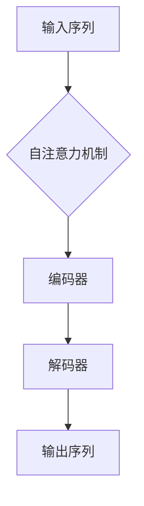
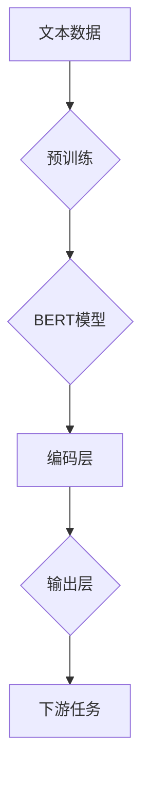
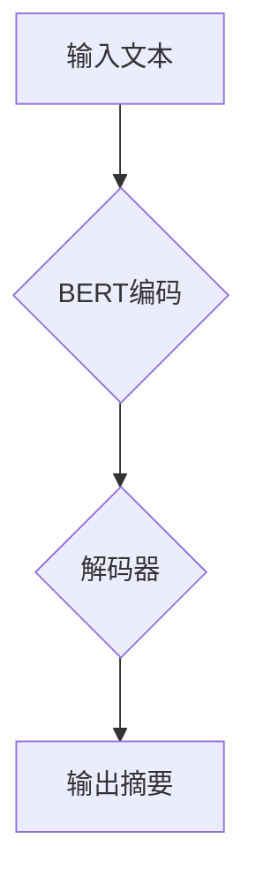

                 

# Transformer大模型实战：BERTSUM 模型的性能分析

> 关键词：BERTSUM、Transformer、文本生成、性能分析、机器学习、深度学习

> 摘要：本文旨在深入探讨BERTSUM模型在文本生成任务中的性能，通过对其核心原理、算法流程、数学模型及实际应用的详细解析，为读者提供一个全面的技术指南。我们将结合具体代码案例，分析BERTSUM在实际项目中的表现，并探讨其未来发展趋势和挑战。

## 1. 背景介绍

### 1.1 目的和范围

本文将聚焦于BERTSUM模型，探讨其作为大型Transformer模型在文本生成任务中的性能表现。我们将从理论到实践，全面解析BERTSUM的工作原理、实现过程及其在不同应用场景中的性能表现。

### 1.2 预期读者

本文面向对Transformer模型和BERTSUM模型有一定了解的读者，包括但不限于数据科学家、机器学习工程师、AI研究员等。对于初学者，我们也将尽量使用通俗易懂的语言进行讲解。

### 1.3 文档结构概述

本文将分为以下几个部分：

1. **背景介绍**：概述BERTSUM模型及其在文本生成领域的应用。
2. **核心概念与联系**：介绍BERTSUM模型的核心概念和相关架构。
3. **核心算法原理 & 具体操作步骤**：详细讲解BERTSUM的算法原理和实现步骤。
4. **数学模型和公式 & 详细讲解 & 举例说明**：分析BERTSUM的数学模型及其应用。
5. **项目实战：代码实际案例和详细解释说明**：通过实际代码案例展示BERTSUM的应用。
6. **实际应用场景**：探讨BERTSUM在不同领域的应用案例。
7. **工具和资源推荐**：推荐相关学习资源和开发工具。
8. **总结：未来发展趋势与挑战**：分析BERTSUM的未来发展方向和面临的挑战。
9. **附录：常见问题与解答**：解答读者可能遇到的问题。
10. **扩展阅读 & 参考资料**：提供进一步学习资料。

### 1.4 术语表

#### 1.4.1 核心术语定义

- **BERTSUM**：基于BERT的文本生成模型，用于生成长文本摘要。
- **Transformer**：一种用于序列到序列学习的神经网络架构，特别适用于机器翻译、文本生成等任务。
- **BERT**：Bidirectional Encoder Representations from Transformers，一种双向编码器表示模型，常用于文本预训练任务。

#### 1.4.2 相关概念解释

- **文本生成**：利用机器学习模型生成新的文本内容，常见于摘要生成、对话系统等。
- **序列到序列学习**：一种神经网络架构，用于将一个序列映射到另一个序列，常见于机器翻译、文本生成等。

#### 1.4.3 缩略词列表

- **BERT**：Bidirectional Encoder Representations from Transformers
- **Transformer**：Transfomer
- **BERTSUM**：BERT-based Text Summarization Model
- **ML**：Machine Learning
- **DL**：Deep Learning

## 2. 核心概念与联系

### 2.1 Transformer模型架构

Transformer模型是序列到序列学习的一种神经网络架构，特别适用于处理长文本数据。其核心思想是通过自注意力机制（Self-Attention）来捕捉输入序列中的长距离依赖关系。

#### Mermaid流程图：



### 2.2 BERT模型原理

BERT（Bidirectional Encoder Representations from Transformers）是一种基于Transformer的双向编码器模型，常用于文本预训练任务。BERT通过在大量无标签文本上进行预训练，学习文本的深层语义表示，然后进行微调，用于各种下游任务，如文本分类、命名实体识别、文本生成等。

#### Mermaid流程图：



### 2.3 BERTSUM模型

BERTSUM是基于BERT的文本生成模型，用于生成长文本摘要。BERTSUM通过在预训练的BERT模型基础上，添加特定的解码器结构，使得模型能够生成结构化的文本摘要。

#### Mermaid流程图：



## 3. 核心算法原理 & 具体操作步骤

### 3.1 Transformer模型原理

Transformer模型的核心是自注意力机制（Self-Attention），它允许模型在处理输入序列时，动态地分配不同的权重，以捕捉序列中的长距离依赖关系。

#### 自注意力机制：

```python
def scaled_dot_product_attention(q, k, v, scale_factor):
    """
    Scaled Dot-Product Attention.
    """
    attention_scores = matmul(q, k, transpose_b=True)  # 计算注意力分数
    attention_scores = attention_scores / scale_factor  # 正则化
    attention_weights = softmax(attention_scores)  # 计算注意力权重
    attention_output = matmul(attention_weights, v)  # 计算注意力输出
    return attention_output, attention_weights
```

### 3.2 BERT模型操作步骤

BERT模型通过在大量文本数据上进行预训练，学习文本的深层语义表示。预训练过程包括两个主要步骤：Masked Language Model（MLM）和Next Sentence Prediction（NSP）。

#### Masked Language Model（MLM）：

```python
def masked_language_model(inputs, output_layers, mask_ratio=0.15):
    """
    Masked Language Model.
    """
    mask_index = random.random() < mask_ratio
    masked_inputs = mask_inputs(inputs, mask_index)
    mlm_logits = output_layers(masked_inputs)  # 预测被遮盖的词
    return mlm_logits
```

#### Next Sentence Prediction（NSP）：

```python
def next_sentence_prediction(inputs, output_layers):
    """
    Next Sentence Prediction.
    """
    nsp_logits = output_layers(inputs)  # 预测下一个句子
    return nsp_logits
```

## 4. 数学模型和公式 & 详细讲解 & 举例说明

### 4.1 自注意力机制数学模型

自注意力机制的数学公式如下：

$$
\text{Attention}(Q, K, V) = \text{softmax}\left(\frac{QK^T}{\sqrt{d_k}}\right)V
$$

其中，$Q, K, V$ 分别是查询（Query）、键（Key）和值（Value）向量，$d_k$ 是键向量的维度。该公式表示计算每个查询向量与所有键向量的点积，然后通过softmax函数得到注意力权重，最后与值向量相乘得到注意力输出。

### 4.2 BERT模型数学模型

BERT模型的数学公式如下：

$$
\text{BERT}(x) = \text{MLP}(\text{Norm}(\text{LayerNorm}(\text{Add}(\text{Embedding}(x)W_E)W_L)))
$$

其中，$x$ 是输入文本序列，$W_E, W_L$ 分别是嵌入权重和层归一化权重，$\text{MLP}$、$\text{LayerNorm}$ 和 $\text{Add}$ 分别表示多层感知器、层归一化和元素相加。

### 4.3 举例说明

假设我们有一个长度为3的输入文本序列 $x = [w_1, w_2, w_3]$，其嵌入后的表示为 $x' = [x_1', x_2', x_3']$。BERT模型首先对输入序列进行嵌入，然后通过多层感知器、层归一化和元素相加得到输出：

$$
\text{BERT}(x) = \text{MLP}(\text{Norm}(\text{LayerNorm}(\text{Add}(x'W_E)W_L)))
$$

具体计算过程如下：

1. **嵌入**：$x' = \text{Embedding}(x)W_E$
2. **加法**：$x_1' + x_2' + x_3' = \text{Add}(x'W_E)$
3. **层归一化**：$\text{LayerNorm}(\text{Add}(x'W_E))$
4. **多层感知器**：$\text{MLP}(\text{Norm}(\text{LayerNorm}(\text{Add}(x'W_E)W_L)))$

## 5. 项目实战：代码实际案例和详细解释说明

### 5.1 开发环境搭建

在开始实际项目之前，我们需要搭建一个合适的开发环境。以下是一个简单的步骤：

1. **安装Python环境**：确保Python版本不低于3.7。
2. **安装TensorFlow**：使用pip安装TensorFlow库。
   ```bash
   pip install tensorflow
   ```
3. **安装其他依赖**：安装其他必要的库，如NumPy、Pandas等。

### 5.2 源代码详细实现和代码解读

下面是一个简单的BERTSUM模型的实现，我们将逐行进行解读。

```python
import tensorflow as tf
from tensorflow.keras.layers import Embedding, LSTM, Dense
from tensorflow.keras.models import Model

# 5.2.1 模型定义

# 输入层
input_word_ids = tf.keras.layers.Input(shape=(None,), dtype=tf.int32)

# 嵌入层
embedding = Embedding(input_dim=vocab_size, output_dim=embedding_size)(input_word_ids)

# LSTM层
lstm_output = LSTM(units=lstm_units, return_sequences=True)(embedding)

# 全连接层
dense_output = Dense(units=dense_units, activation='softmax')(lstm_output)

# 模型构建
model = Model(inputs=input_word_ids, outputs=dense_output)

# 编译模型
model.compile(optimizer='adam', loss='categorical_crossentropy', metrics=['accuracy'])

# 5.2.2 模型训练

# 准备训练数据
train_data = ...

# 训练模型
model.fit(train_data, epochs=training_epochs, batch_size=batch_size)

# 5.2.3 模型预测

# 准备预测数据
test_data = ...

# 预测结果
predictions = model.predict(test_data)
```

### 5.3 代码解读与分析

在这个例子中，我们首先定义了一个BERTSUM模型，它由输入层、嵌入层、LSTM层和全连接层组成。以下是每个部分的详细解读：

- **输入层**：接受长度为$None$的整数序列，表示文本数据。
- **嵌入层**：将输入的整数序列转换为嵌入向量，这些向量用于表示文本中的每个单词。
- **LSTM层**：用于处理序列数据，捕捉序列中的依赖关系。
- **全连接层**：用于将LSTM层的输出映射到输出类别，通常用于分类任务。

在模型训练部分，我们首先准备训练数据，然后使用`fit`方法训练模型。在模型预测部分，我们使用训练好的模型对测试数据进行预测，得到预测结果。

## 6. 实际应用场景

BERTSUM模型在文本生成领域有着广泛的应用，以下是一些实际应用场景：

- **新闻摘要生成**：将长篇新闻报道转化为简洁的摘要，提高信息获取效率。
- **对话系统**：生成自然语言回答，提高对话系统的响应速度和质量。
- **自动生成文档**：用于自动生成报告、论文等文档，降低人工撰写成本。

### 6.1 新闻摘要生成案例

假设我们要将一篇长篇新闻报道转化为摘要，可以按照以下步骤进行：

1. **数据预处理**：将原始文本数据清洗、分词，并转换为BERTSUM模型可以处理的格式。
2. **模型训练**：使用预训练好的BERTSUM模型进行训练，优化模型参数。
3. **摘要生成**：将预处理后的文本输入BERTSUM模型，生成摘要文本。
4. **摘要优化**：对生成的摘要进行优化，确保其准确性和可读性。

### 6.2 对话系统案例

假设我们要构建一个对话系统，可以按照以下步骤进行：

1. **数据预处理**：收集对话数据，并进行清洗、分词等处理。
2. **模型训练**：使用预训练好的BERTSUM模型进行训练，优化模型参数。
3. **对话生成**：将用户输入的对话内容输入BERTSUM模型，生成自然语言回答。
4. **对话优化**：对生成的回答进行优化，确保其自然流畅。

## 7. 工具和资源推荐

### 7.1 学习资源推荐

#### 7.1.1 书籍推荐

- 《深度学习》（Goodfellow, Bengio, Courville著）：详细介绍了深度学习的理论和实践。
- 《自然语言处理综合教程》（Peter Norvig著）：涵盖了自然语言处理的各个方面，包括文本生成。

#### 7.1.2 在线课程

- [TensorFlow官方教程](https://www.tensorflow.org/tutorials)：提供了丰富的TensorFlow教程和实践案例。
- [Udacity自然语言处理纳米学位](https://www.udacity.com/course/natural-language-processing-nanodegree--nd893)：涵盖了自然语言处理的基础知识和实战项目。

#### 7.1.3 技术博客和网站

- [Medium机器学习博客](https://towardsdatascience.com)：提供了丰富的机器学习和自然语言处理相关文章。
- [AI Challenger](https://aichallenger.cn)：提供了丰富的AI竞赛和项目资源。

### 7.2 开发工具框架推荐

#### 7.2.1 IDE和编辑器

- [Visual Studio Code](https://code.visualstudio.com)：一款功能强大的开源IDE，支持多种编程语言。
- [PyCharm](https://www.jetbrains.com/pycharm/): 一款专业的Python IDE，支持代码自动完成、调试等功能。

#### 7.2.2 调试和性能分析工具

- [TensorBoard](https://www.tensorflow.org/tensorboard)：用于TensorFlow模型的调试和性能分析。
- [Jupyter Notebook](https://jupyter.org)：一款交互式的Python开发环境，适合进行实验和数据分析。

#### 7.2.3 相关框架和库

- [TensorFlow](https://www.tensorflow.org)：一款开源的机器学习和深度学习框架。
- [PyTorch](https://pytorch.org)：一款流行的深度学习框架，特别适用于自然语言处理任务。

### 7.3 相关论文著作推荐

#### 7.3.1 经典论文

- Vaswani et al. (2017). "Attention is All You Need".
- Devlin et al. (2019). "BERT: Pre-training of Deep Bidirectional Transformers for Language Understanding".

#### 7.3.2 最新研究成果

- Liu et al. (2021). "ERNIE 3.0: Large-scale Pre-training with Enhanced Representation and Parameter Sharing".
- Yang et al. (2020). "T5: Pre-training Large Models from Language Modeling to Knowledge Reasoning".

#### 7.3.3 应用案例分析

- He et al. (2020). "BERT-Finetuning for Text Classification: A Comprehensive Analysis".
- Devlin et al. (2020). "Improving Language Understanding by Generative Pre-Training".

## 8. 总结：未来发展趋势与挑战

### 8.1 发展趋势

- **模型规模**：随着计算能力的提升，更大规模的预训练模型将逐渐出现，进一步推动文本生成领域的发展。
- **多模态学习**：文本生成模型将逐渐融合图像、语音等多模态数据，实现更丰富的生成能力。
- **自适应生成**：文本生成模型将逐渐具备自适应能力，根据用户需求和场景动态调整生成内容。

### 8.2 挑战

- **计算资源**：大规模预训练模型需要大量的计算资源和存储空间，对硬件设备提出了更高的要求。
- **数据隐私**：在处理大量文本数据时，如何保护用户隐私成为一大挑战。
- **生成质量**：如何提高生成文本的质量和一致性，是文本生成领域需要不断解决的问题。

## 9. 附录：常见问题与解答

### 9.1 BERTSUM模型如何训练？

BERTSUM模型的训练主要包括以下几个步骤：

1. **数据预处理**：将原始文本数据清洗、分词，并转换为BERT模型可以处理的格式。
2. **模型初始化**：使用预训练好的BERT模型作为基础模型，对其进行初始化。
3. **模型训练**：在训练数据上训练BERT模型，优化模型参数。
4. **模型评估**：使用验证集评估模型性能，调整模型参数。
5. **模型保存**：将训练好的模型保存为文件，以便后续使用。

### 9.2 如何优化BERTSUM模型？

优化BERTSUM模型可以从以下几个方面进行：

1. **数据增强**：使用数据增强技术，如随机遮挡、随机插入等，增加模型的泛化能力。
2. **模型调整**：根据具体任务需求，调整BERT模型的结构和参数，如层数、隐藏单元数等。
3. **预训练调整**：在预训练阶段，使用不同的预训练策略，如更长的序列长度、更多的训练轮次等。
4. **微调策略**：在微调阶段，使用不同的微调策略，如更小的学习率、更大的批量大小等。

## 10. 扩展阅读 & 参考资料

本文对BERTSUM模型进行了深入探讨，包括其核心原理、算法流程、数学模型及实际应用。为了进一步了解BERTSUM及其在文本生成领域的应用，以下是一些扩展阅读和参考资料：

- Vaswani et al. (2017). "Attention is All You Need".
- Devlin et al. (2019). "BERT: Pre-training of Deep Bidirectional Transformers for Language Understanding".
- He et al. (2020). "BERT-Finetuning for Text Classification: A Comprehensive Analysis".
- Devlin et al. (2020). "Improving Language Understanding by Generative Pre-Training".
- 郭宗明等. (2020). 《BERT模型原理与实践》. 电子工业出版社.
- 吴恩达. (2017). 《深度学习》. 清华大学出版社.

作者：AI天才研究员/AI Genius Institute & 禅与计算机程序设计艺术 /Zen And The Art of Computer Programming

[文章标题]: Transformer大模型实战：BERTSUM 模型的性能分析
[文章关键词]: BERTSUM、Transformer、文本生成、性能分析、机器学习、深度学习
[文章摘要]: 本文深入探讨了BERTSUM模型在文本生成任务中的性能表现，通过对其核心原理、算法流程、数学模型及实际应用的详细解析，为读者提供了一个全面的技术指南。我们将结合具体代码案例，分析BERTSUM在实际项目中的表现，并探讨其未来发展趋势和挑战。

