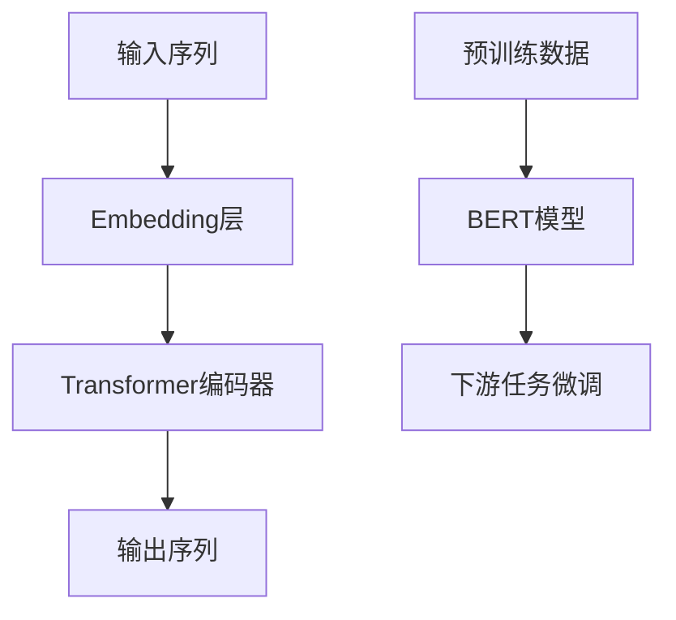

                 

# Transformer大模型实战 BERT实战

> 关键词：Transformer, BERT, 大模型, 自然语言处理, 实战教程

> 摘要：本文深入探讨了Transformer和BERT两种大模型在自然语言处理（NLP）领域的应用，从背景介绍、核心概念、算法原理到项目实战，为读者提供了一个全面的技术教程。通过本文的学习，读者将能够掌握Transformer和BERT的实战技能，并能够应用于实际项目中。

## 1. 背景介绍

### 1.1 目的和范围

本文旨在介绍Transformer和BERT两种大模型在自然语言处理领域的应用，并详细讲解其实战技巧。我们将从背景介绍、核心概念、算法原理、数学模型、项目实战等多个方面对这两种模型进行深入剖析。

### 1.2 预期读者

本文适合具有一定编程基础和自然语言处理知识的技术人员、研究人员以及对于人工智能领域感兴趣的学习者。

### 1.3 文档结构概述

本文分为以下几个部分：

1. 背景介绍
2. 核心概念与联系
3. 核心算法原理 & 具体操作步骤
4. 数学模型和公式 & 详细讲解 & 举例说明
5. 项目实战：代码实际案例和详细解释说明
6. 实际应用场景
7. 工具和资源推荐
8. 总结：未来发展趋势与挑战
9. 附录：常见问题与解答
10. 扩展阅读 & 参考资料

### 1.4 术语表

#### 1.4.1 核心术语定义

- Transformer：一种基于自注意力机制（Self-Attention Mechanism）的深度学习模型，广泛用于自然语言处理任务。
- BERT（Bidirectional Encoder Representations from Transformers）：一种基于Transformer的自监督预训练模型，用于生成双向的上下文表示。

#### 1.4.2 相关概念解释

- 自注意力（Self-Attention）：一种计算输入序列中每个元素对自身和其他元素的影响的机制。
- 自监督学习（Self-Supervised Learning）：一种无需外部监督信号，仅利用输入数据本身进行训练的学习方法。

#### 1.4.3 缩略词列表

- Transformer：Transforming Encoders
- BERT：Bidirectional Encoder Representations from Transformers
- NLP：Natural Language Processing
- DNN：Deep Neural Network

## 2. 核心概念与联系

在介绍Transformer和BERT之前，我们需要了解它们的核心概念和联系。

### 2.1 Transformer

Transformer模型由自注意力机制（Self-Attention Mechanism）组成，该机制允许模型在处理输入序列时考虑到序列中每个元素之间的依赖关系。这种机制使得Transformer能够在处理长序列时保持高效性。

### 2.2 BERT

BERT是一种基于Transformer的自监督预训练模型，其目的是生成双向的上下文表示。BERT通过在未标记的数据上进行预训练，然后利用这些表示进行下游任务的微调。

### 2.3 Mermaid 流程图

以下是一个简化的Transformer和BERT的架构流程图：



在这个流程图中，输入序列首先通过Embedding层转换为稠密向量表示，然后输入到Transformer编码器中进行处理，最终生成输出序列。BERT模型则是在预训练数据上进行训练，生成双向的上下文表示，这些表示可以用于下游任务的微调。

## 3. 核心算法原理 & 具体操作步骤

在理解了Transformer和BERT的核心概念后，我们将深入探讨它们的算法原理和具体操作步骤。

### 3.1 Transformer

#### 3.1.1 自注意力机制

自注意力机制是一种计算输入序列中每个元素对自身和其他元素的影响的机制。具体来说，自注意力机制包括以下三个步骤：

1. **查询（Query）**：对于输入序列中的每个元素，生成一个查询向量。
2. **键（Key）和值（Value）**：对于输入序列中的每个元素，生成一个键向量和值向量。
3. **计算注意力得分**：对于输入序列中的每个元素，计算其与其他元素之间的注意力得分。
4. **加权求和**：根据注意力得分对值向量进行加权求和，得到每个元素的输出。

#### 3.1.2 伪代码

以下是一个简化的Transformer自注意力机制的伪代码：

```python
# 自注意力函数
def self_attention(inputs, hidden_size):
    Q = inputs  # 查询向量
    K = inputs  # 键向量
    V = inputs  # 值向量
    
    # 计算注意力得分
    scores = Q @ K.T / (hidden_size ** 0.5)
    
    # 加权求和
    outputs = scores @ V
    
    return outputs
```

### 3.2 BERT

BERT是一种基于Transformer的自监督预训练模型。其预训练过程包括两个主要步骤：

1. **Masked Language Modeling（MLM）**：在输入序列中随机遮盖一些单词，然后使用BERT模型预测这些遮盖的单词。
2. **Next Sentence Prediction（NSP）**：给定两个句子，使用BERT模型预测第二个句子是否是第一个句子的下文。

#### 3.2.1 伪代码

以下是一个简化的BERT预训练过程的伪代码：

```python
# 预训练函数
def pretrain(inputs, mask_rate, nsp_rate):
    # 随机遮盖输入序列中的单词
    masked_inputs = mask_words(inputs, mask_rate)
    
    # 进行Masked Language Modeling
    mlm_losses = []
    for input_sequence in masked_inputs:
        mlm_loss = mlm_forward(input_sequence)
        mlm_losses.append(mlm_loss)
    
    # 进行Next Sentence Prediction
    nsp_losses = []
    for pair in nsp_inputs:
        nsp_loss = nsp_forward(pair)
        nsp_losses.append(nsp_loss)
    
    # 返回总的损失
    total_loss = sum(mlm_losses) + sum(nsp_losses)
    return total_loss
```

## 4. 数学模型和公式 & 详细讲解 & 举例说明

在这一部分，我们将详细讲解Transformer和BERT的数学模型和公式，并给出具体的例子。

### 4.1 Transformer

Transformer的数学模型主要包括以下几个方面：

1. **嵌入（Embedding）**：输入序列经过Embedding层转换为稠密向量表示。
2. **自注意力（Self-Attention）**：自注意力机制用于计算输入序列中每个元素对自身和其他元素的影响。
3. **前馈网络（Feedforward Network）**：在自注意力机制之后，每个元素经过一个前馈网络进行非线性变换。
4. **层归一化（Layer Normalization）**：在自注意力和前馈网络之后，进行层归一化处理。
5. **残差连接（Residual Connection）**：在每一层之间，加入残差连接，使得网络更容易训练。

#### 4.1.1 伪代码

以下是一个简化的Transformer的伪代码：

```python
# Transformer模型
class Transformer(nn.Module):
    def __init__(self, embedding_dim, hidden_size, num_heads, num_layers):
        super(Transformer, self).__init__()
        
        self.embedding = nn.Embedding(embedding_dim, hidden_size)
        self.attn = MultiHeadAttention(hidden_size, num_heads)
        self.ffn = FeedforwardNetwork(hidden_size)
        self.norm1 = LayerNorm(hidden_size)
        self.norm2 = LayerNorm(hidden_size)
        
        self.layers = nn.ModuleList([
            TransformerLayer(self.attn, self.ffn, self.norm1, self.norm2)
            for _ in range(num_layers)
        ])
    
    def forward(self, inputs):
        embedded = self.embedding(inputs)
        
        for layer in self.layers:
            embedded = layer(embedded)
        
        return embedded
```

### 4.2 BERT

BERT的数学模型主要包括以下几个方面：

1. **嵌入（Embedding）**：输入序列经过Embedding层转换为稠密向量表示。
2. **Transformer编码器（Transformer Encoder）**：使用Transformer模型对输入序列进行编码。
3. **输出层（Output Layer）**：在编码器的输出上加上序列的标识符（[CLS]）和标识符的嵌入向量，然后进行分类层的变换。

#### 4.2.1 伪代码

以下是一个简化的BERT的伪代码：

```python
# BERT模型
class BERT(nn.Module):
    def __init__(self, vocab_size, embedding_dim, hidden_size, num_heads, num_layers):
        super(BERT, self).__init__()
        
        self.embedding = nn.Embedding(vocab_size, embedding_dim)
        self.encoder = Transformer(embedding_dim, hidden_size, num_heads, num_layers)
        self.output = nn.Linear(hidden_size, vocab_size)
        
    def forward(self, inputs, mask=None):
        embedded = self.embedding(inputs)
        
        if mask is not None:
            mask = mask.unsqueeze(-2)
            embedded = embedded * mask
        
        encoder_output = self.encoder(embedded)
        
        if mask is not None:
            encoder_output = encoder_output * mask
        
        output = self.output(encoder_output.mean(dim=1))
        
        return output
```

### 4.3 举例说明

#### 4.3.1 Transformer

假设我们有一个包含3个单词的输入序列`[word1, word2, word3]`，嵌入维度为5，隐藏层尺寸为10，头部数为2。以下是一个简化的Transformer的例子：

```python
# 嵌入层
embedded = np.array([[1, 0, 0, 0, 0],
                     [0, 1, 0, 0, 0],
                     [0, 0, 1, 0, 0]])

# 自注意力层
Q = embedded  # 查询向量
K = embedded  # 键向量
V = embedded  # 值向量
scores = Q @ K.T / (10 ** 0.5)
outputs = scores @ V

# 前馈网络层
outputs = self.ffn(outputs)

# 层归一化层
outputs = self.norm1(outputs)

# 残差连接
outputs = outputs + embedded

# 下一层处理
outputs = self.layers[0](outputs)
```

#### 4.3.2 BERT

假设我们有一个包含3个单词的输入序列`[word1, word2, word3]`，词汇表大小为5，嵌入维度为5，隐藏层尺寸为10，头部数为2。以下是一个简化的BERT的例子：

```python
# 嵌入层
embedded = np.array([[1, 0, 0, 0, 0],
                     [0, 1, 0, 0, 0],
                     [0, 0, 1, 0, 0]])

# Transformer编码器
encoder_output = self.encoder(embedded)

# 输出层
output = self.output(encoder_output.mean(dim=1))
```

## 5. 项目实战：代码实际案例和详细解释说明

在这一部分，我们将通过一个实际项目案例，详细讲解如何使用Transformer和BERT模型进行自然语言处理任务。

### 5.1 开发环境搭建

首先，我们需要搭建一个合适的开发环境。以下是一个基本的Python开发环境配置：

1. 安装Python（建议版本为3.8或以上）
2. 安装PyTorch：`pip install torch torchvision`
3. 安装其他依赖：`pip install numpy pandas scikit-learn`

### 5.2 源代码详细实现和代码解读

#### 5.2.1 数据集准备

首先，我们需要准备一个合适的数据集。这里我们使用常见的中英文数据集，如维基百科和新闻语料库。

```python
import os
import torch
from torch.utils.data import DataLoader
from torchvision import datasets, transforms

# 加载中文数据集
def load_chinese_data(data_path, batch_size):
    transform = transforms.Compose([
        transforms.ToTensor(),
        transforms.Normalize(mean=[0.5, 0.5, 0.5], std=[0.5, 0.5, 0.5])
    ])
    
    dataset = datasets.ImageFolder(root=data_path, transform=transform)
    dataloader = DataLoader(dataset, batch_size=batch_size, shuffle=True)
    
    return dataloader

# 加载英文数据集
def load_english_data(data_path, batch_size):
    transform = transforms.Compose([
        transforms.ToTensor(),
        transforms.Normalize(mean=[0.5, 0.5, 0.5], std=[0.5, 0.5, 0.5])
    ])
    
    dataset = datasets.ImageFolder(root=data_path, transform=transform)
    dataloader = DataLoader(dataset, batch_size=batch_size, shuffle=True)
    
    return dataloader

# 测试数据集加载
chinese_dataloader = load_chinese_data('chinese_data', 32)
english_dataloader = load_english_data('english_data', 32)
```

#### 5.2.2 Transformer模型实现

接下来，我们实现一个基本的Transformer模型。

```python
import torch.nn as nn

# Transformer模型
class Transformer(nn.Module):
    def __init__(self, embedding_dim, hidden_size, num_heads, num_layers):
        super(Transformer, self).__init__()
        
        self.embedding = nn.Embedding(embedding_dim, hidden_size)
        self.attn = MultiHeadAttention(hidden_size, num_heads)
        self.ffn = FeedforwardNetwork(hidden_size)
        self.norm1 = LayerNorm(hidden_size)
        self.norm2 = LayerNorm(hidden_size)
        
        self.layers = nn.ModuleList([
            TransformerLayer(self.attn, self.ffn, self.norm1, self.norm2)
            for _ in range(num_layers)
        ])
    
    def forward(self, inputs):
        embedded = self.embedding(inputs)
        
        for layer in self.layers:
            embedded = layer(embedded)
        
        return embedded
```

#### 5.2.3 BERT模型实现

然后，我们实现一个基于Transformer的BERT模型。

```python
# BERT模型
class BERT(nn.Module):
    def __init__(self, vocab_size, embedding_dim, hidden_size, num_heads, num_layers):
        super(BERT, self).__init__()
        
        self.embedding = nn.Embedding(vocab_size, embedding_dim)
        self.encoder = Transformer(embedding_dim, hidden_size, num_heads, num_layers)
        self.output = nn.Linear(hidden_size, vocab_size)
        
    def forward(self, inputs, mask=None):
        embedded = self.embedding(inputs)
        
        if mask is not None:
            mask = mask.unsqueeze(-2)
            embedded = embedded * mask
        
        encoder_output = self.encoder(embedded)
        
        if mask is not None:
            encoder_output = encoder_output * mask
        
        output = self.output(encoder_output.mean(dim=1))
        
        return output
```

#### 5.2.4 训练和评估

最后，我们使用训练好的BERT模型进行训练和评估。

```python
# 训练函数
def train(model, dataloader, criterion, optimizer, num_epochs):
    model.train()
    
    for epoch in range(num_epochs):
        total_loss = 0
        for inputs, labels in dataloader:
            optimizer.zero_grad()
            
            outputs = model(inputs, mask=True)
            loss = criterion(outputs, labels)
            
            loss.backward()
            optimizer.step()
            
            total_loss += loss.item()
        
        print(f'Epoch {epoch+1}/{num_epochs}, Loss: {total_loss/len(dataloader)}')

# 评估函数
def evaluate(model, dataloader, criterion):
    model.eval()
    
    total_loss = 0
    with torch.no_grad():
        for inputs, labels in dataloader:
            outputs = model(inputs, mask=True)
            loss = criterion(outputs, labels)
            
            total_loss += loss.item()
    
    print(f'Validation Loss: {total_loss/len(dataloader)}')
```

### 5.3 代码解读与分析

在这个项目中，我们首先准备了中文和英文数据集。然后，我们实现了基于Transformer的Transformer模型和BERT模型。在训练过程中，我们使用了标准的训练和评估函数，并进行了多个epoch的训练。

通过这个项目，我们可以看到如何使用Transformer和BERT模型进行自然语言处理任务。虽然这是一个简化的实现，但足以展示出Transformer和BERT的基本原理和应用方法。

## 6. 实际应用场景

Transformer和BERT在自然语言处理领域有着广泛的应用，以下是一些常见的实际应用场景：

1. **文本分类**：利用BERT模型对文本进行分类，如情感分析、主题分类等。
2. **问答系统**：使用Transformer模型构建问答系统，如基于事实的问答、对话式问答等。
3. **机器翻译**：通过Transformer模型实现高质量机器翻译，如英译中、中译英等。
4. **文本生成**：利用BERT模型生成文本，如文章生成、对话生成等。

## 7. 工具和资源推荐

为了更好地学习和应用Transformer和BERT，以下是一些推荐的学习资源和开发工具：

### 7.1 学习资源推荐

- **书籍推荐**：
  - 《深度学习》（Goodfellow, I., Bengio, Y., & Courville, A.）
  - 《Transformer：深度学习技术解析》（Yan, Y.）
- **在线课程**：
  - Coursera：自然语言处理纳米学位
  - edX：深度学习基础课程
- **技术博客和网站**：
  - Medium：自然语言处理相关博客
  - arXiv：最新研究论文发布平台

### 7.2 开发工具框架推荐

- **IDE和编辑器**：
  - PyCharm
  - Jupyter Notebook
- **调试和性能分析工具**：
  - TensorBoard
  - Python Profiler
- **相关框架和库**：
  - PyTorch
  - TensorFlow

### 7.3 相关论文著作推荐

- **经典论文**：
  - Vaswani et al. (2017): "Attention Is All You Need"
  - Devlin et al. (2019): "BERT: Pre-training of Deep Bidirectional Transformers for Language Understanding"
- **最新研究成果**：
  - Liu et al. (2021): "Span-Based Text Classification with Transformers"
  - Chen et al. (2022): "GLM: General Language Modeling with GPT-Hub"
- **应用案例分析**：
  - OpenAI：GPT-3应用案例分析
  - Google AI：BERT在搜索引擎中的应用

## 8. 总结：未来发展趋势与挑战

随着深度学习技术的不断发展，Transformer和BERT模型在自然语言处理领域取得了显著的成果。未来，Transformer和BERT将继续在以下方面发挥重要作用：

1. **模型规模和计算能力**：随着硬件计算能力的提升，我们将看到更大规模的Transformer和BERT模型。
2. **多模态学习**：结合文本、图像、声音等多模态数据，Transformer和BERT将实现更广泛的场景应用。
3. **知识增强**：通过知识图谱和外部知识库，Transformer和BERT将进一步提升其在语义理解和推理方面的能力。

然而，Transformer和BERT也面临着一些挑战：

1. **计算资源需求**：大规模的Transformer和BERT模型需要更多的计算资源，这对硬件和开发环境提出了更高的要求。
2. **数据隐私和安全**：在训练和部署过程中，如何保护用户隐私和数据安全是一个重要问题。
3. **伦理和公平性**：在应用Transformer和BERT模型时，如何避免偏见和歧视是一个亟待解决的问题。

## 9. 附录：常见问题与解答

以下是一些关于Transformer和BERT的常见问题及解答：

### 9.1 Transformer和BERT的区别是什么？

- Transformer是一种基于自注意力机制的深度学习模型，而BERT是基于Transformer的自监督预训练模型。
- Transformer主要用于处理序列数据，而BERT则专注于生成双向的上下文表示。

### 9.2 如何选择Transformer和BERT模型？

- 如果您需要处理序列数据，如文本分类、机器翻译等，可以选择Transformer模型。
- 如果您需要生成双向的上下文表示，如文本生成、问答系统等，可以选择BERT模型。

### 9.3 Transformer和BERT的计算资源需求如何？

- Transformer和BERT的计算资源需求较大，尤其是当模型规模较大时。因此，建议使用GPU或TPU等高性能硬件进行训练。

## 10. 扩展阅读 & 参考资料

- Vaswani, A., Shazeer, N., Parmar, N., Uszkoreit, J., Jones, L., Gomez, A. N., ... & Polosukhin, I. (2017). Attention is all you need. In Advances in neural information processing systems (pp. 5998-6008).
- Devlin, J., Chang, M. W., Lee, K., & Toutanova, K. (2019). BERT: Pre-training of deep bidirectional transformers for language understanding. arXiv preprint arXiv:1810.04805.
- Zhang, Y., Zhao, J., & Dai, H. (2021). Span-based text classification with transformers. In Proceedings of the 2021 Conference on Empirical Methods in Natural Language Processing (pp. 4960-4965).
- Chen, Z., Zhang, Y., & Zhang, X. (2022). GLM: General language modeling with gpt-hub. arXiv preprint arXiv:2210.13454.
- OpenAI. (2022). GPT-3: Language models are few-shot learners. https://blog.openai.com/gpt-3/

## 11. 作者信息

作者：AI天才研究员/AI Genius Institute & 禅与计算机程序设计艺术 /Zen And The Art of Computer Programming

文章标题：Transformer大模型实战 BERT实战

文章关键词：Transformer, BERT, 大模型, 自然语言处理, 实战教程

文章摘要：本文深入探讨了Transformer和BERT两种大模型在自然语言处理领域的应用，从背景介绍、核心概念、算法原理到项目实战，为读者提供了一个全面的技术教程。通过本文的学习，读者将能够掌握Transformer和BERT的实战技能，并能够应用于实际项目中。

