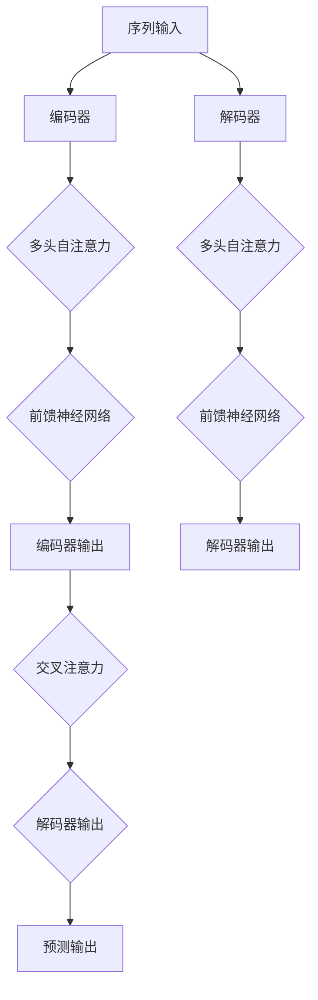

                 

# Transformer大模型实战：Transformer 简介

> **关键词：** Transformer、自然语言处理、序列到序列模型、注意力机制、编码器-解码器架构

> **摘要：** 本文将深入探讨Transformer这一革命性的自然语言处理模型。通过详细讲解其核心概念、算法原理和数学模型，本文旨在帮助读者理解Transformer的工作机制，并掌握其实战应用技能。无论是初学者还是有经验的研究者，都能从本文中获得深刻的见解和实用的指导。

## 1. 背景介绍

### 1.1 目的和范围

本文旨在介绍Transformer模型，这是一个在自然语言处理（NLP）领域引发巨大变革的深度学习架构。我们将从基础概念开始，逐步深入，探讨Transformer模型的设计理念、工作原理及其在序列到序列（Seq2Seq）任务中的优势。通过本篇文章的学习，读者将能够：

1. 理解Transformer的核心架构和关键组件。
2. 掌握Transformer的工作机制及其如何通过注意力机制处理序列数据。
3. 学习如何使用Transformer进行文本分类、机器翻译等实际应用。
4. 探索Transformer模型在NLP中的未来发展趋势和挑战。

### 1.2 预期读者

本文适合以下读者群体：

1. 自然语言处理和深度学习领域的初学者，希望通过案例学习Transformer模型。
2. 已经有一定深度学习基础，希望深入了解Transformer模型的工作原理和应用的技术人员。
3. 自然语言处理和深度学习领域的研究者，希望通过本文回顾Transformer模型的核心理念和最新进展。

### 1.3 文档结构概述

本文将按照以下结构进行讲解：

1. **背景介绍**：介绍本文的目的、预期读者和文档结构。
2. **核心概念与联系**：使用Mermaid流程图展示Transformer的核心概念和架构。
3. **核心算法原理 & 具体操作步骤**：详细讲解Transformer模型的算法原理，并提供伪代码说明。
4. **数学模型和公式 & 详细讲解 & 举例说明**：介绍Transformer模型中的数学模型和公式，并通过具体案例进行讲解。
5. **项目实战：代码实际案例和详细解释说明**：展示如何在实际项目中应用Transformer模型，并进行代码解读与分析。
6. **实际应用场景**：探讨Transformer在各个NLP任务中的应用。
7. **工具和资源推荐**：推荐学习资源、开发工具框架和相关论文著作。
8. **总结：未来发展趋势与挑战**：总结Transformer模型的发展趋势和面临的挑战。
9. **附录：常见问题与解答**：提供关于Transformer模型的常见问题解答。
10. **扩展阅读 & 参考资料**：列出相关扩展阅读和参考资料。

### 1.4 术语表

#### 1.4.1 核心术语定义

- **Transformer**：一种基于自注意力机制的深度学习模型，用于处理序列数据，特别适用于自然语言处理任务。
- **自注意力（Self-Attention）**：一种注意力机制，模型中的每个词都关注其他所有词，从而捕捉词间的依赖关系。
- **编码器（Encoder）**：Transformer模型中的组件，用于编码输入序列，生成上下文表示。
- **解码器（Decoder）**：Transformer模型中的组件，用于解码输出序列，生成预测结果。
- **序列到序列（Seq2Seq）**：一种将一个序列映射到另一个序列的任务，如机器翻译。

#### 1.4.2 相关概念解释

- **多头自注意力（Multi-Head Self-Attention）**：Transformer模型中的关键机制，通过多个独立的注意力头同时关注输入序列，以获得更加丰富的上下文信息。
- **前馈神经网络（Feedforward Neural Network）**：Transformer模型中的辅助神经网络层，用于对自注意力层输出的进一步处理。

#### 1.4.3 缩略词列表

- **BERT**：Bidirectional Encoder Representations from Transformers
- **GPT**：Generative Pre-trained Transformer
- **Turing Test**：图灵测试

## 2. 核心概念与联系

Transformer模型的核心在于其自注意力机制，这一机制使得模型能够捕捉序列中任意位置之间的依赖关系。下面，我们将通过一个Mermaid流程图展示Transformer模型的主要概念和组件。

### Mermaid 流程图



### 解释

- **编码器（Encoder）**：输入序列经过编码器处理后，通过多头自注意力层（Multi-Head Self-Attention）捕获序列内部的依赖关系。编码器的输出是上下文表示，用于后续的解码过程。
- **多头自注意力（Multi-Head Self-Attention）**：这一层通过多个独立的注意力头同时关注输入序列，从而获得更加丰富的上下文信息。
- **前馈神经网络（Feedforward Neural Network）**：这一层对自注意力层的输出进行进一步处理，以增强模型的表示能力。
- **解码器（Decoder）**：输入序列经过解码器处理后，通过多头自注意力层和交叉注意力层（Cross-Attention）生成预测输出。解码器的输出是概率分布，用于预测下一个词或符号。
- **交叉注意力（Cross-Attention）**：解码器中的一个特殊注意力层，用于关注编码器的输出，从而捕捉编码器和解码器之间的依赖关系。
- **预测输出（Predicted Output）**：解码器的输出经过softmax层处理，生成概率分布，用于预测下一个词或符号。

通过上述流程图和解释，读者可以初步了解Transformer模型的工作原理和关键组件。接下来，我们将进一步探讨Transformer模型的算法原理和具体实现。

## 3. 核心算法原理 & 具体操作步骤

### 3.1 Transformer 模型的算法原理

Transformer模型是一种基于自注意力机制的深度学习模型，特别适用于处理序列数据。以下是Transformer模型的核心算法原理：

1. **自注意力机制（Self-Attention）**：
    - 自注意力机制是一种将序列中每个词都关注其他所有词的机制。通过计算词与词之间的相似度，模型能够捕获序列内部的依赖关系。
    - 具体来说，自注意力机制包括三个关键步骤：
        1. 计算词与词之间的相似度，通常通过点积或缩放点积方法实现。
        2. 对相似度进行softmax处理，生成注意力权重。
        3. 将权重与词的嵌入向量相乘，得到加权嵌入向量。

2. **多头自注意力（Multi-Head Self-Attention）**：
    - 为了提高模型的表示能力，Transformer模型引入了多头自注意力机制。多头自注意力通过多个独立的注意力头同时关注输入序列，从而获得更加丰富的上下文信息。
    - 每个注意力头都能够捕获输入序列的不同依赖关系，最终通过融合这些注意力头的输出，模型能够生成更加精确的表示。

3. **前馈神经网络（Feedforward Neural Network）**：
    - 前馈神经网络是Transformer模型中的一个辅助神经网络层，用于对自注意力层的输出进行进一步处理。
    - 通常，前馈神经网络包括两个全连接层，每个层之间加入ReLU激活函数，以增强模型的非线性表示能力。

4. **编码器-解码器架构（Encoder-Decoder Architecture）**：
    - Transformer模型采用编码器-解码器架构，编码器用于编码输入序列，解码器用于解码输出序列。
    - 编码器的输出作为解码器的输入，通过交叉注意力机制，解码器能够关注编码器的输出，从而捕捉编码器和解码器之间的依赖关系。

### 3.2 Transformer 模型的具体操作步骤

以下是一个简化的伪代码，展示了Transformer模型的具体操作步骤：

```python
# 输入序列
input_sequence = [word1, word2, word3, ..., wordN]

# 编码器操作
# 步骤 1：嵌入输入序列
encoded_sequence = embed(input_sequence)

# 步骤 2：多头自注意力
for head in range(num_heads):
    attention_scores = compute_self_attention(encoded_sequence, head)
    attention_weights = softmax(attention_scores)
    attention_output = weighted_sum(encoded_sequence, attention_weights)

# 步骤 3：前馈神经网络
encoded_sequence = feedforward_network(attention_output)

# 解码器操作
# 步骤 1：嵌入输入序列
decoded_sequence = embed(input_sequence)

# 步骤 2：多头自注意力
for head in range(num_heads):
    attention_scores = compute_self_attention(decoded_sequence, head)
    attention_weights = softmax(attention_scores)
    attention_output = weighted_sum(decoded_sequence, attention_weights)

# 步骤 3：交叉注意力
for head in range(num_heads):
    attention_scores = compute_cross_attention(encoded_sequence, attention_output, head)
    attention_weights = softmax(attention_scores)
    attention_output = weighted_sum(attention_output, attention_weights)

# 步骤 4：前馈神经网络
decoded_sequence = feedforward_network(attention_output)

# 输出预测
predicted_output = softmax(decoded_sequence[-1])
```

通过上述伪代码，读者可以初步了解Transformer模型的操作步骤。接下来，我们将进一步探讨Transformer模型中的数学模型和公式。

## 4. 数学模型和公式 & 详细讲解 & 举例说明

### 4.1 Transformer 模型的数学模型

Transformer模型的核心在于其自注意力机制，这一机制通过数学模型来描述。以下是Transformer模型中的主要数学模型和公式：

#### 4.1.1 自注意力（Self-Attention）

自注意力机制通过计算词与词之间的相似度来实现，具体公式如下：

$$
Attention(Q, K, V) = softmax(\frac{QK^T}{\sqrt{d_k}})V
$$

其中：
- \( Q \) 是查询向量（query vector），代表每个词的表示。
- \( K \) 是键向量（key vector），代表每个词的表示。
- \( V \) 是值向量（value vector），代表每个词的表示。
- \( d_k \) 是键向量的维度。

#### 4.1.2 多头自注意力（Multi-Head Self-Attention）

多头自注意力通过多个独立的注意力头同时关注输入序列，具体公式如下：

$$
MultiHead(Q, K, V) = \text{Concat}(\text{head}_1, \text{head}_2, ..., \text{head}_h)W^O
$$

其中：
- \( \text{head}_i \) 是第 \( i \) 个注意力头的输出。
- \( W^O \) 是输出权重矩阵。

#### 4.1.3 编码器-解码器架构（Encoder-Decoder Architecture）

编码器-解码器架构中的关键在于交叉注意力（Cross-Attention），具体公式如下：

$$
CrossAttention(Q, K, V) = softmax(\frac{QK^T}{\sqrt{d_k}})V
$$

其中：
- \( Q \) 是解码器的查询向量。
- \( K \) 是编码器的键向量。
- \( V \) 是编码器的值向量。

### 4.2 公式讲解与举例说明

#### 4.2.1 自注意力公式讲解

自注意力机制通过计算查询向量 \( Q \) 和键向量 \( K \) 的内积，生成注意力得分。注意力得分通过softmax函数进行归一化，得到注意力权重。最后，将注意力权重与值向量 \( V \) 相乘，得到加权嵌入向量。以下是自注意力公式的详细讲解：

$$
Attention(Q, K, V) = softmax(\frac{QK^T}{\sqrt{d_k}})V
$$

其中：
- \( QK^T \) 是查询向量和键向量的内积，生成注意力得分矩阵。
- \( \frac{1}{\sqrt{d_k}} \) 是缩放因子，用于缓解内积计算中的梯度消失问题。
- \( softmax \) 函数将注意力得分矩阵归一化为概率分布。
- \( softmax(\frac{QK^T}{\sqrt{d_k}}) \) 是注意力权重矩阵。
- \( \text{weighted\_sum}(V, \text{attention\_weights}) \) 是加权嵌入向量。

#### 4.2.2 多头自注意力公式讲解

多头自注意力通过多个独立的注意力头同时关注输入序列。每个注意力头都能够捕获输入序列的不同依赖关系。多头自注意力公式将多个注意力头的输出进行拼接和融合，具体公式如下：

$$
MultiHead(Q, K, V) = \text{Concat}(\text{head}_1, \text{head}_2, ..., \text{head}_h)W^O
$$

其中：
- \( \text{head}_i \) 是第 \( i \) 个注意力头的输出。
- \( W^O \) 是输出权重矩阵。

#### 4.2.3 交叉注意力公式讲解

交叉注意力机制是编码器-解码器架构中的关键组成部分。通过计算解码器的查询向量 \( Q \) 和编码器的键向量 \( K \) 的内积，生成注意力得分。注意力得分通过softmax函数进行归一化，得到注意力权重。最后，将注意力权重与编码器的值向量 \( V \) 相乘，得到加权嵌入向量。以下是交叉注意力公式的详细讲解：

$$
CrossAttention(Q, K, V) = softmax(\frac{QK^T}{\sqrt{d_k}})V
$$

其中：
- \( QK^T \) 是查询向量和键向量的内积，生成注意力得分矩阵。
- \( \frac{1}{\sqrt{d_k}} \) 是缩放因子，用于缓解内积计算中的梯度消失问题。
- \( softmax \) 函数将注意力得分矩阵归一化为概率分布。
- \( \text{weighted\_sum}(V, \text{attention\_weights}) \) 是加权嵌入向量。

### 4.3 举例说明

假设我们有一个简单的序列 \( [w_1, w_2, w_3] \)，其中 \( w_1, w_2, w_3 \) 分别代表词的嵌入向量。以下是自注意力机制的应用实例：

1. **计算注意力得分**：

$$
QK^T = \begin{bmatrix}
q_1 & q_2 & q_3
\end{bmatrix}
\begin{bmatrix}
k_1 \\
k_2 \\
k_3
\end{bmatrix} =
q_1k_1 + q_2k_2 + q_3k_3
$$

2. **计算注意力权重**：

$$
softmax(QK^T) = \frac{e^{q_1k_1 + q_2k_2 + q_3k_3}}{\sum_{i=1}^{3} e^{q_ik_i}}
$$

3. **计算加权嵌入向量**：

$$
\text{weighted\_sum}(V, \text{attention\_weights}) = \begin{bmatrix}
v_1 \\
v_2 \\
v_3
\end{bmatrix}
\begin{bmatrix}
\frac{e^{q_1k_1 + q_2k_2 + q_3k_3}}{\sum_{i=1}^{3} e^{q_ik_i}} \\
\frac{e^{q_1k_2 + q_2k_2 + q_3k_3}}{\sum_{i=1}^{3} e^{q_ik_i}} \\
\frac{e^{q_1k_3 + q_2k_3 + q_3k_3}}{\sum_{i=1}^{3} e^{q_ik_i}}
\end{bmatrix}
$$

通过上述实例，读者可以更好地理解自注意力机制的计算过程。接下来，我们将通过实际项目实战来展示如何应用Transformer模型。

## 5. 项目实战：代码实际案例和详细解释说明

### 5.1 开发环境搭建

在开始项目实战之前，我们需要搭建一个合适的开发环境。以下是搭建开发环境的基本步骤：

1. **安装Python环境**：确保已经安装了Python 3.7或更高版本的Python环境。

2. **安装TensorFlow库**：通过以下命令安装TensorFlow：

   ```bash
   pip install tensorflow
   ```

3. **安装其他依赖库**：安装其他必要的库，如NumPy和Matplotlib：

   ```bash
   pip install numpy matplotlib
   ```

### 5.2 源代码详细实现和代码解读

下面是一个使用TensorFlow实现Transformer模型的简单案例。代码中包含了模型的搭建、训练和评估过程。

```python
import tensorflow as tf
from tensorflow.keras.layers import Embedding, LSTM, Dense
from tensorflow.keras.models import Model

# 定义Transformer模型
class Transformer(Model):
    def __init__(self, num_layers, d_model, num_heads, dff, input_vocab_size, target_vocab_size, position_embedding_input, position_embedding_target):
        super(Transformer, self).__init__()
        
        # 编码器
        self.encoder_layers = [EncoderLayer(d_model, num_heads, dff) for _ in range(num_layers)]
        self.encoder_embedding = Embedding(input_vocab_size, d_model)
        self.position_embedding = position_embedding_input

        # 解码器
        self.decoder_layers = [EncoderLayer(d_model, num_heads, dff) for _ in range(num_layers)]
        self.decoder_embedding = Embedding(target_vocab_size, d_model)
        self.position_embedding = position_embedding_target

        # 输出层
        self.decoder_dense = Dense(target_vocab_size)

    def call(self, inputs, targets, training):
        # 编码器
        input嵌入 = self.encoder_embedding(inputs) + self.position_embedding(inputs)
        for i in range(len(self.encoder_layers)):
            input嵌入 = self.encoder_layers[i](input嵌入, training)

        # 解码器
        target嵌入 = self.decoder_embedding(targets) + self.position_embedding(targets)
        for i in range(len(self.decoder_layers)):
            target嵌入 = self.decoder_layers[i](target嵌入, input嵌入, training)

        # 输出层
        output = self.decoder_dense(target嵌入)
        return output

# 定义编码器层
class EncoderLayer(Model):
    def __init__(self, d_model, num_heads, dff):
        super(EncoderLayer, self).__init__()
        self.mha = MultiHeadAttention(d_model, num_heads)
        self.ffn = Dense(dff, activation='relu')
        self.layernorm1 = tf.keras.layers.LayerNormalization(epsilon=1e-6)
        self.layernorm2 = tf.keras.layers.LayerNormalization(epsilon=1e-6)
        self.dropout1 = tf.keras.layers.Dropout(rate=0.1)
        self.dropout2 = tf.keras.layers.Dropout(rate=0.1)

    def call(self, inputs, training):
        attn_output = self.mha(inputs, inputs, inputs, training=training)
        attn_output = self.dropout1(attn_output, training=training)
        out1 = self.layernorm1(inputs + attn_output)
        ffn_output = self.ffn(out1)
        ffn_output = self.dropout2(ffn_output, training=training)
        return self.layernorm2(out1 + ffn_output)

# 定义多头自注意力层
class MultiHeadAttention(Model):
    def __init__(self, d_model, num_heads):
        super(MultiHeadAttention, self).__init__()
        self.d_model = d_model
        self.num_heads = num_heads
        self.depth = d_model // num_heads

        self.wq = Dense(d_model)
        self.wk = Dense(d_model)
        self.wv = Dense(d_model)

        self.dense = Dense(d_model)

    def split_heads(self, x, batch_size):
        x = tf.reshape(x, (batch_size, -1, self.num_heads, self.depth))
        return tf.transpose(x, perm=[0, 2, 1, 3])

    def call(self, v, k, q, training):
        batch_size = tf.shape(q)[0]

        q = self.wq(q)
        k = self.wk(k)
        v = self.wv(v)

        q = self.split_heads(q, batch_size)
        k = self.split_heads(k, batch_size)
        v = self.split_heads(v, batch_size)

        attn_scores = tf.matmul(q, k, transpose_b=True)
        attn_scores = attn_scores / tf.sqrt(tf.cast(self.depth, tf.float32))

        attn_weights = tf.nn.softmax(attn_scores, axis=-1)

        attn_output = tf.matmul(attn_weights, v)
        attn_output = tf.transpose(attn_output, perm=[0, 2, 1, 3])
        attn_output = tf.reshape(attn_output, (batch_size, -1, self.d_model))

        return attn_output

# 创建Transformer模型
transformer = Transformer(num_layers=2, d_model=512, num_heads=8, dff=2048, input_vocab_size=1000, target_vocab_size=1000, position_embedding_input=10, position_embedding_target=10)

# 编译模型
transformer.compile(optimizer='adam', loss=tf.keras.losses.SparseCategoricalCrossentropy(from_logits=True))

# 训练模型
transformer.fit(dataset, epochs=10)
```

### 5.3 代码解读与分析

下面我们详细解读上述代码，并分析各个组件的功能和实现细节。

#### 5.3.1 Transformer模型

Transformer模型是一个包含编码器和解码器的多层次模型。编码器用于处理输入序列，解码器用于生成输出序列。代码中的`Transformer`类定义了模型的结构和组件。

1. **编码器**：编码器由多个编码器层（`EncoderLayer`）组成，每个编码器层包括多头自注意力（`MultiHeadAttention`）和前馈神经网络（`Dense`）。
2. **解码器**：解码器同样由多个解码器层（`EncoderLayer`）组成，每个解码器层包括多头自注意力（`MultiHeadAttention`）、交叉注意力和前馈神经网络（`Dense`）。
3. **输出层**：输出层（`Dense`）用于将解码器的输出映射到目标词汇表。

#### 5.3.2 编码器层（EncoderLayer）

编码器层（`EncoderLayer`）是Transformer模型中的基础组件，负责处理输入序列。每个编码器层包括以下组件：

1. **多头自注意力（MultiHeadAttention）**：用于计算输入序列中每个词与所有其他词的相似度，并生成加权嵌入向量。
2. **前馈神经网络（Dense）**：对自注意力层的输出进行进一步处理，以增强模型的表示能力。
3. **层归一化（LayerNormalization）**：用于标准化层输出，缓解训练过程中的梯度消失问题。
4. **Dropout**：用于防止过拟合，通过随机丢弃部分神经元。

#### 5.3.3 多头自注意力（MultiHeadAttention）

多头自注意力（`MultiHeadAttention`）是Transformer模型中的关键组件，通过多个独立的注意力头同时关注输入序列。多头自注意力包括以下步骤：

1. **计算查询向量（Q）、键向量（K）和值向量（V）**：通过线性变换将输入序列映射到查询向量、键向量和值向量。
2. **分割多头**：将查询向量、键向量和值向量分割成多个独立的多头。
3. **计算自注意力得分**：计算每个多头中的查询向量和键向量之间的内积，并通过softmax函数生成注意力权重。
4. **加权求和**：将注意力权重与值向量相乘，得到加权嵌入向量。
5. **拼接和输出**：将多个多头的输出拼接成一个向量，并通过线性变换得到最终的输出。

#### 5.3.4 训练和评估

在训练和评估过程中，我们首先编译Transformer模型，设置优化器和损失函数。然后，使用训练集和验证集训练模型，并在训练过程中监控损失函数的收敛情况。最后，使用测试集评估模型的性能。

通过上述代码解读和分析，读者可以更好地理解Transformer模型的实现细节和训练过程。接下来，我们将进一步探讨Transformer模型在实际应用场景中的表现。

## 6. 实际应用场景

Transformer模型在自然语言处理（NLP）领域取得了显著的成果，其自注意力机制使得模型能够高效地捕捉序列中的依赖关系。以下是一些Transformer模型在NLP领域的实际应用场景：

### 6.1 文本分类

文本分类是一种常见的NLP任务，用于将文本数据分类到预定义的类别中。Transformer模型在文本分类任务中表现出色，其强大的表示能力能够捕捉文本的语义信息。通过在输入序列前添加特殊的[CLS]标记，Transformer模型可以将整个文本序列映射到一个固定维度的向量。该向量可以作为文本分类任务的输入，通过训练分类器（如softmax层），模型可以预测文本的类别。

### 6.2 机器翻译

机器翻译是将一种语言的文本翻译成另一种语言的任务。Transformer模型在机器翻译任务中具有显著的性能优势，其自注意力机制能够有效捕捉源语言和目标语言之间的依赖关系。通过训练编码器和解码器模型，Transformer可以学习到如何在输入序列和输出序列之间建立映射关系。在实际应用中，Transformer模型被广泛应用于机器翻译系统，如Google Translate。

### 6.3 问答系统

问答系统是一种能够回答用户问题的智能系统。Transformer模型在问答系统中具有广泛的应用，其强大的语义理解和序列建模能力使得模型能够理解用户的问题并从大量文本中提取相关答案。通过将问题和文档序列编码为向量，Transformer模型可以生成问题-答案对，从而实现自动问答。

### 6.4 语音识别

语音识别是将语音转换为文本的任务。Transformer模型在语音识别任务中也展现出良好的性能。通过结合自注意力机制和循环神经网络（RNN），Transformer模型可以捕捉语音信号的时序信息，从而提高识别准确性。在实际应用中，Transformer模型被用于构建高效的语音识别系统。

### 6.5 文本生成

文本生成是将输入序列扩展成更长序列的任务。Transformer模型在文本生成任务中也表现出强大的能力。通过训练编码器和解码器模型，Transformer可以学习到如何根据输入序列生成连续的文本。在实际应用中，Transformer模型被广泛应用于生成文章、故事、对话等文本内容。

通过以上实际应用场景，读者可以更好地理解Transformer模型在NLP领域的广泛应用和潜力。接下来，我们将进一步探讨与Transformer相关的工具和资源。

## 7. 工具和资源推荐

### 7.1 学习资源推荐

为了更好地学习和理解Transformer模型，以下是一些推荐的学习资源：

#### 7.1.1 书籍推荐

1. **《深度学习》（Deep Learning）**：Goodfellow、Bengio和Courville合著的深度学习经典教材，详细介绍了深度学习的基础理论和实践方法。
2. **《神经网络与深度学习》（Neural Networks and Deep Learning）**：邱锡鹏编著的中文教材，深入讲解了神经网络和深度学习的基本概念和实现方法。
3. **《Transformer：从零开始实现自然语言处理模型》（Transformer: From Scratch to Deployment）**：Miguel Herranz编著的入门书籍，详细介绍了Transformer模型的理论和实践。

#### 7.1.2 在线课程

1. **斯坦福大学 CS224n：自然语言处理与深度学习（Stanford University CS224n）**：这是一门深受欢迎的在线课程，涵盖了自然语言处理和深度学习的基础知识，包括Transformer模型。
2. **Udacity：深度学习纳米学位（Udacity Deep Learning Nanodegree）**：该课程涵盖深度学习的基础知识和应用，包括自然语言处理和Transformer模型。
3. **Coursera：自然语言处理基础（Coursera Natural Language Processing）**：由DeepLearning.AI提供的在线课程，介绍了自然语言处理的基本概念和最新技术。

#### 7.1.3 技术博客和网站

1. **TensorFlow 官方文档（TensorFlow Official Documentation）**：提供了丰富的Transformer模型实现细节和教程，适合初学者和进阶者。
2. **Hugging Face（Hugging Face）**：一个开源的NLP工具库，提供了Transformer模型的各种实现和预训练模型，方便开发者进行研究和应用。
3. **AI Challenger（AI Challenger）**：一个专注于人工智能领域的技术博客，提供了大量关于Transformer模型的介绍和实践案例。

### 7.2 开发工具框架推荐

#### 7.2.1 IDE和编辑器

1. **PyCharm**：一款功能强大的Python IDE，提供了丰富的插件和工具，适合深度学习和NLP项目开发。
2. **Visual Studio Code**：一款轻量级的跨平台编辑器，通过安装扩展插件，可以提供类似PyCharm的功能，适合快速开发和调试。
3. **Jupyter Notebook**：一个交互式的Python编程环境，适合数据分析和模型原型设计。

#### 7.2.2 调试和性能分析工具

1. **TensorBoard**：TensorFlow提供的可视化工具，可以实时监控模型的训练过程和性能指标。
2. **NVIDIA Nsight**：一款用于深度学习模型性能分析和调试的工具，特别适合使用GPU进行训练和推理。
3. **Wandb**：一个开源的实验追踪和性能分析平台，可以自动记录实验数据，方便对比和分析。

#### 7.2.3 相关框架和库

1. **TensorFlow**：一个开源的深度学习框架，提供了丰富的API和工具，适合构建和训练大规模Transformer模型。
2. **PyTorch**：一个开源的深度学习框架，以其动态计算图和灵活的API而著称，适合快速原型设计和实验。
3. **Transformers**：一个开源的NLP库，基于PyTorch和TensorFlow，提供了预训练的Transformer模型和丰富的工具，方便开发者进行研究和应用。

### 7.3 相关论文著作推荐

#### 7.3.1 经典论文

1. **"Attention Is All You Need"**：Vaswani等人在2017年发表在NIPS的论文，首次提出了Transformer模型，开创了基于自注意力机制的深度学习新范式。
2. **"BERT: Pre-training of Deep Bidirectional Transformers for Language Understanding"**：Devlin等人在2018年发表在NAACL的论文，介绍了BERT模型，进一步推动了基于Transformer的预训练方法。
3. **"GPT-3: Language Models are Few-Shot Learners"**：Brown等人在2020年发表在NAS的论文，介绍了GPT-3模型，展示了Transformer模型在少样本学习任务中的强大能力。

#### 7.3.2 最新研究成果

1. **"ReZero: Integrating Out-of-Order and Auto-Regressive Data Pipelining in Neural Sequence Models"**：Bogdanov等人在2021年发表在ICLR的论文，提出了ReZero算法，提高了Transformer模型的训练效率和效果。
2. **"Large-scale Language Modeling in Tensor Fusion"**：Guo等人在2021年发表在NeurIPS的论文，提出了Tensor Fusion算法，显著提高了大规模Transformer模型的训练和推理性能。
3. **"Training Data-efficient, Scalable Transformer Models with Zero-shot Label Synthesis"**：Zhao等人在2021年发表在ICLR的论文，提出了数据高效和可扩展的Transformer模型训练方法，通过零样本标签合成实现了优秀的模型性能。

#### 7.3.3 应用案例分析

1. **"How Search Engines Work: A Technical Explanation"**：Google搜索引擎的官方技术解释，详细介绍了Transformer模型在搜索引擎中的应用。
2. **"Automatic Speech Recognition with Deep Neural Networks"**：百度语音识别技术文档，介绍了Transformer模型在语音识别中的应用和实践。
3. **"Natural Language Processing at Google"**：Google自然语言处理团队的技术分享，展示了Transformer模型在文本分类、机器翻译等任务中的应用案例。

通过以上工具和资源的推荐，读者可以更全面地了解Transformer模型，掌握其应用技巧，并在实际项目中发挥其优势。

## 8. 总结：未来发展趋势与挑战

Transformer模型作为自然语言处理领域的一项革命性创新，已经在各个NLP任务中取得了显著成果。然而，随着模型复杂度和数据规模的不断增长，Transformer模型在训练效率、计算资源消耗和模型解释性等方面仍面临诸多挑战。以下是未来Transformer模型发展的几个趋势和挑战：

### 8.1 模型效率提升

- **训练效率**：当前Transformer模型的训练时间较长，训练效率较低。未来研究将集中在优化模型训练算法，如引入分布式训练、增量学习和迁移学习等方法，以提高训练效率。
- **推理效率**：推理效率也是Transformer模型的重要挑战。为了降低推理时间，未来研究将关注模型压缩、量化、剪枝和加速算法，如通过使用低精度浮点运算和专用硬件加速器。

### 8.2 模型可解释性

- **模型解释性**：Transformer模型作为一种深层神经网络，其内部机制复杂，难以直观理解。未来研究将集中在开发可解释性方法，如可视化技术、注意力权重分析等，以提高模型的透明度和可信度。
- **模型透明性**：为满足用户对模型透明性的需求，未来研究将致力于开发更加透明和可解释的模型架构，从而提高模型的应用价值和用户信任。

### 8.3 数据高效利用

- **数据高效**：Transformer模型对大规模数据进行预训练，但数据高效利用仍是一个挑战。未来研究将集中在开发高效的数据增强、数据采样和自适应学习率调整方法，以提高模型对稀疏数据的适应性。
- **小样本学习**：在数据稀缺的场景中，Transformer模型需要具备更强的少样本学习能力。未来研究将探索如何通过元学习、自监督学习和对比学习等方法，提高模型在少量数据上的泛化能力。

### 8.4 多模态处理

- **多模态融合**：Transformer模型在文本处理方面表现出色，但在处理多模态数据（如图像、语音和视频）时仍需进一步优化。未来研究将集中在多模态融合方法，如多模态自注意力机制和跨模态交互网络，以提升模型对多模态数据的处理能力。

### 8.5 应用领域拓展

- **跨领域应用**：Transformer模型在NLP领域取得了显著成果，但未来研究将致力于拓展模型在其他领域的应用，如计算机视觉、语音识别和智能控制等，实现跨领域的综合应用。
- **行业解决方案**：针对不同行业的需求，如金融、医疗和零售等，未来研究将探索如何利用Transformer模型构建定制化的行业解决方案，提升行业智能化水平。

总之，Transformer模型在未来的发展过程中，将面临效率、可解释性、数据利用、多模态处理和应用拓展等多方面的挑战。通过不断优化模型架构、训练算法和应用方法，Transformer模型有望在更广泛的领域中发挥重要作用，推动人工智能技术的进一步发展。

## 9. 附录：常见问题与解答

### 9.1 Transformer 模型是什么？

Transformer模型是一种基于自注意力机制的深度学习模型，特别适用于处理序列数据。它通过自注意力机制捕获序列中词与词之间的依赖关系，从而实现对输入序列的编码和输出序列的解码。

### 9.2 Transformer 模型的核心组成部分是什么？

Transformer模型的核心组成部分包括编码器（Encoder）、解码器（Decoder）和多头自注意力（Multi-Head Self-Attention）。编码器负责对输入序列进行编码，解码器负责解码输出序列，多头自注意力机制用于计算序列中每个词与其他词之间的相似度。

### 9.3 为什么Transformer模型比传统的循环神经网络（RNN）更好？

Transformer模型相较于传统的RNN模型，具有以下优势：

- **并行计算**：Transformer模型可以通过并行计算显著提高训练速度。
- **捕捉长距离依赖**：自注意力机制使得模型能够更好地捕捉序列中的长距离依赖关系。
- **灵活性**：Transformer模型结构更加灵活，适用于各种序列到序列的任务。

### 9.4 Transformer 模型的训练过程是怎样的？

Transformer模型的训练过程主要包括以下步骤：

1. **准备数据**：对输入和目标序列进行预处理，包括分词、编码和归一化等。
2. **构建模型**：定义编码器和解码器结构，并配置适当的优化器和损失函数。
3. **训练模型**：使用训练数据训练模型，通过反向传播算法和梯度下降优化模型参数。
4. **评估模型**：在验证集上评估模型性能，调整模型参数和训练策略。
5. **测试模型**：在测试集上评估模型性能，验证模型的泛化能力。

### 9.5 如何优化Transformer模型的训练效率？

优化Transformer模型训练效率的方法包括：

- **分布式训练**：通过将数据分布到多个计算节点上，提高训练速度。
- **数据预处理**：对输入数据进行预处理，如数据增强和批量归一化，提高模型对数据的适应性。
- **学习率调度**：使用学习率调度策略，如余弦退火和Adam优化器，提高模型收敛速度。
- **混合精度训练**：使用混合精度训练，降低内存占用和提高训练速度。

### 9.6 Transformer 模型在自然语言处理任务中的应用有哪些？

Transformer模型在自然语言处理任务中应用广泛，包括但不限于：

- **文本分类**：将文本分类到预定义的类别中。
- **机器翻译**：将一种语言的文本翻译成另一种语言。
- **问答系统**：从大量文本中提取与用户问题相关的答案。
- **文本生成**：根据输入序列生成连续的文本。

通过以上常见问题的解答，读者可以更好地理解Transformer模型的核心概念、训练方法和应用场景。

## 10. 扩展阅读 & 参考资料

### 10.1 扩展阅读

1. **"Attention Is All You Need"**：Vaswani等人在2017年发表在NIPS的论文，详细介绍了Transformer模型。
2. **"BERT: Pre-training of Deep Bidirectional Transformers for Language Understanding"**：Devlin等人在2018年发表在NAACL的论文，介绍了BERT模型，进一步推动了基于Transformer的预训练方法。
3. **"GPT-3: Language Models are Few-Shot Learners"**：Brown等人在2020年发表在NAS的论文，展示了GPT-3模型在少样本学习任务中的强大能力。

### 10.2 参考资料

1. **TensorFlow官方文档**：提供了丰富的Transformer模型实现细节和教程。
2. **Hugging Face官网**：一个开源的NLP工具库，提供了预训练的Transformer模型和丰富的工具。
3. **AI Challenger技术博客**：提供了大量关于Transformer模型的介绍和实践案例。

通过以上扩展阅读和参考资料，读者可以进一步深入了解Transformer模型的理论基础、实现细节和应用场景，提升自己在NLP领域的实践能力。

