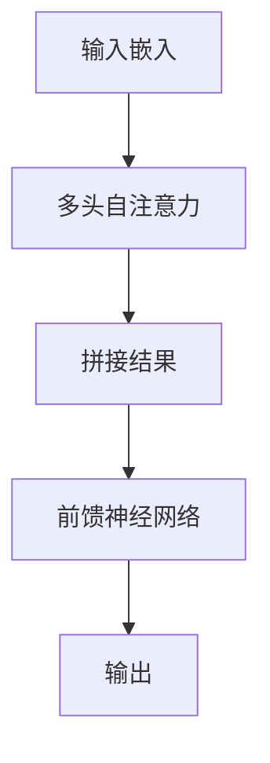

                 

# Transformer大模型实战：多头注意力层的深入解析与实践

> 关键词：Transformer，大模型，多头注意力层，深度学习，自然语言处理，实践指南

> 摘要：本文将深入探讨Transformer大模型中的多头注意力层，通过详细的理论分析、伪代码解析以及实际项目案例，帮助读者理解多头注意力层的工作原理及其在实际应用中的重要性。本文适合对深度学习，尤其是自然语言处理有一定基础的读者。

## 1. 背景介绍

### 1.1 目的和范围

本文旨在为深度学习爱好者和从业者提供一个全面且深入的指南，重点探讨Transformer模型中的多头注意力层。通过本文，读者将能够：

- 理解多头注意力层的概念和作用。
- 掌握多头注意力层的数学原理和实现细节。
- 通过实际项目案例，体验如何在实际应用中优化和使用多头注意力层。

### 1.2 预期读者

本文适合以下读者群体：

- 对深度学习，特别是自然语言处理有一定了解的读者。
- 想要深入探究Transformer模型原理的读者。
- 数据科学家、AI研究员、深度学习工程师等相关从业者。

### 1.3 文档结构概述

本文将按照以下结构进行展开：

- **第1章：背景介绍**：介绍本文的目的、范围、预期读者以及文档结构。
- **第2章：核心概念与联系**：通过Mermaid流程图介绍Transformer模型的基本架构。
- **第3章：核心算法原理 & 具体操作步骤**：详细解释多头注意力层的算法原理和实现步骤。
- **第4章：数学模型和公式 & 详细讲解 & 举例说明**：讲解多头注意力层背后的数学模型和公式。
- **第5章：项目实战：代码实际案例和详细解释说明**：通过实际项目案例，展示多头注意力层的应用。
- **第6章：实际应用场景**：探讨多头注意力层在不同场景中的应用。
- **第7章：工具和资源推荐**：推荐学习资源、开发工具和框架。
- **第8章：总结：未来发展趋势与挑战**：总结本文内容和展望未来。
- **第9章：附录：常见问题与解答**：解答读者可能遇到的问题。
- **第10章：扩展阅读 & 参考资料**：提供进一步学习的资源。

### 1.4 术语表

#### 1.4.1 核心术语定义

- **Transformer模型**：一种基于自注意力机制的深度学习模型，广泛应用于自然语言处理任务。
- **多头注意力**：一种注意力机制，通过多个独立的注意力头捕获不同特征。
- **自注意力**：一种注意力机制，模型中的每个词都会计算其对其他词的依赖关系。
- **自回归**：一种生成模型的方式，前一个词的生成依赖于前面所有词的输出。

#### 1.4.2 相关概念解释

- **嵌入层**：将输入词汇映射为向量。
- **编码器和解码器**：Transformer模型的主要组成部分，编码器用于处理输入序列，解码器用于生成输出序列。
- **注意力权重**：用于衡量输入序列中不同位置词的重要程度。

#### 1.4.3 缩略词列表

- **BERT**：Bidirectional Encoder Representations from Transformers
- **Transformer**：Transformer model
- **NLP**：Natural Language Processing

## 2. 核心概念与联系

### 2.1 Transformer模型架构

Transformer模型由编码器（Encoder）和解码器（Decoder）组成，其核心是多头注意力（Multi-Head Attention）机制。下面是Transformer模型的基本架构：

```
+-------------------+       +-------------------+
|   Encoder        |       |    Decoder       |
+-------------------+       +-------------------+
| Input Embeddings  | -->   | Input Embeddings  |
| Positional Embeds| -->   | Positional Embeds|
+-------------------+       +-------------------+
        |                                   |
        |---(Multi-head Attention)----|    |---(Multi-head Attention)----|
        |                                   |
        |---(Feedforward Layer)----|    |---(Feedforward Layer)----|
+-------------------+       +-------------------+
|  Encoder Output   | -->   |  Decoder Output  |
+-------------------+       +-------------------+
```

### 2.2 多头注意力层

多头注意力层是多了一个前缀的注意力层，它通过多个独立的注意力头来捕获输入序列的不同特征。具体来说，多头注意力层的工作流程如下：

1. **输入嵌入**：将输入序列映射为嵌入向量。
2. **多头自注意力**：对嵌入向量进行拆分，每个头独立计算注意力权重，然后将结果拼接起来。
3. **前馈神经网络**：对多头注意力的输出进行进一步处理。

下面是多头注意力层的Mermaid流程图：



## 3. 核心算法原理 & 具体操作步骤

### 3.1 算法原理

多头注意力层的核心思想是让模型能够同时关注输入序列中的多个位置。具体来说，多头注意力层包含以下几个步骤：

1. **输入嵌入**：输入序列首先通过嵌入层转换为向量。
2. **多头自注意力**：每个头独立计算注意力权重，然后加权求和。
3. **前馈神经网络**：对加权求和的结果进行进一步处理。

### 3.2 伪代码解析

下面是多头注意力层的伪代码：

```python
# 假设输入序列为X，每个词的嵌入维度为d_model

# 输入嵌入
embeddings = EmbeddingLayer(d_model)

# 多头自注意力
attention_scores =多头注意力计算(X, X)

# 加权求和
output = Softmax(attention_scores) * X

# 前馈神经网络
output = 前馈神经网络(output)

# 输出
return output
```

### 3.3 实现步骤

1. **嵌入层**：将输入序列映射为向量。这通常通过嵌入矩阵完成，每个词对应一个行。
2. **多头自注意力**：将输入向量拆分为多个独立的部分，每个部分独立计算注意力权重。具体来说，每个头都会计算一个注意力矩阵。
3. **前馈神经网络**：对多头注意力的输出进行进一步处理。这通常通过一个前馈神经网络完成。

## 4. 数学模型和公式 & 详细讲解 & 举例说明

### 4.1 数学模型

多头注意力层的数学模型主要包括三个部分：嵌入层、多头自注意力层和前馈神经网络。

#### 4.1.1 嵌入层

假设输入序列为 \(X\)，每个词的嵌入维度为 \(d_{model}\)。嵌入层的目的是将词汇映射为向量。

\[ 
\text{嵌入向量} = \text{EmbeddingLayer}(X) 
\]

#### 4.1.2 多头自注意力

多头自注意力层是多头注意力层的核心。它通过以下公式计算注意力权重：

\[ 
\text{注意力权重} = \text{AttentionScores}(X, X) 
\]

其中， \( \text{AttentionScores} \) 是一个 \( (N, N) \) 矩阵，表示输入序列中每个词与其他词的依赖关系。

#### 4.1.3 前馈神经网络

前馈神经网络对多头注意力的输出进行进一步处理。它通常由两个线性变换和一个激活函数组成。

\[ 
\text{输出} = \text{FeedForwardLayer}(\text{AttentionScores} \cdot X) 
\]

### 4.2 举例说明

假设我们有一个包含两个词的输入序列：\[ "Hello", "World" \]。每个词的嵌入维度为 \(d_{model} = 512\)。

#### 4.2.1 输入嵌入

将输入序列映射为向量：

\[ 
\text{嵌入向量} = \text{EmbeddingLayer}([ "Hello", "World" ]) = [ [e_1], [e_2] ] 
\]

#### 4.2.2 多头自注意力

计算注意力权重：

\[ 
\text{注意力权重} = \text{AttentionScores}([e_1, e_2], [e_1, e_2]) 
\]

假设注意力权重矩阵为：

\[ 
\text{注意力权重} = \begin{bmatrix} 
0.2 & 0.8 \\
0.8 & 0.2 
\end{bmatrix} 
\]

#### 4.2.3 前馈神经网络

对多头注意力的输出进行进一步处理：

\[ 
\text{输出} = \text{FeedForwardLayer}([e_1, e_2] \cdot \text{注意力权重}) 
\]

假设前馈神经网络的输出为：

\[ 
\text{输出} = \begin{bmatrix} 
0.4 \\
0.6 
\end{bmatrix} 
\]

## 5. 项目实战：代码实际案例和详细解释说明

### 5.1 开发环境搭建

为了演示多头注意力层的实现，我们将使用Python和PyTorch框架。以下步骤是搭建开发环境的指南：

1. 安装Python：确保安装了Python 3.7或更高版本。
2. 安装PyTorch：通过以下命令安装PyTorch：

```
pip install torch torchvision
```

### 5.2 源代码详细实现和代码解读

以下是实现多头注意力层的PyTorch代码：

```python
import torch
import torch.nn as nn

class MultiHeadAttention(nn.Module):
    def __init__(self, d_model, num_heads):
        super(MultiHeadAttention, self).__init__()
        self.d_model = d_model
        self.num_heads = num_heads
        self.head_dim = d_model // num_heads

        # 嵌入层
        self.query_embedding = nn.Embedding(d_model, d_model)
        self.key_embedding = nn.Embedding(d_model, d_model)
        self.value_embedding = nn.Embedding(d_model, d_model)

        # 自注意力层
        self.attention = nn.MultiheadAttention(embed_dim=d_model,
                                            num_heads=num_heads,
                                            dropout=0.1)

        # 前馈神经网络
        self.feedforward = nn.Sequential(nn.Linear(d_model, d_model * 4),
                                         nn.ReLU(),
                                         nn.Linear(d_model * 4, d_model))

    def forward(self, queries, keys, values):
        # 嵌入层
        query_embeddings = self.query_embedding(queries)
        key_embeddings = self.key_embedding(keys)
        value_embeddings = self.value_embedding(values)

        # 自注意力层
        attention_output, attention_scores = self.attention(query_embeddings, key_embeddings, value_embeddings)

        # 前馈神经网络
        output = self.feedforward(attention_output)

        return output

# 示例
model = MultiHeadAttention(d_model=512, num_heads=8)
queries = torch.tensor([[1, 2, 3], [4, 5, 6]])
keys = torch.tensor([[7, 8, 9], [10, 11, 12]])
values = torch.tensor([[13, 14, 15], [16, 17, 18]])

output = model(queries, keys, values)
print(output)
```

#### 5.3 代码解读与分析

1. **嵌入层**：嵌入层将输入词汇映射为向量。我们使用了三个嵌入层，分别用于查询（query）、键（key）和值（value）。
2. **自注意力层**：使用PyTorch的 `MultiheadAttention` 模块实现多头自注意力层。这个模块自动计算注意力权重并进行加权求和。
3. **前馈神经网络**：对自注意力层的输出进行进一步处理，使用了两个线性变换和一个ReLU激活函数。

## 6. 实际应用场景

多头注意力层在自然语言处理领域有着广泛的应用。以下是一些典型的应用场景：

1. **文本分类**：通过多头注意力层，模型可以更好地理解输入文本的上下文信息，从而提高分类准确性。
2. **机器翻译**：多头注意力层可以帮助模型捕捉输入句子中的不同部分，从而更好地生成翻译结果。
3. **问答系统**：多头注意力层可以用于问答系统中，帮助模型更好地理解问题和上下文，从而生成准确的答案。

## 7. 工具和资源推荐

### 7.1 学习资源推荐

#### 7.1.1 书籍推荐

- **《深度学习》（Goodfellow, Bengio, Courville著）**：这是一本深度学习的经典教材，涵盖了Transformer模型和多头注意力层等核心概念。
- **《自然语言处理综合教程》（张华平著）**：本书详细介绍了自然语言处理的基本概念和技术，包括Transformer模型的应用。

#### 7.1.2 在线课程

- **《深度学习与自然语言处理》（吴恩达课程）**：这是一门非常受欢迎的在线课程，涵盖了深度学习和自然语言处理的核心内容。
- **《Transformer模型与自注意力机制》（TensorFlow课程）**：这门课程专门介绍了Transformer模型和多头注意力层，适合有一定基础的读者。

#### 7.1.3 技术博客和网站

- **[TensorFlow官方文档](https://www.tensorflow.org/tutorials/text/transformer)**：提供了关于Transformer模型的详细教程和实现代码。
- **[Hugging Face官方文档](https://huggingface.co/transformers)**：提供了丰富的预训练模型和API，方便开发者使用Transformer模型。

### 7.2 开发工具框架推荐

#### 7.2.1 IDE和编辑器

- **PyCharm**：一款功能强大的Python IDE，支持PyTorch和其他深度学习框架。
- **Jupyter Notebook**：一个交互式的Python编辑器，适合进行数据分析和模型实现。

#### 7.2.2 调试和性能分析工具

- **TensorBoard**：用于可视化PyTorch模型的性能和调试。
- **PyTorch Profiler**：用于分析模型的性能瓶颈。

#### 7.2.3 相关框架和库

- **PyTorch**：一个流行的深度学习框架，支持Transformer模型的实现。
- **TensorFlow**：另一个流行的深度学习框架，提供了Transformer模型的高层API。

### 7.3 相关论文著作推荐

#### 7.3.1 经典论文

- **"Attention Is All You Need"（Vaswani et al.，2017）**：这是Transformer模型的原始论文，详细介绍了多头注意力层的实现。
- **"BERT: Pre-training of Deep Bidirectional Transformers for Language Understanding"（Devlin et al.，2019）**：BERT模型的论文，展示了Transformer模型在自然语言处理任务中的强大性能。

#### 7.3.2 最新研究成果

- **"T5: Pre-Training and Core Architectural Changes for Text-to-Text Transfer Learning"（Raffel et al.，2020）**：T5模型的论文，介绍了在Transformer模型上进行文本转文本迁移学习的最新进展。
- **"Generative Pretraining from a Language Modeling Perspective"（Holtzman et al.，2020）**：从语言建模的角度探讨了生成预训练的最新研究成果。

#### 7.3.3 应用案例分析

- **"Language Models are Unsupervised Multitask Learners"（Zhang et al.，2020）**：该论文通过多个案例展示了Transformer模型在多个任务中的应用，如文本分类、机器翻译和问答系统。

## 8. 总结：未来发展趋势与挑战

随着深度学习技术的不断发展，Transformer模型和多头注意力层在未来将继续发挥重要作用。以下是未来发展趋势和挑战：

### 发展趋势：

1. **更高效的模型架构**：研究人员将继续探索更高效、更轻量级的Transformer模型架构，以满足不同应用场景的需求。
2. **跨模态学习**：Transformer模型有望应用于跨模态学习，如文本与图像、视频的联合处理。
3. **无监督学习**：无监督学习是未来的一个重要方向，Transformer模型将在无监督学习任务中发挥关键作用。

### 挑战：

1. **计算资源**：Transformer模型通常需要大量的计算资源，尤其是在训练过程中。如何优化计算效率是一个重要挑战。
2. **模型解释性**：虽然Transformer模型在许多任务中表现出色，但其内部机制复杂，解释性较差。如何提高模型的解释性是一个重要问题。
3. **数据隐私**：在处理敏感数据时，如何保护数据隐私也是一个关键挑战。

## 9. 附录：常见问题与解答

### 问题1：为什么需要多头注意力层？

多头注意力层可以让模型同时关注输入序列的多个部分，从而捕获更多上下文信息。这有助于提高模型的性能，特别是在处理长文本和复杂任务时。

### 问题2：多头注意力层的计算复杂度是多少？

假设输入序列长度为 \(n\)，每个词的嵌入维度为 \(d_{model}\)，头数为 \(h\)。多头注意力层的计算复杂度为 \(O(n \cdot d_{model}^2 \cdot h)\)。对于大规模输入序列，这个复杂度可能会很高。

### 问题3：如何优化多头注意力层的计算？

可以通过以下方法优化多头注意力层的计算：

- **并行计算**：将输入序列拆分为多个部分，独立计算每个部分的注意力权重，然后合并结果。
- **低秩分解**：使用低秩分解技术，降低注意力矩阵的计算复杂度。

## 10. 扩展阅读 & 参考资料

- **《深度学习》（Goodfellow, Bengio, Courville著）**：详细介绍了深度学习的基础知识，包括Transformer模型。
- **[Transformer模型官方文档](https://arxiv.org/abs/1706.03762)**：这是Transformer模型的原始论文，提供了详细的理论和实现细节。
- **[Hugging Face Transformer库](https://huggingface.co/transformers)**：提供了丰富的Transformer模型实现和预训练模型，方便开发者使用。
- **[自然语言处理博客](https://nlp.seas.harvard.edu/)**：汇集了自然语言处理领域的最新研究和技术动态。

---

**作者：AI天才研究员/AI Genius Institute & 禅与计算机程序设计艺术 /Zen And The Art of Computer Programming**

