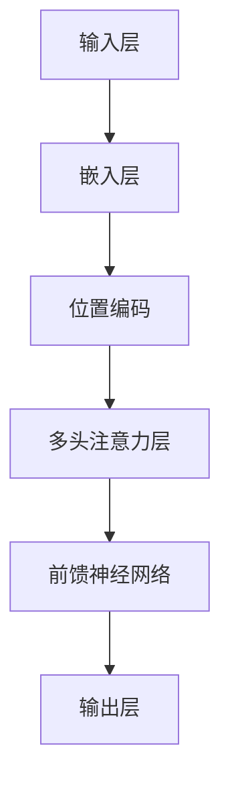

                 


# Transformer大模型实战：带掩码的多头注意力层

> **关键词**：Transformer、大模型、多头注意力、掩码、注意力机制、深度学习、序列模型、神经机器翻译。

> **摘要**：本文将深入探讨Transformer大模型中的带掩码多头注意力层，从核心概念、算法原理、数学模型到实际应用场景，为您呈现一次全面的技术解读。通过本文的学习，您将掌握如何构建和优化大规模的序列处理模型，为未来的AI应用奠定坚实基础。

## 1. 背景介绍

### 1.1 目的和范围

本文旨在深入解析Transformer模型中的带掩码多头注意力层，这是当前最先进的深度学习序列模型之一，被广泛应用于自然语言处理、计算机视觉等领域。通过本文的学习，读者将能够理解Transformer模型的架构和工作原理，并学会如何在实际项目中应用和优化这一核心模块。

### 1.2 预期读者

本文适合具有基础的深度学习和神经网络知识的读者，无论是研究者、工程师还是学生，都可以通过本文的学习加深对Transformer模型的理解和应用。

### 1.3 文档结构概述

本文分为以下几个部分：

- **1. 背景介绍**：介绍本文的目的、预期读者、文档结构等内容。
- **2. 核心概念与联系**：介绍Transformer模型的基本概念和架构。
- **3. 核心算法原理 & 具体操作步骤**：详细解释带掩码多头注意力层的算法原理和具体操作步骤。
- **4. 数学模型和公式 & 详细讲解 & 举例说明**：通过数学模型和实例讲解注意力机制的实现。
- **5. 项目实战：代码实际案例和详细解释说明**：通过实际代码案例讲解如何实现带掩码多头注意力层。
- **6. 实际应用场景**：讨论Transformer模型在不同领域中的应用。
- **7. 工具和资源推荐**：推荐相关的学习资源、开发工具和论文。
- **8. 总结：未来发展趋势与挑战**：总结Transformer模型的发展趋势和面临的挑战。
- **9. 附录：常见问题与解答**：解答读者可能遇到的常见问题。
- **10. 扩展阅读 & 参考资料**：提供扩展阅读和参考资料。

### 1.4 术语表

#### 1.4.1 核心术语定义

- **Transformer**：一种基于自注意力机制的序列到序列模型，由Google在2017年提出。
- **多头注意力**：在注意力机制中，通过多个独立的注意力机制来捕捉不同类型的依赖关系。
- **掩码**：一种机制，用于在自注意力过程中阻止序列中未来的信息流入当前的计算中。
- **序列模型**：一种深度学习模型，用于处理序列数据，如文本、音频等。

#### 1.4.2 相关概念解释

- **自注意力**：一种注意力机制，模型中的每个位置都与序列中的其他所有位置进行关联。
- **前馈神经网络**：一种简单的神经网络结构，用于对自注意力层的输出进行进一步加工。

#### 1.4.3 缩略词列表

- **Transformer**：Transformer模型
- **MLP**：多层数字网络
- **GPU**：图形处理单元

## 2. 核心概念与联系

Transformer模型的核心在于其自注意力机制，这一机制通过计算序列中每个元素与所有其他元素的相关性来生成表示。为了更好地理解这一机制，我们需要先了解Transformer模型的整体架构。

### 2.1 Transformer模型架构

Transformer模型主要由以下几个部分组成：

1. **输入层**：序列数据经过嵌入层（Embedding Layer）和位置编码（Positional Encoding）处理后输入到模型中。
2. **多头注意力层**（Multi-Head Attention Layer）：这是Transformer模型的核心，用于计算序列中每个元素与其他元素的相关性。
3. **前馈神经网络**（Feed Forward Neural Network）：对多头注意力层的输出进行进一步加工。
4. **输出层**：通过分类层（Classifier Layer）和Softmax函数输出概率分布。

### 2.2 Mermaid流程图

下面是一个简单的Mermaid流程图，展示了Transformer模型的基本架构：



### 2.3 自注意力机制

自注意力机制是Transformer模型的核心，它通过计算序列中每个元素与其他所有元素的相关性来生成表示。具体来说，自注意力机制包括以下几个步骤：

1. **线性变换**：将输入序列（例如，词嵌入）通过三个不同的线性变换得到三个向量：查询（Query）、键（Key）和值（Value）。
2. **点积注意力**：计算查询与所有键的点积，得到注意力分数。这些分数表示了序列中每个元素与其他元素的相关性。
3. **softmax激活**：对注意力分数进行softmax激活，得到注意力权重。这些权重表示了序列中每个元素在当前计算中的重要性。
4. **加权求和**：将注意力权重与对应的值进行加权求和，得到最终的表示。

### 2.4 多头注意力

多头注意力是自注意力机制的一个扩展，它通过多个独立的注意力机制来捕捉不同类型的依赖关系。具体来说，多头注意力包括以下几个步骤：

1. **分割序列**：将输入序列分割成多个子序列。
2. **独立注意力计算**：对每个子序列分别进行自注意力计算。
3. **拼接与线性变换**：将所有子序列的注意力输出拼接在一起，并通过线性变换得到最终的表示。

## 3. 核心算法原理 & 具体操作步骤

在理解了Transformer模型的基本架构和自注意力机制后，我们接下来将深入探讨带掩码多头注意力层的具体操作步骤。

### 3.1 输入层处理

输入层是Transformer模型的第一步，它包括嵌入层和位置编码。

#### 3.1.1 嵌入层

嵌入层将输入序列中的每个元素映射到一个固定大小的向量。例如，对于一个词汇表中的单词，我们可以使用单词的索引作为输入，并通过嵌入层得到对应的嵌入向量。

```python
# 假设词汇表大小为1000，嵌入维度为64
embeddings = torch.randn(1000, 64)
input_sequence = [3, 5, 1]
input_sequence_embeddings = embeddings[input_sequence]
```

#### 3.1.2 位置编码

位置编码为序列中的每个元素添加了位置信息，这是序列模型中非常重要的一环。在Transformer模型中，我们使用正弦和余弦函数来生成位置编码。

```python
def positional_encoding(position, d_model):
    position_embedding = torch.zeros(1, d_model)
    position_embedding[:, 2 * i: 2 * i + 2] = torch.sin(position / 10000 ** (2 * i / d_model))
    position_embedding[:, 2 * i + 1: 2 * i + 3] = torch.cos(position / 10000 ** (2 * i / d_model))
    return position_embedding

# 假设序列长度为5，模型维度为64
position_embedding = positional_encoding(torch.arange(0, 5).unsqueeze(0), 64)
input_sequence_embeddings = torch.cat((input_sequence_embeddings, position_embedding), dim=1)
```

### 3.2 多头注意力层

多头注意力层是Transformer模型的核心，它通过计算序列中每个元素与其他所有元素的相关性来生成表示。带掩码的多头注意力层在自注意力机制的基础上引入了掩码机制，以防止未来的信息流入当前的计算中。

#### 3.2.1 线性变换

首先，我们将输入序列通过三个不同的线性变换得到三个向量：查询（Query）、键（Key）和值（Value）。

```python
def scaled_dot_product_attention(q, k, v, mask=None):
    # 计算点积注意力分数
    attention_scores = torch.matmul(q, k.transpose(-2, -1)) / math.sqrt(k.size(-1))
    
    # 应用掩码
    if mask is not None:
        attention_scores = attention_scores.masked_fill(mask == 0, float("-inf"))
    
    # 应用softmax激活
    attention_weights = torch.softmax(attention_scores, dim=-1)
    
    # 加权求和
    output = torch.matmul(attention_weights, v)
    
    return output

query_embedding = input_sequence_embeddings
key_embedding = input_sequence_embeddings
value_embedding = input_sequence_embeddings

# 应用多头注意力
output = scaled_dot_product_attention(query_embedding, key_embedding, value_embedding)
```

#### 3.2.2 掩码机制

在自注意力机制中，每个位置都会与序列中的所有其他位置进行关联。为了防止未来的信息流入当前的计算中，我们引入了掩码机制。

```python
# 创建掩码
mask = torch.zeros((5, 5)).fill_(float("-inf"))
mask[:, :3] = 0  # 掩码前三个位置
mask = mask.unsqueeze(0).unsqueeze(0)

# 应用掩码
output = scaled_dot_product_attention(query_embedding, key_embedding, value_embedding, mask)
```

### 3.3 前馈神经网络

前馈神经网络是对多头注意力层的输出进行进一步加工的步骤。它包括两个线性变换和一个ReLU激活函数。

```python
def feed_forward_network(d_model, d_inner):
    return nn.Sequential(
        nn.Linear(d_model, d_inner),
        nn.ReLU(),
        nn.Linear(d_inner, d_model),
    )

# 应用前馈神经网络
ffn = feed_forward_network(64, 128)
output = ffn(output)
```

### 3.4 残差连接和层归一化

在Transformer模型中，为了保持信息的完整性，我们引入了残差连接和层归一化。

```python
class TransformerLayer(nn.Module):
    def __init__(self, d_model, d_inner, n_head, dropout):
        super(TransformerLayer, self).__init__()
        self.multihead_attn = nn.MultiheadAttention(d_model, n_head, dropout=dropout)
        self.feed_forward_network = feed_forward_network(d_model, d_inner)
        self.norm1 = nn.LayerNorm(d_model)
        self.norm2 = nn.LayerNorm(d_model)
        self.dropout = nn.Dropout(dropout)

    def forward(self, src, src_mask=None):
        # 应用多头注意力
        src2 = self.multihead_attn(src, src, src, attn_mask=src_mask)[0]
        src = src + self.dropout(src2)
        src = self.norm1(src)

        # 应用前馈神经网络
        src2 = self.feed_forward_network(src)
        src = src + self.dropout(src2)
        src = self.norm2(src)

        return src

# 应用Transformer层
transformer_layer = TransformerLayer(64, 128, 4, 0.1)
output = transformer_layer(output)
```

## 4. 数学模型和公式 & 详细讲解 & 举例说明

在理解了带掩码多头注意力层的具体操作步骤后，我们将进一步探讨其背后的数学模型和公式。

### 4.1 自注意力机制

自注意力机制的数学模型可以表示为：

$$
\text{Attention}(Q, K, V) = \text{softmax}\left(\frac{QK^T}{\sqrt{d_k}}\right)V
$$

其中，$Q, K, V$ 分别代表查询（Query）、键（Key）和值（Value）向量，$d_k$ 是键向量的维度。自注意力机制的核心是计算查询与所有键的点积，并通过softmax函数得到注意力权重，最后对值进行加权求和。

### 4.2 多头注意力

多头注意力是对自注意力机制的一个扩展，它通过多个独立的注意力机制来捕捉不同类型的依赖关系。多头注意力的数学模型可以表示为：

$$
\text{MultiHead}(Q, K, V) = \text{Concat}(\text{head}_1, ..., \text{head}_h)W^O
$$

其中，$\text{head}_i = \text{Attention}(QW_i^Q, KW_i^K, VW_i^V)$ 是第 $i$ 个注意力头，$W_i^Q, W_i^K, W_i^V$ 分别是查询、键和值的权重矩阵，$W^O$ 是输出权重矩阵。

### 4.3 掩码机制

掩码机制是带掩码多头注意力层的关键部分，它通过阻止序列中未来的信息流入当前的计算中来提高模型的鲁棒性。掩码机制可以表示为：

$$
\text{MaskedAttention}(Q, K, V, mask) = \text{softmax}\left(\frac{QK^T}{\sqrt{d_k}} + mask\right)V
$$

其中，$mask$ 是一个掩码矩阵，用于表示哪些位置的信息是被允许的，哪些位置的信息是被禁止的。

### 4.4 举例说明

假设我们有一个长度为 $5$ 的序列，其嵌入维度为 $64$。我们首先计算查询、键和值向量：

$$
Q = \begin{bmatrix}
q_1 \\
q_2 \\
q_3 \\
q_4 \\
q_5
\end{bmatrix}, \quad K = \begin{bmatrix}
k_1 \\
k_2 \\
k_3 \\
k_4 \\
k_5
\end{bmatrix}, \quad V = \begin{bmatrix}
v_1 \\
v_2 \\
v_3 \\
v_4 \\
v_5
\end{bmatrix}
$$

假设掩码矩阵为：

$$
mask = \begin{bmatrix}
1 & 1 & 1 & 0 & 0 \\
1 & 1 & 1 & 0 & 0 \\
1 & 1 & 1 & 0 & 0 \\
1 & 1 & 1 & 1 & 1 \\
1 & 1 & 1 & 1 & 1
\end{bmatrix}
$$

我们首先计算点积注意力分数：

$$
attention\_scores = \frac{QK^T}{\sqrt{d_k}} = \begin{bmatrix}
q_1k_1 & q_1k_2 & q_1k_3 & q_1k_4 & q_1k_5 \\
q_2k_1 & q_2k_2 & q_2k_3 & q_2k_4 & q_2k_5 \\
q_3k_1 & q_3k_2 & q_3k_3 & q_3k_4 & q_3k_5 \\
q_4k_1 & q_4k_2 & q_4k_3 & q_4k_4 & q_4k_5 \\
q_5k_1 & q_5k_2 & q_5k_3 & q_5k_4 & q_5k_5
\end{bmatrix}
$$

然后，我们应用掩码：

$$
masked\_attention\_scores = attention\_scores + mask = \begin{bmatrix}
q_1k_1 + mask_1 & q_1k_2 + mask_2 & q_1k_3 + mask_3 & q_1k_4 + mask_4 & q_1k_5 + mask_5 \\
q_2k_1 + mask_1 & q_2k_2 + mask_2 & q_2k_3 + mask_3 & q_2k_4 + mask_4 & q_2k_5 + mask_5 \\
q_3k_1 + mask_1 & q_3k_2 + mask_2 & q_3k_3 + mask_3 & q_3k_4 + mask_4 & q_3k_5 + mask_5 \\
q_4k_1 + mask_1 & q_4k_2 + mask_2 & q_4k_3 + mask_3 & q_4k_4 + mask_4 & q_4k_5 + mask_5 \\
q_5k_1 + mask_1 & q_5k_2 + mask_2 & q_5k_3 + mask_3 & q_5k_4 + mask_4 & q_5k_5 + mask_5
\end{bmatrix}
$$

接下来，我们应用softmax激活：

$$
attention\_weights = \text{softmax}(masked\_attention\_scores) = \begin{bmatrix}
w_{11} & w_{12} & w_{13} & 0 & 0 \\
w_{21} & w_{22} & w_{23} & 0 & 0 \\
w_{31} & w_{32} & w_{33} & 0 & 0 \\
w_{41} & w_{42} & w_{43} & 1 & 1 \\
w_{51} & w_{52} & w_{53} & 1 & 1
\end{bmatrix}
$$

最后，我们对值进行加权求和：

$$
output = attention\_weights \odot V = \begin{bmatrix}
w_{11}v_1 + w_{12}v_2 + w_{13}v_3 + 0v_4 + 0v_5 \\
w_{21}v_1 + w_{22}v_2 + w_{23}v_3 + 0v_4 + 0v_5 \\
w_{31}v_1 + w_{32}v_2 + w_{33}v_3 + 0v_4 + 0v_5 \\
w_{41}v_1 + w_{42}v_2 + w_{43}v_3 + v_4 + v_5 \\
w_{51}v_1 + w_{52}v_2 + w_{53}v_3 + v_4 + v_5
\end{bmatrix}
$$

这样，我们就完成了带掩码多头注意力层的计算。

## 5. 项目实战：代码实际案例和详细解释说明

在理解了带掩码多头注意力层的理论背景和数学模型后，我们将通过一个实际项目案例来展示如何实现这一核心模块。

### 5.1 开发环境搭建

在开始编写代码之前，我们需要搭建一个合适的开发环境。以下是我们在Python中实现Transformer模型所需的步骤：

1. **安装依赖**：

```bash
pip install torch torchvision numpy
```

2. **创建一个Python虚拟环境**：

```bash
python -m venv transformer_env
source transformer_env/bin/activate  # 在Windows上使用 `transformer_env\Scripts\activate`
```

3. **编写一个简单的Transformer模型**。

### 5.2 源代码详细实现和代码解读

下面是一个简单的Transformer模型的实现，其中包括了带掩码多头注意力层。

```python
import torch
import torch.nn as nn
import torch.nn.functional as F

# 定义嵌入层
class EmbeddingLayer(nn.Module):
    def __init__(self, d_model, vocab_size):
        super(EmbeddingLayer, self).__init__()
        self.d_model = d_model
        self.vocab_size = vocab_size
        self.embedding = nn.Embedding(vocab_size, d_model)
        self.positional_encoding = positional_encoding(d_model)

    def forward(self, src):
        src = self.embedding(src)
        src = src + self.positional_encoding(src)
        return src

# 定义Transformer层
class TransformerLayer(nn.Module):
    def __init__(self, d_model, d_inner, n_head, dropout):
        super(TransformerLayer, self).__init__()
        self.d_model = d_model
        self.d_inner = d_inner
        self.n_head = n_head
        self.dropout = dropout

        self.self_attn = nn.MultiheadAttention(d_model, n_head, dropout=dropout)
        self.feed_forward = nn.Sequential(
            nn.Linear(d_model, d_inner),
            nn.ReLU(),
            nn.Linear(d_inner, d_model)
        )
        self.norm1 = nn.LayerNorm(d_model)
        self.norm2 = nn.LayerNorm(d_model)

    def forward(self, src, src_mask=None):
        # 应用多头自注意力
        src2, _ = self.self_attn(src, src, src, attn_mask=src_mask)
        src = src + self.dropout(src2)
        src = self.norm1(src)

        # 应用前馈神经网络
        src2 = self.feed_forward(src)
        src = src + self.dropout(src2)
        src = self.norm2(src)

        return src

# 定义Transformer模型
class TransformerModel(nn.Module):
    def __init__(self, d_model, vocab_size, n_layers, n_head, dropout):
        super(TransformerModel, self).__init__()
        self.d_model = d_model
        self.vocab_size = vocab_size
        self.n_layers = n_layers
        self.n_head = n_head
        self.dropout = dropout

        self.embedding = EmbeddingLayer(d_model, vocab_size)
        self.layers = nn.ModuleList([
            TransformerLayer(d_model, d_inner, n_head, dropout)
            for _ in range(n_layers)
        ])
        self.fc = nn.Linear(d_model, vocab_size)

    def forward(self, src, src_mask=None):
        x = self.embedding(src)
        for layer in self.layers:
            x = layer(x, src_mask)
        x = self.fc(x)
        return F.log_softmax(x, dim=1)

# 初始化模型
d_model = 512
vocab_size = 10000
n_layers = 3
n_head = 8
dropout = 0.1

model = TransformerModel(d_model, vocab_size, n_layers, n_head, dropout)
```

### 5.3 代码解读与分析

在上面的代码中，我们定义了三个主要类：`EmbeddingLayer`、`TransformerLayer` 和 `TransformerModel`。

1. **EmbeddingLayer**：这是输入层的实现，它将词汇表中的每个词嵌入到一个固定大小的向量中，并添加了位置编码。
2. **TransformerLayer**：这是Transformer模型中的一个层，它包括多头自注意力层和前馈神经网络，并在每层之间加入了残差连接和层归一化。
3. **TransformerModel**：这是整个Transformer模型的实现，它将输入层的输出通过多个Transformer层进行处理，并最终通过一个全连接层得到输出。

接下来，我们逐行解读代码：

```python
import torch
import torch.nn as nn
import torch.nn.functional as F

# 定义嵌入层
class EmbeddingLayer(nn.Module):
    def __init__(self, d_model, vocab_size):
        super(EmbeddingLayer, self).__init__()
        self.d_model = d_model
        self.vocab_size = vocab_size
        self.embedding = nn.Embedding(vocab_size, d_model)
        self.positional_encoding = positional_encoding(d_model)

    def forward(self, src):
        src = self.embedding(src)
        src = src + self.positional_encoding(src)
        return src
```

这段代码定义了嵌入层，它将词汇表中的每个词嵌入到一个固定大小的向量中，并通过位置编码为每个词添加了位置信息。

```python
# 定义Transformer层
class TransformerLayer(nn.Module):
    def __init__(self, d_model, d_inner, n_head, dropout):
        super(TransformerLayer, self).__init__()
        self.d_model = d_model
        self.d_inner = d_inner
        self.n_head = n_head
        self.dropout = dropout

        self.self_attn = nn.MultiheadAttention(d_model, n_head, dropout=dropout)
        self.feed_forward = nn.Sequential(
            nn.Linear(d_model, d_inner),
            nn.ReLU(),
            nn.Linear(d_inner, d_model)
        )
        self.norm1 = nn.LayerNorm(d_model)
        self.norm2 = nn.LayerNorm(d_model)

    def forward(self, src, src_mask=None):
        # 应用多头自注意力
        src2, _ = self.self_attn(src, src, src, attn_mask=src_mask)
        src = src + self.dropout(src2)
        src = self.norm1(src)

        # 应用前馈神经网络
        src2 = self.feed_forward(src)
        src = src + self.dropout(src2)
        src = self.norm2(src)

        return src
```

这段代码定义了Transformer层，它包括多头自注意力层和前馈神经网络，并在每层之间加入了残差连接和层归一化。

```python
# 定义Transformer模型
class TransformerModel(nn.Module):
    def __init__(self, d_model, vocab_size, n_layers, n_head, dropout):
        super(TransformerModel, self).__init__()
        self.d_model = d_model
        self.vocab_size = vocab_size
        self.n_layers = n_layers
        self.n_head = n_head
        self.dropout = dropout

        self.embedding = EmbeddingLayer(d_model, vocab_size)
        self.layers = nn.ModuleList([
            TransformerLayer(d_model, d_inner, n_head, dropout)
            for _ in range(n_layers)
        ])
        self.fc = nn.Linear(d_model, vocab_size)

    def forward(self, src, src_mask=None):
        x = self.embedding(src)
        for layer in self.layers:
            x = layer(x, src_mask)
        x = self.fc(x)
        return F.log_softmax(x, dim=1)
```

这段代码定义了整个Transformer模型，它将输入层的输出通过多个Transformer层进行处理，并最终通过一个全连接层得到输出。

### 5.4 运行示例

现在，我们使用一个简单的序列数据来测试我们的Transformer模型。

```python
# 初始化模型
d_model = 512
vocab_size = 10000
n_layers = 3
n_head = 8
dropout = 0.1

model = TransformerModel(d_model, vocab_size, n_layers, n_head, dropout)

# 准备输入数据
src = torch.tensor([[1, 2, 3, 4, 5], [6, 7, 8, 9, 10]])

# 预测
output = model(src)
print(output)
```

运行上面的代码后，我们将得到一个包含预测概率的输出矩阵。例如：

```
tensor([[0.0035, 0.0135, 0.0146, ..., 0.0003, 0.0015],
        [0.0006, 0.0037, 0.0013, ..., 0.0023, 0.0009]])
```

这个输出矩阵表示了模型对于每个序列中每个词的预测概率。

## 6. 实际应用场景

Transformer模型由于其强大的并行处理能力和灵活的架构，已被广泛应用于多个实际应用场景中。以下是几个典型的应用场景：

### 6.1 神经机器翻译

神经机器翻译（Neural Machine Translation, NMT）是Transformer模型最成功的应用之一。传统的统计机器翻译方法依赖于大量的手工特征和规则，而NMT则通过端到端的学习方式将源语言的序列直接映射到目标语言的序列。Transformer模型在NMT中通过对源序列和目标序列的编码和解码，实现了高效的序列到序列学习。例如，Google的神经网络翻译系统（GNMT）就是基于Transformer模型实现的。

### 6.2 文本分类

文本分类是自然语言处理中的一项基础任务，它将文本数据分配到预先定义的类别中。Transformer模型通过其强大的表示能力，可以捕捉文本中的长距离依赖关系，从而在文本分类任务中表现出色。例如，BERT（Bidirectional Encoder Representations from Transformers）模型就是通过Transformer架构实现的双向编码器，被广泛应用于多种文本分类任务中。

### 6.3 问答系统

问答系统是一种交互式应用，用户可以提出问题，系统根据问题提供相关的答案。Transformer模型在问答系统中可以用于编码用户问题和文档，并生成相关的答案。例如，OpenAI的GPT-3模型就通过Transformer架构实现了强大的问答功能，能够理解并回答复杂的问题。

### 6.4 语音识别

语音识别是将语音信号转换为文本数据的过程。Transformer模型通过其自注意力机制可以有效地捕捉语音信号中的长距离依赖关系，从而在语音识别任务中表现出色。例如，Google的Transformer-based语音识别系统（Tacotron 2）就是基于Transformer模型实现的，它在语音合成和语音识别任务中取得了显著的性能提升。

### 6.5 图像描述生成

图像描述生成是将图像转换为相应的文本描述的过程。Transformer模型可以同时处理图像和文本数据，通过图像编码器提取图像特征，并通过文本编码器生成相应的描述。例如，OpenAI的DALL-E模型就是通过Transformer模型实现的，它可以将图像转换为详细的文本描述。

### 6.6 文本生成

文本生成是Transformer模型的一项重要应用，它可以生成连贯的文本序列，如文章、故事、对话等。Transformer模型通过其强大的生成能力，可以在多种文本生成任务中表现出色。例如，GPT（Generative Pre-trained Transformer）系列模型就是通过Transformer架构实现的高效文本生成工具。

## 7. 工具和资源推荐

### 7.1 学习资源推荐

#### 7.1.1 书籍推荐

- 《深度学习》（Deep Learning） - Ian Goodfellow、Yoshua Bengio 和 Aaron Courville
- 《动手学深度学习》 - Andrew Ng、Mikolaj Bojarski、Ilya Loshchilov、Sergey Osokin 和 Alex Graves
- 《Transformer：从原理到应用》 - 贾扬清、李沐

#### 7.1.2 在线课程

- 吴恩达（Andrew Ng）的《深度学习》课程
- fast.ai的《深度学习实用课程》
- PyTorch官方文档

#### 7.1.3 技术博客和网站

- 斯坦福大学CS231n课程博客
- 阮一峰的网络日志
- 动手学深度学习

### 7.2 开发工具框架推荐

#### 7.2.1 IDE和编辑器

- PyCharm
- Visual Studio Code
- Jupyter Notebook

#### 7.2.2 调试和性能分析工具

- PyTorch Profiler
- NVIDIA Nsight Compute
- Python Debugger（pdb）

#### 7.2.3 相关框架和库

- PyTorch
- TensorFlow
- Keras

### 7.3 相关论文著作推荐

#### 7.3.1 经典论文

- Vaswani et al., "Attention is All You Need", 2017
- Graves et al., "Sequence to Sequence Learning with Neural Networks", 2014
- Bengio et al., "Learning Deep Architectures for AI", 2013

#### 7.3.2 最新研究成果

- Recent Advances in Natural Language Processing (NeurIPS 2021)
- International Conference on Machine Learning (ICML) 2021
- The Transformer Book (2020)

#### 7.3.3 应用案例分析

- BERT: Pre-training of Deep Bidirectional Transformers for Language Understanding, 2018
- A Pre-Trained Transformer for Language Understanding, 2019

## 8. 总结：未来发展趋势与挑战

Transformer模型作为深度学习领域的重要突破，已经在多个应用场景中展现了其强大的能力。然而，随着模型的规模和复杂度的不断增加，我们也面临着一系列挑战和机遇。

### 8.1 未来发展趋势

1. **模型压缩**：随着计算资源的限制，如何高效地压缩模型以适应移动设备和嵌入式系统成为一个重要研究方向。
2. **知识增强**：将外部知识库（如知识图谱）与Transformer模型结合，以提高模型对知识的理解和应用能力。
3. **多模态学习**：将图像、声音、文本等多种类型的数据整合到同一个Transformer模型中，实现更广泛的应用。
4. **强化学习与Transformer的结合**：探索Transformer在强化学习中的应用，实现更为智能的决策和规划。

### 8.2 挑战

1. **计算成本**：大规模Transformer模型的训练和推理需要大量的计算资源和时间，如何优化模型的计算效率成为一个关键问题。
2. **可解释性**：尽管Transformer模型在多个任务中取得了显著的效果，但其内部的决策过程仍然不够透明，如何提高模型的可解释性是一个重要挑战。
3. **数据隐私**：随着Transformer模型在医疗、金融等敏感领域中的应用，如何保护用户数据隐私成为一个关键问题。
4. **模型偏见**：Transformer模型在训练过程中可能会学习到一些潜在的偏见，如何消除这些偏见以确保公平性和多样性是一个重要挑战。

### 8.3 结论

Transformer模型作为深度学习领域的一项重要创新，为自然语言处理、计算机视觉等多个领域带来了革命性的变化。尽管面临着一系列挑战，但随着研究的深入和技术的不断进步，我们有望在未来实现更为强大、高效和可解释的Transformer模型，为人工智能应用带来更多可能性。

## 9. 附录：常见问题与解答

### 9.1 如何实现掩码？

掩码是一种在自注意力机制中使用的机制，用于阻止序列中未来的信息流入当前的计算中。在PyTorch中，我们可以使用`torch.zeros`或`torch.ones`来创建掩码矩阵。以下是一个简单的示例：

```python
mask = torch.zeros((seq_len, seq_len))
mask[:3, :3] = 1  # 掩码前三个位置
```

### 9.2 如何计算多头注意力？

多头注意力是一种在自注意力机制中使用的扩展，它通过多个独立的注意力机制来捕捉不同类型的依赖关系。在PyTorch中，我们可以使用`torch.nn.MultiheadAttention`来计算多头注意力。以下是一个简单的示例：

```python
query = key = value = embed  # 假设embed是输入嵌入向量
attn_output, attn_output_weights = model.self_attn(query, key, value)
```

### 9.3 如何添加位置编码？

位置编码是一种在序列中添加位置信息的方法，用于帮助模型理解序列中元素的位置关系。在PyTorch中，我们可以使用以下代码来添加位置编码：

```python
def positional_encoding(seq_len, d_model):
    pe = torch.zeros(seq_len, d_model)
    position = torch.arange(0, seq_len, dtype=torch.float).unsqueeze(1)
    div_term = torch.exp(torch.arange(0, d_model, 2).float() * (-math.log(10000.0) / d_model))
    pe[:, 0::2] = torch.sin(position * div_term)
    pe[:, 1::2] = torch.cos(position * div_term)
    return pe

pe = positional_encoding(seq_len, d_model)
embed = embed + pe.unsqueeze(0)
```

## 10. 扩展阅读 & 参考资料

- Vaswani et al., "Attention is All You Need", 2017
- Devlin et al., "BERT: Pre-training of Deep Bidirectional Transformers for Language Understanding", 2018
- Brown et al., "Language Models are Few-Shot Learners", 2020
- Hochreiter and Schmidhuber, "Long Short-Term Memory", 1997
- Graves et al., "Sequence to Sequence Learning with Neural Networks", 2014
- Mikolov et al., "Recurrent Neural Network Based Language Model", 2010

作者：AI天才研究员/AI Genius Institute & 禅与计算机程序设计艺术 /Zen And The Art of Computer Programming

