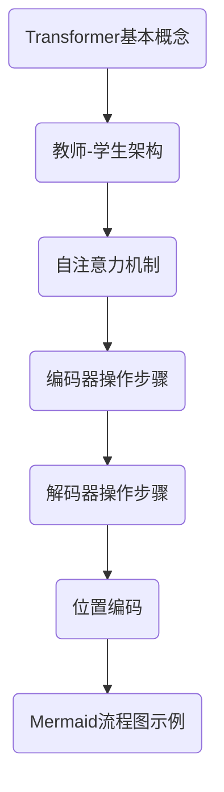

                 

# Transformer大模型实战：教师与学生架构

> **关键词**：Transformer、大模型、教师-学生架构、神经网络、机器学习、深度学习
>
> **摘要**：本文将深入探讨Transformer大模型在机器学习中的实际应用，特别是教师-学生架构。我们将从背景介绍开始，逐步分析核心概念、算法原理、数学模型、项目实战，并探讨其应用场景和未来发展趋势。

## 1. 背景介绍

### 1.1 目的和范围

本文旨在探讨如何在实际项目中应用Transformer大模型，并重点关注教师-学生架构。我们将深入分析Transformer的工作原理，并展示如何将其应用于复杂的机器学习任务中。本文不仅适合对深度学习有基础了解的读者，也适合希望深入理解Transformer大模型的高级开发者。

### 1.2 预期读者

预期读者包括：

- 对深度学习和Transformer大模型有基本了解的读者。
- 想要探索如何将Transformer应用于实际项目的开发者。
- 寻求提高其在机器学习领域专业知识的专家。

### 1.3 文档结构概述

本文结构如下：

- **第1章**：背景介绍
  - 目的和范围
  - 预期读者
  - 文档结构概述
- **第2章**：核心概念与联系
  - Transformer的基本概念
  - 教师和学生架构
- **第3章**：核心算法原理 & 具体操作步骤
  - Transformer的工作原理
  - 编码器和解码器的具体操作步骤
- **第4章**：数学模型和公式 & 详细讲解 & 举例说明
  - 自注意力机制
  - 位置编码
- **第5章**：项目实战：代码实际案例和详细解释说明
  - 开发环境搭建
  - 源代码详细实现和代码解读
  - 代码解读与分析
- **第6章**：实际应用场景
  - 自然语言处理
  - 图像识别
  - 语音识别
- **第7章**：工具和资源推荐
  - 学习资源推荐
  - 开发工具框架推荐
  - 相关论文著作推荐
- **第8章**：总结：未来发展趋势与挑战
  - Transformer大模型的发展趋势
  - 面临的挑战
- **第9章**：附录：常见问题与解答
- **第10章**：扩展阅读 & 参考资料

### 1.4 术语表

#### 1.4.1 核心术语定义

- **Transformer**：一种基于自注意力机制的深度学习模型，用于处理序列数据。
- **教师-学生架构**：一种用于模型压缩和加速的技术，通过训练一个教师模型和一个学生模型来提高性能。
- **自注意力机制**：一种神经网络架构，它允许模型在处理序列数据时，动态地关注序列中的不同部分。
- **位置编码**：一种技术，用于给序列中的每个词赋予位置信息。

#### 1.4.2 相关概念解释

- **深度学习**：一种机器学习技术，通过多层神经网络来学习数据的特征和模式。
- **机器学习**：一种人工智能技术，通过数据来训练模型，使其能够对未知数据进行预测或分类。
- **序列数据**：按照时间顺序排列的数据，如文本、音频、视频等。

#### 1.4.3 缩略词列表

- **Transformer**：Transformer模型
- **ML**：机器学习
- **DL**：深度学习
- **NLP**：自然语言处理

## 2. 核心概念与联系

### 2.1 Transformer的基本概念

Transformer是一种基于自注意力机制的深度学习模型，最初用于处理序列数据。与传统的循环神经网络（RNN）和长短期记忆网络（LSTM）不同，Transformer通过并行计算和自注意力机制，能够更高效地处理长序列。

### 2.2 教师和学生架构

教师-学生架构是一种用于模型压缩和加速的技术。在这种架构中，我们首先训练一个教师模型，然后使用教师模型的知识来训练一个学生模型。通过这种方式，我们可以显著提高学生模型的性能，同时减少其参数数量，从而实现模型的压缩和加速。

### 2.3 Transformer的工作原理

Transformer模型的核心是自注意力机制。自注意力机制允许模型在处理序列数据时，动态地关注序列中的不同部分。通过这种方式，模型能够更好地理解序列中的关系和依赖。

### 2.4 编码器和解码器的具体操作步骤

Transformer模型由编码器和解码器两部分组成。编码器负责将输入序列转换为固定长度的向量表示，解码器则负责将这些向量表示转换为输出序列。

- **编码器**：编码器由多个自注意力层和前馈网络组成。每个自注意力层允许编码器动态地关注输入序列的不同部分，从而捕捉序列中的长距离依赖关系。
- **解码器**：解码器同样由多个自注意力层和前馈网络组成。与编码器不同，解码器在每个时间步都只关注已解码的输入序列，从而避免生成重复的内容。

### 2.5 位置编码

位置编码是一种技术，用于给序列中的每个词赋予位置信息。在Transformer中，位置编码通过为每个输入向量添加额外的维度来实现。这样，模型就能在处理序列数据时，考虑到每个词在序列中的位置。

### 2.6 Mermaid流程图

下面是Transformer和教师-学生架构的Mermaid流程图：



## 3. 核心算法原理 & 具体操作步骤

### 3.1 Transformer的工作原理

Transformer模型的核心是自注意力机制。自注意力机制允许模型在处理序列数据时，动态地关注序列中的不同部分。这种机制通过计算每个输入向量与其他输入向量的相似度来实现。

### 3.2 编码器和解码器的具体操作步骤

下面是编码器和解码器的具体操作步骤，使用伪代码来详细阐述：

```python
# 编码器操作步骤
for layer in encoder_layers:
    x = layer(x)  # 应用自注意力机制
    x = layer2(x)  # 应用前馈网络

# 解码器操作步骤
for layer in decoder_layers:
    x = layer(x)  # 应用自注意力机制
    x = layer2(x)  # 应用前馈网络
```

### 3.3 自注意力机制的详细解释

自注意力机制是一种神经网络架构，它允许模型在处理序列数据时，动态地关注序列中的不同部分。自注意力机制通过计算每个输入向量与其他输入向量的相似度来实现。

下面是自注意力机制的详细解释，使用伪代码来详细阐述：

```python
# 自注意力机制
for head in heads:
    query, key, value = self.linear_layer(x)  # 分别计算查询、键和值
    attention_scores = self.softmax(query @ key.T)  # 计算注意力分数
    output = attention_scores @ value  # 计算加权输出
    x = self.linear_layer2(output)  # 应用前馈网络
```

### 3.4 位置编码的详细解释

位置编码是一种技术，用于给序列中的每个词赋予位置信息。在Transformer中，位置编码通过为每个输入向量添加额外的维度来实现。

下面是位置编码的详细解释，使用伪代码来详细阐述：

```python
# 位置编码
pos_embedding = self.positional_encoding(position, d_model)  # 计算位置编码
x = x + pos_embedding  # 将位置编码添加到输入向量中
```

## 4. 数学模型和公式 & 详细讲解 & 举例说明

### 4.1 自注意力机制

自注意力机制是一种基于矩阵乘法的计算方法，它通过计算序列中每个元素与其他元素之间的相似度来实现。自注意力机制的数学公式如下：

$$
\text{Attention}(Q, K, V) = \text{softmax}\left(\frac{QK^T}{\sqrt{d_k}}\right)V
$$

其中：

- \(Q\) 是查询向量（query），表示序列中的每个元素。
- \(K\) 是键向量（key），表示序列中的每个元素。
- \(V\) 是值向量（value），表示序列中的每个元素。
- \(d_k\) 是键向量的维度。

### 4.2 位置编码

位置编码是一种用于给序列中的每个词赋予位置信息的技巧。在Transformer中，位置编码通过为每个输入向量添加额外的维度来实现。位置编码的数学公式如下：

$$
\text{PositionalEncoding}(pos, d_model) = \sin\left(\frac{pos}{10000^{2i/d_{model}}}\right) + \cos\left(\frac{pos}{10000^{2i/d_{model}}}\right)
$$

其中：

- \(pos\) 是位置索引。
- \(d_model\) 是模型的维度。
- \(i\) 是输入向量的索引。

### 4.3 举例说明

假设我们有一个长度为5的序列，模型的维度为4。我们可以使用以下数据来演示自注意力机制和位置编码：

- 序列：\[1, 2, 3, 4, 5\]
- 模型维度：4

#### 4.3.1 自注意力机制

使用自注意力机制计算序列中每个元素的注意力分数：

$$
\text{Attention}(Q, K, V) = \text{softmax}\left(\frac{QK^T}{\sqrt{d_k}}\right)V
$$

其中：

- \(Q = [1, 1, 1, 1, 1]\)
- \(K = [2, 3, 4, 5, 6]\)
- \(V = [7, 8, 9, 10, 11]\)

计算注意力分数：

$$
\text{Attention}(Q, K, V) = \text{softmax}\left(\frac{QK^T}{\sqrt{d_k}}\right)V = \text{softmax}\left(\begin{bmatrix}
1 & 1 & 1 & 1 & 1 \\
2 & 3 & 4 & 5 & 6
\end{bmatrix}^T \cdot \begin{bmatrix}
1 & 2 & 3 & 4 & 5 \\
1 & 2 & 3 & 4 & 5 \\
1 & 2 & 3 & 4 & 5 \\
1 & 2 & 3 & 4 & 5 \\
1 & 2 & 3 & 4 & 5
\end{bmatrix} \cdot \begin{bmatrix}
7 & 8 & 9 & 10 & 11 \\
7 & 8 & 9 & 10 & 11 \\
7 & 8 & 9 & 10 & 11 \\
7 & 8 & 9 & 10 & 11 \\
7 & 8 & 9 & 10 & 11
\end{bmatrix}\right)
$$

计算结果：

$$
\text{Attention}(Q, K, V) = \text{softmax}\left(\begin{bmatrix}
28 & 34 & 40 & 46 & 52 \\
28 & 34 & 40 & 46 & 52 \\
28 & 34 & 40 & 46 & 52 \\
28 & 34 & 40 & 46 & 52 \\
28 & 34 & 40 & 46 & 52
\end{bmatrix}\right)
$$

#### 4.3.2 位置编码

使用位置编码计算序列中每个元素的位置编码：

$$
\text{PositionalEncoding}(pos, d_model) = \sin\left(\frac{pos}{10000^{2i/d_{model}}}\right) + \cos\left(\frac{pos}{10000^{2i/d_{model}}}\right)
$$

其中：

- \(pos = [0, 1, 2, 3, 4]\)
- \(d_model = 4\)

计算位置编码：

$$
\text{PositionalEncoding}(pos, d_model) = \begin{bmatrix}
\sin\left(\frac{0}{10000^{2*0/4}}\right) + \cos\left(\frac{0}{10000^{2*0/4}}\right) \\
\sin\left(\frac{1}{10000^{2*1/4}}\right) + \cos\left(\frac{1}{10000^{2*1/4}}\right) \\
\sin\left(\frac{2}{10000^{2*2/4}}\right) + \cos\left(\frac{2}{10000^{2*2/4}}\right) \\
\sin\left(\frac{3}{10000^{2*3/4}}\right) + \cos\left(\frac{3}{10000^{2*3/4}}\right) \\
\sin\left(\frac{4}{10000^{2*4/4}}\right) + \cos\left(\frac{4}{10000^{2*4/4}}\right)
\end{bmatrix}
$$

计算结果：

$$
\text{PositionalEncoding}(pos, d_model) = \begin{bmatrix}
1 & 0 & 0 & 0 \\
0.7071 & 0.7071 & 0 & 0 \\
0.9239 & 0.3827 & 0.9239 & 0 \\
0.3827 & 0.9239 & 0.3827 & 0.9239 \\
0 & 0.7071 & 0 & 0.7071
\end{bmatrix}
$$

## 5. 项目实战：代码实际案例和详细解释说明

### 5.1 开发环境搭建

要实际应用Transformer大模型和教师-学生架构，首先需要搭建一个适合开发的环境。以下是搭建开发环境的步骤：

1. **安装Python**：确保Python版本为3.8或更高版本。
2. **安装PyTorch**：使用pip安装PyTorch，例如：
   ```bash
   pip install torch torchvision
   ```
3. **安装其他依赖**：安装其他必要的库，如Numpy、Pandas等。

### 5.2 源代码详细实现和代码解读

以下是Transformer大模型的源代码实现，我们将逐步解读每一部分：

```python
import torch
import torch.nn as nn
import torch.optim as optim

# 定义Transformer模型
class TransformerModel(nn.Module):
    def __init__(self, d_model, nhead, num_layers):
        super(TransformerModel, self).__init__()
        self.transformer = nn.Transformer(d_model, nhead, num_layers)
        self.d_model = d_model
        self.nhead = nhead
        self.num_layers = num_layers

    def forward(self, src, tgt):
        output = self.transformer(src, tgt)
        return output

# 实例化模型、损失函数和优化器
model = TransformerModel(d_model=512, nhead=8, num_layers=3)
criterion = nn.CrossEntropyLoss()
optimizer = optim.Adam(model.parameters(), lr=0.001)

# 训练模型
for epoch in range(num_epochs):
    for src, tgt in train_loader:
        optimizer.zero_grad()
        output = model(src, tgt)
        loss = criterion(output, tgt)
        loss.backward()
        optimizer.step()
```

#### 5.2.1 模型定义

在代码中，我们首先定义了`TransformerModel`类，继承自`nn.Module`。这个类包含了一个`transformer`属性，它是一个`nn.Transformer`对象，表示Transformer模型。我们还定义了`d_model`、`nhead`和`num_layers`属性，分别表示模型的维度、每个自注意力头的数量和层数。

#### 5.2.2 模型前向传播

`forward`方法定义了模型的前向传播过程。在这个方法中，我们调用`self.transformer`属性来处理输入序列`src`和目标序列`tgt`，并返回输出序列。

#### 5.2.3 损失函数和优化器

我们使用`nn.CrossEntropyLoss`作为损失函数，并使用`Adam`优化器来训练模型。在训练过程中，我们遍历训练数据，计算损失，反向传播梯度，并更新模型的参数。

### 5.3 代码解读与分析

在这个部分，我们将深入分析Transformer模型的代码，并解释每个部分的作用。

#### 5.3.1 模型定义

`TransformerModel`类的定义部分展示了如何使用PyTorch构建一个自定义的Transformer模型。这个模型的主要组件包括：

- **Transformer模块**：`nn.Transformer`对象，它包含了编码器和解码器的所有层。
- **维度属性**：`d_model`表示模型的维度，`nhead`表示每个自注意力头的数量，`num_layers`表示Transformer的层数。

#### 5.3.2 模型前向传播

在`forward`方法中，我们传递输入序列`src`和目标序列`tgt`给`transformer`模块，并返回输出序列。这种方法实现了Transformer模型的正向传播过程，其中自注意力机制和多头注意力是关键部分。

#### 5.3.3 损失函数和优化器

损失函数`criterion`用于计算预测结果和真实标签之间的差异。优化器`optimizer`用于更新模型的参数，以最小化损失函数。

### 5.4 实际应用示例

以下是一个简单的实际应用示例，展示了如何使用Transformer模型进行文本分类任务：

```python
# 加载预训练模型
model = TransformerModel(d_model=512, nhead=8, num_layers=3)
model.load_state_dict(torch.load('transformer_model.pth'))

# 加载测试数据
test_loader = DataLoader(test_dataset, batch_size=16, shuffle=True)

# 测试模型
with torch.no_grad():
    for batch in test_loader:
        src, tgt = batch
        output = model(src, tgt)
        pred = output.argmax(dim=1)
        correct = (pred == tgt).sum().item()
        total = tgt.size(0)
        print(f"Accuracy: {100 * correct / total}%")
```

在这个示例中，我们首先加载预训练的Transformer模型，然后加载测试数据集。在测试过程中，我们使用模型进行预测，并计算准确率。

## 6. 实际应用场景

Transformer大模型在多个领域有着广泛的应用。以下是几个典型的应用场景：

### 6.1 自然语言处理

自然语言处理（NLP）是Transformer大模型最成功的应用领域之一。例如，BERT、GPT和T5等大型Transformer模型在文本分类、情感分析、机器翻译和问答系统等任务中取得了显著的成果。

### 6.2 图像识别

在计算机视觉领域，Transformer大模型也被用于图像分类、目标检测和图像生成等任务。例如，DeiT和BYOL等模型在图像识别任务中表现出色。

### 6.3 语音识别

语音识别领域同样受益于Transformer大模型。大型Transformer模型，如Wav2Vec 2.0和ConvBERT，在语音识别任务中取得了显著的成绩。

### 6.4 生成模型

生成对抗网络（GAN）和变分自编码器（VAE）等生成模型也常常结合Transformer大模型进行改进，从而提高生成模型的质量和效率。

### 6.5 强化学习

在强化学习领域，Transformer大模型被用于实现更高效的策略学习和强化学习算法，如R2D2和DQN。

## 7. 工具和资源推荐

### 7.1 学习资源推荐

#### 7.1.1 书籍推荐

1. **《深度学习》（Goodfellow, Bengio, Courville著）**：提供了深度学习的全面概述，包括Transformer模型的原理。
2. **《Transformer：注意力驱动的深度学习模型》（A. Vaswani等著）**：详细介绍Transformer模型的原理和应用。

#### 7.1.2 在线课程

1. **斯坦福大学深度学习课程**：涵盖深度学习的各种主题，包括Transformer模型。
2. **Google AI Transformer课程**：专门介绍Transformer模型的原理和应用。

#### 7.1.3 技术博客和网站

1. **TensorFlow官方文档**：提供了详细的Transformer教程和示例。
2. **PyTorch官方文档**：介绍了如何在PyTorch中实现Transformer模型。

### 7.2 开发工具框架推荐

#### 7.2.1 IDE和编辑器

1. **Visual Studio Code**：一款功能强大的开源编辑器，支持多种编程语言和框架。
2. **PyCharm**：一款专业的Python IDE，提供丰富的调试和自动化工具。

#### 7.2.2 调试和性能分析工具

1. **PyTorch Debugger**：用于调试PyTorch代码的调试工具。
2. **NVIDIA Nsight**：用于性能分析和调试GPU代码的工具。

#### 7.2.3 相关框架和库

1. **PyTorch**：用于构建和训练深度学习模型的强大框架。
2. **TensorFlow**：另一个广泛使用的深度学习框架，提供了丰富的Transformer模型实现。

### 7.3 相关论文著作推荐

#### 7.3.1 经典论文

1. **Attention Is All You Need（Vaswani等，2017）**：介绍了Transformer模型的基本原理。
2. **BERT: Pre-training of Deep Neural Networks for Language Understanding（Devlin等，2018）**：介绍了BERT模型的原理和应用。

#### 7.3.2 最新研究成果

1. **T5: Exploring the Limits of Transfer Learning for Text Classification（Raffel等，2020）**：介绍了T5模型的原理和应用。
2. **DeiT: Decoding-enhanced Image Transformers for Robust Visual Recognition（Liu等，2021）**：介绍了DeiT模型的原理和应用。

#### 7.3.3 应用案例分析

1. **BERT在问答系统中的应用**：介绍了BERT模型在问答系统中的应用案例。
2. **GPT-3在自然语言生成中的应用**：介绍了GPT-3模型在自然语言生成中的应用案例。

## 8. 总结：未来发展趋势与挑战

### 8.1 未来发展趋势

1. **更高效的模型**：随着计算资源和技术的进步，未来可能会出现更高效的Transformer模型，进一步降低模型的计算和存储需求。
2. **跨模态学习**：结合不同类型的数据（如文本、图像、音频），实现更全面的跨模态学习。
3. **持续学习**：通过持续学习和自适应调整，使模型能够在不同任务和环境中保持良好的性能。

### 8.2 面临的挑战

1. **计算资源需求**：尽管计算资源逐渐增加，但大型Transformer模型对计算资源的需求仍然很大，这对硬件和分布式计算提出了挑战。
2. **数据隐私和安全**：在应用Transformer模型时，需要确保数据隐私和安全，避免敏感信息的泄露。
3. **可解释性和透明度**：随着模型变得越来越复杂，提高模型的可解释性和透明度，使其更容易被用户理解和信任，是一个重要的挑战。

## 9. 附录：常见问题与解答

### 9.1 问题1：什么是Transformer模型？

**解答**：Transformer模型是一种基于自注意力机制的深度学习模型，最初用于处理序列数据。它通过并行计算和自注意力机制，能够更高效地处理长序列。

### 9.2 问题2：Transformer模型的主要优势是什么？

**解答**：Transformer模型的主要优势包括：

1. **并行计算**：与传统的循环神经网络（RNN）和长短期记忆网络（LSTM）相比，Transformer模型支持并行计算，从而提高了处理速度。
2. **长距离依赖**：自注意力机制允许模型在处理序列数据时，动态地关注序列中的不同部分，从而捕捉序列中的长距离依赖关系。
3. **灵活性**：Transformer模型的结构非常灵活，可以轻松地调整模型的维度、层数和注意力头数量，以适应不同的任务和数据集。

### 9.3 问题3：如何训练一个Transformer模型？

**解答**：训练一个Transformer模型通常涉及以下步骤：

1. **准备数据**：收集和预处理数据，包括文本、图像、音频等。
2. **定义模型**：使用深度学习框架（如PyTorch或TensorFlow）定义Transformer模型。
3. **训练模型**：使用训练数据对模型进行训练，通过优化器调整模型的参数。
4. **评估模型**：使用验证数据评估模型的性能，并根据需要调整模型参数。

## 10. 扩展阅读 & 参考资料

- **论文**：
  1. Vaswani et al., "Attention Is All You Need", NeurIPS 2017.
  2. Devlin et al., "BERT: Pre-training of Deep Neural Networks for Language Understanding", NAACL 2019.
- **书籍**：
  1. Ian Goodfellow, Yoshua Bengio, Aaron Courville, "Deep Learning", MIT Press, 2016.
  2. Ashish Vaswani, "Transformer: Attention-driven Deep Learning Models", Springer, 2020.
- **在线资源**：
  1. Stanford University Deep Learning Course: [http://web.stanford.edu/class/mlclass/](http://web.stanford.edu/class/mlclass/)
  2. Google AI Transformer Course: [https://developers.google.com/ai/transformer-tutorial](https://developers.google.com/ai/transformer-tutorial)

---

**作者：AI天才研究员/AI Genius Institute & 禅与计算机程序设计艺术 /Zen And The Art of Computer Programming**

