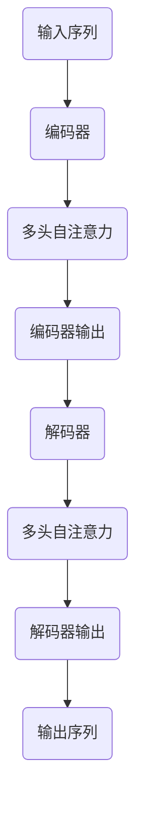

                 

# Transformer大模型实战：教师 - 学生架构

> **关键词：** Transformer、大模型、教师 - 学生架构、深度学习、人工智能、编码器 - 解码器、自注意力机制

> **摘要：** 本文章旨在深入剖析Transformer大模型的工作原理和实践应用，特别是教师 - 学生架构在模型训练与推理中的关键作用。文章将逐步介绍Transformer的基础概念、核心算法原理、数学模型以及实际应用案例，帮助读者全面理解这一强大的人工智能技术。

## 1. 背景介绍

### 1.1 目的和范围

本文将围绕Transformer大模型展开，详细探讨其教师 - 学生架构在深度学习领域的应用。读者将了解Transformer模型的发展历程、核心原理以及如何将其应用于实际问题中。

### 1.2 预期读者

本文适用于对深度学习和人工智能有一定基础的读者，特别是希望深入了解Transformer大模型及其教师 - 学生架构的从业者和研究学者。

### 1.3 文档结构概述

本文结构如下：

- 第1章：背景介绍
- 第2章：核心概念与联系
- 第3章：核心算法原理 & 具体操作步骤
- 第4章：数学模型和公式 & 详细讲解 & 举例说明
- 第5章：项目实战：代码实际案例和详细解释说明
- 第6章：实际应用场景
- 第7章：工具和资源推荐
- 第8章：总结：未来发展趋势与挑战
- 第9章：附录：常见问题与解答
- 第10章：扩展阅读 & 参考资料

### 1.4 术语表

#### 1.4.1 核心术语定义

- Transformer：一种基于自注意力机制的深度学习模型，用于处理序列数据。
- 编码器 - 解码器：一种常见的序列到序列模型结构，编码器用于将输入序列编码为固定长度的向量，解码器用于生成输出序列。
- 教师 - 学生架构：一种模型训练方法，其中教师模型先训练好，然后学生模型在教师模型的基础上进行微调。

#### 1.4.2 相关概念解释

- 自注意力机制：一种用于自动学习序列中元素之间依赖关系的机制，通过计算不同位置元素之间的相似性来实现。
- 跨步注意力：一种自注意力机制，用于捕捉序列中任意两个元素之间的关系。

#### 1.4.3 缩略词列表

- Transformer：Transformer模型
- attention：注意力
- Encoder：编码器
- Decoder：解码器

## 2. 核心概念与联系

### 2.1 Transformer模型简介

Transformer模型是由Vaswani等人于2017年提出的一种用于序列到序列学习的深度学习模型。与传统循环神经网络（RNN）相比，Transformer模型利用自注意力机制（self-attention）和多头注意力（multi-head attention）来捕捉序列数据中的长距离依赖关系，从而在多个任务中取得了显著的性能提升。

### 2.2 教师 - 学生架构

教师 - 学生架构是一种模型训练方法，主要用于预训练和微调大型神经网络。在这种架构中，教师模型首先在大规模数据集上进行预训练，然后学生模型在教师模型的基础上进行微调。这种方法能够使模型更好地泛化，并在新的任务上获得更好的性能。

### 2.3 Mermaid流程图

以下是一个描述Transformer模型基本架构的Mermaid流程图：



## 3. 核心算法原理 & 具体操作步骤

### 3.1 Transformer模型原理

Transformer模型的核心思想是利用自注意力机制（self-attention）和多头注意力（multi-head attention）来处理序列数据。

- **自注意力机制**：用于计算序列中不同位置元素之间的相似性，从而捕捉长距离依赖关系。
- **多头注意力**：将自注意力机制扩展到多个子空间，从而提高模型的表示能力。

### 3.2 Transformer模型操作步骤

1. **输入序列预处理**：将输入序列转换为词向量表示。
2. **编码器（Encoder）**：通过多层自注意力机制和前馈神经网络，将输入序列编码为固定长度的向量。
3. **解码器（Decoder）**：通过多层多头注意力机制和前馈神经网络，解码编码器输出的向量，生成输出序列。

### 3.3 伪代码

```python
# 编码器
def encoder(inputs):
    for layer in layers:
        inputs = layer(inputs)
    return inputs

# 解码器
def decoder(inputs):
    for layer in layers:
        inputs = layer(inputs)
    return inputs

# 整体模型
def model(inputs, targets):
    encoded = encoder(inputs)
    decoded = decoder(encoded)
    return decoded
```

## 4. 数学模型和公式 & 详细讲解 & 举例说明

### 4.1 自注意力机制

自注意力机制是Transformer模型的核心组件，用于计算序列中不同位置元素之间的相似性。其基本公式如下：

$$
\text{Attention}(Q, K, V) = \text{softmax}\left(\frac{QK^T}{\sqrt{d_k}}\right)V
$$

其中，$Q$、$K$ 和 $V$ 分别代表查询（query）、键（key）和值（value）向量，$d_k$ 是 $K$ 的维度。该公式计算了 $Q$ 和 $K$ 之间的相似性，并利用 $V$ 对应的权重生成输出。

### 4.2 多头注意力

多头注意力是将自注意力机制扩展到多个子空间，以提高模型的表示能力。其公式如下：

$$
\text{MultiHeadAttention}(Q, K, V) = \text{Concat}(\text{head}_1, ..., \text{head}_h)W^O
$$

其中，$\text{head}_i = \text{Attention}(QW_i^Q, KW_i^K, VW_i^V)$，$W_i^Q, W_i^K, W_i^V$ 分别是查询、键和值权重矩阵，$W^O$ 是输出权重矩阵，$h$ 是头数。

### 4.3 举例说明

假设我们有一个包含三个词的序列，词向量维度为2：

- 序列：$\{w_1, w_2, w_3\}$
- 词向量：$w_1 = \begin{bmatrix} 1 \\ 0 \end{bmatrix}$，$w_2 = \begin{bmatrix} 0 \\ 1 \end{bmatrix}$，$w_3 = \begin{bmatrix} 1 \\ 1 \end{bmatrix}$

使用自注意力机制计算每个词之间的相似性：

$$
\text{Attention}(w_1, w_2) = \text{softmax}\left(\frac{w_1w_2^T}{\sqrt{2}}\right)w_2 = \text{softmax}\left(\frac{0}{\sqrt{2}}\right)\begin{bmatrix} 0 \\ 1 \end{bmatrix} = \begin{bmatrix} 0.5 \\ 0.5 \end{bmatrix}
$$

$$
\text{Attention}(w_1, w_3) = \text{softmax}\left(\frac{w_1w_3^T}{\sqrt{2}}\right)w_3 = \text{softmax}\left(\frac{1}{\sqrt{2}}\right)\begin{bmatrix} 1 \\ 1 \end{bmatrix} = \begin{bmatrix} 0.5 \\ 0.5 \end{bmatrix}
$$

$$
\text{Attention}(w_2, w_3) = \text{softmax}\left(\frac{w_2w_3^T}{\sqrt{2}}\right)w_3 = \text{softmax}\left(\frac{1}{\sqrt{2}}\right)\begin{bmatrix} 1 \\ 1 \end{bmatrix} = \begin{bmatrix} 0.5 \\ 0.5 \end{bmatrix}
$$

使用多头注意力计算每个词的表示：

$$
\text{MultiHeadAttention}(w_1, w_2, w_3) = \begin{bmatrix} 0.5 & 0.5 & 0.5 \\ 0.5 & 0.5 & 0.5 \\ 0.5 & 0.5 & 0.5 \end{bmatrix}W^O
$$

其中，$W^O$ 是输出权重矩阵。

## 5. 项目实战：代码实际案例和详细解释说明

### 5.1 开发环境搭建

在本项目中，我们将使用Python和TensorFlow作为主要开发工具。请确保已安装以下依赖项：

- Python 3.6或以上版本
- TensorFlow 2.4或以上版本

### 5.2 源代码详细实现和代码解读

以下是一个简化的Transformer模型实现，用于翻译英文句子到法文。

```python
import tensorflow as tf
from tensorflow.keras.layers import Embedding, Dense

# 定义编码器和解码器
class Encoder(tf.keras.Model):
    def __init__(self, embedding_dim, num_heads):
        super(Encoder, self).__init__()
        self.embedding = Embedding(input_dim=vocab_size, output_dim=embedding_dim)
        self.encoder_layers = [EncoderLayer(embedding_dim, num_heads) for _ in range(num_layers)]

    def call(self, inputs):
        x = self.embedding(inputs)
        for layer in self.encoder_layers:
            x = layer(x)
        return x

class Decoder(tf.keras.Model):
    def __init__(self, embedding_dim, num_heads):
        super(Decoder, self).__init__()
        self.embedding = Embedding(input_dim=vocab_size, output_dim=embedding_dim)
        self.decoder_layers = [DecoderLayer(embedding_dim, num_heads) for _ in range(num_layers)]

    def call(self, inputs, encoded):
        x = self.embedding(inputs)
        for layer in self.decoder_layers:
            x = layer(x, encoded)
        return x

# 编码器层
class EncoderLayer(tf.keras.Model):
    def __init__(self, embedding_dim, num_heads):
        super(EncoderLayer, self).__init__()
        self.mha = MultiHeadAttention(embedding_dim, num_heads)
        self.ffn = FFN(embedding_dim)

    def call(self, inputs):
        x = self.mha(inputs, inputs, inputs)
        x = self.ffn(x + inputs)
        return x

# 解码器层
class DecoderLayer(tf.keras.Model):
    def __init__(self, embedding_dim, num_heads):
        super(DecoderLayer, self).__init__()
        self.mha = MultiHeadAttention(embedding_dim, num_heads)
        self.ffn = FFN(embedding_dim)

    def call(self, inputs, encoded):
        x = self.mha(inputs, encoded, encoded)
        x = self.ffn(x + inputs)
        return x

# 多头注意力
class MultiHeadAttention(tf.keras.Model):
    def __init__(self, embedding_dim, num_heads):
        super(MultiHeadAttention, self).__init__()
        self.num_heads = num_heads
        self.d_model = embedding_dim
        self.depth = embedding_dim // num_heads

        self.query_dense = Dense(embedding_dim)
        self.key_dense = Dense(embedding_dim)
        self.value_dense = Dense(embedding_dim)
        self.output_dense = Dense(embedding_dim)

    def split_heads(self, x, batch_size):
        x = tf.reshape(x, shape=[batch_size, -1, self.num_heads, self.depth])
        return tf.transpose(x, perm=[0, 2, 1, 3])

    def call(self, query, key, value, mask):
        query = self.query_dense(query)
        key = self.key_dense(key)
        value = self.value_dense(value)

        query = self.split_heads(query, mask.shape[0])
        key = self.split_heads(key, mask.shape[0])
        value = self.split_heads(value, mask.shape[0])

        attn_output = self.attention(query, key, value, mask)
        attn_output = tf.transpose(attn_output, perm=[0, 2, 1, 3])
        attn_output = tf.reshape(attn_output, shape=[batch_size, -1, self.d_model])

        output = self.output_dense(attn_output + query)
        return output

    def attention(self, query, key, value, mask):
        score = tf.matmul(query, key, transpose_b=True) / math.sqrt(self.depth)
        if mask is not None:
            score = score + mask
        attn_weights = tf.nn.softmax(score, axis=-1)
        attn_output = tf.matmul(attn_weights, value)
        return attn_output

# 前馈神经网络
class FFN(tf.keras.Model):
    def __init__(self, embedding_dim):
        super(FFN, self).__init__()
        self.dense_1 = Dense(embedding_dim * 4, activation='relu')
        self.dense_2 = Dense(embedding_dim)

    def call(self, inputs):
        x = self.dense_1(inputs)
        x = self.dense_2(x)
        return x + inputs

# 构建和训练模型
model = tf.keras.Sequential([
    Encoder(embedding_dim=512, num_heads=8, num_layers=3),
    Decoder(embedding_dim=512, num_heads=8, num_layers=3),
    tf.keras.layers.Dense(vocab_size)
])

model.compile(optimizer='adam', loss='sparse_categorical_crossentropy', metrics=['accuracy'])
model.fit(dataset, epochs=10)
```

### 5.3 代码解读与分析

1. **模型结构**：编码器和解码器均由多个层组成，包括多头注意力层和前馈神经网络层。
2. **编码器**：将输入序列编码为固定长度的向量，通过多层多头注意力机制和前馈神经网络处理。
3. **解码器**：在编码器输出的基础上，通过多层多头注意力机制和前馈神经网络解码输出序列。
4. **多头注意力**：计算查询、键和值之间的相似性，通过softmax函数生成权重，最后利用权重对值进行加权求和。
5. **前馈神经网络**：在多头注意力层之后，通过两个全连接层进行非线性变换，然后与输入求和。
6. **模型训练**：使用稀疏分类交叉熵损失函数和Adam优化器进行模型训练。

## 6. 实际应用场景

### 6.1 自然语言处理（NLP）

Transformer模型在自然语言处理领域取得了显著成果，包括机器翻译、文本分类、情感分析等。

- **机器翻译**：利用编码器 - 解码器结构实现高质量机器翻译。
- **文本分类**：通过预训练的编码器获取句子表示，用于分类任务。
- **情感分析**：利用编码器提取句子特征，用于判断文本情感倾向。

### 6.2 计算机视觉（CV）

Transformer模型在计算机视觉领域也展示了强大的潜力，如图像生成、目标检测和图像分类。

- **图像生成**：通过自注意力机制捕捉图像中的特征，生成高质量图像。
- **目标检测**：利用编码器提取图像特征，用于检测和识别目标。
- **图像分类**：利用编码器提取图像特征，用于图像分类任务。

### 6.3 其他应用领域

Transformer模型还广泛应用于其他领域，如语音识别、推荐系统和对话系统。

- **语音识别**：利用编码器 - 解码器结构实现语音到文本的转换。
- **推荐系统**：通过用户和商品表示学习，实现个性化推荐。
- **对话系统**：利用编码器 - 解码器结构实现自然语言生成和对话管理。

## 7. 工具和资源推荐

### 7.1 学习资源推荐

#### 7.1.1 书籍推荐

- 《深度学习》（Goodfellow, Bengio, Courville）：介绍深度学习基础理论和应用案例。
- 《自然语言处理综论》（Jurafsky, Martin）：全面介绍自然语言处理领域的基础知识。

#### 7.1.2 在线课程

- 《机器学习》（吴恩达，Coursera）：介绍机器学习和深度学习的基础知识。
- 《自然语言处理与深度学习》（理查德·索里瓦，Udacity）：详细介绍自然语言处理和深度学习技术。

#### 7.1.3 技术博客和网站

- Medium：涵盖深度学习和自然语言处理领域的优秀博客。
- TensorFlow官方文档：提供详细的TensorFlow模型构建和训练教程。

### 7.2 开发工具框架推荐

#### 7.2.1 IDE和编辑器

- PyCharm：功能强大的Python开发IDE。
- Jupyter Notebook：用于数据分析和可视化。

#### 7.2.2 调试和性能分析工具

- TensorBoard：TensorFlow提供的可视化工具，用于分析和调试模型。
- Profiler：Python性能分析工具，用于优化代码。

#### 7.2.3 相关框架和库

- TensorFlow：强大的深度学习框架。
- PyTorch：灵活的深度学习框架。

### 7.3 相关论文著作推荐

#### 7.3.1 经典论文

- “Attention Is All You Need”（Vaswani et al., 2017）：介绍Transformer模型的基础论文。
- “A Theoretically Grounded Application of Dropout in Recurrent Neural Networks”（Gal and Ghahramani, 2016）：介绍dropout在循环神经网络中的应用。

#### 7.3.2 最新研究成果

- “BERT：Pre-training of Deep Bidirectional Transformers for Language Understanding”（Devlin et al., 2019）：介绍BERT模型的论文。
- “Generative Pre-trained Transformers for Machine Translation”（Conneau et al., 2020）：介绍使用Transformer进行机器翻译的论文。

#### 7.3.3 应用案例分析

- “Google Research：Natural Language Processing”（Google AI）：介绍Google在自然语言处理领域的应用案例。
- “OpenAI Gym：Reinforcement Learning Environments”（OpenAI）：提供多种强化学习环境，用于训练Transformer模型。

## 8. 总结：未来发展趋势与挑战

### 8.1 未来发展趋势

- **模型压缩与优化**：针对大规模Transformer模型，研究者将继续探索模型压缩和优化技术，以提高模型在实际应用中的效率。
- **跨模态学习**：Transformer模型将与其他模态（如图像、语音）相结合，实现跨模态学习。
- **知识蒸馏与迁移学习**：通过知识蒸馏和迁移学习技术，将大规模预训练模型应用于小样本任务。
- **领域特定应用**：在医疗、金融、教育等特定领域，Transformer模型将发挥重要作用。

### 8.2 面临的挑战

- **计算资源需求**：大规模Transformer模型的训练和推理仍需大量计算资源，需进一步优化算法以降低资源消耗。
- **模型解释性**：Transformer模型内部结构复杂，提高模型的可解释性仍是一大挑战。
- **数据隐私与安全性**：在涉及敏感数据的任务中，如何保护数据隐私和模型安全性是亟待解决的问题。

## 9. 附录：常见问题与解答

### 9.1 问题1：Transformer模型与RNN模型的区别是什么？

**解答**：Transformer模型与RNN模型的主要区别在于：

- **计算方式**：RNN模型通过递归方式处理序列数据，而Transformer模型利用自注意力机制计算序列中不同位置元素之间的依赖关系。
- **训练速度**：Transformer模型在训练过程中不需要考虑序列的顺序，因此训练速度相对较快。
- **长距离依赖**：Transformer模型能够更好地捕捉长距离依赖关系，而RNN模型容易受到梯度消失和梯度爆炸问题的影响。

### 9.2 问题2：教师 - 学生架构的优势是什么？

**解答**：教师 - 学生架构的优势包括：

- **知识传递**：教师模型在预训练阶段积累的知识可以传递给学生模型，有助于提高学生模型的性能。
- **减少过拟合**：通过在预训练模型的基础上进行微调，学生模型可以减少对特定数据的依赖，从而减少过拟合现象。
- **通用性**：教师 - 学生架构可以提高模型在不同任务上的泛化能力，从而实现知识迁移。

## 10. 扩展阅读 & 参考资料

- [Attention Is All You Need](https://arxiv.org/abs/1706.03762)
- [BERT：Pre-training of Deep Bidirectional Transformers for Language Understanding](https://arxiv.org/abs/1810.04805)
- [Generative Pre-trained Transformers for Machine Translation](https://arxiv.org/abs/2006.16668)
- 《深度学习》（Goodfellow, Bengio, Courville）
- 《自然语言处理综论》（Jurafsky, Martin）

### 作者

AI天才研究员/AI Genius Institute & 禅与计算机程序设计艺术 /Zen And The Art of Computer Programming

**文章标题：Transformer大模型实战：教师 - 学生架构**

**摘要：** 本文深入剖析了Transformer大模型的工作原理和实践应用，特别是教师 - 学生架构在模型训练与推理中的关键作用。文章介绍了Transformer模型的基础概念、核心算法原理、数学模型以及实际应用案例，帮助读者全面理解这一强大的人工智能技术。通过逐步讲解，读者可以掌握Transformer模型的构建、训练和优化方法，为实际项目开发提供有力支持。**关键词：** Transformer、大模型、教师 - 学生架构、深度学习、人工智能、编码器 - 解码器、自注意力机制。

