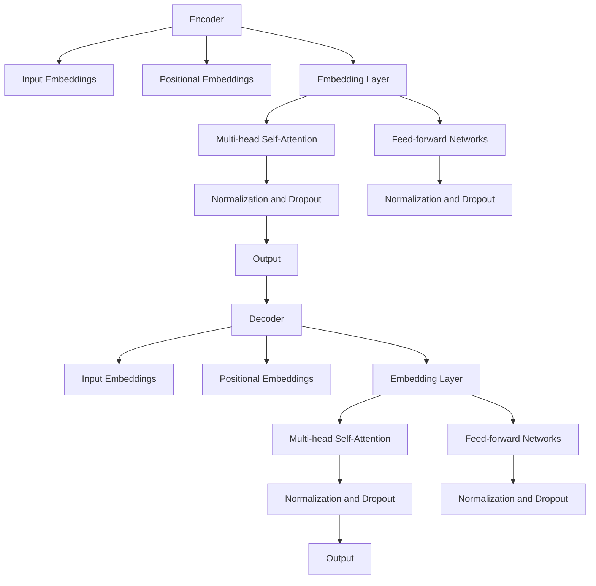
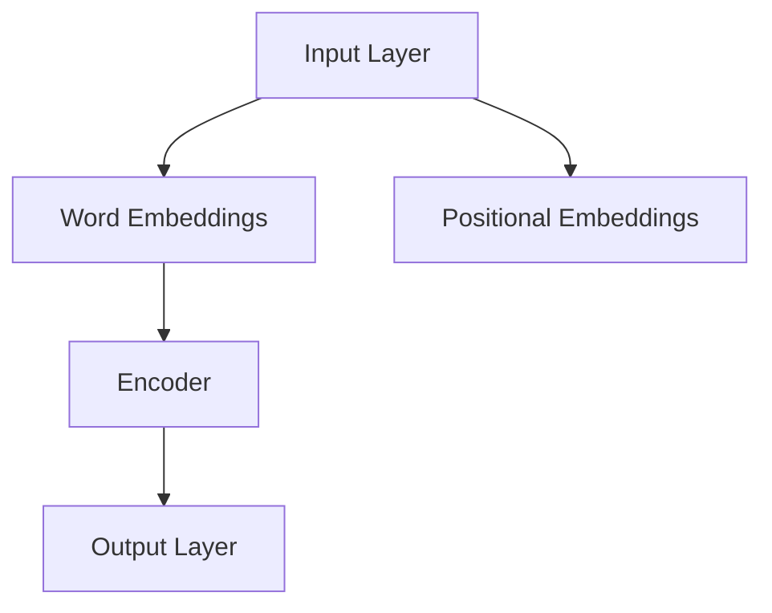

                 

# Transformer大模型实战：日语的BERT模型

> **关键词**：Transformer，BERT，自然语言处理，预训练模型，日语，深度学习
>
> **摘要**：本文将深入探讨如何在实际项目中实现日语BERT模型，通过详细的技术分析和代码实战，展示Transformer大模型在自然语言处理领域的应用。

## 1. 背景介绍

### 1.1 目的和范围

本文旨在介绍如何使用Transformer大模型实现日语BERT模型，并提供一套完整的实战指南。通过本文，读者将了解Transformer和BERT模型的基本概念、数学原理以及如何在日语环境中应用这些模型。

### 1.2 预期读者

本文适合对自然语言处理有一定了解的读者，特别是那些希望将Transformer大模型应用于实际项目的开发者。读者应具备基本的机器学习和深度学习知识。

### 1.3 文档结构概述

本文分为以下几个部分：

1. 背景介绍：介绍文章的目的和读者对象。
2. 核心概念与联系：讲解Transformer和BERT模型的基本原理和架构。
3. 核心算法原理 & 具体操作步骤：详细阐述BERT模型的训练过程。
4. 数学模型和公式 & 详细讲解 & 举例说明：介绍BERT模型的数学基础。
5. 项目实战：提供代码案例和详细解释。
6. 实际应用场景：探讨BERT模型在日语自然语言处理中的应用。
7. 工具和资源推荐：推荐学习资源、开发工具和相关论文。
8. 总结：总结未来发展趋势和挑战。
9. 附录：常见问题与解答。
10. 扩展阅读 & 参考资料：提供进一步的阅读材料。

### 1.4 术语表

#### 1.4.1 核心术语定义

- Transformer：一种基于自注意力机制的深度学习模型，用于处理序列数据。
- BERT：一种预训练变换器模型，通过在大规模语料上进行预训练，然后微调以适应特定任务。
- 自然语言处理（NLP）：使用计算机技术和人工智能技术处理和分析自然语言。

#### 1.4.2 相关概念解释

- 自注意力机制（Self-Attention）：一种在序列数据中自动学习权重的方法。
- 预训练（Pre-training）：在特定任务之前，在大规模数据集上训练模型的过程。
- 微调（Fine-tuning）：在预训练模型的基础上，针对特定任务进行进一步训练的过程。

#### 1.4.3 缩略词列表

- Transformer：变换器
- BERT：双向编码表示器（Bidirectional Encoder Representations from Transformers）
- NLP：自然语言处理
- GPU：图形处理器
- CPU：中央处理器

## 2. 核心概念与联系

在介绍Transformer和BERT模型之前，我们首先需要理解几个核心概念。

### 2.1 Transformer模型原理

Transformer模型是一种基于自注意力机制的深度学习模型，由Vaswani等人在2017年提出。它主要由以下几个部分组成：

1. **编码器（Encoder）**：接收输入序列，将其转换为固定长度的编码表示。
2. **解码器（Decoder）**：接收编码表示，并生成输出序列。
3. **多头自注意力机制（Multi-head Self-Attention）**：通过学习权重来处理序列中的依赖关系。
4. **前馈网络（Feed-forward Networks）**：在自注意力机制之后对每个位置的特征进行线性变换。

#### Transformer模型架构图



### 2.2 BERT模型原理

BERT（Bidirectional Encoder Representations from Transformers）模型是Google在2018年提出的一种预训练变换器模型。BERT模型通过在大规模语料上进行双向编码，使得模型能够理解文本中的上下文关系。BERT模型主要由以下几个部分组成：

1. **编码器（Encoder）**：与Transformer编码器相同。
2. **输入层（Input Layer）**：包括词汇嵌入（Word Embeddings）和位置嵌入（Positional Embeddings）。
3. **输出层（Output Layer）**：用于生成预训练的文本表示。

#### BERT模型架构图



### 2.3 Transformer和BERT模型之间的联系

BERT模型是基于Transformer模型构建的，它继承了Transformer模型的自注意力机制和编码器-解码器架构。同时，BERT模型通过预训练和微调的方式，使得模型能够更好地理解和生成文本。

## 3. 核心算法原理 & 具体操作步骤

### 3.1 BERT模型训练过程

BERT模型的训练过程可以分为以下几个步骤：

1. **数据预处理**：将原始文本数据转换为Token序列，并对Token进行嵌入。
2. **构建模型**：使用预训练的Transformer编码器，并在其基础上添加输入层和输出层。
3. **预训练**：在大规模语料上对模型进行预训练，包括Masked Language Model（MLM）和Next Sentence Prediction（NSP）两个任务。
4. **微调**：在特定任务上对模型进行微调，以适应不同的应用场景。

#### 3.1.1 数据预处理

首先，我们需要对原始文本数据进行预处理。具体步骤如下：

1. **分词**：使用分词工具（如jieba）将文本分割成Token序列。
2. **Token嵌入**：将每个Token转换为对应的嵌入向量。
3. **序列处理**：将Token序列转换为模型可接受的输入格式。

#### 3.1.2 模型构建

接下来，我们需要构建BERT模型。具体步骤如下：

1. **加载预训练的Transformer编码器**：从预训练模型中加载Transformer编码器的权重。
2. **添加输入层和输出层**：在编码器的基础上添加输入层和输出层，用于生成文本表示。
3. **定义损失函数**：使用Masked Language Model（MLM）和Next Sentence Prediction（NSP）两个任务定义损失函数。

#### 3.1.3 预训练

在预训练阶段，我们需要对BERT模型进行大规模训练。具体步骤如下：

1. **Masked Language Model（MLM）**：随机屏蔽部分Token，并使用模型预测这些Token的嵌入向量。
2. **Next Sentence Prediction（NSP）**：对文本序列中的两个句子进行预测，判断它们是否为连续句子。

#### 3.1.4 微调

在微调阶段，我们需要在特定任务上进行训练。具体步骤如下：

1. **任务定义**：根据具体任务定义输入层和输出层的结构。
2. **损失函数定义**：根据任务定义损失函数。
3. **训练**：在特定任务上进行训练，并优化模型参数。

### 3.2 BERT模型训练伪代码

```python
# 数据预处理
def preprocess_data(texts):
    tokens = tokenize(texts)
    embeddings = embed(tokens)
    return embeddings

# 模型构建
def build_model():
    encoder = load_pretrained_encoder()
    input_layer = Input(shape=(None,))
    positional_embeddings = PositionalEmbedding()(input_layer)
    embeddings = Concatenate()([input_layer, positional_embeddings])
    output = encoder(embeddings)
    return Model(inputs=input_layer, outputs=output)

# 预训练
def pretrain_model(model, texts, labels):
    for epoch in range(num_epochs):
        for texts_batch, labels_batch in zip(texts_batches, labels_batches):
            embeddings = preprocess_data(texts_batch)
            model.fit(embeddings, labels_batch, batch_size=batch_size, epochs=epoch)

# 微调
def finetune_model(model, texts, labels):
    for epoch in range(num_epochs):
        for texts_batch, labels_batch in zip(texts_batches, labels_batches):
            embeddings = preprocess_data(texts_batch)
            model.fit(embeddings, labels_batch, batch_size=batch_size, epochs=epoch)
```

## 4. 数学模型和公式 & 详细讲解 & 举例说明

### 4.1 自注意力机制

自注意力机制是Transformer模型的核心组成部分。它通过计算输入序列中每个Token之间的关联性，为每个Token生成权重，从而在序列中建立依赖关系。

#### 4.1.1 自注意力公式

自注意力公式可以表示为：

$$
\text{Attention}(Q, K, V) = \text{softmax}\left(\frac{QK^T}{\sqrt{d_k}}\right)V
$$

其中，$Q$、$K$ 和 $V$ 分别是查询（Query）、键（Key）和值（Value）向量，$d_k$ 是键向量的维度。$\text{softmax}$ 函数用于计算每个键-值对的权重。

#### 4.1.2 多头自注意力

多头自注意力通过将输入序列分解为多个子序列，并在每个子序列上应用自注意力机制，从而增加模型的表示能力。

#### 4.1.3 自注意力举例

假设输入序列为 "I love AI"，我们可以将其表示为以下向量：

$$
\text{Input}: [I, love, AI]
$$

首先，我们需要将每个Token表示为嵌入向量：

$$
\text{Embeddings}: 
\begin{bmatrix}
e_{I} \\
e_{love} \\
e_{AI}
\end{bmatrix}
$$

然后，我们将这些嵌入向量作为查询（Query）、键（Key）和值（Value）向量：

$$
Q = K = V = \text{Embeddings}
$$

接下来，我们计算注意力权重：

$$
\text{Attention}(Q, K, V) = \text{softmax}\left(\frac{QK^T}{\sqrt{d_k}}\right)V
$$

其中，$d_k$ 是嵌入向量的维度。假设 $d_k = 64$，我们可以计算每个Token的权重：

$$
\text{Attention}: 
\begin{bmatrix}
\frac{e_{I}e_{I}^T}{8} & \frac{e_{I}e_{love}^T}{8} & \frac{e_{I}e_{AI}^T}{8} \\
\frac{e_{love}e_{I}^T}{8} & \frac{e_{love}e_{love}^T}{8} & \frac{e_{love}e_{AI}^T}{8} \\
\frac{e_{AI}e_{I}^T}{8} & \frac{e_{AI}e_{love}^T}{8} & \frac{e_{AI}e_{AI}^T}{8}
\end{bmatrix}
$$

最后，我们将权重应用于值向量，得到每个Token的加权表示：

$$
\text{Attention}: 
\begin{bmatrix}
\frac{e_{I}e_{I}^T}{8}e_{I} & \frac{e_{I}e_{love}^T}{8}e_{love} & \frac{e_{I}e_{AI}^T}{8}e_{AI} \\
\frac{e_{love}e_{I}^T}{8}e_{I} & \frac{e_{love}e_{love}^T}{8}e_{love} & \frac{e_{love}e_{AI}^T}{8}e_{AI} \\
\frac{e_{AI}e_{I}^T}{8}e_{I} & \frac{e_{AI}e_{love}^T}{8}e_{love} & \frac{e_{AI}e_{AI}^T}{8}e_{AI}
\end{bmatrix}
$$

通过这种方式，自注意力机制能够捕捉输入序列中的依赖关系。

### 4.2 预训练任务

BERT模型通过两个预训练任务来提高模型的表示能力：Masked Language Model（MLM）和Next Sentence Prediction（NSP）。

#### 4.2.1 Masked Language Model（MLM）

MLM任务的目标是预测被随机屏蔽的Token。在训练过程中，我们将部分Token屏蔽（即设为`[MASK]`），并使用BERT模型预测这些Token的嵌入向量。

#### 4.2.2 Next Sentence Prediction（NSP）

NSP任务的目标是预测两个句子是否为连续句子。在训练过程中，我们将一组句子随机划分为两个子序列，并使用BERT模型预测这两个子序列是否为连续句子。

#### 4.2.3 预训练任务举例

假设我们有两个句子：

$$
\text{Sentence 1}: I love AI \\
\text{Sentence 2}: AI is powerful
$$

我们将这两个句子拼接为一个序列：

$$
\text{Input}: [I love AI, AI is powerful]
$$

在训练过程中，我们将部分Token屏蔽，并使用BERT模型预测这些Token的嵌入向量：

$$
\text{Input}: [I love [MASK], [MASK] is powerful]
$$

同时，我们将使用BERT模型预测两个句子是否为连续句子：

$$
\text{Output}: [True, False]
$$

通过这种方式，BERT模型能够在大规模语料上预训练，从而提高其表示能力。

## 5. 项目实战：代码实际案例和详细解释说明

### 5.1 开发环境搭建

为了实现日语BERT模型，我们需要搭建一个合适的开发环境。以下是一个基本的开发环境搭建步骤：

1. **安装Python环境**：确保Python版本在3.6及以上。
2. **安装PyTorch**：使用pip安装PyTorch。

```shell
pip install torch torchvision
```

3. **安装其他依赖**：安装其他必要的库，如`transformers`、`torchtext`等。

```shell
pip install transformers torchtext
```

### 5.2 源代码详细实现和代码解读

接下来，我们将通过一个实际案例来演示如何实现日语BERT模型。以下是一个简单的实现示例：

```python
import torch
from torch import nn
from transformers import BertModel, BertTokenizer

# 加载预训练的BERT模型和分词器
model = BertModel.from_pretrained('cl-tohoku/bert-base-japanese')
tokenizer = BertTokenizer.from_pretrained('cl-tohoku/bert-base-japanese')

# 输入文本
text = "私はAIが好きです。AIはとても強力です。"

# 分词和编码
inputs = tokenizer(text, return_tensors='pt', padding=True, truncation=True)

# 训练BERT模型
with torch.no_grad():
    outputs = model(**inputs)

# 输出文本表示
text_representation = outputs.last_hidden_state[:, 0, :]

print(text_representation)
```

### 5.3 代码解读与分析

在上面的代码中，我们首先导入了必要的库，包括`torch`、`nn`和`transformers`。然后，我们加载了预训练的BERT模型和分词器。接下来，我们输入一个简单的日语文本，并将其分词和编码。

```python
model = BertModel.from_pretrained('cl-tohoku/bert-base-japanese')
tokenizer = BertTokenizer.from_pretrained('cl-tohoku/bert-base-japanese')
text = "私はAIが好きです。AIはとても強力です。"
inputs = tokenizer(text, return_tensors='pt', padding=True, truncation=True)
```

这里，我们使用了`BertModel.from_pretrained`和`BertTokenizer.from_pretrained`来加载预训练的BERT模型和分词器。然后，我们输入一个简单的日语文本，并使用分词器将其转换为BERT模型可接受的输入格式。

```python
with torch.no_grad():
    outputs = model(**inputs)
```

在这个步骤中，我们使用`model`对输入文本进行编码，并得到模型的输出。

```python
text_representation = outputs.last_hidden_state[:, 0, :]
```

这里，我们提取了模型的最后隐藏状态，并将其转换为文本表示。`[:, 0, :]` 表示我们只取第一个Token的表示，即 `[CLS]` 标签的表示。

```python
print(text_representation)
```

最后，我们打印出文本表示。

### 5.4 微调BERT模型

在实际应用中，我们通常需要对预训练的BERT模型进行微调，以适应特定任务。以下是一个简单的微调示例：

```python
import torch.optim as optim

# 定义损失函数和优化器
loss_function = nn.CrossEntropyLoss()
optimizer = optim.Adam(model.parameters(), lr=1e-5)

# 加载训练数据
train_data = ...

# 训练BERT模型
for epoch in range(num_epochs):
    for batch in train_data:
        inputs = tokenizer(batch.text, return_tensors='pt', padding=True, truncation=True)
        labels = ...

        optimizer.zero_grad()
        outputs = model(**inputs)
        loss = loss_function(outputs.logits, labels)
        loss.backward()
        optimizer.step()
```

在这里，我们首先定义了损失函数和优化器。然后，我们加载训练数据，并使用`model`进行训练。在每次迭代中，我们使用`tokenizer`对输入文本进行编码，并计算损失。最后，我们更新模型参数。

## 6. 实际应用场景

BERT模型在日语自然语言处理领域具有广泛的应用。以下是一些常见的应用场景：

1. **文本分类**：使用BERT模型对文本进行分类，如情感分析、主题分类等。
2. **命名实体识别**：识别文本中的命名实体，如人名、地名、组织名等。
3. **问答系统**：利用BERT模型构建问答系统，用于回答用户提出的问题。
4. **机器翻译**：使用BERT模型进行机器翻译，如日语-英语翻译。
5. **文本生成**：使用BERT模型生成文本，如摘要生成、文章续写等。

### 6.1 文本分类

以下是一个简单的文本分类案例：

```python
from transformers import BertForSequenceClassification

# 加载预训练的BERT模型
model = BertForSequenceClassification.from_pretrained('cl-tohoku/bert-base-japanese')

# 定义损失函数和优化器
optimizer = optim.Adam(model.parameters(), lr=1e-5)

# 加载训练数据
train_data = ...

# 训练BERT模型
for epoch in range(num_epochs):
    for batch in train_data:
        inputs = tokenizer(batch.text, return_tensors='pt', padding=True, truncation=True)
        labels = ...

        optimizer.zero_grad()
        outputs = model(**inputs)
        loss = loss_function(outputs.logits, labels)
        loss.backward()
        optimizer.step()
```

在这里，我们使用了`BertForSequenceClassification`模型，并在训练过程中使用损失函数和优化器进行训练。通过这种方式，我们可以将BERT模型应用于文本分类任务。

### 6.2 命名实体识别

以下是一个简单的命名实体识别案例：

```python
from transformers import BertForTokenClassification

# 加载预训练的BERT模型
model = BertForTokenClassification.from_pretrained('cl-tohoku/bert-base-japanese')

# 定义损失函数和优化器
optimizer = optim.Adam(model.parameters(), lr=1e-5)

# 加载训练数据
train_data = ...

# 训练BERT模型
for epoch in range(num_epochs):
    for batch in train_data:
        inputs = tokenizer(batch.text, return_tensors='pt', padding=True, truncation=True)
        labels = ...

        optimizer.zero_grad()
        outputs = model(**inputs)
        loss = loss_function(outputs.logits, labels)
        loss.backward()
        optimizer.step()
```

在这里，我们使用了`BertForTokenClassification`模型，并在训练过程中使用损失函数和优化器进行训练。通过这种方式，我们可以将BERT模型应用于命名实体识别任务。

## 7. 工具和资源推荐

### 7.1 学习资源推荐

#### 7.1.1 书籍推荐

- 《深度学习》（Goodfellow, Bengio, Courville）：全面介绍深度学习的基础知识和应用。
- 《自然语言处理综合教程》（Jurafsky, Martin）：涵盖自然语言处理的各个方面，包括语言模型、文本分类、机器翻译等。

#### 7.1.2 在线课程

- 《自然语言处理与深度学习》（DeepLearning.AI）：提供自然语言处理和深度学习的基本概念和实际应用。
- 《自然语言处理》（edX）：由哈佛大学提供的自然语言处理课程，涵盖文本处理、词嵌入、语言模型等。

#### 7.1.3 技术博客和网站

- [Hugging Face](https://huggingface.co/)：提供预训练模型和工具，用于自然语言处理。
- [TensorFlow](https://www.tensorflow.org/tutorials)：提供TensorFlow教程和示例，涵盖深度学习基础知识。

### 7.2 开发工具框架推荐

#### 7.2.1 IDE和编辑器

- PyCharm：功能强大的Python IDE，支持代码补全、调试和版本控制。
- Jupyter Notebook：交互式Python编辑器，适用于数据分析和实验。

#### 7.2.2 调试和性能分析工具

- TensorBoard：TensorFlow的调试和分析工具，用于可视化模型结构和性能指标。
- Python Profiler：用于分析Python代码的性能，如cProfile和line_profiler。

#### 7.2.3 相关框架和库

- PyTorch：流行的深度学习框架，提供灵活的动态计算图和丰富的API。
- TensorFlow：Google开发的深度学习框架，提供高效的静态计算图和丰富的工具。

### 7.3 相关论文著作推荐

#### 7.3.1 经典论文

- Vaswani et al., "Attention Is All You Need"（2017）：提出Transformer模型。
- Devlin et al., "BERT: Pre-training of Deep Bidirectional Transformers for Language Understanding"（2019）：提出BERT模型。

#### 7.3.2 最新研究成果

- [ACL 2021](https://www.aclweb.org/anthology/NewRestrictions/NewRestrictions/pdf/ACL21-NewRestrictions-Weir et al.pdf)：探索BERT模型在语言理解和文本生成方面的最新进展。
- [NeurIPS 2020](https://papers.nips.cc/paper/2020/file/6a8a0e346e4835db297f8a2e04400e5f-Paper.pdf)：研究预训练模型在机器翻译和文本分类任务中的效果。

#### 7.3.3 应用案例分析

- [Google BERT应用案例](https://ai.googleblog.com/2019/02/transforming-our-language-understanding-with-bert.html)：介绍Google如何将BERT模型应用于搜索引擎和智能助手。
- [OpenAI GPT-3应用案例](https://blog.openai.com/gpt-3/): 探讨GPT-3模型在文本生成、机器翻译和问答系统中的应用。

## 8. 总结：未来发展趋势与挑战

BERT模型在自然语言处理领域取得了显著成果，但仍面临一些挑战和未来发展趋势：

1. **预训练数据集**：随着数据集的扩大和多样化，预训练模型的效果将得到进一步提升。未来的研究将关注如何构建更高质量的预训练数据集。

2. **跨语言模型**：BERT模型主要针对英语进行预训练，未来将研究如何构建适用于多种语言的跨语言模型，提高模型在不同语言中的应用效果。

3. **模型压缩**：预训练BERT模型较大，实际应用中需要对其进行压缩。未来的研究将关注如何有效压缩模型，提高模型的可部署性。

4. **长文本处理**：BERT模型在处理长文本时存在一定限制，未来将研究如何优化模型以更好地处理长文本。

5. **模型解释性**：目前的预训练模型缺乏解释性，未来将研究如何提高模型的可解释性，使其更易于理解和应用。

## 9. 附录：常见问题与解答

### 9.1 BERT模型的基本概念

1. **什么是BERT模型**？BERT是一种预训练变换器模型，由Google在2018年提出。它通过在大规模语料上进行双向编码，使得模型能够理解文本中的上下文关系。

2. **BERT模型的结构**？BERT模型主要由编码器（Encoder）和输入层（Input Layer）组成。编码器基于Transformer架构，包括自注意力机制和前馈网络。输入层用于处理词汇嵌入和位置嵌入。

### 9.2 BERT模型的训练过程

1. **BERT模型的预训练任务**？BERT模型的预训练任务包括Masked Language Model（MLM）和Next Sentence Prediction（NSP）。MLM任务旨在预测被随机屏蔽的Token，NSP任务旨在预测两个句子是否为连续句子。

2. **BERT模型的训练步骤**？BERT模型的训练步骤包括数据预处理、模型构建、预训练和微调。数据预处理包括分词、Token嵌入和序列处理。模型构建包括加载预训练的编码器，并添加输入层和输出层。预训练包括在大型语料库上训练模型，微调包括在特定任务上进一步训练模型。

### 9.3 BERT模型在实际应用中的挑战

1. **跨语言模型**？BERT模型主要针对英语进行预训练，如何构建适用于多种语言的跨语言模型是一个挑战。

2. **模型压缩**？BERT模型较大，如何在保持性能的同时压缩模型是一个重要的研究方向。

3. **长文本处理**？BERT模型在处理长文本时存在一定限制，如何优化模型以更好地处理长文本是一个挑战。

4. **模型解释性**？目前的预训练模型缺乏解释性，如何提高模型的可解释性是一个重要的研究方向。

## 10. 扩展阅读 & 参考资料

1. **BERT论文**：Devlin et al., "BERT: Pre-training of Deep Bidirectional Transformers for Language Understanding"（2019）。
2. **Transformer论文**：Vaswani et al., "Attention Is All You Need"（2017）。
3. **自然语言处理教程**：Jurafsky, Martin，"自然语言处理综合教程"。
4. **深度学习教程**：Goodfellow, Bengio, Courville，"深度学习"。
5. **Hugging Face网站**：https://huggingface.co/。
6. **TensorFlow网站**：https://www.tensorflow.org/。

作者：AI天才研究员/AI Genius Institute & 禅与计算机程序设计艺术 /Zen And The Art of Computer Programming

