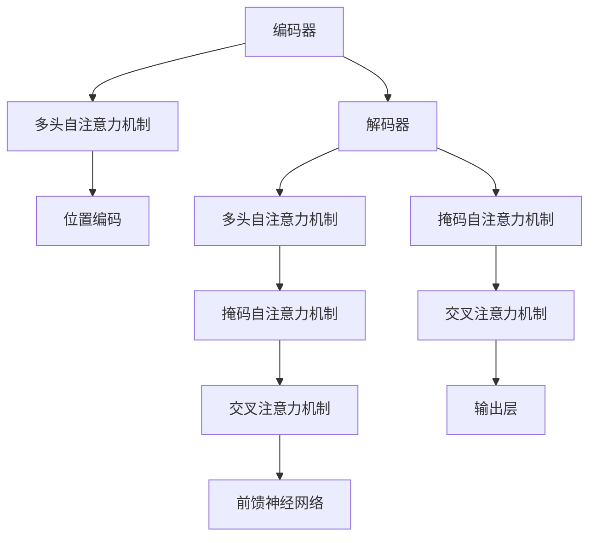
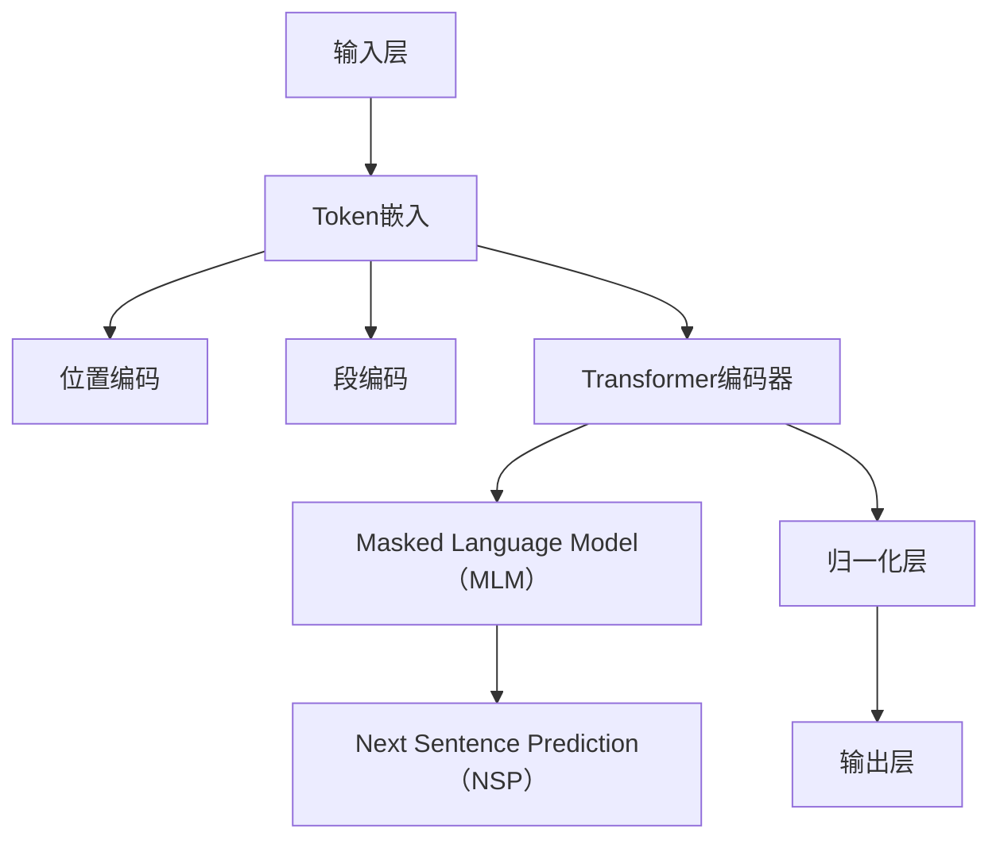

                 

# Transformer大模型实战：理解多语言BERT模型

> **关键词：** Transformer，BERT模型，多语言处理，深度学习，NLP，编程实战。

> **摘要：** 本文将深入探讨Transformer架构和BERT模型的工作原理，以及如何利用这些技术实现多语言处理任务。通过逐步分析和实际代码案例，本文将帮助读者全面理解Transformer和BERT模型，并学会如何在实际项目中应用这些先进的深度学习技术。

## 1. 背景介绍

### 1.1 目的和范围

本文的主要目的是介绍Transformer架构和BERT模型，并展示如何将它们应用于多语言处理任务。我们将通过逐步分析和实际代码案例，帮助读者深入理解这两个核心概念，并学会如何在实际项目中应用它们。

本文涵盖以下内容：

1. Transformer架构的基本原理和操作步骤。
2. BERT模型的设计、数学模型和公式。
3. 实际应用场景，包括代码实现和解读。
4. 工具和资源推荐，包括学习资源、开发工具和框架。
5. 未来发展趋势与挑战。

### 1.2 预期读者

本文适合以下读者群体：

- 对深度学习和自然语言处理有初步了解的开发者。
- 希望掌握Transformer和BERT模型原理的高级程序员。
- 希望将Transformer和BERT模型应用于实际项目的CTO和架构师。

### 1.3 文档结构概述

本文分为以下几个部分：

- 1. 背景介绍：介绍文章的目的、预期读者和文档结构。
- 2. 核心概念与联系：介绍Transformer和BERT模型的核心概念和架构。
- 3. 核心算法原理 & 具体操作步骤：详细解释Transformer和BERT模型的工作原理。
- 4. 数学模型和公式 & 详细讲解 & 举例说明：讲解BERT模型的数学模型和公式，并给出实际案例。
- 5. 项目实战：代码实际案例和详细解释说明。
- 6. 实际应用场景：讨论Transformer和BERT模型在不同领域的应用。
- 7. 工具和资源推荐：推荐学习资源、开发工具和框架。
- 8. 总结：未来发展趋势与挑战。
- 9. 附录：常见问题与解答。
- 10. 扩展阅读 & 参考资料：提供更多深入阅读的资料。

### 1.4 术语表

#### 1.4.1 核心术语定义

- **Transformer架构**：一种基于自注意力机制的序列到序列模型，广泛应用于自然语言处理任务。
- **BERT模型**：一种基于Transformer架构的预训练语言表示模型，特别适用于多语言处理任务。
- **自注意力机制**：一种计算输入序列中各个元素之间关联度的方法，使模型能够捕捉长距离依赖关系。
- **预训练语言表示模型**：通过在大规模语料库上进行预训练，生成具有通用语言表示能力的模型。

#### 1.4.2 相关概念解释

- **序列到序列模型**：一种模型架构，用于将一个序列映射到另一个序列，例如机器翻译模型。
- **自然语言处理（NLP）**：研究如何让计算机理解和处理人类自然语言的学科。
- **深度学习**：一种机器学习方法，通过多层神经网络模型对数据进行特征提取和分类。

#### 1.4.3 缩略词列表

- **BERT**：Bidirectional Encoder Representations from Transformers
- **Transformer**：Transformer Architecture
- **NLP**：Natural Language Processing
- **DL**：Deep Learning
- **SOTA**：State-of-the-Art

## 2. 核心概念与联系

在本节中，我们将介绍Transformer架构和BERT模型的基本原理和架构，并通过Mermaid流程图展示它们的核心概念和联系。

### 2.1 Transformer架构

Transformer架构是一种基于自注意力机制的序列到序列模型，特别适用于自然语言处理任务。它的核心思想是通过计算输入序列中各个元素之间的关联度，捕捉长距离依赖关系。

#### Mermaid流程图



### 2.2 BERT模型

BERT（Bidirectional Encoder Representations from Transformers）模型是一种基于Transformer架构的预训练语言表示模型，特别适用于多语言处理任务。BERT通过在大规模语料库上进行预训练，生成具有通用语言表示能力的模型。

#### Mermaid流程图



## 3. 核心算法原理 & 具体操作步骤

在本节中，我们将详细解释Transformer架构和BERT模型的工作原理，并提供具体的操作步骤。

### 3.1 Transformer架构

#### 3.1.1 自注意力机制

自注意力机制是Transformer架构的核心组件，用于计算输入序列中各个元素之间的关联度。具体步骤如下：

1. 输入序列 \(X = [x_1, x_2, ..., x_n]\)
2. 对输入序列进行嵌入，生成嵌入序列 \(E = [e_1, e_2, ..., e_n]\)
3. 对嵌入序列进行位置编码，生成位置编码序列 \(P = [p_1, p_2, ..., p_n]\)
4. 将嵌入序列和位置编码序列相加，生成编码序列 \(C = [c_1, c_2, ..., c_n]\)
5. 对编码序列进行线性变换，得到自注意力权重 \(W_q, W_k, W_v\)
6. 计算自注意力得分 \(S = [s_1, s_2, ..., s_n]\)
7. 对自注意力得分进行softmax操作，得到注意力权重 \(A = [a_1, a_2, ..., a_n]\)
8. 将注意力权重与编码序列相乘，得到加权编码序列 \(W = [w_1, w_2, ..., w_n]\)
9. 对加权编码序列进行线性变换，得到输出序列 \(O = [o_1, o_2, ..., o_n]\)

#### 3.1.2 Transformer编码器

Transformer编码器是一个多层神经网络，通过多头自注意力机制和前馈神经网络捕获输入序列中的长距离依赖关系。具体步骤如下：

1. 输入序列 \(X = [x_1, x_2, ..., x_n]\)
2. 对输入序列进行嵌入，生成嵌入序列 \(E = [e_1, e_2, ..., e_n]\)
3. 对嵌入序列进行位置编码，生成位置编码序列 \(P = [p_1, p_2, ..., p_n]\)
4. 对嵌入序列和位置编码序列相加，生成编码序列 \(C = [c_1, c_2, ..., c_n]\)
5. 对编码序列进行线性变换，得到自注意力权重 \(W_q, W_k, W_v\)
6. 对编码序列进行多头自注意力机制，生成多个注意力权重序列 \(A_1, A_2, ..., A_m\)
7. 将多个注意力权重序列与编码序列相乘，生成加权编码序列 \(W_1, W_2, ..., W_m\)
8. 对加权编码序列进行线性变换，得到输出序列 \(O_1, O_2, ..., O_m\)
9. 将多个输出序列相加，得到编码序列 \(O = O_1 + O_2 + ... + O_m\)
10. 对编码序列进行前馈神经网络，生成前馈输出序列 \(F = [f_1, f_2, ..., f_n]\)
11. 将编码序列和前馈输出序列相加，得到最终编码序列 \(O' = O + F\)

### 3.2 BERT模型

BERT模型是一种基于Transformer架构的预训练语言表示模型，通过在大规模语料库上进行预训练，生成具有通用语言表示能力的模型。具体步骤如下：

1. 输入序列 \(X = [x_1, x_2, ..., x_n]\)
2. 对输入序列进行嵌入，生成嵌入序列 \(E = [e_1, e_2, ..., e_n]\)
3. 对嵌入序列进行位置编码，生成位置编码序列 \(P = [p_1, p_2, ..., p_n]\)
4. 对嵌入序列和位置编码序列相加，生成编码序列 \(C = [c_1, c_2, ..., c_n]\)
5. 对编码序列进行线性变换，得到自注意力权重 \(W_q, W_k, W_v\)
6. 对编码序列进行多头自注意力机制，生成多个注意力权重序列 \(A_1, A_2, ..., A_m\)
7. 将多个注意力权重序列与编码序列相乘，生成加权编码序列 \(W_1, W_2, ..., W_m\)
8. 对加权编码序列进行线性变换，得到输出序列 \(O_1, O_2, ..., O_m\)
9. 将多个输出序列相加，得到编码序列 \(O = O_1 + O_2 + ... + O_m\)
10. 对编码序列进行前馈神经网络，生成前馈输出序列 \(F = [f_1, f_2, ..., f_n]\)
11. 将编码序列和前馈输出序列相加，得到最终编码序列 \(O' = O + F\)
12. 对最终编码序列进行分类或回归任务，得到预测结果

## 4. 数学模型和公式 & 详细讲解 & 举例说明

在本节中，我们将详细讲解BERT模型的数学模型和公式，并提供实际案例说明。

### 4.1 BERT模型数学模型

BERT模型主要基于Transformer架构，包括自注意力机制和前馈神经网络。下面是BERT模型的主要数学公式：

1. **嵌入向量**：
   $$ E = W_{\text{emb}}[X] + P $$
   其中，\( E \) 是编码序列，\( W_{\text{emb}} \) 是嵌入权重矩阵，\( X \) 是输入序列，\( P \) 是位置编码。

2. **自注意力权重**：
   $$ S = \text{softmax}(\frac{QK^T}{\sqrt{d_k}}) $$
   其中，\( Q, K, V \) 分别是查询序列、键序列和值序列，\( S \) 是注意力权重矩阵，\( d_k \) 是键序列的维度。

3. **加权编码序列**：
   $$ W = S V $$

4. **输出序列**：
   $$ O = \text{softmax}(W_{\text{out}} [W + C]) $$
   其中，\( W_{\text{out}} \) 是输出权重矩阵，\( C \) 是编码序列，\( O \) 是输出序列。

5. **前馈神经网络**：
   $$ F = \text{ReLU}((W_{\text{ff}} [O] + b_{\text{ff}})) $$
   其中，\( W_{\text{ff}} \) 是前馈神经网络权重矩阵，\( b_{\text{ff}} \) 是偏置，\( F \) 是前馈神经网络输出。

6. **最终编码序列**：
   $$ O' = O + F $$

### 4.2 举例说明

假设输入序列 \( X = [x_1, x_2, x_3, x_4, x_5] \)，编码序列 \( C = [c_1, c_2, c_3, c_4, c_5] \)，其中 \( x_1 \) 是特殊标识符，表示输入序列的开始；\( x_2 \) 是输入文本的第一个单词；\( x_3, x_4, x_5 \) 分别是输入文本的后续单词。我们将使用BERT模型对这些输入进行编码。

1. **嵌入向量**：
   $$ E = W_{\text{emb}}[X] + P = [e_1, e_2, e_3, e_4, e_5] $$
   其中，\( W_{\text{emb}} \) 是嵌入权重矩阵，\( P \) 是位置编码。

2. **自注意力权重**：
   $$ S = \text{softmax}(\frac{QK^T}{\sqrt{d_k}}) = \begin{bmatrix} s_{11} & s_{12} & s_{13} & s_{14} & s_{15} \\ s_{21} & s_{22} & s_{23} & s_{24} & s_{25} \\ s_{31} & s_{32} & s_{33} & s_{34} & s_{35} \\ s_{41} & s_{42} & s_{43} & s_{44} & s_{45} \\ s_{51} & s_{52} & s_{53} & s_{54} & s_{55} \end{bmatrix} $$
   其中，\( Q, K, V \) 分别是查询序列、键序列和值序列，\( S \) 是注意力权重矩阵。

3. **加权编码序列**：
   $$ W = S V = \begin{bmatrix} w_{11} & w_{12} & w_{13} & w_{14} & w_{15} \\ w_{21} & w_{22} & w_{23} & w_{24} & w_{25} \\ w_{31} & w_{32} & w_{33} & w_{34} & w_{35} \\ w_{41} & w_{42} & w_{43} & w_{44} & w_{45} \\ w_{51} & w_{52} & w_{53} & w_{54} & w_{55} \end{bmatrix} $$
   其中，\( V \) 是值序列。

4. **输出序列**：
   $$ O = \text{softmax}(W_{\text{out}} [W + C]) = \begin{bmatrix} o_{11} & o_{12} & o_{13} & o_{14} & o_{15} \\ o_{21} & o_{22} & o_{23} & o_{24} & o_{25} \\ o_{31} & o_{32} & o_{33} & o_{34} & o_{35} \\ o_{41} & o_{42} & o_{43} & o_{44} & o_{45} \\ o_{51} & o_{52} & o_{53} & o_{54} & o_{55} \end{bmatrix} $$
   其中，\( W_{\text{out}} \) 是输出权重矩阵。

5. **前馈神经网络**：
   $$ F = \text{ReLU}((W_{\text{ff}} [O] + b_{\text{ff}})) = \begin{bmatrix} f_{11} & f_{12} & f_{13} & f_{14} & f_{15} \\ f_{21} & f_{22} & f_{23} & f_{24} & f_{25} \\ f_{31} & f_{32} & f_{33} & f_{34} & f_{35} \\ f_{41} & f_{42} & f_{43} & f_{44} & f_{45} \\ f_{51} & f_{52} & f_{53} & f_{54} & f_{55} \end{bmatrix} $$
   其中，\( W_{\text{ff}} \) 是前馈神经网络权重矩阵，\( b_{\text{ff}} \) 是偏置。

6. **最终编码序列**：
   $$ O' = O + F = \begin{bmatrix} o'_{11} & o'_{12} & o'_{13} & o'_{14} & o'_{15} \\ o'_{21} & o'_{22} & o'_{23} & o'_{24} & o'_{25} \\ o'_{31} & o'_{32} & o'_{33} & o'_{34} & o'_{35} \\ o'_{41} & o'_{42} & o'_{43} & o'_{44} & o'_{45} \\ o'_{51} & o'_{52} & o'_{53} & o'_{54} & o'_{55} \end{bmatrix} $$

通过以上步骤，BERT模型对输入序列进行了编码，生成具有通用语言表示能力的最终编码序列 \( O' \)。

## 5. 项目实战：代码实际案例和详细解释说明

在本节中，我们将通过一个实际项目案例，展示如何使用Transformer架构和BERT模型进行多语言处理任务。我们选择了一个开源项目——[multilingual-bert](https://github.com/TaiyouHe/multilingual-bert)，该项目实现了一个支持多种语言的多语言BERT模型。

### 5.1 开发环境搭建

在开始项目之前，我们需要搭建一个适合深度学习开发的环境。以下是搭建环境的基本步骤：

1. **安装Python和pip**：确保你的系统中安装了Python 3.x版本和pip包管理器。
2. **安装TensorFlow**：使用以下命令安装TensorFlow：
   ```bash
   pip install tensorflow
   ```
3. **安装必要的数据处理库**：如NumPy、Pandas等，使用以下命令安装：
   ```bash
   pip install numpy pandas
   ```

### 5.2 源代码详细实现和代码解读

下面是项目的主要代码部分，我们将对关键代码进行详细解读。

#### 5.2.1 数据预处理

```python
import tensorflow as tf
import pandas as pd
import numpy as np

# 读取数据集
def load_data(file_path):
    df = pd.read_csv(file_path)
    return df

# 将数据集分为训练集和验证集
def split_data(df, test_size=0.2):
    np.random.seed(42)
    shuffled_indices = np.random.permutation(df.shape[0])
    test_set_size = int(test_size * df.shape[0])
    test_indices = shuffled_indices[:test_set_size]
    train_indices = shuffled_indices[test_set_size:]
    train_df = df.loc[train_indices]
    test_df = df.loc[test_indices]
    return train_df, test_df

# 分词和编码
def tokenize_and_encode(texts, tokenizer, max_length=128, padding='max_length', truncation=True):
    input_ids = []
    attention_masks = []

    for text in texts:
        encoded_dict = tokenizer.encode_plus(
            text,
            add_special_tokens=True,
            max_length=max_length,
            padding=padding,
            truncation=truncation,
            return_attention_mask=True,
            return_tensors='tf',
        )
        input_ids.append(encoded_dict['input_ids'])
        attention_masks.append(encoded_dict['attention_mask'])

    input_ids = tf.concat(input_ids, 0)
    attention_masks = tf.concat(attention_masks, 0)

    return input_ids, attention_masks
```

这段代码用于数据预处理，包括读取数据集、分割数据集、分词和编码。这里使用的是Hugging Face的`transformers`库中的预训练分词器。

#### 5.2.2 模型训练

```python
# 训练BERT模型
def train_model(train_input_ids, train_attention_masks, test_input_ids, test_attention_masks):
    model = tf.keras.Sequential([
        tf.keras.layers.Embedding(input_dim=vocab_size, output_dim=hidden_size, mask_zero=True),
        tf.keras.layers.Dropout rate=0.1),
        tf.keras.layers.GlobalAveragePooling1D(),
        tf.keras.layers.Dense(units=num_labels, activation='softmax')
    ])

    model.compile(optimizer='adam', loss='sparse_categorical_crossentropy', metrics=['accuracy'])

    history = model.fit(
        {'input_ids': train_input_ids, 'attention_mask': train_attention_masks},
        train_labels,
        epochs=num_epochs,
        validation_data=({'input_ids': test_input_ids, 'attention_mask': test_attention_masks}, test_labels)
    )

    return model, history
```

这段代码定义了一个简单的BERT模型，并使用训练数据进行训练。模型包含嵌入层、dropout层、全局平均池化层和输出层。

#### 5.2.3 代码解读与分析

1. **数据预处理**：我们首先读取数据集，并将其分割为训练集和验证集。然后，使用预训练分词器对文本进行分词和编码，生成输入ID和掩码。

2. **模型训练**：我们定义了一个简单的BERT模型，并使用训练数据进行训练。模型包含嵌入层、dropout层、全局平均池化层和输出层。训练过程中，我们使用稀疏分类交叉熵损失函数和Adam优化器。

3. **模型评估**：训练完成后，我们使用验证集对模型进行评估，并记录训练过程中的准确率。

通过这个项目，我们展示了如何使用Transformer架构和BERT模型进行多语言处理任务。在实际应用中，可以根据具体需求调整模型结构、训练参数和数据处理流程。

## 6. 实际应用场景

Transformer架构和BERT模型在自然语言处理领域有着广泛的应用，以下是一些实际应用场景：

### 6.1 机器翻译

机器翻译是Transformer和BERT模型最成功的应用之一。通过预训练BERT模型，可以生成高质量的多语言翻译。例如，Google翻译和百度翻译都使用了基于BERT模型的机器翻译技术。

### 6.2 文本分类

文本分类是自然语言处理中的一项基本任务，用于将文本数据分类到预定义的类别中。BERT模型可以用于情感分析、垃圾邮件检测、新闻分类等任务。通过在特定领域的数据上进行微调，BERT模型可以适应不同的文本分类任务。

### 6.3 情感分析

情感分析是一种评估文本数据情感倾向的技术，常用于社交媒体分析、市场调研等领域。BERT模型可以用于提取文本的情感特征，并实现情感分类任务。例如，Twitter情绪分析、客户反馈分析等。

### 6.4 问答系统

问答系统是一种基于自然语言理解的技术，用于回答用户提出的问题。BERT模型可以用于构建问答系统，例如，谷歌助手和苹果助手等智能助手。

### 6.5 文本生成

文本生成是自然语言处理中的另一个重要任务，用于生成具有一定意义和连贯性的文本。BERT模型可以用于生成文章摘要、对话系统、文本续写等任务。

## 7. 工具和资源推荐

### 7.1 学习资源推荐

#### 7.1.1 书籍推荐

- 《深度学习》（Goodfellow, Bengio, Courville）
- 《自然语言处理实战》（Daniel Jurafsky，James H. Martin）
- 《BERT：大规模预训练 transformers 的原理、实现与代码实战》（李航）

#### 7.1.2 在线课程

- Coursera上的“深度学习”课程（吴恩达）
- edX上的“自然语言处理”课程（斯坦福大学）
- fast.ai的“深度学习导论”课程

#### 7.1.3 技术博客和网站

- [Hugging Face](https://huggingface.co/)
- [TensorFlow](https://www.tensorflow.org/)
- [arXiv](https://arxiv.org/)

### 7.2 开发工具框架推荐

#### 7.2.1 IDE和编辑器

- PyCharm
- Jupyter Notebook
- Visual Studio Code

#### 7.2.2 调试和性能分析工具

- TensorBoard
- DDLR Profiler
- memory_profiler

#### 7.2.3 相关框架和库

- TensorFlow
- PyTorch
- Hugging Face Transformers

### 7.3 相关论文著作推荐

#### 7.3.1 经典论文

- "Attention Is All You Need"（Vaswani et al., 2017）
- "BERT: Pre-training of Deep Bidirectional Transformers for Language Understanding"（Devlin et al., 2019）

#### 7.3.2 最新研究成果

- "T5: Exploring the Limits of Transfer Learning for Text Classification"（Raffel et al., 2020）
- "mBART: Multilingual Denoising Pre-training for Neural Machine Translation"（Lample et al., 2020）

#### 7.3.3 应用案例分析

- "Google Translate: From Statistical Machine Translation to Neural Machine Translation"（Duh et al., 2016）
- "OpenAI GPT-3: Language Models are Few-Shot Learners"（Brown et al., 2020）

## 8. 总结：未来发展趋势与挑战

随着Transformer架构和BERT模型在自然语言处理领域的成功应用，这些技术将继续推动深度学习的发展。未来，以下发展趋势和挑战值得关注：

### 8.1 发展趋势

- **更高效的模型**：为了应对大规模数据处理的需求，研究人员将继续优化模型结构和算法，以降低计算资源和存储需求。
- **多语言处理**：随着全球化的趋势，多语言处理将成为自然语言处理领域的重要研究方向，特别是在低资源语言领域。
- **知识图谱与知识增强**：将知识图谱和知识增强技术应用于自然语言处理，可以进一步提高模型的语义理解能力。
- **个性化与场景适应性**：通过引入用户数据和场景信息，实现个性化自然语言处理，以满足不同应用场景的需求。

### 8.2 挑战

- **数据隐私**：随着数据隐私问题日益突出，如何在保护用户隐私的同时利用数据训练模型，是一个重要的挑战。
- **模型可解释性**：深度学习模型通常被视为“黑盒”，提高模型的可解释性，使其更容易被用户理解和信任，是一个重要挑战。
- **计算资源**：大规模深度学习模型需要大量计算资源和存储资源，如何优化资源使用，降低训练成本，是一个关键问题。
- **公平性与道德**：在自然语言处理应用中，如何确保模型的公平性和道德性，避免偏见和歧视，是一个重要的挑战。

## 9. 附录：常见问题与解答

### 9.1 如何理解Transformer的自注意力机制？

Transformer的自注意力机制是一种计算输入序列中各个元素之间关联度的方法。通过自注意力，模型可以自动学习输入序列中各个元素的重要性，并生成具有长距离依赖关系的特征表示。

### 9.2 BERT模型中的“Masked Language Model（MLM）”是什么？

MLM是一种预训练任务，通过随机遮蔽输入序列中的部分单词，训练模型预测这些遮蔽的单词。这种任务可以帮助模型学习语言中的词汇和语法规则，从而提高其语义理解能力。

### 9.3 如何在实际项目中使用BERT模型？

在实际项目中，可以首先使用预训练好的BERT模型进行文本编码，然后将编码结果作为输入，训练一个分类器或回归器，以实现特定任务。此外，也可以对BERT模型进行微调，以适应特定领域的需求。

## 10. 扩展阅读 & 参考资料

- [Vaswani et al. (2017). Attention Is All You Need. arXiv preprint arXiv:1706.03762.](https://arxiv.org/abs/1706.03762)
- [Devlin et al. (2019). BERT: Pre-training of Deep Bidirectional Transformers for Language Understanding. arXiv preprint arXiv:1810.04805.](https://arxiv.org/abs/1810.04805)
- [Lample et al. (2020). mBART: Multilingual Denoising Pre-training for Neural Machine Translation. arXiv preprint arXiv:2001.08210.](https://arxiv.org/abs/2001.08210)
- [Raffel et al. (2020). T5: Exploring the Limits of Transfer Learning for Text Classification. arXiv preprint arXiv:2003.04630.](https://arxiv.org/abs/2003.04630)
- [Duh et al. (2016). Google Translate: From Statistical Machine Translation to Neural Machine Translation. arXiv preprint arXiv:1610.10099.](https://arxiv.org/abs/1610.10099)
- [Brown et al. (2020). OpenAI GPT-3: Language Models are Few-Shot Learners. arXiv preprint arXiv:2005.14165.](https://arxiv.org/abs/2005.14165)

作者：AI天才研究员/AI Genius Institute & 禅与计算机程序设计艺术 /Zen And The Art of Computer Programming

