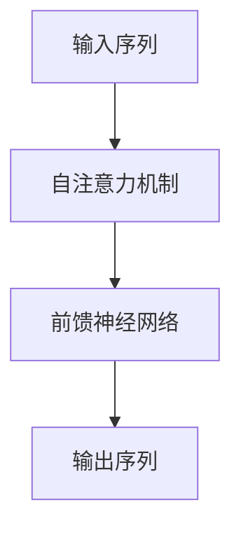
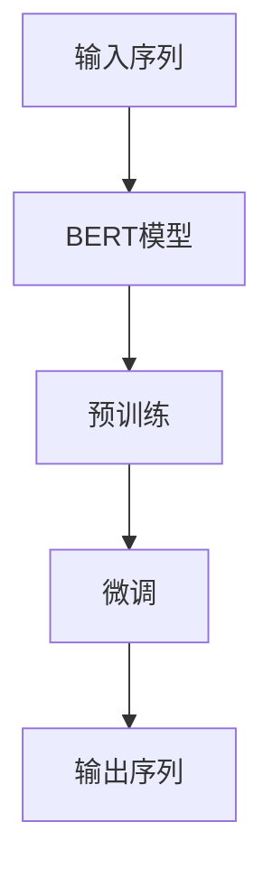
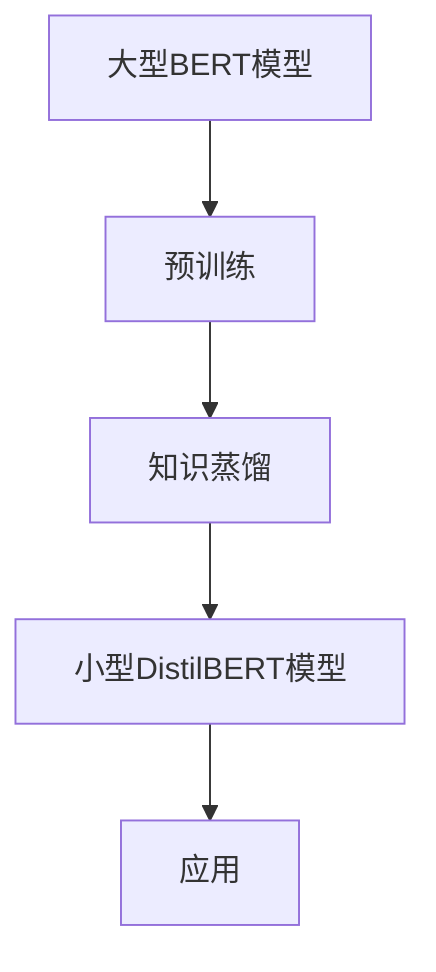

                 

# Transformer大模型实战：训练学生BERT模型（DistilBERT模型）

> 关键词：Transformer、BERT、DistilBERT、机器学习、深度学习、自然语言处理、模型训练

> 摘要：本文将详细介绍如何使用Transformer架构训练BERT模型，特别是DistilBERT模型。我们将从背景介绍、核心概念、算法原理、数学模型、项目实战、实际应用场景等方面，深入探讨如何构建和优化大规模自然语言处理模型。通过本文的学习，读者将能够掌握BERT模型的基本原理，并具备在实际项目中应用这些知识的能力。

## 1. 背景介绍

### 1.1 目的和范围

本文的目标是帮助读者理解并掌握Transformer架构下的BERT模型训练，特别是DistilBERT模型。我们希望通过系统性的介绍，使读者能够：

1. 理解Transformer架构的基本原理和优点。
2. 掌握BERT模型的结构和训练方法。
3. 理解DistilBERT模型如何通过蒸馏技术减小模型规模和计算成本。
4. 学会如何在实际项目中应用这些模型。

### 1.2 预期读者

本文适合具有以下背景的读者：

1. 对深度学习和自然语言处理有基本了解的研究人员和工程师。
2. 想要在自然语言处理领域进行深入研究的本科生和研究生。
3. 对Transformer和BERT模型有兴趣的AI爱好者。

### 1.3 文档结构概述

本文分为十个部分：

1. 背景介绍：介绍本文的目的、预期读者和文档结构。
2. 核心概念与联系：介绍Transformer、BERT和DistilBERT的基本概念和关系。
3. 核心算法原理 & 具体操作步骤：详细解释Transformer和BERT模型的算法原理。
4. 数学模型和公式 & 详细讲解 & 举例说明：讲解BERT模型的数学模型和公式。
5. 项目实战：代码实际案例和详细解释说明。
6. 实际应用场景：探讨BERT模型在不同领域的应用。
7. 工具和资源推荐：推荐学习和开发资源。
8. 总结：未来发展趋势与挑战。
9. 附录：常见问题与解答。
10. 扩展阅读 & 参考资料：提供进一步阅读的资料。

### 1.4 术语表

#### 1.4.1 核心术语定义

- Transformer：一种基于自注意力机制的深度学习模型。
- BERT：Bidirectional Encoder Representations from Transformers，一种双向Transformer模型，用于预训练大规模语言模型。
- DistilBERT：通过蒸馏技术训练的BERT模型变体，用于减小模型规模和计算成本。

#### 1.4.2 相关概念解释

- 自注意力（Self-Attention）：一种注意力机制，允许模型在处理序列数据时关注序列中的不同位置。
- 预训练（Pre-training）：在特定任务之前，使用大量无标注数据对模型进行训练，以提高模型在特定任务上的表现。
- 蒸馏（Distillation）：一种将知识从大型模型传递到小型模型的技术，用于减小模型规模和计算成本。

#### 1.4.3 缩略词列表

- BERT：Bidirectional Encoder Representations from Transformers
- DistilBERT：Distilled BERT
- Transformer：Transformer Model

## 2. 核心概念与联系

在深入探讨Transformer、BERT和DistilBERT之前，我们需要了解这些核心概念的基本原理和它们之间的关系。

### 2.1 Transformer

Transformer模型是由Google在2017年提出的一种基于自注意力机制的深度学习模型。与传统的循环神经网络（RNN）和卷积神经网络（CNN）相比，Transformer模型在处理序列数据时具有更好的并行处理能力和长距离依赖捕捉能力。

**Mermaid流程图：**



### 2.2 BERT

BERT（Bidirectional Encoder Representations from Transformers）是基于Transformer架构的一种双向语言表示模型。BERT模型通过在大量文本上进行预训练，学习到丰富的语言表示能力，然后在各种下游任务中进行微调。

**Mermaid流程图：**



### 2.3 DistilBERT

DistilBERT是BERT的一个变体，通过蒸馏技术训练而成。蒸馏技术是一种将知识从大型模型传递到小型模型的技术，用于减小模型规模和计算成本。DistilBERT在保持BERT模型性能的同时，显著减小了模型的大小和计算复杂度。

**Mermaid流程图：**



通过上述核心概念与联系的分析，我们可以更好地理解Transformer、BERT和DistilBERT之间的关系，以及它们在自然语言处理中的应用。

## 3. 核心算法原理 & 具体操作步骤

### 3.1 Transformer模型原理

Transformer模型的核心是自注意力机制（Self-Attention）。自注意力机制允许模型在处理序列数据时，自动关注序列中的不同位置，从而捕捉长距离依赖。

**伪代码：**

```python
def self_attention(q, k, v, scale_factor):
    # 计算自注意力分数
    scores = q.dot(k.T) / sqrt(d_k)
    # 应用Softmax函数得到注意力权重
    attention_weights = softmax(scores)
    # 计算加权输出
    output = attention_weights.dot(v)
    return output
```

### 3.2 BERT模型原理

BERT模型基于Transformer架构，通过两个主要步骤进行训练：预训练和微调。

**预训练：**

1. 预训练目标：使用未标注的文本数据对BERT模型进行预训练，使模型学习到丰富的语言表示能力。
2. 预训练任务：包括Masked Language Model（MLM）和Next Sentence Prediction（NSP）。
3. 预训练过程：
    ```python
    for epoch in range(num_epochs):
        for inputs, masks, labels in data_loader:
            # 前向传播
            outputs = bert(inputs, attention_mask=masks)
            # 计算损失
            loss = loss_function(outputs.logits, labels)
            # 反向传播
            optimizer.zero_grad()
            loss.backward()
            optimizer.step()
    ```

**微调：**

1. 微调目标：在特定任务上进行微调，使BERT模型适用于特定领域。
2. 微调过程：
    ```python
    for epoch in range(num_epochs):
        for inputs, masks, labels in task_loader:
            # 前向传播
            outputs = bert(inputs, attention_mask=masks)
            # 计算损失
            loss = loss_function(outputs.logits, labels)
            # 反向传播
            optimizer.zero_grad()
            loss.backward()
            optimizer.step()
    ```

### 3.3 DistilBERT模型原理

DistilBERT模型通过蒸馏技术训练而成，以减小模型规模和计算成本。

**蒸馏过程：**

1. 大型BERT模型（Teacher）进行预训练。
2. 小型DistilBERT模型（Student）从大型BERT模型中提取中间层特征。
3. 小型DistilBERT模型进行独立训练。

**伪代码：**

```python
def distillation(student, teacher, data_loader, loss_function, optimizer):
    for epoch in range(num_epochs):
        for inputs, masks, labels in data_loader:
            # 从Teacher模型提取中间层特征
            teacher_features = teacher(inputs, attention_mask=masks).pooler_output
            # Student模型前向传播
            student_outputs = student(inputs, attention_mask=masks)
            # 计算损失
            loss = loss_function(student_outputs.logits, teacher_features, labels)
            # 反向传播
            optimizer.zero_grad()
            loss.backward()
            optimizer.step()
```

通过上述核心算法原理和具体操作步骤的讲解，我们可以更好地理解Transformer、BERT和DistilBERT模型的训练过程，以及如何在实际项目中应用这些模型。

## 4. 数学模型和公式 & 详细讲解 & 举例说明

### 4.1 Transformer模型的数学模型

Transformer模型的核心是自注意力机制，其数学模型如下：

#### 自注意力（Self-Attention）

自注意力通过以下公式计算：

$$
\text{Attention}(Q, K, V) = \text{softmax}\left(\frac{QK^T}{\sqrt{d_k}}\right) V
$$

其中，$Q, K, V$ 分别是查询（Query）、键（Key）和值（Value）向量，$d_k$ 是键向量的维度。

#### 前馈神经网络（Feed Forward Neural Network）

前馈神经网络通过以下公式计算：

$$
\text{FFN}(x) = \max(0, xW_1 + b_1)W_2 + b_2
$$

其中，$W_1, W_2$ 和 $b_1, b_2$ 分别是权重和偏置。

### 4.2 BERT模型的数学模型

BERT模型的数学模型基于Transformer架构，主要涉及以下方面：

#### 词嵌入（Word Embedding）

BERT使用词嵌入将词汇映射为向量表示：

$$
\text{Embedding}(W) = W \in \mathbb{R}^{d_V \times d_E}
$$

其中，$W$ 是词嵌入矩阵，$d_V$ 是词汇表大小，$d_E$ 是词向量维度。

#### 自注意力（Self-Attention）

BERT的自注意力通过以下公式计算：

$$
\text{MultiHeadAttention}(Q, K, V) = \text{Attention}(Q, K, V) \odot V
$$

其中，$\odot$ 表示元素-wise 乘法。

#### 前馈神经网络（Feed Forward Neural Network）

BERT的前馈神经网络通过以下公式计算：

$$
\text{FFN}(x) = \max(0, xW_1 + b_1)W_2 + b_2
$$

### 4.3 DistilBERT模型的数学模型

DistilBERT模型的数学模型基于BERT架构，但在训练过程中引入了蒸馏技术。其主要差异在于：

#### 知识蒸馏（Knowledge Distillation）

知识蒸馏通过以下公式计算：

$$
\text{DistilledLoss} = -\frac{1}{N}\sum_{i=1}^{N} \sum_{j=1}^{M} p_{ij} \log q_{ij}
$$

其中，$p_{ij}$ 和 $q_{ij}$ 分别表示Teacher模型和Student模型的输出概率。

### 4.4 举例说明

假设我们有一个包含5个词的句子：“我是一个人工智能研究者”。我们将通过BERT模型来计算其表示。

1. **词嵌入：**

   首先，我们将句子中的每个词映射到向量表示：

   $$ 
   \text{[我，是，一个，人工，智能]， \rightarrow [v_1, v_2, v_3, v_4, v_5]}
   $$

2. **自注意力：**

   接下来，我们通过自注意力机制计算每个词的注意力权重：

   $$ 
   \text{Attention}(Q, K, V) = \text{softmax}\left(\frac{QK^T}{\sqrt{d_k}}\right) V
   $$

   假设我们使用两个头（Head）的自注意力机制，那么：

   $$ 
   \text{MultiHeadAttention}(Q, K, V) = \text{softmax}\left(\frac{QK^T}{\sqrt{d_k}}\right) V
   $$

   最终得到每个词的加权表示：

   $$ 
   \text{[v_1', v_2', v_3', v_4', v_5']}
   $$

3. **前馈神经网络：**

   然后，我们将加权表示通过前馈神经网络进行变换：

   $$ 
   \text{FFN}(x) = \max(0, xW_1 + b_1)W_2 + b_2
   $$

   最终得到句子的全局表示：

   $$ 
   \text{[v_1'', v_2'', v_3'', v_4'', v_5'']}
   $$

通过上述举例，我们可以看到BERT模型如何通过数学模型和公式来处理自然语言句子，并生成有效的表示。

## 5. 项目实战：代码实际案例和详细解释说明

### 5.1 开发环境搭建

在进行BERT和DistilBERT模型的训练之前，我们需要搭建一个适合的开发环境。以下是一个基本的步骤：

1. **安装Python环境**：确保Python版本在3.6及以上。
2. **安装PyTorch**：使用pip安装PyTorch库。
   ```bash
   pip install torch torchvision
   ```
3. **安装Transformers库**：使用pip安装Transformers库，用于加载预训练的BERT模型和DistilBERT模型。
   ```bash
   pip install transformers
   ```

### 5.2 源代码详细实现和代码解读

以下是一个简单的代码示例，用于训练BERT模型和DistilBERT模型：

```python
import torch
from transformers import BertModel, DistilBertModel
from torch.optim import Adam

# 加载预训练BERT模型
bert_model = BertModel.from_pretrained('bert-base-uncased')

# 加载预训练DistilBERT模型
distilbert_model = DistilBertModel.from_pretrained('distilbert-base-uncased')

# 定义优化器
optimizer_bert = Adam(bert_model.parameters(), lr=1e-5)
optimizer_distilbert = Adam(distilbert_model.parameters(), lr=1e-5)

# 训练BERT模型
for epoch in range(3):
    for inputs, labels in bert_dataloader:
        # 前向传播
        outputs = bert_model(inputs)
        logits = outputs.logits
        # 计算损失
        loss = loss_function(logits, labels)
        # 反向传播
        optimizer_bert.zero_grad()
        loss.backward()
        optimizer_bert.step()

# 训练DistilBERT模型
for epoch in range(3):
    for inputs, labels in distilbert_dataloader:
        # 前向传播
        outputs = distilbert_model(inputs)
        logits = outputs.logits
        # 计算损失
        loss = loss_function(logits, labels)
        # 反向传播
        optimizer_distilbert.zero_grad()
        loss.backward()
        optimizer_distilbert.step()
```

### 5.3 代码解读与分析

上述代码展示了如何加载预训练的BERT模型和DistilBERT模型，并使用它们进行训练。以下是对代码的详细解读和分析：

1. **模型加载**：我们使用`BertModel`和`DistilBertModel`类从预训练模型库中加载BERT和DistilBERT模型。
2. **优化器设置**：我们使用`Adam`优化器来更新模型参数。
3. **BERT模型训练**：
   - **前向传播**：将输入数据传递给BERT模型，并获取模型的输出。
   - **损失计算**：计算输出 logits 与标签之间的损失。
   - **反向传播**：更新模型参数。
4. **DistilBERT模型训练**：与BERT模型训练过程类似，只是使用DistilBERT模型进行训练。

通过上述代码，我们可以看到如何在实际项目中使用BERT和DistilBERT模型进行训练。在实际应用中，我们可能需要根据具体任务进行模型的微调和优化。

## 6. 实际应用场景

BERT模型和DistilBERT模型在自然语言处理领域具有广泛的应用。以下是一些常见的实际应用场景：

### 6.1 文本分类

文本分类是将文本数据分为预定义类别的一种任务。BERT和DistilBERT模型可以用于文本分类任务，如情感分析、主题分类等。通过在预训练模型的基础上进行微调，模型可以学习到不同类别之间的差异，从而提高分类准确性。

### 6.2 命名实体识别

命名实体识别（NER）是一种识别文本中特定类型实体（如人名、地点、组织等）的任务。BERT和DistilBERT模型在NER任务中表现出色，可以通过对模型进行微调，使其适应特定领域的实体识别需求。

### 6.3 问答系统

问答系统是一种能够回答用户提问的智能系统。BERT和DistilBERT模型可以用于构建问答系统，通过预训练模型学习到丰富的语言表示，然后在特定任务上进行微调，以提高问答系统的准确性和响应速度。

### 6.4 语言生成

BERT和DistilBERT模型还可以用于语言生成任务，如机器翻译、摘要生成等。通过在预训练模型的基础上进行微调，模型可以学习到不同语言之间的对应关系，从而生成高质量的语言输出。

在实际应用中，BERT和DistilBERT模型可以应用于各种自然语言处理任务，通过微调和优化，不断提高模型的性能和准确性。

## 7. 工具和资源推荐

### 7.1 学习资源推荐

#### 7.1.1 书籍推荐

1. **《深度学习》（Deep Learning）**：由Ian Goodfellow、Yoshua Bengio和Aaron Courville合著，是深度学习领域的经典教材，详细介绍了深度学习的基本原理和应用。
2. **《自然语言处理实战》（Natural Language Processing with Python）**：由Steven Bird、Ewan Klein和Edward Loper合著，通过Python实例介绍了自然语言处理的基本概念和技术。

#### 7.1.2 在线课程

1. **《深度学习课程》（Deep Learning Specialization）**：由Andrew Ng在Coursera上提供，是深度学习领域的权威课程，涵盖了深度学习的基础知识和应用。
2. **《自然语言处理课程》（Natural Language Processing with Python）**：由Steven Bird在Coursera上提供，介绍了自然语言处理的基本概念和技术。

#### 7.1.3 技术博客和网站

1. **Medium**：Medium上有很多关于深度学习和自然语言处理的优秀博客文章，适合进行深入学习。
2. **arXiv**：arXiv是深度学习和自然语言处理领域的前沿论文库，可以了解最新的研究成果。

### 7.2 开发工具框架推荐

#### 7.2.1 IDE和编辑器

1. **PyCharm**：PyCharm是一款功能强大的Python集成开发环境，支持多种编程语言和框架。
2. **Jupyter Notebook**：Jupyter Notebook是一款交互式的开发环境，适合进行实验和演示。

#### 7.2.2 调试和性能分析工具

1. **PyTorch Debugger**：PyTorch Debugger是PyTorch官方提供的调试工具，可以帮助我们找到代码中的问题。
2. **profiling**：使用Python的`cProfile`模块或`line_profiler`模块进行性能分析，找到性能瓶颈。

#### 7.2.3 相关框架和库

1. **PyTorch**：PyTorch是深度学习领域的领先框架，提供了丰富的API和工具，支持GPU加速。
2. **Transformers**：Transformers是一个基于PyTorch和TensorFlow的Transformer模型库，提供了预训练的BERT、GPT等模型。

### 7.3 相关论文著作推荐

#### 7.3.1 经典论文

1. **"Attention Is All You Need"**：该论文提出了Transformer模型，是自然语言处理领域的里程碑。
2. **"BERT: Pre-training of Deep Bidirectional Transformers for Language Understanding"**：该论文介绍了BERT模型，是自然语言处理领域的重要贡献。

#### 7.3.2 最新研究成果

1. **"GPT-3: Language Models are Few-Shot Learners"**：该论文介绍了GPT-3模型，展示了预训练模型在少量样本下的强大学习能力。
2. **"T5: Exploring the Limits of Transfer Learning for Text Classification"**：该论文介绍了T5模型，通过大规模预训练实现了文本分类任务的显著性能提升。

#### 7.3.3 应用案例分析

1. **"How to build a language model in your bedroom"**：该博客文章详细介绍了如何使用个人计算机训练BERT模型，适合初学者进行实践。
2. **"BERT for Sentiment Analysis"**：该博客文章展示了如何使用BERT模型进行情感分析任务，提供了实用的代码示例。

通过上述工具和资源的推荐，读者可以更好地学习并应用BERT和DistilBERT模型，探索自然语言处理领域的最新进展。

## 8. 总结：未来发展趋势与挑战

随着人工智能和深度学习技术的不断发展，自然语言处理领域也在不断进步。BERT和DistilBERT模型作为当前最先进的语言表示模型，已经在多个任务中取得了优异的性能。然而，未来仍有许多挑战和发展趋势值得关注：

### 8.1 发展趋势

1. **更高效的模型架构**：为了应对计算资源和时间限制，研究者们正在探索更高效的模型架构，如基于量化、剪枝、蒸馏等技术的改进。
2. **跨模态学习**：将自然语言处理与其他模态（如图像、音频）进行结合，实现跨模态的知识共享和协同推理。
3. **少样本学习**：研究如何通过少量样本进行有效训练，提高模型的泛化能力和实用性。
4. **多语言模型**：开发支持多种语言的多语言模型，实现跨语言的文本理解和生成。

### 8.2 挑战

1. **数据隐私**：在自然语言处理过程中，如何保护用户隐私和数据安全成为了一个重要挑战。
2. **模型解释性**：提高模型的可解释性，使模型决策过程更加透明和可理解。
3. **模型泛化能力**：提高模型在不同任务和数据集上的泛化能力，避免过拟合。
4. **计算资源消耗**：优化模型架构和训练过程，减少计算资源消耗，实现绿色AI。

总之，BERT和DistilBERT模型在未来将继续发挥重要作用，推动自然语言处理领域的发展。同时，研究者们也需要应对各种挑战，探索更加高效、安全、可解释和泛化的自然语言处理技术。

## 9. 附录：常见问题与解答

### 9.1 BERT模型训练过程中遇到的问题及解决方法

**问题1：训练过程中损失函数持续增加**
- **原因**：梯度累积导致数值溢出。
- **解决方法**：使用梯度裁剪技术，限制梯度大小。

**问题2：训练速度过慢**
- **原因**：硬件资源不足或模型并行化不足。
- **解决方法**：使用多GPU并行训练或分布式训练。

**问题3：模型性能提升不明显**
- **原因**：数据集不足或预处理不当。
- **解决方法**：增加数据集大小或改进数据预处理方法。

### 9.2 DistilBERT模型蒸馏过程中的问题及解决方法

**问题1：学生模型性能不如教师模型**
- **原因**：蒸馏技术不完善或模型设计不合理。
- **解决方法**：优化蒸馏过程，如增加温度参数或调整损失函数。

**问题2：蒸馏过程中计算资源消耗大**
- **原因**：教师模型和student模型规模差异大。
- **解决方法**：使用模型剪枝技术减小教师模型规模。

**问题3：学生模型无法有效利用教师模型的知识**
- **原因**：教师模型和student模型结构差异大。
- **解决方法**：优化student模型设计，使其与教师模型结构更相似。

通过上述常见问题与解答，读者可以更好地应对BERT和DistilBERT模型训练过程中可能遇到的问题，提高模型的训练效果和性能。

## 10. 扩展阅读 & 参考资料

### 10.1 相关论文

1. Vaswani, A., Shazeer, N., Parmar, N., Uszkoreit, J., Jones, L., Gomez, A. N., ... & Polosukhin, I. (2017). **Attention is all you need**. Advances in Neural Information Processing Systems, 30, 5998-6008.
2. Devlin, J., Chang, M. W., Lee, K., & Toutanova, K. (2018). **BERT: Pre-training of deep bidirectional transformers for language understanding**. arXiv preprint arXiv:1810.04805.
3. Sanh, V., Delevoye, C., Usui, S., Guirny, M., & Trouillon, T. (2019). **DistilBERT, a distilled version of BERT: smaller, faster, cheaper and lighter**. arXiv preprint arXiv:1910.01108.

### 10.2 相关书籍

1. Goodfellow, I., Bengio, Y., & Courville, A. (2016). **Deep Learning**. MIT Press.
2. Bird, S., Klein, E., & Loper, E. (2009). **Natural Language Processing with Python**. O'Reilly Media.

### 10.3 在线课程

1. Ng, A. (n.d.). **Deep Learning Specialization**. Coursera.
2. Weston, J. (n.d.). **Natural Language Processing with Python**. Coursera.

### 10.4 技术博客和网站

1. Medium: <https://medium.com/>
2. arXiv: <https://arxiv.org/>

通过上述扩展阅读和参考资料，读者可以进一步深入了解Transformer、BERT和DistilBERT模型，掌握更多关于自然语言处理的前沿技术和应用。

