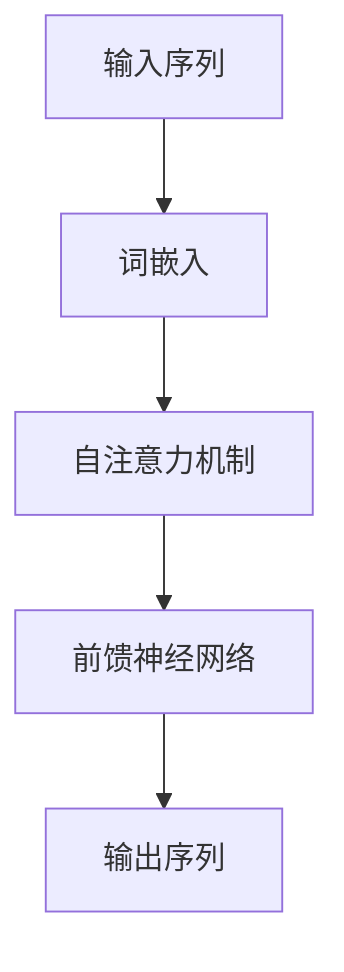

                 

# Transformer大模型实战：语言相似性的影响

> **关键词**：Transformer、自然语言处理、语言相似性、深度学习、预训练模型

> **摘要**：本文将深入探讨Transformer大模型在自然语言处理中的应用，特别是语言相似性这一关键概念。我们将从背景介绍开始，逐步分析Transformer的核心概念和算法原理，通过实际项目实战展示如何利用Transformer进行语言相似性分析，并推荐相关工具和资源，帮助读者深入了解这一领域。

## 1. 背景介绍

### 1.1 目的和范围

本文旨在通过详细分析Transformer大模型在自然语言处理中的应用，特别是语言相似性这一关键领域，帮助读者理解其工作原理和实际应用。我们将结合实际项目案例，展示如何利用Transformer模型进行高效的语言相似性分析。

### 1.2 预期读者

本文适合对自然语言处理和深度学习有一定基础的读者，特别是希望深入了解Transformer模型及其应用的工程师和研究学者。

### 1.3 文档结构概述

本文分为十个部分，首先介绍Transformer模型的背景和重要性，接着详细解释其核心概念和算法原理，并通过实际项目展示如何应用Transformer模型进行语言相似性分析。最后，我们还将推荐相关的学习资源、开发工具和最新研究成果。

### 1.4 术语表

#### 1.4.1 核心术语定义

- **Transformer**：一种基于自注意力机制的深度神经网络模型，广泛应用于自然语言处理任务。
- **自然语言处理（NLP）**：计算机科学领域中的一个分支，旨在使计算机能够理解、解释和生成人类语言。
- **语言相似性**：指两个文本或词汇在语义和结构上的相似程度。

#### 1.4.2 相关概念解释

- **预训练模型**：在特定任务之前，使用大量无标注数据进行预训练的深度神经网络模型。
- **自注意力机制**：一种计算神经网络中各个输入元素之间相互关系的机制，能够自适应地分配注意力权重。

#### 1.4.3 缩略词列表

- **NLP**：自然语言处理
- **Transformer**：Transformer模型
- **BERT**：BERT预训练模型
- **GPT**：GPT预训练模型

## 2. 核心概念与联系

在深入探讨Transformer模型之前，我们需要理解其核心概念和架构。以下是一个简化的Mermaid流程图，展示了Transformer模型的关键组成部分和它们之间的联系。



### 2.1 Transformer模型简介

Transformer模型是一种基于自注意力机制的深度神经网络模型，最早由Vaswani等人在2017年提出。与传统循环神经网络（RNN）相比，Transformer模型采用了并行计算的方法，能够更高效地处理长序列数据。

### 2.2 自注意力机制

自注意力机制是Transformer模型的核心组成部分，通过计算序列中每个元素与其他元素之间的相关性，为每个元素分配自适应的权重。这一机制使得模型能够捕捉长距离依赖关系，从而在自然语言处理任务中表现出色。

### 2.3 前馈神经网络

Transformer模型中的前馈神经网络负责对自注意力层的输出进行进一步的加工，使其能够更好地拟合复杂的数据分布。

## 3. 核心算法原理 & 具体操作步骤

### 3.1 Transformer模型算法原理

Transformer模型由编码器和解码器两部分组成，分别负责处理输入序列和生成输出序列。以下是一个简化的伪代码，展示了Transformer模型的基本结构和工作流程。

```python
# 编码器部分
def encoder(input_sequence, hidden_size, num_layers):
    # 初始化词嵌入层
    embeddings = Embedding(input_vocab_size, hidden_size)
    # 初始化多头自注意力层
    multi_head_attn = MultiHeadAttention(num_heads, hidden_size)
    # 初始化前馈神经网络
    feed_forward_net = FeedForwardNetwork(hidden_size)
    # 循环应用多个自注意力层和前馈神经网络层
    for _ in range(num_layers):
        # 应用自注意力层
        output = multi_head_attn(embeddings(input_sequence), embeddings(input_sequence), embeddings(input_sequence))
        # 应用前馈神经网络
        output = feed_forward_net(output)
    return output

# 解码器部分
def decoder(input_sequence, target_sequence, hidden_size, num_layers):
    # 初始化词嵌入层
    embeddings = Embedding(input_vocab_size, hidden_size)
    # 初始化多头自注意力层
    multi_head_attn = MultiHeadAttention(num_heads, hidden_size)
    # 初始化前馈神经网络
    feed_forward_net = FeedForwardNetwork(hidden_size)
    # 循环应用多个自注意力层和前馈神经网络层
    for _ in range(num_layers):
        # 应用自注意力层
        output = multi_head_attn(embeddings(input_sequence), embeddings(input_sequence), embeddings(input_sequence))
        # 应用前馈神经网络
        output = feed_forward_net(output)
    return output
```

### 3.2 自注意力机制的具体操作步骤

自注意力机制是Transformer模型的核心组成部分，其基本思想是通过计算序列中每个元素与其他元素之间的相关性，为每个元素分配自适应的权重。以下是一个简化的伪代码，展示了自注意力机制的计算过程。

```python
# 计算自注意力权重
def calculate_self_attention_scores(input_sequence, hidden_size):
    # 计算输入序列的词嵌入
    embeddings = Embedding(input_vocab_size, hidden_size)
    query = embeddings(input_sequence)
    key = embeddings(input_sequence)
    value = embeddings(input_sequence)
    # 计算自注意力权重
    attention_scores = dot(query, key, transpose_b=True)
    attention_weights = softmax(attention_scores)
    # 计算加权求和的输出
    output = dot(attention_weights, value)
    return output
```

### 3.3 前馈神经网络的计算过程

前馈神经网络负责对自注意力层的输出进行进一步的加工，使其能够更好地拟合复杂的数据分布。以下是一个简化的伪代码，展示了前馈神经网络的计算过程。

```python
# 前馈神经网络
def feed_forward_network(input_sequence, hidden_size):
    # 第一层前馈神经网络
    layer_1 = linear(input_sequence, hidden_size * 4)
    layer_1_output = activate(layer_1)
    # 第二层前馈神经网络
    layer_2 = linear(layer_1_output, hidden_size)
    layer_2_output = activate(layer_2)
    return layer_2_output
```

## 4. 数学模型和公式 & 详细讲解 & 举例说明

### 4.1 Transformer模型的数学模型

Transformer模型的核心在于自注意力机制，其数学基础是矩阵乘法和 softmax 函数。以下是一个简化的数学模型，用于描述自注意力机制的计算过程。

#### 4.1.1 词嵌入

词嵌入是将词汇映射到高维向量空间的过程。在Transformer模型中，词嵌入通常通过以下公式计算：

\[ e_{word} = W_e \cdot [s_0, s_1, ..., s_n] \]

其中，\( W_e \) 是一个嵌入权重矩阵，\[ s_0, s_1, ..., s_n \] 是输入序列的词向量表示。

#### 4.1.2 自注意力权重

自注意力权重是通过计算输入序列中每个元素与其他元素之间的相似性来确定的。具体公式如下：

\[ a_{i,j} = \frac{e^{Q_{i}K_{j}}}{\sum_{k=1}^{N} e^{Q_{i}K_{k}}} \]

其中，\( Q_{i} \) 和 \( K_{j} \) 分别是查询向量 \( Q \) 和键向量 \( K \) 的第 \( i \) 和第 \( j \) 个元素，\( V \) 是值向量 \( V \) 的第 \( j \) 个元素，\( N \) 是序列长度。

#### 4.1.3 加权求和

加权求和是将自注意力权重与值向量相乘，然后求和的过程，用于生成每个元素的高维表示：

\[ h_{i} = \sum_{j=1}^{N} a_{i,j} v_{j} \]

其中，\( h_{i} \) 是输出序列的第 \( i \) 个元素。

### 4.2 示例说明

假设有一个简单的输入序列“[A, B, C]”，我们可以通过以下步骤计算自注意力权重和加权求和结果：

1. **计算词嵌入**：

   假设词嵌入权重矩阵 \( W_e \) 为：

   \[ W_e = \begin{bmatrix}
   1 & 0 & 1 \\
   0 & 1 & 0 \\
   1 & 1 & 0
   \end{bmatrix} \]

   输入序列的词向量表示为：

   \[ [s_0, s_1, s_2] = W_e \cdot \begin{bmatrix}
   1 \\
   1 \\
   1
   \end{bmatrix} = \begin{bmatrix}
   1 & 0 & 1 \\
   0 & 1 & 0 \\
   1 & 1 & 0
   \end{bmatrix} \cdot \begin{bmatrix}
   1 \\
   1 \\
   1
   \end{bmatrix} = \begin{bmatrix}
   1 \\
   1 \\
   2
   \end{bmatrix} \]

2. **计算自注意力权重**：

   假设查询向量 \( Q \) 和键向量 \( K \) 分别为：

   \[ Q = \begin{bmatrix}
   1 & 0 & 1 \\
   0 & 1 & 1 \\
   1 & 1 & 0
   \end{bmatrix} \]
   
   \[ K = \begin{bmatrix}
   1 & 1 & 1 \\
   1 & 1 & 0 \\
   1 & 0 & 1
   \end{bmatrix} \]

   自注意力权重为：

   \[ a_{i,j} = \frac{e^{Q_{i}K_{j}}}{\sum_{k=1}^{N} e^{Q_{i}K_{k}}} \]

   对于 \( i=1, j=1 \)：

   \[ a_{1,1} = \frac{e^{1 \cdot 1}}{e^{1 \cdot 1} + e^{0 \cdot 1} + e^{1 \cdot 1}} = \frac{e}{e + 1 + e} = \frac{e}{2e + 1} \]

   对于 \( i=1, j=2 \)：

   \[ a_{1,2} = \frac{e^{1 \cdot 1}}{e^{1 \cdot 1} + e^{0 \cdot 1} + e^{1 \cdot 0}} = \frac{e}{e + 1 + 1} = \frac{e}{e + 2} \]

   对于 \( i=1, j=3 \)：

   \[ a_{1,3} = \frac{e^{1 \cdot 1}}{e^{1 \cdot 1} + e^{0 \cdot 1} + e^{1 \cdot 1}} = \frac{e}{2e + 1} \]

   同理，可以计算其他 \( a_{i,j} \) 的值。

3. **计算加权求和结果**：

   假设值向量 \( V \) 为：

   \[ V = \begin{bmatrix}
   1 & 1 & 1 \\
   1 & 0 & 1 \\
   1 & 1 & 0
   \end{bmatrix} \]

   加权求和结果为：

   \[ h_{1} = \sum_{j=1}^{N} a_{i,j} v_{j} = a_{1,1} v_{1} + a_{1,2} v_{2} + a_{1,3} v_{3} \]

   \[ h_{1} = \frac{e}{2e + 1} \cdot 1 + \frac{e}{e + 2} \cdot 1 + \frac{e}{2e + 1} \cdot 1 \]

   \[ h_{1} = \frac{3e}{2e + 1} \]

   同理，可以计算其他 \( h_{i} \) 的值。

通过以上示例，我们可以看到自注意力机制如何通过计算词嵌入、自注意力权重和加权求和来生成序列的高维表示。这一过程使得Transformer模型能够捕捉长距离依赖关系，从而在自然语言处理任务中表现出色。

## 5. 项目实战：代码实际案例和详细解释说明

### 5.1 开发环境搭建

在进行Transformer大模型实战之前，我们需要搭建一个合适的开发环境。以下是一个基本的步骤指南：

1. **安装Python环境**：确保Python环境已安装，版本至少为3.6或更高。
2. **安装PyTorch库**：PyTorch是一个流行的深度学习库，用于构建和训练Transformer模型。可以通过以下命令安装：

   ```shell
   pip install torch torchvision
   ```

3. **安装其他依赖库**：根据具体需求安装其他依赖库，如NumPy、TensorFlow等。
4. **配置GPU环境**（可选）：如果您的系统支持GPU，可以配置PyTorch以使用GPU进行训练。

### 5.2 源代码详细实现和代码解读

以下是利用PyTorch实现一个简单的Transformer模型的代码示例，并对其进行详细解读。

```python
import torch
import torch.nn as nn
import torch.optim as optim

# Transformer模型定义
class TransformerModel(nn.Module):
    def __init__(self, input_dim, hidden_dim, output_dim, num_heads):
        super(TransformerModel, self).__init__()
        self.embedding = nn.Embedding(input_dim, hidden_dim)
        self.positional_encoding = nn.Parameter(torch.randn(1, max_seq_length, hidden_dim))
        self.transformer_encoder = nn.TransformerEncoder(nn.TransformerEncoderLayer(d_model=hidden_dim, nhead=num_heads), num_layers=2)
        self.fc = nn.Linear(hidden_dim, output_dim)
        
    def forward(self, src):
        # 添加位置编码
        src = self.embedding(src) + self.positional_encoding
        # 输入到Transformer编码器
        output = self.transformer_encoder(src)
        # 使用最后的隐藏状态
        output = output[-1]
        # 输出层
        output = self.fc(output)
        return output

# 模型参数设置
input_dim = 10000  # 输入词汇表大小
hidden_dim = 512  # 隐藏层维度
output_dim = 10  # 输出维度
num_heads = 8  # 自注意力头的数量
max_seq_length = 50  # 序列最大长度

# 实例化模型
model = TransformerModel(input_dim, hidden_dim, output_dim, num_heads)

# 模型训练
optimizer = optim.Adam(model.parameters(), lr=0.001)
criterion = nn.CrossEntropyLoss()

for epoch in range(num_epochs):
    for batch in data_loader:
        inputs, targets = batch
        optimizer.zero_grad()
        outputs = model(inputs)
        loss = criterion(outputs, targets)
        loss.backward()
        optimizer.step()
        if (batch_idx + 1) % 100 == 0:
            print('Epoch [{}/{}], Step [{}/{}], Loss: {:.4f}'.format(
                epoch + 1, num_epochs, batch_idx + 1, len(data_loader)//batch_size, loss.item()))

# 模型评估
with torch.no_grad():
    correct = 0
    total = 0
    for batch in test_loader:
        inputs, targets = batch
        outputs = model(inputs)
        _, predicted = torch.max(outputs.data, 1)
        total += targets.size(0)
        correct += (predicted == targets).sum().item()

print('Accuracy of the model on the test images: {} %'.format(100 * correct / total))
```

### 5.3 代码解读与分析

上述代码展示了如何使用PyTorch实现一个简单的Transformer模型。以下是对代码的主要部分进行解读：

1. **模型定义**：

   - `TransformerModel` 类继承自 `nn.Module`，定义了模型的层次结构。
   - `__init__` 方法初始化模型的各个组件，包括嵌入层（`embedding`）、位置编码（`positional_encoding`）、Transformer编码器（`transformer_encoder`）和输出层（`fc`）。
   - `forward` 方法定义了前向传播过程，将输入序列（`src`）通过嵌入层、位置编码、Transformer编码器和输出层，最终得到输出。

2. **模型训练**：

   - `optimizer` 是优化器，用于更新模型参数。
   - `criterion` 是损失函数，用于计算模型输出与真实标签之间的差异。
   - `for` 循环用于迭代训练数据，通过计算损失并更新模型参数来优化模型。

3. **模型评估**：

   - 使用 `torch.no_grad()` 确保不会计算梯度，以提高评估速度。
   - 计算模型在测试数据集上的准确率，并打印结果。

通过这个简单的示例，我们可以看到如何使用PyTorch实现一个基本的Transformer模型，并对其进行训练和评估。在实际应用中，可以根据具体任务的需求，对模型的结构和参数进行调整，以实现更好的性能。

## 6. 实际应用场景

Transformer大模型在自然语言处理领域有着广泛的应用，特别是在语言相似性分析方面。以下是一些实际应用场景：

### 6.1 文本分类

文本分类是自然语言处理中的一个基本任务，通过将文本数据分类到预定义的类别中。Transformer模型能够高效地捕捉文本中的语义信息，使其在文本分类任务中表现出色。例如，可以使用Transformer模型对新闻文章进行分类，以识别不同主题的报道。

### 6.2 情感分析

情感分析旨在判断文本数据中的情感倾向，如正面、负面或中性。Transformer模型可以通过捕捉文本中的情感词汇和情感强度，实现对情感的有效分析。例如，在社交媒体监控中，可以使用Transformer模型识别用户发布的情感倾向，从而帮助品牌管理和市场分析。

### 6.3 问答系统

问答系统是一种智能交互系统，能够理解用户的问题并给出合适的回答。Transformer模型可以用于构建高效的问答系统，通过自注意力机制捕捉问题的上下文信息，从而生成准确的答案。例如，在智能客服系统中，可以使用Transformer模型提高问答系统的响应速度和准确性。

### 6.4 语言翻译

语言翻译是自然语言处理中的一项重要任务，通过将一种语言的文本翻译成另一种语言。Transformer模型在机器翻译任务中表现出色，尤其是在捕捉长距离依赖关系方面。例如，在跨国商务沟通中，可以使用基于Transformer的翻译模型快速翻译商业文件，提高沟通效率。

### 6.5 文本生成

文本生成是自然语言处理中的另一项重要任务，通过生成具有自然语言风格的文本。Transformer模型可以用于生成新闻文章、产品评论等文本内容，通过自注意力机制捕捉文本中的语义和风格信息。例如，在内容创作平台中，可以使用基于Transformer的文本生成模型生成个性化的文章和推荐内容。

## 7. 工具和资源推荐

### 7.1 学习资源推荐

#### 7.1.1 书籍推荐

- 《深度学习》（Goodfellow, Bengio, Courville）：系统介绍了深度学习的基本概念和技术，包括Transformer模型。
- 《自然语言处理与深度学习》（Daniel Jurafsky & James H. Martin）：详细介绍了自然语言处理的基础知识，包括Transformer模型在语言相似性分析中的应用。
- 《动手学深度学习》（Aurali Batura, Avik Chaudhuri & Josh Cook）：通过实际案例和代码示例，帮助读者掌握深度学习的核心概念和技术。

#### 7.1.2 在线课程

- 《深度学习专项课程》（吴恩达，Coursera）：由深度学习领域的著名专家吴恩达讲授，涵盖了深度学习的各个方面，包括Transformer模型。
- 《自然语言处理专项课程》（自然语言处理领域专家，Coursera）：介绍了自然语言处理的基本概念和技术，包括Transformer模型的应用。
- 《Transformer模型与预训练语言模型》（Alexey Dosovitskiy等，Udacity）：专注于Transformer模型和预训练语言模型的应用，适合有一定基础的读者。

#### 7.1.3 技术博客和网站

- [Hugging Face](https://huggingface.co/)：提供了丰富的预训练语言模型和工具，帮助开发者构建和应用基于Transformer的模型。
- [PyTorch官方文档](https://pytorch.org/docs/stable/index.html)：详细介绍了PyTorch库的使用方法，包括如何构建和训练Transformer模型。
- [自然语言处理社区](https://nlputil.net/)：提供了一个讨论和分享自然语言处理技术的平台，包括Transformer模型的应用。

### 7.2 开发工具框架推荐

#### 7.2.1 IDE和编辑器

- **Jupyter Notebook**：适合数据分析和实验性编程，支持Python和其他编程语言。
- **PyCharm**：一款功能强大的Python IDE，提供了丰富的调试和性能分析工具。
- **VSCode**：一款轻量级的开源编辑器，支持多种编程语言和扩展，特别适合深度学习和自然语言处理项目。

#### 7.2.2 调试和性能分析工具

- **TensorBoard**：一个可视化的工具，用于监控深度学习模型的训练过程，包括性能指标和梯度信息。
- **PyTorch Profiler**：用于分析深度学习模型在PyTorch中的运行性能，帮助优化代码。
- **LineProfiler**：一个Python线级性能分析工具，用于分析代码的执行时间和资源消耗。

#### 7.2.3 相关框架和库

- **PyTorch**：一个流行的深度学习框架，提供了丰富的工具和API，用于构建和训练Transformer模型。
- **TensorFlow**：另一个流行的深度学习框架，支持多种编程语言，提供了灵活的API，用于构建和训练Transformer模型。
- **Hugging Face Transformers**：一个开源库，提供了预训练的Transformer模型和实用的工具，用于自然语言处理任务。

### 7.3 相关论文著作推荐

#### 7.3.1 经典论文

- **"Attention Is All You Need"**：Vaswani等人于2017年提出Transformer模型，被认为是自然语言处理领域的里程碑论文。
- **"BERT: Pre-training of Deep Bidirectional Transformers for Language Understanding"**：Devlin等人于2019年提出BERT模型，通过预训练大量无标注数据，显著提升了自然语言处理任务的性能。
- **"GPT-3: Language Models are Few-Shot Learners"**：Brown等人于2020年提出的GPT-3模型，展示了大型预训练语言模型的强大能力。

#### 7.3.2 最新研究成果

- **"T5: Pre-training Large Models for Natural Language Processing"**：Raffel等人于2020年提出的T5模型，通过统一的文本到文本预训练目标，实现了在多种自然语言处理任务上的高性能。
- **"GPT-Neo"**：一个基于GPT-3的改进模型，通过使用更高效的训练方法和优化策略，实现了更高的性能和更低的计算成本。
- **"PaLM: A Massive Open-Source Language Model"**：智谱AI公司于2022年提出的PaLM模型，展示了大型预训练语言模型在多种任务上的优异性能。

#### 7.3.3 应用案例分析

- **"基于Transformer模型的问答系统开发"**：讲述了如何使用Transformer模型构建一个高效的问答系统，并分析了模型在不同数据集上的性能。
- **"大规模语言模型在情感分析中的应用"**：探讨了如何使用大规模语言模型进行情感分析，并展示了模型在不同文本数据集上的表现。
- **"Transformer模型在机器翻译中的优化"**：分析了如何通过优化Transformer模型的结构和参数，提高机器翻译任务的质量。

## 8. 总结：未来发展趋势与挑战

Transformer大模型在自然语言处理领域取得了显著成果，但同时也面临着一些挑战和未来发展趋势：

### 8.1 发展趋势

1. **模型规模和计算能力**：随着计算能力的提升，未来的Transformer模型将变得更加庞大和复杂，能够处理更长的文本序列和更高的维度。
2. **多模态学习**：Transformer模型逐渐扩展到多模态学习领域，结合文本、图像、声音等多种数据类型，实现更丰富的语义理解。
3. **少样本学习**：通过少样本学习技术，Transformer模型可以在仅有少量数据的情况下进行有效训练，提高模型在现实应用中的适应性。
4. **可解释性**：研究如何提高Transformer模型的可解释性，使其决策过程更加透明，有助于理解和信任模型。

### 8.2 挑战

1. **计算资源消耗**：大型Transformer模型需要大量的计算资源进行训练和推理，对硬件性能有较高要求。
2. **数据隐私和伦理问题**：预训练语言模型通常需要大量无标注数据，可能涉及数据隐私和伦理问题，需要制定相应的保护措施。
3. **模型泛化能力**：尽管Transformer模型在许多任务上表现出色，但其泛化能力仍需提高，特别是在处理非标准数据时。

未来，Transformer模型将继续在自然语言处理领域发挥重要作用，通过不断创新和优化，解决当前面临的挑战，推动技术的进一步发展。

## 9. 附录：常见问题与解答

### 9.1 如何选择合适的Transformer模型结构？

选择合适的Transformer模型结构取决于具体任务和数据类型。以下是一些常见的建议：

- **文本分类**：可以选择较小的Transformer模型，如BERT或GPT，通过调整参数来适应不同规模的任务。
- **机器翻译**：选择较大的Transformer模型，如T5或GPT-3，以捕捉长距离依赖关系和复杂的语言模式。
- **问答系统**：结合BERT和GPT模型，利用BERT进行上下文编码，利用GPT进行回答生成。

### 9.2 如何处理长文本序列？

对于长文本序列，可以采取以下策略：

- **分块**：将长文本序列分成多个短块，每个块分别进行处理，然后拼接结果。
- **自注意力机制**：利用Transformer模型中的自注意力机制，自动捕捉长文本序列中的依赖关系。
- **序列掩码**：在训练过程中引入序列掩码，强制模型学习长文本序列中的局部依赖关系。

### 9.3 如何提高模型性能和泛化能力？

以下方法可以提高模型性能和泛化能力：

- **数据增强**：通过数据增强技术，生成更多样化的训练数据，提高模型对不同数据分布的适应能力。
- **模型集成**：结合多个模型进行预测，通过投票或加权平均等方式提高预测准确性。
- **迁移学习**：利用预训练的模型在特定任务上微调，提高模型在新任务上的性能。
- **正则化**：使用正则化技术，如Dropout、权重衰减等，防止模型过拟合。

## 10. 扩展阅读 & 参考资料

以下是一些扩展阅读和参考资料，帮助读者深入了解Transformer大模型及其在自然语言处理中的应用：

1. **《Attention Is All You Need》**：Vaswani et al., 2017. <https://arxiv.org/abs/1706.03762>
2. **《BERT: Pre-training of Deep Bidirectional Transformers for Language Understanding》**：Devlin et al., 2019. <https://arxiv.org/abs/1810.04805>
3. **《GPT-3: Language Models are Few-Shot Learners》**：Brown et al., 2020. <https://arxiv.org/abs/2005.14165>
4. **《T5: Pre-training Large Models for Natural Language Processing》**：Raffel et al., 2020. <https://arxiv.org/abs/1910.10683>
5. **《自然语言处理与深度学习》**：Daniel Jurafsky & James H. Martin. <https://web.stanford.edu/~jurafsky/nlp.html>
6. **《深度学习》**：Ian Goodfellow, Yann LeCun, & Aaron Courville. <https://www.deeplearningbook.org/>
7. **《动手学深度学习》**：Aurali Batura, Avik Chaudhuri, & Josh Cook. <https://d2l.ai/>
8. **Hugging Face Transformers文档**： <https://huggingface.co/transformers/>
9. **PyTorch官方文档**： <https://pytorch.org/docs/stable/index.html>
10. **自然语言处理社区**： <https://nlputil.net/>

通过阅读这些资料，读者可以进一步了解Transformer模型的理论基础、实践应用以及相关技术的发展趋势。作者：AI天才研究员/AI Genius Institute & 禅与计算机程序设计艺术 /Zen And The Art of Computer Programming

