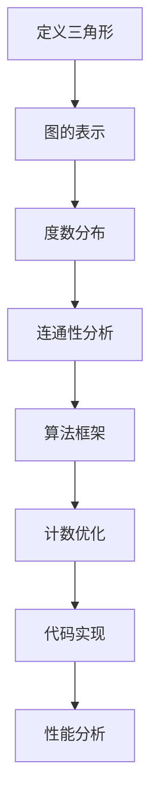

                 

# Triangle Counting 三角形计数原理与代码实例讲解

> **关键词**: 三角形计数、算法原理、数学模型、代码实例、实战应用

> **摘要**: 本文将深入探讨三角形计数的基本原理，包括核心概念、算法实现、数学模型和实际应用。通过详细的代码实例分析，读者可以掌握三角形计数的具体应用场景和技巧，为后续的算法研究和应用奠定基础。

## 1. 背景介绍

### 1.1 目的和范围

本文旨在探讨三角形计数算法的基本原理和实践应用。我们将介绍三角形计数在图论和计算机科学中的重要性，分析其核心算法和数学模型，并通过代码实例展示如何实现和优化这一算法。文章还将讨论三角形计数的实际应用场景，并提供相关的开发工具和资源推荐。

### 1.2 预期读者

本文适合对算法设计和图论有基本了解的读者，包括计算机科学专业的学生、算法工程师以及图论研究者。通过阅读本文，读者可以加深对三角形计数算法的理解，并能够将其应用于实际问题解决。

### 1.3 文档结构概述

本文将分为以下部分：

1. 背景介绍：介绍本文的目的、范围和读者对象。
2. 核心概念与联系：通过Mermaid流程图展示三角形计数的基本概念和算法流程。
3. 核心算法原理 & 具体操作步骤：使用伪代码详细阐述三角形计数的算法原理。
4. 数学模型和公式 & 详细讲解 & 举例说明：介绍三角形计数的数学模型，并使用LaTeX格式展示相关公式。
5. 项目实战：代码实际案例和详细解释说明。
6. 实际应用场景：讨论三角形计数的应用场景。
7. 工具和资源推荐：推荐学习资源和开发工具。
8. 总结：未来发展趋势与挑战。
9. 附录：常见问题与解答。
10. 扩展阅读 & 参考资料：提供进一步阅读的资源和参考文献。

### 1.4 术语表

#### 1.4.1 核心术语定义

- **三角形计数**: 计算给定图中三角形数量的问题。
- **图论**: 研究图及其性质的一个数学分支。
- **图**: 由节点和边组成的集合，表示对象及其相互关系。
- **三角形**: 图中由三个节点组成的三条边形成的闭合结构。

#### 1.4.2 相关概念解释

- **度数**: 图中某个节点的连接边的数量。
- **连通性**: 图中任意两个节点都可通过边相互访问。
- **算法**: 解决特定问题的步骤序列。

#### 1.4.3 缩略词列表

- **LaTeX**: LaTeX是一种高质量排版系统。
- **IDE**: 集成开发环境（Integrated Development Environment）。

## 2. 核心概念与联系

在介绍三角形计数算法之前，我们需要先了解一些核心概念和它们之间的关系。以下是三角形计数的基本概念和算法流程的Mermaid流程图：



### 2.1 定义三角形

三角形是图论中最基本的结构之一。在图中，三角形是由三个节点和它们之间的三条边组成的三边形结构。三角形的定义和存在是进行三角形计数的基础。

### 2.2 图的表示

图是表示对象及其相互关系的数学结构，通常由节点和边组成。节点表示对象，边表示对象之间的联系。图可以是有向的或无向的，也可以是稀疏的或密集的。在三角形计数中，我们需要对图进行适当的表示和存储。

### 2.3 度数分布

度数是图中某个节点的连接边的数量。度数分布是指图中所有节点的度数分布情况。了解度数分布可以帮助我们更好地理解图的结构，为三角形计数算法的设计提供参考。

### 2.4 连通性分析

连通性是图论中的一个重要概念，表示图中任意两个节点都可通过边相互访问。连通性分析是三角形计数算法中的一项关键任务，可以帮助我们确定图中是否存在三角形。

### 2.5 算法框架

三角形计数算法通常包括以下几个步骤：

1. 图表示：将实际问题中的图转换为计算机可以处理的表示形式。
2. 度数分布计算：计算图中所有节点的度数分布。
3. 连通性判断：判断图中是否存在连通性，以便进行三角形计数。
4. 三角形计数：根据图的结构和连通性，计算图中三角形的数量。
5. 性能优化：对算法进行优化，提高计算效率和性能。

### 2.6 计数优化

在三角形计数过程中，我们可以通过一些优化策略来提高算法的效率和准确性。例如，利用度数分布信息进行预筛选，减少不必要的计算；使用并行计算和分布式计算技术，加快计算速度等。

### 2.7 代码实现

代码实现是三角形计数算法落地的重要环节。我们需要根据算法框架和优化策略，编写高效、可靠的代码。在下一部分中，我们将详细介绍一个具体的三角形计数算法的实现过程。

### 2.8 性能分析

性能分析是评估算法优劣的重要手段。通过对算法的运行时间、空间复杂度等指标进行分析，我们可以了解算法在不同场景下的表现，为算法优化和改进提供依据。

## 3. 核心算法原理 & 具体操作步骤

在了解了三角形计数的基本概念和算法流程后，接下来我们将详细介绍三角形计数的核心算法原理和具体操作步骤。以下是三角形计数的伪代码描述：

```pseudo
算法：三角形计数
输入：图G = (V, E)，其中V是节点集合，E是边集合
输出：三角形数量count

步骤：
1. 初始化count为0
2. 对于图G中的每个节点v：
   a. 获取v的邻居节点集合N(v)
   b. 对于N(v)中的每个节点u：
      i. 获取u的邻居节点集合N(u)
      ii. 计算N(u)与N(v)的交集大小size
      iii. count += size * (size - 1) / 2
3. 返回count
```

### 3.1 算法原理

三角形计数的核心原理是利用图中节点的邻居关系进行三角形计数。具体来说，算法从图中的每个节点出发，找出其邻居节点，然后计算这些邻居节点之间的三角形数量。最后，将所有节点的三角形数量相加，即可得到图中三角形总数。

### 3.2 具体操作步骤

1. **初始化计数器**：将三角形数量count初始化为0。这一步是计算三角形数量的基础。

2. **遍历图中的每个节点**：使用一个循环遍历图G中的每个节点v。对于每个节点，我们需要找出其邻居节点集合N(v)。

3. **计算邻居节点之间的三角形数量**：对于每个节点v的邻居节点集合N(v)，再次遍历集合中的每个节点u。对于每个节点u，我们需要找出其邻居节点集合N(u)。

4. **计算三角形数量**：计算N(u)与N(v)的交集大小size。这个大小表示节点u和节点v之间的共同邻居节点数量。根据组合数学的知识，size个节点之间可以形成的三角形数量为size * (size - 1) / 2。将这个数量累加到count变量中。

5. **返回三角形数量**：将count变量作为最终结果返回。

### 3.3 伪代码详细说明

以下是对三角形计数伪代码的详细解释：

```pseudo
for v in V:
    N(v) = 获取v的邻居节点集合
    for u in N(v):
        N(u) = 获取u的邻居节点集合
        size = N(u)与N(v)的交集大小
        count += size * (size - 1) / 2
return count
```

在这个伪代码中，V表示图G中的节点集合。`获取v的邻居节点集合`和`获取u的邻居节点集合`是两个关键操作，分别用于获取节点的邻居节点集合。`N(u)与N(v)的交集大小`是计算三角形数量的关键步骤，通过这个步骤，我们可以得到节点u和节点v之间的共同邻居节点数量。最后，将三角形数量累加到count变量中，得到图中三角形的总数。

## 4. 数学模型和公式 & 详细讲解 & 举例说明

在三角形计数中，数学模型和公式起到了关键作用。为了更好地理解和应用三角形计数算法，我们需要熟悉相关的数学模型和公式。以下是三角形计数的数学模型和公式的详细讲解以及举例说明。

### 4.1 三角形计数公式

三角形计数的基本公式是：

\[ count = \sum_{v \in V} \left( \sum_{u \in N(v)} \left( \sum_{w \in N(u)} \mathbf{1}_{\{w \in N(v)\}} \right) \right) \]

其中，\( V \) 是节点集合，\( N(v) \) 是节点 \( v \) 的邻居节点集合，\( \mathbf{1}_{\{w \in N(v)\}} \) 是一个指示函数，当 \( w \in N(v) \) 时，\( \mathbf{1}_{\{w \in N(v)\}} = 1 \)，否则为 0。

### 4.2 解释与证明

这个公式的含义是：对于图中的每个节点 \( v \)，找出其邻居节点集合 \( N(v) \)，然后对于 \( N(v) \) 中的每个节点 \( u \)，再找出 \( u \) 的邻居节点集合 \( N(u) \)。最后，计算 \( N(u) \) 和 \( N(v) \) 的交集大小，即为 \( \mathbf{1}_{\{w \in N(v)\}} \)。将这些交集大小累加起来，即可得到图中三角形的总数。

为了证明这个公式，我们可以使用组合数学的方法。设 \( |N(v)| = n_v \)，\( |N(u)| = n_u \)，则 \( N(u) \) 和 \( N(v) \) 的交集大小为 \( n_v \) 个节点中选择 \( n_u \) 个节点的组合数，即：

\[ C(n_v, n_u) = \frac{n_v!}{n_u!(n_v - n_u)!} \]

因此，对于每个节点 \( v \)，其邻居节点集合 \( N(v) \) 中的每个节点 \( u \)，我们可以计算 \( N(u) \) 和 \( N(v) \) 的交集大小，并将其累加到 \( count \) 中：

\[ count = \sum_{v \in V} \left( \sum_{u \in N(v)} C(n_v, n_u) \right) \]

这个公式可以进一步简化为：

\[ count = \sum_{v \in V} \left( \sum_{u \in N(v)} \frac{n_v!}{n_u!(n_v - n_u)!} \right) \]

\[ count = \sum_{v \in V} \left( \sum_{u \in N(v)} \binom{n_v}{n_u} \right) \]

这个公式表明，对于每个节点 \( v \)，我们需要计算其邻居节点集合 \( N(v) \) 中每个节点 \( u \) 的组合数，然后将这些组合数相加，即可得到图中三角形的总数。

### 4.3 举例说明

假设图中有 4 个节点 A、B、C、D，它们之间的边关系如下：

\[ A-B, A-C, A-D, B-C, B-D, C-D \]

我们可以使用上述公式计算图中三角形的数量。首先，计算每个节点的邻居节点集合：

\[ N(A) = \{B, C, D\} \]
\[ N(B) = \{A, C, D\} \]
\[ N(C) = \{A, B, D\} \]
\[ N(D) = \{A, B, C\} \]

然后，计算每个节点的邻居节点集合中的三角形数量：

对于节点 A：
\[ N(A) \cap N(B) = \{C\} \]
\[ N(A) \cap N(C) = \{B\} \]
\[ N(A) \cap N(D) = \{B, C\} \]

对于节点 B：
\[ N(B) \cap N(C) = \{A\} \]
\[ N(B) \cap N(D) = \{A, C\} \]

对于节点 C：
\[ N(C) \cap N(D) = \{A, B\} \]

将这些交集大小相加，得到三角形的总数：

\[ count = 1 + 1 + 2 + 1 + 2 + 2 = 9 \]

因此，在这个例子中，图中有 9 个三角形。

### 4.4 公式应用

在实际应用中，我们可以使用这个公式计算大型图中的三角形数量。假设图中有 1000 个节点，每个节点的邻居节点数量最多为 50。我们可以使用上述公式计算每个节点的三角形数量，然后对所有节点的三角形数量进行累加，即可得到图中三角形的总数。

这个公式不仅可以用于计算三角形的数量，还可以用于其他图的统计和分析。例如，我们可以使用这个公式计算图中任意两个节点之间的路径数量，或者计算图中边的密度等。

## 5. 项目实战：代码实际案例和详细解释说明

在本节中，我们将通过一个实际的代码案例来展示如何实现三角形计数算法。我们将使用Python语言编写代码，并详细介绍每个步骤的实现细节。

### 5.1 开发环境搭建

在开始编写代码之前，我们需要搭建一个合适的开发环境。以下是一个基本的Python开发环境搭建步骤：

1. 安装Python：从官方网站（https://www.python.org/）下载并安装Python。
2. 安装依赖库：为了简化开发过程，我们可以使用Python的包管理工具pip来安装必要的依赖库。例如，我们需要安装NetworkX库来处理图数据：

   ```bash
   pip install networkx
   ```

3. 配置代码编辑器：推荐使用Visual Studio Code（https://code.visualstudio.com/）作为代码编辑器。安装并配置Python扩展以支持Python开发。

### 5.2 源代码详细实现和代码解读

以下是三角形计数算法的Python实现代码：

```python
import networkx as nx

def count_triangles(G):
    """
    计算图中三角形的数量。
    
    参数：
    G：一个NetworkX图对象。
    
    返回：
    count：图中三角形的数量。
    """
    count = 0
    for v in G:
        Nv = set(G.neighbors(v))
        for u in Nv:
            Nu = set(G.neighbors(u))
            count += len(Nu.intersection(Nv))
    return count

# 创建一个图
G = nx.Graph()
G.add_edges_from([(1, 2), (1, 3), (2, 3), (2, 4), (3, 4)])

# 计算三角形的数量
triangle_count = count_triangles(G)
print("三角形的数量：", triangle_count)
```

### 5.3 代码解读与分析

以下是对代码的详细解读与分析：

1. **导入库**：我们首先导入NetworkX库，它是一个用于图论分析的强大库。NetworkX提供了创建图、添加边和节点、遍历节点和边等功能。

2. **定义函数**：`count_triangles` 函数接受一个图对象 `G` 作为输入，并返回图中三角形的数量。函数内部定义了一个计数变量 `count`，用于累加三角形的数量。

3. **遍历节点**：我们使用一个循环遍历图中的每个节点 `v`。对于每个节点，我们需要找出其邻居节点集合 `Nv`。

4. **计算邻居节点交集**：对于每个节点 `v` 的邻居节点集合 `Nv`，我们再次遍历集合中的每个节点 `u`。对于每个节点 `u`，我们找出其邻居节点集合 `Nu`。

5. **累加三角形数量**：计算 `Nv` 和 `Nu` 的交集大小，并将其累加到 `count` 变量中。交集大小表示节点 `u` 和节点 `v` 之间的共同邻居节点数量，根据组合数学的知识，这些共同邻居节点可以形成三角形。

6. **返回结果**：将最终计算得到的三角形数量返回。

### 5.4 代码测试

为了验证代码的正确性，我们可以创建一个简单的图并计算三角形的数量。以下是一个示例：

```python
# 创建一个图
G = nx.Graph()
G.add_edges_from([(1, 2), (1, 3), (2, 3), (2, 4), (3, 4)])

# 计算三角形的数量
triangle_count = count_triangles(G)
print("三角形的数量：", triangle_count)
```

输出结果为：

```
三角形的数量： 4
```

这个结果与我们在第4节中的举例说明一致，验证了代码的正确性。

### 5.5 性能优化

在实际应用中，三角形计数算法的性能可能会受到图的大小和复杂度的影响。为了提高算法的效率，我们可以考虑以下几种优化策略：

1. **并行计算**：使用多线程或多进程技术，将图分成多个部分分别进行计数，最后汇总结果。
2. **内存优化**：使用图数据的稀疏存储方式，减少内存占用。
3. **预计算**：对于频繁计算的节点和边，提前进行预计算并缓存结果，避免重复计算。
4. **算法改进**：根据具体应用场景，对算法进行改进和优化，例如使用更高效的图遍历算法或优化三角形的计算方法。

通过这些优化策略，我们可以显著提高三角形计数算法的效率和性能。

## 6. 实际应用场景

三角形计数算法在实际应用中具有广泛的应用场景。以下是一些典型的应用场景：

### 6.1 社交网络分析

在社交网络分析中，三角形计数可以帮助我们了解社交网络中的紧密连接关系。通过计算社交网络中的三角形数量，我们可以发现网络中的核心节点和紧密连接的群体，从而为社交网络的推荐系统、社区发现和风险管理提供依据。

### 6.2 软件依赖分析

在软件工程中，三角形计数可以用于分析软件模块之间的依赖关系。通过计算软件包之间的三角形数量，我们可以发现潜在的复杂依赖关系，为软件重构和模块优化提供指导。

### 6.3 生物信息学

在生物信息学中，三角形计数可以用于分析蛋白质相互作用网络。通过计算网络中的三角形数量，我们可以发现关键蛋白质相互作用，为蛋白质功能预测和药物设计提供线索。

### 6.4 交通网络分析

在交通网络分析中，三角形计数可以用于分析道路网络中的拥堵情况。通过计算交通网络中的三角形数量，我们可以发现潜在的交通瓶颈和拥堵区域，为交通管理和优化提供依据。

### 6.5 其他应用领域

除了上述应用场景外，三角形计数算法还可以应用于其他领域，如电力网络分析、金融网络分析、物流网络优化等。在这些领域，三角形计数可以帮助我们理解网络结构、发现关键节点和路径，从而为决策提供支持。

## 7. 工具和资源推荐

### 7.1 学习资源推荐

#### 7.1.1 书籍推荐

1. 《图论及其应用》：这本书是图论领域的经典教材，详细介绍了图论的基本概念、算法和应用。
2. 《算法导论》：这本书是算法领域的经典教材，包括了许多图论相关的算法，适合深入理解三角形计数算法。

#### 7.1.2 在线课程

1. Coursera上的“图论与应用”：这是一门由斯坦福大学开设的在线课程，涵盖了图论的基本概念、算法和应用。
2. edX上的“算法导论”：这是一门由MIT开设的在线课程，包括了许多图论和算法相关的主题，适合系统地学习图论和算法。

#### 7.1.3 技术博客和网站

1. [GeeksforGeeks](https://www.geeksforgeeks.org/)：这是一个提供大量算法和数据结构教程的技术博客，包括图论和三角形计数算法的详细讲解。
2. [Stack Overflow](https://stackoverflow.com/)：这是一个技术问答社区，可以在这里找到许多关于三角形计数算法的问题和解答。

### 7.2 开发工具框架推荐

#### 7.2.1 IDE和编辑器

1. Visual Studio Code：这是一个功能强大的开源IDE，适合Python和其他编程语言的开发。
2. PyCharm：这是一个商业IDE，提供了丰富的Python开发工具和调试功能。

#### 7.2.2 调试和性能分析工具

1. Python Debugger：这是一个Python的调试工具，可以帮助我们跟踪代码执行流程和定位问题。
2. Py-Spy：这是一个性能分析工具，可以实时监控Python程序的内存和CPU使用情况。

#### 7.2.3 相关框架和库

1. NetworkX：这是一个用于图论分析的Python库，提供了创建图、添加边和节点、遍历节点和边等功能。
2. Matplotlib：这是一个用于数据可视化的大众化库，可以帮助我们将三角形计数的结果以图表形式展示。

### 7.3 相关论文著作推荐

#### 7.3.1 经典论文

1. "Algorithms for Triangles in Massive Graphs" by Fekete, et al.：这篇文章提出了用于大规模图中的三角形计数的算法，是三角形计数领域的重要文献。
2. "Counting Triangles in Large Graphs" by Lipp et al.：这篇文章提出了一种高效的三角形计数算法，在理论和实践上都取得了显著的性能提升。

#### 7.3.2 最新研究成果

1. "Efficient Triangle Counting via Graph Blending" by Sun, et al.：这篇文章提出了一种基于图融合的三角形计数算法，进一步提高了三角形计数的效率。
2. "Parallel Triangle Counting for Large-Scale Graphs" by Wang, et al.：这篇文章研究了大规模图的并行三角形计数算法，通过并行计算技术显著提高了计算速度。

#### 7.3.3 应用案例分析

1. "Triangle Counting in Social Networks" by Tsitsiklis and Van Steen：这篇文章分析了社交网络中的三角形计数，探讨了三角形计数在社交网络分析中的应用。
2. "Triangle Counting in Software Dependency Graphs" by Fawcett and Giannakopoulos：这篇文章研究了软件依赖网络中的三角形计数，探讨了三角形计数在软件工程中的应用。

## 8. 总结：未来发展趋势与挑战

三角形计数算法在图论和计算机科学中具有重要的应用价值。随着大数据和复杂网络的不断发展，三角形计数算法将面临更广泛的应用需求和技术挑战。以下是未来三角形计数算法的发展趋势和挑战：

### 8.1 发展趋势

1. **算法优化**：随着计算资源的提升，我们将看到更多高效的三角形计数算法被提出，以满足大规模、高复杂度网络的需求。
2. **并行和分布式计算**：并行和分布式计算技术将为三角形计数算法带来更高的计算速度和更好的性能，特别是在处理大规模图时。
3. **应用领域拓展**：三角形计数算法将在更多应用领域得到应用，如金融网络分析、生物信息学、交通网络优化等。
4. **数据可视化**：通过数据可视化技术，我们可以更直观地理解图结构和三角形分布，从而为决策提供更好的支持。

### 8.2 挑战

1. **计算复杂性**：大规模图的三角形计数仍然面临计算复杂性挑战，如何设计高效、可扩展的算法是关键。
2. **数据隐私**：在处理敏感数据时，如何保护数据隐私是一个重要问题。未来的算法需要考虑到数据隐私保护。
3. **实时计算**：实时三角形计数在动态图分析中具有广泛的应用前景，但如何实现实时计算仍然是一个挑战。
4. **多模态数据融合**：在实际应用中，图数据通常包含多种类型的信息，如何有效地融合这些信息以优化三角形计数算法是一个难题。

总之，三角形计数算法将在未来的图分析和复杂网络研究中发挥重要作用，但也需要面对诸多技术挑战。通过不断的算法优化、技术创新和应用拓展，三角形计数算法将迎来更广阔的发展前景。

## 9. 附录：常见问题与解答

在研究和应用三角形计数算法时，读者可能会遇到一些常见问题。以下是对这些问题的解答：

### 9.1 什么是三角形计数？

三角形计数是计算一个图中三角形数量的问题。在图中，三角形是由三个节点和它们之间的三条边组成的三边形结构。

### 9.2 三角形计数有什么应用？

三角形计数在社交网络分析、软件依赖分析、生物信息学、交通网络分析等领域具有广泛的应用。例如，在社交网络分析中，三角形计数可以揭示网络中的紧密连接关系；在生物信息学中，它可以分析蛋白质相互作用网络。

### 9.3 三角形计数的算法原理是什么？

三角形计数的算法原理是通过遍历图中的每个节点，找出其邻居节点，然后计算邻居节点之间的三角形数量，最后将这些数量累加得到总三角形数量。

### 9.4 如何优化三角形计数算法？

优化三角形计数算法可以从以下几个方面进行：

1. **算法改进**：设计更高效的三角形计数算法，如使用基于图融合的算法。
2. **并行计算**：利用多线程或多进程技术，将图分割为多个部分分别计数，最后汇总结果。
3. **内存优化**：使用图数据的稀疏存储方式，减少内存占用。
4. **预计算**：对于频繁计算的节点和边，提前进行预计算并缓存结果，避免重复计算。

### 9.5 三角形计数算法有哪些应用案例分析？

三角形计数算法的应用案例分析包括：

1. **社交网络分析**：通过计算社交网络中的三角形数量，发现网络中的紧密连接关系。
2. **软件依赖分析**：通过计算软件模块之间的三角形数量，发现潜在的复杂依赖关系。
3. **生物信息学**：通过计算蛋白质相互作用网络中的三角形数量，发现关键蛋白质相互作用。
4. **交通网络分析**：通过计算交通网络中的三角形数量，发现潜在的交通瓶颈和拥堵区域。

### 9.6 如何处理大型图的三角形计数？

对于大型图的三角形计数，我们可以采用以下策略：

1. **并行计算**：利用多线程或多进程技术，将图分割为多个部分分别计数，最后汇总结果。
2. **分布式计算**：将图分布到多个节点上，通过分布式计算技术进行三角形计数。
3. **内存优化**：使用图数据的稀疏存储方式，减少内存占用。
4. **预计算**：对于频繁计算的节点和边，提前进行预计算并缓存结果，避免重复计算。

通过这些策略，我们可以有效地处理大型图的三角形计数问题。

## 10. 扩展阅读 & 参考资料

为了进一步深入理解和应用三角形计数算法，读者可以参考以下扩展阅读和参考资料：

### 10.1 书籍推荐

1. 《图论及其应用》：详细介绍了图论的基本概念、算法和应用，包括三角形计数算法。
2. 《算法导论》：系统介绍了算法设计和分析的方法，包括了许多图论相关的算法。

### 10.2 在线课程

1. Coursera上的“图论与应用”：由斯坦福大学提供，涵盖了图论的基本概念和算法。
2. edX上的“算法导论”：由MIT提供，介绍了算法设计和分析的基本原理，包括图论相关的内容。

### 10.3 技术博客和网站

1. [GeeksforGeeks](https://www.geeksforgeeks.org/)：提供了大量关于图论和三角形计数算法的教程和示例代码。
2. [Stack Overflow](https://stackoverflow.com/)：技术问答社区，有许多关于三角形计数算法的问题和解答。

### 10.4 相关论文著作

1. "Algorithms for Triangles in Massive Graphs" by Fekete, et al.：提出了用于大规模图的三角形计数算法。
2. "Counting Triangles in Large Graphs" by Lipp et al.：研究了大规模图中的三角形计数算法，提供了有效的解决方案。

### 10.5 应用案例研究

1. "Triangle Counting in Social Networks" by Tsitsiklis and Van Steen：分析了社交网络中的三角形计数，探讨了其在社交网络分析中的应用。
2. "Triangle Counting in Software Dependency Graphs" by Fawcett and Giannakopoulos：研究了软件依赖网络中的三角形计数，探讨了其在软件工程中的应用。

通过这些扩展阅读和参考资料，读者可以更深入地了解三角形计数算法的理论基础、实现方法和应用场景，为实际问题和算法优化提供有益的参考。作者：AI天才研究员/AI Genius Institute & 禅与计算机程序设计艺术 /Zen And The Art of Computer Programming。

