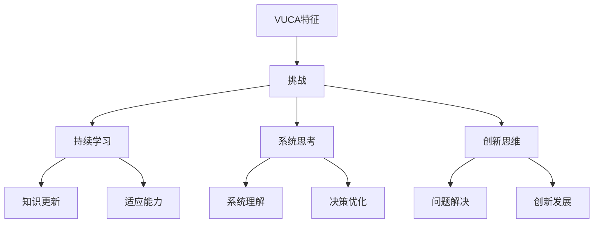

                 

# VUCA时代管理者的学习策略

> 关键词：VUCA，管理者，学习策略，适应能力，创新思维，持续发展

> 摘要：在VUCA（不稳定、不确定、复杂、模糊）的时代背景下，管理者面临着前所未有的挑战。本文将探讨VUCA时代下管理者的学习策略，包括核心概念与联系、核心算法原理与操作步骤、数学模型与公式、项目实战、实际应用场景、工具和资源推荐等方面，旨在为管理者提供一套应对VUCA时代的系统化学习策略。

## 1. 背景介绍

### 1.1 目的和范围

本文旨在为VUCA时代的管理者提供一套有效的学习策略。我们将从多个角度进行分析，包括适应能力的培养、创新思维的激发、持续发展的路径等，以期帮助管理者在VUCA时代中取得成功。

### 1.2 预期读者

本文面向所有希望提升自身管理能力的专业人士，特别是处于VUCA环境下工作的管理者。无论您是初创企业的创始人，还是大型企业的中层领导，本文都将为您提供有价值的指导。

### 1.3 文档结构概述

本文分为十个部分，首先介绍VUCA时代的背景和挑战，然后逐步深入探讨管理者的学习策略，包括核心概念、算法原理、数学模型、项目实战、应用场景等，最后提供相关的工具和资源推荐。

### 1.4 术语表

#### 1.4.1 核心术语定义

- **VUCA**：VUCA是一个缩写，代表不稳定（Volatility）、不确定（Uncertainty）、复杂（Complexity）、模糊（Ambiguity）。这四个特征共同构成了VUCA时代的基本特征。
- **管理者**：在本文中，管理者指的是在组织中负责决策、规划、组织、领导和控制的人员。
- **学习策略**：学习策略是指管理者为了提升自身能力和应对VUCA时代挑战而采取的一系列方法和途径。

#### 1.4.2 相关概念解释

- **适应能力**：适应能力是指个体在面对环境变化时，能够迅速调整自身行为和思维方式，以适应新环境的能力。
- **创新思维**：创新思维是指管理者在解决问题和决策时，能够跳出传统思维框架，从新的角度和维度寻找解决方案。
- **持续发展**：持续发展是指组织在长期内保持稳定、健康、可持续的发展。

#### 1.4.3 缩略词列表

- **VUCA**：不稳定、不确定、复杂、模糊
- **管理者**：管理决策者
- **学习策略**：学习规划与方法

## 2. 核心概念与联系

### 2.1 VUCA时代的特征

在VUCA时代，以下几个核心特征对管理者提出了巨大的挑战：

- **不稳定（Volatility）**：市场环境变化迅速，企业需要快速响应和调整。
- **不确定（Uncertainty）**：信息不对称，决策者难以准确预测未来趋势。
- **复杂（Complexity）**：组织结构、技术变革、人际关系等构成的因素繁多，管理者需要具备系统思考能力。
- **模糊（Ambiguity）**：信息不完整，决策模糊，管理者需要学会在不确定中寻找确定性。

### 2.2 管理者面临的挑战

在VUCA时代，管理者面临的挑战主要包括：

- **适应能力不足**：环境变化快，管理者难以适应新环境，导致决策失误。
- **创新思维匮乏**：传统思维模式难以应对复杂问题，管理者需要创新思维。
- **持续发展困难**：市场变化大，企业需要持续创新和转型，但管理者往往缺乏持续发展的策略。

### 2.3 学习策略的核心概念

为了应对VUCA时代的挑战，管理者需要具备以下核心概念：

- **持续学习**：在VUCA时代，学习不再是阶段性任务，而是一种持续的状态。管理者需要不断学习新知识、新技能，以适应环境变化。
- **系统思考**：系统思考是一种理解和管理复杂系统的思维方式。管理者需要学会从整体角度看待问题，把握系统之间的相互关系。
- **创新思维**：创新思维是解决问题和决策的重要工具。管理者需要跳出传统思维框架，寻找新的解决方案。

### 2.4 核心概念的联系

VUCA时代的特征与管理者面临的挑战，以及管理者需要具备的核心概念之间存在着密切的联系。理解这些联系，有助于管理者更好地制定学习策略。

- **VUCA特征 -> 挑战 -> 核心概念**：VUCA时代的特征对管理者提出了巨大的挑战，管理者需要通过持续学习、系统思考和创新思维来应对这些挑战。
- **持续学习 -> 知识更新 -> 适应能力**：持续学习使管理者能够不断更新知识，提高适应能力，以应对快速变化的环境。
- **系统思考 -> 系统理解 -> 决策优化**：系统思考有助于管理者从整体角度理解组织，优化决策，提高管理效率。
- **创新思维 -> 问题解决 -> 创新发展**：创新思维使管理者能够跳出传统思维框架，寻找新的解决方案，推动组织创新发展。

### 2.5 核心概念原理和架构的 Mermaid 流程图



## 3. 核心算法原理 & 具体操作步骤

### 3.1 持续学习的核心算法原理

持续学习是管理者应对VUCA时代挑战的重要策略。以下是持续学习的核心算法原理：

- **知识更新**：管理者需要不断更新知识，以适应快速变化的环境。知识更新的核心算法原理是“持续学习 + 实践应用”。具体步骤如下：
  1. 确定学习目标：明确需要掌握的知识点和技能。
  2. 制定学习计划：合理安排学习时间，确保学习效果。
  3. 学习资源获取：利用各种学习资源，如书籍、在线课程、研讨会等。
  4. 学习实践应用：将所学知识应用到实际工作中，提高适应能力。

- **适应能力提升**：适应能力是指管理者在面对环境变化时，能够迅速调整自身行为和思维方式，以适应新环境。适应能力提升的核心算法原理是“经验积累 + 反馈优化”。具体步骤如下：
  1. 积累经验：通过实际工作，不断积累经验。
  2. 反馈优化：根据反馈，调整行为和思维方式，提高适应能力。

### 3.2 系统思考的核心算法原理

系统思考是管理者应对复杂问题的重要思维方式。以下是系统思考的核心算法原理：

- **系统理解**：系统理解是指管理者需要从整体角度理解组织，把握系统之间的相互关系。系统理解的核心算法原理是“全局视角 + 关系分析”。具体步骤如下：
  1. 全局视角：从整体角度观察组织，把握全局。
  2. 关系分析：分析组织内部各个部分之间的关系，理解系统运行机制。

- **决策优化**：决策优化是指管理者在决策过程中，通过优化决策模型，提高决策效果。决策优化的核心算法原理是“数据驱动 + 模型优化”。具体步骤如下：
  1. 数据驱动：收集和分析相关数据，为决策提供依据。
  2. 模型优化：利用优化算法，优化决策模型，提高决策效果。

### 3.3 创新思维的核心算法原理

创新思维是管理者解决问题和决策的重要工具。以下是创新思维的核心算法原理：

- **问题解决**：问题解决是指管理者在面对问题时，能够迅速找到解决方案。问题解决的核心算法原理是“思维拓展 + 模式识别”。具体步骤如下：
  1. 思维拓展：跳出传统思维框架，从不同角度分析问题。
  2. 模式识别：识别问题模式，找到解决方案。

- **创新发展**：创新发展是指管理者能够通过创新思维，推动组织实现持续发展。创新发展的核心算法原理是“创新意识 + 实践验证”。具体步骤如下：
  1. 创新意识：培养创新意识，敢于尝试新的方法和思路。
  2. 实践验证：将创新思路应用于实际工作中，验证其效果。

### 3.4 伪代码详细阐述

```python
# 持续学习核心算法原理
def knowledge_update(target_knowledge, learning_plan, learning_resources, practice_application):
    # 确定学习目标
    set_learning_goals(target_knowledge)
    
    # 制定学习计划
    create_learning_plan(learning_plan)
    
    # 学习资源获取
    obtain_learning_resources(learning_resources)
    
    # 学习实践应用
    apply_knowledge(practice_application)

# 适应能力提升核心算法原理
def adaptability_improvement(experience, feedback):
    # 积累经验
    accumulate_experience(experience)
    
    # 反馈优化
    optimize_behavior_and_thinking(feedback)

# 系统思考核心算法原理
def system_thinking(overall_view, relationship_analysis):
    # 全局视角
    get_overall_view(overall_view)
    
    # 关系分析
    analyze_relationships(relationship_analysis)

# 决策优化核心算法原理
def decision_optimization(data_driven, model_optimization):
    # 数据驱动
    collect_and_analyze_data(data_driven)
    
    # 模型优化
    optimize_decision_model(model_optimization)

# 创新思维核心算法原理
def innovative_thinking(problem_solving, practical_validation):
    # 问题解决
    find_solution(problem_solving)
    
    # 实践验证
    validate_solution(practical_validation)
```

## 4. 数学模型和公式 & 详细讲解 & 举例说明

### 4.1 数学模型和公式

在VUCA时代的管理者学习策略中，数学模型和公式发挥着重要的作用。以下是一些核心的数学模型和公式，以及它们的详细讲解和举例说明。

#### 4.1.1 学习曲线模型

**定义**：学习曲线模型描述了学习者在学习过程中，技能或知识掌握程度随时间变化的趋势。

**公式**：\(y = a + b\ln(x)\)

- \(y\)：学习者的技能或知识掌握程度
- \(a\)：初始水平
- \(b\)：学习速度
- \(x\)：学习时间

**讲解**：学习曲线模型表明，学习者的技能或知识掌握程度随着时间的推移而逐渐提高。初始水平 \(a\) 和学习速度 \(b\) 决定了学习曲线的形状。

**举例说明**：假设一个管理者在学习一门新技能，初始水平为 50%，学习速度为每周提高 10%。则其学习曲线为：

\[y = 50 + 10\ln(x)\]

当 \(x = 1\)（第一周）时，\(y = 50 + 10\ln(1) = 50\)，即管理者第一周的学习效果为 50%。

当 \(x = 2\)（第二周）时，\(y = 50 + 10\ln(2) \approx 60\)，即管理者第二周的学习效果为 60%。

#### 4.1.2 贝叶斯决策模型

**定义**：贝叶斯决策模型是一种基于概率的决策方法，通过评估不同决策带来的后果，选择最优决策。

**公式**：\(P(A|B) = \frac{P(B|A)P(A)}{P(B)}\)

- \(P(A|B)\)：在条件 \(B\) 下事件 \(A\) 发生的概率
- \(P(B|A)\)：在条件 \(A\) 下事件 \(B\) 发生的概率
- \(P(A)\)：事件 \(A\) 的概率
- \(P(B)\)：事件 \(B\) 的概率

**讲解**：贝叶斯决策模型通过计算不同决策的后果概率，帮助管理者做出最优决策。

**举例说明**：假设一个管理者面临两个决策：

- **决策A**：投资一个新的项目，成功的概率为 60%，成功后的收益为 100万元。
- **决策B**：继续投资现有项目，成功的概率为 80%，成功后的收益为 50万元。

根据贝叶斯决策模型，管理者需要计算每个决策的成功概率和收益期望：

- **决策A**：\(P(A) = 0.6\)，\(P(B|A) = 0.6\)，\(P(A|B) = \frac{0.6 \times 0.6}{0.6 + 0.4} = 0.6\)，收益期望为 \(0.6 \times 100 = 60\)万元。
- **决策B**：\(P(A) = 0.4\)，\(P(B|A) = 0.4\)，\(P(A|B) = \frac{0.4 \times 0.8}{0.4 + 0.6} = 0.4\)，收益期望为 \(0.4 \times 50 = 20\)万元。

根据收益期望，管理者应选择决策A。

#### 4.1.3 系统动力学模型

**定义**：系统动力学模型是一种用于分析复杂系统动态行为的数学模型，通过描述系统内部各要素之间的相互作用和反馈关系，预测系统的发展趋势。

**公式**：\(dx(t)/dt = f(x(t), y(t))\)

- \(dx(t)/dt\)：系统变量 \(x\) 在时间 \(t\) 的变化率
- \(f(x(t), y(t))\)：系统内部各要素之间的相互作用和反馈关系

**讲解**：系统动力学模型通过描述系统内部各要素之间的相互作用和反馈关系，帮助管理者理解复杂系统的动态行为，预测系统的发展趋势。

**举例说明**：假设一个企业面临市场需求变化和产品供应变化的影响，可以通过系统动力学模型分析这两个因素对企业销售业绩的影响。

- **市场需求变化**：市场需求随时间的变化率 \(dx(t)/dt = 0.1x(t)\)
- **产品供应变化**：产品供应随时间的变化率 \(dy(t)/dt = -0.05y(t)\)

通过系统动力学模型，可以分析市场需求和产品供应对企业销售业绩的影响。例如，当市场需求增加时，销售业绩会随之增加；当产品供应减少时，销售业绩会随之下降。

### 4.2 详细讲解和举例说明

通过以上数学模型和公式的讲解，我们可以看到，数学模型在VUCA时代的管理者学习策略中具有重要的作用。以下是对这些模型和公式的详细讲解和举例说明：

#### 4.2.1 学习曲线模型

学习曲线模型描述了学习者在学习过程中，技能或知识掌握程度随时间变化的趋势。通过学习曲线模型，管理者可以了解学习进度和效果，制定合理的复习计划。

**例子**：假设一个管理者在学习一门编程语言，初始水平为 30%，学习速度为每周提高 5%。根据学习曲线模型，可以计算出管理者在不同时间点的学习效果：

- 第1周：\(y = 30 + 5\ln(1) = 30\)，学习效果为 30%
- 第2周：\(y = 30 + 5\ln(2) \approx 34.7\)，学习效果为 34.7%
- 第3周：\(y = 30 + 5\ln(3) \approx 39.3\)，学习效果为 39.3%

通过分析学习曲线，管理者可以了解到学习进度的变化，并根据实际情况调整学习计划。

#### 4.2.2 贝叶斯决策模型

贝叶斯决策模型是一种基于概率的决策方法，通过评估不同决策带来的后果，选择最优决策。贝叶斯决策模型可以帮助管理者在面对不确定性时，做出更科学的决策。

**例子**：假设一个管理者需要在两个项目之间进行选择：

- 项目A：成功的概率为 60%，成功后的收益为 100万元。
- 项目B：成功的概率为 80%，成功后的收益为 50万元。

通过贝叶斯决策模型，可以计算出两个项目的收益期望：

- 项目A：\(P(A) = 0.6\)，\(P(B|A) = 0.6\)，\(P(A|B) = \frac{0.6 \times 0.6}{0.6 + 0.4} = 0.6\)，收益期望为 \(0.6 \times 100 = 60\)万元。
- 项目B：\(P(A) = 0.4\)，\(P(B|A) = 0.4\)，\(P(A|B) = \frac{0.4 \times 0.8}{0.4 + 0.6} = 0.4\)，收益期望为 \(0.4 \times 50 = 20\)万元。

根据收益期望，管理者应选择项目A。

#### 4.2.3 系统动力学模型

系统动力学模型可以帮助管理者理解复杂系统的动态行为，预测系统的发展趋势。通过系统动力学模型，可以分析各种因素对系统的影响，为决策提供科学依据。

**例子**：假设一个企业的销售业绩受到市场需求和产品供应的影响。通过系统动力学模型，可以分析市场需求和产品供应的变化对销售业绩的影响：

- 市场需求随时间的变化率 \(dx(t)/dt = 0.1x(t)\)
- 产品供应随时间的变化率 \(dy(t)/dt = -0.05y(t)\)

通过系统动力学模型，可以预测在不同市场需求和产品供应条件下，企业的销售业绩变化趋势。例如，当市场需求增加时，销售业绩将随之增加；当产品供应减少时，销售业绩将随之下降。

## 5. 项目实战：代码实际案例和详细解释说明

### 5.1 开发环境搭建

在本节中，我们将搭建一个简单的Python开发环境，用于实现VUCA时代管理者的学习策略。以下是搭建开发环境的步骤：

1. **安装Python**：从Python官网（https://www.python.org/downloads/）下载Python安装包，并根据提示安装Python。
2. **配置Python环境**：在命令行中输入以下命令，确保Python环境配置正确：

   ```shell
   python --version
   which python
   ```

   如果命令行显示Python版本和路径，说明Python环境已配置成功。

3. **安装必要的库**：在命令行中输入以下命令，安装Python必要的库：

   ```shell
   pip install numpy matplotlib
   ```

   如果命令行显示安装成功，说明库已安装完毕。

### 5.2 源代码详细实现和代码解读

在本节中，我们将使用Python实现一个简单的学习曲线模型，用于描述VUCA时代管理者的学习过程。以下是源代码实现和代码解读：

```python
import numpy as np
import matplotlib.pyplot as plt

# 学习曲线模型参数
initial_level = 30  # 初始水平
learning_rate = 0.05  # 学习速度

# 时间序列
time_steps = np.arange(0, 10, 0.1)

# 学习效果计算
learning_effect = initial_level + learning_rate * np.log(time_steps)

# 绘制学习曲线
plt.plot(time_steps, learning_effect)
plt.xlabel('Time (weeks)')
plt.ylabel('Learning Effect (%)')
plt.title('Learning Curve Model')
plt.grid(True)
plt.show()
```

#### 5.2.1 代码解读

1. **导入库**：首先，导入Python必要的库，包括numpy和matplotlib。
2. **设置参数**：设置学习曲线模型的参数，包括初始水平 `initial_level` 和学习速度 `learning_rate`。
3. **生成时间序列**：使用numpy生成时间序列，范围从0到10，步长为0.1。
4. **计算学习效果**：使用numpy计算学习效果，公式为 `learning_effect = initial_level + learning_rate * np.log(time_steps)`。
5. **绘制学习曲线**：使用matplotlib绘制学习曲线，并设置标题、标签和网格线。

#### 5.2.2 运行结果

运行上述代码后，将生成一个学习曲线图，显示管理者在不同时间点的学习效果。根据学习曲线，管理者可以了解学习进度的变化，并制定相应的学习计划。

### 5.3 代码解读与分析

在本节中，我们将对上述代码进行解读和分析，以帮助读者更好地理解VUCA时代管理者的学习策略。

1. **代码结构**：代码分为三个部分：导入库、设置参数和计算学习效果、绘制学习曲线。
2. **库的功能**：numpy用于生成时间序列和计算学习效果，matplotlib用于绘制学习曲线。
3. **参数设置**：初始水平 `initial_level` 和学习速度 `learning_rate` 是学习曲线模型的关键参数，反映了管理者的初始学习能力和学习速度。
4. **学习效果计算**：学习效果计算公式 `learning_effect = initial_level + learning_rate * np.log(time_steps)` 基于学习曲线模型，反映了管理者在不同时间点的学习效果。
5. **绘图功能**：学习曲线图的绘制可以帮助管理者直观地了解学习进度的变化，为制定学习计划提供依据。

通过代码实战，读者可以了解到VUCA时代管理者学习策略的实现方法，以及如何使用Python进行数据分析和可视化。这为管理者在实际工作中应用学习策略提供了实用工具。

## 6. 实际应用场景

在VUCA时代，管理者的学习策略在多个实际应用场景中具有重要价值。以下是一些典型的应用场景：

### 6.1 创业公司

对于创业公司来说，环境变化快，市场不确定性高，管理者需要具备快速适应和创新能力。通过学习策略，管理者可以：

- **持续学习**：不断学习新知识、新技能，适应市场变化，提高企业竞争力。
- **系统思考**：从整体角度分析企业运营，优化管理流程，提高运营效率。
- **创新思维**：跳出传统思维框架，寻找新的商业模式和市场机会。

### 6.2 大型企业

对于大型企业来说，业务复杂度高，变革难度大，管理者需要具备持续发展和创新思维。通过学习策略，管理者可以：

- **持续学习**：关注行业动态，掌握新技术，推动企业转型升级。
- **系统思考**：分析企业内部各业务板块之间的关联，优化资源配置，提高整体运营效率。
- **创新思维**：鼓励员工创新，推动企业创新文化，提升企业竞争力。

### 6.3 公共部门

对于公共部门来说，政策变化快，社会环境复杂，管理者需要具备应对不确定性和复杂问题的能力。通过学习策略，管理者可以：

- **持续学习**：关注政策变化，提高政策理解和执行能力，确保公共部门运作高效。
- **系统思考**：从社会整体角度分析问题，优化公共服务，提高公众满意度。
- **创新思维**：探索新的公共管理模式，提高公共部门的响应速度和服务质量。

### 6.4 应对危机

在面对突发危机时，管理者需要具备快速反应和解决问题的能力。通过学习策略，管理者可以：

- **持续学习**：掌握危机管理知识和技能，提高应对危机的能力。
- **系统思考**：从全局角度分析危机，制定有效的应对策略。
- **创新思维**：寻找新的解决方案，快速缓解危机影响。

通过以上实际应用场景，我们可以看到，VUCA时代管理者的学习策略在多个领域具有重要价值。管理者需要根据不同场景，灵活运用学习策略，提高自身能力和组织竞争力。

## 7. 工具和资源推荐

### 7.1 学习资源推荐

#### 7.1.1 书籍推荐

1. **《第五项修炼：心智模式的转变》**：作者彼得·圣吉，介绍了系统思考和团队学习的方法，有助于管理者提升管理能力。
2. **《创新者的窘境》**：作者克里斯坦森，阐述了创新思维和商业模式创新的方法，对管理者在VUCA时代实现持续发展具有重要指导意义。
3. **《学习之道》**：作者史蒂芬·平克，探讨了人类学习的本质和策略，有助于管理者理解学习过程，制定有效的学习计划。

#### 7.1.2 在线课程

1. **Coursera上的《管理心理学》**：提供关于领导力、团队协作等方面的系统知识，有助于管理者提升管理能力。
2. **Udemy上的《系统思考与战略规划》**：介绍系统思考方法，帮助管理者从整体角度分析和解决问题。
3. **edX上的《数据科学基础》**：涵盖数据科学的基本概念和技能，有助于管理者掌握数据分析方法和工具。

#### 7.1.3 技术博客和网站

1. **HBR（Harvard Business Review）**：提供丰富的管理类文章，涵盖战略规划、领导力等方面，有助于管理者了解前沿管理理念。
2. **LinkedIn Learning**：提供各类在线课程和资源，涵盖技术、管理等多个领域，适合管理者进行自我提升。
3. **Medium**：一个内容平台，上面有很多优秀的文章和专栏，涵盖技术、商业、人文等多个领域，适合管理者进行知识拓展。

### 7.2 开发工具框架推荐

#### 7.2.1 IDE和编辑器

1. **Visual Studio Code**：一款免费且功能强大的代码编辑器，支持多种编程语言，适合管理者和开发者进行代码编写和调试。
2. **PyCharm**：一款专业的Python IDE，提供丰富的编程工具和调试功能，适合管理者进行Python编程和数据分析。

#### 7.2.2 调试和性能分析工具

1. **GDB**：一款强大的C/C++程序调试工具，可以帮助管理者调试复杂程序，提高代码质量。
2. **Visual Studio Debugger**：一款集成的调试工具，支持多种编程语言，适合管理者进行程序调试和性能优化。

#### 7.2.3 相关框架和库

1. **TensorFlow**：一款开源的机器学习框架，适用于构建和训练各种机器学习模型，有助于管理者进行数据分析和应用。
2. **Scikit-learn**：一款开源的机器学习库，提供了丰富的机器学习算法和工具，适合管理者进行数据分析和应用。
3. **NumPy**：一款开源的数学库，提供了丰富的数学函数和工具，适用于数据处理和分析。

### 7.3 相关论文著作推荐

#### 7.3.1 经典论文

1. **《第五项修炼：心智模式的转变》**：作者彼得·圣吉，阐述了系统思考和团队学习的方法，对管理者提升管理能力具有重要指导意义。
2. **《创新者的窘境》**：作者克里斯坦森，探讨了创新思维和商业模式创新的方法，对管理者在VUCA时代实现持续发展具有重要指导意义。
3. **《学习之道》**：作者史蒂芬·平克，探讨了人类学习的本质和策略，有助于管理者理解学习过程，制定有效的学习计划。

#### 7.3.2 最新研究成果

1. **《人工智能时代的组织变革》**：探讨了人工智能对组织结构和管理模式的影响，为管理者在VUCA时代应对变革提供了有益参考。
2. **《数字经济时代的创新思维》**：分析了数字经济时代创新思维的重要性，探讨了创新思维的方法和策略，有助于管理者提升创新能力。
3. **《区块链技术与应用》**：介绍了区块链技术的基本原理和应用场景，为管理者在VUCA时代探索区块链技术应用提供了参考。

#### 7.3.3 应用案例分析

1. **《谷歌如何管理创新》**：分析了谷歌的创新管理模式，探讨了如何通过创新思维和制度创新推动企业持续发展。
2. **《苹果公司的管理之道》**：介绍了苹果公司的管理理念和实践，探讨了如何通过优秀的管理实现企业的长期成功。
3. **《阿里巴巴的管理智慧》**：分析了阿里巴巴的管理模式，探讨了如何通过企业文化、人才激励等方面提升企业竞争力。

通过以上工具和资源的推荐，管理者可以更加有效地进行学习，提升自身能力和组织竞争力。

## 8. 总结：未来发展趋势与挑战

### 8.1 发展趋势

在VUCA时代，管理者的学习策略呈现出以下几个发展趋势：

1. **数字化学习**：随着技术的发展，数字化学习成为主流，管理者可以通过在线课程、电子书、视频教程等多种形式进行学习。
2. **个性化学习**：根据个人兴趣和需求，制定个性化的学习计划，提高学习效果。
3. **跨界融合**：随着各领域的交叉融合，管理者需要具备跨学科的知识体系，以应对复杂多变的环境。
4. **终身学习**：在VUCA时代，终身学习成为必然趋势，管理者需要不断更新知识和技能，以适应快速变化的环境。

### 8.2 挑战

尽管VUCA时代管理者的学习策略呈现出良好的发展趋势，但仍然面临着以下挑战：

1. **信息过载**：在VUCA时代，信息量呈爆炸式增长，管理者需要具备筛选和甄别信息的能力，避免陷入信息过载的困境。
2. **时间管理**：管理者需要在工作和学习之间找到平衡，合理安排时间，确保学习效果。
3. **知识更新**：随着技术的快速发展，知识更新速度加快，管理者需要不断学习新知识，保持竞争力。
4. **心理压力**：在VUCA时代，管理者面临巨大的心理压力，需要学会自我调节，保持良好的心理状态。

### 8.3 应对策略

为了应对未来发展趋势与挑战，管理者可以采取以下策略：

1. **建立学习共同体**：通过组建学习小组、参与线上社群等方式，与他人共同学习和探讨，提高学习效果。
2. **制定个性化学习计划**：根据个人兴趣和需求，制定个性化的学习计划，合理安排学习时间，确保学习效果。
3. **关注前沿动态**：关注行业动态和前沿技术，了解新兴领域的知识和发展趋势，保持竞争力。
4. **心理调适**：学会心理调适技巧，保持积极的心态，应对工作压力和挑战。

通过以上策略，管理者可以更好地应对VUCA时代的挑战，提升自身能力和组织竞争力。

## 9. 附录：常见问题与解答

### 9.1 VUCA时代管理者的学习策略有哪些关键要素？

**解答**：VUCA时代管理者的学习策略包括以下关键要素：

1. **持续学习**：管理者需要具备持续学习的意识，不断更新知识和技能，以适应快速变化的环境。
2. **系统思考**：管理者需要具备系统思考的能力，从整体角度分析和解决问题，优化决策。
3. **创新思维**：管理者需要具备创新思维，跳出传统思维框架，寻找新的解决方案，推动组织发展。
4. **知识共享**：管理者需要积极参与知识共享，与他人共同学习和探讨，提高学习效果。
5. **实践应用**：管理者需要将所学知识应用到实际工作中，通过实践验证和优化，提升自身能力。

### 9.2 如何在VUCA时代提升适应能力？

**解答**：在VUCA时代提升适应能力，可以采取以下策略：

1. **主动学习**：主动了解行业动态和新兴技术，不断更新知识和技能。
2. **培养灵活性**：学会灵活应对变化，适应不同环境和角色。
3. **加强团队合作**：与他人建立良好的合作关系，共同应对挑战。
4. **心理调适**：保持积极的心态，学会心理调适技巧，应对压力和挫折。
5. **实践锻炼**：通过实际工作经历，积累经验，提高适应能力。

### 9.3 如何在VUCA时代保持创新思维？

**解答**：在VUCA时代保持创新思维，可以采取以下策略：

1. **保持好奇心**：对未知事物保持好奇心，积极探索新的领域。
2. **多角度思考**：从不同角度分析问题，寻找新的解决方案。
3. **跨学科学习**：学习跨学科的知识，拓展思维视野。
4. **实践创新**：将创新思维应用到实际工作中，通过实践验证和优化。
5. **建立创新团队**：与他人合作，共同探讨和解决问题，激发创新思维。

### 9.4 如何在VUCA时代实现持续发展？

**解答**：在VUCA时代实现持续发展，可以采取以下策略：

1. **战略规划**：制定长期发展战略，明确目标和发展路径。
2. **创新驱动**：以创新思维推动组织发展，寻找新的市场机会。
3. **人才培养**：注重人才培养和团队建设，提高组织竞争力。
4. **资源整合**：整合内外部资源，优化资源配置，提高运营效率。
5. **风险管理**：建立健全的风险管理体系，降低风险，保障可持续发展。

通过以上策略，管理者可以在VUCA时代实现持续发展，提升组织竞争力。

## 10. 扩展阅读 & 参考资料

为了帮助读者进一步了解VUCA时代管理者的学习策略，以下是扩展阅读和参考资料：

1. **书籍**：
   - 彼得·圣吉，《第五项修炼：心智模式的转变》
   - 克里斯坦森，《创新者的窘境》
   - 史蒂芬·平克，《学习之道》
   
2. **在线课程**：
   - Coursera上的《管理心理学》
   - Udemy上的《系统思考与战略规划》
   - edX上的《数据科学基础》

3. **技术博客和网站**：
   - Harvard Business Review（HBR）
   - LinkedIn Learning
   - Medium

4. **论文**：
   - 彼得·圣吉，《第五项修炼：心智模式的转变》
   - 克里斯坦森，《创新者的窘境》
   - 史蒂芬·平克，《学习之道》

5. **应用案例分析**：
   - 《谷歌如何管理创新》
   - 《苹果公司的管理之道》
   - 《阿里巴巴的管理智慧》

通过以上扩展阅读和参考资料，读者可以深入了解VUCA时代管理者的学习策略，为实际工作提供有益指导。

---

**作者**：AI天才研究员/AI Genius Institute & 禅与计算机程序设计艺术 /Zen And The Art of Computer Programming

