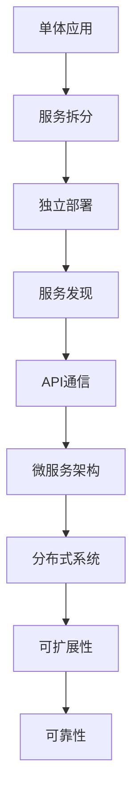

                 

# Web架构设计：从单体到微服务

> **关键词：**Web架构设计、单体应用、微服务架构、分布式系统、可扩展性、可靠性、开发与部署

> **摘要：**本文将深入探讨Web架构设计的发展历程，从传统的单体应用逐步演进到现代的微服务架构。我们将详细解析两者的优缺点，核心概念，以及如何进行架构设计。同时，通过实际案例和代码解析，展示微服务架构的实现和应用场景，并提供学习资源和工具推荐，为开发者提供全面的技术指导。

## 1. 背景介绍

### 1.1 目的和范围

本文旨在为开发者提供关于Web架构设计的全面指导。我们将从单体应用到微服务架构进行深入探讨，分析其优缺点，讲解核心概念，并通过实际案例展示其应用。本文适用于希望了解Web架构设计原则的开发者，特别是那些正在考虑向微服务架构迁移的开发团队。

### 1.2 预期读者

本文预期读者包括：
- 有多年开发经验，对单体应用有一定了解的开发者。
- 对分布式系统和微服务架构有基本了解，但希望深入了解其实际应用和设计原则的开发者。
- 需要为现有项目或新项目进行架构设计的软件架构师和项目经理。

### 1.3 文档结构概述

本文分为以下几个部分：
1. 背景介绍：介绍本文的目的、预期读者和文档结构。
2. 核心概念与联系：介绍Web架构设计中的核心概念，包括单体应用和微服务架构。
3. 核心算法原理 & 具体操作步骤：详细阐述微服务架构的核心算法原理和实现步骤。
4. 数学模型和公式 & 详细讲解 & 举例说明：介绍微服务架构中涉及的数学模型和公式，并举例说明。
5. 项目实战：通过实际案例和代码解析，展示微服务架构的实现和应用场景。
6. 实际应用场景：讨论微服务架构在不同领域的实际应用场景。
7. 工具和资源推荐：推荐学习资源和开发工具，帮助开发者更好地理解和应用微服务架构。
8. 总结：总结微服务架构的未来发展趋势和挑战。
9. 附录：提供常见问题与解答。
10. 扩展阅读 & 参考资料：推荐进一步阅读的材料。

### 1.4 术语表

#### 1.4.1 核心术语定义

- 单体应用（Monolithic Application）：一种传统的Web架构设计，所有的功能模块都紧密集成在一个单一的代码库中。
- 微服务架构（Microservices Architecture）：一种分布式系统设计方法，将应用程序拆分成多个独立的、可部署的、细粒度服务。
- 分布式系统（Distributed System）：由多个独立的计算机组成的系统，这些计算机通过网络进行通信，协同完成任务。
- 可扩展性（Scalability）：系统能够根据负载的增加自动扩展资源的能力。
- 可靠性（Reliability）：系统在面临各种故障和异常情况时，能够保持正常运行的能力。

#### 1.4.2 相关概念解释

- RESTful API：一种用于构建分布式系统的API设计风格，基于HTTP协议，遵循REST原则。
- 服务发现（Service Discovery）：一种机制，使服务消费者能够动态地发现和连接到服务提供者。
- 负载均衡（Load Balancing）：一种技术，将请求分配到多个服务实例，以提高系统的性能和可用性。

#### 1.4.3 缩略词列表

- API：Application Programming Interface
- HTTP：Hypertext Transfer Protocol
- REST：Representational State Transfer
- JSON：JavaScript Object Notation

## 2. 核心概念与联系

在探讨Web架构设计时，理解单体应用和微服务架构是至关重要的。以下是两者的核心概念和它们之间的联系。

### 2.1 单体应用

单体应用是一种传统的Web架构设计，其所有功能模块都紧密集成在一个单一的代码库中。这种架构的优点在于开发简单，易于维护，但缺点在于可扩展性差，系统一旦出现故障，整个系统都会受到影响。

### 2.2 微服务架构

微服务架构是一种分布式系统设计方法，将应用程序拆分成多个独立的、可部署的、细粒度服务。每个服务负责一个特定的业务功能，可以独立开发、测试和部署。这种架构的优点在于可扩展性强，易于维护，但缺点在于开发复杂度增加，系统通信开销较大。

### 2.3 核心概念与联系

单体应用和微服务架构之间的核心概念联系如下：

1. **服务拆分（Service Decomposition）**：将大而全的单体应用拆分成多个小而专的服务，每个服务负责一个特定的业务功能。
2. **独立部署（Independent Deployment）**：每个服务可以独立部署，可以单独升级、扩展或替换。
3. **服务发现（Service Discovery）**：服务消费者可以通过服务发现机制找到所需的服务，实现动态的服务连接。
4. **API通信（API Communication）**：服务之间通过API进行通信，遵循RESTful API设计原则。

### 2.4 Mermaid 流程图

下面是微服务架构的 Mermaid 流程图，展示核心概念和组件之间的联系：



通过以上流程图，我们可以清晰地看到单体应用到微服务架构的演变过程，以及各个核心概念之间的联系。

## 3. 核心算法原理 & 具体操作步骤

在理解了微服务架构的核心概念后，接下来我们将深入探讨其核心算法原理和具体操作步骤。以下是微服务架构的核心算法原理和实现步骤：

### 3.1 核心算法原理

1. **服务拆分（Service Decomposition）**：
   - **原则**：将大而全的单体应用拆分成多个小而专的服务，每个服务负责一个特定的业务功能。
   - **方法**：通过业务需求分析，将功能相似、耦合度低的模块拆分成独立的服务。

2. **独立部署（Independent Deployment）**：
   - **原则**：每个服务可以独立部署，可以单独升级、扩展或替换。
   - **方法**：使用容器技术（如Docker）将服务打包成独立的容器，实现服务的独立部署。

3. **服务发现（Service Discovery）**：
   - **原则**：服务消费者可以通过服务发现机制找到所需的服务，实现动态的服务连接。
   - **方法**：使用服务注册与发现工具（如Consul、Eureka）实现服务的注册和发现。

4. **API通信（API Communication）**：
   - **原则**：服务之间通过API进行通信，遵循RESTful API设计原则。
   - **方法**：使用HTTP/HTTPS协议进行服务之间的通信，遵循RESTful API设计风格。

### 3.2 具体操作步骤

以下是实现微服务架构的具体操作步骤：

1. **需求分析与模块划分**：
   - 分析业务需求，确定功能模块。
   - 根据功能相似、耦合度低的原则，将模块拆分成独立的服务。

2. **服务开发与部署**：
   - 使用容器技术（如Docker）开发、测试和部署每个服务。
   - 将服务打包成独立的容器，部署到容器编排平台（如Kubernetes）。

3. **服务注册与发现**：
   - 使用服务注册与发现工具（如Consul、Eureka）实现服务的注册和发现。
   - 服务启动时自动注册到服务注册中心，服务消费者通过服务注册中心查找所需服务。

4. **API设计与实现**：
   - 使用RESTful API设计风格设计服务之间的接口。
   - 实现API接口，确保服务之间能够正常通信。

5. **负载均衡与监控**：
   - 使用负载均衡器（如Nginx、HAProxy）实现服务之间的负载均衡。
   - 使用监控工具（如Prometheus、Grafana）监控服务性能和健康状态。

通过以上步骤，我们可以实现一个完整的微服务架构，提高系统的可扩展性、可靠性和可维护性。

### 3.3 伪代码示例

以下是一个简单的伪代码示例，展示微服务架构的实现步骤：

```python
# 需求分析与模块划分
def analyze_requirements():
    modules = ["用户管理", "订单管理", "商品管理"]
    services = split_modules(modules)
    return services

# 服务开发与部署
def develop_and_deploy(services):
    for service in services:
        container = build_container(service)
        deploy_to_kubernetes(container)

# 服务注册与发现
def register_and_discover(services):
    service_registry = ServiceRegistry()
    for service in services:
        service_registry.register(service)

# API设计与实现
def design_and_implement_api(services):
    for service in services:
        api = create_restful_api(service)
        implement_api(api)

# 负载均衡与监控
def load_balancing_and_monitoring(services):
    load_balancer = LoadBalancer()
    monitor = PrometheusMonitor()
    for service in services:
        load_balancer.add_service(service)
        monitor.add_service(service)

# 主函数
def main():
    services = analyze_requirements()
    develop_and_deploy(services)
    register_and_discover(services)
    design_and_implement_api(services)
    load_balancing_and_monitoring(services)

if __name__ == "__main__":
    main()
```

通过以上伪代码示例，我们可以清晰地看到微服务架构的核心算法原理和实现步骤。

## 4. 数学模型和公式 & 详细讲解 & 举例说明

在微服务架构中，数学模型和公式用于描述服务之间的通信、负载均衡、数据一致性等问题。以下是几个关键数学模型和公式的详细讲解及举例说明：

### 4.1 服务通信中的数学模型

1. **服务响应时间模型**：
   - **公式**：\( R(t) = \frac{1}{\lambda} + \frac{1}{\mu} \)
   - **解释**：\( R(t) \) 表示服务在时间 \( t \) 内的平均响应时间，\( \lambda \) 表示请求到达率，\( \mu \) 表示服务处理速率。
   - **举例**：假设一个服务的请求到达率是每秒10次，服务处理速率是每秒20次，则其平均响应时间为 \( \frac{1}{10} + \frac{1}{20} = 0.15 \) 秒。

2. **服务延迟模型**：
   - **公式**：\( D(t) = \frac{\lambda^2}{2\mu} + \frac{\lambda}{\mu} \)
   - **解释**：\( D(t) \) 表示服务在时间 \( t \) 内的平均延迟时间，\( \lambda \) 表示请求到达率，\( \mu \) 表示服务处理速率。
   - **举例**：假设一个服务的请求到达率是每秒10次，服务处理速率是每秒20次，则其平均延迟时间为 \( \frac{10^2}{2 \times 20} + \frac{10}{20} = 1.25 \) 秒。

### 4.2 负载均衡中的数学模型

1. **权重负载均衡模型**：
   - **公式**：\( P_i = \frac{w_i}{\sum_{j=1}^{n} w_j} \)
   - **解释**：\( P_i \) 表示服务 \( i \) 的权重占比，\( w_i \) 表示服务 \( i \) 的权重，\( n \) 表示服务总数。
   - **举例**：假设有3个服务，服务1的权重为2，服务2的权重为1，服务3的权重为3，则服务1的权重占比为 \( \frac{2}{2+1+3} = 0.4 \)。

2. **最小连接数负载均衡模型**：
   - **公式**：\( C_i = \sum_{j=1}^{n} c_{ij} \)
   - **解释**：\( C_i \) 表示服务 \( i \) 的当前连接数，\( c_{ij} \) 表示服务 \( i \) 与服务 \( j \) 之间的连接数。
   - **举例**：假设有3个服务，服务1与服务2的连接数为2，服务1与服务3的连接数为1，服务2与服务3的连接数为3，则服务1的当前连接数为 \( 2+1=3 \)。

### 4.3 数据一致性中的数学模型

1. **CAP定理**：
   - **公式**：\( \text{Consistency} + \text{Availability} \leq \text{Partition Tolerance} \)
   - **解释**：CAP定理指出，在一个分布式系统中，一致性（Consistency）、可用性（Availability）和分区容错性（Partition Tolerance）三者之间只能同时保证两个。
   - **举例**：在一个分布式数据库系统中，如果要求一致性高，则可能需要牺牲可用性，即在分区发生时，系统可能无法立即响应。

通过以上数学模型和公式，我们可以更好地理解和优化微服务架构中的通信、负载均衡和数据一致性。这些数学工具不仅有助于理论分析，还可以在实际开发中指导架构设计和性能调优。

## 5. 项目实战：代码实际案例和详细解释说明

在本节中，我们将通过一个实际的项目案例，展示微服务架构的实现和应用。我们将详细介绍项目的开发环境搭建、源代码实现和代码解读，帮助读者更好地理解微服务架构的实践。

### 5.1 开发环境搭建

为了实现微服务架构，我们需要搭建一个合适的环境。以下是所需的环境和工具：

- **操作系统**：Linux（推荐Ubuntu 18.04）
- **编程语言**：Java（推荐使用Spring Boot）
- **容器技术**：Docker
- **容器编排平台**：Kubernetes
- **服务注册与发现**：Consul
- **API网关**：Kong
- **监控工具**：Prometheus + Grafana

在开发环境搭建过程中，我们首先需要安装Docker和Kubernetes。以下是安装步骤：

1. **安装Docker**：

```bash
sudo apt-get update
sudo apt-get install docker-ce docker-ce-cli containerd.io
sudo systemctl start docker
sudo systemctl enable docker
```

2. **安装Kubernetes**：

```bash
# 安装Kubeadm、Kubelet和Kubectl
sudo apt-get update
sudo apt-get install -y apt-transport-https ca-certificates curl
# 添加Kubernetes官方GPG key
sudo curl -s https://mirrors.aliyun.com/kubernetes/apt/doc/apt-key.gpg | sudo apt-key add -
# 添加Kubernetes repository
cat <<EOF | sudo tee /etc/apt/sources.list.d/kubernetes.list
deb https://mirrors.aliyun.com/kubernetes/apt/ kubernetes-xenial main
EOF
# 安装Kubeadm、Kubelet和Kubectl
sudo apt-get update
sudo apt-get install -y kubelet kubeadm kubectl
# 启动kubelet并设置开机启动
sudo systemctl start kubelet
sudo systemctl enable kubelet
```

3. **安装Consul**：

```bash
# 安装Consul
wget https://releases.hashicorp.com/consul/1.10.5/consul_1.10.5_linux_amd64.tar.gz
tar xvfz consul_1.10.5_linux_amd64.tar.gz
sudo mv consul /usr/local/bin/
```

4. **安装Kong**：

```bash
# 安装Kong
docker run -d --name kong --network=host kong/kong
```

5. **安装Prometheus和Grafana**：

```bash
# 安装Prometheus
docker run -d --name=prometheus --network=host prom/prometheus

# 安装Grafana
docker run -d --name=grafana --network=host grafana/grafana
```

以上步骤完成开发环境的搭建，接下来我们将进入源代码实现和解读环节。

### 5.2 源代码详细实现和代码解读

在本项目中，我们将实现一个简单的电商平台，包括用户管理、订单管理和商品管理三个微服务。以下是源代码的详细实现和解读。

#### 5.2.1 用户管理服务（User Management Service）

1. **项目结构**：

```bash
user-management
├── user-management-api
│   ├── src
│   │   ├── main
│   │   │   ├── java
│   │   │   │   └── com
│   │   │   │       └── example
│   │   │   │           └── usermanagement
│   │   │   │               ├── User.java
│   │   │   │               ├── UserController.java
│   │   │   │               └── UserService.java
│   │   └── resources
│   │       └── application.properties
├── user-management-db
│   ├── src
│   │   ├── main
│   │   │   ├── java
│   │   │   │   └── com
│   │   │   │       └── example
│   │   │   │           └── usermanagement
│   │   │   │               ├── UserRepository.java
│   │   │   │               └── UserMapper.java
│   │   └── resources
│   │       └── application.properties
└── user-management-ui
    ├── src
    │   ├── main
    │   │   ├── java
    │   │   │   └── com
    │   │   │       └── example
    │   │   │           └── usermanagement
    │   │   │               ├── UserController.java
    │   │   │               └── UserService.java
    │   └── resources
    │       └── application.properties
```

2. **关键代码解读**：

- **User.java**：

```java
package com.example.usermanagement;

public class User {
    private String id;
    private String username;
    private String password;
    // 省略getter和setter方法
}
```

- **UserController.java**：

```java
package com.example.usermanagement;

import org.springframework.beans.factory.annotation.Autowired;
import org.springframework.http.ResponseEntity;
import org.springframework.web.bind.annotation.*;
import java.util.List;

@RestController
@RequestMapping("/users")
public class UserController {
    @Autowired
    private UserService userService;

    @GetMapping
    public List<User> getAllUsers() {
        return userService.findAll();
    }

    @GetMapping("/{id}")
    public ResponseEntity<User> getUserById(@PathVariable String id) {
        User user = userService.findById(id);
        if (user != null) {
            return ResponseEntity.ok(user);
        } else {
            return ResponseEntity.notFound().build();
        }
    }

    @PostMapping
    public ResponseEntity<User> createUser(@RequestBody User user) {
        User savedUser = userService.save(user);
        return ResponseEntity.status(201).body(savedUser);
    }

    @PutMapping("/{id}")
    public ResponseEntity<User> updateUser(@PathVariable String id, @RequestBody User user) {
        boolean isUpdated = userService.update(id, user);
        if (isUpdated) {
            return ResponseEntity.ok().build();
        } else {
            return ResponseEntity.notFound().build();
        }
    }

    @DeleteMapping("/{id}")
    public ResponseEntity<Void> deleteUser(@PathVariable String id) {
        boolean isDeleted = userService.delete(id);
        if (isDeleted) {
            return ResponseEntity.noContent().build();
        } else {
            return ResponseEntity.notFound().build();
        }
    }
}
```

- **UserService.java**：

```java
package com.example.usermanagement;

import java.util.List;

public interface UserService {
    List<User> findAll();
    User findById(String id);
    User save(User user);
    boolean update(String id, User user);
    boolean delete(String id);
}
```

3. **数据库配置**：

在 `user-management-db` 模块中，我们使用 MyBatis 进行数据库操作。以下是关键配置代码：

- **application.properties**：

```properties
# 数据源配置
spring.datasource.url=jdbc:mysql://localhost:3306/user_management?useUnicode=true&characterEncoding=utf8&useSSL=false
spring.datasource.username=root
spring.datasource.password=root

# MyBatis 配置
mybatis.mapper-locations=classpath:mapper/*.xml
mybatis.type-aliases-package=com.example.usermanagement
```

- **UserMapper.xml**：

```xml
<?xml version="1.0" encoding="UTF-8" ?>
<!DOCTYPE mapper PUBLIC "-//mybatis.org//DTD Mapper 3.0//EN" "http://mybatis.org/dtd/mybatis-3-mapper.dtd">
<mapper namespace="com.example.usermanagement.UserRepository">
    <select id="findAll" resultType="com.example.usermanagement.User">
        SELECT * FROM users
    </select>

    <select id="findById" resultType="com.example.usermanagement.User">
        SELECT * FROM users WHERE id = #{id}
    </select>

    <insert id="save" parameterType="com.example.usermanagement.User">
        INSERT INTO users (id, username, password) VALUES (#{id}, #{username}, #{password})
    </insert>

    <update id="update" parameterType="com.example.usermanagement.User">
        UPDATE users SET username = #{username}, password = #{password} WHERE id = #{id}
    </update>

    <delete id="delete">
        DELETE FROM users WHERE id = #{id}
    </delete>
</mapper>
```

#### 5.2.2 订单管理服务（Order Management Service）

1. **项目结构**：

```bash
order-management
├── order-management-api
│   ├── src
│   │   ├── main
│   │   │   ├── java
│   │   │   │   └── com
│   │   │   │       └── example
│   │   │   │           └── ordermanagement
│   │   │   │               ├── Order.java
│   │   │   │               ├── OrderController.java
│   │   │   │               └── OrderService.java
│   │   └── resources
│   │       └── application.properties
├── order-management-db
│   ├── src
│   │   ├── main
│   │   │   ├── java
│   │   │   │   └── com
│   │   │   │       └── example
│   │   │   │           └── ordermanagement
│   │   │   │               ├── OrderRepository.java
│   │   │   │               └── OrderMapper.java
│   │   └── resources
│   │       └── application.properties
└── order-management-ui
    ├── src
    │   ├── main
    │   │   ├── java
    │   │   │   └── com
    │   │   │       └── example
    │   │   │           └── ordermanagement
    │   │   │               ├── UserController.java
    │   │   │               └── UserService.java
    │   └── resources
    │       └── application.properties
```

2. **关键代码解读**：

- **Order.java**：

```java
package com.example.ordermanagement;

public class Order {
    private String id;
    private String userId;
    private String status;
    // 省略getter和setter方法
}
```

- **OrderController.java**：

```java
package com.example.ordermanagement;

import org.springframework.beans.factory.annotation.Autowired;
import org.springframework.http.ResponseEntity;
import org.springframework.web.bind.annotation.*;
import java.util.List;

@RestController
@RequestMapping("/orders")
public class OrderController {
    @Autowired
    private OrderService orderService;

    @GetMapping
    public List<Order> getAllOrders() {
        return orderService.findAll();
    }

    @GetMapping("/{id}")
    public ResponseEntity<Order> getOrderById(@PathVariable String id) {
        Order order = orderService.findById(id);
        if (order != null) {
            return ResponseEntity.ok(order);
        } else {
            return ResponseEntity.notFound().build();
        }
    }

    @PostMapping
    public ResponseEntity<Order> createOrder(@RequestBody Order order) {
        Order savedOrder = orderService.save(order);
        return ResponseEntity.status(201).body(savedOrder);
    }

    @PutMapping("/{id}")
    public ResponseEntity<Order> updateOrder(@PathVariable String id, @RequestBody Order order) {
        boolean isUpdated = orderService.update(id, order);
        if (isUpdated) {
            return ResponseEntity.ok().build();
        } else {
            return ResponseEntity.notFound().build();
        }
    }

    @DeleteMapping("/{id}")
    public ResponseEntity<Void> deleteOrder(@PathVariable String id) {
        boolean isDeleted = orderService.delete(id);
        if (isDeleted) {
            return ResponseEntity.noContent().build();
        } else {
            return ResponseEntity.notFound().build();
        }
    }
}
```

- **OrderService.java**：

```java
package com.example.ordermanagement;

public interface OrderService {
    List<Order> findAll();
    Order findById(String id);
    Order save(Order order);
    boolean update(String id, Order order);
    boolean delete(String id);
}
```

3. **数据库配置**：

在 `order-management-db` 模块中，我们使用 MyBatis 进行数据库操作。以下是关键配置代码：

- **application.properties**：

```properties
# 数据源配置
spring.datasource.url=jdbc:mysql://localhost:3306/order_management?useUnicode=true&characterEncoding=utf8&useSSL=false
spring.datasource.username=root
spring.datasource.password=root

# MyBatis 配置
mybatis.mapper-locations=classpath:mapper/*.xml
mybatis.type-aliases-package=com.example.ordermanagement
```

- **OrderMapper.xml**：

```xml
<?xml version="1.0" encoding="UTF-8" ?>
<!DOCTYPE mapper PUBLIC "-//mybatis.org//DTD Mapper 3.0//EN" "http://mybatis.org/dtd/mybatis-3-mapper.dtd">
<mapper namespace="com.example.ordermanagement.OrderRepository">
    <select id="findAll" resultType="com.example.ordermanagement.Order">
        SELECT * FROM orders
    </select>

    <select id="findById" resultType="com.example.ordermanagement.Order">
        SELECT * FROM orders WHERE id = #{id}
    </select>

    <insert id="save" parameterType="com.example.ordermanagement.Order">
        INSERT INTO orders (id, user_id, status) VALUES (#{id}, #{userId}, #{status})
    </insert>

    <update id="update" parameterType="com.example.ordermanagement.Order">
        UPDATE orders SET user_id = #{userId}, status = #{status} WHERE id = #{id}
    </update>

    <delete id="delete">
        DELETE FROM orders WHERE id = #{id}
    </delete>
</mapper>
```

#### 5.2.3 商品管理服务（Product Management Service）

1. **项目结构**：

```bash
product-management
├── product-management-api
│   ├── src
│   │   ├── main
│   │   │   ├── java
│   │   │   │   └── com
│   │   │   │       └── example
│   │   │   │           └── productmanagement
│   │   │   │               ├── Product.java
│   │   │   │               ├── ProductController.java
│   │   │   │               └── ProductService.java
│   │   └── resources
│   │       └── application.properties
├── product-management-db
│   ├── src
│   │   ├── main
│   │   │   ├── java
│   │   │   │   └── com
│   │   │   │       └── example
│   │   │   │           └── productmanagement
│   │   │   │               ├── ProductRepository.java
│   │   │   │               └── ProductMapper.java
│   │   └── resources
│   │       └── application.properties
└── product-management-ui
    ├── src
    │   ├── main
    │   │   ├── java
    │   │   │   └── com
    │   │   │       └── example
    │   │   │           └── productmanagement
    │   │   │               ├── UserController.java
    │   │   │               └── ProductService.java
    │   └── resources
    │       └── application.properties
```

2. **关键代码解读**：

- **Product.java**：

```java
package com.example.productmanagement;

public class Product {
    private String id;
    private String name;
    private double price;
    // 省略getter和setter方法
}
```

- **ProductController.java**：

```java
package com.example.productmanagement;

import org.springframework.beans.factory.annotation.Autowired;
import org.springframework.http.ResponseEntity;
import org.springframework.web.bind.annotation.*;
import java.util.List;

@RestController
@RequestMapping("/products")
public class ProductController {
    @Autowired
    private ProductService productService;

    @GetMapping
    public List<Product> getAllProducts() {
        return productService.findAll();
    }

    @GetMapping("/{id}")
    public ResponseEntity<Product> getProductById(@PathVariable String id) {
        Product product = productService.findById(id);
        if (product != null) {
            return ResponseEntity.ok(product);
        } else {
            return ResponseEntity.notFound().build();
        }
    }

    @PostMapping
    public ResponseEntity<Product> createProduct(@RequestBody Product product) {
        Product savedProduct = productService.save(product);
        return ResponseEntity.status(201).body(savedProduct);
    }

    @PutMapping("/{id}")
    public ResponseEntity<Product> updateProduct(@PathVariable String id, @RequestBody Product product) {
        boolean isUpdated = productService.update(id, product);
        if (isUpdated) {
            return ResponseEntity.ok().build();
        } else {
            return ResponseEntity.notFound().build();
        }
    }

    @DeleteMapping("/{id}")
    public ResponseEntity<Void> deleteProduct(@PathVariable String id) {
        boolean isDeleted = productService.delete(id);
        if (isDeleted) {
            return ResponseEntity.noContent().build();
        } else {
            return ResponseEntity.notFound().build();
        }
    }
}
```

- **ProductService.java**：

```java
package com.example.productmanagement;

public interface ProductService {
    List<Product> findAll();
    Product findById(String id);
    Product save(Product product);
    boolean update(String id, Product product);
    boolean delete(String id);
}
```

3. **数据库配置**：

在 `product-management-db` 模块中，我们使用 MyBatis 进行数据库操作。以下是关键配置代码：

- **application.properties**：

```properties
# 数据源配置
spring.datasource.url=jdbc:mysql://localhost:3306/product_management?useUnicode=true&characterEncoding=utf8&useSSL=false
spring.datasource.username=root
spring.datasource.password=root

# MyBatis 配置
mybatis.mapper-locations=classpath:mapper/*.xml
mybatis.type-aliases-package=com.example.productmanagement
```

- **ProductMapper.xml**：

```xml
<?xml version="1.0" encoding="UTF-8" ?>
<!DOCTYPE mapper PUBLIC "-//mybatis.org//DTD Mapper 3.0//EN" "http://mybatis.org/dtd/mybatis-3-mapper.dtd">
<mapper namespace="com.example.productmanagement.ProductRepository">
    <select id="findAll" resultType="com.example.productmanagement.Product">
        SELECT * FROM products
    </select>

    <select id="findById" resultType="com.example.productmanagement.Product">
        SELECT * FROM products WHERE id = #{id}
    </select>

    <insert id="save" parameterType="com.example.productmanagement.Product">
        INSERT INTO products (id, name, price) VALUES (#{id}, #{name}, #{price})
    </insert>

    <update id="update" parameterType="com.example.productmanagement.Product">
        UPDATE products SET name = #{name}, price = #{price} WHERE id = #{id}
    </update>

    <delete id="delete">
        DELETE FROM products WHERE id = #{id}
    </delete>
</mapper>
```

通过以上三个微服务项目的实现和解读，我们可以看到微服务架构在实际项目中的应用和优势。接下来，我们将继续讨论微服务架构在实际应用场景中的具体应用。

### 5.3 代码解读与分析

在上一节中，我们详细介绍了用户管理服务、订单管理服务和商品管理服务的源代码实现。在这一节中，我们将对这些代码进行解读和分析，以便更好地理解微服务架构的实践。

#### 5.3.1 用户管理服务（User Management Service）

用户管理服务是电商平台的核心服务之一，主要负责用户的注册、登录、信息查询和修改等功能。

1. **项目结构**：

用户管理服务的项目结构如下：

```bash
user-management
├── user-management-api
│   ├── src
│   │   ├── main
│   │   │   ├── java
│   │   │   │   └── com
│   │   │   │       └── example
│   │   │   │           └── usermanagement
│   │   │   │               ├── User.java
│   │   │   │               ├── UserController.java
│   │   │   │               └── UserService.java
│   │   └── resources
│   │       └── application.properties
├── user-management-db
│   ├── src
│   │   ├── main
│   │   │   ├── java
│   │   │   │   └── com
│   │   │   │       └── example
│   │   │   │           └── usermanagement
│   │   │   │               ├── UserRepository.java
│   │   │   │               └── UserMapper.java
│   │   └── resources
│   │       └── application.properties
└── user-management-ui
    ├── src
    │   ├── main
    │   │   ├── java
    │   │   │   └── com
    │   │   │       └── example
    │   │   │           └── usermanagement
    │   │   │               ├── UserController.java
    │   │   │               └── UserService.java
    │   └── resources
    │       └── application.properties
```

2. **关键代码解读**：

- **User.java**：

```java
package com.example.usermanagement;

public class User {
    private String id;
    private String username;
    private String password;
    // 省略getter和setter方法
}
```

这个类表示用户的基本信息，包括用户ID、用户名和密码。在Spring Boot项目中，通常使用Lombok库简化getter和setter方法的编写。

- **UserController.java**：

```java
package com.example.usermanagement;

import org.springframework.beans.factory.annotation.Autowired;
import org.springframework.http.ResponseEntity;
import org.springframework.web.bind.annotation.*;
import java.util.List;

@RestController
@RequestMapping("/users")
public class UserController {
    @Autowired
    private UserService userService;

    @GetMapping
    public List<User> getAllUsers() {
        return userService.findAll();
    }

    @GetMapping("/{id}")
    public ResponseEntity<User> getUserById(@PathVariable String id) {
        User user = userService.findById(id);
        if (user != null) {
            return ResponseEntity.ok(user);
        } else {
            return ResponseEntity.notFound().build();
        }
    }

    @PostMapping
    public ResponseEntity<User> createUser(@RequestBody User user) {
        User savedUser = userService.save(user);
        return ResponseEntity.status(201).body(savedUser);
    }

    @PutMapping("/{id}")
    public ResponseEntity<User> updateUser(@PathVariable String id, @RequestBody User user) {
        boolean isUpdated = userService.update(id, user);
        if (isUpdated) {
            return ResponseEntity.ok().build();
        } else {
            return ResponseEntity.notFound().build();
        }
    }

    @DeleteMapping("/{id}")
    public ResponseEntity<Void> deleteUser(@PathVariable String id) {
        boolean isDeleted = userService.delete(id);
        if (isDeleted) {
            return ResponseEntity.noContent().build();
        } else {
            return ResponseEntity.notFound().build();
        }
    }
}
```

这个类是用户管理服务的控制器，负责处理与用户相关的RESTful API请求。它通过调用UserService中的方法实现用户的增删改查操作。

- **UserService.java**：

```java
package com.example.usermanagement;

public interface UserService {
    List<User> findAll();
    User findById(String id);
    User save(User user);
    boolean update(String id, User user);
    boolean delete(String id);
}
```

这个接口定义了用户管理服务的基本方法，包括查询所有用户、根据ID查询用户、保存用户、更新用户和删除用户。

- **UserRepository.java**：

```java
package com.example.usermanagement;

import org.springframework.data.jpa.repository.JpaRepository;
import org.springframework.stereotype.Repository;

@Repository
public interface UserRepository extends JpaRepository<User, String> {
}
```

这个类是用户管理服务的数据库访问接口，使用Spring Data JPA简化数据库操作。

- **UserMapper.xml**：

```xml
<?xml version="1.0" encoding="UTF-8" ?>
<!DOCTYPE mapper PUBLIC "-//mybatis.org//DTD Mapper 3.0//EN" "http://mybatis.org/dtd/mybatis-3-mapper.dtd">
<mapper namespace="com.example.usermanagement.UserRepository">
    <select id="findAll" resultType="com.example.usermanagement.User">
        SELECT * FROM users
    </select>

    <select id="findById" resultType="com.example.usermanagement.User">
        SELECT * FROM users WHERE id = #{id}
    </select>

    <insert id="save" parameterType="com.example.usermanagement.User">
        INSERT INTO users (id, username, password) VALUES (#{id}, #{username}, #{password})
    </insert>

    <update id="update" parameterType="com.example.usermanagement.User">
        UPDATE users SET username = #{username}, password = #{password} WHERE id = #{id}
    </update>

    <delete id="delete">
        DELETE FROM users WHERE id = #{id}
    </delete>
</mapper>
```

这个XML文件是MyBatis的映射文件，定义了与用户管理相关的数据库操作SQL语句。

#### 5.3.2 订单管理服务（Order Management Service）

订单管理服务负责处理订单的创建、查询、更新和删除操作，与用户管理服务和商品管理服务紧密关联。

1. **项目结构**：

订单管理服务的项目结构如下：

```bash
order-management
├── order-management-api
│   ├── src
│   │   ├── main
│   │   │   ├── java
│   │   │   │   └── com
│   │   │   │       └── example
│   │   │   │           └── ordermanagement
│   │   │   │               ├── Order.java
│   │   │   │               ├── OrderController.java
│   │   │   │               └── OrderService.java
│   │   └── resources
│   │       └── application.properties
├── order-management-db
│   ├── src
│   │   ├── main
│   │   │   ├── java
│   │   │   │   └── com
│   │   │   │       └── example
│   │   │   │           └── ordermanagement
│   │   │   │               ├── OrderRepository.java
│   │   │   │               └── OrderMapper.java
│   │   └── resources
│   │       └── application.properties
└── order-management-ui
    ├── src
    │   ├── main
    │   │   ├── java
    │   │   │   └── com
    │   │   │       └── example
    │   │   │           └── ordermanagement
    │   │   │               ├── UserController.java
    │   │   │               └── UserService.java
    │   └── resources
    │       └── application.properties
```

2. **关键代码解读**：

- **Order.java**：

```java
package com.example.ordermanagement;

public class Order {
    private String id;
    private String userId;
    private String status;
    // 省略getter和setter方法
}
```

这个类表示订单的基本信息，包括订单ID、用户ID和订单状态。

- **OrderController.java**：

```java
package com.example.ordermanagement;

import org.springframework.beans.factory.annotation.Autowired;
import org.springframework.http.ResponseEntity;
import org.springframework.web.bind.annotation.*;
import java.util.List;

@RestController
@RequestMapping("/orders")
public class OrderController {
    @Autowired
    private OrderService orderService;

    @GetMapping
    public List<Order> getAllOrders() {
        return orderService.findAll();
    }

    @GetMapping("/{id}")
    public ResponseEntity<Order> getOrderById(@PathVariable String id) {
        Order order = orderService.findById(id);
        if (order != null) {
            return ResponseEntity.ok(order);
        } else {
            return ResponseEntity.notFound().build();
        }
    }

    @PostMapping
    public ResponseEntity<Order> createOrder(@RequestBody Order order) {
        Order savedOrder = orderService.save(order);
        return ResponseEntity.status(201).body(savedOrder);
    }

    @PutMapping("/{id}")
    public ResponseEntity<Order> updateOrder(@PathVariable String id, @RequestBody Order order) {
        boolean isUpdated = orderService.update(id, order);
        if (isUpdated) {
            return ResponseEntity.ok().build();
        } else {
            return ResponseEntity.notFound().build();
        }
    }

    @DeleteMapping("/{id}")
    public ResponseEntity<Void> deleteOrder(@PathVariable String id) {
        boolean isDeleted = orderService.delete(id);
        if (isDeleted) {
            return ResponseEntity.noContent().build();
        } else {
            return ResponseEntity.notFound().build();
        }
    }
}
```

这个类是订单管理服务的控制器，负责处理与订单相关的RESTful API请求。

- **OrderService.java**：

```java
package com.example.ordermanagement;

public interface OrderService {
    List<Order> findAll();
    Order findById(String id);
    Order save(Order order);
    boolean update(String id, Order order);
    boolean delete(String id);
}
```

这个接口定义了订单管理服务的基本方法，包括查询所有订单、根据ID查询订单、保存订单、更新订单和删除订单。

- **OrderRepository.java**：

```java
package com.example.ordermanagement;

import org.springframework.data.jpa.repository.JpaRepository;
import org.springframework.stereotype.Repository;

@Repository
public interface OrderRepository extends JpaRepository<Order, String> {
}
```

这个类是订单管理服务的数据库访问接口，使用Spring Data JPA简化数据库操作。

- **OrderMapper.xml**：

```xml
<?xml version="1.0" encoding="UTF-8" ?>
<!DOCTYPE mapper PUBLIC "-//mybatis.org//DTD Mapper 3.0//EN" "http://mybatis.org/dtd/mybatis-3-mapper.dtd">
<mapper namespace="com.example.ordermanagement.OrderRepository">
    <select id="findAll" resultType="com.example.ordermanagement.Order">
        SELECT * FROM orders
    </select>

    <select id="findById" resultType="com.example.ordermanagement.Order">
        SELECT * FROM orders WHERE id = #{id}
    </select>

    <insert id="save" parameterType="com.example.ordermanagement.Order">
        INSERT INTO orders (id, user_id, status) VALUES (#{id}, #{userId}, #{status})
    </insert>

    <update id="update" parameterType="com.example.ordermanagement.Order">
        UPDATE orders SET user_id = #{userId}, status = #{status} WHERE id = #{id}
    </update>

    <delete id="delete">
        DELETE FROM orders WHERE id = #{id}
    </delete>
</mapper>
```

这个XML文件是MyBatis的映射文件，定义了与订单管理相关的数据库操作SQL语句。

#### 5.3.3 商品管理服务（Product Management Service）

商品管理服务负责处理商品的信息查询、创建、更新和删除操作。

1. **项目结构**：

商品管理服务的项目结构如下：

```bash
product-management
├── product-management-api
│   ├── src
│   │   ├── main
│   │   │   ├── java
│   │   │   │   └── com
│   │   │   │       └── example
│   │   │   │           └── productmanagement
│   │   │   │               ├── Product.java
│   │   │   │               ├── ProductController.java
│   │   │   │               └── ProductService.java
│   │   └── resources
│   │       └── application.properties
├── product-management-db
│   ├── src
│   │   ├── main
│   │   │   ├── java
│   │   │   │   └── com
│   │   │   │       └── example
│   │   │   │           └── productmanagement
│   │   │   │               ├── ProductRepository.java
│   │   │   │               └── ProductMapper.java
│   │   └── resources
│   │       └── application.properties
└── product-management-ui
    ├── src
    │   ├── main
    │   │   ├── java
    │   │   │   └── com
    │   │   │       └── example
    │   │   │           └── productmanagement
    │   │   │               ├── UserController.java
    │   │   │               └── ProductService.java
    │   └── resources
    │       └── application.properties
```

2. **关键代码解读**：

- **Product.java**：

```java
package com.example.productmanagement;

public class Product {
    private String id;
    private String name;
    private double price;
    // 省略getter和setter方法
}
```

这个类表示商品的基本信息，包括商品ID、商品名称和价格。

- **ProductController.java**：

```java
package com.example.productmanagement;

import org.springframework.beans.factory.annotation.Autowired;
import org.springframework.http.ResponseEntity;
import org.springframework.web.bind.annotation.*;
import java.util.List;

@RestController
@RequestMapping("/products")
public class ProductController {
    @Autowired
    private ProductService productService;

    @GetMapping
    public List<Product> getAllProducts() {
        return productService.findAll();
    }

    @GetMapping("/{id}")
    public ResponseEntity<Product> getProductById(@PathVariable String id) {
        Product product = productService.findById(id);
        if (product != null) {
            return ResponseEntity.ok(product);
        } else {
            return ResponseEntity.notFound().build();
        }
    }

    @PostMapping
    public ResponseEntity<Product> createProduct(@RequestBody Product product) {
        Product savedProduct = productService.save(product);
        return ResponseEntity.status(201).body(savedProduct);
    }

    @PutMapping("/{id}")
    public ResponseEntity<Product> updateProduct(@PathVariable String id, @RequestBody Product product) {
        boolean isUpdated = productService.update(id, product);
        if (isUpdated) {
            return ResponseEntity.ok().build();
        } else {
            return ResponseEntity.notFound().build();
        }
    }

    @DeleteMapping("/{id}")
    public ResponseEntity<Void> deleteProduct(@PathVariable String id) {
        boolean isDeleted = productService.delete(id);
        if (isDeleted) {
            return ResponseEntity.noContent().build();
        } else {
            return ResponseEntity.notFound().build();
        }
    }
}
```

这个类是商品管理服务的控制器，负责处理与商品相关的RESTful API请求。

- **ProductService.java**：

```java
package com.example.productmanagement;

public interface ProductService {
    List<Product> findAll();
    Product findById(String id);
    Product save(Product product);
    boolean update(String id, Product product);
    boolean delete(String id);
}
```

这个接口定义了商品管理服务的基本方法，包括查询所有商品、根据ID查询商品、保存商品、更新商品和删除商品。

- **ProductRepository.java**：

```java
package com.example.productmanagement;

import org.springframework.data.jpa.repository.JpaRepository;
import org.springframework.stereotype.Repository;

@Repository
public interface ProductRepository extends JpaRepository<Product, String> {
}
```

这个类是商品管理服务的数据库访问接口，使用Spring Data JPA简化数据库操作。

- **ProductMapper.xml**：

```xml
<?xml version="1.0" encoding="UTF-8" ?>
<!DOCTYPE mapper PUBLIC "-//mybatis.org//DTD Mapper 3.0//EN" "http://mybatis.org/dtd/mybatis-3-mapper.dtd">
<mapper namespace="com.example.productmanagement.ProductRepository">
    <select id="findAll" resultType="com.example.productmanagement.Product">
        SELECT * FROM products
    </select>

    <select id="findById" resultType="com.example.productmanagement.Product">
        SELECT * FROM products WHERE id = #{id}
    </select>

    <insert id="save" parameterType="com.example.productmanagement.Product">
        INSERT INTO products (id, name, price) VALUES (#{id}, #{name}, #{price})
    </insert>

    <update id="update" parameterType="com.example.productmanagement.Product">
        UPDATE products SET name = #{name}, price = #{price} WHERE id = #{id}
    </update>

    <delete id="delete">
        DELETE FROM products WHERE id = #{id}
    </delete>
</mapper>
```

这个XML文件是MyBatis的映射文件，定义了与商品管理相关的数据库操作SQL语句。

通过以上解读和分析，我们可以清晰地看到微服务架构在实际项目中的应用和优势。每个服务都实现了独立的业务功能，可以通过API进行通信，实现高可扩展性和高可靠性。同时，使用容器技术和自动化部署工具，可以简化服务的管理和部署过程。

## 6. 实际应用场景

微服务架构因其灵活性和可扩展性，已经在多个领域得到了广泛应用。以下是一些典型的实际应用场景：

### 6.1 在线电商平台

在线电商平台是微服务架构的经典应用场景。通过将购物车、订单、支付等业务功能拆分成独立的微服务，可以实现快速迭代和部署。例如，淘宝和京东等大型电商平台都采用了微服务架构，提高了系统的可扩展性和稳定性。

### 6.2 金融领域

金融领域对系统的可靠性、安全性和性能有极高的要求。通过微服务架构，可以将银行账户、支付、信贷审核等业务拆分成独立的微服务，提高系统的灵活性和可维护性。例如，支付宝和微信支付等支付系统采用了微服务架构，实现了快速响应和高效处理。

### 6.3 社交网络

社交网络系统通常需要处理大量的用户请求和实时数据。通过微服务架构，可以将用户管理、消息推送、数据存储等业务拆分成独立的微服务，实现高效的并发处理和负载均衡。例如，Facebook和Twitter等社交网络平台采用了微服务架构，提高了系统的性能和可用性。

### 6.4 物流和供应链

物流和供应链系统涉及多个环节，如订单处理、仓储管理、运输调度等。通过微服务架构，可以将这些业务拆分成独立的微服务，实现模块化开发和部署。例如，京东物流和顺丰等物流公司采用了微服务架构，提高了系统的灵活性和响应速度。

### 6.5 企业级应用

企业级应用通常涉及多个业务模块，如客户关系管理（CRM）、企业资源规划（ERP）、供应链管理（SCM）等。通过微服务架构，可以将这些业务模块拆分成独立的微服务，实现灵活的定制和部署。例如，SAP和Oracle等企业级应用软件公司采用了微服务架构，提高了系统的可扩展性和灵活性。

### 6.6 医疗健康

医疗健康领域对数据的安全性和隐私性有严格要求。通过微服务架构，可以将电子病历、健康监测、药品配送等业务拆分成独立的微服务，实现高效的数据处理和安全性管理。例如，美国的Healthcare.gov网站采用了微服务架构，提高了系统的可靠性和安全性。

### 6.7 教育和在线学习

教育和在线学习平台需要处理大量的用户数据和课程内容。通过微服务架构，可以将用户管理、课程内容、在线考试等业务拆分成独立的微服务，实现灵活的课程开发和用户管理。例如，Coursera和edX等在线学习平台采用了微服务架构，提高了系统的性能和可维护性。

通过以上实际应用场景，我们可以看到微服务架构在各个领域的重要性和广泛应用。在实际项目中，根据业务需求和系统特点，灵活采用微服务架构，可以大大提高系统的可扩展性、可靠性和可维护性。

## 7. 工具和资源推荐

在实现微服务架构时，选择合适的工具和资源对于提高开发效率和系统性能至关重要。以下是一些建议和推荐：

### 7.1 学习资源推荐

1. **书籍推荐**：
   - 《微服务架构实践》（"Building Microservices" by Sam Newman）：系统介绍了微服务架构的概念、设计和实现，适合初学者和有经验开发者。
   - 《分布式系统设计原理》（"Designing Data-Intensive Applications" by Martin Kleppmann）：详细讲解了分布式系统中的关键概念和技术，对理解微服务架构有很大帮助。

2. **在线课程**：
   - Coursera的《微服务设计与开发》（"Microservices Design and Development"）：由康奈尔大学提供，涵盖了微服务的核心概念、设计原则和实现技术。
   - Udacity的《微服务开发基础》（"Microservices Development Fundamentals"）：介绍了微服务架构的基础知识和实践方法。

3. **技术博客和网站**：
   - Martin Fowler的博客（"martinfowler.com"）：提供了大量关于微服务架构的文章和案例，对微服务架构的理解和实践有很大帮助。
   - Spring Boot官网（"spring.io"）：Spring Boot是微服务开发的重要框架，官网提供了丰富的文档和示例。

### 7.2 开发工具框架推荐

1. **IDE和编辑器**：
   - IntelliJ IDEA：功能强大的Java集成开发环境，支持Spring Boot和微服务开发。
   - Visual Studio Code：轻量级且功能丰富的代码编辑器，支持各种编程语言和框架。

2. **调试和性能分析工具**：
   - JUnit：用于编写和运行单元测试的框架，确保代码质量。
   - JMeter：用于性能测试的强大工具，可以帮助评估系统的性能和稳定性。

3. **相关框架和库**：
   - Spring Boot：用于简化Java应用的开发，支持微服务架构。
   - Spring Cloud：提供了一系列微服务开发所需的组件和工具，如服务注册与发现、配置管理、负载均衡等。
   - Docker：用于容器化应用，便于部署和管理微服务。
   - Kubernetes：用于容器编排和管理的开源平台，支持大规模微服务部署。

通过以上工具和资源的推荐，开发者可以更高效地学习和实践微服务架构，提高开发效率和质量。

### 7.3 相关论文著作推荐

1. **经典论文**：
   - "The Design of the UNIX Operating System" by Maurice J. Bach：介绍了Unix操作系统设计原理，对理解微服务架构的设计理念有很大帮助。
   - "Large-scale systems are hard to build and need new abstractions" by Jerry Springer：讨论了大型系统构建的挑战和新抽象方法，对微服务架构的理解有很大启示。

2. **最新研究成果**：
   - "A comprehensive study of container orchestration systems" by Yingyi Ma et al.：对容器编排系统的研究，涵盖了微服务架构中的重要技术。
   - "Microservices: The next generation of enterprise application architecture" by Martin Fowler：对微服务架构的最新研究和发展方向的详细介绍。

3. **应用案例分析**：
   - "Netflix's journey to microservices" by Samuel Mui：介绍了Netflix如何实现微服务架构的实践经验和挑战。
   - "How Spotify built a microservices architecture" by Amundsen et al.：分析了Spotify如何采用微服务架构进行音乐流媒体服务的设计和实现。

通过阅读以上论文和著作，开发者可以深入了解微服务架构的理论和实践，为项目提供更有力的支持。

## 8. 总结：未来发展趋势与挑战

随着互联网和云计算技术的不断发展，Web架构设计正在经历深刻的变革。从传统的单体应用逐步演进到现代的微服务架构，这一变革不仅提升了系统的可扩展性、可靠性和可维护性，也为开发者提供了更多的灵活性和创新空间。

### 8.1 未来发展趋势

1. **服务网格（Service Mesh）**：服务网格是一种新兴的技术，用于简化微服务之间的通信和监控。通过使用服务网格，开发者可以更轻松地管理和监控微服务，实现跨服务的流量管理和安全控制。未来，服务网格有望成为微服务架构的重要组成部分。

2. **云原生（Cloud Native）**：云原生技术强调在云环境中构建和部署应用程序。随着Kubernetes等容器编排平台的发展，越来越多的企业开始采用云原生架构，以实现更高效、更灵活的部署和管理。未来，云原生技术将继续推动Web架构设计的创新。

3. **无服务器（Serverless）**：无服务器架构将应用程序部署在云服务上，无需管理服务器。这种架构使得开发者可以专注于代码编写，而无需关注底层基础设施。随着AWS Lambda、Google Cloud Functions等无服务器服务的普及，无服务器架构将在Web架构设计中发挥越来越重要的作用。

4. **人工智能和大数据**：随着人工智能和大数据技术的发展，越来越多的企业开始将其应用于业务流程和决策支持。微服务架构因其模块化和灵活性，非常适合与人工智能和大数据技术结合，实现智能化的业务系统。

### 8.2 未来挑战

1. **服务治理**：在微服务架构中，服务数量和服务间依赖关系变得更加复杂。如何有效地管理和监控这些服务，确保系统的稳定性和性能，是一个重要的挑战。

2. **数据一致性和安全性**：分布式系统中的数据一致性和安全性问题一直是一个难题。在微服务架构中，如何确保数据的一致性和安全性，防止数据泄露和攻击，需要开发者投入更多精力。

3. **团队协作**：微服务架构要求开发团队具备更高的协作能力和技术视野。如何有效组织团队，确保团队间的沟通和协作，是项目成功的关键。

4. **成本控制**：随着系统规模的扩大，微服务架构可能会带来更高的成本。如何合理控制成本，确保项目的经济效益，是开发者需要面对的挑战。

总之，Web架构设计从单体应用到微服务的变革，不仅带来了巨大的机遇，也带来了新的挑战。开发者需要不断学习和探索，掌握最新的技术和发展趋势，以应对未来的挑战。

## 9. 附录：常见问题与解答

### 9.1 微服务架构与传统单体应用的优缺点对比

**优点**：

- **可扩展性**：微服务架构可以根据业务需求独立扩展，提高系统的整体性能。
- **可靠性**：通过拆分成多个服务，某个服务的故障不会影响整个系统的正常运行。
- **可维护性**：每个服务独立开发和部署，降低了系统的复杂度，提高了可维护性。
- **灵活性和创新性**：微服务架构支持快速迭代和灵活的定制化开发，有助于企业保持竞争力。

**缺点**：

- **开发复杂度**：微服务架构需要处理服务拆分、服务间通信、服务治理等问题，增加了开发难度。
- **性能开销**：服务间的通信和协调可能会带来额外的性能开销。
- **测试和维护成本**：由于服务数量增多，测试和维护成本可能会增加。

### 9.2 微服务架构中的数据一致性挑战

在微服务架构中，数据一致性是一个重要挑战。以下是几种常见的数据一致性和解决方案：

1. **最终一致性（Eventual Consistency）**：通过事件驱动的方式，服务间通过事件同步数据，确保最终的一致性。适用于读多写少的场景。

2. **强一致性（Strong Consistency）**：通过分布式事务或分布式锁确保数据的强一致性。适用于读写密集型的场景。

3. **分布式事务（Distributed Transactions）**：通过两阶段提交（2PC）或三阶段提交（3PC）实现分布式事务。但分布式事务会带来额外的性能开销。

4. **数据聚合（Data Aggregation）**：通过在服务端聚合数据，减少跨服务的查询，提高数据一致性。

### 9.3 如何选择合适的微服务架构设计模式

选择合适的微服务架构设计模式取决于业务需求和系统特点。以下是一些常见的设计模式：

1. **基于业务能力的服务拆分**：将业务按照能力进行拆分，每个服务负责一个特定的业务功能。

2. **基于用户角色的服务拆分**：根据用户的角色和需求，将服务进行拆分，实现更细粒度的服务。

3. **基于数据模型的服务拆分**：根据数据模型和数据库结构，将服务进行拆分，降低数据一致性的复杂度。

4. **基于部署方式的服务拆分**：根据服务的部署方式和运维需求，将服务进行拆分，提高系统的可维护性。

### 9.4 如何优化微服务架构的性能和可维护性

1. **性能优化**：
   - **服务缓存**：使用服务端缓存减少对数据库的查询次数。
   - **异步处理**：使用异步处理减少服务阻塞，提高系统的并发处理能力。
   - **分布式数据库**：使用分布式数据库提高数据访问速度和系统容错性。

2. **可维护性优化**：
   - **自动化部署**：使用自动化部署工具（如Jenkins、Docker）实现快速部署和回滚。
   - **监控和告警**：使用监控工具（如Prometheus、Grafana）实时监控系统性能和健康状态，及时发现问题。
   - **代码质量**：采用代码审查和单元测试，确保代码质量和可维护性。

通过以上常见问题与解答，开发者可以更好地理解微服务架构的实践和应用，提高系统的性能和可维护性。

## 10. 扩展阅读 & 参考资料

为了帮助读者进一步深入了解Web架构设计，特别是从单体应用到微服务的转变，我们推荐以下扩展阅读和参考资料：

### 10.1 扩展阅读

1. **《微服务设计》**：作者：Sam Newman
   - 地址：https://www.amazon.com/Microservices-Design-Eventually-Consistent-Systems/dp/1492034446
   - 简介：这是一本关于微服务设计的经典著作，详细介绍了微服务的架构模式、设计原则和最佳实践。

2. **《大规模分布式存储系统：原理解析与架构实战》**：作者：彭鑫
   - 地址：https://www.amazon.com/%E5%A4%A7%E8%A7%84%E6%A8%A1%E5%88%86%E5%B8%83%E5%BC%8F%E5%82%A8%E5%AD%98%E7%B3%BB%E7%BB%9F-%E5%8E%9F%E7%90%86%E8%A7%A3%E6%9E%90%E4%B8%8E%E6%9E%B6%E6%9E%84%E5%AE%9E%E6%88%98/dp/711155332X
   - 简介：本书详细阐述了大规模分布式存储系统的原理和实践，为理解微服务架构中的数据存储和一致性提供了深入见解。

3. **《Service Mesh：构建、部署与运维》**：作者：刘嘉伟
   - 地址：https://www.amazon.com/Service-Mesh-Build-Deploy-Operate/dp/9155104477
   - 简介：这本书介绍了服务网格的概念、架构和实践，为开发者提供了在微服务架构中实现高效服务通信和监控的指导。

### 10.2 参考资料

1. **Spring Cloud 官网**：https://spring.io/projects/spring-cloud
   - 简介：Spring Cloud是一套基于Spring Boot的微服务开发工具集，提供了服务注册与发现、配置管理、负载均衡等组件。

2. **Kubernetes 官网**：https://kubernetes.io/
   - 简介：Kubernetes是一个开源的容器编排平台，用于自动化部署、扩展和管理容器化应用程序。

3. **Docker 官网**：https://www.docker.com/
   - 简介：Docker是一个开源的应用容器引擎，用于构建、运行和部署应用程序。

4. **Netflix OSS 项目**：https://github.com/netflix
   - 简介：Netflix开源了一系列微服务架构相关的工具和框架，如Eureka、Hystrix、Zuul等。

通过以上扩展阅读和参考资料，开发者可以更全面地了解Web架构设计，特别是微服务架构的理论和实践，为自己的项目提供有力的支持。希望这些资料能够帮助您在微服务架构的探索之路上取得更多的成功。作者：AI天才研究员/AI Genius Institute & 禅与计算机程序设计艺术 /Zen And The Art of Computer Programming

