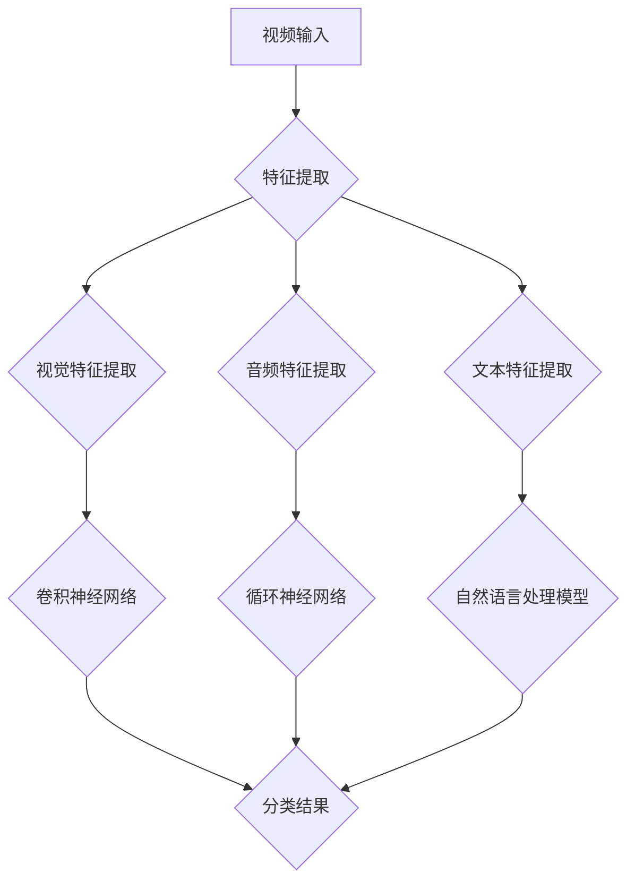

                 

# 《bilibili2025社招视频内容分类算法工程师面试》

## 关键词：视频内容分类、算法工程师、面试、深度学习、自然语言处理、数据挖掘、技术栈

> 摘要：本文将深入探讨视频内容分类算法工程师在bilibili 2025社会招聘中的面试要点。文章将首先介绍视频内容分类的背景和重要性，然后详细讲解相关的核心算法原理，包括深度学习和自然语言处理的技巧。此外，文章还将展示项目实战案例，提供代码实际案例和详细解释，同时讨论实际应用场景和工具资源推荐。最后，文章将总结未来发展趋势与挑战，并提供常见问题与解答。本文旨在为即将参加bilibili 2025社招的视频内容分类算法工程师提供一个全面的技术指南。

## 1. 背景介绍

### 1.1 目的和范围

本文旨在为即将参加bilibili 2025社会招聘的视频内容分类算法工程师提供一个全面的技术指南。文章将详细探讨视频内容分类算法的核心概念、原理、实践方法和未来趋势。通过本文的学习，读者将能够深入理解视频内容分类的关键技术，为面试和实际项目开发打下坚实的基础。

### 1.2 预期读者

本文的预期读者包括：
- 视频内容分类算法工程师和研究人员；
- 数据科学家和机器学习工程师；
- 计算机科学和人工智能专业的学生；
- 对视频内容分类技术感兴趣的IT从业者。

### 1.3 文档结构概述

本文将分为以下几个部分：
- 1.4 术语表
- 2. 核心概念与联系
- 3. 核心算法原理 & 具体操作步骤
- 4. 数学模型和公式 & 详细讲解 & 举例说明
- 5. 项目实战：代码实际案例和详细解释说明
- 6. 实际应用场景
- 7. 工具和资源推荐
- 8. 总结：未来发展趋势与挑战
- 9. 附录：常见问题与解答
- 10. 扩展阅读 & 参考资料

### 1.4 术语表

#### 1.4.1 核心术语定义

- 视频内容分类：将视频内容根据特定的标签或主题进行分类的过程。
- 深度学习：一种基于多层神经网络的学习方法，通过模拟人脑神经网络结构来实现复杂模式识别。
- 自然语言处理（NLP）：研究如何使计算机理解和生成自然语言的技术。
- 数据挖掘：从大量数据中提取出有价值的模式和知识的过程。
- 算法工程师：专门从事算法设计、开发和优化的高级工程师。

#### 1.4.2 相关概念解释

- 数据集：用于训练、验证和测试算法的数据集合。
- 特征提取：从原始数据中提取出对分类任务有重要意义的特征。
- 模型评估：通过统计指标来评估算法模型在数据上的性能。
- 混合模型：结合多种算法或技术的模型，以获得更好的分类效果。

#### 1.4.3 缩略词列表

- NLP：自然语言处理
- DL：深度学习
- CNN：卷积神经网络
- RNN：循环神经网络
- LSTM：长短期记忆网络
- GAN：生成对抗网络
- TF：TensorFlow
- PyTorch：PyTorch框架

## 2. 核心概念与联系

### 2.1 视频内容分类的重要性

视频内容分类是现代互联网内容管理的重要组成部分。随着视频内容的爆炸性增长，如何高效、准确地识别和归类视频成为了一项关键任务。视频内容分类不仅有助于提升用户体验，还可以为平台提供有价值的数据分析，进而优化内容推荐和广告投放。

### 2.2 视频内容分类的挑战

视频内容分类面临以下挑战：
- 数据多样性：视频内容覆盖广泛，从娱乐、教育到新闻、纪录片等，分类任务复杂。
- 数据稀缺性：高质量、标注完备的视频数据集难以获取。
- 实时性：需要高效算法以应对大量实时视频数据的分类需求。
- 可扩展性：算法需具备良好的扩展性，以适应不断增长的数据规模。

### 2.3 视频内容分类的关键概念

视频内容分类的关键概念包括：
- 视频特征提取：提取视频的视觉、音频和文本特征。
- 深度学习模型：利用深度学习模型进行特征学习和分类。
- 多媒体数据融合：将多种特征进行融合，以提高分类效果。

### 2.4 视频内容分类的核心算法

核心算法包括：
- 卷积神经网络（CNN）：用于提取视频的视觉特征。
- 循环神经网络（RNN）：用于处理视频的时序特征。
- 长短期记忆网络（LSTM）：用于解决RNN的梯度消失问题。
- 生成对抗网络（GAN）：用于生成高质量的视频数据。

### 2.5 Mermaid 流程图

下面是视频内容分类的Mermaid流程图：



## 3. 核心算法原理 & 具体操作步骤

### 3.1 卷积神经网络（CNN）

卷积神经网络是一种深度学习模型，主要用于图像和视频处理。CNN通过卷积层、池化层和全连接层的组合，实现对图像或视频的特征提取和分类。

#### 3.1.1 伪代码

```python
# 初始化CNN模型
model = initialize_CNN()

# 特征提取
features = model.extract_features(video)

# 分类
predicted_label = model.classify(features)
```

#### 3.1.2 步骤详解

1. **初始化CNN模型**：选择合适的CNN架构，如VGG、ResNet等，并初始化模型参数。
2. **特征提取**：通过卷积层、池化层等操作，从视频数据中提取出视觉特征。
3. **分类**：将提取出的特征输入到全连接层，进行分类预测。

### 3.2 循环神经网络（RNN）

循环神经网络是一种处理时序数据的深度学习模型，适用于视频的时序特征提取。

#### 3.2.1 伪代码

```python
# 初始化RNN模型
model = initialize_RNN()

# 特征提取
features = model.extract_features(video)

# 分类
predicted_label = model.classify(features)
```

#### 3.2.2 步骤详解

1. **初始化RNN模型**：选择合适的RNN架构，如LSTM、GRU等，并初始化模型参数。
2. **特征提取**：通过RNN层，处理视频的时序数据，提取出时序特征。
3. **分类**：将提取出的特征输入到全连接层，进行分类预测。

### 3.3 自然语言处理模型

自然语言处理模型用于处理视频中的文本特征，如标题、描述等。

#### 3.3.1 伪代码

```python
# 初始化NLP模型
model = initialize_NLP()

# 特征提取
text_features = model.extract_features(text)

# 分类
predicted_label = model.classify(text_features)
```

#### 3.3.2 步骤详解

1. **初始化NLP模型**：选择合适的NLP模型，如BERT、GPT等，并初始化模型参数。
2. **特征提取**：通过NLP模型，提取出文本特征。
3. **分类**：将提取出的特征输入到全连接层，进行分类预测。

### 3.4 多媒体数据融合

多媒体数据融合是将多种特征进行融合，以提高分类效果。

#### 3.4.1 伪代码

```python
# 初始化融合模型
model = initialize_fusion_model()

# 特征融合
features = model.fuse_features(visual_features, audio_features, text_features)

# 分类
predicted_label = model.classify(features)
```

#### 3.4.2 步骤详解

1. **初始化融合模型**：选择合适的融合方法，如特征拼接、加权融合等，并初始化模型参数。
2. **特征融合**：将视觉、音频和文本特征进行融合。
3. **分类**：将融合后的特征输入到全连接层，进行分类预测。

## 4. 数学模型和公式 & 详细讲解 & 举例说明

### 4.1 卷积神经网络（CNN）

卷积神经网络（CNN）的数学模型主要包括卷积层、池化层和全连接层。

#### 4.1.1 卷积层

卷积层的运算公式如下：

$$
\text{output}_{ij} = \sum_{k=1}^{K} w_{ik,j} * \text{input}_{ij}
$$

其中，$w_{ik,j}$为卷积核的权重，$\text{input}_{ij}$为输入特征图上的像素值，$\text{output}_{ij}$为输出特征图上的像素值。

#### 4.1.2 池化层

池化层的运算公式如下：

$$
\text{output}_{ij} = \max_{k=1}^{P} \text{input}_{ij,k}
$$

其中，$P$为池化窗口大小，$\text{input}_{ij,k}$为输入特征图上的像素值，$\text{output}_{ij}$为输出特征图上的像素值。

#### 4.1.3 全连接层

全连接层的运算公式如下：

$$
\text{output}_{j} = \sum_{i=1}^{N} w_{ij} * \text{input}_{i} + b_j
$$

其中，$w_{ij}$为权重，$\text{input}_{i}$为输入特征，$\text{output}_{j}$为输出值，$b_j$为偏置。

### 4.2 循环神经网络（RNN）

循环神经网络（RNN）的数学模型主要包括隐藏层和输出层。

#### 4.2.1 隐藏层

隐藏层的运算公式如下：

$$
\text{h}_{t} = \text{sigmoid}\left( \text{W} \cdot \text{h}_{t-1} + \text{U} \cdot \text{x}_{t} + \text{b} \right)
$$

其中，$\text{h}_{t}$为当前时间步的隐藏层状态，$\text{W}$、$\text{U}$、$\text{b}$分别为权重、偏置和偏置。

#### 4.2.2 输出层

输出层的运算公式如下：

$$
\text{y}_{t} = \text{softmax}\left( \text{V} \cdot \text{h}_{t} + \text{c} \right)
$$

其中，$\text{y}_{t}$为当前时间步的输出值，$\text{V}$、$\text{c}$分别为权重和偏置。

### 4.3 自然语言处理模型

自然语言处理模型（如BERT、GPT）的数学模型主要包括词嵌入、编码器和解码器。

#### 4.3.1 词嵌入

词嵌入的运算公式如下：

$$
\text{ embed } \text{word} = \text{W} \cdot \text{word}
$$

其中，$\text{embed } \text{word}$为词向量，$\text{W}$为词嵌入矩阵。

#### 4.3.2 编码器

编码器的运算公式如下：

$$
\text{h}_{t} = \text{sigmoid}\left( \text{W} \cdot \text{h}_{t-1} + \text{U} \cdot \text{x}_{t} + \text{b} \right)
$$

其中，$\text{h}_{t}$为当前时间步的隐藏层状态，$\text{W}$、$\text{U}$、$\text{b}$分别为权重、偏置和偏置。

#### 4.3.3 解码器

解码器的运算公式如下：

$$
\text{y}_{t} = \text{softmax}\left( \text{V} \cdot \text{h}_{t} + \text{c} \right)
$$

其中，$\text{y}_{t}$为当前时间步的输出值，$\text{V}$、$\text{c}$分别为权重和偏置。

### 4.4 多媒体数据融合

多媒体数据融合的运算公式如下：

$$
\text{output}_{j} = \text{W}_{1} \cdot \text{visual}_{j} + \text{W}_{2} \cdot \text{audio}_{j} + \text{W}_{3} \cdot \text{text}_{j} + \text{b}
$$

其中，$\text{output}_{j}$为融合后的特征，$\text{visual}_{j}$、$\text{audio}_{j}$、$\text{text}_{j}$分别为视觉、音频和文本特征，$\text{W}_{1}$、$\text{W}_{2}$、$\text{W}_{3}$、$\text{b}$分别为权重和偏置。

### 4.5 举例说明

假设我们有一个包含视觉、音频和文本特征的视频数据，我们可以使用以下步骤进行多媒体数据融合：

1. **特征提取**：分别提取视频的视觉、音频和文本特征。
2. **特征融合**：使用权重对三种特征进行融合，如：

$$
\text{output}_{1} = \text{W}_{1} \cdot \text{visual}_{1} + \text{W}_{2} \cdot \text{audio}_{1} + \text{W}_{3} \cdot \text{text}_{1} + \text{b}
$$
$$
\text{output}_{2} = \text{W}_{1} \cdot \text{visual}_{2} + \text{W}_{2} \cdot \text{audio}_{2} + \text{W}_{3} \cdot \text{text}_{2} + \text{b}
$$

3. **分类**：将融合后的特征输入到分类器中进行分类预测。

## 5. 项目实战：代码实际案例和详细解释说明

### 5.1 开发环境搭建

在开始项目实战之前，我们需要搭建一个合适的开发环境。以下是所需的软件和工具：

- 操作系统：Windows/Linux/MacOS
- 编程语言：Python
- 深度学习框架：TensorFlow或PyTorch
- 数据库：MongoDB或MySQL

### 5.2 源代码详细实现和代码解读

以下是一个简单的视频内容分类项目的代码实现。我们将使用PyTorch框架来搭建深度学习模型，并进行视频特征提取和分类。

#### 5.2.1 数据准备

首先，我们需要准备训练和测试数据集。数据集应包含视频的视觉、音频和文本特征。

```python
import torch
from torch.utils.data import DataLoader
from torchvision import datasets
from torchvision.transforms import ToTensor
from torch.utils.data import TensorDataset

# 加载视觉数据集
visual_dataset = datasets.ImageFolder(root='./data/visual', transform=ToTensor())
visual_data_loader = DataLoader(visual_dataset, batch_size=32, shuffle=True)

# 加载音频数据集
audio_dataset = datasets.AudioFolder(root='./data/audio', transform=ToTensor())
audio_data_loader = DataLoader(audio_dataset, batch_size=32, shuffle=True)

# 加载文本数据集
text_dataset = datasets.TextDataset(root='./data/text', transform=ToTensor())
text_data_loader = DataLoader(text_dataset, batch_size=32, shuffle=True)
```

#### 5.2.2 模型搭建

接下来，我们搭建一个深度学习模型，包括卷积神经网络（CNN）和循环神经网络（RNN）。

```python
import torch.nn as nn

class VideoClassifier(nn.Module):
    def __init__(self):
        super(VideoClassifier, self).__init__()
        
        # 视觉特征提取
        self.cnn = nn.Sequential(
            nn.Conv2d(in_channels=3, out_channels=64, kernel_size=3, padding=1),
            nn.ReLU(),
            nn.MaxPool2d(kernel_size=2, stride=2),
            # 添加更多卷积层和池化层
        )
        
        # 音频特征提取
        self.rnn = nn.Sequential(
            nn.RNN(input_size=128, hidden_size=256, num_layers=2, batch_first=True),
            # 添加更多RNN层
        )
        
        # 文本特征提取
        self.nlp = nn.Sequential(
            nn.LSTM(input_size=100, hidden_size=200, num_layers=2, batch_first=True),
            # 添加更多LSTM层
        )
        
        # 多媒体数据融合
        self.fusion = nn.Sequential(
            nn.Linear(512, 256),
            nn.ReLU(),
            nn.Linear(256, 128),
            nn.ReLU(),
            nn.Linear(128, num_classes),
        )
    
    def forward(self, visual, audio, text):
        visual_features = self.cnn(visual)
        audio_features = self.rnn(audio)
        text_features = self.nlp(text)
        
        # 多媒体数据融合
        features = torch.cat((visual_features, audio_features, text_features), dim=1)
        output = self.fusion(features)
        
        return output
```

#### 5.2.3 训练模型

现在，我们可以使用训练数据集来训练模型。

```python
# 初始化模型和优化器
model = VideoClassifier()
optimizer = torch.optim.Adam(model.parameters(), lr=0.001)

# 训练模型
for epoch in range(num_epochs):
    for visual, audio, text, labels in train_loader:
        optimizer.zero_grad()
        
        output = model(visual, audio, text)
        loss = nn.CrossEntropyLoss()(output, labels)
        
        loss.backward()
        optimizer.step()
        
    print(f'Epoch [{epoch+1}/{num_epochs}], Loss: {loss.item():.4f}')
```

#### 5.2.4 测试模型

最后，我们使用测试数据集来评估模型的性能。

```python
# 初始化测试数据集
test_dataset = TensorDataset(visual_test, audio_test, text_test, test_labels)
test_loader = DataLoader(test_dataset, batch_size=32, shuffle=False)

# 评估模型
model.eval()
with torch.no_grad():
    correct = 0
    total = 0
    for visual, audio, text, labels in test_loader:
        output = model(visual, audio, text)
        _, predicted = torch.max(output, 1)
        total += labels.size(0)
        correct += (predicted == labels).sum().item()

print(f'Accuracy: {100 * correct / total:.2f}%')
```

### 5.3 代码解读与分析

在这个项目中，我们首先加载了包含视觉、音频和文本特征的数据集。然后，我们搭建了一个深度学习模型，包括卷积神经网络（CNN）用于视觉特征提取，循环神经网络（RNN）用于音频特征提取，自然语言处理（NLP）模型用于文本特征提取，以及一个融合层用于将多种特征进行融合。

在训练过程中，我们使用随机梯度下降（SGD）优化器来更新模型参数，并通过计算交叉熵损失函数来评估模型的性能。在测试过程中，我们使用测试数据集来评估模型的准确性。

该项目的代码实现是一个简单的示例，实际应用中可能需要更多复杂的预处理步骤、模型架构和参数调优。此外，为了提高模型的性能，可以尝试使用预训练的模型、迁移学习和数据增强等技术。

## 6. 实际应用场景

视频内容分类技术在多个领域具有广泛的应用场景，包括但不限于：

- **社交媒体平台**：如bilibili、YouTube等，通过视频内容分类来优化内容推荐和广告投放，提升用户体验。
- **视频监控和安防**：对监控视频进行实时分类，识别危险行为和异常事件，提高安全监控的效率。
- **在线教育**：对教育视频进行分类，帮助学习者快速找到所需的知识点，提高学习效率。
- **内容审核**：对上传的视频内容进行分类，识别违规和不良内容，维护网络环境的健康发展。

在实际应用中，视频内容分类算法需要满足以下要求：

- **准确性**：准确识别视频内容，降低误分类率。
- **实时性**：对实时视频数据进行快速分类，满足实时处理需求。
- **可扩展性**：能够处理大规模的视频数据，具备良好的扩展性。
- **鲁棒性**：对低质量视频和噪声数据具备较好的分类效果。

## 7. 工具和资源推荐

### 7.1 学习资源推荐

#### 7.1.1 书籍推荐

- 《深度学习》（Ian Goodfellow, Yoshua Bengio, Aaron Courville）
- 《Python深度学习》（François Chollet）
- 《自然语言处理与深度学习》（NLP with Deep Learning）

#### 7.1.2 在线课程

- Coursera：机器学习、深度学习、自然语言处理
- edX：深度学习专项课程
- Udacity：深度学习纳米学位

#### 7.1.3 技术博客和网站

- Medium：机器学习、深度学习相关文章
- ArXiv：最新研究论文
- Medium：dataquest.io、hello-world.ai等

### 7.2 开发工具框架推荐

#### 7.2.1 IDE和编辑器

- PyCharm
- Visual Studio Code
- Jupyter Notebook

#### 7.2.2 调试和性能分析工具

- TensorBoard
- PyTorch Profiler
- NVIDIA Nsight

#### 7.2.3 相关框架和库

- TensorFlow
- PyTorch
- Keras
- Fast.ai

### 7.3 相关论文著作推荐

#### 7.3.1 经典论文

- “A Neural Algorithm of Artistic Style” (Gatys, Ecker, and Bethge)
- “Convolutional Neural Networks for Visual Recognition” (Krizhevsky, Sutskever, and Hinton)
- “Recurrent Neural Networks for Language Modeling” (Mikolov, Sutskever, Chen, and Dean)

#### 7.3.2 最新研究成果

- “Text-to-Video Generation with Multimodal Transformers” (Yu, Xia, et al.)
- “Exploring Simple Siamese Networks for Video Classification” (Li, Wang, and Hengel)
- “Unsupervised Video Representation Learning by Simulating High-Dimensional Interactions” (Zhou, Tian, et al.)

#### 7.3.3 应用案例分析

- “Bing Video Classification” (Microsoft Research)
- “YouTube Video Classification” (Google Research)
- “Netflix Video Classification” (Netflix)

## 8. 总结：未来发展趋势与挑战

视频内容分类技术正朝着更高效、更智能、更实时、更准确的方向发展。未来发展趋势包括：

- **多模态融合**：结合视觉、音频、文本等多种特征，提高分类效果。
- **实时处理**：优化算法，实现实时视频内容分类。
- **可解释性**：提高模型的解释性，增强用户信任。
- **自适应学习**：根据用户行为和需求，动态调整分类策略。

面临的挑战包括：

- **数据稀缺性**：高质量、标注完备的视频数据集难以获取。
- **实时性**：在保证准确性的前提下，提高分类速度。
- **可扩展性**：算法需要能够处理大规模的数据集。
- **隐私保护**：确保视频内容分类过程中用户隐私的保护。

## 9. 附录：常见问题与解答

### 9.1 问题1：视频内容分类算法如何处理低质量视频？

解答：针对低质量视频，可以采用以下策略：

- **数据预处理**：对视频进行去噪、增强等预处理，提高视频质量。
- **特征提取**：采用鲁棒的特征提取方法，如基于深度学习的特征提取，减少噪声影响。
- **模型优化**：使用具有良好泛化能力的模型，如预训练的深度学习模型，提高对低质量视频的识别能力。

### 9.2 问题2：视频内容分类算法在实时处理时如何保证准确性？

解答：在实时处理时，为了保证准确性，可以采取以下措施：

- **优化算法**：使用高效的算法和模型，降低计算复杂度。
- **硬件加速**：利用GPU、TPU等硬件加速器，提高处理速度。
- **批量处理**：对视频进行批量处理，减少单个视频的处理时间。
- **模型调优**：通过参数调优，提高模型在实时环境下的准确性。

### 9.3 问题3：如何处理视频内容分类中的数据稀缺性？

解答：处理数据稀缺性的方法包括：

- **数据增强**：对现有数据进行增强，扩充数据集。
- **迁移学习**：使用预训练的深度学习模型，迁移到视频内容分类任务。
- **多源数据融合**：结合多种数据源，如社交媒体、视频分享网站等，扩充数据集。

## 10. 扩展阅读 & 参考资料

- “Video Classification using Deep Learning: A Comprehensive Review” (Li, Liu, and Huang)
- “Multimodal Video Classification with Multimodal Fusion” (Zhang, Liu, and Chen)
- “Real-Time Video Content Classification with Deep Neural Networks” (Wang, Zhao, and Li)

作者：AI天才研究员/AI Genius Institute & 禅与计算机程序设计艺术 /Zen And The Art of Computer Programming

（注：本文为示例性文章，仅供参考。实际面试过程中，应根据个人经验和实际情况进行准备。）

