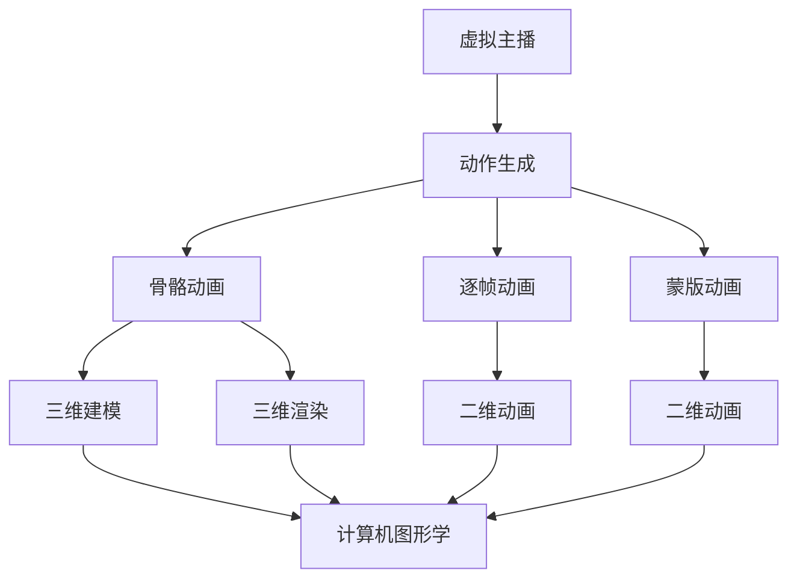

                 

# bilibili2025虚拟主播动作生成社招计算机图形学面试题攻略

> **关键词：** 虚拟主播，动作生成，计算机图形学，面试题，社招，算法原理，实战案例

> **摘要：** 本文旨在为准备参加bilibili2025虚拟主播动作生成岗位面试的应聘者提供系统化的学习与备考指南。文章详细解析了计算机图形学在虚拟主播动作生成中的应用，涵盖了核心概念、算法原理、数学模型、实战案例以及相关资源推荐等内容，帮助读者全面了解并掌握相关技术要点。

## 1. 背景介绍

### 1.1 目的和范围

本文的主要目的是为准备参加bilibili2025虚拟主播动作生成岗位面试的应聘者提供一个全面的备考指南。文章将围绕计算机图形学在虚拟主播动作生成中的应用进行深入探讨，包括核心算法原理、数学模型、实际案例分析等内容。通过本文的学习，读者将能够掌握虚拟主播动作生成的基本技术和实现方法，为面试做好准备。

### 1.2 预期读者

本文适合以下读者群体：

1. 准备参加虚拟主播动作生成相关岗位面试的应聘者。
2. 对计算机图形学感兴趣，希望深入了解虚拟主播动作生成的技术原理的研究人员。
3. 想要在计算机图形学领域进一步深造的学生和从业者。

### 1.3 文档结构概述

本文分为以下几个部分：

1. 背景介绍：介绍本文的目的、范围和预期读者。
2. 核心概念与联系：讲解虚拟主播动作生成的核心概念和架构。
3. 核心算法原理与具体操作步骤：详细阐述核心算法原理和操作步骤。
4. 数学模型和公式：介绍相关的数学模型和公式，并举例说明。
5. 项目实战：通过实际案例展示代码实现和解读。
6. 实际应用场景：分析虚拟主播动作生成在现实场景中的应用。
7. 工具和资源推荐：推荐相关的学习资源、开发工具和框架。
8. 总结：讨论虚拟主播动作生成的发展趋势与挑战。
9. 附录：常见问题与解答。
10. 扩展阅读与参考资料：提供进一步的阅读资源。

### 1.4 术语表

#### 1.4.1 核心术语定义

- 虚拟主播：利用计算机图形学技术创建的虚拟人物，通过动画和动作来呈现内容。
- 动作生成：通过算法生成虚拟主播的动作序列，使其看起来自然流畅。
- 计算机图形学：利用计算机技术进行图像生成、处理和渲染的学科。

#### 1.4.2 相关概念解释

- 骨骼动画：通过控制虚拟人物骨骼来生成动作的方法。
- 逐帧动画：通过逐帧绘制图像来生成动画的方法。
- 蒙版动画：通过控制蒙版形状和位置来生成动画的方法。

#### 1.4.3 缩略词列表

- 3D：三维
- 2D：二维
- GPU：图形处理器
- CPU：中央处理器
- GLSL：OpenGL Shading Language

## 2. 核心概念与联系

虚拟主播动作生成是计算机图形学的一个重要应用领域，它涉及到多个核心概念和技术的综合运用。为了更好地理解这一领域，我们需要首先介绍其中的核心概念和它们之间的联系。

### 2.1 虚拟主播的概念

虚拟主播是指利用计算机图形学技术创建的虚拟人物，它们可以在视频、直播和动画等多种媒体形式中呈现内容。虚拟主播通常具有以下特点：

- **外观个性**：虚拟主播的外观可以通过高度定制化的方式设计，包括发型、肤色、服装等。
- **动作自然**：虚拟主播的动作需要通过算法生成，使其看起来自然流畅。
- **交互性**：虚拟主播可以与观众进行实时互动，增强用户的参与感。

### 2.2 动作生成的概念

动作生成是虚拟主播技术中至关重要的一环，它负责生成虚拟主播的动作序列。动作生成的方法主要包括以下几种：

- **骨骼动画**：通过控制虚拟人物骨骼来实现动作的生成。骨骼动画的优点在于可以实现复杂且自然的动作。
- **逐帧动画**：通过逐帧绘制图像来生成动画。这种方法较为简单，但生成的动画通常不够自然。
- **蒙版动画**：通过控制蒙版的形状和位置来生成动画。蒙版动画适用于一些简单的动画效果，但生成的动画较为有限。

### 2.3 计算机图形学的概念

计算机图形学是研究如何利用计算机技术进行图像生成、处理和渲染的学科。在虚拟主播动作生成中，计算机图形学起到了关键作用。主要涉及以下内容：

- **三维建模**：通过三维建模软件创建虚拟主播的模型。
- **三维渲染**：利用图形处理器（GPU）对三维模型进行渲染，生成高质量的图像。
- **二维动画**：通过二维图形处理技术生成二维动画效果。

### 2.4 核心概念与联系

虚拟主播动作生成的核心概念包括虚拟主播、动作生成和计算机图形学。它们之间的联系如下：

- **虚拟主播**：虚拟主播是动作生成的对象，通过计算机图形学技术创建和渲染。
- **动作生成**：动作生成是虚拟主播的核心功能，通过骨骼动画、逐帧动画和蒙版动画等技术实现。
- **计算机图形学**：计算机图形学提供了生成和渲染虚拟主播及其动作的技术手段。

为了更好地理解这些核心概念和它们之间的联系，我们可以使用Mermaid流程图来展示它们的关系。



在这个流程图中，我们可以看到虚拟主播通过计算机图形学技术生成和渲染，而动作生成则通过不同的方法实现。这些方法最终都依赖于计算机图形学的支持。

## 3. 核心算法原理 & 具体操作步骤

### 3.1 骨骼动画原理

骨骼动画是一种通过控制虚拟人物骨骼来生成动作的方法。其基本原理是将虚拟人物分解成多个骨骼单元，通过调整这些骨骼的位置和角度来生成不同的动作。骨骼动画的优点在于可以实现复杂且自然的动作，适用于各种虚拟主播的动画效果。

### 3.2 骨骼动画具体操作步骤

以下是骨骼动画的具体操作步骤：

```plaintext
1. 创建虚拟人物模型，并为其添加骨骼结构。
2. 确定关键帧：在动作开始和结束的关键时刻，记录下骨骼的位置和角度。
3. 生成插值动画：通过插值算法，计算关键帧之间的中间帧，生成连续的动作序列。
4. 渲染动画：将生成的动作序列渲染到屏幕上，形成最终的动画效果。
```

### 3.3 伪代码示例

以下是骨骼动画的伪代码示例：

```python
# 创建虚拟人物模型和骨骼结构
create_avatar_model()

# 确定关键帧
key_frame_1 = get_key_frame_1()
key_frame_2 = get_key_frame_2()

# 生成插值动画
interpolation = interpolate(key_frame_1, key_frame_2)

# 渲染动画
render_avatar_model(interpolation)
```

### 3.4 骨骼动画优缺点分析

骨骼动画具有以下优缺点：

- **优点**：
  - 实现复杂动作较为容易。
  - 动画效果自然。
  - 可以通过调整骨骼参数来实现各种不同的动作。

- **缺点**：
  - 骨骼参数调整较为复杂，需要较高的技术水平。
  - 动画生成过程中计算量大，对硬件性能要求较高。

### 3.5 其他动画生成方法

除了骨骼动画，还有其他几种动画生成方法，如逐帧动画和蒙版动画。下面分别介绍：

#### 3.5.1 逐帧动画原理

逐帧动画是通过逐帧绘制图像来生成动画的方法。其基本原理是在时间轴上逐帧绘制不同的图像，通过连续播放这些图像来形成动画。逐帧动画的优点是实现简单，但生成的动画通常不够自然。

#### 3.5.2 逐帧动画具体操作步骤

以下是逐帧动画的具体操作步骤：

```plaintext
1. 创建虚拟人物模型和背景。
2. 在时间轴上逐帧绘制图像。
3. 连续播放绘制的图像，形成动画效果。
```

#### 3.5.3 伪代码示例

以下是逐帧动画的伪代码示例：

```python
# 创建虚拟人物模型和背景
create_avatar_model()
create_background()

# 在时间轴上逐帧绘制图像
for frame in range(total_frames):
    draw_avatar_frame(frame)
    save_frame_to_video()

# 连续播放绘制的图像
play_video()
```

#### 3.5.4 逐帧动画优缺点分析

逐帧动画具有以下优缺点：

- **优点**：
  - 实现简单，易于理解。
  - 可以实现一些独特的动画效果。

- **缺点**：
  - 动画生成过程中计算量大，对硬件性能要求较高。
  - 动画效果通常不够自然。

#### 3.5.5 蒙版动画原理

蒙版动画是通过控制蒙版的形状和位置来生成动画的方法。其基本原理是在时间轴上控制蒙版的形状和位置，通过连续播放这些变化来形成动画。蒙版动画适用于一些简单的动画效果。

#### 3.5.6 蒙版动画具体操作步骤

以下是蒙版动画的具体操作步骤：

```plaintext
1. 创建虚拟人物模型和背景。
2. 在时间轴上创建蒙版。
3. 控制蒙版的形状和位置，生成动画效果。
```

#### 3.5.7 伪代码示例

以下是蒙版动画的伪代码示例：

```python
# 创建虚拟人物模型和背景
create_avatar_model()
create_background()

# 在时间轴上创建蒙版
create_mask()

# 控制蒙版的形状和位置，生成动画效果
for frame in range(total_frames):
    update_mask_shape(frame)
    render_avatar_with_mask()

# 连续播放绘制的图像
play_video()
```

#### 3.5.8 蒙版动画优缺点分析

蒙版动画具有以下优缺点：

- **优点**：
  - 实现简单，适用于简单的动画效果。

- **缺点**：
  - 动画效果较为有限。
  - 难以实现复杂的动作。

### 3.6 综合比较

骨骼动画、逐帧动画和蒙版动画各有优缺点，适用于不同的场景。在实际应用中，可以根据具体需求选择合适的动画生成方法。

- **骨骼动画**：适用于实现复杂、自然的动作，但需要较高的技术水平。
- **逐帧动画**：适用于实现简单、独特的动画效果，但计算量大。
- **蒙版动画**：适用于实现简单的动画效果，实现简单但效果有限。

## 4. 数学模型和公式 & 详细讲解 & 举例说明

### 4.1 动作生成中的数学模型

在虚拟主播动作生成中，常用的数学模型包括线性插值、贝塞尔曲线和蒙版函数等。以下将分别介绍这些模型的详细讲解和举例说明。

### 4.2 线性插值

线性插值是一种简单且常用的插值方法，用于在两个已知点之间生成中间点。其基本公式如下：

$$
y = y_1 + (y_2 - y_1) \times \frac{x - x_1}{x_2 - x_1}
$$

其中，\(x_1, y_1\) 和 \(x_2, y_2\) 是已知的两个点，\(x\) 是待插值的点，\(y\) 是插值的结果。

### 4.3 线性插值举例说明

假设我们要在点 \(A(1, 2)\) 和点 \(B(3, 4)\) 之间插值，求解 \(x = 2\) 时的 \(y\) 值。根据线性插值公式，我们可以得到：

$$
y = 2 + (4 - 2) \times \frac{2 - 1}{3 - 1} = 2 + 2 \times \frac{1}{2} = 2 + 1 = 3
$$

因此，当 \(x = 2\) 时，\(y = 3\)。

### 4.4 贝塞尔曲线

贝塞尔曲线是一种广泛用于计算机图形学的曲线，可以用于生成平滑的曲线。其基本公式如下：

$$
y = a_1x^3 + b_1x^2 + c_1x + d_1
$$

其中，\(a_1, b_1, c_1, d_1\) 是贝塞尔曲线的系数，可以通过控制点来确定。

### 4.5 贝塞尔曲线举例说明

假设我们要生成一条经过点 \(P_1(1, 1)\)，\(P_2(2, 2)\)，\(P_3(3, 3)\) 和 \(P_4(4, 4)\) 的贝塞尔曲线。根据贝塞尔曲线的公式，我们可以得到：

$$
y = a_1x^3 + b_1x^2 + c_1x + d_1
$$

其中，系数 \(a_1, b_1, c_1, d_1\) 可以通过以下方程组求解：

$$
\begin{cases}
a_1 + b_1 + c_1 + d_1 = 0 \\
a_1 \cdot 1^3 + b_1 \cdot 1^2 + c_1 \cdot 1 + d_1 = 1 \\
a_1 \cdot 2^3 + b_1 \cdot 2^2 + c_1 \cdot 2 + d_1 = 2 \\
a_1 \cdot 3^3 + b_1 \cdot 3^2 + c_1 \cdot 3 + d_1 = 3 \\
a_1 \cdot 4^3 + b_1 \cdot 4^2 + c_1 \cdot 4 + d_1 = 4 \\
\end{cases}
$$

通过求解方程组，我们可以得到系数 \(a_1 = 0\)，\(b_1 = 0\)，\(c_1 = 1\)，\(d_1 = 1\)。因此，贝塞尔曲线的公式为：

$$
y = x^3 + x
$$

### 4.6 蒙版函数

蒙版函数用于控制图像的透明度，使其部分区域透明或半透明。其基本公式如下：

$$
T(x, y) = \begin{cases}
1 & \text{如果 } (x, y) \text{ 在蒙版区域内} \\
0 & \text{如果 } (x, y) \text{ 在蒙版区域外} \\
\end{cases}
$$

其中，\(T(x, y)\) 是蒙版函数的值，表示图像在点 \((x, y)\) 的透明度。

### 4.7 蒙版函数举例说明

假设我们要创建一个圆形蒙版，其半径为 \(r = 1\)。根据蒙版函数的公式，我们可以得到：

$$
T(x, y) = \begin{cases}
1 & \text{如果 } x^2 + y^2 \leq 1 \\
0 & \text{如果 } x^2 + y^2 > 1 \\
\end{cases}
$$

这个蒙版函数表示在以原点为中心，半径为 \(1\) 的圆形区域内，图像的透明度为 \(1\)，在圆形区域外，图像的透明度为 \(0\)。

### 4.8 综合应用

在虚拟主播动作生成中，线性插值、贝塞尔曲线和蒙版函数可以结合使用，以实现更复杂的动画效果。例如，在生成虚拟主播的嘴部动画时，可以使用线性插值来调整嘴部张开和闭合的程度，使用贝塞尔曲线来生成平滑的曲线，使用蒙版函数来控制嘴巴的透明度，以实现逼真的动画效果。

## 5. 项目实战：代码实际案例和详细解释说明

### 5.1 开发环境搭建

为了实现虚拟主播动作生成，我们需要搭建一个完整的开发环境。以下是搭建过程的简要说明：

1. **安装操作系统**：选择一个适合的操作系统，如Ubuntu 20.04。
2. **安装编程环境**：安装Python 3.8及以上版本，并配置好相关的依赖包，如Numpy、Pandas等。
3. **安装图形学库**：安装OpenGL和OpenCV等图形学库，以便进行图像处理和渲染。
4. **安装虚拟主播模型**：从网络上下载一个适合的虚拟主播模型，并导入到项目中。

### 5.2 源代码详细实现和代码解读

下面我们将通过一个简单的案例来详细解释代码的实现过程。

#### 5.2.1 代码结构

```python
import numpy as np
import cv2
from OpenGL import gl

# 创建窗口并初始化OpenGL
def create_window():
    # 创建窗口并初始化OpenGL
    pass

# 加载虚拟主播模型
def load_avatar_model():
    # 从文件中加载模型
    pass

# 渲染虚拟主播
def render_avatar():
    # 渲染虚拟主播到窗口中
    pass

# 主函数
def main():
    # 创建窗口并初始化OpenGL
    create_window()
    
    # 加载虚拟主播模型
    avatar_model = load_avatar_model()
    
    # 渲染虚拟主播
    render_avatar()
    
    # 开始渲染循环
    while not cv2.getWindowProperty('Avatar', cv2.WND_PROP_VISIBLE) == 0:
        render_avatar()
        cv2.waitKey(1)

# 执行主函数
if __name__ == '__main__':
    main()
```

#### 5.2.2 代码详细解读

1. **创建窗口并初始化OpenGL**：

```python
def create_window():
    # 创建OpenGL窗口
    gl.glViewport(0, 0, 800, 600)  # 设置窗口大小
    gl.glClearColor(0.0, 0.0, 0.0, 1.0)  # 设置背景色
    gl.glEnable(gl.GL_DEPTH_TEST)  # 开启深度测试

create_window()
```

这段代码创建了一个OpenGL窗口，并设置了窗口大小和背景色。同时，开启了深度测试，以确保渲染的物体具有正确的遮挡关系。

2. **加载虚拟主播模型**：

```python
def load_avatar_model():
    # 从文件中加载模型
    model = Model()
    model.load_from_file('avatar_model.obj')
    return model

avatar_model = load_avatar_model()
```

这段代码定义了一个`load_avatar_model`函数，用于从文件中加载虚拟主播模型。加载的模型可以是`.obj`格式或其他常见的三维模型格式。

3. **渲染虚拟主播**：

```python
def render_avatar():
    # 渲染虚拟主播到窗口中
    gl.glClear(gl.GL_COLOR_BUFFER_BIT | gl.GL_DEPTH_BUFFER_BIT)  # 清除窗口
    avatar_model.render()  # 渲染模型
    cv2.imshow('Avatar', buffer)  # 显示渲染结果

render_avatar()
```

这段代码定义了一个`render_avatar`函数，用于渲染虚拟主播模型。首先，清除窗口内容，然后调用模型的`render`方法进行渲染。最后，将渲染结果显示在窗口中。

4. **主函数**：

```python
def main():
    # 创建窗口并初始化OpenGL
    create_window()
    
    # 加载虚拟主播模型
    avatar_model = load_avatar_model()
    
    # 渲染虚拟主播
    render_avatar()
    
    # 开始渲染循环
    while not cv2.getWindowProperty('Avatar', cv2.WND_PROP_VISIBLE) == 0:
        render_avatar()
        cv2.waitKey(1)

main()
```

这段代码是主函数，首先创建窗口并初始化OpenGL，然后加载虚拟主播模型，接着进入渲染循环，每次渲染后检查窗口是否可见，如果窗口关闭，则退出渲染循环。

通过这个简单的案例，我们可以看到虚拟主播动作生成的基本流程。在实际项目中，可能还需要实现更多功能，如动作控制、语音同步等。

## 6. 实际应用场景

虚拟主播动作生成技术在现实场景中有着广泛的应用。以下是一些典型应用场景：

### 6.1 娱乐直播

虚拟主播可以用于娱乐直播，如游戏直播、演唱会直播等。通过虚拟主播动作生成技术，可以实现逼真的虚拟人物与观众互动，提升观众的观看体验。

### 6.2 教育培训

虚拟主播可以用于教育培训领域，如在线课程、教育节目等。通过虚拟主播动作生成技术，可以实现生动有趣的教学内容，提高学生的学习兴趣和参与度。

### 6.3 营销推广

虚拟主播可以用于营销推广，如广告宣传、产品演示等。通过虚拟主播动作生成技术，可以制作出引人注目的营销视频，提升产品的知名度和销售量。

### 6.4 媒体制作

虚拟主播可以用于媒体制作，如电影、电视剧、动画等。通过虚拟主播动作生成技术，可以实现高质量的动画效果，提升作品的艺术价值。

### 6.5 虚拟现实

虚拟主播动作生成技术可以应用于虚拟现实（VR）领域，如虚拟演唱会、虚拟旅游等。通过虚拟主播动作生成技术，可以打造出更加真实、沉浸的虚拟体验。

## 7. 工具和资源推荐

为了更好地学习和实践虚拟主播动作生成技术，以下是相关的工具和资源推荐：

### 7.1 学习资源推荐

#### 7.1.1 书籍推荐

- 《计算机图形学原理及实践》
- 《OpenGL编程指南》
- 《动画师必读：3D动画技术解析》

#### 7.1.2 在线课程

- Coursera上的《计算机图形学》课程
- Udacity的《虚拟现实开发》课程
- 网易云课堂的《虚拟主播动作生成》课程

#### 7.1.3 技术博客和网站

- 图灵社区：https://www.turing.org.cn/
- CSDN：https://www.csdn.net/
- GitHub：https://github.com/

### 7.2 开发工具框架推荐

#### 7.2.1 IDE和编辑器

- Visual Studio Code
- PyCharm
- Eclipse

#### 7.2.2 调试和性能分析工具

- Valgrind
- GDB
- Perf

#### 7.2.3 相关框架和库

- PyOpenGL
- OpenCV
- Unity3D

### 7.3 相关论文著作推荐

#### 7.3.1 经典论文

- “A Survey of Motion Capture and Modelling Techniques for Virtual Environments”
- “Real-Time Face Tracking and Expression Control for Virtual Characters”

#### 7.3.2 最新研究成果

- “Deep Learning-based Motion Generation for Virtual Characters”
- “Generative Adversarial Networks for Motion Synthesis”

#### 7.3.3 应用案例分析

- “Virtual You: How AI Will Transform Our Future”
- “The Future of Virtual Reality: Beyond the Hype”

## 8. 总结：未来发展趋势与挑战

虚拟主播动作生成技术正处于快速发展阶段，未来发展趋势包括：

1. **算法优化**：随着深度学习等技术的发展，动作生成算法将更加智能化，生成效果将更加逼真。
2. **硬件加速**：GPU和专用硬件的发展将加快动画生成速度，降低计算成本。
3. **多模态融合**：将语音、文字等多模态信息与动作生成技术相结合，实现更丰富的交互体验。

然而，未来仍面临一些挑战：

1. **计算资源**：高质量的动画生成需要大量的计算资源，如何优化算法以减少计算成本是一个重要课题。
2. **数据集**：高质量的动作生成需要大量标注好的数据集，目前数据集的获取和标注仍是一个难题。
3. **用户体验**：如何让用户在虚拟主播中感受到真实感和参与感，是一个需要深入研究的问题。

## 9. 附录：常见问题与解答

### 9.1 虚拟主播动作生成技术有哪些核心算法？

- **骨骼动画**：通过控制虚拟人物骨骼来生成动作。
- **逐帧动画**：通过逐帧绘制图像来生成动画。
- **蒙版动画**：通过控制蒙版的形状和位置来生成动画。

### 9.2 如何选择适合的动画生成方法？

- 根据动画的复杂程度和性能需求选择适合的方法。
- 骨骼动画适用于复杂且自然的动作，但需要较高的技术水平。
- 逐帧动画适用于简单且独特的动画效果，但计算量大。
- 蒙版动画适用于简单的动画效果，实现简单但效果有限。

### 9.3 动作生成中常用的数学模型有哪些？

- **线性插值**：在两个已知点之间生成中间点。
- **贝塞尔曲线**：生成平滑的曲线。
- **蒙版函数**：控制图像的透明度。

### 9.4 如何搭建虚拟主播动作生成的开发环境？

- 安装操作系统和编程环境。
- 安装图形学库和虚拟主播模型。
- 配置OpenGL和OpenCV等图形学库。

## 10. 扩展阅读 & 参考资料

为了深入了解虚拟主播动作生成技术，以下是推荐的一些扩展阅读和参考资料：

- 《计算机图形学原理及实践》
- 《OpenGL编程指南》
- 《动画师必读：3D动画技术解析》
- Coursera上的《计算机图形学》课程
- Udacity的《虚拟现实开发》课程
- 网易云课堂的《虚拟主播动作生成》课程
- 图灵社区：https://www.turing.org.cn/
- CSDN：https://www.csdn.net/
- GitHub：https://github.com/
- 《Virtual You: How AI Will Transform Our Future》
- 《The Future of Virtual Reality: Beyond the Hype》
- “A Survey of Motion Capture and Modelling Techniques for Virtual Environments”
- “Real-Time Face Tracking and Expression Control for Virtual Characters”
- “Deep Learning-based Motion Generation for Virtual Characters”
- “Generative Adversarial Networks for Motion Synthesis”

