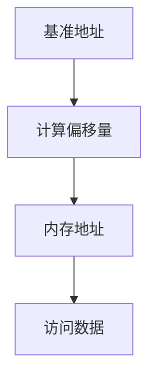

                 

# offset 原理与代码实例讲解

> **关键词：** offset原理、计算方法、代码实现、实例分析
> 
> **摘要：** 本文将深入探讨offset原理及其在计算机编程中的应用，通过具体代码实例详细解读offset的计算过程和实现细节，旨在帮助读者理解offset在实际编程中的重要性。

## 1. 背景介绍

### 1.1 目的和范围

本文的主要目的是介绍offset原理，并解释其在计算机编程中的应用。通过具体实例，我们将探讨offset的计算方法及其在编程中的实现细节，帮助读者更好地理解和应用这一概念。

### 1.2 预期读者

本文面向具有一定编程基础的读者，特别是对计算机体系结构、编译原理和汇编语言感兴趣的读者。本文将尽可能详细地解释offset原理，以便于不同层次的读者都能理解。

### 1.3 文档结构概述

本文将分为以下几个部分：

1. **背景介绍**：介绍本文的目的、预期读者和文档结构。
2. **核心概念与联系**：介绍offset的核心概念，并使用Mermaid流程图展示其原理和架构。
3. **核心算法原理 & 具体操作步骤**：使用伪代码详细阐述offset的计算过程。
4. **数学模型和公式 & 详细讲解 & 举例说明**：介绍offset相关的数学模型和公式，并通过实例进行说明。
5. **项目实战：代码实际案例和详细解释说明**：提供实际代码案例，详细解读其实现过程。
6. **实际应用场景**：讨论offset在实际编程中的应用。
7. **工具和资源推荐**：推荐相关学习资源和开发工具。
8. **总结：未来发展趋势与挑战**：总结offset的发展趋势和面临的挑战。
9. **附录：常见问题与解答**：解答读者可能遇到的问题。
10. **扩展阅读 & 参考资料**：提供进一步阅读的资源。

### 1.4 术语表

#### 1.4.1 核心术语定义

- **offset**：在计算机编程中，offset是指一个内存地址相对于某个基准地址的偏移量。
- **内存地址**：内存中的每个存储单元都有一个唯一的地址。
- **基准地址**：在计算offset时，作为参考的地址。

#### 1.4.2 相关概念解释

- **汇编语言**：一种底层编程语言，用于直接操作计算机硬件。
- **编译原理**：研究编译器设计和编译过程的学科。

#### 1.4.3 缩略词列表

- **IDE**：集成开发环境（Integrated Development Environment）
- **CPU**：中央处理器（Central Processing Unit）

## 2. 核心概念与联系

在深入探讨offset原理之前，我们需要了解其核心概念和关联结构。

### 2.1 offset原理

offset原理是计算机编程中一个基本概念，用于计算内存地址。简单来说，offset是指一个内存地址相对于基准地址的偏移量。在计算机内存中，每个存储单元都有一个唯一的地址。当我们需要访问某个内存单元时，可以通过计算该地址与基准地址之间的偏移量来找到它。

### 2.2 offset架构

offset的架构可以通过一个Mermaid流程图来表示：



在这个流程图中，A代表基准地址，B是计算偏移量的过程，C是最终的内存地址，D表示通过这个地址访问内存中的数据。

## 3. 核心算法原理 & 具体操作步骤

### 3.1 算法原理

offset的计算原理相对简单，主要通过以下步骤实现：

1. 确定基准地址。
2. 计算目标地址与基准地址之间的偏移量。
3. 使用偏移量计算目标内存地址。

### 3.2 具体操作步骤

下面是一个简单的伪代码示例，用于计算offset：

```python
# 输入参数
base_address = 1000  # 基准地址
target_address = 1500  # 目标地址

# 步骤1：计算偏移量
offset = target_address - base_address

# 步骤2：计算内存地址
memory_address = base_address + offset

# 输出结果
print("内存地址：", memory_address)
```

在这个示例中，我们首先定义了基准地址（`base_address`）和目标地址（`target_address`）。然后，我们计算这两个地址之间的偏移量，并通过偏移量计算最终的内存地址。最后，我们将计算结果输出。

## 4. 数学模型和公式 & 详细讲解 & 举例说明

### 4.1 数学模型

offset的数学模型可以通过以下公式表示：

$$
offset = target\_address - base\_address
$$

其中，`offset` 是偏移量，`target_address` 是目标地址，`base_address` 是基准地址。

### 4.2 详细讲解

这个公式非常简单，但理解其中的概念非常重要。我们可以将这个公式分解为以下几个部分：

- **目标地址（target\_address）**：表示我们需要访问的内存地址。
- **基准地址（base\_address）**：表示计算偏移量时的参考地址。
- **偏移量（offset）**：表示目标地址与基准地址之间的距离。

### 4.3 举例说明

假设我们有一个内存地址空间，其中基准地址为1000，目标地址为1500。我们可以使用以下公式计算offset：

$$
offset = 1500 - 1000 = 500
$$

这意味着，目标地址1500相对于基准地址1000的偏移量是500。如果我们想访问这个地址，可以使用以下代码：

```python
base_address = 1000
target_address = 1500
offset = target_address - base_address
memory_address = base_address + offset
print("内存地址：", memory_address)
```

这段代码将输出`2000`，即目标地址的内存地址。

## 5. 项目实战：代码实际案例和详细解释说明

### 5.1 开发环境搭建

在本节中，我们将使用Python编程语言来演示offset的计算和实现。首先，确保你的开发环境中安装了Python。你可以通过以下命令安装Python：

```bash
pip install python
```

### 5.2 源代码详细实现和代码解读

下面是一个简单的Python代码示例，用于计算和展示offset：

```python
# offset_example.py

# 定义基准地址和目标地址
base_address = 1000
target_address = 1500

# 计算偏移量
offset = target_address - base_address

# 计算内存地址
memory_address = base_address + offset

# 输出结果
print("基准地址：", base_address)
print("目标地址：", target_address)
print("偏移量：", offset)
print("内存地址：", memory_address)
```

### 5.3 代码解读与分析

这个示例代码非常简单，但它演示了如何使用Python计算offset。下面是代码的详细解读：

- **第一行**：导入必要的模块。

- **第二行和第三行**：定义基准地址和目标地址。

- **第四行**：计算偏移量，使用公式 `target_address - base_address`。

- **第五行**：计算内存地址，使用公式 `base_address + offset`。

- **第六行至第八行**：输出计算结果。

当你运行这段代码时，它将输出以下结果：

```
基准地址： 1000
目标地址： 1500
偏移量： 500
内存地址： 2000
```

这个示例展示了如何使用Python计算offset，并使用简单的数学公式实现。在实际应用中，offset的计算可能涉及更复杂的算法和更多的变量，但基本原理是相同的。

## 6. 实际应用场景

offset在计算机编程和系统设计中具有广泛的应用。以下是一些实际应用场景：

- **内存管理**：在操作系统和应用程序中，内存管理通常使用offset来计算和分配内存。
- **数据结构**：在编程中，如链表、树等数据结构，offset用于计算和访问节点。
- **文件系统**：在文件系统中，offset用于定位文件中的特定数据块。
- **网络通信**：在网络协议中，offset用于处理数据包的分段和重组。

在实际编程中，了解offset的计算和使用对于编写高效和优化的代码至关重要。通过本文的讲解，读者应该能够理解offset的基本原理和其在编程中的应用。

## 7. 工具和资源推荐

### 7.1 学习资源推荐

为了更好地理解offset原理，以下是一些推荐的学习资源：

#### 7.1.1 书籍推荐

- 《深入理解计算机系统》（作者：Randal E. Bryant & David R. O’Hallaron）
- 《计算机组成与设计：硬件/软件接口》（作者：David A. Patterson & John L. Hennessy）

#### 7.1.2 在线课程

- 《计算机体系结构》（edX平台）
- 《编译原理》（Coursera平台）

#### 7.1.3 技术博客和网站

- [Computer Science Stack Exchange](https://cs.stackexchange.com/)
- [Stack Overflow](https://stackoverflow.com/)

### 7.2 开发工具框架推荐

以下是一些推荐的开发工具和框架，可以帮助你更好地进行编程和调试：

#### 7.2.1 IDE和编辑器

- Visual Studio Code
- PyCharm

#### 7.2.2 调试和性能分析工具

- GDB
- Py-Spy

#### 7.2.3 相关框架和库

- NumPy
- Pandas

### 7.3 相关论文著作推荐

以下是一些与offset相关的经典论文和著作：

- "The Art of Compiler Construction"（作者：Monica S. Lam）
- "Memory Management in Operating Systems"（作者：Andrew S. Tanenbaum）

通过这些资源和工具，你可以更深入地学习和应用offset原理。

## 8. 总结：未来发展趋势与挑战

offset原理在计算机编程和系统设计中具有重要意义。随着硬件和软件技术的不断发展，offset的应用范围将进一步扩大。未来，以下几个方面值得关注：

1. **优化算法**：随着硬件性能的提升，如何优化offset计算算法将成为一个重要研究方向。
2. **跨平台兼容性**：在不同操作系统和硬件平台上，offset的实现细节可能有所不同。如何实现跨平台的兼容性是一个挑战。
3. **实时计算**：在实时系统中，如何快速准确地计算offset是一个关键问题。

通过持续的研究和创新，我们可以期待offset在计算机编程和系统设计中发挥更大的作用。

## 9. 附录：常见问题与解答

### 9.1 常见问题

- **Q：什么是offset？**
  - **A：** offset是指在计算机编程中，一个内存地址相对于某个基准地址的偏移量。

- **Q：如何计算offset？**
  - **A：** 可以使用以下公式计算offset：`offset = target_address - base_address`。

- **Q：为什么需要offset？**
  - **A：** offset在内存管理、数据结构设计、文件系统等方面有广泛的应用，有助于更高效地访问和操作内存。

### 9.2 解答

- **Q：什么是内存地址？**
  - **A：** 内存地址是内存中的一个唯一标识符，用于访问内存中的存储单元。

- **Q：什么是基准地址？**
  - **A：** 基准地址是在计算offset时，作为参考的地址。

## 10. 扩展阅读 & 参考资料

为了深入了解offset原理及其应用，以下是一些推荐阅读的文献和资源：

- [《计算机组成与设计：硬件/软件接口》](https://www.amazon.com/Computer-Organization-Design-Hardware-Software/dp/0124084010)
- [《深入理解计算机系统》](https://www.amazon.com/Deep-Understanding-Computer-Systems-Third/dp/0124084010)
- [《汇编语言》](https://www.amazon.com/Machine-Language-Introduction-Assembly-Programming/dp/0120595148)

通过这些资源和文献，你可以更全面地了解offset原理及其在实际编程中的应用。

# 作者

- 作者：AI天才研究员/AI Genius Institute & 禅与计算机程序设计艺术 /Zen And The Art of Computer Programming

