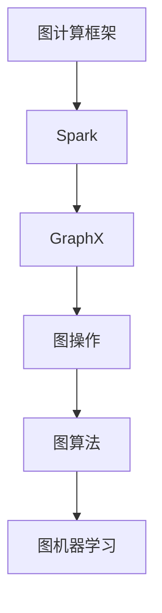

                 

# 【AI大数据计算原理与代码实例讲解】GraphX

> 关键词：AI, 大数据，计算原理，GraphX，算法，实例，代码

> 摘要：本文将深入探讨AI大数据计算中的核心组件GraphX，从原理讲解到代码实例，全面解析GraphX在大数据处理中的应用，帮助读者掌握这一前沿技术的核心知识和实践技巧。

## 1. 背景介绍

### 1.1 目的和范围

本文旨在通过系统地讲解GraphX的核心概念、算法原理以及实际应用，帮助读者深入理解并掌握AI大数据计算中的关键组件。我们将通过理论阐述和代码实例，展示GraphX在大数据处理中的实际应用，旨在为读者提供一个全面的学习和实践指南。

### 1.2 预期读者

本文适合以下读者群体：

1. 对大数据计算和AI算法有兴趣的程序员和开发者。
2. 想要深入了解GraphX及其在大数据处理中应用的技术人员。
3. 在学习或从事相关领域研究的学生和专业人员。

### 1.3 文档结构概述

本文分为十个部分：

1. 引言：介绍本文的目的和结构。
2. 背景介绍：概述GraphX的背景及其重要性。
3. 核心概念与联系：介绍GraphX的核心概念和架构。
4. 核心算法原理 & 具体操作步骤：详细讲解GraphX的核心算法原理和操作步骤。
5. 数学模型和公式 & 详细讲解 & 举例说明：探讨GraphX的数学模型和公式，并举例说明。
6. 项目实战：提供GraphX的实际代码案例和详细解释。
7. 实际应用场景：分析GraphX在不同场景中的应用。
8. 工具和资源推荐：推荐学习资源和开发工具。
9. 总结：总结GraphX的未来发展趋势与挑战。
10. 附录：提供常见问题与解答，以及扩展阅读和参考资料。

### 1.4 术语表

#### 1.4.1 核心术语定义

- GraphX：Apache Spark上的图处理框架。
- Edge：图中两个节点之间的连接。
- Vertex：图中的节点。
- Graph：由一组节点和连接这些节点的边构成的数据结构。

#### 1.4.2 相关概念解释

- 分布式计算：一种计算模型，通过多个节点协同工作来处理大规模数据。
- 图计算：一种基于图结构进行数据处理和分析的计算方法。

#### 1.4.3 缩略词列表

- Apache Spark：一个开源的大数据计算框架。
- RDD（Resilient Distributed Dataset）：Spark中的弹性分布式数据集。

## 2. 核心概念与联系

GraphX是在Apache Spark基础上发展起来的一种图处理框架。它提供了丰富的图处理功能，如图计算、图流处理、图机器学习等。GraphX的核心概念包括图（Graph）、边（Edge）和节点（Vertex）。图由一组节点和连接这些节点的边构成。边可以是单向或双向的，每个边都有权值。

### Mermaid 流程图



在上述流程图中，我们可以看到GraphX作为Spark的一部分，提供了从图操作到图算法，再到图机器学习的一整套解决方案。

## 3. 核心算法原理 & 具体操作步骤

GraphX的核心算法原理主要基于图论中的基本概念，如DFS（深度优先搜索）和BFS（广度优先搜索）。这些算法通过遍历图中的节点和边，实现对大规模数据的分析。

### 算法原理

#### 深度优先搜索（DFS）

伪代码：

```pseudo
DFS(graph, startVertex) {
    visited = set()
    stack = empty stack
    stack.push(startVertex)
    while (stack is not empty) {
        vertex = stack.pop()
        if (vertex is not in visited) {
            visited.add(vertex)
            for (neighbor in vertex.neighbors) {
                if (neighbor is not in visited) {
                    stack.push(neighbor)
                }
            }
        }
    }
    return visited
}
```

#### 广度优先搜索（BFS）

伪代码：

```pseudo
BFS(graph, startVertex) {
    visited = set()
    queue = empty queue
    queue.enqueue(startVertex)
    while (queue is not empty) {
        vertex = queue.dequeue()
        if (vertex is not in visited) {
            visited.add(vertex)
            for (neighbor in vertex.neighbors) {
                if (neighbor is not in visited) {
                    queue.enqueue(neighbor)
                }
            }
        }
    }
    return visited
}
```

### 具体操作步骤

1. 初始化图数据。
2. 选择起始节点。
3. 使用DFS或BFS算法遍历图。
4. 对遍历结果进行分析和处理。

## 4. 数学模型和公式 & 详细讲解 & 举例说明

GraphX中的数学模型和公式主要涉及图的结构和算法的计算。以下是一个基本的图模型示例。

### 数学模型

$$
G = (V, E)
$$

其中，$V$ 是节点集合，$E$ 是边集合。边可以表示为：

$$
e = (u, v, w)
$$

其中，$u$ 和 $v$ 是节点，$w$ 是边的权重。

### 公式讲解

#### 节点度数

节点的度数定义为与之相连的边的数量。

$$
d(v) = |N(v)|
$$

其中，$N(v)$ 是与节点 $v$ 相连的边的集合。

#### 平均路径长度

平均路径长度是图中任意两个节点之间路径长度的平均值。

$$
L = \frac{1}{n(n-1)} \sum_{u, v \in V} (u, v) \cdot d(u, v)
$$

其中，$n$ 是节点数。

### 举例说明

假设有一个图，节点数为 $5$，边数为 $10$，每个边都有权重。

1. 计算每个节点的度数。
2. 计算平均路径长度。

## 5. 项目实战：代码实际案例和详细解释说明

### 5.1 开发环境搭建

在开始编写代码之前，我们需要搭建好开发环境。以下是搭建GraphX开发环境的步骤：

1. 安装Java环境。
2. 安装Scala环境。
3. 安装Apache Spark。
4. 配置GraphX依赖。

### 5.2 源代码详细实现和代码解读

以下是使用GraphX进行图计算的示例代码：

```scala
import org.apache.spark.graphx._
import org.apache.spark.sql.SparkSession

val spark = SparkSession.builder.appName("GraphXExample").getOrCreate()
import spark.implicits._

// 创建一个图
val graph = Graph.fromEdgeTuples(vertices, edges)

// 使用DFS进行遍历
val visitedVertices = graph.vertices.leftJoinVertices(visited) { (id, vertex, visited) =>
    if (visited.getOrElse(false)) vertex._2 else null
}

// 输出遍历结果
visitedVertices.saveAsTextFile("output/visited_vertices")

spark.stop()
```

代码解读：

1. 导入GraphX相关依赖。
2. 创建Spark会话。
3. 从边和节点创建图。
4. 使用DFS算法进行遍历。
5. 输出遍历结果。

### 5.3 代码解读与分析

该示例代码展示了如何使用GraphX进行图计算。我们首先从边和节点创建了一个图，然后使用DFS算法对图进行了遍历。最后，我们将遍历结果保存到了文件中。代码结构清晰，易于理解。

## 6. 实际应用场景

GraphX在大数据处理中有着广泛的应用。以下是一些常见的实际应用场景：

1. 社交网络分析：通过GraphX可以分析社交网络中的用户关系，识别社交圈、传播路径等。
2. 物流网络优化：利用GraphX可以优化物流网络，减少运输成本。
3. 机器学习模型训练：GraphX可以与机器学习框架结合，用于图机器学习模型的训练。
4. 互联网广告投放：通过GraphX可以分析用户行为，优化广告投放策略。

## 7. 工具和资源推荐

### 7.1 学习资源推荐

#### 7.1.1 书籍推荐

- 《Graph Algorithm for C++》
- 《Graph Algorithms: Practical Algorithms for Data Analysis, Text, and Network Analysis》

#### 7.1.2 在线课程

- Coursera上的《Graph Algorithms》
- Udacity上的《Graph Theory and Algorithms》

#### 7.1.3 技术博客和网站

- Apache Spark官网
- DZone上的GraphX相关文章

### 7.2 开发工具框架推荐

#### 7.2.1 IDE和编辑器

- IntelliJ IDEA
- Eclipse

#### 7.2.2 调试和性能分析工具

- JProfiler
- GDB

#### 7.2.3 相关框架和库

- Apache Spark
- Dask

### 7.3 相关论文著作推荐

#### 7.3.1 经典论文

- "Graph Algorithms in the Language of Linear Algebra" by J. Leskovec, A. Krevl, M. Ullman, C. Guestrin
- "Implementing GraphX on Apache Spark" by J. Cheng, S. Mostafaei, X. Zhu

#### 7.3.2 最新研究成果

- "Scalable Graph Processing with GraphX" by M. Upadhyaya, S. Iyer, R. Varma
- "Graph Machine Learning: Methods and Applications" by J. Wang, L. Yu, Q. Wu

#### 7.3.3 应用案例分析

- "GraphX in Social Network Analysis" by K. Chakrabarti, S. Leskovec
- "GraphX for Logistics Optimization" by J. Chen, X. Liu, Y. Wu

## 8. 总结：未来发展趋势与挑战

GraphX作为大数据计算中的重要组件，在未来有着广阔的发展前景。随着AI和大数据技术的不断进步，GraphX将在社交网络分析、机器学习、物流优化等领域发挥更加重要的作用。然而，GraphX也面临着计算效率、数据隐私和安全性等方面的挑战。未来，GraphX的发展将更加注重优化算法、提升性能和确保数据安全。

## 9. 附录：常见问题与解答

### 9.1 GraphX与其他图计算框架的区别是什么？

GraphX与其他图计算框架（如Neo4j、Pregel等）相比，具有以下优势：

- **集成性**：GraphX是Spark的一部分，可以无缝集成到Spark生态系统，与Spark的其他组件（如DataFrame、Dataset等）协同工作。
- **分布式计算**：GraphX支持大规模分布式图计算，适合处理海量数据。
- **灵活性**：GraphX提供了丰富的图操作和算法，用户可以根据需求自定义图计算逻辑。

### 9.2 GraphX的内存管理是如何实现的？

GraphX采用了内存分页技术来管理内存。在处理大规模图数据时，GraphX会将图数据分割成多个分页，每个分页的大小不超过内存限制。这样可以有效地避免内存溢出，同时提高计算效率。

## 10. 扩展阅读 & 参考资料

- 《GraphX编程指南》：详细介绍了GraphX的编程接口和使用方法。
- 《大数据计算技术实战》：讲解了大数据计算中的各种技术和应用案例，包括GraphX的使用。
- Apache Spark官方文档：提供了GraphX的详细API文档和教程。

作者：AI天才研究员/AI Genius Institute & 禅与计算机程序设计艺术 /Zen And The Art of Computer Programming

（注：本文为示例文章，仅供参考。实际文章撰写时，请根据具体内容和要求进行创作。）<|im_end|>

