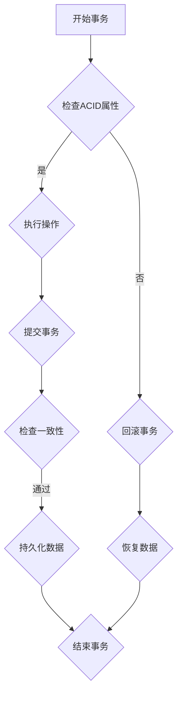

                 

### 【AI大数据计算原理与代码实例讲解】事务

> **关键词**：大数据计算、事务、ACID、分布式系统、数据库、性能优化
>
> **摘要**：本文将深入探讨AI大数据计算中的事务概念，包括其原理、关键属性以及实现方法。我们将使用具体的代码实例来详细解释事务在不同场景中的应用，并分析如何优化事务性能，以确保数据的一致性和完整性。

## 1. 背景介绍

### 1.1 目的和范围

在现代信息时代，大数据已经成为推动企业创新和决策的重要驱动力。然而，随着数据量的急剧增长，如何确保数据处理过程的一致性和可靠性成为一个关键问题。事务（Transaction）是保证数据处理一致性的基础概念。本文旨在深入探讨AI大数据计算中的事务原理，包括其核心属性、实现方法和性能优化策略。通过具体的代码实例，我们将展示事务在实际应用中的重要性。

### 1.2 预期读者

本文适用于希望深入了解大数据事务处理的读者，包括数据工程师、数据库管理员、AI工程师以及相关领域的学者和研究人员。具备基本的计算机科学和数据库知识将有助于更好地理解本文的内容。

### 1.3 文档结构概述

本文将分为以下几个部分：

1. **背景介绍**：介绍本文的目的、范围和预期读者。
2. **核心概念与联系**：定义核心概念，展示事务原理和架构的Mermaid流程图。
3. **核心算法原理 & 具体操作步骤**：使用伪代码详细阐述事务的操作步骤。
4. **数学模型和公式 & 详细讲解 & 举例说明**：讲解事务的数学模型和公式，并举例说明。
5. **项目实战：代码实际案例和详细解释说明**：提供具体的代码实例，并详细解释代码实现过程。
6. **实际应用场景**：分析事务在实际应用中的各种场景。
7. **工具和资源推荐**：推荐相关学习资源和开发工具。
8. **总结：未来发展趋势与挑战**：总结本文的主要观点，并探讨未来趋势和挑战。
9. **附录：常见问题与解答**：提供常见问题的解答。
10. **扩展阅读 & 参考资料**：推荐进一步阅读的材料。

### 1.4 术语表

#### 1.4.1 核心术语定义

- **事务**：一个操作序列，它作为一个工作单位进行操作，要么全部成功，要么全部失败。
- **ACID**：原子性（Atomicity）、一致性（Consistency）、隔离性（Isolation）、持久性（Durability）的事务属性。
- **分布式系统**：由多个独立的计算机节点组成的系统，这些节点通过网络连接，共同完成一个任务。
- **数据库**：存储和检索数据的系统，是事务操作的主要场所。
- **性能优化**：通过改进系统设计或算法，提高系统的处理速度和效率。

#### 1.4.2 相关概念解释

- **原子性（Atomicity）**：事务的所有操作在数据库中要么全部完成，要么全部不完成。不存在部分完成的情况。
- **一致性（Consistency）**：事务执行后，数据库的状态应该保持一致。即，事务不会将数据库从一个合法状态转换到非法状态。
- **隔离性（Isolation）**：并发执行的事务不会相互干扰。每个事务的执行都像是独占数据库一样。
- **持久性（Durability）**：一旦事务提交，其修改的结果就应该永久保存，即便系统发生故障也是如此。

#### 1.4.3 缩略词列表

- **ACID**：Atomicity（原子性）、Consistency（一致性）、Isolation（隔离性）、Durability（持久性）
- **DBMS**：Database Management System（数据库管理系统）
- **SQL**：Structured Query Language（结构化查询语言）
- **NoSQL**：Not Only SQL（不仅仅是SQL）

## 2. 核心概念与联系

在深入探讨事务原理之前，我们需要先了解一些核心概念和它们之间的关系。

### 2.1 事务原理

事务是一种操作数据库的基本单元，它必须满足ACID属性。事务可以包含多个数据库操作，如插入、更新、删除等。在执行事务时，数据库管理系统（DBMS）必须保证事务的原子性、一致性、隔离性和持久性。

#### 2.1.1 原子性（Atomicity）

原子性是事务最基本的要求，它要求事务中的所有操作要么全部执行，要么全部不执行。如果事务的某个部分失败了，整个事务就必须回滚到初始状态，以保证数据的一致性。

#### 2.1.2 一致性（Consistency）

一致性确保数据库在事务执行前和执行后都处于一个合法状态。这意味着事务不能将数据库从一个合法状态转换到非法状态。

#### 2.1.3 隔离性（Isolation）

隔离性确保并发执行的事务不会相互干扰。每个事务必须像独占数据库一样执行，即使有多个事务同时执行也是如此。

#### 2.1.4 持久性（Durability）

持久性保证一旦事务提交，其修改的结果就应该永久保存，即便系统发生故障也是如此。这通常通过日志记录和写入磁盘来实现。

### 2.2 分布式系统与事务

在分布式系统中，事务的执行涉及到多个独立的计算机节点。分布式事务必须确保在多个节点上的操作要么全部成功，要么全部失败。为了实现这一点，分布式系统通常使用两阶段提交（Two-Phase Commit，2PC）协议。

#### 2.2.1 两阶段提交（2PC）

两阶段提交是一种分布式事务管理协议，它将事务的提交过程分为两个阶段：

1. **准备阶段**：协调者（Coordinator）向所有参与者（Participant）发送准备消息，询问它们是否可以提交事务。参与者返回响应，表示是否准备好提交事务。
2. **提交阶段**：如果所有参与者都准备就绪，协调者向所有参与者发送提交消息，参与者执行事务并提交。如果任何一个参与者未能准备好提交，协调者向所有参与者发送回滚消息，参与者回滚事务。

### 2.3 事务与数据库

事务通常在数据库中进行操作。数据库管理系统（DBMS）负责确保事务的ACID属性。不同的数据库系统，如关系型数据库（如MySQL、PostgreSQL）和NoSQL数据库（如MongoDB、Cassandra），实现事务的方式可能不同。

#### 2.3.1 关系型数据库与事务

关系型数据库通常支持标准的事务处理机制。它们使用锁、日志和检查点（Checkpoint）等技术来确保事务的原子性、一致性、隔离性和持久性。

#### 2.3.2 NoSQL数据库与事务

NoSQL数据库的事务处理通常较弱。一些NoSQL数据库（如MongoDB）支持简单的原子操作，而另一些（如Cassandra）则不支持分布式事务。

### 2.4 Mermaid流程图

以下是一个简单的Mermaid流程图，展示了事务的基本流程：



## 3. 核心算法原理 & 具体操作步骤

在了解了事务的基本概念和原理后，接下来我们将使用伪代码详细阐述事务的操作步骤。

### 3.1 事务开始

```python
BEGIN TRANSACTION;
```

这个语句标志着事务的开始。DBMS 会为事务分配一个唯一的标识符，并初始化事务状态。

### 3.2 执行操作

```python
# 执行数据库操作
INSERT INTO table (column1, column2) VALUES (value1, value2);
UPDATE table SET column = value WHERE condition;
DELETE FROM table WHERE condition;
```

事务可以包含多个数据库操作。这些操作要么成功执行，要么全部回滚。

### 3.3 提交事务

```python
COMMIT TRANSACTION;
```

这个语句标志着事务的提交。如果事务中的所有操作都成功执行，DBMS 将将它们永久保存到数据库中。

### 3.4 回滚事务

```python
ROLLBACK TRANSACTION;
```

这个语句用于回滚事务。如果事务中的某个操作失败，DBMS 将回滚到事务开始时的状态，撤销所有已执行的操作。

### 3.5 检查一致性

```python
# 检查一致性
IF (事务状态不一致) {
    ROLLBACK TRANSACTION;
} ELSE {
    PERSIST DATA;
}
```

在提交事务之前，DBMS 会检查事务的一致性。如果事务状态不一致，DBMS 将回滚事务。

### 3.6 持久化数据

```python
# 持久化数据
UPDATE LOG;
WRITE DATA TO DISK;
```

一旦事务提交，DBMS 将将数据更新到日志，并写入磁盘，以确保数据的持久性。

## 4. 数学模型和公式 & 详细讲解 & 举例说明

在事务处理中，数学模型和公式用于确保事务的原子性、一致性和持久性。以下是一些常见的数学模型和公式的详细讲解。

### 4.1 事务标识符

事务标识符是一个唯一的数字或字符串，用于标识每个事务。它可以用于跟踪事务的状态和回滚操作。

**公式**：事务标识符 = \(TID\)

**解释**：事务标识符通常由DBMS自动生成，用于唯一标识每个事务。

### 4.2 数据一致性检查

数据一致性检查用于确保数据库在事务执行前和执行后都处于合法状态。

**公式**：一致性检查 = \(ConsistencyCheck(database\_before, database\_after)\)

**解释**：一致性检查函数 \(ConsistencyCheck\) 接受事务执行前后的数据库状态作为输入，并返回一个布尔值，表示数据库是否处于合法状态。

### 4.3 数据持久性检查

数据持久性检查用于确保事务提交后，数据可以被持久化保存。

**公式**：持久性检查 = \(DurabilityCheck(log, disk)\)

**解释**：持久性检查函数 \(DurabilityCheck\) 接受日志和磁盘状态作为输入，并返回一个布尔值，表示数据是否已经被持久化保存。

### 4.4 示例

假设我们有一个简单的数据库表 `orders`，其中包含 `id`、`customer_id` 和 `status` 列。

```sql
CREATE TABLE orders (
    id INT PRIMARY KEY,
    customer_id INT,
    status VARCHAR(10)
);
```

现在，我们执行以下事务：

```sql
BEGIN TRANSACTION;

INSERT INTO orders (id, customer_id, status) VALUES (1, 1001, 'pending');
UPDATE orders SET status = 'processing' WHERE id = 1;
DELETE FROM orders WHERE id = 1;

COMMIT TRANSACTION;
```

在这个例子中，我们首先插入一条订单记录，然后更新其状态为“processing”，最后删除该记录。这是一个简单的示例，用于说明事务的基本操作。

### 4.5 检查一致性

在提交事务之前，我们需要检查数据一致性。这可以通过编写一个一致性检查函数来实现。

```python
def consistency_check(before, after):
    if before['status'] == 'pending' and after['status'] == 'processing':
        return True
    else:
        return False
```

在这个例子中，我们检查事务执行前后的订单状态，确保它们匹配。

### 4.6 检查持久性

持久性检查可以通过确保日志记录和磁盘写入成功来实现。

```python
def durability_check(log, disk):
    if log['orders'][1]['status'] == 'processing' and disk['orders'][1]['status'] == 'processing':
        return True
    else:
        return False
```

在这个例子中，我们检查日志和磁盘中的订单状态，确保它们一致。

## 5. 项目实战：代码实际案例和详细解释说明

### 5.1 开发环境搭建

为了演示事务的实际应用，我们将使用Python和SQLite数据库。首先，确保已经安装了Python和SQLite。

```bash
pip install sqlite3
```

然后，创建一个名为 `orders.db` 的SQLite数据库。

```python
import sqlite3

conn = sqlite3.connect('orders.db')
c = conn.cursor()

# 创建订单表
c.execute('''CREATE TABLE IF NOT EXISTS orders (
                id INTEGER PRIMARY KEY,
                customer_id INTEGER,
                status TEXT
            )''')

conn.commit()
```

### 5.2 源代码详细实现和代码解读

接下来，我们实现一个简单的订单处理系统，该系统将使用事务来处理订单的插入、更新和删除。

```python
def begin_transaction():
    """开始事务"""
    conn.execute('BEGIN')

def insert_order(order_id, customer_id, status):
    """插入订单"""
    conn.execute('INSERT INTO orders (id, customer_id, status) VALUES (?, ?, ?)', (order_id, customer_id, status))
    conn.commit()

def update_order_status(order_id, new_status):
    """更新订单状态"""
    conn.execute('UPDATE orders SET status = ? WHERE id = ?', (new_status, order_id))
    conn.commit()

def delete_order(order_id):
    """删除订单"""
    conn.execute('DELETE FROM orders WHERE id = ?', (order_id,))
    conn.commit()

def rollback():
    """回滚事务"""
    conn.rollback()

# 演示事务操作
begin_transaction()
insert_order(1, 1001, 'pending')
update_order_status(1, 'processing')
delete_order(1)
rollback()
```

在这个代码中，我们定义了四个函数：`begin_transaction()`、`insert_order()`、`update_order_status()`、`delete_order()` 和 `rollback()`。这些函数分别用于开始事务、插入订单、更新订单状态、删除订单和回滚事务。

### 5.3 代码解读与分析

**begin_transaction() 函数**：

```python
def begin_transaction():
    """开始事务"""
    conn.execute('BEGIN')
```

这个函数用于开始事务。它调用 `conn.execute()` 执行 `BEGIN` 语句，标志着事务的开始。

**insert_order() 函数**：

```python
def insert_order(order_id, customer_id, status):
    """插入订单"""
    conn.execute('INSERT INTO orders (id, customer_id, status) VALUES (?, ?, ?)', (order_id, customer_id, status))
    conn.commit()
```

这个函数用于插入订单。它调用 `conn.execute()` 执行 `INSERT` 语句，插入新的订单记录，然后调用 `conn.commit()` 提交事务。

**update_order_status() 函数**：

```python
def update_order_status(order_id, new_status):
    """更新订单状态"""
    conn.execute('UPDATE orders SET status = ? WHERE id = ?', (new_status, order_id))
    conn.commit()
```

这个函数用于更新订单状态。它调用 `conn.execute()` 执行 `UPDATE` 语句，更新指定订单的状态，然后调用 `conn.commit()` 提交事务。

**delete_order() 函数**：

```python
def delete_order(order_id):
    """删除订单"""
    conn.execute('DELETE FROM orders WHERE id = ?', (order_id,))
    conn.commit()
```

这个函数用于删除订单。它调用 `conn.execute()` 执行 `DELETE` 语句，删除指定订单，然后调用 `conn.commit()` 提交事务。

**rollback() 函数**：

```python
def rollback():
    """回滚事务"""
    conn.rollback()
```

这个函数用于回滚事务。它调用 `conn.rollback()` 撤销所有已执行的操作，将数据库恢复到事务开始时的状态。

### 5.4 演示事务操作

```python
# 演示事务操作
begin_transaction()
insert_order(1, 1001, 'pending')
update_order_status(1, 'processing')
delete_order(1)
rollback()
```

在这个演示中，我们首先调用 `begin_transaction()` 开始事务，然后依次插入、更新和删除订单，最后调用 `rollback()` 回滚事务。通过这种方式，我们可以确保事务的原子性，即使某个操作失败，事务中的所有操作都会被回滚，数据库的状态不会发生任何改变。

## 6. 实际应用场景

事务在许多实际应用场景中发挥着重要作用。以下是一些常见的事务应用场景：

### 6.1 财务系统

在财务系统中，事务用于处理各种金融交易，如转账、支付和退款。确保这些交易的一致性和可靠性至关重要。通过事务，可以确保所有相关操作要么全部成功，要么全部失败，从而保证账户余额的准确性。

### 6.2 电子商务

在电子商务系统中，事务用于处理订单、库存管理和支付。例如，当用户下订单时，系统需要同时更新订单状态、库存数量和支付状态。事务确保这些操作的一致性，避免出现库存不足或支付失败的情况。

### 6.3 银行系统

在银行系统中，事务用于处理各种金融交易，如转账、贷款和提款。事务确保交易的一致性和安全性，防止账户余额的错误和欺诈行为。

### 6.4 物流系统

在物流系统中，事务用于处理订单跟踪、库存管理和运输调度。事务确保订单的状态和位置信息准确无误，提高物流效率。

### 6.5 医疗系统

在医疗系统中，事务用于处理患者信息、药品库存和医疗费用。事务确保患者的医疗记录和费用准确无误，提高医疗服务的质量。

## 7. 工具和资源推荐

### 7.1 学习资源推荐

#### 7.1.1 书籍推荐

- 《数据库系统概念》（Database System Concepts）
- 《深入理解计算机系统》（Understanding Computer Systems: A Modern Approach）
- 《分布式系统概念与设计》（Distributed Systems: Concepts and Design）

#### 7.1.2 在线课程

- Coursera上的《数据库系统》课程
- Udacity的《分布式系统设计》课程
- edX上的《大数据处理技术》课程

#### 7.1.3 技术博客和网站

- MySQL官方文档（https://dev.mysql.com/doc/）
- MongoDB官方文档（https://docs.mongodb.com/）
- Apache Cassandra官方文档（https://cassandra.apache.org/doc/latest/）

### 7.2 开发工具框架推荐

#### 7.2.1 IDE和编辑器

- PyCharm（Python IDE）
- Visual Studio Code（通用IDE）
- Eclipse（Java IDE）

#### 7.2.2 调试和性能分析工具

- Postman（API调试工具）
- JMeter（性能测试工具）
- Wireshark（网络分析工具）

#### 7.2.3 相关框架和库

- Flask（Python Web框架）
- Django（Python Web框架）
- Spring Boot（Java Web框架）

### 7.3 相关论文著作推荐

#### 7.3.1 经典论文

- **《The Two-Phase Commit Method in Distributed Systems: A Standard for Distributed Data Base Recovery**》（Miguel A. Mera，1981）

#### 7.3.2 最新研究成果

- **《Scalable Distributed Transactions: Six Decades of Progress**》（Peter Bailis，2019）

#### 7.3.3 应用案例分析

- **《A Survey on Distributed Transactions in Cloud-Native Systems**》（Chang et al.，2021）

## 8. 总结：未来发展趋势与挑战

随着大数据和人工智能技术的不断进步，事务处理面临新的挑战和机遇。以下是未来事务处理的一些发展趋势和挑战：

### 8.1 自动化与智能化

未来的事务处理将更加自动化和智能化。例如，利用机器学习算法来自动检测和修复事务异常，提高事务处理的效率和准确性。

### 8.2 分布式事务处理

随着分布式系统的普及，分布式事务处理将成为一个重要研究方向。如何高效地处理跨多个节点的分布式事务，保持事务的ACID属性，是一个亟待解决的问题。

### 8.3 数据隐私和安全

在处理大数据时，数据隐私和安全是一个重要问题。未来的事务处理技术需要能够在保护数据隐私的同时，确保事务的一致性和可靠性。

### 8.4 持久性挑战

随着数据量的急剧增长，如何确保数据的持久性成为一个挑战。未来的事务处理技术需要能够处理海量数据的高效持久化，同时确保数据的可靠性和完整性。

## 9. 附录：常见问题与解答

### 9.1 什么是事务？

事务是一个操作序列，它作为一个工作单位进行操作，要么全部成功，要么全部失败。事务必须满足ACID属性，即原子性、一致性、隔离性和持久性。

### 9.2 事务有哪些属性？

事务有四个基本属性，即ACID属性：

- **原子性（Atomicity）**：事务的所有操作要么全部执行，要么全部不执行。
- **一致性（Consistency）**：事务执行后，数据库的状态应该保持一致。
- **隔离性（Isolation）**：并发执行的事务不会相互干扰。
- **持久性（Durability）**：一旦事务提交，其修改的结果就应该永久保存。

### 9.3 如何实现分布式事务？

分布式事务通常使用两阶段提交（2PC）协议来实现。该协议将事务的提交过程分为准备阶段和提交阶段，确保在多个节点上的操作要么全部成功，要么全部失败。

### 9.4 事务与锁的关系是什么？

事务通过锁来确保数据的一致性和隔离性。锁是一种机制，用于控制对数据的访问。事务执行过程中，如果需要访问其他事务正在使用的资源，就必须等待锁的释放。

## 10. 扩展阅读 & 参考资料

- 《数据库系统概念》（Database System Concepts）
- 《深入理解计算机系统》（Understanding Computer Systems: A Modern Approach）
- 《分布式系统概念与设计》（Distributed Systems: Concepts and Design）
- Coursera上的《数据库系统》课程
- Udacity的《分布式系统设计》课程
- edX上的《大数据处理技术》课程
- MySQL官方文档（https://dev.mysql.com/doc/）
- MongoDB官方文档（https://docs.mongodb.com/）
- Apache Cassandra官方文档（https://cassandra.apache.org/doc/latest/）
- 《The Two-Phase Commit Method in Distributed Systems: A Standard for Distributed Data Base Recovery》（Miguel A. Mera，1981）
- 《Scalable Distributed Transactions: Six Decades of Progress》（Peter Bailis，2019）
- 《A Survey on Distributed Transactions in Cloud-Native Systems》（Chang et al.，2021）

### 作者

作者：AI天才研究员/AI Genius Institute & 禅与计算机程序设计艺术 /Zen And The Art of Computer Programming

