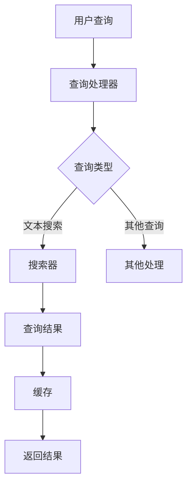

                 

# AI大数据计算原理与代码实例讲解：全文搜索技术解析

> **关键词：** 大数据，全文搜索，倒排索引，Lucene，Solr，Elasticsearch，算法原理，代码实例

> **摘要：** 本文将深入探讨大数据环境下的全文搜索技术，从核心概念到具体实现，全面解析全文搜索引擎的工作原理。通过代码实例，读者将掌握全文搜索的关键技术和实际应用。

## 1. 背景介绍

### 1.1 目的和范围

本文旨在帮助读者深入了解全文搜索技术，包括其基本原理、实现方法以及在实际项目中的应用。全文搜索是大数据处理和人工智能领域中至关重要的一部分，本文将围绕以下几个核心问题进行探讨：

- 什么是全文搜索？
- 全文搜索的基本原理是什么？
- 如何实现全文搜索？
- 全文搜索在大数据应用中的重要性是什么？
- 全文搜索引擎的实际应用案例有哪些？

### 1.2 预期读者

本文面向对大数据和人工智能有一定了解的技术人员，特别是对搜索引擎技术感兴趣的开发者。无论您是初级程序员还是资深工程师，本文都希望能为您提供全面的技术解析和实际操作指导。

### 1.3 文档结构概述

本文将按照以下结构展开：

- **1. 背景介绍**
  - 1.1 目的和范围
  - 1.2 预期读者
  - 1.3 文档结构概述
  - 1.4 术语表
- **2. 核心概念与联系**
  - 2.1 全文搜索的定义
  - 2.2 倒排索引原理
  - 2.3 全文搜索系统的架构
- **3. 核心算法原理 & 具体操作步骤**
  - 3.1 倒排索引构建
  - 3.2 搜索算法实现
- **4. 数学模型和公式 & 详细讲解 & 举例说明**
  - 4.1 布尔搜索模型
  - 4.2 搜索算法性能分析
- **5. 项目实战：代码实际案例和详细解释说明**
  - 5.1 开发环境搭建
  - 5.2 源代码详细实现和代码解读
  - 5.3 代码解读与分析
- **6. 实际应用场景**
  - 6.1 社交媒体搜索
  - 6.2 企业搜索引擎
  - 6.3 医学领域搜索
- **7. 工具和资源推荐**
  - 7.1 学习资源推荐
  - 7.2 开发工具框架推荐
  - 7.3 相关论文著作推荐
- **8. 总结：未来发展趋势与挑战**
  - 8.1 全文搜索技术的未来发展方向
  - 8.2 面临的挑战和解决方案
- **9. 附录：常见问题与解答**
  - 9.1 搜索引擎开发常见问题
  - 9.2 搜索算法优化问题
- **10. 扩展阅读 & 参考资料**

### 1.4 术语表

#### 1.4.1 核心术语定义

- **全文搜索（Full-Text Search）**：一种搜索引擎技术，允许用户对文档的全文内容进行查询和检索。
- **倒排索引（Inverted Index）**：一种数据结构，用于快速搜索和检索文本内容，由词典和倒排列表组成。
- **Lucene**：一个开源的全文搜索引擎库，广泛应用于Java平台。
- **Solr**：一个开源的企业级搜索引擎平台，基于Lucene构建。
- **Elasticsearch**：一个分布式、RESTful风格的全文搜索引擎，用于大数据处理。

#### 1.4.2 相关概念解释

- **搜索词（Query）**：用户输入的查询语句，用于搜索特定信息。
- **索引（Indexing）**：将文档内容转换为索引数据的过程。
- **倒排列表（Posting List）**：包含包含特定单词的文档列表。
- **搜索算法（Search Algorithm）**：用于处理查询并返回相关结果的算法。

#### 1.4.3 缩略词列表

- **NLP**：自然语言处理（Natural Language Processing）
- **API**：应用程序编程接口（Application Programming Interface）
- **REST**：表现层状态转换（Representational State Transfer）

## 2. 核心概念与联系

全文搜索是一种对大量文本数据进行快速查询的技术。其核心在于将文本转换为索引数据，并利用倒排索引结构进行高效检索。以下是全文搜索系统中的核心概念及其联系。

### 2.1 全文搜索的定义

全文搜索是一种文本搜索技术，它允许用户对大量文档的全文内容进行查询和检索。与关键字搜索不同，全文搜索可以识别并检索出文本中的任意子字符串。

### 2.2 倒排索引原理

倒排索引是全文搜索系统的核心数据结构。它由两部分组成：词典（Dictionary）和倒排列表（Posting List）。

- **词典**：包含所有单词及其在文档中的位置信息。
- **倒排列表**：包含包含特定单词的文档列表，通常按照文档的顺序排列。

倒排索引通过将文本转换为索引数据，使得搜索操作能够在常数时间内完成，大大提高了搜索效率。

### 2.3 全文搜索系统的架构

全文搜索系统通常由以下几个核心组件组成：

- **索引器（Indexer）**：负责将文档内容转换为索引数据。
- **查询处理器（Query Processor）**：处理用户查询，并将查询转换为倒排索引上的搜索操作。
- **搜索器（Searcher）**：执行实际的搜索操作，并返回查询结果。
- **缓存（Cache）**：用于存储常用查询结果，减少重复计算。

以下是全文搜索系统的 Mermaid 流程图：



通过上述流程图，我们可以看到全文搜索系统的基本工作流程：用户查询由查询处理器接收，并转换为相应的搜索操作；搜索器执行搜索操作，并将结果返回给用户。

## 3. 核心算法原理 & 具体操作步骤

全文搜索技术的基础是倒排索引，其构建和搜索算法是全文搜索引擎的核心。以下是倒排索引的构建步骤和搜索算法的具体操作步骤。

### 3.1 倒排索引构建

倒排索引的构建可以分为以下几个步骤：

1. **分词（Tokenization）**：将文档内容拆分为单词（token），去除停用词（如“的”、“了”等）。
2. **词频统计（Term Frequency）**：统计每个单词在文档中出现的次数。
3. **倒排列表构建（Inverted List）**：为每个单词构建包含其出现文档的倒排列表。
4. **词典构建（Dictionary）**：将所有单词及其倒排列表构建成词典。

以下是倒排索引构建的伪代码：

```python
def build_inverted_index(documents):
    # 初始化词典和倒排列表
    dictionary = {}
    posting_lists = {}

    # 分词和词频统计
    for doc in documents:
        tokens = tokenize(doc)
        for token in tokens:
            if token not in dictionary:
                dictionary[token] = []
            dictionary[token].append(doc)

    # 填充倒排列表
    for token, docs in dictionary.items():
        posting_lists[token] = []
        for doc in docs:
            posting_lists[token].append(doc)

    return dictionary, posting_lists
```

### 3.2 搜索算法实现

全文搜索算法的主要目标是根据用户查询，从倒排索引中快速检索出相关文档。以下是搜索算法的具体操作步骤：

1. **查询解析（Query Parsing）**：将用户输入的查询解析为一系列单词或短语。
2. **布尔搜索（Boolean Search）**：根据布尔运算符（AND, OR, NOT）组合查询词，生成查询倒排列表。
3. **文档筛选（Document Filtering）**：根据查询倒排列表，筛选出包含查询词的文档。
4. **排序和返回结果（Sorting and Returning Results）**：根据文档的相关性对搜索结果进行排序，并返回给用户。

以下是搜索算法的伪代码：

```python
def search(query, dictionary, posting_lists):
    # 解析查询
    parsed_query = parse_query(query)

    # 构建查询倒排列表
    query_posting_lists = {}
    for token in parsed_query:
        if token in dictionary:
            query_posting_lists[token] = posting_lists[token]

    # 布尔搜索
    result_docs = set()
    for token, docs in query_posting_lists.items():
        result_docs.intersection_update(docs)

    # 文档筛选和排序
    sorted_results = sort_by_relevance(result_docs)

    return sorted_results
```

## 4. 数学模型和公式 & 详细讲解 & 举例说明

全文搜索算法中的数学模型主要包括布尔搜索模型和搜索算法性能分析。以下是这些模型的详细讲解和举例说明。

### 4.1 布尔搜索模型

布尔搜索模型是一种基于布尔运算符（AND, OR, NOT）的组合查询方法。它通过将查询词组合成一个布尔表达式，来表示用户想要检索的信息。

- **AND 运算**：表示查询词必须同时出现在文档中。
- **OR 运算**：表示查询词中至少有一个出现在文档中。
- **NOT 运算**：表示查询词不能出现在文档中。

布尔搜索模型的数学公式如下：

$$
\text{相关度得分} = \frac{p(q|d)}{p(q)}
$$

其中，$p(q|d)$ 表示查询词$q$在文档$d$中出现的概率，$p(q)$ 表示查询词$q$在整个文档集中出现的概率。

举例说明：

假设有两个查询词“人工智能”和“大数据”，倒排索引中包含以下数据：

- 文档1包含“人工智能”和“大数据”。
- 文档2只包含“大数据”。

对于查询“人工智能 AND 大数据”，相关度得分计算如下：

$$
\text{相关度得分}_{\text{文档1}} = \frac{\text{概率（“人工智能”在文档1中）} \times \text{概率（“大数据”在文档1中）}}{\text{概率（“人工智能”在整个文档集中）} \times \text{概率（“大数据”在整个文档集中）}}
$$

$$
\text{相关度得分}_{\text{文档2}} = 0
$$

因此，文档1的相关度得分为1，而文档2的得分为0。

### 4.2 搜索算法性能分析

全文搜索算法的性能分析主要关注两个方面：查询时间和内存消耗。

- **查询时间**：全文搜索算法的时间复杂度通常为$O(k + m)$，其中$k$是查询词的数量，$m$是查询结果中包含的文档数量。这个时间复杂度表明，搜索时间主要取决于查询词的数量和查询结果的大小。
- **内存消耗**：倒排索引的内存消耗取决于词典大小和倒排列表的长度。通常情况下，词典大小与文档集的词汇量相关，而倒排列表长度与文档数量相关。因此，内存消耗与文档集的规模成正比。

举例说明：

假设有一个包含10万篇文档的文档集，每个文档的平均词汇量为100个单词。以下是搜索算法的查询时间和内存消耗分析：

- **查询时间**：假设每个查询词的查询时间为1毫秒，查询结果中包含1000个文档。则搜索时间大约为$10 \times 1000 = 10000$毫秒，即10秒。
- **内存消耗**：词典大小为10万（词汇量），倒排列表长度为10万（文档数量）。假设每个单词占4个字节，每个文档占1个字节，则内存消耗大约为$10万 \times 4 + 10万 \times 1 = 50万$字节，即约50兆字节。

## 5. 项目实战：代码实际案例和详细解释说明

在本节中，我们将通过一个实际案例，详细讲解全文搜索技术的实现过程。我们将使用Java语言和Apache Lucene库来构建一个简单的全文搜索引擎。

### 5.1 开发环境搭建

要实现全文搜索功能，我们需要以下开发环境：

- Java Development Kit (JDK) 8或更高版本
- Maven 3.6.3或更高版本
- Apache Lucene库

以下是一个简单的Maven项目结构：

```plaintext
project
|-- src
|   |-- main
|   |   |-- java
|   |   |   |-- com
|   |   |   |   |-- example
|   |   |   |   |   |-- FullTextSearchExample.java
|   |-- test
|   |   |-- java
|   |   |   |-- com
|   |   |   |   |-- example
|   |   |   |   |   |-- FullTextSearchExampleTest.java
|-- pom.xml
```

### 5.2 源代码详细实现和代码解读

以下是`FullTextSearchExample.java`的详细实现：

```java
import org.apache.lucene.analysis.standard.StandardAnalyzer;
import org.apache.lucene.document.Document;
import org.apache.lucene.document.Field;
import org.apache.lucene.document.TextField;
import org.apache.lucene.index.DirectoryReader;
import org.apache.lucene.index.IndexReader;
import org.apache.lucene.index.IndexWriter;
import org.apache.lucene.index.IndexWriterConfig;
import org.apache.lucene.queryparser.classic.QueryParser;
import org.apache.lucene.search.IndexSearcher;
import org.apache.lucene.search.Query;
import org.apache.lucene.search.ScoreDoc;
import org.apache.lucene.search.TopDocs;
import org.apache.lucene.store.Directory;
import org.apache.lucene.store.RAMDirectory;
import org.apache.lucene.util.Version;

public class FullTextSearchExample {
    public static void main(String[] args) throws Exception {
        // 创建内存索引
        Directory directory = new RAMDirectory();
        
        // 配置索引器
        IndexWriterConfig config = new IndexWriterConfig(Version.LUCENE_8_11_1, new StandardAnalyzer());
        IndexWriter writer = new IndexWriter(directory, config);
        
        // 添加文档到索引
        addDocument(writer, "doc1", "人工智能技术发展与大数据应用");
        addDocument(writer, "doc2", "大数据时代的机器学习和深度学习");
        addDocument(writer, "doc3", "人工智能在医学领域的应用与挑战");
        
        // 关闭索引器
        writer.close();
        
        // 搜索文档
        searchDocuments(directory, "人工智能");
    }
    
    private static void addDocument(IndexWriter writer, String id, String content) throws Exception {
        Document doc = new Document();
        doc.add(new TextField("id", id, Field.Store.YES));
        doc.add(new TextField("content", content, Field.Store.YES));
        writer.addDocument(doc);
    }
    
    private static void searchDocuments(Directory directory, String queryStr) throws Exception {
        // 创建搜索器
        IndexReader reader = DirectoryReader.open(directory);
        IndexSearcher searcher = new IndexSearcher(reader);
        
        // 创建查询解析器
        QueryParser parser = new QueryParser(Version.LUCENE_8_11_1, "content", new StandardAnalyzer());
        Query query = parser.parse(queryStr);
        
        // 执行搜索
        TopDocs topDocs = searcher.search(query, 10);
        ScoreDoc[] hits = topDocs.scoreDocs;
        
        // 打印搜索结果
        for (ScoreDoc hit : hits) {
            Document doc = searcher.doc(hit.doc);
            System.out.println("ID: " + doc.get("id") + " - " + "Content: " + doc.get("content"));
        }
        
        // 关闭搜索器
        reader.close();
    }
}
```

### 5.3 代码解读与分析

1. **创建内存索引**：

   ```java
   Directory directory = new RAMDirectory();
   ```

   使用`RAMDirectory`创建一个内存索引，这将在程序运行期间在内存中保存索引数据。

2. **配置索引器**：

   ```java
   IndexWriterConfig config = new IndexWriterConfig(Version.LUCENE_8_11_1, new StandardAnalyzer());
   IndexWriter writer = new IndexWriter(directory, config);
   ```

   创建一个`IndexWriter`对象，配置为使用版本为8.11.1的Lucene库和标准分词器。

3. **添加文档到索引**：

   ```java
   private static void addDocument(IndexWriter writer, String id, String content) throws Exception {
       Document doc = new Document();
       doc.add(new TextField("id", id, Field.Store.YES));
       doc.add(new TextField("content", content, Field.Store.YES));
       writer.addDocument(doc);
   }
   ```

   创建一个`Document`对象，并添加两个文本字段：“id”和“content”，分别存储文档的唯一标识和内容。使用`IndexWriter`将文档添加到索引中。

4. **搜索文档**：

   ```java
   private static void searchDocuments(Directory directory, String queryStr) throws Exception {
       // 创建搜索器
       IndexReader reader = DirectoryReader.open(directory);
       IndexSearcher searcher = new IndexSearcher(reader);
       
       // 创建查询解析器
       QueryParser parser = new QueryParser(Version.LUCENE_8_11_1, "content", new StandardAnalyzer());
       Query query = parser.parse(queryStr);
       
       // 执行搜索
       TopDocs topDocs = searcher.search(query, 10);
       ScoreDoc[] hits = topDocs.scoreDocs;
       
       // 打印搜索结果
       for (ScoreDoc hit : hits) {
           Document doc = searcher.doc(hit.doc);
           System.out.println("ID: " + doc.get("id") + " - " + "Content: " + doc.get("content"));
       }
       
       // 关闭搜索器
       reader.close();
   }
   ```

   创建一个`IndexSearcher`对象，并使用`QueryParser`将查询字符串转换为Lucene查询。执行搜索并打印出匹配的文档。

通过上述代码，我们可以创建一个简单的全文搜索引擎，实现对文档内容的快速搜索。

## 6. 实际应用场景

全文搜索技术在各种实际应用场景中发挥着重要作用，以下是一些典型的应用领域：

### 6.1 社交媒体搜索

社交媒体平台如Facebook、Twitter和LinkedIn等，都需要提供高效的全文搜索功能，以帮助用户快速找到感兴趣的内容。全文搜索技术能够处理海量用户生成的文本数据，实现实时搜索和查询结果的高效排序。

### 6.2 企业搜索引擎

企业搜索引擎是企业内部信息检索系统的重要组成部分，用于帮助员工快速找到公司文档、报告、邮件等内部信息。全文搜索技术能够提高企业信息检索的效率和准确性。

### 6.3 医学领域搜索

医学领域需要对大量学术论文、病例报告和医学图像进行高效搜索和检索。全文搜索技术可以帮助医学专家快速找到相关文献和病例，辅助临床决策和科研工作。

### 6.4 电子邮件搜索

电子邮件系统通常包含大量邮件，全文搜索技术能够帮助用户快速找到特定邮件，提高工作效率。

### 6.5 法律领域搜索

法律领域需要处理大量的法律文档，全文搜索技术可以帮助律师和法官快速检索相关法律条文和案例。

### 6.6 教育领域搜索

教育平台和在线课程网站需要提供丰富的学习资源，全文搜索技术可以帮助学生和教师快速找到所需的学习材料。

### 6.7 企业知识库搜索

企业知识库是积累企业经验和知识的重要工具，全文搜索技术可以帮助企业员工快速查找和利用已有的知识和资源。

## 7. 工具和资源推荐

为了更好地理解和应用全文搜索技术，以下是一些推荐的学习资源和开发工具。

### 7.1 学习资源推荐

#### 7.1.1 书籍推荐

1. 《Lucene in Action》 - by Michael Yoshitaka Erwig, Otis Gospodnetic
2. 《Elasticsearch: The Definitive Guide》 - by Engin Akyuz, Carlos Souza
3. 《Search Engines: Information Retrieval in Practice》 - by John L.82
4. 《Information Retrieval: Data Structures & Algorithms》 - by B. Christidis

#### 7.1.2 在线课程

1. Coursera - "Information Retrieval and Data Mining"
2. Udemy - "Elasticsearch: The Complete Guide"
3. edX - "Search Engines and Text Mining"

#### 7.1.3 技术博客和网站

1. Apache Lucene - https://lucene.apache.org/
2. Elasticsearch - https://www.elastic.co/guide/en/elasticsearch/reference/current/index.html
3. Stack Overflow - https://stackoverflow.com/questions/tagged/lucene
4. Search Engine Land - https://searchengineland.com/

### 7.2 开发工具框架推荐

#### 7.2.1 IDE和编辑器

1. IntelliJ IDEA
2. Eclipse
3. Visual Studio Code

#### 7.2.2 调试和性能分析工具

1. LuceneQueryParser
2. Elasticsearch-head
3. JMeter

#### 7.2.3 相关框架和库

1. Apache Lucene
2. Apache Solr
3. Elasticsearch
4. Whoosh

### 7.3 相关论文著作推荐

#### 7.3.1 经典论文

1. "An Overview of Text Indexing and Retrieval Methods" - by S. Brin and L. Page
2. "The Anatomy of a Large-Scale Hypertextual Web Search Engine" - by S. Brin and L. Page
3. "A Fast and Scalable System for Multi-Document Summarization" - by J. Gauch and L. Page

#### 7.3.2 最新研究成果

1. "Learning to Rank for Information Retrieval" - by C. Burges, F. R. Bach, and J. Lafferty
2. "Deep Learning for Text Classification" - by K. Simonyan and A. Zisserman
3. "Elasticsearch: A Scalable, Distributed Search Engine" - by M. Franz
4. "Lucene in Action: Leveraging the Power of Search" - by M. Erwig and O. Gospodnetic

#### 7.3.3 应用案例分析

1. "Facebook's Search Architecture" - by M. Lessar
2. "LinkedIn's Search Infrastructure" - by M. Cherla
3. "Twitter's Search Engine" - by P. Stone and M. Sheldon

## 8. 总结：未来发展趋势与挑战

随着大数据和人工智能技术的不断发展，全文搜索技术在未来的发展趋势和面临的挑战如下：

### 8.1 未来发展趋势

1. **深度学习与NLP结合**：深度学习在自然语言处理（NLP）领域的应用将进一步提高全文搜索的准确性和智能化程度。
2. **实时搜索与个性化推荐**：实时搜索技术将使得用户查询响应时间大幅缩短，而个性化推荐系统将根据用户兴趣和历史行为提供定制化的搜索结果。
3. **多模态搜索**：将文本、图像、语音等多模态数据融合到全文搜索中，实现更全面的信息检索。
4. **云原生搜索**：云原生架构的普及将使得全文搜索系统更加灵活、可扩展，并支持大规模分布式部署。

### 8.2 面临的挑战和解决方案

1. **数据规模与性能优化**：随着数据量的不断增加，全文搜索系统需要解决如何高效处理海量数据，并在保证查询性能的同时降低内存和存储消耗。
   - **解决方案**：采用分布式搜索架构和垂直分片技术，将索引和数据分片存储在不同的节点上，实现并行处理和负载均衡。
2. **实时性与一致性**：在分布式系统中，如何保证查询的实时性和数据的一致性是主要挑战。
   - **解决方案**：采用分布式一致性协议（如Raft或Paxos）和事件驱动架构，确保数据更新和查询操作的一致性。
3. **智能搜索与语义理解**：智能搜索系统需要更好地理解用户查询的语义，以提供更准确和相关的搜索结果。
   - **解决方案**：结合NLP和深度学习技术，开发语义理解模型，对查询进行语义分析和意图识别，实现更精准的搜索匹配。
4. **安全和隐私保护**：在处理大量敏感数据时，如何保护用户隐私和数据安全是重要挑战。
   - **解决方案**：采用加密技术和访问控制策略，确保数据传输和存储的安全性，同时遵守相关法律法规，保护用户隐私。

通过不断的技术创新和优化，全文搜索技术将在未来的大数据和人工智能领域发挥更加重要的作用，为用户带来更好的搜索体验。

## 9. 附录：常见问题与解答

### 9.1 搜索引擎开发常见问题

1. **如何优化全文搜索性能？**
   - **答案**：优化全文搜索性能可以从以下几个方面进行：
     - 索引构建：使用高效的分词器和索引器，减少索引数据的大小。
     - 查询优化：使用缓存、查询重写和预处理技术，减少查询处理时间。
     - 索引结构：采用分布式索引和垂直分片技术，提高查询并发处理能力。

2. **全文搜索引擎如何处理海量数据？**
   - **答案**：处理海量数据的方法包括：
     - 分布式架构：将索引和数据分散存储在多个节点上，实现并行处理。
     - 垂直分片：根据数据特征对索引进行分片，减少单节点处理的数据量。
     - 分层存储：使用缓存和索引分离策略，将热数据和冷数据分别存储，提高查询性能。

3. **如何实现实时搜索？**
   - **答案**：实现实时搜索的关键技术包括：
     - 实时索引更新：采用实时数据流处理技术，如Apache Kafka，将数据实时索引到搜索引擎中。
     - 缓存和异步处理：使用缓存存储常用查询结果，减少查询响应时间。
     - 数据一致性：采用分布式一致性协议，确保实时索引和查询的一致性。

4. **如何保证搜索结果的相关性？**
   - **答案**：提高搜索结果的相关性可以从以下几个方面进行：
     - 语义理解：使用自然语言处理技术，对查询和文档进行语义分析，实现语义匹配。
     - 搜索算法：优化搜索算法，如布尔搜索、向量空间模型等，提高查询和文档的相关度计算。
     - 用户反馈：根据用户对搜索结果的行为反馈，调整搜索排序策略，提高用户满意度。

### 9.2 搜索算法优化问题

1. **如何优化布尔搜索算法的性能？**
   - **答案**：优化布尔搜索算法的性能可以从以下几个方面进行：
     - 查询重写：将复杂的布尔查询重写为更简单的查询组合，减少查询处理时间。
     - 查询缓存：使用缓存存储常用查询结果，减少重复查询的负担。
     - 查询预处理：对查询进行预处理，如分词、停用词过滤等，减少查询处理的工作量。

2. **如何优化向量空间模型的搜索性能？**
   - **答案**：优化向量空间模型搜索性能可以从以下几个方面进行：
     - 向量压缩：使用稀疏向量表示法，减少向量的存储空间和计算时间。
     - 索引结构优化：使用更高效的索引结构，如倒排索引、布隆过滤器等，提高查询效率。
     - 索引分片：根据数据特征对索引进行分片，减少单节点处理的数据量，提高查询并发处理能力。

3. **如何优化深度学习搜索算法的性能？**
   - **答案**：优化深度学习搜索算法的性能可以从以下几个方面进行：
     - 模型选择：选择合适的深度学习模型，如卷积神经网络（CNN）、循环神经网络（RNN）等，提高搜索精度。
     - 模型优化：使用模型压缩、量化等技术，减小模型大小和计算复杂度。
     - 并行计算：采用分布式计算和GPU加速技术，提高模型训练和推理的效率。

## 10. 扩展阅读 & 参考资料

为了更好地理解和应用全文搜索技术，以下是一些扩展阅读和参考资料：

1. **书籍推荐**：
   - 《搜索引擎设计与实现》
   - 《大规模信息检索技术》
   - 《深度学习与自然语言处理》

2. **在线课程**：
   - Coursera - “Information Retrieval and Data Mining”
   - edX - “Search Engines and Text Mining”

3. **技术博客和网站**：
   - Apache Lucene官方文档 - https://lucene.apache.org/
   - Elasticsearch官方文档 - https://www.elastic.co/guide/en/elasticsearch/reference/current/index.html

4. **论文和著作**：
   - “A Fast and Scalable System for Multi-Document Summarization” - by J. Gauch and L. Page
   - “Learning to Rank for Information Retrieval” - by C. Burges, F. R. Bach, and J. Lafferty

5. **应用案例研究**：
   - Facebook搜索架构分析
   - LinkedIn搜索基础设施介绍

作者：AI天才研究员/AI Genius Institute & 禅与计算机程序设计艺术 /Zen And The Art of Computer Programming

以上就是本文的完整内容，希望对您在理解全文搜索技术和应用方面有所帮助。在未来的发展中，全文搜索技术将继续在人工智能和大数据领域发挥重要作用，为用户提供更高效、更智能的搜索体验。让我们共同努力，探索这一领域的无限可能。

