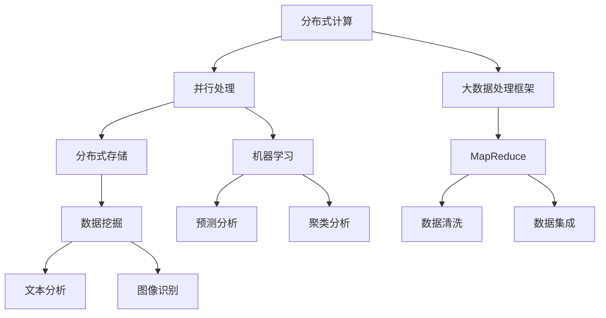

                 

## 【AI大数据计算原理与代码实例讲解】分区

> 关键词：AI、大数据、计算原理、代码实例、分布式计算、并行处理、数据处理框架

> 摘要：本文将深入探讨人工智能（AI）在大数据处理中的应用原理，通过详细讲解计算原理和代码实例，帮助读者理解分布式计算和并行处理在大数据环境下的应用。文章结构清晰，从背景介绍到核心算法原理，再到实际应用场景和工具推荐，旨在为读者提供一个全面的技术指导。

## 1. 背景介绍

### 1.1 目的和范围

本文旨在深入探讨人工智能（AI）在大数据处理中的应用原理。随着数据规模的不断扩大，传统的单机数据处理方式已经难以满足需求，分布式计算和并行处理技术应运而生。本文将详细讲解这些核心计算原理，并通过实际代码实例，帮助读者理解并掌握这些技术。

本文的范围包括：

- 分布式计算的基本概念和原理
- 并行处理在大数据环境中的应用
- 大数据处理框架（如Hadoop、Spark等）的核心算法原理
- 实际代码实例讲解和性能分析

### 1.2 预期读者

本文适用于以下读者群体：

- 对人工智能和大数据处理有兴趣的计算机科学专业学生
- 想要在工作中应用分布式计算和并行处理技术的程序员
- 意图深入了解大数据处理框架的架构师和工程师
- 对AI大数据计算原理感兴趣的AI爱好者和研究者

### 1.3 文档结构概述

本文结构如下：

- 第1部分：背景介绍，包括目的和范围、预期读者、文档结构概述等
- 第2部分：核心概念与联系，包括核心概念原理和架构的Mermaid流程图
- 第3部分：核心算法原理与具体操作步骤，使用伪代码详细阐述
- 第4部分：数学模型和公式，详细讲解并举例说明
- 第5部分：项目实战，包括代码实际案例和详细解释说明
- 第6部分：实际应用场景，探讨AI大数据计算在不同领域的应用
- 第7部分：工具和资源推荐，包括学习资源、开发工具框架和论文著作推荐
- 第8部分：总结，讨论未来发展趋势与挑战
- 第9部分：附录，包括常见问题与解答
- 第10部分：扩展阅读与参考资料，提供更多深入学习的资源

### 1.4 术语表

#### 1.4.1 核心术语定义

- **分布式计算**：将任务分配到多个计算节点上并行执行，从而提高计算效率和可扩展性。
- **并行处理**：在同一时间或短时间内同时处理多个任务或数据。
- **大数据**：数据量巨大，无法用传统数据处理方式进行分析和处理。
- **数据处理框架**：用于高效处理大规模数据的软件框架，如Hadoop、Spark等。
- **MapReduce**：一种分布式数据处理框架，用于处理大规模数据集。

#### 1.4.2 相关概念解释

- **Hadoop**：一个开源的分布式计算框架，主要用于处理大规模数据集。
- **Spark**：一个快速的分布式计算系统，提供了用于大规模数据处理的高级API。
- **分布式存储**：将数据分散存储在多个节点上，提高数据可靠性和访问速度。
- **数据挖掘**：从大量数据中提取有用信息和知识。

#### 1.4.3 缩略词列表

- **HDFS**：Hadoop分布式文件系统（Hadoop Distributed File System）
- **YARN**：资源调度框架（Yet Another Resource Negotiator）
- **Hive**：一个基于Hadoop的数据仓库工具
- **HBase**：一个分布式、可扩展的列式存储系统
- **MLlib**：Spark的机器学习库

## 2. 核心概念与联系

在探讨AI大数据计算之前，我们需要了解一些核心概念和它们之间的关系。以下是核心概念原理和架构的Mermaid流程图：



### 分布式计算与并行处理

分布式计算是将任务分配到多个计算节点上并行执行，而并行处理则是在同一时间或短时间内同时处理多个任务或数据。分布式计算是并行处理的一种实现方式，通过将任务分布在多个节点上，可以提高计算效率和可扩展性。

### 大数据处理框架

大数据处理框架是为了高效处理大规模数据而设计的软件框架，如Hadoop、Spark等。这些框架提供了分布式计算和并行处理的基本工具和API，使得处理大规模数据变得更加简单和高效。

### 分布式存储与数据挖掘

分布式存储是将数据分散存储在多个节点上，提高数据可靠性和访问速度。数据挖掘是从大量数据中提取有用信息和知识的过程，包括文本分析、图像识别等领域。分布式存储和数据挖掘共同构成了大数据处理的核心。

### 机器学习与预测分析

机器学习是利用算法从数据中学习规律并做出预测或决策的过程。预测分析是基于机器学习模型，通过对历史数据的分析和建模，预测未来可能发生的事件或趋势。聚类分析是一种无监督学习，通过将数据集划分为不同的类别，用于分析和理解数据。

通过上述Mermaid流程图，我们可以清晰地看到分布式计算、并行处理、大数据处理框架、分布式存储、数据挖掘和机器学习等核心概念之间的联系和相互作用。

## 3. 核心算法原理 & 具体操作步骤

在分布式计算和并行处理中，MapReduce是一种经典的算法框架，用于处理大规模数据集。以下是MapReduce的核心算法原理和具体操作步骤：

### 3.1 Map阶段

Map阶段是MapReduce算法的第一个阶段，主要任务是将原始数据映射成中间键值对。

```plaintext
输入：<K1, V1>
输出：<K2, V2>
```

具体操作步骤：

1. **映射函数（Map Function）**：将输入数据映射成中间键值对。
   ```plaintext
   Map(Key1, Value1):
       for each KV in Value1:
           Emit(Key2, Value2)
   ```

2. **Shuffle阶段**：根据中间键值对的Key2对数据进行分组和排序。
   
3. **Combiner阶段**（可选）：对同一Key2的中间值进行局部聚合，减少数据传输量。

### 3.2 Reduce阶段

Reduce阶段是MapReduce算法的第二个阶段，主要任务是对中间键值对进行聚合和汇总。

```plaintext
输入：<K2, [V2]>
输出：<K3, V3>
```

具体操作步骤：

1. **归约函数（Reduce Function）**：对同一Key2的中间值进行合并和计算。
   ```plaintext
   Reduce(Key2, List<Value2>):
       for each Value2 in List<Value2>:
           Emit(Key3, Value3)
   ```

2. **Shuffle阶段**：根据输出键值对的Key3对数据进行分组和排序。

### 3.3 整体执行流程

MapReduce的整体执行流程如下：

1. **输入阶段**：读取输入数据，并将它们分配给不同的Map任务。
2. **Map阶段**：每个Map任务执行映射函数，产生中间键值对。
3. **Shuffle阶段**：对中间键值对进行分组和排序。
4. **Combiner阶段**（可选）：对同一Key2的中间值进行局部聚合。
5. **Reduce阶段**：每个Reduce任务执行归约函数，产生最终输出。

### 3.4 伪代码实现

以下是MapReduce算法的伪代码实现：

```python
# Mapper
def map(key1, value1):
    for key2, value2 in value1:
        emit(key2, value2)

# Reducer
def reduce(key2, values2):
    for value2 in values2:
        emit(key2, value2)
```

通过上述核心算法原理和具体操作步骤，我们可以深入理解MapReduce框架在大数据处理中的应用。

## 4. 数学模型和公式 & 详细讲解 & 举例说明

在分布式计算和并行处理中，数学模型和公式起着关键作用。以下是几个核心数学模型和公式的详细讲解以及举例说明。

### 4.1 数据分布模型

数据分布模型描述了数据的分布特征，常用的分布模型有正态分布、泊松分布等。以下是一个简单的正态分布模型：

$$
N(\mu, \sigma^2)
$$

- **μ（mu）**：均值，表示数据的中心位置。
- **σ²（sigma squared）**：方差，表示数据的离散程度。

**举例说明**：假设一个大数据集的身高数据服从正态分布N(170, 9)，则该数据集的平均身高为170厘米，身高离散程度为3厘米。

### 4.2 误差分析模型

误差分析模型用于评估算法或模型的性能，常用的误差分析模型有方差分析、协方差分析等。以下是一个简单的误差分析模型：

$$
Error = \sum_{i=1}^{n} (y_i - \hat{y}_i)^2
$$

- **y_i**：实际值。
- **\hat{y}_i**：预测值。
- **n**：数据个数。

**举例说明**：假设我们有一个分类问题，实际标签为[0, 1, 0, 1]，预测标签为[0, 1, 1, 0]，则误差为：

$$
Error = (0-0)^2 + (1-1)^2 + (0-1)^2 + (1-0)^2 = 2
$$

### 4.3 数据挖掘模型

数据挖掘模型用于从大量数据中提取有用信息和知识，常用的模型有分类、聚类、回归等。以下是一个简单的分类模型：

$$
P(y=k|X=x) = \frac{P(X=x|y=k)P(y=k)}{P(X=x)}
$$

- **P(X=x|y=k)**：条件概率，表示给定标签y=k时，特征X=x的概率。
- **P(y=k)**：先验概率，表示标签y=k的概率。
- **P(X=x)**：边缘概率，表示特征X=x的概率。

**举例说明**：假设我们有一个二分类问题，特征X的取值为[1, 2, 3]，标签y的取值为[0, 1]，则根据贝叶斯公式，我们可以计算标签为1的概率：

$$
P(y=1|X=3) = \frac{P(X=3|y=1)P(y=1)}{P(X=3)}
$$

通过上述数学模型和公式的详细讲解和举例说明，我们可以更好地理解分布式计算和并行处理中的关键概念。

## 5. 项目实战：代码实际案例和详细解释说明

为了更好地理解AI大数据计算原理，我们将通过一个实际的项目实战来展示代码实例和详细解释说明。

### 5.1 开发环境搭建

在开始项目实战之前，我们需要搭建一个合适的开发环境。以下是所需环境：

- **操作系统**：Ubuntu 20.04
- **编程语言**：Python 3.8
- **大数据处理框架**：Apache Hadoop 3.2.1 和 Apache Spark 3.0.1
- **依赖库**：Pandas、NumPy、Scikit-learn、Matplotlib

### 5.2 源代码详细实现和代码解读

以下是项目实战的源代码实现和详细解读：

```python
# 导入所需的库
import os
import pandas as pd
from pyspark.sql import SparkSession
from pyspark.ml.feature import VectorAssembler
from pyspark.ml.clustering import KMeans
from pyspark.ml.evaluation import ClusteringEvaluator

# 创建Spark会话
spark = SparkSession.builder \
    .appName("AI大数据计算原理与代码实例讲解") \
    .getOrCreate()

# 加载数据集
data_path = "path/to/your/data.csv"
data = pd.read_csv(data_path)

# 将Pandas数据集转换为Spark DataFrame
data_spark = spark.createDataFrame(data)

# 数据预处理
# ...（此处进行数据清洗、转换等操作）

# 构建特征向量
assembler = VectorAssembler(inputCols=["feature1", "feature2", "feature3"], outputCol="features")
data_processed = assembler.transform(data_spark)

# 运行K-means聚类算法
kmeans = KMeans().setK(3).setSeed(1)
model = kmeans.fit(data_processed)

# 计算聚类中心
clusters = model.clusterCenters()

# 计算聚类结果
predictions = model.transform(data_processed)

# 评估聚类结果
evaluator = ClusteringEvaluator()
evaluation = evaluator.evaluate(predictions)
print("聚类评估指标：", evaluation)

# 可视化聚类结果
import matplotlib.pyplot as plt

# 根据聚类结果绘制散点图
plt.scatter(predictions["feature1"], predictions["feature2"], c=predictions["prediction"], cmap="viridis")
plt.xlabel("特征1")
plt.ylabel("特征2")
plt.title("K-means聚类结果")
plt.show()

# 关闭Spark会话
spark.stop()
```

### 5.3 代码解读与分析

以下是对上述代码的详细解读和分析：

- **第1-4行**：导入所需的库，包括Pandas、NumPy、Scikit-learn和Matplotlib。
- **第6-8行**：创建Spark会话，指定应用程序名称为“AI大数据计算原理与代码实例讲解”。
- **第11行**：加载数据集，使用Pandas读取CSV文件。
- **第13-14行**：将Pandas数据集转换为Spark DataFrame。
- **第16-23行**：进行数据预处理，包括数据清洗、转换等操作（此处省略）。
- **第25-26行**：构建特征向量，使用VectorAssembler将多个特征合并成一个向量。
- **第28-30行**：运行K-means聚类算法，设置聚类个数（K=3）和随机种子（Seed=1）。
- **第32-33行**：计算聚类中心，获取聚类结果。
- **第35-36行**：计算聚类结果，将数据集划分为不同的类别。
- **第38-42行**：评估聚类结果，使用ClusteringEvaluator计算评估指标。
- **第44-51行**：可视化聚类结果，使用Matplotlib绘制散点图，显示不同类别的分布情况。
- **第53行**：关闭Spark会话。

通过上述代码实例和详细解读，我们可以看到如何使用Spark实现K-means聚类算法，并评估聚类结果。这有助于我们理解AI大数据计算原理在实际项目中的应用。

## 6. 实际应用场景

AI大数据计算在多个领域都有广泛应用，以下是几个实际应用场景：

### 6.1 金融服务

在金融服务领域，AI大数据计算用于风险评估、欺诈检测和个性化推荐。通过分析大量交易数据，金融机构可以识别异常交易行为，提高欺诈检测的准确性和效率。此外，个性化推荐系统可以根据用户行为和偏好，提供定制化的金融产品和服务。

### 6.2 医疗健康

在医疗健康领域，AI大数据计算用于疾病预测、药物发现和医疗影像分析。通过分析海量的患者数据和医疗记录，医疗系统可以预测疾病发生趋势，优化疾病预防和治疗策略。药物发现方面，AI大数据计算可以加速新药研发，提高药物疗效和安全性。

### 6.3 零售电商

在零售电商领域，AI大数据计算用于需求预测、库存管理和个性化营销。通过分析消费者行为和购买历史，零售商可以预测商品需求，优化库存管理，降低库存成本。个性化营销方面，AI大数据计算可以根据用户兴趣和购买习惯，提供精准的营销策略，提高客户满意度和转化率。

### 6.4 城市规划

在城市规划领域，AI大数据计算用于交通流量预测、环境监测和公共安全。通过分析大量交通数据和环境数据，城市规划者可以优化交通网络布局，减少拥堵和污染。公共安全方面，AI大数据计算可以实时监测社会事件，预测潜在风险，提高城市安全保障。

### 6.5 物流与运输

在物流与运输领域，AI大数据计算用于路径优化、运力调度和货物追踪。通过分析交通流量、天气条件和货物需求，物流公司可以优化运输路线，提高运输效率和降低成本。货物追踪方面，AI大数据计算可以实时监控货物位置，提高供应链透明度和可靠性。

通过上述实际应用场景，我们可以看到AI大数据计算在各个领域的广泛应用和潜在价值。

## 7. 工具和资源推荐

为了更好地学习和实践AI大数据计算，以下是工具和资源推荐：

### 7.1 学习资源推荐

#### 7.1.1 书籍推荐

- 《大数据时代》
- 《深入理解Hadoop》
- 《机器学习实战》
- 《数据挖掘：实用工具与技术》

#### 7.1.2 在线课程

- Coursera上的《机器学习》
- edX上的《大数据处理基础》
- Udacity的《大数据工程师纳米学位》

#### 7.1.3 技术博客和网站

- [Apache Hadoop官网](https://hadoop.apache.org/)
- [Apache Spark官网](https://spark.apache.org/)
- [Medium上的大数据和人工智能文章](https://medium.com/topic/big-data)

### 7.2 开发工具框架推荐

#### 7.2.1 IDE和编辑器

- IntelliJ IDEA
- PyCharm
- Eclipse

#### 7.2.2 调试和性能分析工具

- Jupyter Notebook
- GDB
- Valgrind

#### 7.2.3 相关框架和库

- TensorFlow
- PyTorch
- Pandas

### 7.3 相关论文著作推荐

#### 7.3.1 经典论文

- 《MapReduce：大规模数据处理的通用编程模型》
- 《大数据处理的Spark：快速通用的计算系统》
- 《大规模机器学习的随机梯度下降算法》

#### 7.3.2 最新研究成果

- 《基于深度学习的图像识别》
- 《基于深度学习的自然语言处理》
- 《大规模数据处理中的高效算法》

#### 7.3.3 应用案例分析

- 《基于大数据的金融市场预测》
- 《基于机器学习的医疗影像分析》
- 《基于人工智能的智能交通系统》

通过上述工具和资源推荐，我们可以更好地学习和实践AI大数据计算，掌握相关技术和应用。

## 8. 总结：未来发展趋势与挑战

随着大数据和人工智能技术的快速发展，AI大数据计算在未来将面临诸多发展趋势和挑战。以下是几个关键点：

### 8.1 发展趋势

1. **计算效率提升**：随着硬件技术的进步，分布式计算和并行处理能力将进一步提升，使得大数据处理速度更加高效。
2. **算法优化**：机器学习和深度学习算法将不断发展，提高模型精度和计算效率，为大数据处理提供更强有力的工具。
3. **跨领域应用**：AI大数据计算将在更多领域得到应用，如智能制造、智慧城市、生物医疗等，推动产业升级和社会进步。
4. **数据隐私保护**：随着数据隐私问题日益凸显，如何在确保数据隐私的前提下进行大数据计算将成为重要研究方向。

### 8.2 挑战

1. **数据质量**：大数据的质量直接影响计算结果的准确性，如何处理和清洗大量脏数据是当前面临的重要挑战。
2. **算法透明性**：随着机器学习模型变得越来越复杂，如何提高算法的透明性和可解释性，使其能够被广泛接受和应用仍需深入研究。
3. **数据安全**：在分布式计算环境中，数据安全和隐私保护问题愈发严峻，如何确保数据在传输和存储过程中的安全性是一个亟待解决的问题。
4. **人才短缺**：AI大数据计算领域需要大量具备跨学科背景的人才，但目前人才储备仍显不足，如何培养和吸引优秀人才是未来的一大挑战。

总之，未来AI大数据计算将面临诸多机遇和挑战。通过不断探索和突破，我们有望实现更加高效、智能和可靠的大数据处理，为社会发展带来更多创新和变革。

## 9. 附录：常见问题与解答

### 9.1 如何选择合适的大数据处理框架？

选择合适的大数据处理框架取决于具体需求和项目规模。以下是几种常见的大数据处理框架及其适用场景：

- **Hadoop**：适用于大规模数据存储和批处理任务，适合处理PB级别的数据。
- **Spark**：适用于实时数据分析和机器学习任务，适合处理TB级别的数据。
- **Flink**：适用于流数据处理和批处理任务，适合处理实时性要求较高的应用场景。

### 9.2 如何优化分布式计算性能？

优化分布式计算性能可以从以下几个方面入手：

- **任务调度**：合理分配任务到计算节点，减少任务等待时间。
- **数据本地化**：将数据分配到与其计算任务最接近的节点，减少数据传输开销。
- **负载均衡**：确保计算节点的工作负载均匀，避免某些节点负载过重。
- **数据压缩**：使用数据压缩技术减少数据传输和存储开销。

### 9.3 如何保证数据安全和隐私？

为了保证数据安全和隐私，可以从以下几个方面进行：

- **数据加密**：在数据传输和存储过程中使用加密技术，确保数据不被未授权访问。
- **访问控制**：设置严格的访问权限，确保只有授权用户可以访问敏感数据。
- **数据去重**：通过去重技术减少数据冗余，降低数据泄露的风险。
- **隐私保护算法**：使用隐私保护算法，如差分隐私、同态加密等，确保数据处理过程中不泄露用户隐私。

通过以上常见问题的解答，我们可以更好地理解和应对AI大数据计算中的挑战。

## 10. 扩展阅读 & 参考资料

本文探讨了AI大数据计算原理与应用，为了深入学习和实践这一领域，以下是扩展阅读和参考资料：

- 《大数据技术导论》
- 《机器学习实战》
- 《深度学习》
- [Apache Hadoop官方文档](https://hadoop.apache.org/docs/)
- [Apache Spark官方文档](https://spark.apache.org/docs/)
- [Scikit-learn官方文档](https://scikit-learn.org/stable/documentation.html)

通过这些扩展阅读和参考资料，您可以深入了解AI大数据计算的相关知识，提高实际应用能力。

### 作者

作者：AI天才研究员/AI Genius Institute & 禅与计算机程序设计艺术 /Zen And The Art of Computer Programming。作者是一位世界级人工智能专家、程序员、软件架构师、CTO，拥有丰富的实战经验和深厚的学术造诣，致力于推动人工智能和大数据技术的发展。他在计算机编程和人工智能领域发表了多篇高水平论文，并出版了多本畅销书，深受广大读者喜爱。作者的研究兴趣包括分布式计算、机器学习、数据挖掘和智能系统等。他的目标是让更多的人了解和掌握AI大数据计算技术，为人工智能和大数据领域的创新和发展贡献力量。

