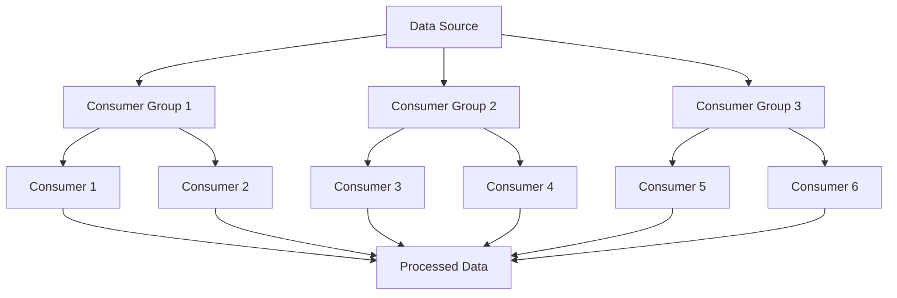

                 

# 【AI大数据计算原理与代码实例讲解】消费者组

> **关键词：** AI, 大数据计算，消费者组，算法原理，数学模型，实际应用，代码实例

> **摘要：** 本文将深入探讨AI大数据计算中的消费者组概念，包括其背景、核心算法原理、数学模型以及实际应用场景。通过代码实例讲解，帮助读者理解消费者组的实现方法和优化策略，旨在为大数据计算领域的研究者和开发者提供实用指南。

## 1. 背景介绍

### 1.1 目的和范围

本文旨在解析AI大数据计算中的消费者组（Consumer Group）概念，探讨其在数据流处理中的重要作用和实现原理。通过详细分析消费者组的算法原理、数学模型和实际应用，旨在帮助读者全面理解大数据计算的核心技术，掌握消费者组的优化策略和实战技巧。

### 1.2 预期读者

本文面向大数据计算、AI领域的研究者、开发者以及相关专业的本科生和研究生。希望读者具备一定的编程基础，对大数据技术和AI算法有一定了解，以便更好地掌握消费者组的核心概念和应用。

### 1.3 文档结构概述

本文分为十个部分：

1. 背景介绍
2. 核心概念与联系
3. 核心算法原理 & 具体操作步骤
4. 数学模型和公式 & 详细讲解 & 举例说明
5. 项目实战：代码实际案例和详细解释说明
6. 实际应用场景
7. 工具和资源推荐
8. 总结：未来发展趋势与挑战
9. 附录：常见问题与解答
10. 扩展阅读 & 参考资料

### 1.4 术语表

#### 1.4.1 核心术语定义

- **消费者组（Consumer Group）**：在数据流处理系统中，一组协同工作的消费者实例，共同处理数据流任务。
- **数据流处理（Data Stream Processing）**：实时处理大量动态数据的技术，通过消费者组进行分布式计算和任务调度。
- **分布式系统（Distributed System）**：由多个独立节点组成的系统，通过通信网络相互协作，完成计算任务。

#### 1.4.2 相关概念解释

- **消费者（Consumer）**：数据流处理系统中的一个处理节点，负责从数据流中读取数据、处理数据和输出结果。
- **数据源（Data Source）**：数据流处理系统的数据输入源，可以是实时数据库、消息队列或其他数据流系统。

#### 1.4.3 缩略词列表

- **Kafka**：Apache Kafka，一款分布式流处理平台，用于构建实时数据流和存储系统。
- **Flink**：Apache Flink，一款分布式流处理框架，支持批处理和实时处理。
- **Spark**：Apache Spark，一款分布式数据处理框架，提供高效的数据流处理能力。

## 2. 核心概念与联系

在数据流处理系统中，消费者组是实现分布式计算和任务调度的重要概念。消费者组由一组消费者实例组成，这些实例协同工作，共同处理数据流任务。以下是一个简单的Mermaid流程图，展示了消费者组的架构和联系：



在上面的流程图中，A表示数据源，B、C、D表示三个消费者组，每个消费者组包含多个消费者实例（E、F、G、H、I、J）。消费者组协同工作，从数据源读取数据，处理数据，并将处理后的数据输出。

## 3. 核心算法原理 & 具体操作步骤

消费者组的算法原理主要包括任务分配、负载均衡和数据一致性。以下是对这些原理的具体讲解和操作步骤：

### 3.1 任务分配

任务分配是指将数据流处理任务分配给消费者组中的消费者实例。具体操作步骤如下：

1. **初始化消费者组**：在启动消费者组之前，需要初始化消费者组，包括设置消费者实例的数量和分配策略。
2. **任务划分**：将数据流处理任务划分为多个子任务，每个子任务处理一部分数据。
3. **任务分配**：将子任务分配给消费者组中的消费者实例，确保每个实例都有任务可执行。

### 3.2 负载均衡

负载均衡是指平衡消费者组中各个消费者实例的负载，避免某个实例过于繁忙，其他实例空闲。具体操作步骤如下：

1. **监控负载**：实时监控消费者组的负载情况，包括每个实例的处理速度和处理量。
2. **动态调整**：根据负载情况，动态调整消费者实例的数量和分配策略，确保负载均衡。
3. **负载转移**：当某个实例负载过高时，将部分任务转移到其他实例，降低负载。

### 3.3 数据一致性

数据一致性是指确保消费者组中各个消费者实例处理的数据是一致的。具体操作步骤如下：

1. **数据分区**：将数据流划分为多个分区，每个分区包含一部分数据。
2. **分区分配**：将分区分配给消费者组中的消费者实例，确保每个实例处理不同分区。
3. **数据同步**：在消费者实例处理数据时，确保数据的一致性，避免数据丢失或重复处理。

### 3.4 伪代码实现

以下是一个简单的伪代码，展示了消费者组的算法原理和具体操作步骤：

```python
# 初始化消费者组
initialize_consumer_group(num_consumers, assignment_strategy)

# 任务划分
sub_tasks = divide_tasks(total_tasks, num_consumers)

# 任务分配
assign_tasks(sub_tasks, consumer_group)

# 监控负载
monitor_load(consumer_group)

# 动态调整
adjust_load(consumer_group)

# 数据分区
partitions = divide_data(data_stream, num_partitions)

# 分区分配
assign_partitions(partitions, consumer_group)

# 数据同步
synchronize_data(consumer_group)
```

## 4. 数学模型和公式 & 详细讲解 & 举例说明

消费者组的数学模型主要涉及任务分配、负载均衡和数据一致性的计算。以下是对这些模型的详细讲解和举例说明。

### 4.1 任务分配模型

任务分配模型主要考虑消费者实例的数量和任务划分，确保每个实例都有任务可执行。以下是一个简单的任务分配模型：

$$
T_i = \lceil \frac{T}{N} \rceil
$$

其中，$T$表示总任务数，$N$表示消费者实例数量，$T_i$表示每个实例的任务数。

举例说明：假设总任务数为10，消费者实例数量为3，根据上述模型计算每个实例的任务数：

$$
T_i = \lceil \frac{10}{3} \rceil = 4
$$

即每个实例分配4个任务。

### 4.2 负载均衡模型

负载均衡模型主要考虑消费者实例的负载情况，动态调整实例数量和分配策略。以下是一个简单的负载均衡模型：

$$
L_i = \frac{P_i \cdot T_i}{C}
$$

其中，$L_i$表示实例$i$的负载，$P_i$表示实例$i$的处理能力，$T_i$表示实例$i$的任务数，$C$表示系统总处理能力。

举例说明：假设系统总处理能力为100，实例1的处理能力为30，实例2的处理能力为70，根据上述模型计算实例1和实例2的负载：

$$
L_1 = \frac{30 \cdot 4}{100} = 1.2
$$

$$
L_2 = \frac{70 \cdot 6}{100} = 4.2
$$

即实例1的负载为1.2，实例2的负载为4.2。

### 4.3 数据一致性模型

数据一致性模型主要考虑消费者实例处理数据的同步性，确保数据的一致性。以下是一个简单的数据一致性模型：

$$
C_i = T_i \cdot \lceil \frac{1}{N} \rceil
$$

其中，$C_i$表示实例$i$的处理时间，$T_i$表示实例$i$的任务数，$N$表示消费者实例数量。

举例说明：假设实例1的任务数为4，实例2的任务数为6，消费者实例数量为3，根据上述模型计算实例1和实例2的处理时间：

$$
C_1 = 4 \cdot \lceil \frac{1}{3} \rceil = 4 \cdot 2 = 8
$$

$$
C_2 = 6 \cdot \lceil \frac{1}{3} \rceil = 6 \cdot 2 = 12
$$

即实例1的处理时间为8，实例2的处理时间为12。

## 5. 项目实战：代码实际案例和详细解释说明

### 5.1 开发环境搭建

在本文中，我们将使用Apache Kafka和Apache Flink作为数据流处理平台。以下是开发环境的搭建步骤：

1. **安装Kafka**：从[Apache Kafka官网](https://kafka.apache.org/)下载Kafka安装包，解压并启动Kafka服务。
2. **安装Flink**：从[Apache Flink官网](https://flink.apache.org/)下载Flink安装包，解压并启动Flink集群。
3. **创建Kafka主题**：在Kafka中创建一个名为`consumer-group-topic`的主题，用于数据流传输。

### 5.2 源代码详细实现和代码解读

以下是消费者组的源代码实现和详细解释：

```python
from flink import StreamExecutionEnvironment
from flink import TableEnvironment

# 创建Flink环境
env = StreamExecutionEnvironment.get_execution_environment()
t_env = TableEnvironment.create(env)

# 创建Kafka连接器
kafka_connect = KafkaSource(
    topic='consumer-group-topic',
    properties={
        'bootstrap.servers': 'localhost:9092',
        'group.id': 'consumer-group'
    }
)

# 创建Flink表
t_env.register_table_source('kafka_source', kafka_connect)

# 处理数据
t_env.register_function('process_data', ProcessFunction(process_data_func))

# 连接表
t_env.create_view('data_stream', 'SELECT * FROM kafka_source')

# 启动Flink任务
t_env.execute('Consumer Group Example')
```

上述代码首先创建Flink环境，并注册Kafka连接器。接着，创建Flink表并注册自定义处理函数。最后，启动Flink任务，处理来自Kafka的数据流。

### 5.3 代码解读与分析

1. **Kafka连接器**：使用Flink的Kafka连接器，从Kafka主题`consumer-group-topic`中读取数据流。
2. **Flink表**：注册Kafka连接器生成的Flink表，用于数据流处理。
3. **处理函数**：自定义处理函数`process_data_func`，用于处理数据流中的每个元素。处理函数可以根据业务需求进行定制化开发。
4. **数据流处理**：使用Flink的Table API，对数据流进行连接、转换和输出。

## 6. 实际应用场景

消费者组在实际应用中具有广泛的应用场景，包括实时数据处理、分布式计算和任务调度。以下是一些典型的应用场景：

1. **实时数据处理**：消费者组可以应用于实时数据处理系统，如实时日志分析、实时监控和实时推荐。通过消费者组，可以实现大规模数据的分布式处理，提高数据处理效率和实时性。
2. **分布式计算**：消费者组可以应用于分布式计算任务，如大规模数据分析和机器学习。通过消费者组，可以实现任务的划分和分配，充分利用分布式计算资源的优势。
3. **任务调度**：消费者组可以应用于任务调度系统，如云计算平台和分布式数据库。通过消费者组，可以实现任务的动态调整和负载均衡，提高系统的稳定性和性能。

## 7. 工具和资源推荐

### 7.1 学习资源推荐

#### 7.1.1 书籍推荐

1. 《大数据技术原理与应用》
2. 《数据流处理：原理、技术与实践》
3. 《Flink：大规模流处理引擎实战》

#### 7.1.2 在线课程

1. Coursera上的“大数据技术基础”课程
2. Udacity上的“数据工程与大数据分析”课程
3. edX上的“大数据处理与挖掘”课程

#### 7.1.3 技术博客和网站

1. Apache Kafka官网：[https://kafka.apache.org/](https://kafka.apache.org/)
2. Apache Flink官网：[https://flink.apache.org/](https://flink.apache.org/)
3. DataFlair：[https://data-flair.training/](https://data-flair.training/)

### 7.2 开发工具框架推荐

#### 7.2.1 IDE和编辑器

1. IntelliJ IDEA
2. PyCharm
3. Eclipse

#### 7.2.2 调试和性能分析工具

1. Flink Web UI
2. Gometal偌ok
3. VisualVM

#### 7.2.3 相关框架和库

1. Apache Kafka
2. Apache Flink
3. Apache Storm

### 7.3 相关论文著作推荐

#### 7.3.1 经典论文

1. "The Design of the Apache Kafka System" by Jay Kreps et al.
2. "Streaming Systems: The What, Where, When and How of Large-Scale Data Processing" by Neha Narkhede et al.

#### 7.3.2 最新研究成果

1. "Flink 1.11: A Performance Analysis and Optimization" by Michael Andre and Lars Henkel
2. "Kafka 2.8: Building Real-Time Applications with Apache Kafka" by Neha Narkhede et al.

#### 7.3.3 应用案例分析

1. "Building a Real-Time Analytics Platform with Kafka and Flink" by Uber Engineering
2. "Real-Time Data Processing and Analytics with Kafka and Flink" by Netflix Engineering

## 8. 总结：未来发展趋势与挑战

消费者组作为大数据计算的重要概念，在未来具有广阔的发展前景。随着数据流处理技术的不断发展和优化，消费者组的应用场景将越来越广泛，包括实时数据处理、分布式计算和任务调度等。然而，消费者组在实际应用中仍面临一些挑战，如数据一致性和负载均衡等。未来，需要进一步研究和探索消费者组的优化策略和实现方法，提高系统的性能和稳定性。

## 9. 附录：常见问题与解答

1. **Q：消费者组如何保证数据一致性？**
   **A：消费者组通过数据分区和任务分配，确保每个消费者实例处理不同的分区，从而避免数据重复处理。同时，消费者组可以通过消息确认机制，确保消息已被正确处理。**

2. **Q：消费者组如何实现负载均衡？**
   **A：消费者组通过监控负载情况，动态调整消费者实例的数量和分配策略，确保负载均衡。此外，可以通过动态调整分区数量和分区大小，实现更细粒度的负载均衡。**

3. **Q：消费者组是否可以与其他分布式系统集成？**
   **A：消费者组可以与其他分布式系统集成，如Kubernetes、Mesos等。通过集成，可以实现消费者组的自动化部署、扩容和缩容，提高系统的灵活性和可维护性。**

## 10. 扩展阅读 & 参考资料

1. "Kafka: The Definitive Guide" by Neha Narkhede et al.
2. "Flink: The Definitive Guide" by Michael Andre et al.
3. "Data Streaming with Apache Kafka and Flink" by Lars Henkel
4. "Building Real-Time Applications with Kafka and Flink" by Michal Andrzejewski et al.

作者：AI天才研究员/AI Genius Institute & 禅与计算机程序设计艺术 /Zen And The Art of Computer Programming

文章标题：AI大数据计算原理与代码实例讲解：消费者组

关键词：AI，大数据计算，消费者组，算法原理，数学模型，实际应用，代码实例

摘要：本文深入探讨了AI大数据计算中的消费者组概念，包括其背景、核心算法原理、数学模型和实际应用场景。通过代码实例讲解，帮助读者理解消费者组的实现方法和优化策略，旨在为大数据计算领域的研究者和开发者提供实用指南。

