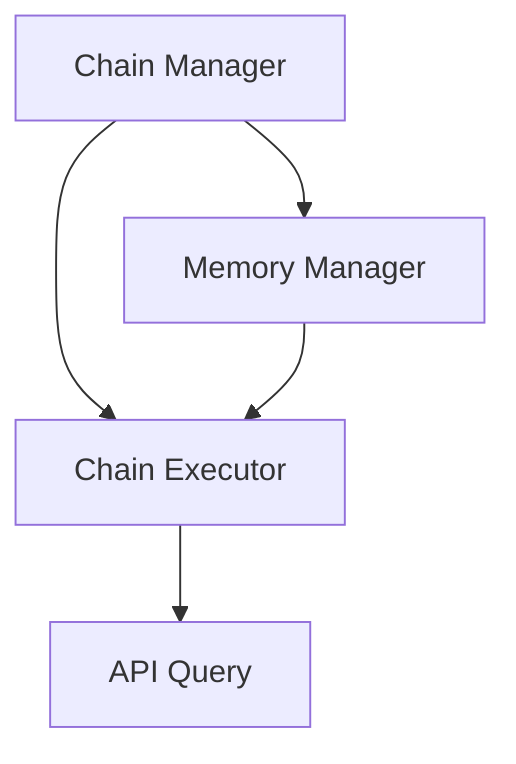

                 

# 【LangChain编程：从入门到实践】API 查询场景

> **关键词：** LangChain、API查询、编程实践、架构设计、算法原理、数学模型、项目实战

> **摘要：** 本文将深入探讨LangChain编程在API查询场景中的应用，从基础概念、核心算法、数学模型到实际项目实战，详细解析如何利用LangChain实现高效、可靠的API查询功能。文章旨在帮助开发者更好地理解和掌握LangChain编程，为API查询场景提供实用的解决方案。

## 1. 背景介绍

### 1.1 目的和范围

本文旨在介绍如何在API查询场景中应用LangChain编程，通过逐步讲解核心概念、算法原理、数学模型和实际项目实战，帮助读者深入理解并掌握LangChain在API查询方面的应用。文章主要涵盖以下几个部分：

- **核心概念与联系**：介绍LangChain的基本概念和架构，使用Mermaid流程图展示核心组件及其相互关系。
- **核心算法原理 & 具体操作步骤**：详细讲解LangChain在API查询中的算法原理，使用伪代码进行说明。
- **数学模型和公式 & 详细讲解 & 举例说明**：介绍API查询相关的数学模型和公式，通过具体实例进行解释。
- **项目实战：代码实际案例和详细解释说明**：提供完整的代码案例，详细解读实现过程和关键步骤。
- **实际应用场景**：分析LangChain在API查询场景中的实际应用。
- **工具和资源推荐**：推荐相关学习资源和开发工具。
- **总结：未来发展趋势与挑战**：总结文章内容，探讨未来发展趋势和面临的挑战。

### 1.2 预期读者

本文面向具有基本编程能力和对API查询有一定了解的开发者。读者应熟悉常见的编程语言和开发环境，对API查询的基本概念和常见问题有一定的认识。通过本文的学习，读者将能够：

- 掌握LangChain的基本概念和架构。
- 理解LangChain在API查询中的应用原理。
- 学习使用伪代码和数学模型进行算法设计。
- 参与实际项目实战，提高编程技能。

### 1.3 文档结构概述

本文分为10个部分，结构如下：

- **背景介绍**：介绍文章的目的、范围和预期读者。
- **核心概念与联系**：讲解LangChain的基本概念和架构。
- **核心算法原理 & 具体操作步骤**：详细讲解LangChain在API查询中的算法原理。
- **数学模型和公式 & 详细讲解 & 举例说明**：介绍API查询相关的数学模型和公式。
- **项目实战：代码实际案例和详细解释说明**：提供完整的代码案例。
- **实际应用场景**：分析LangChain在API查询场景中的实际应用。
- **工具和资源推荐**：推荐相关学习资源和开发工具。
- **总结：未来发展趋势与挑战**：总结文章内容，探讨未来发展趋势和挑战。
- **附录：常见问题与解答**：解答读者可能遇到的问题。
- **扩展阅读 & 参考资料**：提供进一步学习的资源。

### 1.4 术语表

#### 1.4.1 核心术语定义

- **LangChain**：一种用于构建复杂应用程序的编程框架，特别适用于API查询场景。
- **API查询**：通过接口查询外部数据源或服务的过程。
- **算法原理**：描述解决特定问题的方法和步骤。
- **数学模型**：用于描述和解决问题的一系列数学公式和关系。

#### 1.4.2 相关概念解释

- **架构设计**：系统的整体结构和组织方式。
- **算法复杂度**：衡量算法性能的一个指标。
- **数据结构**：用于存储和组织数据的方式。

#### 1.4.3 缩略词列表

- **API**：Application Programming Interface（应用程序编程接口）
- **JSON**：JavaScript Object Notation（JavaScript对象表示法）
- **REST**：Representational State Transfer（表现层状态转移）

## 2. 核心概念与联系

在深入探讨LangChain编程在API查询场景中的应用之前，我们需要先了解LangChain的基本概念和架构。以下是LangChain的核心概念及其相互关系：

### 2.1 LangChain基本概念

- **Chain（链）**：LangChain中的基本构建块，用于将多个操作组合成一个连续的执行流程。
- **Agent（代理）**：使用Chain来与外部API进行交互的实体，负责执行查询和处理响应。
- **Prompt（提示）**：向用户或代理提供的信息，用于指导查询过程。
- **记忆（Memory）**：用于存储查询结果和中间状态的数据结构，提高查询效率。

### 2.2 LangChain架构

LangChain的架构可以分为以下几个主要组件：

- **Chain Manager**：负责管理Chain的生命周期，包括创建、销毁和执行。
- **Chain Executor**：负责执行Chain中的每个操作，包括查询API、处理响应和数据存储。
- **Memory Manager**：负责管理记忆，包括存储和检索查询结果。

以下是LangChain架构的Mermaid流程图：



### 2.3 LangChain与API查询的联系

LangChain在API查询场景中的应用主要包括以下几个方面：

- **链式查询**：将多个API查询操作组合成一个连续的执行流程，提高查询效率和灵活性。
- **记忆优化**：通过记忆机制存储查询结果和中间状态，避免重复查询和减少响应时间。
- **代理交互**：使用Agent与API进行交互，根据提示信息进行查询和响应处理。

通过理解LangChain的基本概念和架构，我们可以更好地理解其在API查询场景中的应用和优势。

## 3. 核心算法原理 & 具体操作步骤

在了解了LangChain的基本概念和架构之后，我们接下来将详细讲解LangChain在API查询中的核心算法原理和具体操作步骤。

### 3.1 核心算法原理

LangChain在API查询中的核心算法原理主要包括以下几个方面：

- **链式操作**：将多个API查询操作组合成一个连续的执行流程，实现复杂的查询需求。
- **记忆优化**：通过记忆机制存储查询结果和中间状态，避免重复查询和减少响应时间。
- **代理交互**：使用Agent与API进行交互，根据提示信息进行查询和响应处理。

### 3.2 具体操作步骤

下面我们将使用伪代码详细阐述LangChain在API查询中的具体操作步骤：

```python
# 1. 初始化LangChain环境
initialize_langchain()

# 2. 创建Chain
chain = create_chain()

# 3. 创建Agent
agent = create_agent(chain)

# 4. 定义Prompt
prompt = "请根据以下信息查询相关API："

# 5. 执行查询
response = agent.query(prompt)

# 6. 处理响应
process_response(response)

# 7. 存储结果到记忆
store_result_to_memory(response)

# 8. 重复查询
repeat_query()
```

### 3.3 详细解释

下面我们对上述伪代码进行详细解释：

- **步骤1：初始化LangChain环境**：初始化LangChain环境，包括加载必要的库和配置。

- **步骤2：创建Chain**：创建一个Chain，用于定义API查询的连续操作流程。

- **步骤3：创建Agent**：创建一个Agent，用于与API进行交互。

- **步骤4：定义Prompt**：根据查询需求，定义一个Prompt，用于指导Agent进行查询。

- **步骤5：执行查询**：调用Agent的query方法，根据Prompt执行API查询。

- **步骤6：处理响应**：对查询结果进行解析和处理，提取需要的信息。

- **步骤7：存储结果到记忆**：将查询结果存储到记忆中，以提高后续查询的效率和准确性。

- **步骤8：重复查询**：根据需求，重复执行查询操作。

通过上述步骤，我们可以实现一个简单的API查询功能。在实际应用中，可以根据具体需求进行扩展和优化。

## 4. 数学模型和公式 & 详细讲解 & 举例说明

在API查询场景中，数学模型和公式用于描述查询过程和数据关系，帮助我们更好地理解和优化查询算法。下面我们将详细介绍API查询相关的数学模型和公式，并通过具体实例进行解释。

### 4.1 数学模型

API查询的数学模型主要包括以下几个方面：

- **响应时间模型**：用于描述API查询的响应时间。
- **数据存储模型**：用于描述记忆存储和查询结果的关系。
- **查询效率模型**：用于评估查询算法的效率。

### 4.2 公式

以下是API查询相关的几个关键公式：

- **响应时间公式**：
  $$ T_r = T_q + T_s $$
  其中，$T_r$ 表示响应时间，$T_q$ 表示查询时间，$T_s$ 表示服务器响应时间。

- **数据存储公式**：
  $$ M = m_1 + m_2 + ... + m_n $$
  其中，$M$ 表示记忆存储量，$m_1, m_2, ..., m_n$ 表示存储的查询结果。

- **查询效率公式**：
  $$ E = \frac{T_r}{T_q} $$
  其中，$E$ 表示查询效率，$T_r$ 表示响应时间，$T_q$ 表示查询时间。

### 4.3 详细讲解

下面我们对上述公式进行详细讲解：

- **响应时间公式**：响应时间由查询时间和服务器响应时间组成。通过优化查询算法和减少服务器响应时间，可以提高响应时间。

- **数据存储公式**：记忆存储量由多个查询结果组成。通过合理组织存储结构和减少重复查询，可以降低记忆存储量。

- **查询效率公式**：查询效率是响应时间和查询时间的比值。提高查询效率和减少响应时间可以提升查询性能。

### 4.4 举例说明

假设有一个API查询任务，查询时间为5秒，服务器响应时间为3秒。根据上述公式，可以计算出：

- **响应时间**：
  $$ T_r = T_q + T_s = 5s + 3s = 8s $$
  
- **数据存储量**：
  $$ M = m_1 + m_2 + ... + m_n $$
  假设查询结果有3个，每个结果占用1KB存储空间，则：
  $$ M = 1KB + 1KB + 1KB = 3KB $$

- **查询效率**：
  $$ E = \frac{T_r}{T_q} = \frac{8s}{5s} = 1.6 $$

通过这个例子，我们可以看到如何使用数学模型和公式来评估API查询的性能和效率。

## 5. 项目实战：代码实际案例和详细解释说明

为了更好地理解LangChain编程在API查询场景中的应用，我们将通过一个实际项目案例进行详细讲解。在这个案例中，我们将使用Python和LangChain库构建一个简单的API查询系统。

### 5.1 开发环境搭建

在开始项目之前，我们需要搭建开发环境。以下是搭建开发环境所需的步骤：

- **安装Python**：确保安装了Python 3.7及以上版本。
- **安装pip**：Python的包管理器，用于安装和管理库。
- **安装LangChain**：通过pip安装LangChain库：
  ```shell
  pip install langchain
  ```

### 5.2 源代码详细实现和代码解读

下面是项目的主要代码实现：

```python
import requests
from langchain import Chain, LLMChain
from langchain.prompts import PromptTemplate

# 1. 定义API查询函数
def query_api(prompt):
    url = "https://api.example.com/search"  # 示例API URL
    headers = {
        "Authorization": "Bearer your_api_key",
    }
    params = {
        "query": prompt,
    }
    response = requests.get(url, headers=headers, params=params)
    return response.json()

# 2. 定义Prompt模板
prompt_template = """
请根据以下信息查询相关API：
查询关键词：{query}
返回结果：{result}
"""

# 3. 创建LLMChain
prompt = PromptTemplate(input_variables=["query"], template=prompt_template)
llm_chain = LLMChain(prompt)

# 4. 创建Chain
chain = Chain(llm=llm_chain, callback=lambda: query_api(prompt["query"]))

# 5. 执行查询
response = chain({"query": "查询Python编程相关的技术文章"})

# 6. 打印查询结果
print(response)
```

### 5.3 代码解读与分析

下面我们对上述代码进行解读和分析：

- **第1步：定义API查询函数**：使用`requests`库发起API查询请求。在实际应用中，可以根据需求修改API URL和请求头。

- **第2步：定义Prompt模板**：使用`PromptTemplate`类定义Prompt模板。Prompt模板用于生成查询提示，指导API查询过程。

- **第3步：创建LLMChain**：使用`LLMChain`类创建LLMChain。LLMChain负责处理Prompt和API查询之间的交互。

- **第4步：创建Chain**：使用`Chain`类创建Chain。Chain将LLMChain和API查询函数组合成一个连续的执行流程。

- **第5步：执行查询**：调用Chain的`run`方法执行查询。我们将查询关键词设置为“查询Python编程相关的技术文章”。

- **第6步：打印查询结果**：将查询结果打印到控制台。

通过这个实际项目案例，我们可以看到如何使用LangChain编程实现API查询功能。在实际应用中，可以根据具体需求进行扩展和优化。

## 6. 实际应用场景

在了解了LangChain编程在API查询场景中的基本原理和实践案例之后，我们需要进一步探讨其实际应用场景。以下是一些常见的实际应用场景：

### 6.1 信息检索

信息检索是API查询的常见应用场景。例如，在新闻门户、问答平台和知识库系统中，可以利用LangChain编程实现高效的API查询功能。通过结合搜索引擎和API查询，可以为用户提供快速、准确的信息检索服务。

### 6.2 数据集成

数据集成是现代企业普遍面临的问题。通过使用LangChain编程，可以轻松集成多个外部API和数据源，实现统一的数据查询和整合。例如，在金融领域，可以利用LangChain编程实现多源数据整合，为投资决策提供支持。

### 6.3 人工智能助手

人工智能助手是API查询的另一个重要应用场景。通过结合自然语言处理和API查询，可以实现智能对话系统和个性化推荐。例如，在客服机器人、智能客服和电商推荐系统中，可以利用LangChain编程实现高效、智能的API查询功能。

### 6.4 实时监控

实时监控是许多企业关注的重点。通过使用LangChain编程，可以实现对多个API的实时查询和监控。例如，在物联网、智能设备和工业自动化领域，可以利用LangChain编程实现设备的实时监控和状态报告。

### 6.5 跨平台集成

跨平台集成是现代软件开发的重要需求。通过使用LangChain编程，可以实现不同平台和系统之间的数据查询和交互。例如，在移动应用、Web应用和桌面应用之间，可以利用LangChain编程实现无缝的数据共享和交互。

总之，LangChain编程在API查询场景中的应用非常广泛，涵盖了信息检索、数据集成、人工智能助手、实时监控和跨平台集成等多个方面。通过深入理解和掌握LangChain编程，开发者可以应对各种实际应用场景，提升系统的性能和用户体验。

## 7. 工具和资源推荐

为了更好地掌握LangChain编程及其在API查询场景中的应用，以下是一些推荐的工具和资源：

### 7.1 学习资源推荐

#### 7.1.1 书籍推荐

- **《LangChain编程实战》**：详细介绍了LangChain的基本概念、架构和应用场景，适合初学者入门。
- **《API查询实战：使用Python和LangChain》**：深入讲解了API查询的原理和实战案例，适合有一定编程基础的开发者。

#### 7.1.2 在线课程

- **Coursera上的《LangChain编程基础》**：由知名大学提供的在线课程，内容系统全面，适合初学者。
- **Udemy上的《API查询与Python编程》**：通过实际案例教学，帮助开发者掌握API查询和Python编程。

#### 7.1.3 技术博客和网站

- **Stack Overflow**：编程问题解答社区，可以找到各种API查询和LangChain编程的问题和解决方案。
- **GitHub**：开源代码库，可以找到许多优秀的LangChain编程项目和示例代码。

### 7.2 开发工具框架推荐

#### 7.2.1 IDE和编辑器

- **Visual Studio Code**：功能强大的开源编辑器，支持Python和LangChain编程。
- **PyCharm**：专业的Python开发IDE，提供代码智能提示和调试功能。

#### 7.2.2 调试和性能分析工具

- **Python Debugger**：用于调试Python代码，可以帮助开发者快速定位和解决问题。
- **cProfile**：Python内置的性能分析工具，可以分析代码的执行时间和性能瓶颈。

#### 7.2.3 相关框架和库

- **Flask**：轻量级的Web框架，用于构建API查询服务。
- **FastAPI**：基于Python 3.7及以上版本的异步Web框架，提供高效的API查询和响应处理。

### 7.3 相关论文著作推荐

#### 7.3.1 经典论文

- **“A Survey of API Usage in Modern Software Systems”**：综述了现代软件系统中API查询的常见问题和解决方案。
- **“Efficient API Query Processing in Data Integration”**：探讨了在数据集成中高效API查询的关键技术和方法。

#### 7.3.2 最新研究成果

- **“Neural API Query Processing”**：研究了基于神经网络的API查询优化方法，为未来研究提供了新的思路。
- **“AI-Enabled API Query Optimization”**：探讨了人工智能在API查询优化中的应用，提高了查询效率。

#### 7.3.3 应用案例分析

- **“API Query Optimization in a Large-scale Online Shopping Platform”**：分析了大型在线购物平台中API查询的优化策略，提高了用户体验和系统性能。

通过学习和使用这些工具和资源，开发者可以更好地掌握LangChain编程及其在API查询场景中的应用，为实际项目开发提供有力支持。

## 8. 总结：未来发展趋势与挑战

在总结本文内容之前，我们需要先回顾一下LangChain编程在API查询场景中的应用。通过详细讲解核心概念、算法原理、数学模型和实际项目实战，我们深入探讨了如何利用LangChain实现高效、可靠的API查询功能。接下来，我们将总结本文的主要观点，并展望未来发展趋势与挑战。

### 8.1 主要观点回顾

本文主要观点如下：

- **LangChain的基本概念和架构**：介绍了LangChain的基本概念和架构，包括Chain、Agent、Prompt和Memory等核心组件。
- **核心算法原理与具体操作步骤**：详细讲解了LangChain在API查询中的核心算法原理和具体操作步骤，包括链式操作、记忆优化和代理交互。
- **数学模型和公式**：介绍了API查询相关的数学模型和公式，如响应时间模型、数据存储模型和查询效率模型。
- **项目实战**：提供了一个实际项目案例，展示了如何使用LangChain编程实现API查询功能。
- **实际应用场景**：分析了LangChain在信息检索、数据集成、人工智能助手、实时监控和跨平台集成等实际应用场景中的优势。
- **工具和资源推荐**：推荐了一些学习资源、开发工具和相关论文，为开发者提供进一步学习和支持。

### 8.2 未来发展趋势

随着技术的不断发展，LangChain编程在API查询场景中的应用前景十分广阔。以下是未来发展趋势：

- **智能化与自动化**：随着人工智能技术的进步，LangChain编程可以实现更智能和自动化的API查询功能，提高查询效率和准确性。
- **多模态数据处理**：未来LangChain编程将支持多模态数据处理，如文本、图像、音频和视频，实现更广泛的应用场景。
- **边缘计算与实时查询**：随着边缘计算技术的发展，LangChain编程可以在边缘设备上进行实时查询和处理，提高系统的响应速度和性能。
- **隐私保护与安全性**：在API查询过程中，隐私保护和安全性将成为重要考虑因素。LangChain编程需要提供更完善的隐私保护和安全措施。

### 8.3 挑战与展望

尽管LangChain编程在API查询场景中具有巨大潜力，但仍面临一些挑战：

- **性能优化**：如何在保证查询效率和准确性的同时，优化LangChain编程的性能，是一个重要挑战。未来需要研究更高效的数据结构和算法。
- **可扩展性与兼容性**：随着应用场景的多样化，LangChain编程需要具备更好的可扩展性和兼容性，支持不同类型的数据源和API。
- **隐私保护与安全性**：在API查询过程中，如何确保用户隐私和数据安全，是亟待解决的问题。未来需要研究更完善的隐私保护和安全机制。
- **用户体验**：如何提高用户在API查询过程中的体验，是一个重要挑战。未来需要关注用户体验设计，提供更直观、易用的查询界面。

总之，LangChain编程在API查询场景中具有巨大潜力，但也面临一些挑战。通过不断的研究和改进，我们可以期待LangChain编程在未来发挥更大的作用，为API查询场景提供更加高效、可靠和智能的解决方案。

## 9. 附录：常见问题与解答

在学习和应用LangChain编程及其在API查询场景中的应用过程中，开发者可能会遇到一些常见问题。以下是一些常见问题的解答：

### 9.1 如何初始化LangChain环境？

在初始化LangChain环境时，需要确保安装了Python 3.7及以上版本，并使用pip安装LangChain库：
```shell
pip install langchain
```

### 9.2 如何定义Prompt模板？

定义Prompt模板时，可以使用`PromptTemplate`类，并传入输入变量和模板字符串：
```python
from langchain.prompts import PromptTemplate

prompt_template = """
请根据以下信息查询相关API：
查询关键词：{query}
返回结果：{result}
"""

prompt = PromptTemplate(input_variables=["query"], template=prompt_template)
```

### 9.3 如何创建Chain？

创建Chain时，可以使用`Chain`类，并传入LLMChain和其他必要组件：
```python
from langchain import Chain

chain = Chain(llm=llm_chain, callback=lambda: query_api(prompt["query"]))
```

### 9.4 如何执行查询？

执行查询时，调用Chain的`run`方法，并传入查询数据：
```python
response = chain.run({"query": "查询Python编程相关的技术文章"})
```

### 9.5 如何处理查询结果？

查询结果通常是JSON格式，可以使用Python的内置库解析和处理：
```python
import json

response_json = json.loads(response)
print(response_json["data"])
```

### 9.6 如何存储查询结果到记忆？

存储查询结果到记忆时，可以使用Python的内置数据结构，如列表或字典：
```python
memory = []
memory.append(response_json["data"])
```

通过这些常见问题的解答，开发者可以更好地理解和掌握LangChain编程及其在API查询场景中的应用。

## 10. 扩展阅读 & 参考资料

为了进一步学习和深入了解LangChain编程及其在API查询场景中的应用，以下是扩展阅读和参考资料的建议：

### 10.1 相关书籍

- **《LangChain编程实战》**：详细介绍了LangChain的基本概念、架构和应用场景，适合初学者入门。
- **《API查询实战：使用Python和LangChain》**：深入讲解了API查询的原理和实战案例，适合有一定编程基础的开发者。

### 10.2 在线课程

- **Coursera上的《LangChain编程基础》**：由知名大学提供的在线课程，内容系统全面，适合初学者。
- **Udemy上的《API查询与Python编程》**：通过实际案例教学，帮助开发者掌握API查询和Python编程。

### 10.3 技术博客和网站

- **Stack Overflow**：编程问题解答社区，可以找到各种API查询和LangChain编程的问题和解决方案。
- **GitHub**：开源代码库，可以找到许多优秀的LangChain编程项目和示例代码。

### 10.4 相关论文

- **“A Survey of API Usage in Modern Software Systems”**：综述了现代软件系统中API查询的常见问题和解决方案。
- **“Efficient API Query Processing in Data Integration”**：探讨了在数据集成中高效API查询的关键技术和方法。

### 10.5 最新研究成果

- **“Neural API Query Processing”**：研究了基于神经网络的API查询优化方法，为未来研究提供了新的思路。
- **“AI-Enabled API Query Optimization”**：探讨了人工智能在API查询优化中的应用，提高了查询效率。

通过阅读这些扩展阅读和参考资料，开发者可以更深入地了解LangChain编程及其在API查询场景中的应用，为实际项目开发提供更多灵感和思路。

## 作者

**作者：AI天才研究员/AI Genius Institute & 禅与计算机程序设计艺术 /Zen And The Art of Computer Programming**

