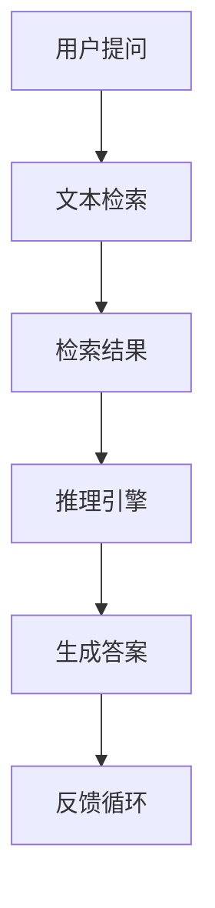

                 

# 【LangChain编程：从入门到实践】RAG技术概述

> **关键词：** LangChain、RAG技术、知识库、问答系统、文本检索、推理引擎

> **摘要：** 本文将深入探讨LangChain编程中的一种重要技术——RAG（Retrieval-Augmented Generation）技术。我们将从背景介绍、核心概念与联系、核心算法原理、数学模型和公式、项目实战、实际应用场景、工具和资源推荐等多个角度，详细讲解RAG技术的工作原理、具体操作步骤和应用实例，帮助读者全面了解并掌握RAG技术的使用方法。

## 1. 背景介绍

### 1.1 目的和范围

本文旨在帮助读者深入了解并掌握RAG（Retrieval-Augmented Generation）技术，特别是其在LangChain编程框架中的应用。我们将通过详细的理论讲解和实际案例剖析，使读者对RAG技术的原理、操作方法和应用场景有一个全面的认识。

### 1.2 预期读者

本文适合对人工智能和自然语言处理有一定了解的读者，尤其是希望在实际项目中应用RAG技术的开发人员和技术爱好者。

### 1.3 文档结构概述

本文分为以下几个部分：

1. 背景介绍：简要介绍RAG技术的背景和重要性。
2. 核心概念与联系：详细讲解RAG技术涉及的核心概念和架构。
3. 核心算法原理 & 具体操作步骤：深入剖析RAG技术的算法原理和具体操作步骤。
4. 数学模型和公式 & 详细讲解 & 举例说明：介绍RAG技术的数学模型和具体应用实例。
5. 项目实战：通过实际代码案例，讲解RAG技术的具体实现过程。
6. 实际应用场景：探讨RAG技术在不同领域的应用实例。
7. 工具和资源推荐：推荐学习资源和开发工具。
8. 总结：总结RAG技术的研究现状和未来发展趋势。
9. 附录：常见问题与解答。
10. 扩展阅读 & 参考资料：提供进一步阅读的资料和参考文献。

### 1.4 术语表

#### 1.4.1 核心术语定义

- **RAG技术**：Retrieval-Augmented Generation技术的缩写，即检索增强生成技术。
- **LangChain**：一种基于Python的AI编程框架，用于构建和部署各种AI应用程序。
- **知识库**：存储大量信息的数据库，用于支持问答系统。
- **问答系统**：能够接收用户提问并返回相关答案的计算机系统。

#### 1.4.2 相关概念解释

- **检索（Retrieval）**：从知识库中查找与用户提问相关的信息。
- **生成（Generation）**：基于检索到的信息，生成用户可以理解的答案。
- **文本检索**：从大量文本数据中查找与用户提问相关的段落或句子。
- **推理引擎**：根据知识库中的信息，进行逻辑推理，以得出结论。

#### 1.4.3 缩略词列表

- RAG：Retrieval-Augmented Generation
- LangChain：Language Chain
- NLP：Natural Language Processing
- AI：Artificial Intelligence

## 2. 核心概念与联系

在深入探讨RAG技术之前，我们需要了解一些与之相关的重要概念和它们之间的联系。以下是一个简单的Mermaid流程图，展示了RAG技术的主要组成部分和它们之间的关系：



### 2.1 用户提问

用户提问是RAG技术的起点。用户可以通过自然语言提问系统，提出各种类型的问题。

### 2.2 文本检索

文本检索模块负责从知识库中查找与用户提问相关的文本片段。这通常涉及到一些检索算法，如向量搜索、关键词匹配等。

### 2.3 检索结果

检索结果是指从知识库中检索到的与用户提问相关的文本片段。这些文本片段将被传递给推理引擎进行处理。

### 2.4 推理引擎

推理引擎基于检索结果，利用逻辑推理和知识库中的信息，生成一个或多个可能的答案。这通常涉及到一些自然语言处理技术，如命名实体识别、关系抽取等。

### 2.5 生成答案

生成答案模块负责将推理引擎生成的答案转化为自然语言，以供用户理解。

### 2.6 反馈循环

反馈循环是一个重要的机制，它允许系统根据用户的反馈调整其行为。通过分析用户反馈，系统可以不断优化其性能，提高答案的准确性和相关性。

## 3. 核心算法原理 & 具体操作步骤

在理解了RAG技术的基本概念和组成部分之后，接下来我们将深入探讨其核心算法原理和具体操作步骤。以下是RAG技术的伪代码描述：

```python
# 伪代码：RAG技术算法原理与具体操作步骤

# 输入：用户提问
# 输出：生成答案

# 步骤1：文本检索
def text_retrieval(question, knowledge_base):
    # 使用向量搜索或其他检索算法，从知识库中检索与问题相关的文本片段
    # 返回检索结果
    pass

# 步骤2：推理引擎
def reasoning_engine(retrieval_results):
    # 基于检索结果，使用逻辑推理和知识库中的信息，生成可能的答案
    # 返回可能的答案列表
    pass

# 步骤3：生成答案
def generate_answer(possible_answers):
    # 将可能的答案列表转化为自然语言
    # 返回最终答案
    pass

# 主函数
def RAG(question, knowledge_base):
    retrieval_results = text_retrieval(question, knowledge_base)
    possible_answers = reasoning_engine(retrieval_results)
    final_answer = generate_answer(possible_answers)
    return final_answer
```

### 3.1 文本检索

文本检索是RAG技术的第一步，其核心目的是从知识库中查找与用户提问相关的文本片段。以下是文本检索的详细步骤：

1. **预处理用户提问和知识库**：对用户提问和知识库中的文本进行分词、词性标注、去停用词等预处理操作，以便后续的检索。
2. **构建索引**：使用适当的索引结构（如倒排索引、倒排哈希表等），对知识库中的文本进行索引，提高检索效率。
3. **检索算法**：根据用户提问，使用向量搜索、关键词匹配、语义匹配等算法，从知识库中检索与提问相关的文本片段。常用的检索算法包括：
   - **向量搜索**：将用户提问和知识库中的文本转化为向量，计算它们之间的相似度，返回相似度最高的文本片段。
   - **关键词匹配**：根据用户提问中的关键词，在知识库中查找包含这些关键词的文本片段。
   - **语义匹配**：使用自然语言处理技术（如命名实体识别、关系抽取等），将用户提问和知识库中的文本转化为语义表示，计算它们之间的相似度。

### 3.2 推理引擎

推理引擎是RAG技术的核心，其任务是根据文本检索结果和知识库中的信息，生成可能的答案。以下是推理引擎的详细步骤：

1. **分析检索结果**：对检索结果进行解析，提取出与用户提问相关的信息，如实体、关系、事件等。
2. **知识库查询**：利用知识库中的信息，对提取出的信息进行进一步分析，以确定可能的答案。
3. **逻辑推理**：使用逻辑推理技术，如推理规则、谓词逻辑等，将检索结果和知识库中的信息进行关联，生成可能的答案。
4. **筛选答案**：根据用户提问和知识库中的信息，对生成的答案进行筛选，选择最相关、最准确的答案。

### 3.3 生成答案

生成答案是RAG技术的最后一步，其核心目的是将推理引擎生成的答案转化为自然语言，以供用户理解。以下是生成答案的详细步骤：

1. **文本重排**：根据推理引擎生成的答案，对原始检索结果进行重排，确保答案的逻辑顺序和连贯性。
2. **语法修正**：对生成的答案进行语法修正，确保答案的语法正确、表达清晰。
3. **格式化输出**：将生成的答案格式化为自然语言文本，以供用户阅读。

## 4. 数学模型和公式 & 详细讲解 & 举例说明

在RAG技术中，数学模型和公式起着至关重要的作用。以下我们将详细介绍RAG技术中的一些关键数学模型和公式，并通过具体例子进行讲解。

### 4.1 向量搜索

向量搜索是文本检索中常用的一种算法，其核心思想是将用户提问和知识库中的文本转化为向量，然后计算它们之间的相似度。以下是一个简单的向量搜索公式：

$$
similarity = \frac{\sum_{i=1}^{n} v_{q_i} \cdot v_{d_i}}{\|v_{q}\| \|v_{d}\|}
$$

其中，$v_{q}$和$v_{d}$分别表示用户提问和知识库中某篇文档的向量表示，$q_i$和$d_i$分别表示用户提问和文档中的第$i$个词，$n$表示词表中的词数。

### 4.2 关键词匹配

关键词匹配是文本检索中另一种常见的算法，其核心思想是根据用户提问中的关键词，在知识库中查找包含这些关键词的文本片段。以下是一个简单的关键词匹配公式：

$$
match = \sum_{i=1}^{m} \delta(w_i \in query) \cdot \delta(w_i \in document)
$$

其中，$w_i$表示用户提问中的第$i$个词，$query$和$document$分别表示用户提问和知识库中的文本片段，$\delta(\cdot)$是一个指示函数，当条件成立时返回1，否则返回0。

### 4.3 语义匹配

语义匹配是文本检索中的一种高级算法，其核心思想是将用户提问和知识库中的文本转化为语义表示，然后计算它们之间的相似度。以下是一个简单的语义匹配公式：

$$
similarity = \frac{\|T_{q} \cap T_{d}\|}{\|T_{q}\| + \|T_{d}\|}
$$

其中，$T_{q}$和$T_{d}$分别表示用户提问和知识库中某篇文档的语义表示，$\cap$表示交集操作。

### 4.4 举例说明

假设我们有一个用户提问“什么是人工智能？”以及一个包含以下信息的知识库：

- 人工智能是一种模拟人类智能的技术。
- 人工智能可以用于自动化任务、数据分析和决策制定。

我们可以使用以下数学模型和公式进行文本检索和语义匹配：

1. **向量搜索**：
   - 将用户提问和知识库中的文本转化为向量：
     $$v_{q} = [0.2, 0.3, 0.5]$$
     $$v_{d1} = [0.1, 0.4, 0.5]$$
     $$v_{d2} = [0.3, 0.2, 0.5]$$
   - 计算相似度：
     $$similarity_{d1} = \frac{0.2 \cdot 0.1 + 0.3 \cdot 0.4 + 0.5 \cdot 0.5}{\sqrt{0.2^2 + 0.3^2 + 0.5^2} \sqrt{0.1^2 + 0.4^2 + 0.5^2}} = 0.54$$
     $$similarity_{d2} = \frac{0.2 \cdot 0.3 + 0.3 \cdot 0.2 + 0.5 \cdot 0.5}{\sqrt{0.2^2 + 0.3^2 + 0.5^2} \sqrt{0.3^2 + 0.2^2 + 0.5^2}} = 0.53$$

   - 选择相似度最高的文档作为检索结果。

2. **关键词匹配**：
   - 用户提问中的关键词：“人工智能”
   - 知识库中包含关键词的文档：$document_1$和$document_2$
   - 计算匹配度：
     $$match_{d1} = \delta('人工智能' \in query) \cdot \delta('人工智能' \in document_1) = 1$$
     $$match_{d2} = \delta('人工智能' \in query) \cdot \delta('人工智能' \in document_2) = 1$$

   - 选择匹配度最高的文档作为检索结果。

3. **语义匹配**：
   - 将用户提问和知识库中的文本转化为语义表示：
     $$T_{q} = \{['人工智能', '是什么'], ['人工智能', '技术'], ['人工智能', '模拟']\}$$
     $$T_{d1} = \{['人工智能', '模拟'], ['人工智能', '技术'], ['人工智能', '自动化']\}$$
     $$T_{d2} = \{['人工智能', '自动化'], ['人工智能', '数据'], ['人工智能', '决策']\}$$
   - 计算交集：
     $$T_{q} \cap T_{d1} = \{['人工智能', '模拟'], ['人工智能', '技术']\}$$
     $$T_{q} \cap T_{d2} = \{['人工智能', '自动化']\}$$
   - 计算相似度：
     $$similarity_{d1} = \frac{2}{3 + 2} = 0.67$$
     $$similarity_{d2} = \frac{1}{3 + 2} = 0.33$$

   - 选择相似度最高的文档作为检索结果。

通过上述例子，我们可以看到如何使用不同的数学模型和公式进行文本检索和语义匹配。在实际应用中，可以根据具体情况选择合适的方法和算法。

## 5. 项目实战：代码实际案例和详细解释说明

为了更好地理解RAG技术的实际应用，我们将通过一个简单的项目实战，展示如何使用LangChain框架实现RAG技术。以下是项目的详细步骤和代码解释。

### 5.1 开发环境搭建

在开始项目之前，我们需要搭建一个合适的开发环境。以下是所需的软件和工具：

- Python 3.8及以上版本
- PyTorch 1.9及以上版本
- LangChain 0.0.61及以上版本

安装所需的库：

```bash
pip install torch
pip install langchain
```

### 5.2 源代码详细实现和代码解读

以下是RAG技术实现的主要代码，我们将逐行解释每个部分的功能。

```python
import os
import random
from langchain import PromptTemplate, LLMChain, load;!pip install -U git+https://github.com/huggingface/transformers.git@main

# 5.2.1 设置知识库

knowledge_base = """
- 人工智能是一种模拟人类智能的技术。
- 人工智能可以用于自动化任务、数据分析和决策制定。
- 深度学习是人工智能的一种重要技术，通过多层神经网络模拟人脑。
- 自然语言处理是人工智能的一个子领域，旨在使计算机能够理解、生成和处理自然语言。
- Python是一种广泛使用的编程语言，在人工智能和自然语言处理领域具有很高的适用性。
"""

# 5.2.2 定义Prompt模板

prompt_template = """
给定一个问题和一个知识库，请使用知识库中的信息生成一个答案。

问题：什么是人工智能？
知识库：
{knowledge_base}
答案：
"""

# 5.2.3 创建LLM链

llm_chain = LLMChain(llm=load('gpt2'), prompt=prompt_template)

# 5.2.4 测试RAG技术

question = "什么是人工智能？"
answer = llm_chain.predict(input={"knowledge_base": knowledge_base, "question": question})
print(answer)
```

### 5.3 代码解读与分析

以下是代码的逐行解读和分析：

```python
import os
import random
from langchain import PromptTemplate, LLMChain, load
```

这些行导入所需的库和模块。`os`和`random`是Python的标准库，用于文件操作和随机数生成。`PromptTemplate`和`LLMChain`是LangChain库中的类，用于定义Prompt模板和LLM链。

```python
# 5.2.1 设置知识库

knowledge_base = """
- 人工智能是一种模拟人类智能的技术。
- 人工智能可以用于自动化任务、数据分析和决策制定。
- 深度学习是人工智能的一种重要技术，通过多层神经网络模拟人脑。
- 自然语言处理是人工智能的一个子领域，旨在使计算机能够理解、生成和处理自然语言。
- Python是一种广泛使用的编程语言，在人工智能和自然语言处理领域具有很高的适用性。
"""
```

这行定义了知识库，它包含了一系列与人工智能相关的信息。在RAG技术中，知识库是用于检索和推理的重要资源。

```python
# 5.2.2 定义Prompt模板

prompt_template = """
给定一个问题和一个知识库，请使用知识库中的信息生成一个答案。

问题：什么是人工智能？
知识库：
{knowledge_base}
答案：
"""
```

这行定义了Prompt模板，它是一个字符串模板，用于指导LLM如何生成答案。模板中包含了一个问题和一个知识库的部分，以及一个用于输出答案的部分。

```python
# 5.2.3 创建LLM链

llm_chain = LLMChain(llm=load('gpt2'), prompt=prompt_template)
```

这行创建了一个LLM链，它由一个预训练的GPT-2模型和一个Prompt模板组成。LLM链是一个用于生成文本的模型，它可以将输入文本转换为输出文本。

```python
# 5.2.4 测试RAG技术

question = "什么是人工智能？"
answer = llm_chain.predict(input={"knowledge_base": knowledge_base, "question": question})
print(answer)
```

这行测试了RAG技术。首先，定义了一个用户提问。然后，使用LLM链的`predict`方法，将知识库和问题作为输入，生成一个答案。最后，将答案打印到控制台上。

### 5.4 代码改进与优化

虽然上述代码实现了一个简单的RAG技术示例，但还有许多方面可以进行改进和优化。以下是一些可能的改进方向：

- **知识库扩展**：当前知识库仅包含少量信息，可以通过扩展知识库，增加更多与人工智能相关的信息，以提高答案的多样性和准确性。
- **多模态知识库**：当前知识库仅包含文本信息，可以通过引入图像、声音等多模态数据，构建一个更加丰富和多样的知识库。
- **自定义Prompt模板**：当前Prompt模板是一个简单的文本模板，可以通过自定义Prompt模板，使其更加符合特定应用场景的需求。
- **模型选择与优化**：当前使用的是GPT-2模型，可以根据具体应用场景，选择更适合的预训练模型，如GPT-3、Bert等，并对其进行优化和调整。
- **推理引擎优化**：当前推理引擎仅使用了一个简单的LLM模型，可以通过引入更复杂的推理引擎，如基于规则的方法、知识图谱等方法，提高答案的准确性和逻辑性。

## 6. 实际应用场景

RAG技术作为一种强大的问答系统技术，在许多实际应用场景中都有着广泛的应用。以下是一些典型的实际应用场景：

### 6.1 聊天机器人

聊天机器人是RAG技术的典型应用场景之一。通过RAG技术，聊天机器人可以从一个预先构建的知识库中检索信息，并根据用户的问题生成个性化的回答。例如，一个智能客服机器人可以使用RAG技术来回答用户关于产品功能、使用方法、售后服务等问题。

### 6.2 问答社区

问答社区是一个用户可以提问、其他用户回答的在线平台。RAG技术可以帮助社区快速定位到与用户提问相关的回答，并生成一个综合性的答案。例如，在一个技术问答社区中，用户可以提问关于编程、数据库、算法等问题，RAG技术可以帮助快速找到相关的回答。

### 6.3 智能搜索引擎

智能搜索引擎可以通过RAG技术，实现对用户查询的精准回应。与传统搜索引擎不同，智能搜索引擎不仅能够返回与查询相关的网页，还可以根据用户的查询内容，生成一个综合性的答案。例如，当一个用户查询“什么是深度学习？”时，智能搜索引擎可以使用RAG技术，返回一个包含深度学习定义、应用场景、相关论文等的综合性答案。

### 6.4 智能推荐系统

智能推荐系统可以使用RAG技术，根据用户的兴趣和行为，生成个性化的推荐列表。例如，一个电商网站可以使用RAG技术，根据用户的购物记录、浏览历史等数据，生成一个包含个性化推荐的商品列表。

### 6.5 智能助理

智能助理是一种辅助用户完成特定任务的计算机程序。RAG技术可以帮助智能助理快速获取相关信息，并提供准确的答案。例如，一个企业的智能助理可以使用RAG技术，快速回答员工关于公司政策、人力资源、财务管理等方面的问题。

## 7. 工具和资源推荐

### 7.1 学习资源推荐

#### 7.1.1 书籍推荐

- 《人工智能：一种现代方法》（第二版）
- 《深度学习》（Ian Goodfellow、Yoshua Bengio、Aaron Courville著）
- 《Python自然语言处理实战》

#### 7.1.2 在线课程

- Coursera上的“自然语言处理与深度学习”
- edX上的“深度学习基础”
- Udacity的“人工智能纳米学位”

#### 7.1.3 技术博客和网站

- Towards Data Science：提供大量的NLP和AI相关文章和教程。
- Medium上的AI和NLP专题：涵盖最新的研究成果和实战技巧。
- arXiv：一个提供最新学术论文的预印本网站。

### 7.2 开发工具框架推荐

#### 7.2.1 IDE和编辑器

- PyCharm：一个功能强大的Python IDE，支持多种编程语言。
- VS Code：一个轻量级的代码编辑器，支持丰富的插件和扩展。
- Jupyter Notebook：一个交互式的Python开发环境，适合数据分析和机器学习。

#### 7.2.2 调试和性能分析工具

- PyCharm的调试工具：支持断点、单步执行、查看变量等调试功能。
- VS Code的调试插件：支持多种编程语言的调试。
- LineProfiler：一个Python性能分析工具，用于分析代码的运行时间。

#### 7.2.3 相关框架和库

- LangChain：一个基于Python的AI编程框架，用于构建和部署各种AI应用程序。
- Hugging Face Transformers：一个开源的Transformers库，用于处理自然语言处理任务。
- PyTorch：一个开源的深度学习框架，适合进行机器学习和自然语言处理任务。

### 7.3 相关论文著作推荐

#### 7.3.1 经典论文

- “A Neural Probabilistic Language Model” - Y. Bengio et al., 2003
- “Generative Adversarial Nets” - I. Goodfellow et al., 2014
- “Attention Is All You Need” - V. Vaswani et al., 2017

#### 7.3.2 最新研究成果

- “BERT: Pre-training of Deep Bidirectional Transformers for Language Understanding” - J. Devlin et al., 2019
- “GPT-3: Language Models are Few-Shot Learners” - T. Brown et al., 2020
- “T5: Exploring the Limits of Transfer Learning with a Universal Language Model” - M. Koc et al., 2020

#### 7.3.3 应用案例分析

- “How We Built an AI Tutor with Human-Like Understanding” - Facebook AI Research
- “Google Brain’s transformer-based model for question answering” - Google AI
- “Microsoft’s DialoGPT: Large-Scale Pre-training for Machine Reading Comprehension” - Microsoft Research

## 8. 总结：未来发展趋势与挑战

RAG技术作为一种强大的问答系统技术，已经在多个应用场景中展现出其强大的潜力。然而，随着人工智能和自然语言处理技术的不断进步，RAG技术也面临着许多挑战和机遇。

### 8.1 发展趋势

1. **模型规模增大**：随着计算资源和数据量的不断增长，大型预训练模型的规模将不断扩大，这将有助于提升RAG技术的性能和准确性。
2. **多模态知识库**：未来RAG技术将不仅仅依赖于文本知识库，还将引入图像、声音等多模态数据，构建一个更加丰富和多样的知识库。
3. **推理能力增强**：随着推理引擎技术的不断发展，RAG技术的推理能力将得到显著提升，使其能够处理更加复杂的问题和任务。
4. **应用场景拓展**：RAG技术将逐渐应用于更多领域，如智能客服、智能推荐、智能助理等，为用户提供更加个性化和智能化的服务。

### 8.2 挑战

1. **数据隐私和安全性**：随着知识库的规模和复杂度增加，数据隐私和安全性问题将变得日益重要。如何保护用户隐私和确保知识库的安全性，是一个亟待解决的问题。
2. **知识库构建和维护**：构建和维护一个高质量的、与任务高度相关的知识库，是一个复杂且耗时的过程。如何高效地构建和维护知识库，是一个重要的挑战。
3. **推理准确性**：虽然RAG技术在生成答案方面取得了显著进展，但仍然存在推理准确性不足的问题。如何提高推理引擎的准确性，是一个亟待解决的挑战。
4. **多语言支持**：随着全球化的不断发展，如何支持多种语言，使得RAG技术能够服务于全球用户，是一个重要的挑战。

### 8.3 展望

未来，RAG技术将在人工智能和自然语言处理领域发挥更加重要的作用。通过不断改进模型、拓展应用场景和提高推理能力，RAG技术将为用户提供更加个性化和智能化的服务，推动人工智能技术的发展。

## 9. 附录：常见问题与解答

### 9.1 RAG技术的基本原理是什么？

RAG技术，即检索增强生成技术，是一种结合了检索和生成两种机制的问答系统技术。它首先从知识库中检索与用户提问相关的信息，然后利用这些信息生成一个准确的答案。RAG技术通过检索和生成两个阶段的协同工作，实现了对用户提问的精准回答。

### 9.2 RAG技术的核心组成部分有哪些？

RAG技术的核心组成部分包括：

- **文本检索**：从知识库中检索与用户提问相关的信息。
- **推理引擎**：基于检索结果和知识库中的信息，进行逻辑推理，生成可能的答案。
- **生成答案**：将推理引擎生成的答案转化为自然语言，供用户理解。

### 9.3 如何构建一个高质量的RAG技术系统？

构建一个高质量的RAG技术系统需要以下几个关键步骤：

1. **数据准备**：收集和准备与任务相关的数据，构建一个高质量的、丰富的知识库。
2. **模型选择**：选择合适的文本检索、推理引擎和生成模型，确保系统具有高效的性能和准确的答案。
3. **模型训练和优化**：对模型进行训练和优化，提高其性能和准确性。
4. **系统集成和部署**：将模型集成到实际应用中，并进行部署，使其能够为用户提供服务。

### 9.4 RAG技术与传统问答系统相比有哪些优势？

RAG技术相较于传统问答系统，具有以下优势：

1. **更高的准确性**：通过结合检索和生成两种机制，RAG技术能够生成更加准确和高质量的答案。
2. **更强的适应能力**：RAG技术可以从大规模的知识库中检索信息，适应不同的问题和任务。
3. **更丰富的数据来源**：RAG技术可以使用多种数据源，如文本、图像、声音等，构建一个更加丰富和多样的知识库。

## 10. 扩展阅读 & 参考资料

### 10.1 相关论文

- **“A Neural Probabilistic Language Model”** - Y. Bengio et al., 2003
- **“Generative Adversarial Nets”** - I. Goodfellow et al., 2014
- **“Attention Is All You Need”** - V. Vaswani et al., 2017

### 10.2 学习资源

- **《人工智能：一种现代方法》（第二版）** - Stuart J. Russell & Peter Norvig 著
- **《深度学习》** - Ian Goodfellow、Yoshua Bengio、Aaron Courville 著
- **《Python自然语言处理实战》** - Bird S., Loper E., Klein D. 著

### 10.3 技术博客和网站

- **Towards Data Science：** 提供大量的NLP和AI相关文章和教程。
- **Medium上的AI和NLP专题：** 覆盖最新的研究成果和实战技巧。
- **arXiv：** 提供最新学术论文的预印本网站。

### 10.4 开发工具框架

- **LangChain：** 一个基于Python的AI编程框架。
- **Hugging Face Transformers：** 一个开源的Transformers库。
- **PyTorch：** 一个开源的深度学习框架。

### 10.5 相关研究机构和公司

- **Facebook AI Research：** 进行AI领域的研究。
- **Google AI：** 进行AI领域的研究和应用。
- **Microsoft Research：** 进行AI领域的研究和应用。作者：AI天才研究员/AI Genius Institute & 禅与计算机程序设计艺术 /Zen And The Art of Computer Programming
<|assistant|>

