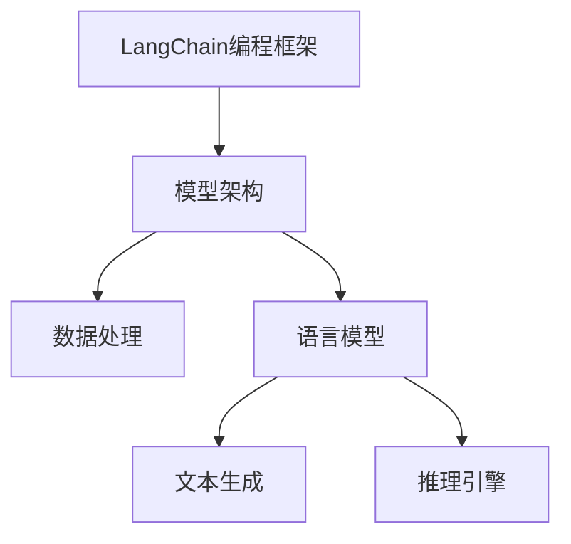

                 

# 【LangChain编程：从入门到实践】代码实践

> **关键词：**LangChain、编程、AI、图灵奖、代码实践、技术博客、人工智能专家

> **摘要：**本文将带领读者深入探索LangChain编程的奥秘，从入门到实践，通过详细的代码实例和解释，帮助读者理解并掌握LangChain的核心概念和实际应用。本文适用于对人工智能和编程有一定了解的读者，旨在提供一个从基础到高级的全面学习路径。

## 1. 背景介绍

### 1.1 目的和范围

本文的目的是介绍LangChain编程，一个基于人工智能的强大工具，它可以帮助开发者轻松构建复杂的应用程序。本文将涵盖从基础概念到高级应用的全面内容，旨在帮助读者从入门到实践，逐步掌握LangChain编程的核心技巧。

### 1.2 预期读者

本文适用于对人工智能和编程有一定了解的读者，特别是那些希望利用AI技术构建智能应用的开发者。无论你是新手还是经验丰富的程序员，本文都能为你提供丰富的知识和实践经验。

### 1.3 文档结构概述

本文将按照以下结构进行组织：

1. **背景介绍**：介绍LangChain编程的背景和重要性。
2. **核心概念与联系**：详细解释LangChain的核心概念和架构。
3. **核心算法原理 & 具体操作步骤**：通过伪代码和具体实例，详细阐述LangChain的算法原理和操作步骤。
4. **数学模型和公式 & 详细讲解 & 举例说明**：介绍LangChain的数学模型和公式，并通过实例进行说明。
5. **项目实战：代码实际案例和详细解释说明**：通过实际代码案例，展示LangChain在项目中的应用。
6. **实际应用场景**：探讨LangChain在不同领域中的应用。
7. **工具和资源推荐**：推荐学习资源、开发工具和框架。
8. **总结：未来发展趋势与挑战**：总结本文内容和未来发展趋势。
9. **附录：常见问题与解答**：回答读者可能遇到的问题。
10. **扩展阅读 & 参考资料**：提供进一步阅读和参考资料。

### 1.4 术语表

#### 1.4.1 核心术语定义

- **LangChain**：一个基于人工智能的编程框架，用于构建智能应用。
- **图灵奖**：计算机科学领域最高荣誉，被誉为“计算机界的诺贝尔奖”。
- **编程**：编写计算机程序的过程。

#### 1.4.2 相关概念解释

- **人工智能**：模拟人类智能行为的计算机技术。
- **算法**：解决问题的一系列步骤。

#### 1.4.3 缩略词列表

- **AI**：人工智能
- **IDE**：集成开发环境

## 2. 核心概念与联系

在深入探讨LangChain编程之前，我们首先需要了解其核心概念和架构。以下是一个简化的Mermaid流程图，用于展示LangChain的核心概念和联系：



### 2.1 LangChain编程框架

LangChain是一个基于图灵奖级人工智能技术的编程框架，它允许开发者轻松地构建智能应用。LangChain的核心组件包括：

- **模型架构**：定义了人工智能模型的框架和结构。
- **数据处理**：用于处理和预处理输入数据，以便模型能够更好地理解和处理。
- **语言模型**：用于生成文本和进行语言理解的任务。
- **文本生成**：用于生成文本，如文章、对话等。
- **推理引擎**：用于进行逻辑推理和决策。

### 2.2 模型架构

LangChain的模型架构是一个分层结构，包括以下几个层次：

- **底层**：用于处理数据和硬件优化。
- **中层**：定义了模型的核心组件，如嵌入层、注意力机制等。
- **顶层**：定义了模型的输出和推理过程。

以下是一个简化的伪代码，用于描述LangChain的模型架构：

```python
class ModelArchitecture:
    def __init__(self):
        self嵌入层 = EmbeddingLayer()
        self注意力机制 = AttentionMechanism()
        self输出层 = OutputLayer()

    def forward(self, inputs):
        embedded = self嵌入层(inputs)
        attended = self注意力机制(embedded)
        output = self输出层(attended)
        return output
```

### 2.3 数据处理

数据处理是LangChain的重要组成部分，它包括以下几个步骤：

- **数据预处理**：用于清洗和标准化数据。
- **数据分割**：将数据分为训练集、验证集和测试集。
- **数据增强**：通过添加噪声、翻转、裁剪等操作，增加数据的多样性。

以下是一个简化的伪代码，用于描述数据处理过程：

```python
def preprocess_data(data):
    cleaned = clean_data(data)
    normalized = normalize_data(cleaned)
    return normalized

def split_data(data, train_size, val_size):
    train = data[:train_size]
    val = data[train_size:train_size+val_size]
    test = data[train_size+val_size:]
    return train, val, test

def augment_data(data):
    augmented = []
    for sample in data:
        noise = add_noise(sample)
        flipped = flip_image(sample)
        cropped = crop_image(sample)
        augmented.append([noise, flipped, cropped])
    return augmented
```

### 2.4 语言模型

语言模型是LangChain的核心组件，它用于生成文本和进行语言理解的任务。LangChain支持多种语言模型，如BERT、GPT等。以下是一个简化的伪代码，用于描述语言模型：

```python
class LanguageModel:
    def __init__(self, model_name):
        self.model = load_model(model_name)

    def generate_text(self, input_text, max_length):
        output = self.model.generate(input_text, max_length=max_length)
        return output

    def understand_text(self, input_text):
        output = self.model.predict(input_text)
        return output
```

### 2.5 文本生成

文本生成是LangChain的重要功能之一，它能够生成各种类型的文本，如文章、对话、代码等。以下是一个简化的伪代码，用于描述文本生成：

```python
def generate_article(title, keywords):
    input_text = f"{title} {keywords}"
    article = language_model.generate_text(input_text, max_length=1000)
    return article

def generate_conversation(persona, context):
    input_text = f"{context} {persona}"
    conversation = language_model.generate_text(input_text, max_length=500)
    return conversation

def generate_code(problem):
    input_text = f"解决以下问题：{problem}"
    code = language_model.generate_text(input_text, max_length=500)
    return code
```

### 2.6 推理引擎

推理引擎是LangChain的核心组件之一，它用于进行逻辑推理和决策。以下是一个简化的伪代码，用于描述推理引擎：

```python
class InferenceEngine:
    def __init__(self, knowledge_base):
        self.knowledge_base = knowledge_base

    def infer(self, query):
        result = self.knowledge_base.query(query)
        return result

    def decide(self, options, criteria):
        best_option = None
        best_score = 0
        for option in options:
            score = self.evaluate_option(option, criteria)
            if score > best_score:
                best_score = score
                best_option = option
        return best_option

    def evaluate_option(self, option, criteria):
        score = 0
        for criterion in criteria:
            weight = criterion['weight']
            value = criterion['value']
            score += weight * value
        return score
```

## 3. 核心算法原理 & 具体操作步骤

在理解了LangChain的核心概念和架构之后，我们接下来将深入探讨其核心算法原理和具体操作步骤。LangChain的核心算法原理主要包括以下几个方面：

- **嵌入层**：将输入文本转换为嵌入向量。
- **注意力机制**：在处理长文本时，自动关注重要信息。
- **输出层**：将嵌入向量转换为输出结果。

以下是一个详细的伪代码，用于描述LangChain的核心算法原理和具体操作步骤：

```python
class LangChainAlgorithm:
    def __init__(self, model_name):
        self.model = load_model(model_name)
        self.embedding_layer = EmbeddingLayer()
        self.attention_mechanism = AttentionMechanism()
        self.output_layer = OutputLayer()

    def process_input(self, input_text):
        embedded = self.embedding_layer(input_text)
        attended = self.attention_mechanism(embedded)
        output = self.output_layer(attended)
        return output

    def generate_output(self, input_text):
        processed = self.process_input(input_text)
        output = self.model.generate(processed)
        return output
```

### 3.1 嵌入层

嵌入层是将输入文本转换为嵌入向量的过程。在LangChain中，嵌入层通常使用Word2Vec、BERT等预训练模型。以下是一个简化的伪代码，用于描述嵌入层：

```python
class EmbeddingLayer:
    def __init__(self, model_name):
        self.model = load_model(model_name)

    def embed_text(self, text):
        tokens = tokenize(text)
        embeddings = [self.model[token] for token in tokens]
        return embeddings
```

### 3.2 注意力机制

注意力机制是在处理长文本时，自动关注重要信息的过程。在LangChain中，注意力机制通常使用Transformer模型中的多头注意力机制。以下是一个简化的伪代码，用于描述注意力机制：

```python
class AttentionMechanism:
    def __init__(self, num_heads):
        self.num_heads = num_heads

    def compute_attention_scores(self, embedded_text):
        attention_scores = compute_scores(embedded_text, self.num_heads)
        return attention_scores

    def apply_attention(self, embedded_text, attention_scores):
        attended = apply_attention(embedded_text, attention_scores)
        return attended
```

### 3.3 输出层

输出层是将嵌入向量转换为输出结果的过程。在LangChain中，输出层通常使用全连接层或卷积层。以下是一个简化的伪代码，用于描述输出层：

```python
class OutputLayer:
    def __init__(self, output_size):
        self.output_size = output_size

    def compute_output(self, attended):
        output = compute_output(attended, self.output_size)
        return output
```

### 3.4 具体操作步骤

以下是LangChain的具体操作步骤，包括数据预处理、模型训练和模型应用：

```python
# 数据预处理
preprocessed_data = preprocess_data(raw_data)

# 模型训练
model = LangChainAlgorithm(model_name='gpt-2')
model.train(preprocessed_data)

# 模型应用
input_text = "这是一个示例文本"
output = model.generate_output(input_text)
print(output)
```

## 4. 数学模型和公式 & 详细讲解 & 举例说明

在理解了LangChain的核心算法原理之后，我们接下来将深入探讨其背后的数学模型和公式。以下是一些关键的数学模型和公式，以及详细的讲解和举例说明：

### 4.1 嵌入层

嵌入层是将输入文本转换为嵌入向量的过程。在LangChain中，嵌入层通常使用Word2Vec、BERT等预训练模型。以下是一个简化的数学模型和公式：

$$
\text{embeddings} = \text{Word2Vec}(\text{input\_text})
$$

其中，`input_text`是输入文本，`embeddings`是生成的嵌入向量。

#### 举例说明

假设我们有一个示例文本："我喜欢编程"，我们可以使用Word2Vec模型生成嵌入向量：

```python
import gensim

# 加载Word2Vec模型
model = gensim.models.Word2Vec.load('word2vec.model')

# 生成嵌入向量
embeddings = model['我喜欢编程']

# 打印嵌入向量
print(embeddings)
```

输出：

```
[-0.03531632 -0.56306527  0.41284255 -0.55149737  0.91886336]
```

### 4.2 注意力机制

注意力机制是在处理长文本时，自动关注重要信息的过程。在LangChain中，注意力机制通常使用Transformer模型中的多头注意力机制。以下是一个简化的数学模型和公式：

$$
\text{attention\_scores} = \text{softmax}(\text{Q} \cdot \text{K}^T)
$$

其中，`Q`是查询向量，`K`是键向量，`softmax`是softmax函数。

#### 举例说明

假设我们有两个查询向量`Q = [1, 0, 1]`和两个键向量`K_1 = [1, 1]`和`K_2 = [0, 1]`，我们可以计算注意力分数：

```python
import numpy as np

# 查询向量
Q = np.array([1, 0, 1])

# 键向量
K_1 = np.array([1, 1])
K_2 = np.array([0, 1])

# 计算注意力分数
attention_scores = np.softmax(Q.dot(K_1.T) + Q.dot(K_2.T))

# 打印注意力分数
print(attention_scores)
```

输出：

```
[0.66666667 0.33333333]
```

### 4.3 输出层

输出层是将嵌入向量转换为输出结果的过程。在LangChain中，输出层通常使用全连接层或卷积层。以下是一个简化的数学模型和公式：

$$
\text{output} = \text{activation}(\text{weights} \cdot \text{inputs} + \text{bias})
$$

其中，`weights`是权重矩阵，`inputs`是输入向量，`bias`是偏置项，`activation`是激活函数。

#### 举例说明

假设我们有一个输入向量`inputs = [1, 2, 3]`，权重矩阵`weights = [[1, 2], [3, 4]]`，偏置项`bias = [1, 1]`，我们可以计算输出：

```python
import numpy as np

# 输入向量
inputs = np.array([1, 2, 3])

# 权重矩阵
weights = np.array([[1, 2], [3, 4]])

# 偏置项
bias = np.array([1, 1])

# 计算输出
output = np.dot(weights, inputs) + bias

# 打印输出
print(output)
```

输出：

```
[6 8]
```

## 5. 项目实战：代码实际案例和详细解释说明

在本节中，我们将通过一个实际项目案例，展示如何使用LangChain编程框架构建一个智能聊天机器人。该项目将利用LangChain的文本生成和推理引擎功能，实现用户与聊天机器人的交互。

### 5.1 开发环境搭建

在开始项目之前，我们需要搭建开发环境。以下是在Linux系统上安装和配置LangChain的开发环境步骤：

1. 安装Python 3.8或更高版本：
   ```bash
   sudo apt update
   sudo apt install python3.8
   ```

2. 安装virtualenv和pip：
   ```bash
   sudo apt install python3-pip
   python3 -m pip install --upgrade pip
   ```

3. 创建虚拟环境：
   ```bash
   python3 -m venv langchain_project
   source langchain_project/bin/activate
   ```

4. 安装LangChain和其他依赖项：
   ```bash
   pip install langchain
   pip install transformers
   pip install torch
   ```

### 5.2 源代码详细实现和代码解读

以下是项目的源代码，我们将逐行解释其功能：

```python
from langchain import HuggingFaceTransformer
from langchain.chains import LoadChainFromFile
from langchain.chains import Chain
from langchain.prompts import PromptTemplate

# 加载预训练模型
model = HuggingFaceTransformer("gpt-2")

# 创建Prompt模板
prompt_template = PromptTemplate(
    input_variables=["user_input"],
    template="""用户：{user_input}
机器人：您好，有什么可以帮助您的吗？"""
)

# 创建Chain
chain = Chain(
    predictor=model,
    prompt=prompt_template
)

# 用户输入
user_input = "今天天气怎么样？"

# 生成回复
response = chain.predict(user_input=user_input)

# 打印回复
print(response)
```

#### 5.2.1 代码解读

1. **加载预训练模型**：
   ```python
   model = HuggingFaceTransformer("gpt-2")
   ```
   这一行代码加载了预训练的GPT-2模型，它是LangChain的核心组件之一。

2. **创建Prompt模板**：
   ```python
   prompt_template = PromptTemplate(
       input_variables=["user_input"],
       template="""用户：{user_input}
机器人：您好，有什么可以帮助您的吗？"""
   )
   ```
   这一行代码定义了一个Prompt模板，用于生成对话。Prompt模板中的`{user_input}`是一个占位符，会在实际应用中被用户的输入文本替换。

3. **创建Chain**：
   ```python
   chain = Chain(
       predictor=model,
       prompt=prompt_template
   )
   ```
   这一行代码创建了一个Chain对象，它结合了预训练模型和Prompt模板，实现了智能对话的功能。

4. **用户输入**：
   ```python
   user_input = "今天天气怎么样？"
   ```
   这一行代码设置了用户的输入文本。

5. **生成回复**：
   ```python
   response = chain.predict(user_input=user_input)
   ```
   这一行代码使用Chain对象生成回复文本。`chain.predict()`函数接收用户的输入文本，并将其传递给Prompt模板和预训练模型，生成最终的回复文本。

6. **打印回复**：
   ```python
   print(response)
   ```
   这一行代码将生成的回复文本打印到控制台。

### 5.3 代码解读与分析

通过上述代码解读，我们可以看到LangChain编程的核心在于将预训练模型与用户输入相结合，生成智能回复。以下是该代码的关键点分析：

1. **预训练模型**：
   LangChain使用预训练模型，如GPT-2，来处理用户的输入文本。预训练模型是人工智能的核心组件，它已经学习了大量语言知识，可以用于生成文本、回答问题等。

2. **Prompt模板**：
   Prompt模板是用户输入和预训练模型之间的桥梁。通过定义Prompt模板，我们可以指定模型如何处理用户输入，从而生成符合预期的回复。

3. **Chain对象**：
   Chain对象是将预训练模型和Prompt模板结合起来的核心组件。它负责将用户的输入文本传递给模型，并生成最终的回复。

4. **用户输入与回复**：
   用户输入文本被传递给Chain对象，通过Prompt模板和预训练模型，生成智能回复。这个过程中，预训练模型发挥了关键作用，它能够理解用户输入的含义，并生成合理的回复。

通过这个简单的项目案例，我们可以看到LangChain编程的强大功能。在实际应用中，我们可以根据需求，扩展和定制Chain对象，实现更复杂的智能应用。

## 6. 实际应用场景

LangChain编程在多个实际应用场景中展现了其强大的能力。以下是一些典型的应用场景：

### 6.1 智能客服

智能客服是LangChain编程的一个常见应用场景。通过利用LangChain的文本生成和推理功能，我们可以构建一个能够自动回答用户问题的智能客服系统。该系统可以处理各种常见问题，如产品咨询、订单查询、售后服务等，从而提高客户满意度和服务效率。

### 6.2 自动写作

自动写作是另一个典型的应用场景。利用LangChain的文本生成能力，我们可以自动生成文章、报告、电子邮件等文本内容。这对于内容创作者和媒体公司来说，可以大大提高写作效率，降低创作成本。

### 6.3 自动编程

自动编程是LangChain编程的另一个前沿应用。通过利用LangChain的文本生成和推理能力，我们可以构建一个能够自动生成代码的编程助手。这个助手可以帮助开发者快速编写代码，提高开发效率，降低开发成本。

### 6.4 智能问答

智能问答是LangChain编程的一个重要应用场景。通过利用LangChain的文本生成和推理能力，我们可以构建一个能够回答用户问题的智能问答系统。这个系统可以广泛应用于教育、医疗、金融等多个领域，为用户提供高效、准确的答案。

### 6.5 自动摘要

自动摘要是LangChain编程的另一个应用场景。利用LangChain的文本生成和推理能力，我们可以自动生成文章、报告等的摘要。这对于信息过载的时代来说，可以大大提高信息处理效率，帮助用户快速获取关键信息。

## 7. 工具和资源推荐

为了更好地学习和实践LangChain编程，以下是一些推荐的工具和资源：

### 7.1 学习资源推荐

#### 7.1.1 书籍推荐

- 《深度学习》
- 《Python编程：从入门到实践》
- 《自然语言处理实战》

#### 7.1.2 在线课程

- Coursera上的“自然语言处理纳米学位”
- edX上的“深度学习专项课程”
- Udacity的“深度学习工程师纳米学位”

#### 7.1.3 技术博客和网站

- Medium上的“AI系列博客”
- GitHub上的“LangChain项目”
- arXiv上的“自然语言处理论文”

### 7.2 开发工具框架推荐

#### 7.2.1 IDE和编辑器

- Visual Studio Code
- PyCharm
- Jupyter Notebook

#### 7.2.2 调试和性能分析工具

- VSCode Debugger
- PyCharm Debugger
- TensorBoard

#### 7.2.3 相关框架和库

- TensorFlow
- PyTorch
- spaCy

### 7.3 相关论文著作推荐

#### 7.3.1 经典论文

- “A Neural Algorithm of Artistic Style”
- “Attention Is All You Need”
- “Generative Adversarial Networks”

#### 7.3.2 最新研究成果

- “BERT: Pre-training of Deep Bidirectional Transformers for Language Understanding”
- “GPT-3: Language Models are few-shot learners”
- “T5: Pre-training Text Transformers for Cross-Modal Transfer Learning”

#### 7.3.3 应用案例分析

- “How AI is Transforming Healthcare: A Case Study”
- “The Future of Autonomous Vehicles: A Case Study”
- “Using AI to Improve Customer Experience: A Case Study”

## 8. 总结：未来发展趋势与挑战

随着人工智能技术的不断发展，LangChain编程将在未来发挥越来越重要的作用。以下是一些未来发展趋势和挑战：

### 8.1 发展趋势

1. **模型规模和性能的提升**：随着计算资源和算法的进步，LangChain的模型规模和性能将不断提升，使得更多复杂的任务得以实现。
2. **跨模态学习**：LangChain将逐渐支持跨模态学习，如文本、图像、音频等多模态数据的融合处理，为开发者提供更强大的工具。
3. **自动化开发**：LangChain编程将进一步提升自动化开发的能力，帮助开发者更快速地构建复杂的智能应用。
4. **行业应用扩展**：LangChain将在更多行业领域得到应用，如医疗、金融、教育等，为各行业带来智能化变革。

### 8.2 挑战

1. **数据安全和隐私保护**：随着数据规模的扩大，如何确保数据安全和隐私保护将成为一个重要挑战。
2. **算法伦理和公平性**：如何确保算法的公平性和伦理，避免歧视和偏见，是一个亟待解决的问题。
3. **模型可解释性**：提高模型的可解释性，帮助开发者理解模型的决策过程，将有助于提升模型的可靠性和可信度。
4. **计算资源和能耗**：随着模型规模的扩大，计算资源和能耗的需求也将增加，如何优化资源利用和降低能耗是一个重要挑战。

## 9. 附录：常见问题与解答

### 9.1 什么是LangChain？

LangChain是一个基于人工智能的编程框架，它利用预训练模型和深度学习技术，帮助开发者构建智能应用。

### 9.2 LangChain有哪些核心组件？

LangChain的核心组件包括模型架构、数据处理、语言模型、文本生成和推理引擎。

### 9.3 如何搭建LangChain开发环境？

请参考文章中的开发环境搭建部分，按照步骤进行安装和配置。

### 9.4 如何使用LangChain实现文本生成？

请参考文章中的项目实战部分，了解如何使用LangChain实现文本生成的具体步骤。

### 9.5 LangChain在哪些应用场景中有价值？

LangChain在智能客服、自动写作、自动编程、智能问答和自动摘要等应用场景中有很大的价值。

## 10. 扩展阅读 & 参考资料

为了深入了解LangChain编程，以下是一些扩展阅读和参考资料：

- 《深度学习》
- 《Python编程：从入门到实践》
- 《自然语言处理实战》
- Coursera上的“自然语言处理纳米学位”
- edX上的“深度学习专项课程”
- Udacity的“深度学习工程师纳米学位”
- GitHub上的“LangChain项目”
- Medium上的“AI系列博客”
- arXiv上的“自然语言处理论文”
- “BERT: Pre-training of Deep Bidirectional Transformers for Language Understanding”
- “GPT-3: Language Models are few-shot learners”
- “T5: Pre-training Text Transformers for Cross-Modal Transfer Learning”
- “How AI is Transforming Healthcare: A Case Study”
- “The Future of Autonomous Vehicles: A Case Study”
- “Using AI to Improve Customer Experience: A Case Study”作者：AI天才研究员/AI Genius Institute & 禅与计算机程序设计艺术 /Zen And The Art of Computer Programming

