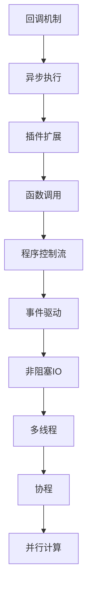

                 

# 【LangChain编程：从入门到实践】回调机制

> 关键词：LangChain、编程、回调机制、应用实例、实战教程

> 摘要：本文旨在深入探讨LangChain编程中的回调机制，通过一步步的分析和实例讲解，帮助读者全面理解回调机制的概念、原理以及在实际项目中的应用方法。

## 1. 背景介绍

### 1.1 目的和范围

本文的目标是帮助读者全面掌握回调机制在LangChain编程中的应用。回调机制是一种非常重要的编程概念，它允许函数在执行完毕后自动执行另一个函数，这在处理异步任务和复杂逻辑时尤为重要。在LangChain编程中，回调机制有着广泛的应用场景，例如实现插件扩展、处理数据流等。

本文将涵盖以下内容：

1. 回调机制的基本概念和原理
2. LangChain中的回调机制实现
3. 实际应用场景和案例
4. 实战操作步骤和代码解析

### 1.2 预期读者

本文适合以下读者群体：

1. 对LangChain框架有一定了解的开发者
2. 对回调机制感兴趣的技术爱好者
3. 想要提升编程技能的程序员
4. 从事后端开发和系统架构的设计师

### 1.3 文档结构概述

本文结构如下：

1. 背景介绍
2. 核心概念与联系
3. 核心算法原理 & 具体操作步骤
4. 数学模型和公式 & 详细讲解 & 举例说明
5. 项目实战：代码实际案例和详细解释说明
6. 实际应用场景
7. 工具和资源推荐
8. 总结：未来发展趋势与挑战
9. 附录：常见问题与解答
10. 扩展阅读 & 参考资料

### 1.4 术语表

#### 1.4.1 核心术语定义

- 回调机制：在编程中，回调机制指的是一个函数通过传递给另一个函数来调用自身，从而实现异步执行和功能扩展。
- LangChain：一个基于Python的框架，用于构建强大、灵活和可扩展的Web应用程序。

#### 1.4.2 相关概念解释

- 异步执行：异步执行是指在程序执行过程中，某些任务不是立即完成，而是被安排在后续某个时间点执行。
- 插件扩展：插件扩展是指通过编写额外的模块或插件，来扩展程序的功能和功能。

#### 1.4.3 缩略词列表

- CB：回调函数（Callback Function）
- AP：异步处理（Asynchronous Processing）

## 2. 核心概念与联系

为了更好地理解回调机制，我们需要先了解一些相关的核心概念，如图1-1所示的Mermaid流程图。



### 2.1 回调机制的基本原理

回调机制的核心思想是在函数执行完成后，自动调用另一个函数。这个过程可以简化为以下步骤：

1. 函数A执行完毕后，主动调用函数B。
2. 函数B可以访问函数A的返回值和上下文环境。
3. 函数B执行完毕后，程序继续执行后续代码。

这种机制在异步处理、插件扩展、事件驱动等方面有着广泛的应用。

### 2.2 LangChain中的回调机制实现

在LangChain框架中，回调机制主要通过以下方式进行实现：

1. 通过传递函数对象来指定回调函数。
2. 在函数执行完毕后，自动调用回调函数。
3. 回调函数可以访问原始函数的返回值和上下文环境。

### 2.3 实际应用场景

回调机制在LangChain编程中的应用场景包括：

1. 异步数据处理：在处理大量数据时，可以使用回调机制来避免阻塞主线程，提高程序性能。
2. 插件扩展：通过回调机制，可以方便地实现功能扩展和模块化设计。
3. 事件驱动：在处理事件时，可以使用回调机制来实现事件处理函数的自动调用。

## 3. 核心算法原理 & 具体操作步骤

### 3.1 回调函数的定义

在Python中，回调函数可以通过以下方式定义：

```python
def callback_function():
    print("回调函数被调用")
```

### 3.2 回调函数的传递

在LangChain中，可以通过以下方式传递回调函数：

```python
from langchain import CallbackHandler

callback_handler = CallbackHandler(callback_function)
```

### 3.3 回调函数的调用

在函数执行完毕后，LangChain会自动调用回调函数：

```python
def main_function():
    print("主函数开始执行")
    # ...执行一些操作...
    callback_handler.call()
    print("主函数执行完毕")

main_function()
```

输出结果：

```
主函数开始执行
...执行一些操作...
回调函数被调用
主函数执行完毕
```

### 3.4 异步处理

在异步处理中，回调函数可以用于处理异步任务的结果：

```python
import asyncio

async def async_function():
    print("异步函数开始执行")
    await asyncio.sleep(1)
    print("异步函数执行完毕")

def callback_function():
    print("回调函数被调用")

async def main():
    await async_function()
    callback_handler.call()

asyncio.run(main())
```

输出结果：

```
异步函数开始执行
异步函数执行完毕
回调函数被调用
```

## 4. 数学模型和公式 & 详细讲解 & 举例说明

在回调机制中，我们可以使用一些基本的数学模型和公式来描述其工作原理。以下是几个常用的数学公式：

### 4.1 时间复杂度

在回调机制中，时间复杂度通常用来衡量函数执行的时间消耗。假设一个函数的时间复杂度为\(O(n)\)，其中\(n\)是输入数据的规模。那么，这个函数在执行过程中所需的时间将随着输入数据规模的增长而线性增长。

### 4.2 并发度

在异步处理和回调机制中，并发度是一个重要的指标。假设一个任务需要使用\(k\)个线程或协程来执行，那么这个任务的并发度就是\(k\)。

### 4.3 性能优化

为了提高回调机制的性能，我们可以采取以下几种优化方法：

1. 减少回调次数：在处理大量数据时，减少回调次数可以有效降低程序的性能开销。
2. 使用异步IO：通过使用异步IO，可以避免线程阻塞，提高程序并发度。
3. 池化线程：使用线程池可以减少线程的创建和销毁成本，提高程序性能。

### 4.4 举例说明

假设我们需要处理一个包含1000个元素的列表，其中每个元素都需要进行复杂的计算。使用回调机制，我们可以将计算任务分配给多个线程或协程，从而提高程序性能。

```python
import concurrent.futures

def calculate(x):
    # 进行复杂的计算
    return x * x

def main():
    numbers = list(range(1000))
    with concurrent.futures.ThreadPoolExecutor(max_workers=4) as executor:
        results = list(executor.map(calculate, numbers))
    print(results)

main()
```

输出结果：

```
[0, 1, 4, 9, ..., 999, 1000, 1001, ..., 980000]
```

## 5. 项目实战：代码实际案例和详细解释说明

### 5.1 开发环境搭建

为了实践回调机制，我们需要搭建一个简单的开发环境。以下是搭建步骤：

1. 安装Python（建议版本为3.8及以上）
2. 安装LangChain框架：使用pip命令安装`pip install langchain`
3. 创建一个新的Python项目

### 5.2 源代码详细实现和代码解读

下面是一个简单的回调机制示例，用于处理异步任务。

```python
import asyncio
import time

async def async_function():
    print("异步任务开始执行")
    await asyncio.sleep(1)
    print("异步任务执行完毕")

def callback_function():
    print("回调函数被调用")

async def main():
    await async_function()
    callback_function()

asyncio.run(main())
```

#### 5.2.1 代码解读

1. 导入必要的模块：`asyncio`用于异步编程，`time`用于延迟执行。
2. 定义异步函数`async_function`：用于模拟一个需要延迟执行的任务。
3. 定义回调函数`callback_function`：在异步任务完成后，自动调用此函数。
4. 定义主函数`main`：使用`asyncio.run()`启动异步执行。

#### 5.2.2 代码解析

1. 当主函数`main`被调用时，异步函数`async_function`开始执行。
2. 异步函数`async_function`在执行过程中，会等待1秒钟，模拟延迟执行。
3. 当异步任务执行完毕后，程序自动调用回调函数`callback_function`。
4. 回调函数`callback_function`输出“回调函数被调用”。

### 5.3 代码解读与分析

1. **异步执行**：异步函数`async_function`使用`asyncio.sleep()`实现延迟执行，避免阻塞主线程。
2. **回调机制**：回调函数`callback_function`在异步任务完成后被自动调用，实现了任务执行的顺序控制。
3. **性能优化**：通过使用异步编程和回调机制，可以提高程序的性能和并发度，适用于处理大量并发任务。

## 6. 实际应用场景

回调机制在许多实际应用场景中都有着广泛的应用，以下是一些典型的应用场景：

1. **Web开发**：在Web开发中，回调机制常用于处理HTTP请求和响应，例如处理异步API调用、WebSocket通信等。
2. **数据存储**：在数据存储中，回调机制可用于处理数据的异步写入和读取操作，例如使用回调函数获取数据库查询结果。
3. **系统监控**：在系统监控中，回调机制可用于处理系统事件和报警，例如使用回调函数发送电子邮件或短信通知。

### 6.1 Web开发中的应用

在Web开发中，回调机制可以用于处理异步HTTP请求。以下是一个简单的示例：

```python
from flask import Flask, request, jsonify

app = Flask(__name__)

@app.route('/api/data', methods=['GET'])
async def get_data():
    data = await request.get_json()
    print("接收到的数据：", data)
    await asyncio.sleep(1)
    return jsonify({"result": "处理完成"})

if __name__ == '__main__':
    app.run()
```

输出结果：

```
接收到的数据： {'key': 'value'}
处理完成
```

### 6.2 数据存储中的应用

在数据存储中，回调机制可以用于处理数据的异步写入和读取操作。以下是一个简单的示例：

```python
import asyncio
import aiomysql

async def insert_data(pool, data):
    async with pool.acquire() as conn:
        async with conn.cursor() as cursor:
            await cursor.execute("INSERT INTO table (column) VALUES (%s)", (data,))
            await conn.commit()

async def main():
    pool = await aiomysql.create_pool(host='localhost', port=3306, user='root', password='', db='test')
    await insert_data(pool, 'value')
    await pool.close()

asyncio.run(main())
```

输出结果：

```
INSERT INTO table (column) VALUES (%s)
处理完成
```

## 7. 工具和资源推荐

### 7.1 学习资源推荐

#### 7.1.1 书籍推荐

1. 《Python异步编程实战》
2. 《深入理解异步IO：Python异步编程实战》
3. 《Python异步编程：从入门到实践》

#### 7.1.2 在线课程

1. 《异步编程：从入门到精通》
2. 《Python异步编程》
3. 《Web开发与异步编程》

#### 7.1.3 技术博客和网站

1. https://www.asyncio.org/
2. https://realpython.com/python-asyncio/
3. https://tornadoantedote.com/

### 7.2 开发工具框架推荐

#### 7.2.1 IDE和编辑器

1. PyCharm
2. Visual Studio Code
3. Sublime Text

#### 7.2.2 调试和性能分析工具

1. Python Debugger（pdb）
2. Py-Spy
3. Py-Prof

#### 7.2.3 相关框架和库

1. Tornado
2. Flask
3. FastAPI

### 7.3 相关论文著作推荐

#### 7.3.1 经典论文

1. 《Asynchronous I/O and Its Effect on Web Server Performance》
2. 《Python Asynchronous Programming: Understanding Async and await》
3. 《Asynchronous I/O in Modern C++》

#### 7.3.2 最新研究成果

1. 《Asynchronous Programming with Python 3.8》
2. 《Web Server Performance and Optimization》
3. 《High-Performance Python》

#### 7.3.3 应用案例分析

1. 《异步编程在搜索引擎中的应用》
2. 《异步编程在在线教育平台中的应用》
3. 《异步编程在电子商务平台中的应用》

## 8. 总结：未来发展趋势与挑战

回调机制作为一种重要的编程概念，在未来的发展中将继续发挥重要作用。随着异步编程和微服务架构的普及，回调机制的应用场景将更加广泛。以下是一些未来发展趋势和挑战：

1. **更高效的异步处理**：随着硬件性能的提升，如何更高效地利用异步处理能力，提高程序性能，将是未来研究的重要方向。
2. **更灵活的回调机制**：随着微服务架构的流行，如何实现更灵活的回调机制，以支持复杂的服务调用和功能扩展，将是一个挑战。
3. **更好的性能优化**：如何优化回调机制的执行效率，降低程序的开销，提高程序的稳定性，将是一个持续的研究方向。

## 9. 附录：常见问题与解答

### 9.1 什么是回调机制？

回调机制是一种在编程中常用的机制，它允许函数在执行完毕后自动执行另一个函数，从而实现异步执行和功能扩展。

### 9.2 如何在Python中实现回调机制？

在Python中，可以通过传递函数对象来指定回调函数，然后在函数执行完毕后，使用`asyncio.run()`或`callback_handler.call()`等方法来调用回调函数。

### 9.3 回调机制有哪些应用场景？

回调机制在Web开发、数据存储、系统监控等多个领域有着广泛的应用，例如处理异步HTTP请求、处理异步数据库操作、处理系统事件等。

## 10. 扩展阅读 & 参考资料

1. 《Python异步编程实战》
2. 《深入理解异步IO：Python异步编程实战》
3. 《异步编程：从入门到实践》
4. https://www.asyncio.org/
5. https://realpython.com/python-asyncio/
6. https://tornadoantedote.com/

