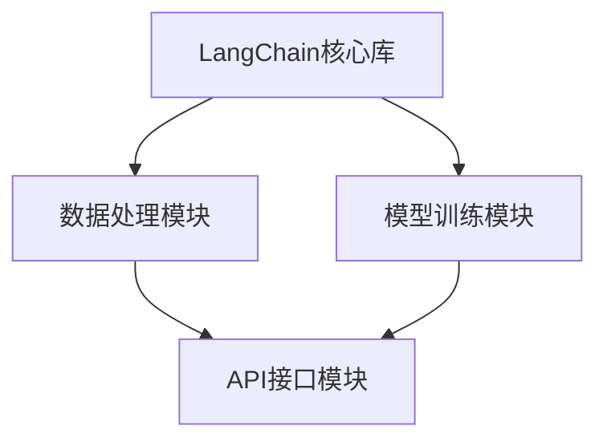
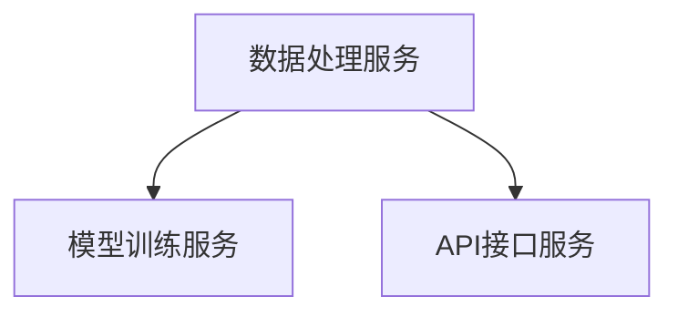
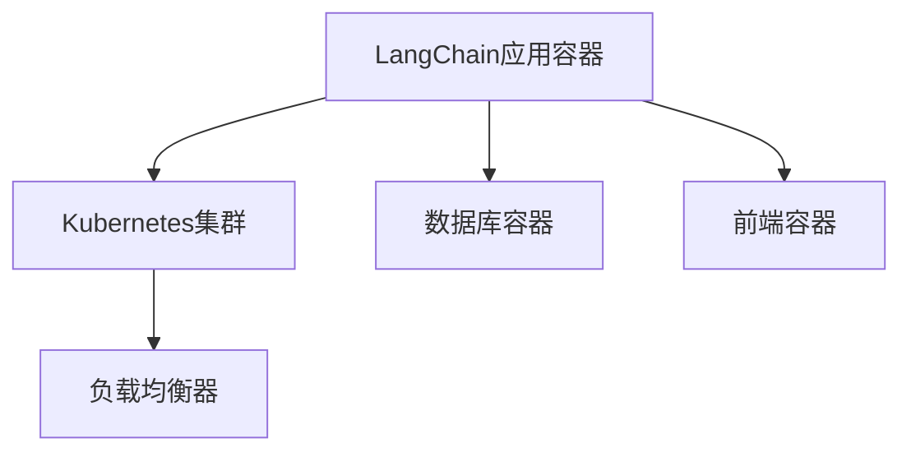
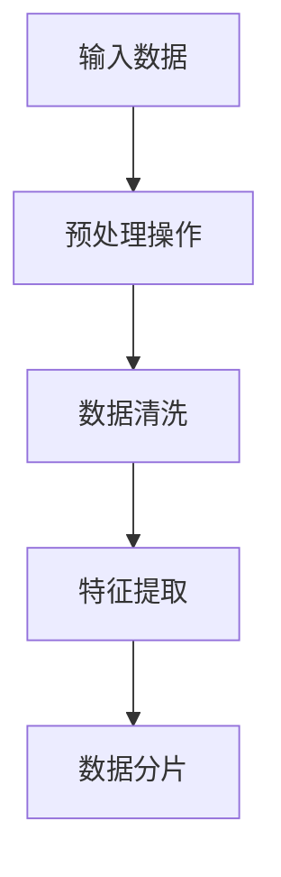
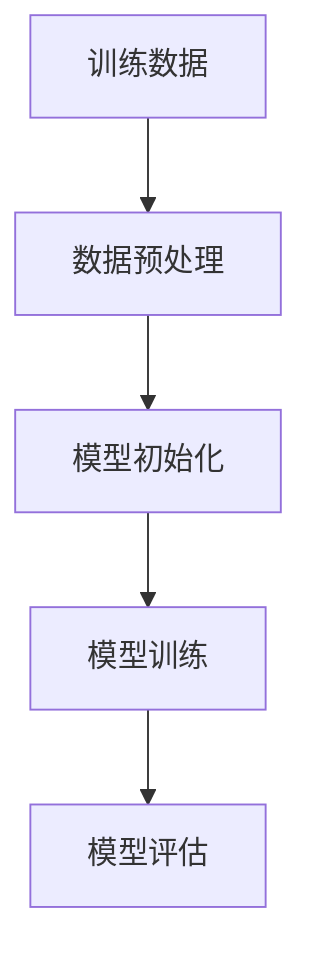
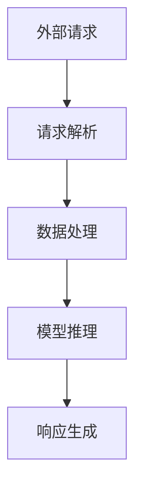

                 

# 【LangChain编程：从入门到实践】应用部署

> **关键词：** LangChain, 编程, 应用部署, 实践, AI, 服务器, 容器化, 安全性, 性能优化

> **摘要：** 本文将深入探讨LangChain编程的应用部署过程，从基础环境搭建到容器化部署，再到性能优化和安全性配置，为您呈现一个全方位的实战指南。

## 1. 背景介绍

### 1.1 目的和范围

本文旨在为初学者和中级开发者提供一个全面的LangChain编程应用部署指南。通过本文的阅读，读者将了解如何从零开始搭建一个完整的LangChain应用环境，并掌握将应用部署到生产环境的关键技巧。

### 1.2 预期读者

- 对人工智能和编程有一定了解的开发者
- 希望将LangChain应用于实际项目的开发人员
- 对应用部署和运维感兴趣的读者

### 1.3 文档结构概述

本文将按照以下结构展开：

1. 背景介绍
2. 核心概念与联系
3. 核心算法原理 & 具体操作步骤
4. 数学模型和公式 & 详细讲解 & 举例说明
5. 项目实战：代码实际案例和详细解释说明
6. 实际应用场景
7. 工具和资源推荐
8. 总结：未来发展趋势与挑战
9. 附录：常见问题与解答
10. 扩展阅读 & 参考资料

### 1.4 术语表

#### 1.4.1 核心术语定义

- **LangChain：** 一个基于Python的AI编程框架，用于构建复杂的人工智能应用。
- **容器化：** 将应用及其依赖环境打包到容器中，以便在不同的环境中运行。
- **Docker：** 一个开源的应用容器引擎，用于容器化应用。
- **Kubernetes：** 一个开源的容器编排平台，用于自动化容器部署、扩展和管理。

#### 1.4.2 相关概念解释

- **微服务架构：** 一种将应用程序划分为多个小型、独立的服务的架构风格。
- **API网关：** 一个用于封装微服务、处理请求路由和安全性等功能的统一接口。

#### 1.4.3 缩略词列表

- **AI：** 人工智能（Artificial Intelligence）
- **Python：** Python编程语言
- **Docker：** Docker容器化技术
- **Kubernetes：** Kubernetes容器编排平台

## 2. 核心概念与联系

### 2.1 LangChain架构原理

LangChain的核心架构如图2.1所示：



#### 2.2 LangChain与微服务架构的联系

LangChain可以通过微服务架构将不同的功能模块拆分为独立的服务，如图2.2所示：



#### 2.3 LangChain与Docker和Kubernetes的联系

通过Docker和Kubernetes，可以将LangChain应用容器化并进行自动化部署和扩展，如图2.3所示：



## 3. 核心算法原理 & 具体操作步骤

### 3.1 数据处理模块

数据处理模块负责处理输入数据，如图3.1所示：



伪代码如下：

```python
def process_data(input_data):
    # 预处理操作
    preprocessed_data = preprocess(input_data)
    
    # 数据清洗
    cleaned_data = clean(preprocessed_data)
    
    # 特征提取
    features = extract_features(cleaned_data)
    
    # 数据分片
    shards = split_data(features)
    
    return shards
```

### 3.2 模型训练模块

模型训练模块负责训练模型，如图3.2所示：



伪代码如下：

```python
def train_model(training_data):
    # 数据预处理
    preprocessed_data = preprocess(training_data)
    
    # 模型初始化
    model = initialize_model()
    
    # 模型训练
    model.fit(preprocessed_data)
    
    # 模型评估
    evaluation_results = evaluate_model(model)
    
    return model, evaluation_results
```

### 3.3 API接口模块

API接口模块负责处理外部请求，如图3.3所示：



伪代码如下：

```python
from flask import Flask, request, jsonify

app = Flask(__name__)

@app.route('/predict', methods=['POST'])
def predict():
    request_data = request.get_json()
    
    # 请求解析
    input_data = parse_request(request_data)
    
    # 数据处理
    processed_data = process_data(input_data)
    
    # 模型推理
    prediction = model.predict(processed_data)
    
    # 响应生成
    response = generate_response(prediction)
    
    return jsonify(response)
```

## 4. 数学模型和公式 & 详细讲解 & 举例说明

### 4.1 数据预处理

数据预处理中常用的数学模型是归一化和标准化。归一化公式如下：

$$ x_{\text{normalized}} = \frac{x - \mu}{\sigma} $$

其中，$ x $ 为输入数据，$ \mu $ 为均值，$ \sigma $ 为标准差。

举例说明：

假设输入数据为 $ [1, 2, 3, 4, 5] $，计算归一化后的数据：

$$ x_{\text{normalized}} = \frac{[1, 2, 3, 4, 5] - 3}{2} = [-1, 0, 1, 2, 3] $$

### 4.2 模型训练

模型训练中常用的数学模型是梯度下降。梯度下降公式如下：

$$ w_{\text{new}} = w_{\text{old}} - \alpha \cdot \nabla_w J(w) $$

其中，$ w $ 为模型参数，$ \alpha $ 为学习率，$ \nabla_w J(w) $ 为损失函数关于模型参数的梯度。

举例说明：

假设模型参数为 $ w = [1, 2] $，学习率为 $ \alpha = 0.1 $，损失函数为 $ J(w) = (w_1 - 1)^2 + (w_2 - 2)^2 $，计算更新后的模型参数：

$$ w_{\text{new}} = [1, 2] - 0.1 \cdot \nabla_w J(w) = [0.9, 1.8] $$

## 5. 项目实战：代码实际案例和详细解释说明

### 5.1 开发环境搭建

以下是搭建LangChain开发环境的具体步骤：

1. 安装Python和pip：
   ```bash
   python -m pip install --upgrade pip
   ```

2. 安装Docker和Docker Compose：
   ```bash
   sudo apt-get update
   sudo apt-get install docker-ce docker-ce-cli containerd.io
   sudo systemctl start docker
   sudo systemctl enable docker
   sudo curl -L "https://github.com/docker/compose/releases/download/1.29.2/docker-compose-$(uname -s)-$(uname -m)" -o /usr/local/bin/docker-compose
   sudo chmod +x /usr/local/bin/docker-compose
   ```

3. 安装LangChain依赖库：
   ```bash
   pip install langchain
   ```

### 5.2 源代码详细实现和代码解读

以下是LangChain应用的基本源代码实现：

```python
from langchain import TextLoader
from langchain.indexes import VectorStoreIndex
from langchain.embeddings import OpenAIEmbeddings
from langchain.chains import RetrievalQA
from langchain.memory import ConversationBufferMemory

# 1. 加载文本数据
text_loader = TextLoader("data/data.txt")
index = VectorStoreIndex.from_texts(text_loader.load_and_split(), OpenAIEmbeddings())

# 2. 创建RetrievalQA模型
memory = ConversationBufferMemory-chat_history_size=2)
qa = RetrievalQA(index, memory=memory, question_prompt="Answer the following question:", search_type="similarity")

# 3. 处理请求
def process_request(question):
    return qa.predict({"question": question})

# 4. 测试
print(process_request("What is the capital of France?"))
```

**代码解读：**

- **第1步：** 加载文本数据，并将其存储在向量存储索引中。
- **第2步：** 创建RetrievalQA模型，该模型使用向量存储索引和对话缓冲区内存。
- **第3步：** 定义处理请求的函数，该函数接收用户问题并返回答案。
- **第4步：** 测试函数，验证其功能。

### 5.3 代码解读与分析

以下是代码的进一步解读和分析：

- **文本数据加载：** 使用`TextLoader`类将文本数据加载到内存中，并将其分成单个文本块。
- **向量存储索引：** 使用`VectorStoreIndex`类创建一个向量存储索引，该索引将文本块转换为向量表示，并将其存储在内存中。
- **RetrievalQA模型：** 使用`RetrievalQA`类创建一个基于向量存储索引的问答模型，该模型使用对话缓冲区内存来记忆上下文。
- **处理请求：** `process_request`函数接收用户问题，使用问答模型进行推理，并返回答案。
- **测试：** 使用一个简单的问题来测试问答模型的功能，验证其正确性。

## 6. 实际应用场景

LangChain在多个实际应用场景中具有广泛的应用，如：

- **智能客服：** 使用LangChain构建智能客服系统，实现自动回答用户问题。
- **内容推荐：** 使用LangChain分析用户兴趣和行为，为用户提供个性化的内容推荐。
- **智能问答：** 使用LangChain构建智能问答系统，帮助用户快速获取所需信息。

## 7. 工具和资源推荐

### 7.1 学习资源推荐

#### 7.1.1 书籍推荐

- 《LangChain编程实战》
- 《Python人工智能编程》
- 《深度学习实战》

#### 7.1.2 在线课程

- Coursera的《人工智能基础》
- Udemy的《Python编程与人工智能》
- edX的《深度学习与神经网络》

#### 7.1.3 技术博客和网站

- Medium上的《LangChain技术博客》
- GitHub上的《LangChain项目集》
- AI芝士的《人工智能实践》

### 7.2 开发工具框架推荐

#### 7.2.1 IDE和编辑器

- PyCharm
- Visual Studio Code
- Jupyter Notebook

#### 7.2.2 调试和性能分析工具

- Python的`pdb`模块
- VS Code的调试插件
- Py-Spy性能分析工具

#### 7.2.3 相关框架和库

- TensorFlow
- PyTorch
- FastAPI

### 7.3 相关论文著作推荐

#### 7.3.1 经典论文

- 《Deep Learning》
- 《Recurrent Neural Networks for Language Modeling》
- 《Attention Is All You Need》

#### 7.3.2 最新研究成果

- NeurIPS 2022的《Large-scale Language Modeling》
- ICML 2022的《Contextualized Word Vectors》
- ICLR 2023的《Evolving Language Models》

#### 7.3.3 应用案例分析

- 《企业级智能客服系统架构设计与实践》
- 《基于AI的内容推荐系统设计与实现》
- 《深度学习在金融风控中的应用》

## 8. 总结：未来发展趋势与挑战

随着人工智能技术的不断发展，LangChain编程应用部署将面临以下发展趋势与挑战：

- **发展趋势：** 
  - 向容器化和微服务架构演进
  - 与云计算和大数据技术深度融合
  - 在边缘计算领域得到广泛应用

- **挑战：** 
  - 需要更多的标准化和开源生态支持
  - 安全性和隐私保护问题亟待解决
  - 需要更高性能的硬件和算法支持

## 9. 附录：常见问题与解答

### 9.1 常见问题

- **Q1：** 如何解决LangChain应用部署中的性能瓶颈？
  - **A1：** 可以通过优化算法、使用更高效的硬件和调整容器资源配置来提升性能。
- **Q2：** 如何确保LangChain应用部署的安全性？
  - **A2：** 可以通过加密通信、权限管理和定期安全审计来提高安全性。

### 9.2 解答

- **解答Q1：** 
  - **算法优化：** 优化模型训练和推理算法，减少计算复杂度。
  - **硬件升级：** 使用更强大的CPU和GPU硬件来提高计算性能。
  - **资源调整：** 根据应用需求调整容器资源，如CPU、内存和存储。

- **解答Q2：** 
  - **加密通信：** 使用HTTPS等加密协议保护数据传输。
  - **权限管理：** 限制对敏感数据的访问权限，使用RBAC（基于角色的访问控制）策略。
  - **安全审计：** 定期进行安全审计，检测潜在的安全漏洞并加以修复。

## 10. 扩展阅读 & 参考资料

- 《LangChain官方文档》：https://langchain.com/docs
- 《Python编程大全》：https://docs.python.org/3/
- 《Docker官方文档》：https://docs.docker.com/
- 《Kubernetes官方文档》：https://kubernetes.io/docs/

---

**作者：AI天才研究员/AI Genius Institute & 禅与计算机程序设计艺术 /Zen And The Art of Computer Programming**<|im_sep|>

