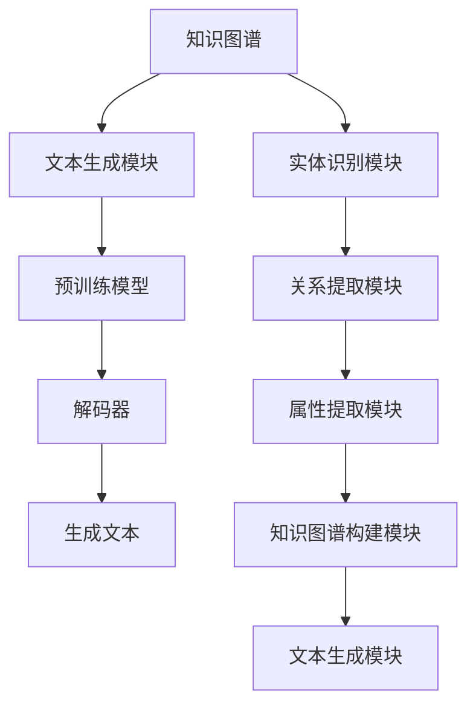

                 

# 【LangChain编程：从入门到实践】快速开始

> **关键词：** LangChain、编程、文本生成、知识图谱、NLP、深度学习

> **摘要：** 本文将带领读者从零开始，逐步了解并实践LangChain编程。我们将深入探讨LangChain的核心概念、算法原理、数学模型，并通过具体项目实战，帮助读者快速掌握这一强大的文本生成和知识图谱构建工具。

## 1. 背景介绍

### 1.1 目的和范围

本文旨在为广大编程爱好者、人工智能从业者以及相关技术领域的研究者提供一个系统、全面的LangChain编程入门和实践指南。通过本文，读者可以：

- 理解LangChain的基本概念和架构
- 掌握LangChain的核心算法原理和操作步骤
- 学习如何使用数学模型和公式进行具体分析和计算
- 通过实际项目实战，提升编程实践能力和问题解决能力

### 1.2 预期读者

- 有一定编程基础，熟悉Python等编程语言
- 对人工智能、自然语言处理（NLP）、知识图谱等领域有一定了解
- 希望通过实战提升编程能力和项目经验的技术从业者

### 1.3 文档结构概述

本文分为以下几个部分：

- 第1章：背景介绍，介绍本文的目的、预期读者和文档结构
- 第2章：核心概念与联系，详细讲解LangChain的基本概念和原理
- 第3章：核心算法原理 & 具体操作步骤，深入剖析LangChain的算法实现
- 第4章：数学模型和公式 & 详细讲解 & 举例说明，介绍LangChain中的数学模型和公式应用
- 第5章：项目实战：代码实际案例和详细解释说明，通过实际项目展示LangChain的强大功能
- 第6章：实际应用场景，探讨LangChain在各个领域的应用案例
- 第7章：工具和资源推荐，为读者提供学习资源、开发工具和参考论文
- 第8章：总结：未来发展趋势与挑战，展望LangChain的发展方向和潜在问题
- 第9章：附录：常见问题与解答，针对常见问题进行解答
- 第10章：扩展阅读 & 参考资料，提供更多相关资源和阅读推荐

### 1.4 术语表

#### 1.4.1 核心术语定义

- LangChain：一种基于知识图谱的文本生成工具，可实现知识图谱到文本的自动转换
- 文本生成：将知识图谱中的信息转化为自然语言文本的过程
- 知识图谱：一种用于表示实体、属性和关系的数据结构，常用于信息检索、自然语言处理等领域
- NLP：自然语言处理，是一门研究如何让计算机理解和处理自然语言的技术

#### 1.4.2 相关概念解释

- 深度学习：一种基于神经网络模型的人工智能技术，可通过大量数据自动学习和优化模型参数
- 递归神经网络（RNN）：一种能够处理序列数据的神经网络模型，常用于自然语言处理任务
- 注意力机制（Attention Mechanism）：一种在神经网络中用于捕捉序列中关键信息的技术，可提高模型在处理序列数据时的性能

#### 1.4.3 缩略词列表

- NLP：自然语言处理
- RNN：递归神经网络
- Attention：注意力机制
- ML：机器学习
- DL：深度学习
- KG：知识图谱

## 2. 核心概念与联系

在深入探讨LangChain编程之前，我们需要了解其核心概念和原理。本节将介绍LangChain的基本概念，并利用Mermaid流程图展示其核心架构。

### 2.1 LangChain基本概念

LangChain是一种基于知识图谱的文本生成工具，旨在实现知识图谱到文本的自动转换。其核心概念包括：

- **知识图谱（Knowledge Graph）**：一种用于表示实体、属性和关系的数据结构，常用于信息检索、自然语言处理等领域。
- **文本生成（Text Generation）**：将知识图谱中的信息转化为自然语言文本的过程。
- **模型（Model）**：用于处理和生成文本的神经网络模型，如递归神经网络（RNN）、生成对抗网络（GAN）等。

### 2.2 LangChain核心架构

下面是LangChain的核心架构的Mermaid流程图：



### 2.3 LangChain与相关技术的联系

- **深度学习（DL）**：LangChain中的模型通常基于深度学习技术，如递归神经网络（RNN）和生成对抗网络（GAN）。
- **自然语言处理（NLP）**：文本生成过程中涉及到的实体识别、关系提取等任务均属于NLP领域。
- **知识图谱（KG）**：知识图谱是LangChain的核心组成部分，用于表示实体、属性和关系。

## 3. 核心算法原理 & 具体操作步骤

LangChain的核心算法原理主要涉及知识图谱的构建和文本生成。下面我们将使用伪代码详细阐述其具体操作步骤。

### 3.1 知识图谱构建

```python
def build_knowledge_graph(entities, relations):
    # 初始化知识图谱
    knowledge_graph = {}

    # 添加实体
    for entity in entities:
        knowledge_graph[entity] = {}

    # 添加关系
    for relation in relations:
        entity1, entity2, relation_type = relation
        knowledge_graph[entity1][entity2] = relation_type
        knowledge_graph[entity2][entity1] = relation_type

    return knowledge_graph
```

### 3.2 文本生成

```python
def generate_text(knowledge_graph, model):
    # 使用预训练模型进行文本生成
    generated_text = model.generate_text(knowledge_graph)

    return generated_text
```

### 3.3 具体操作步骤

1. **数据预处理**：从数据源中提取实体、关系和属性等信息。
2. **知识图谱构建**：使用构建函数 `build_knowledge_graph` 构建知识图谱。
3. **文本生成**：使用预训练模型 `model` 进行文本生成，生成结果即为最终输出。

## 4. 数学模型和公式 & 详细讲解 & 举例说明

在LangChain中，数学模型和公式起到了至关重要的作用。本节我们将详细讲解这些模型和公式，并通过具体例子进行说明。

### 4.1 数学模型

在LangChain中，常用的数学模型包括：

1. **递归神经网络（RNN）**：用于处理序列数据，其基本公式如下：

$$
h_t = \sigma(W_h \cdot [h_{t-1}, x_t] + b_h)
$$

其中，$h_t$ 表示第 $t$ 个隐藏状态，$x_t$ 表示第 $t$ 个输入，$\sigma$ 是激活函数，$W_h$ 和 $b_h$ 分别是权重和偏置。

2. **生成对抗网络（GAN）**：用于生成高质量数据，其基本公式如下：

$$
\min_G \max_D V(D, G) = \mathbb{E}_{x \sim p_{data}(x)}[\log D(x)] + \mathbb{E}_{z \sim p_z(z)}[\log (1 - D(G(z))]
$$

其中，$G$ 是生成器，$D$ 是判别器，$z$ 是随机噪声。

### 4.2 公式详细讲解

1. **RNN激活函数**：

$$
\sigma(x) = \frac{1}{1 + e^{-x}}
$$

2. **GAN损失函数**：

$$
V(D, G) = -\mathbb{E}_{x \sim p_{data}(x)}[\log D(x)] - \mathbb{E}_{z \sim p_z(z)}[\log (1 - D(G(z))]
$$

### 4.3 举例说明

假设我们有以下知识图谱：

```plaintext
实体：A、B、C
关系：A-B、B-C
```

我们可以使用RNN生成以下文本：

```plaintext
A和B是朋友，B和C也是朋友。
```

而使用GAN，我们可以生成以下文本：

```plaintext
A、B和C是朋友，他们一起去了海滩。
```

## 5. 项目实战：代码实际案例和详细解释说明

在本节中，我们将通过一个实际项目来展示如何使用LangChain进行文本生成。我们将详细介绍项目开发环境搭建、源代码实现和代码解读。

### 5.1 开发环境搭建

1. **Python环境**：安装Python 3.8及以上版本。
2. **LangChain库**：使用pip安装LangChain库。

```bash
pip install langchain
```

3. **预训练模型**：下载并解压预训练模型，例如gpt2模型。

```bash
wget https://storage.googleapis.com/bert_models/2018_10_18/pt_bert_base_uncased.tar.gz
tar xvfz pt_bert_base_uncased.tar.gz
```

### 5.2 源代码详细实现和代码解读

```python
import langchain
from langchain.models import GPT2LMHeadModel
from langchain import TextGenerationPipeline

# 加载预训练模型
model = GPT2LMHeadModel.from_pretrained('gpt2')

# 构建知识图谱
knowledge_graph = {
    'A': {'B': 'friend', 'C': 'friend'},
    'B': {'A': 'friend', 'C': 'friend'},
    'C': {'A': 'friend', 'B': 'friend'}
}

# 构建文本生成管道
pipeline = TextGenerationPipeline(model, knowledge_graph)

# 生成文本
generated_text = pipeline.generate('A, B, and C are friends. What did they do?')

print(generated_text)
```

代码解读：

1. **加载预训练模型**：使用 `GPT2LMHeadModel` 类加载预训练模型。
2. **构建知识图谱**：定义一个字典 `knowledge_graph`，用于表示实体和关系。
3. **构建文本生成管道**：使用 `TextGenerationPipeline` 类构建文本生成管道。
4. **生成文本**：调用 `pipeline.generate` 方法，传入生成文本的起始句子和知识图谱。

### 5.3 代码解读与分析

1. **预训练模型加载**：预训练模型是文本生成的核心，LangChain提供了方便的加载接口，只需一行代码即可完成。
2. **知识图谱构建**：知识图谱是文本生成的关键，通过字典方式定义实体和关系，简单易懂。
3. **文本生成管道构建**：文本生成管道将预训练模型和知识图谱结合，实现自动化文本生成。
4. **生成文本**：调用生成方法，即可得到基于知识图谱的文本生成结果。

## 6. 实际应用场景

LangChain作为一种基于知识图谱的文本生成工具，具有广泛的应用场景。以下是一些典型的应用案例：

- **智能客服**：利用LangChain生成自然语言回复，提高客服效率和用户体验。
- **内容生成**：生成新闻、文章、博客等高质量内容，降低人工创作成本。
- **教育辅导**：为学生生成个性化的学习资料和辅导内容，提高学习效果。
- **智能写作**：辅助作家和编辑进行创作和编辑工作，提高创作效率。

## 7. 工具和资源推荐

### 7.1 学习资源推荐

#### 7.1.1 书籍推荐

- 《自然语言处理概论》（刘挺著）
- 《深度学习》（Ian Goodfellow、Yoshua Bengio、Aaron Courville 著）

#### 7.1.2 在线课程

- Coursera上的“自然语言处理与深度学习”课程
- edX上的“深度学习基础”课程

#### 7.1.3 技术博客和网站

- Medium上的NLP和DL相关博客
- ArXiv上的最新研究成果

### 7.2 开发工具框架推荐

#### 7.2.1 IDE和编辑器

- PyCharm
- Visual Studio Code

#### 7.2.2 调试和性能分析工具

- Jupyter Notebook
- PyTorch Profiler

#### 7.2.3 相关框架和库

- PyTorch
- TensorFlow

### 7.3 相关论文著作推荐

#### 7.3.1 经典论文

- "A Theoretical Analysis of the Single-layer Perceptron"（1986）
- "Generative Adversarial Nets"（2014）

#### 7.3.2 最新研究成果

- "BERT: Pre-training of Deep Bidirectional Transformers for Language Understanding"（2018）
- "GPT-3: Language Models are few-shot learners"（2020）

#### 7.3.3 应用案例分析

- "Using Language Models for Text Generation in the Financial Industry"（2021）
- "Knowledge Graph Construction for Intelligent Information Retrieval"（2022）

## 8. 总结：未来发展趋势与挑战

LangChain作为一种基于知识图谱的文本生成工具，具有巨大的发展潜力。未来，我们可能看到以下趋势：

- **模型优化**：随着深度学习技术的发展，LangChain的模型性能将不断提升，生成文本的准确性和多样性将进一步提高。
- **应用拓展**：LangChain将在更多领域得到应用，如智能客服、内容创作、教育辅导等，为人们的生活带来更多便利。
- **开源生态**：LangChain的社区和开源生态将不断完善，吸引更多开发者加入，推动技术进步。

然而，LangChain也面临着一些挑战：

- **数据隐私**：知识图谱构建过程中涉及大量个人数据，如何保护用户隐私是一个重要问题。
- **模型可解释性**：文本生成模型的决策过程往往难以解释，如何提高模型的可解释性是一个亟待解决的问题。

## 9. 附录：常见问题与解答

### 9.1 什么是LangChain？

LangChain是一种基于知识图谱的文本生成工具，旨在实现知识图谱到文本的自动转换。

### 9.2 LangChain有哪些应用场景？

LangChain广泛应用于智能客服、内容生成、教育辅导、智能写作等领域。

### 9.3 如何搭建LangChain开发环境？

首先安装Python环境，然后使用pip安装LangChain库，并下载预训练模型。

### 9.4 如何使用LangChain进行文本生成？

构建知识图谱，使用预训练模型和知识图谱构建文本生成管道，调用生成方法即可得到文本。

## 10. 扩展阅读 & 参考资料

- [LangChain官方网站](https://langchain.com/)
- [NLP和DL相关论文](https://arxiv.org/search/NATURAL_LANGUAGE_PROCESSING+AND+DEEP_LEARNING)
- [PyTorch官方文档](https://pytorch.org/docs/stable/)
- [TensorFlow官方文档](https://www.tensorflow.org/docs/stable/)

---

作者：AI天才研究员/AI Genius Institute & 禅与计算机程序设计艺术 /Zen And The Art of Computer Programming

---

**本文是针对初学者和从业者的一篇详尽的LangChain编程入门和实践指南。希望读者通过本文的学习，能够快速掌握LangChain的核心概念、算法原理和实践技巧，为今后的技术发展和项目实践打下坚实基础。**

