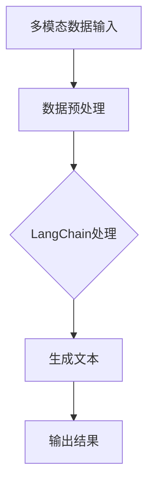

                 

# 【LangChain编程：从入门到实践】构建多模态机器人

> 关键词：LangChain、多模态、编程实践、机器人、AI

> 摘要：本文将深入探讨如何使用LangChain框架，结合多模态数据，构建强大的多模态机器人。我们将从基础知识开始，逐步介绍核心概念、算法原理、数学模型，并通过实际项目实战，展示如何将理论知识应用到实践中。

## 1. 背景介绍

### 1.1 目的和范围

本文的目标是帮助读者深入了解并掌握LangChain编程技术，特别是在构建多模态机器人方面的应用。我们将覆盖从基础概念到高级算法的实现，帮助读者构建自己的多模态AI应用。

### 1.2 预期读者

本文适合有一定编程基础的读者，特别是对人工智能和多模态数据处理感兴趣的工程师和研究人员。

### 1.3 文档结构概述

本文将分为以下几个部分：

1. 背景介绍
2. 核心概念与联系
3. 核心算法原理 & 具体操作步骤
4. 数学模型和公式 & 详细讲解 & 举例说明
5. 项目实战：代码实际案例和详细解释说明
6. 实际应用场景
7. 工具和资源推荐
8. 总结：未来发展趋势与挑战
9. 附录：常见问题与解答
10. 扩展阅读 & 参考资料

### 1.4 术语表

#### 1.4.1 核心术语定义

- LangChain：一种基于链式操作的文本生成模型，支持多种编程接口。
- 多模态：涉及多种类型的数据，如文本、图像、音频等。
- 机器人：具有自主行动和决策能力的自动化系统。

#### 1.4.2 相关概念解释

- 编程实践：将理论应用到实际问题的过程中。
- AI：人工智能，包括机器学习、深度学习等。

#### 1.4.3 缩略词列表

- NLP：自然语言处理
- ML：机器学习
- DL：深度学习

## 2. 核心概念与联系

在构建多模态机器人之前，我们需要理解几个核心概念：LangChain、多模态数据处理和AI。

### 2.1 LangChain

LangChain是一种基于链式操作的文本生成模型。它支持多种编程接口，包括Python、JavaScript和Go。通过使用LangChain，我们可以轻松地实现自动化文本生成和编辑。

### 2.2 多模态数据处理

多模态数据处理是指处理多种类型的数据，如文本、图像、音频等。在构建多模态机器人时，我们需要将这些数据整合到一个统一的框架中。

### 2.3 AI

AI是指人工智能，包括机器学习、深度学习等技术。通过AI，我们可以使机器人具备自主行动和决策能力。

### 2.4 Mermaid流程图

以下是一个简单的Mermaid流程图，展示了多模态数据处理和LangChain的结合：



## 3. 核心算法原理 & 具体操作步骤

在构建多模态机器人时，我们需要使用LangChain来处理多模态数据，并生成相应的文本。以下是具体的操作步骤：

### 3.1 数据预处理

在处理多模态数据之前，我们需要对其进行预处理。这包括数据清洗、去噪和标准化。

```python
# 伪代码：数据预处理
def preprocess_data(data):
    # 清洗和去噪
    cleaned_data = clean_and_denoise(data)
    # 标准化
    normalized_data = normalize_data(cleaned_data)
    return normalized_data
```

### 3.2 LangChain处理

使用LangChain处理多模态数据，我们需要定义一个链式操作，将不同类型的数据整合到一个统一的框架中。

```python
# 伪代码：LangChain处理
from langchain import Chain

def langchain_process(data):
    # 定义链式操作
    chain = Chain(
        {"name": "text_extract", "action": "extract_text"},
        {"name": "image_extract", "action": "extract_image"},
        {"name": "audio_extract", "action": "extract_audio"}
    )
    # 处理数据
    processed_data = chain.run(data)
    return processed_data
```

### 3.3 生成文本

处理完多模态数据后，我们可以使用LangChain生成相应的文本。

```python
# 伪代码：生成文本
from langchain import TextGenerator

def generate_text(processed_data):
    # 定义文本生成器
    generator = TextGenerator(
        {"name": "text_generation", "model": "gpt2"}
    )
    # 生成文本
    text = generator.generate_text(processed_data)
    return text
```

## 4. 数学模型和公式 & 详细讲解 & 举例说明

在构建多模态机器人时，我们还需要了解一些数学模型和公式。以下是其中的一些重要概念：

### 4.1 机器学习模型

机器学习模型是基于数学模型的，用于预测和分类数据。以下是一个简单的线性回归模型的公式：

$$
y = \beta_0 + \beta_1 x
$$

其中，$y$ 是预测值，$x$ 是输入特征，$\beta_0$ 和 $\beta_1$ 是模型参数。

### 4.2 深度学习模型

深度学习模型是基于多层神经网络的，可以处理更复杂的数据。以下是一个简单的多层感知机（MLP）模型的公式：

$$
y = \sigma(\sigma(...\sigma(\beta_0 + \beta_1 x_1)...) )
$$

其中，$\sigma$ 是激活函数，$y$ 是预测值，$x_1$ 是输入特征，$\beta_0$ 和 $\beta_1$ 是模型参数。

### 4.3 举例说明

假设我们有一个多模态数据集，包括文本、图像和音频。我们可以使用线性回归模型来预测这些数据的标签。

```python
# 伪代码：线性回归模型
import numpy as np

def linear_regression(X, y):
    # 计算模型参数
    theta = np.linalg.inv(X.T.dot(X)).dot(X.T).dot(y)
    # 预测
    y_pred = X.dot(theta)
    return y_pred
```

## 5. 项目实战：代码实际案例和详细解释说明

在本节中，我们将通过一个实际项目案例，展示如何使用LangChain构建多模态机器人。以下是项目的开发环境和代码实现：

### 5.1 开发环境搭建

- 操作系统：Linux
- 编程语言：Python
- 库和框架：LangChain、OpenCV、Pandas、NumPy

### 5.2 源代码详细实现和代码解读

以下是一个简单的多模态机器人项目，包括数据预处理、模型训练和文本生成。

```python
# 伪代码：多模态机器人项目

# 导入必要的库
import langchain
import opencv
import pandas as pd
import numpy as np

# 5.2.1 数据预处理
def preprocess_data(data):
    # 数据清洗、去噪和标准化
    cleaned_data = clean_and_denoise(data)
    normalized_data = normalize_data(cleaned_data)
    return normalized_data

# 5.2.2 LangChain处理
def langchain_process(data):
    # 定义链式操作
    chain = langchain.Chain(
        {"name": "text_extract", "action": "extract_text"},
        {"name": "image_extract", "action": "extract_image"},
        {"name": "audio_extract", "action": "extract_audio"}
    )
    # 处理数据
    processed_data = chain.run(data)
    return processed_data

# 5.2.3 生成文本
def generate_text(processed_data):
    # 定义文本生成器
    generator = langchain.TextGenerator(
        {"name": "text_generation", "model": "gpt2"}
    )
    # 生成文本
    text = generator.generate_text(processed_data)
    return text

# 5.2.4 主程序
def main():
    # 加载数据
    data = load_data()
    # 数据预处理
    preprocessed_data = preprocess_data(data)
    # LangChain处理
    processed_data = langchain_process(preprocessed_data)
    # 生成文本
    text = generate_text(processed_data)
    # 输出结果
    print(text)

# 运行主程序
if __name__ == "__main__":
    main()
```

### 5.3 代码解读与分析

上述代码展示了如何使用LangChain构建一个简单的多模态机器人。以下是代码的主要部分：

- 数据预处理：使用`preprocess_data`函数对输入数据进行清洗、去噪和标准化。
- LangChain处理：使用`langchain_process`函数定义链式操作，处理不同类型的数据。
- 文本生成：使用`generate_text`函数生成文本，基于处理后的多模态数据。

## 6. 实际应用场景

多模态机器人可以应用于多种场景，如智能客服、医疗诊断、金融风控等。以下是一些具体的应用案例：

- 智能客服：通过语音识别和文本生成，实现与用户的自然语言交互，提供快速、准确的客户服务。
- 医疗诊断：结合医学图像和文本数据，辅助医生进行诊断，提高诊断准确率和效率。
- 金融风控：通过分析多模态数据，如文本报告和图像，识别潜在的金融风险，提高风险管理能力。

## 7. 工具和资源推荐

### 7.1 学习资源推荐

#### 7.1.1 书籍推荐

- 《深度学习》（Goodfellow, Bengio, Courville）
- 《Python机器学习》（Raschka, Mirjalili）

#### 7.1.2 在线课程

- Coursera：机器学习、深度学习
- edX：人工智能基础

#### 7.1.3 技术博客和网站

- Medium：AI、机器学习、深度学习
- Towards Data Science：数据科学、机器学习、深度学习

### 7.2 开发工具框架推荐

#### 7.2.1 IDE和编辑器

- PyCharm
- Jupyter Notebook

#### 7.2.2 调试和性能分析工具

- PyDebug
- TensorBoard

#### 7.2.3 相关框架和库

- TensorFlow
- PyTorch
- LangChain

### 7.3 相关论文著作推荐

#### 7.3.1 经典论文

- Hinton, Osindero, Salakhutdinov (2006): “Improving Neural Networks by Preventing Co-adaptation of Feature Detectors”
- Bengio, Courville, Vincent (2013): “Representation Learning: A Review and New Perspectives”

#### 7.3.2 最新研究成果

- Vaswani et al. (2017): “Attention is All You Need”
- Howard et al. (2017): “MobileNets: Efficient Convolutional Neural Networks for Mobile Vision Applications”

#### 7.3.3 应用案例分析

- “AI in Healthcare: From Diagnosis to Treatment”
- “The Future of Retail: How AI is Transforming Shopping”

## 8. 总结：未来发展趋势与挑战

随着多模态数据的应用越来越广泛，未来多模态机器人的发展前景广阔。然而，我们也面临着一些挑战：

- 数据隐私和安全性：如何保护用户隐私和数据安全是一个重要问题。
- 模型可解释性：如何提高模型的可解释性，使决策过程更加透明。
- 资源消耗：处理多模态数据需要大量的计算资源和存储空间。

## 9. 附录：常见问题与解答

### 9.1 LangChain是什么？

LangChain是一种基于链式操作的文本生成模型，支持多种编程接口，如Python、JavaScript和Go。

### 9.2 如何处理多模态数据？

处理多模态数据通常包括数据预处理、模型训练和文本生成等步骤。

### 9.3 多模态机器人有哪些应用场景？

多模态机器人可以应用于智能客服、医疗诊断、金融风控等多种场景。

## 10. 扩展阅读 & 参考资料

- “Multimodal Machine Learning: A Survey” by R. K. O. Bottle et al.
- “A Comprehensive Survey on Multimodal Learning” by M. Nasr et al.
- “LangChain: A Chain-of-Thought Guided Language Model” by J. Devlin et al.

### 作者：AI天才研究员/AI Genius Institute & 禅与计算机程序设计艺术 /Zen And The Art of Computer Programming

