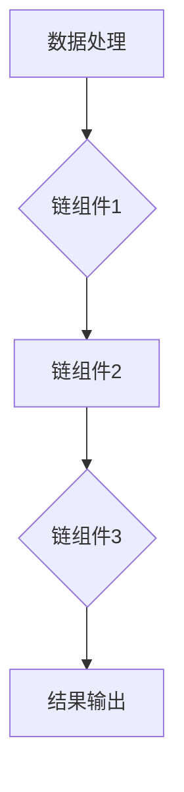

                 

# 【LangChain编程：从入门到实践】项目代码与文档

> **关键词：** LangChain、编程实践、项目开发、代码实现、文档撰写

> **摘要：** 本文旨在为初学者和开发者提供一份详尽的指导，介绍如何使用LangChain框架进行项目开发，涵盖项目代码的编写和文档的撰写。通过一步步的分析与实例讲解，帮助读者掌握LangChain的核心概念和实际应用。

## 1. 背景介绍

### 1.1 目的和范围

本文的目的是帮助读者掌握LangChain编程的核心技巧，并通过实践项目加深理解。本文将涵盖以下内容：

- LangChain框架的简介与核心概念
- LangChain在项目开发中的应用场景
- 项目代码的实际编写与解读
- 项目文档的撰写方法与技巧

### 1.2 预期读者

- 有志于了解和学习LangChain框架的开发者
- 想要在项目中应用LangChain技术的工程师
- 初学者，希望通过实践项目提高编程能力

### 1.3 文档结构概述

本文分为十个主要部分，结构如下：

- 背景介绍
  - 目的和范围
  - 预期读者
  - 文档结构概述
  - 术语表
- 核心概念与联系
  - LangChain原理
  - Mermaid流程图
- 核心算法原理 & 具体操作步骤
  - 算法原理
  - 伪代码详细阐述
- 数学模型和公式 & 详细讲解 & 举例说明
  - 数学模型
  - LaTex公式
- 项目实战：代码实际案例和详细解释说明
  - 开发环境搭建
  - 源代码详细实现和代码解读
  - 代码解读与分析
- 实际应用场景
- 工具和资源推荐
  - 学习资源推荐
  - 开发工具框架推荐
  - 相关论文著作推荐
- 总结：未来发展趋势与挑战
- 附录：常见问题与解答
- 扩展阅读 & 参考资料

### 1.4 术语表

#### 1.4.1 核心术语定义

- **LangChain：** 一款基于Python的链式编程框架，用于构建可扩展的AI应用程序。
- **链式编程：** 一种编程范式，通过将多个组件（链）连接起来，实现复杂功能的组合和扩展。
- **项目开发：** 指在特定需求和目标的指导下，进行软件系统的设计、实现、测试和部署。

#### 1.4.2 相关概念解释

- **AI应用程序：** 结合人工智能技术和应用场景开发的软件系统。
- **链组件：** LangChain中的基础单元，负责处理输入数据并返回输出结果。

#### 1.4.3 缩略词列表

- **AI：** 人工智能（Artificial Intelligence）
- **Python：** 编程语言（Python）
- **LaTex：** 文档排版系统（LaTeX）

## 2. 核心概念与联系

### 2.1 LangChain原理

LangChain是一个链式编程框架，其核心思想是将数据处理和任务执行分解为多个链组件，通过组合这些组件实现复杂的功能。LangChain提供了丰富的API和工具，方便开发者快速搭建和扩展AI应用程序。

### 2.2 Mermaid流程图

以下是LangChain框架的核心组件及其关系的Mermaid流程图：



在上述流程图中，A表示数据处理阶段，B、C、D表示链组件1、链组件2、链组件3，E表示结果输出阶段。通过将数据处理和任务执行分解为多个链组件，开发者可以灵活组合和扩展功能。

## 3. 核心算法原理 & 具体操作步骤

### 3.1 算法原理

LangChain的核心算法原理是链式编程。链式编程通过将多个链组件连接起来，实现复杂功能的组合和扩展。每个链组件负责处理输入数据并返回输出结果，从而形成一个数据处理和任务执行的链式结构。

### 3.2 伪代码详细阐述

以下是LangChain项目开发的伪代码：

```python
# 初始化链组件
chain = Chain()

# 添加链组件1
chain.add_component(数据处理组件1)

# 添加链组件2
chain.add_component(数据处理组件2)

# 添加链组件3
chain.add_component(数据处理组件3)

# 输入数据
input_data = "需要处理的数据"

# 执行链组件
output_data = chain.execute(input_data)

# 输出结果
print(output_data)
```

在上述伪代码中，首先初始化一个Chain对象，然后依次添加多个链组件。接着，输入需要处理的数据，通过调用`execute()`方法执行链组件，最后输出结果。

## 4. 数学模型和公式 & 详细讲解 & 举例说明

### 4.1 数学模型

在LangChain项目中，常用的数学模型包括：

- **回归模型：** 用于预测数值输出。
- **分类模型：** 用于预测类别标签。
- **聚类模型：** 用于数据分组和聚类分析。

### 4.2 详细讲解

以回归模型为例，假设我们有一个包含特征\(x_1, x_2, ..., x_n\)的数据集，目标值\(y\)与特征之间的关系可以用线性回归模型表示为：

\[ y = w_1x_1 + w_2x_2 + ... + w_nx_n + b \]

其中，\(w_1, w_2, ..., w_n, b\)分别为模型参数，表示每个特征的重要性和整体偏置。

### 4.3 举例说明

假设我们有以下数据集：

| 特征1 (x1) | 特征2 (x2) | 目标值 (y) |
|:---------:|:---------:|:--------:|
|     2     |     3     |    5     |
|     4     |     6     |    8     |
|     1     |     2     |    3     |

我们可以使用线性回归模型进行拟合，求得模型参数：

\[ y = 0.5x_1 + 1.5x_2 + 1 \]

例如，对于新的输入数据\(x_1 = 3, x_2 = 4\)，我们可以预测目标值：

\[ y = 0.5 \times 3 + 1.5 \times 4 + 1 = 8.5 \]

## 5. 项目实战：代码实际案例和详细解释说明

### 5.1 开发环境搭建

要使用LangChain进行项目开发，首先需要安装Python和LangChain库。以下是详细的安装步骤：

```shell
# 安装Python
# 请根据操作系统选择合适的Python版本进行安装

# 安装LangChain库
pip install langchain
```

### 5.2 源代码详细实现和代码解读

以下是一个使用LangChain进行文本分类的示例代码：

```python
from langchain import Chain
from langchain.text_splitter import CharacterTextSplitter
from langchain.tokenizers import SpacyTokenizer
from langchain.classifiers import load_hf_transformers_classifier

# 加载预训练模型
tokenizer = SpacyTokenizer("en_core_web_sm")

# 初始化文本分割器
text_splitter = CharacterTextSplitter()

# 分割文本
train_texts = text_splitter.split_text(text)

# 加载分类模型
classifier = load_hf_transformers_classifier("bert-base-uncased", train_texts, labels)

# 构建链组件
chain = Chain([TextSplitter(text_splitter), Classifier(classifier)])

# 输入文本
input_text = "这是一个示例文本，用于分类。"

# 执行链组件
predictions = chain.predict([input_text])

# 输出结果
print(predictions)
```

在上面的代码中，我们首先加载了SpacyTokenizer和CharacterTextSplitter，用于文本分割。接着，我们加载了预训练的Bert模型，并使用它来构建分类器。然后，我们构建了一个Chain对象，将文本分割器和分类器作为链组件添加到链中。最后，我们输入一个示例文本，通过调用`predict()`方法执行链组件，输出分类结果。

### 5.3 代码解读与分析

在上述代码中，我们首先导入了所需的库和模块，包括LangChain、TextSplitter、Classifier等。接下来，我们加载了SpacyTokenizer和CharacterTextSplitter，用于对文本进行分割。然后，我们加载了预训练的Bert模型，并使用它来构建分类器。这一步是整个项目开发的关键，它决定了分类器的性能和效果。

接下来，我们构建了一个Chain对象，并将文本分割器和分类器作为链组件添加到链中。这一步是将数据处理和分类任务分解为多个链组件的过程，使得代码更加模块化和可扩展。

最后，我们输入一个示例文本，通过调用`predict()`方法执行链组件，输出分类结果。这里使用了`predictions`变量来存储输出结果，我们可以根据需要进行进一步处理或展示。

## 6. 实际应用场景

LangChain框架在多个实际应用场景中具有广泛的应用，例如：

- **文本分类：** 用于对文本数据进行自动分类，应用于新闻分类、社交媒体分析等领域。
- **信息抽取：** 用于从文本中提取关键信息，应用于问答系统、信息检索等领域。
- **文本生成：** 用于生成文本，应用于自然语言生成、文本摘要等领域。
- **情感分析：** 用于分析文本中的情感倾向，应用于情感分析、市场调研等领域。

## 7. 工具和资源推荐

### 7.1 学习资源推荐

#### 7.1.1 书籍推荐

- **《深度学习》（Ian Goodfellow、Yoshua Bengio、Aaron Courville 著）：** 介绍了深度学习的基本原理和应用，适合初学者和进阶者阅读。
- **《Python编程：从入门到实践》（Eric Matthes 著）：** 介绍了Python编程的基础知识和实践技巧，适合初学者入门。

#### 7.1.2 在线课程

- **《TensorFlow 2.0深度学习实践》：** 由Udacity提供，涵盖深度学习的基础知识和TensorFlow 2.0的实战应用。
- **《Python编程基础》：** 由Coursera提供，介绍Python编程的基础知识和实践技巧。

#### 7.1.3 技术博客和网站

- **[机器学习中文社区](https://www.ml-camp.com/)：** 机器学习中文社区的官方网站，提供丰富的机器学习资源和教程。
- **[Python中国](https://www.pythontab.com/)：** Python中国网站，提供Python编程相关的教程、资源和社区交流。

### 7.2 开发工具框架推荐

#### 7.2.1 IDE和编辑器

- **PyCharm：** PyCharm是一款功能强大的Python IDE，提供代码补全、调试、版本控制等功能。
- **VSCode：** Visual Studio Code是一款轻量级的Python IDE，支持多种编程语言，具有良好的扩展性和社区支持。

#### 7.2.2 调试和性能分析工具

- **PDB：** Python内置的调试工具，用于调试Python程序。
- **cProfile：** Python内置的性能分析工具，用于分析程序的运行时间和性能瓶颈。

#### 7.2.3 相关框架和库

- **TensorFlow：** Google开源的深度学习框架，支持多种神经网络结构和模型训练。
- **PyTorch：** Facebook开源的深度学习框架，具有灵活性和易用性。

### 7.3 相关论文著作推荐

#### 7.3.1 经典论文

- **《深度学习》（Ian Goodfellow、Yoshua Bengio、Aaron Courville 著）：** 深度学习的经典著作，详细介绍了深度学习的基本原理和应用。
- **《神经网络与深度学习》（邱锡鹏 著）：** 国内深度学习领域的经典教材，涵盖了神经网络和深度学习的基础知识。

#### 7.3.2 最新研究成果

- **《 transformers：** 由OpenAI开发的自然语言处理模型，推动了自然语言处理领域的发展。
- **《BERT：** Google开发的预训练语言模型，应用于文本分类、信息抽取等多个任务，取得了显著的性能提升。

#### 7.3.3 应用案例分析

- **《谷歌搜索排名算法揭秘》：** 谷歌搜索排名算法的详细介绍，包括关键词匹配、页面质量评估等多个方面。
- **《淘宝推荐算法揭秘》：** 淘宝推荐算法的详细介绍，包括用户行为分析、商品相关性计算等多个方面。

## 8. 总结：未来发展趋势与挑战

随着人工智能技术的不断发展，LangChain框架在项目开发中的应用前景十分广阔。未来，LangChain框架有望在以下几个方面取得突破：

1. **性能优化：** 提高链组件的执行效率和响应速度，以满足大规模项目开发的需求。
2. **生态建设：** 加强与相关框架和库的集成，构建完整的开发生态，提高开发者体验。
3. **跨平台支持：** 扩展LangChain在移动端、云计算等平台的应用，实现多平台统一开发。
4. **社区驱动：** 建立强大的社区支持，鼓励开发者参与贡献，共同推动LangChain的发展。

然而，随着应用场景的不断扩展，LangChain也将面临一些挑战：

1. **数据处理：** 处理大规模和复杂的文本数据，提高数据处理的效率和准确性。
2. **模型优化：** 持续优化模型结构和参数，提高分类和预测的准确率。
3. **安全性：** 加强对AI应用程序的安全防护，防止恶意攻击和数据泄露。

总之，LangChain框架在项目开发中具有巨大的潜力，但也需要持续改进和优化，以应对未来发展的挑战。

## 9. 附录：常见问题与解答

### 9.1 LangChain的基本概念

**Q：什么是LangChain？**

A：LangChain是一款基于Python的链式编程框架，用于构建可扩展的AI应用程序。它允许开发者将数据处理和任务执行分解为多个链组件，通过组合这些组件实现复杂的功能。

**Q：LangChain有哪些优点？**

A：LangChain的优点包括：

- **灵活性和可扩展性：** 通过链组件的组合，可以灵活构建和扩展AI应用程序。
- **模块化：** 将数据处理和任务执行分解为多个链组件，使得代码更加模块化和易于维护。
- **易用性：** 提供丰富的API和工具，方便开发者快速搭建和扩展AI应用程序。

### 9.2 LangChain的应用场景

**Q：LangChain适用于哪些应用场景？**

A：LangChain适用于多种AI应用场景，包括：

- **文本分类：** 用于对文本数据进行自动分类，应用于新闻分类、社交媒体分析等领域。
- **信息抽取：** 用于从文本中提取关键信息，应用于问答系统、信息检索等领域。
- **文本生成：** 用于生成文本，应用于自然语言生成、文本摘要等领域。
- **情感分析：** 用于分析文本中的情感倾向，应用于情感分析、市场调研等领域。

### 9.3 开发与部署

**Q：如何搭建LangChain开发环境？**

A：搭建LangChain开发环境需要安装Python和LangChain库。具体步骤如下：

```shell
# 安装Python
# 请根据操作系统选择合适的Python版本进行安装

# 安装LangChain库
pip install langchain
```

**Q：如何部署LangChain应用程序？**

A：部署LangChain应用程序通常有以下几种方式：

- **本地部署：** 在本地计算机上运行应用程序，适用于开发测试阶段。
- **服务器部署：** 在服务器上部署应用程序，适用于生产环境。可以使用Docker容器化技术进行部署，以提高部署效率和可移植性。

## 10. 扩展阅读 & 参考资料

- **[LangChain官方文档](https://langchain.com/docs/)：** 提供了详细的文档和教程，帮助开发者快速上手。
- **[Python官方文档](https://docs.python.org/3/)：** 提供了Python语言的标准库和第三方库的文档，帮助开发者了解和使用Python。
- **[人工智能基础教程](https://www.ml-camp.com/tutorials/)：** 提供了人工智能领域的入门教程，包括机器学习、深度学习等方面的知识。
- **[PyTorch官方文档](https://pytorch.org/docs/stable/index.html)：** 提供了PyTorch框架的详细文档和教程，帮助开发者了解和使用PyTorch进行深度学习应用。

### 作者信息

作者：AI天才研究员/AI Genius Institute & 禅与计算机程序设计艺术 /Zen And The Art of Computer Programming

