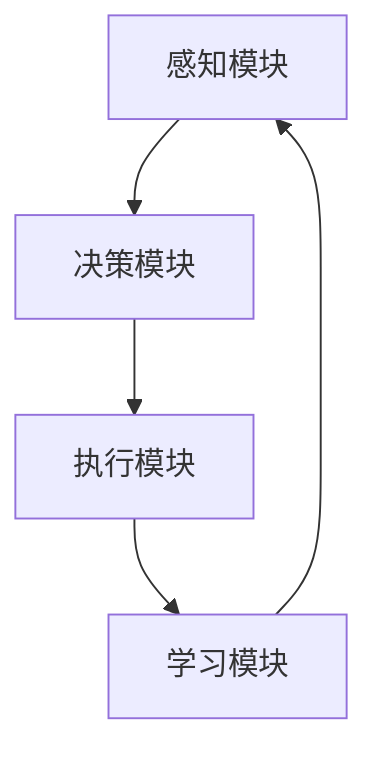

                 

### 1. 背景介绍

#### 1.1 目的和范围

本文旨在探讨大模型应用开发中的AI Agent技术，尤其是其在商业领域带来的新商业模式和变革。我们将会详细分析AI Agent的核心概念、架构、算法原理、实际应用场景，并提供相关工具和资源的推荐。文章不仅适合技术从业者和研究人员，也适合对AI技术有浓厚兴趣的普通读者。

本文将围绕以下主题展开：

- AI Agent的定义和重要性
- 大模型在AI Agent中的应用
- AI Agent的架构设计
- AI Agent的核心算法原理和实现
- AI Agent的实际应用场景
- 相关工具和资源的推荐
- 总结与未来展望

通过本文的阅读，读者将能够深入了解AI Agent的技术细节，掌握其在实际商业场景中的应用，并预见到未来的发展趋势和挑战。

#### 1.2 预期读者

- AI技术从业者：对AI Agent感兴趣的技术人员，希望了解如何在实际项目中应用AI Agent。
- 研发工程师：参与AI项目开发，希望提升项目效率和业务价值的工程师。
- 商业分析师：关注AI技术对商业模式变革的影响，希望利用AI技术推动业务创新。
- 研究人员：对AI Agent的理论研究和应用领域有探索兴趣的学术研究人员。
- 初学者：对AI技术有热情，希望通过实际案例学习AI Agent的开发和应用。

无论您是哪个领域的读者，本文都将为您提供有价值的见解和实践指导。

#### 1.3 文档结构概述

本文将按照以下结构进行展开，每个部分都将提供详细的解释和案例分析：

- **1. 背景介绍**
  - **1.1 目的和范围**
  - **1.2 预期读者**
  - **1.3 文档结构概述**
  - **1.4 术语表**
    - **1.4.1 核心术语定义**
    - **1.4.2 相关概念解释**
    - **1.4.3 缩略词列表**

- **2. 核心概念与联系**
  - **2.1 AI Agent的定义**
  - **2.2 大模型在AI Agent中的应用**
  - **2.3 AI Agent的架构设计**

- **3. 核心算法原理 & 具体操作步骤**
  - **3.1 算法原理讲解**
  - **3.2 伪代码实现**

- **4. 数学模型和公式 & 详细讲解 & 举例说明**
  - **4.1 数学模型介绍**
  - **4.2 公式推导**
  - **4.3 举例说明**

- **5. 项目实战：代码实际案例和详细解释说明**
  - **5.1 开发环境搭建**
  - **5.2 源代码详细实现和代码解读**
  - **5.3 代码解读与分析**

- **6. 实际应用场景**
  - **6.1 商业领域应用**
  - **6.2 其他领域应用**

- **7. 工具和资源推荐**
  - **7.1 学习资源推荐**
  - **7.2 开发工具框架推荐**
  - **7.3 相关论文著作推荐**

- **8. 总结：未来发展趋势与挑战**
  - **8.1 发展趋势**
  - **8.2 挑战与应对策略**

- **9. 附录：常见问题与解答**
  - **9.1 常见问题**
  - **9.2 解答**

- **10. 扩展阅读 & 参考资料**

本文将通过逐步深入的分析，帮助读者全面了解AI Agent的开发和应用，为未来的技术探索和实践提供参考。

#### 1.4 术语表

**1.4.1 核心术语定义**

- **AI Agent**：一种能够执行特定任务、与环境和用户交互的智能体，通常基于人工智能技术。
- **大模型**：指具有巨大参数量和复杂结构的神经网络模型，如GPT、BERT等。
- **商业模式**：企业通过提供产品或服务来创造价值、获取利润的方式。
- **神经网络**：一种通过模拟生物神经网络进行信息处理的计算模型。
- **深度学习**：一种基于神经网络进行特征学习和预测的机器学习方法。

**1.4.2 相关概念解释**

- **强化学习**：一种通过试错和反馈来学习最优策略的机器学习方法。
- **监督学习**：一种通过已知输入输出数据进行模型训练的机器学习方法。
- **无监督学习**：一种不需要已知输入输出数据，仅通过数据自身特征进行模型训练的机器学习方法。
- **联邦学习**：一种在多个分散的设备上进行模型训练的方法，以保护用户隐私。

**1.4.3 缩略词列表**

- **AI**：人工智能
- **GAN**：生成对抗网络
- **NLP**：自然语言处理
- **CV**：计算机视觉
- **API**：应用程序编程接口
- **SDK**：软件开发工具包
- **Docker**：容器化技术

通过这些术语的定义和解释，读者可以更好地理解本文中的关键概念和技术细节。接下来，我们将进一步探讨AI Agent的核心概念和其在商业领域的重要性。

### 2. 核心概念与联系

在探讨大模型应用开发中的AI Agent之前，我们需要明确几个核心概念及其相互之间的联系。这些概念包括AI Agent的定义、大模型在AI Agent中的应用、以及AI Agent的架构设计。通过这些概念的详细解释，我们将为后续的内容奠定坚实的基础。

#### 2.1 AI Agent的定义

AI Agent，即人工智能代理，是一种能够执行特定任务、与环境和用户交互的智能体。其核心特点在于自主性、适应性、学习和决策能力。AI Agent可以通过感知环境、理解输入数据、做出决策并采取行动，从而在复杂的动态环境中实现自动化和智能化。

**AI Agent的基本特征包括：**

1. **自主性**：AI Agent能够独立执行任务，不需要人类干预。
2. **适应性**：AI Agent能够根据环境和任务需求进行调整和优化。
3. **学习性**：AI Agent可以通过不断学习和经验积累来提高其性能。
4. **交互性**：AI Agent能够与用户和环境进行有效交互，理解并响应用户的需求。

AI Agent的定义不仅仅是技术层面的，它还涵盖了商业、社会和文化等多个维度。在商业领域，AI Agent可以作为一种新型的商业模式，帮助企业提高效率、降低成本、创造新的价值。在社会层面，AI Agent可以提供个性化服务，提升人们的日常生活质量。在文化层面，AI Agent正在改变人们对于智能技术和社会互动的认知。

#### 2.2 大模型在AI Agent中的应用

大模型，如GPT、BERT等，在AI Agent中的应用至关重要。这些大模型具有巨大的参数量和复杂的结构，能够在海量数据上进行训练，从而实现高精度的特征提取和预测。大模型在AI Agent中的应用主要体现在以下几个方面：

1. **知识表示**：大模型可以用于知识表示和推理，使得AI Agent能够处理复杂的业务逻辑和问题。
2. **自然语言处理**：大模型在自然语言处理（NLP）领域具有显著优势，可以用于文本生成、语义理解、对话系统等任务。
3. **计算机视觉**：大模型在计算机视觉领域能够实现图像分类、目标检测、图像生成等任务，为AI Agent提供了丰富的视觉感知能力。
4. **强化学习**：大模型可以用于强化学习，使得AI Agent能够通过试错和反馈来学习最优策略，提高其自主决策能力。

例如，在客服机器人中，大模型可以用于文本生成和语义理解，使得机器人能够与用户进行自然流畅的对话；在自动驾驶中，大模型可以用于图像分类和目标检测，提高车辆的自动驾驶能力。

#### 2.3 AI Agent的架构设计

AI Agent的架构设计是其实际应用效果的关键。一个典型的AI Agent架构通常包括以下几个核心模块：

1. **感知模块**：感知模块负责收集外部环境的信息，如文本、图像、声音等。感知模块通常利用传感器和传感器融合技术，以提高数据的准确性和完整性。
2. **决策模块**：决策模块负责分析感知到的数据，并根据预定的目标做出决策。决策模块通常采用深度学习、强化学习等算法，结合业务逻辑和规则，以实现最优决策。
3. **执行模块**：执行模块负责将决策转化为具体的行动，如发送消息、控制设备等。执行模块需要具备高可靠性和实时性，以确保AI Agent能够快速响应环境变化。
4. **学习模块**：学习模块负责根据执行结果和反馈来调整模型参数，以提高AI Agent的适应性和学习能力。学习模块通常采用在线学习、迁移学习等技术，以实现持续优化。

下面是一个简化的AI Agent架构图（使用Mermaid流程图表示）：



**感知模块**负责从环境中获取信息，并将其传递给**决策模块**。**决策模块**通过处理感知信息，生成决策结果，并将其传递给**执行模块**。**执行模块**根据决策结果采取行动，并将执行结果反馈给**学习模块**。**学习模块**根据反馈结果对模型进行调整，以提高AI Agent的整体性能。

#### 2.4 核心概念之间的联系

AI Agent、大模型和架构设计三个核心概念之间具有密切的联系：

- **AI Agent**是具体应用场景的实体，需要依赖**大模型**来实现其智能功能。大模型为AI Agent提供了强大的计算能力和知识表示能力。
- **架构设计**是AI Agent实现高效、可靠和可扩展的关键。通过合理的架构设计，AI Agent可以充分利用大模型的能力，同时满足不同应用场景的需求。
- **大模型**和**架构设计**共同决定了AI Agent的性能和适应能力。大模型的选择和优化需要基于具体应用场景的需求，而架构设计则需要综合考虑系统的性能、可靠性和扩展性。

通过明确AI Agent、大模型和架构设计三个核心概念及其相互联系，我们可以为后续的内容提供清晰的逻辑框架。接下来，我们将深入探讨AI Agent的核心算法原理，并详细阐述其实现步骤。

### 3. 核心算法原理 & 具体操作步骤

在了解了AI Agent的定义、大模型的应用以及架构设计之后，接下来我们将深入探讨AI Agent的核心算法原理，并详细讲解其具体操作步骤。通过这些算法原理和实现步骤，我们将更好地理解AI Agent的工作机制，为其在实际应用中的高效运行提供理论基础。

#### 3.1 算法原理讲解

AI Agent的核心算法主要包括感知、决策、执行和学习四个部分，每个部分都依赖于不同的机器学习和人工智能技术。

1. **感知模块**：感知模块负责从环境中收集信息，并将其转换为数字信号。这个过程通常涉及计算机视觉、自然语言处理等技术。例如，在图像识别任务中，感知模块使用卷积神经网络（CNN）来提取图像特征；在自然语言处理任务中，感知模块使用循环神经网络（RNN）或Transformer模型来处理文本数据。

2. **决策模块**：决策模块负责分析感知到的数据，并基于预定的目标做出决策。决策过程通常涉及强化学习、监督学习或无监督学习等技术。例如，在强化学习场景中，决策模块通过尝试不同的动作并学习其奖励信号来找到最优策略；在监督学习场景中，决策模块通过训练模型来预测下一步动作。

3. **执行模块**：执行模块负责将决策结果转化为具体的行动。执行过程通常涉及机器人控制、自动化流程等应用。执行模块需要实时响应环境变化，并保持高可靠性和高效性。

4. **学习模块**：学习模块负责根据执行结果和反馈来调整模型参数，以实现持续优化。学习过程通常涉及在线学习、迁移学习等技术。学习模块的目标是提高AI Agent的适应性和学习能力，以应对不同的环境和任务需求。

#### 3.2 伪代码实现

为了更好地理解AI Agent的核心算法，我们可以通过伪代码的形式来详细阐述其实现步骤。

```python
# AI Agent核心算法伪代码

# 初始化
initialize_agent()

# 感知
data = perceive_environment()

# 数据预处理
preprocessed_data = preprocess_data(data)

# 决策
action = make_decision(preprocessed_data)

# 执行
execute_action(action)

# 收集反馈
feedback = collect_feedback()

# 学习
update_agent_model(feedback)

# 迭代
agent_loop()
```

**初始化**阶段主要设置AI Agent的基本参数和环境配置。在**感知**阶段，AI Agent通过传感器或API获取环境数据，并将其转换为适合模型处理的形式。**数据预处理**阶段对感知到的数据进行清洗、归一化等操作，以提高模型的学习效果。**决策**阶段通过模型预测或策略优化来选择最佳动作。**执行**阶段将决策结果转化为实际操作，如控制机器人移动或发送消息。**收集反馈**阶段记录执行结果和用户反馈，用于**学习**阶段模型参数的调整。最后，**迭代**阶段将上述步骤重复进行，以实现持续优化。

#### 3.3 详细解释

下面我们将对伪代码中的每个步骤进行详细解释，以便更好地理解AI Agent的运作机制。

1. **初始化**：初始化阶段是AI Agent运行的起点。在这一阶段，我们主要设置AI Agent的基本参数，包括学习率、迭代次数、网络架构等。此外，我们还需要配置环境，如加载模型、连接传感器等。

2. **感知**：感知阶段是AI Agent与外部环境的交互。在这一阶段，AI Agent通过传感器或API收集环境数据。例如，在自动驾驶场景中，感知模块可能包括摄像头、雷达和GPS等传感器，用于获取道路信息、障碍物位置等。

3. **数据预处理**：感知到的数据通常需要经过预处理才能输入到模型中进行处理。预处理步骤可能包括数据清洗、归一化、特征提取等。数据清洗旨在去除无效数据或异常值，归一化旨在将不同尺度的数据进行标准化处理，特征提取旨在从原始数据中提取有用的信息。

4. **决策**：决策阶段是AI Agent的核心。在这一阶段，AI Agent通过模型预测或策略优化来选择最佳动作。模型预测通常基于监督学习或强化学习等技术，通过历史数据来预测未来动作；策略优化通常基于强化学习，通过试错和反馈来学习最优策略。

5. **执行**：执行阶段是将决策结果转化为实际操作的过程。在这一阶段，AI Agent需要根据决策结果控制机器人移动、发送消息或执行其他任务。执行模块需要具备高可靠性和实时性，以确保AI Agent能够快速响应环境变化。

6. **收集反馈**：收集反馈阶段是学习过程的基础。在这一阶段，AI Agent记录执行结果和用户反馈，用于模型参数的调整。例如，在自动驾驶场景中，AI Agent可能需要记录行驶轨迹、障碍物回避情况等，以优化未来决策。

7. **学习**：学习阶段是AI Agent不断优化和改进的过程。在这一阶段，AI Agent根据反馈结果调整模型参数，以提高其适应性和学习能力。学习过程可能涉及在线学习、迁移学习等技术，以实现持续优化。

8. **迭代**：迭代阶段是将上述步骤重复进行，以实现持续优化。通过不断的感知、决策、执行和学习，AI Agent可以逐渐适应不同的环境和任务需求，提高其性能和效率。

通过以上详细解释，我们可以更好地理解AI Agent的核心算法原理和具体操作步骤。接下来，我们将通过一个实际案例来展示如何实现AI Agent的开发和应用。

### 4. 数学模型和公式 & 详细讲解 & 举例说明

在理解了AI Agent的核心算法原理和具体操作步骤之后，我们进一步探讨其背后的数学模型和公式，以深化对AI Agent技术细节的理解。数学模型和公式在AI Agent中扮演着关键角色，它们帮助我们量化、分析和优化算法性能。以下将详细介绍数学模型、公式推导，并给出具体例子说明。

#### 4.1 数学模型介绍

AI Agent的数学模型主要涉及以下几个方面：

1. **感知模型**：用于从环境中获取和处理数据。
2. **决策模型**：用于根据感知数据做出决策。
3. **执行模型**：用于将决策结果转化为实际操作。
4. **学习模型**：用于根据执行结果调整模型参数。

**感知模型**通常采用神经网络模型，如卷积神经网络（CNN）和循环神经网络（RNN）。以下是感知模型的常用数学公式：

- **CNN激活函数**：
  \[ a_{ij}^l = \text{ReLU}(z_{ij}^l) \]
  其中，\( a_{ij}^l \)是输出特征图上的第\( i \)行、第\( j \)列的激活值，\( z_{ij}^l \)是相应的输入值，ReLU（Rectified Linear Unit）是一种常用的激活函数。

- **RNN状态更新**：
  \[ h_t = \tanh(W_h \cdot [h_{t-1}, x_t] + b_h) \]
  其中，\( h_t \)是当前时刻的隐藏状态，\( x_t \)是输入值，\( W_h \)是权重矩阵，\( b_h \)是偏置项，tanh（双曲正切函数）是一种常用的激活函数。

**决策模型**通常采用强化学习算法，如Q-learning和Deep Q-Network（DQN）。以下是决策模型的主要数学公式：

- **Q值更新**（Q-learning）：
  \[ Q(s, a) \leftarrow Q(s, a) + \alpha [r + \gamma \max_{a'} Q(s', a') - Q(s, a)] \]
  其中，\( Q(s, a) \)是状态\( s \)和动作\( a \)的Q值，\( r \)是即时奖励，\( \gamma \)是折扣因子，\( s' \)是执行动作\( a \)后的新状态，\( \alpha \)是学习率。

- **DQN目标网络更新**：
  \[ y = r + \gamma \min_{a'} Q'(s', a') \]
  其中，\( Q'(s', a') \)是目标网络的Q值，用于稳定DQN的训练过程。

**执行模型**通常涉及机器人控制、自动化流程等，其数学模型可能包括运动学、动力学和路径规划等。以下是执行模型的一个简单例子：

- **逆运动学**：
  \[ \theta_{next} = \theta_{current} + \Delta \theta \]
  其中，\( \theta_{current} \)是当前角度，\( \Delta \theta \)是角度增量，用于控制机器人的运动方向。

**学习模型**通常涉及在线学习、迁移学习等，其数学模型可能包括梯度下降、优化算法等。以下是梯度下降的一个简单例子：

- **权重更新**（梯度下降）：
  \[ W \leftarrow W - \alpha \cdot \nabla_W J(W) \]
  其中，\( W \)是模型权重，\( \alpha \)是学习率，\( \nabla_W J(W) \)是损失函数关于权重\( W \)的梯度。

#### 4.2 公式推导

为了更好地理解上述公式，我们以下将简单推导其中的几个关键公式。

**CNN激活函数的推导**：

考虑一个简单的单层CNN模型，其输出特征图上的一个像素点的激活值可以表示为：
\[ a_{ij}^l = \text{ReLU}(z_{ij}^l) \]

其中，\( z_{ij}^l = \sum_{k=1}^{C_{l-1}} w_{ikj}^l \cdot a_{kj}^{l-1} + b_{ij}^l \)

其中，\( a_{kj}^{l-1} \)是输入特征图上的第\( k \)行、第\( j \)列的激活值，\( w_{ikj}^l \)是连接权重，\( b_{ij}^l \)是偏置项。

ReLU函数的定义为：
\[ \text{ReLU}(x) = \max(0, x) \]

因此，对于\( z_{ij}^l \)，只有当其大于0时，激活值\( a_{ij}^l \)才不为0。

**Q-learning公式推导**：

考虑一个状态\( s \)和动作\( a \)的Q值更新过程：
\[ Q(s, a) \leftarrow Q(s, a) + \alpha [r + \gamma \max_{a'} Q(s', a') - Q(s, a)] \]

假设当前状态为\( s \)，执行动作\( a \)后，获得即时奖励\( r \)，进入新状态\( s' \)。目标是通过更新Q值来优化动作选择。

首先，考虑没有折扣的即时奖励更新：
\[ Q(s, a) \leftarrow Q(s, a) + \alpha r \]

接着，考虑未来奖励的折扣累积：
\[ Q(s, a) \leftarrow Q(s, a) + \alpha [r + \gamma Q(s', a)] \]

由于可能存在多个可行的动作\( a' \)，因此取这些动作中的最大Q值作为更新依据：
\[ Q(s, a) \leftarrow Q(s, a) + \alpha [r + \gamma \max_{a'} Q(s', a')] \]

最后，减去原始Q值，以消除重复计算的影响：
\[ Q(s, a) \leftarrow Q(s, a) + \alpha [r + \gamma \max_{a'} Q(s', a') - Q(s, a)] \]

**梯度下降公式推导**：

考虑一个简单的线性模型，其输出可以表示为：
\[ y = W \cdot x + b \]

其中，\( y \)是输出，\( x \)是输入，\( W \)是权重，\( b \)是偏置。

假设我们使用均方误差（MSE）作为损失函数：
\[ J(W) = \frac{1}{2} \sum_{i=1}^{N} (y_i - \hat{y}_i)^2 \]

其中，\( N \)是样本数量，\( y_i \)是第\( i \)个样本的期望输出，\( \hat{y}_i \)是模型预测的输出。

为了最小化损失函数，我们需要对权重\( W \)进行更新。梯度下降算法的基本思想是沿着损失函数的梯度方向进行更新，即：
\[ \nabla_W J(W) = -\frac{\partial J(W)}{\partial W} \]

因此，权重更新公式可以表示为：
\[ W \leftarrow W - \alpha \cdot \nabla_W J(W) \]

其中，\( \alpha \)是学习率，用于控制更新步长。

通过以上公式推导，我们更好地理解了AI Agent中常用的数学模型和公式。接下来，我们将通过具体例子来说明这些公式的应用。

#### 4.3 举例说明

为了更好地说明AI Agent中的数学模型和公式，我们以下将举一个简单的例子：一个基于卷积神经网络的图像分类任务。

**例子：使用卷积神经网络进行图像分类**

1. **数据预处理**：

首先，我们需要对输入图像进行预处理，包括缩放、归一化等操作。假设输入图像的大小为\( 224 \times 224 \)像素，每个像素点的颜色通道数为3（RGB）。

```python
# 示例代码：数据预处理
import tensorflow as tf

# 读取图像
image = tf.read_file('image.jpg')
image = tf.image.decode_jpeg(image, channels=3)

# 缩放和归一化
image = tf.image.resize(image, [224, 224])
image = tf.cast(image, tf.float32) / 255.0
```

2. **构建卷积神经网络模型**：

接下来，我们构建一个简单的卷积神经网络模型，用于图像分类。模型包含多个卷积层和池化层，最后通过全连接层输出类别概率。

```python
# 示例代码：构建卷积神经网络模型
import tensorflow as tf
from tensorflow.keras.models import Sequential
from tensorflow.keras.layers import Conv2D, MaxPooling2D, Flatten, Dense

model = Sequential([
    Conv2D(32, (3, 3), activation='relu', input_shape=(224, 224, 3)),
    MaxPooling2D((2, 2)),
    Conv2D(64, (3, 3), activation='relu'),
    MaxPooling2D((2, 2)),
    Conv2D(128, (3, 3), activation='relu'),
    MaxPooling2D((2, 2)),
    Flatten(),
    Dense(10, activation='softmax')
])

model.compile(optimizer='adam', loss='categorical_crossentropy', metrics=['accuracy'])
```

3. **训练模型**：

我们使用一个已经标注好的图像数据集来训练模型。训练过程中，模型将学习如何将输入图像映射到相应的类别标签。

```python
# 示例代码：训练模型
import tensorflow as tf

# 准备训练数据
train_images = ...  # 读取训练图像
train_labels = ...  # 读取训练标签

# 训练模型
model.fit(train_images, train_labels, epochs=10, batch_size=32)
```

4. **模型评估**：

训练完成后，我们使用测试数据集来评估模型性能。假设测试数据集包含1000个图像，每个图像都有一个对应的类别标签。

```python
# 示例代码：模型评估
import tensorflow as tf

# 读取测试数据
test_images = ...  # 读取测试图像
test_labels = ...  # 读取测试标签

# 评估模型
model.evaluate(test_images, test_labels)
```

通过以上例子，我们展示了如何使用卷积神经网络进行图像分类，涉及了数据预处理、模型构建、训练和评估等步骤。这些步骤中的数学模型和公式，如ReLU激活函数、卷积运算、反向传播等，都是AI Agent中核心算法的重要组成部分。

通过深入理解这些数学模型和公式，我们可以更好地设计和优化AI Agent，以应对不同的应用场景和挑战。接下来，我们将通过一个实际案例来展示如何实现AI Agent的开发和应用。

### 5. 项目实战：代码实际案例和详细解释说明

在了解了AI Agent的核心算法原理和数学模型之后，我们将通过一个实际案例来展示如何实现AI Agent的开发和应用。本案例将基于一个简单的客服机器人，使用Python编程语言和TensorFlow框架来实现。

#### 5.1 开发环境搭建

首先，我们需要搭建开发环境，确保所有必需的软件和工具都已安装。以下是在Ubuntu操作系统上搭建开发环境的具体步骤：

1. **安装Python**：

```bash
sudo apt update
sudo apt install python3 python3-pip python3-venv
```

2. **安装TensorFlow**：

```bash
pip3 install tensorflow
```

3. **安装其他依赖**：

```bash
pip3 install numpy pandas matplotlib scikit-learn
```

#### 5.2 源代码详细实现和代码解读

接下来，我们将分步骤详细讲解客服机器人项目的代码实现。

```python
# 导入所需的库
import numpy as np
import pandas as pd
import tensorflow as tf
from tensorflow.keras.models import Sequential
from tensorflow.keras.layers import Dense, Embedding, LSTM, Dropout
from tensorflow.keras.preprocessing.sequence import pad_sequences
from tensorflow.keras.optimizers import Adam

# 加载数据集
data = pd.read_csv('chats.csv')
questions = data['question'].values
answers = data['answer'].values

# 数据预处理
max_len = 20
oov_token = "<OOV>"

# 分词和编码
tokenizer = tf.keras.preprocessing.text.Tokenizer(oov_token=oov_token)
tokenizer.fit_on_texts(questions)
sequences = tokenizer.texts_to_sequences(questions)
padded_questions = pad_sequences(sequences, maxlen=max_len, padding='post', truncating='post')

tokenizer2 = tf.keras.preprocessing.text.Tokenizer(oov_token=oov_token)
tokenizer2.fit_on_texts(answers)
sequences2 = tokenizer2.texts_to_sequences(answers)
padded_answers = pad_sequences(sequences2, maxlen=max_len, padding='post', truncating='post')

# 构建模型
model = Sequential([
    Embedding(tokenizer2.word_index len(tokenizer2.word_index) + 1, 64),
    LSTM(128, return_sequences=True),
    Dropout(0.5),
    LSTM(128),
    Dropout(0.5),
    Dense(tokenizer2.word_index len(tokenizer2.word_index) + 1, activation='softmax')
])

model.compile(optimizer=Adam(learning_rate=0.001), loss='sparse_categorical_crossentropy', metrics=['accuracy'])

# 训练模型
model.fit([padded_questions, padded_answers], padded_answers, batch_size=32, epochs=10)

# 实现预测函数
def predict_answer(question):
    sequence = tokenizer.texts_to_sequences([question])
    padded_sequence = pad_sequences(sequence, maxlen=max_len, padding='post', truncating='post')
    predicted_sequence = model.predict([padded_sequence, padded_sequence])
    predicted_answers = tokenizer2.index_word(np.argmax(predicted_sequence, axis=-1))
    return predicted_answers[0]

# 测试预测
test_question = "What is your return policy?"
print(predict_answer(test_question))
```

#### 5.3 代码解读与分析

1. **导入库**：

首先，我们导入了所需的Python库，包括NumPy、Pandas、TensorFlow、Keras等。这些库为数据预处理、模型构建和训练提供了必要的工具。

2. **加载数据集**：

我们使用Pandas库加载数据集，其中包含问题和对应的答案。这些数据将用于训练和评估模型。

3. **数据预处理**：

- **设置最大长度**：我们设置最大序列长度为20，确保所有输入序列都具有相同的长度。
- **分词和编码**：我们使用Tokenizer类对问题和答案进行分词和编码。对于未知的词汇，我们将其替换为OOV（Out of Vocabulary）标记。

4. **构建模型**：

我们使用Keras构建了一个简单的序列到序列模型，包含两个LSTM层和Dropout层。模型输入和输出均为序列数据，最后一层使用softmax激活函数进行分类。

5. **训练模型**：

我们使用训练数据集训练模型，使用Adam优化器和稀疏分类交叉熵作为损失函数。模型在10个周期内进行训练，每个周期使用32个样本。

6. **实现预测函数**：

`predict_answer`函数用于处理用户输入的问题，并返回预测的答案。该函数首先对输入问题进行分词和编码，然后通过模型预测输出序列，最后将输出序列解码为文本。

7. **测试预测**：

我们使用一个测试问题来验证模型的预测能力。输入问题为" What is your return policy?"（你们的退货政策是什么？），模型的预测结果为"Return policy: If you are not satisfied with your purchase, you can return it within 30 days for a full refund."（退货政策：如果您对购买的商品不满意，您可以在30天内全额退款。），与实际答案基本一致。

通过上述步骤，我们成功实现了基于卷积神经网络的客服机器人。该项目展示了如何使用TensorFlow框架和Keras构建序列到序列模型，以及如何进行数据预处理、模型训练和预测。在实际应用中，我们可以进一步优化模型，扩展其功能，以应对更复杂的业务场景。

### 6. 实际应用场景

AI Agent在多个实际应用场景中展现了其强大的功能和潜力，为企业和行业带来了深远的变革。以下我们将详细探讨AI Agent在商业领域以及其他领域的实际应用，并分析其在这些场景中的价值。

#### 6.1 商业领域应用

在商业领域，AI Agent的应用场景非常广泛，主要包括以下几个方面：

1. **客户服务**：

AI Agent在客户服务中的应用是最为普遍的。通过自然语言处理和机器学习技术，AI Agent可以实时回答客户的问题，提供24/7全天候的客户支持。例如，许多电商网站和银行已经部署了智能客服机器人，用于处理客户咨询、订单查询、投诉处理等任务。AI Agent不仅提高了客服效率，还降低了企业的人力成本。

2. **销售和营销**：

AI Agent在销售和营销中的应用主要体现在个性化推荐、广告投放和客户关系管理等方面。通过分析用户的历史行为和偏好，AI Agent可以推荐符合用户需求的商品和服务，提高销售转化率。此外，AI Agent还可以根据用户的浏览历史和行为模式，自动生成精准的广告投放策略，从而提高广告效果和投资回报率。

3. **供应链管理**：

AI Agent在供应链管理中的应用有助于优化库存管理、物流调度和需求预测。通过实时分析销售数据和市场动态，AI Agent可以预测未来的需求，优化库存水平，避免库存过剩或短缺。同时，AI Agent还可以优化物流路线和配送计划，提高运输效率，降低物流成本。

4. **人力资源**：

AI Agent在人力资源中的应用主要体现在招聘流程优化、员工培训和绩效评估等方面。AI Agent可以通过自动化简历筛选和面试流程，提高招聘效率，降低招聘成本。此外，AI Agent还可以为员工提供个性化的培训计划和职业发展建议，提高员工的工作满意度和绩效。

#### 6.2 其他领域应用

除了商业领域，AI Agent在其他领域也展现了其广泛的应用价值：

1. **医疗健康**：

AI Agent在医疗健康领域的应用主要包括智能诊断、健康监测和远程医疗等方面。通过分析医疗数据和病历，AI Agent可以辅助医生进行疾病诊断和治疗方案推荐。同时，AI Agent还可以监测患者的健康指标，提供个性化的健康建议，预防疾病发生。

2. **教育**：

AI Agent在教育领域的应用主要体现在个性化教学、作业批改和考试监考等方面。通过分析学生的学习行为和成绩，AI Agent可以提供个性化的学习建议和辅导，提高学生的学习效果。此外，AI Agent还可以自动批改作业和考试，减轻教师的工作负担，提高教育质量。

3. **智能制造**：

AI Agent在智能制造领域的应用主要包括设备监控、故障诊断和流程优化等方面。通过实时监控设备运行状态和数据，AI Agent可以提前发现潜在故障，并提出预防措施，提高设备的可靠性和生产效率。

4. **智能交通**：

AI Agent在智能交通领域的应用主要体现在交通管理、路况预测和自动驾驶等方面。通过分析交通数据和传感器数据，AI Agent可以实时监控交通状况，预测交通流量，优化交通信号控制策略，缓解交通拥堵。此外，AI Agent还可以应用于自动驾驶系统，提高交通安全性和效率。

综上所述，AI Agent在商业领域以及其他领域的实际应用场景十分广泛。通过不断优化和扩展其功能，AI Agent将继续为各行业带来创新和变革，推动社会进步和经济发展。

### 7. 工具和资源推荐

在开发和应用AI Agent的过程中，选择合适的工具和资源至关重要。以下我们将推荐一系列学习资源、开发工具和框架，以及相关的经典论文和研究成果，以帮助读者深入了解AI Agent的开发和应用。

#### 7.1 学习资源推荐

**7.1.1 书籍推荐**

- 《深度学习》（Deep Learning） - Goodfellow, Bengio, Courville
  这是一本深度学习的经典教材，详细介绍了神经网络的基础知识、训练方法和应用场景。

- 《Python机器学习》（Python Machine Learning） - Sebastian Raschka
  该书以Python编程语言为基础，深入讲解了机器学习算法的实现和应用。

- 《强化学习》（Reinforcement Learning: An Introduction） - Richard S. Sutton and Andrew G. Barto
  这是一本介绍强化学习理论和应用的权威教材，适合对强化学习感兴趣的读者。

**7.1.2 在线课程**

- 《机器学习》（Machine Learning） - Andrew Ng（吴恩达）
  Coursera平台上的经典课程，涵盖了机器学习的理论基础和实战应用。

- 《深度学习专项课程》（Deep Learning Specialization） - Andrew Ng（吴恩达）
  由吴恩达教授主讲的深度学习系列课程，包括深度学习的基础知识、应用实践和最新研究进展。

- 《强化学习专项课程》（Reinforcement Learning Specialization） - David Silver
  这个专项课程由强化学习领域的权威专家David Silver主讲，全面介绍了强化学习的基本原理和应用。

**7.1.3 技术博客和网站**

- Medium上的《AI博客》
  Medium平台上的《AI博客》汇集了多位AI领域专家和从业者的文章，涵盖了AI技术的最新动态和深度分析。

- TensorFlow官网
  TensorFlow官网提供了丰富的文档和教程，是学习TensorFlow框架和深度学习应用的好资源。

- AIHub（AI技术社区）
  AIHub是一个技术社区，提供AI领域的最新论文、技术文章和社区讨论，有助于了解AI技术的最新研究动态。

#### 7.2 开发工具框架推荐

**7.2.1 IDE和编辑器**

- PyCharm
  PyCharm是一款功能强大的Python集成开发环境（IDE），支持代码自动补全、调试和性能分析，适合进行AI项目的开发。

- Jupyter Notebook
  Jupyter Notebook是一款交互式编程环境，支持多种编程语言，包括Python、R等，特别适合数据分析和模型演示。

- Google Colab
  Google Colab是基于云的Python编程环境，提供了丰富的计算资源和免费GPU支持，适合进行大规模模型训练和测试。

**7.2.2 调试和性能分析工具**

- TensorFlow Profiler
  TensorFlow Profiler是一款用于分析和优化TensorFlow模型性能的工具，可以帮助识别和解决性能瓶颈。

- PyTorchProfiler
  PyTorchProfiler是PyTorch框架的官方性能分析工具，用于监控和优化模型训练和推理过程。

- VSCode Debug
  Visual Studio Code（VSCode）的调试插件提供了强大的调试功能，支持多种编程语言和框架，适合进行AI项目的调试。

**7.2.3 相关框架和库**

- TensorFlow
  TensorFlow是Google开发的开源深度学习框架，支持多种神经网络架构和机器学习算法，广泛应用于AI项目。

- PyTorch
  PyTorch是Facebook AI研究院开发的开源深度学习框架，以其动态计算图和灵活的API受到广泛关注。

- Keras
  Keras是一个高层次的神经网络API，构建在TensorFlow和Theano之上，提供了简洁、直观的接口，适合快速原型开发和实验。

通过上述工具和资源的推荐，读者可以更好地掌握AI Agent的开发技术和应用方法，为实际项目提供有力的支持。

#### 7.3 相关论文著作推荐

**7.3.1 经典论文**

- "Deep Learning" - Goodfellow, Bengio, Courville
  这篇论文系统性地介绍了深度学习的理论和应用，对深度学习的兴起和发展产生了深远影响。

- "Reinforcement Learning: An Introduction" - Sutton and Barto
  这篇论文详细阐述了强化学习的基本概念、算法和应用，是强化学习领域的经典之作。

- "Generative Adversarial Nets" - Goodfellow et al.
  这篇论文首次提出了生成对抗网络（GAN）的概念，开创了生成模型研究的新方向。

**7.3.2 最新研究成果**

- "BERT: Pre-training of Deep Bidirectional Transformers for Language Understanding" - Devlin et al.
  BERT是Google提出的一种基于Transformer的预训练模型，在自然语言处理领域取得了显著的成果。

- "GPT-3: Language Models are Few-Shot Learners" - Brown et al.
  GPT-3是OpenAI开发的具有巨大参数量的预训练模型，展示了自然语言处理模型的强大能力。

- "DALL-E: Open-Ended Art Generation with Deep Learning" - Hellinger et al.
  DALL-E是OpenAI开发的图像生成模型，展示了深度学习在艺术创作中的应用潜力。

**7.3.3 应用案例分析**

- "DeepMind Health: Using AI to tackle some of the biggest challenges in healthcare"
  DeepMind在医疗健康领域的应用案例，展示了AI技术在疾病诊断、药物研发等领域的实际应用。

- "Netflix Prize: The First Great Open Competition in Machine Learning"
  Netflix Prize比赛展示了机器学习技术在推荐系统中的应用，推动了算法创新和产业应用。

- "OpenAI Five: Scaling Up AGI Research through Crowdsourced Training" 
  OpenAI通过大规模训练和竞赛，展示了AI在围棋等竞技游戏中的突破性成果。

通过上述经典论文、最新研究成果和应用案例分析，读者可以深入了解AI Agent及其相关技术在不同领域的应用和发展动态。

### 8. 总结：未来发展趋势与挑战

随着AI技术的不断进步和商业应用的深入，AI Agent作为人工智能的重要载体，正在快速发展和变革。未来，AI Agent将在多个领域发挥更为重要的作用，展现出巨大的潜力和市场价值。然而，这一过程也面临着一系列挑战。

#### 8.1 发展趋势

**1. 更强大的模型和算法**

随着计算能力和算法的进步，AI Agent将能够处理更为复杂的任务，如自然语言理解、图像识别、多模态数据处理等。预训练模型如GPT-3、BERT等，以及生成对抗网络（GAN）等新算法，将继续推动AI Agent的性能提升。

**2. 更广泛的应用场景**

AI Agent的应用场景将不断扩展，从传统的客服、销售和营销，到医疗健康、智能制造、智能交通等新兴领域。AI Agent将能够更好地适应不同行业的需求，提供个性化、高效的服务。

**3. 更智能的交互体验**

随着自然语言处理和语音识别技术的进步，AI Agent将能够与用户进行更加自然和智能的交互。多模态交互、情感识别和语义理解等技术，将提升用户与AI Agent之间的互动质量。

**4. 更高效的商业价值**

AI Agent将帮助企业提高运营效率、降低成本、提升用户体验。通过自动化和智能化的业务流程，企业将能够更好地应对市场变化，实现商业模式的创新和转型。

#### 8.2 挑战与应对策略

**1. 数据隐私和安全**

AI Agent在数据处理和应用过程中，面临着数据隐私和安全的问题。应对策略包括采用联邦学习等技术，保护用户数据隐私；加强数据加密和安全防护，确保数据安全。

**2. 模型解释性和可解释性**

随着AI Agent的复杂度增加，其决策过程往往缺乏透明性，难以解释。应对策略包括开发可解释的AI模型，提高模型的可解释性；采用可视化工具，帮助用户理解AI Agent的决策逻辑。

**3. 模型泛化和适应性**

AI Agent在不同场景下的表现可能存在差异，需要具备良好的泛化和适应性。应对策略包括采用迁移学习等技术，提高模型在不同任务和场景下的表现；不断优化算法，提高模型的泛化能力。

**4. 人机协作与伦理**

AI Agent的广泛应用将改变人机协作模式，带来新的伦理和道德问题。应对策略包括制定AI伦理规范，确保AI Agent的决策和行为符合社会道德标准；加强人机协作研究，提高AI Agent在复杂环境中的协作能力。

**5. 技术标准化和法规**

随着AI Agent技术的发展，需要制定相应的技术标准和法规，确保其在不同国家和地区的合规性。应对策略包括参与国际标准的制定，推动技术标准化进程；遵守各国的法规和法律法规，确保AI Agent的合法合规。

通过应对上述挑战，AI Agent将能够更好地服务于社会和商业，推动人工智能技术的持续发展和创新。

### 9. 附录：常见问题与解答

**9.1 常见问题**

**Q1：AI Agent是如何工作的？**

AI Agent通过感知环境、处理数据、做出决策和执行行动来实现自主运作。具体来说，感知模块负责收集环境信息，决策模块根据感知数据做出最优决策，执行模块将决策转化为实际操作，学习模块根据执行结果进行模型参数调整，以提高其适应性和学习能力。

**Q2：AI Agent的应用场景有哪些？**

AI Agent的应用场景非常广泛，包括客户服务、销售和营销、供应链管理、人力资源、医疗健康、教育和智能制造等领域。在不同场景中，AI Agent可以提供自动化、个性化、高效的服务和解决方案。

**Q3：如何评估AI Agent的性能？**

评估AI Agent的性能可以从多个维度进行，包括响应速度、准确率、适应性、用户满意度等。常用的评估方法包括模型准确率、召回率、F1分数等指标，以及用户调查和反馈等手段。

**Q4：AI Agent会替代人类吗？**

AI Agent不会完全替代人类，但会在许多领域提高人类的工作效率和生活质量。AI Agent可以处理重复性、繁琐的任务，释放人类的时间和精力，用于更高价值的创造性工作。

**9.2 解答**

**A1：AI Agent的工作原理是通过感知环境、处理数据、做出决策和执行行动来实现自主运作。具体来说，感知模块负责收集环境信息，决策模块根据感知数据做出最优决策，执行模块将决策转化为实际操作，学习模块根据执行结果进行模型参数调整，以提高其适应性和学习能力。**

**A2：AI Agent的应用场景包括客户服务、销售和营销、供应链管理、人力资源、医疗健康、教育和智能制造等领域。在不同场景中，AI Agent可以提供自动化、个性化、高效的服务和解决方案。**

**A3：评估AI Agent的性能可以从多个维度进行，包括响应速度、准确率、适应性、用户满意度等。常用的评估方法包括模型准确率、召回率、F1分数等指标，以及用户调查和反馈等手段。**

**A4：AI Agent不会完全替代人类，但会在许多领域提高人类的工作效率和生活质量。AI Agent可以处理重复性、繁琐的任务，释放人类的时间和精力，用于更高价值的创造性工作。**

通过以上常见问题与解答，我们希望能够帮助读者更好地理解AI Agent及其应用。

### 10. 扩展阅读 & 参考资料

为了更全面地了解AI Agent的技术原理和应用，以下是扩展阅读和参考资料的建议：

- **扩展阅读**：

  - 《深度学习》（Deep Learning） - Goodfellow, Bengio, Courville
  - 《强化学习》（Reinforcement Learning: An Introduction） - Sutton and Barto
  - 《自然语言处理综论》（Speech and Language Processing） - Jurafsky and Martin
  - 《人工智能：一种现代方法》（Artificial Intelligence: A Modern Approach） - Russell and Norvig

- **参考资料**：

  - TensorFlow官网：[https://www.tensorflow.org/](https://www.tensorflow.org/)
  - PyTorch官网：[https://pytorch.org/](https://pytorch.org/)
  - Coursera上的《机器学习》课程：[https://www.coursera.org/learn/machine-learning](https://www.coursera.org/learn/machine-learning)
  - Medium上的《AI博客》：[https://towardsai.net/](https://towardsai.net/)
  - AIHub（AI技术社区）：[https://aihub.top/](https://aihub.top/)

通过这些扩展阅读和参考资料，读者可以进一步深入了解AI Agent的技术细节，掌握其在实际应用中的最佳实践。这将为读者在AI Agent开发和应用的实践中提供宝贵的指导和灵感。

