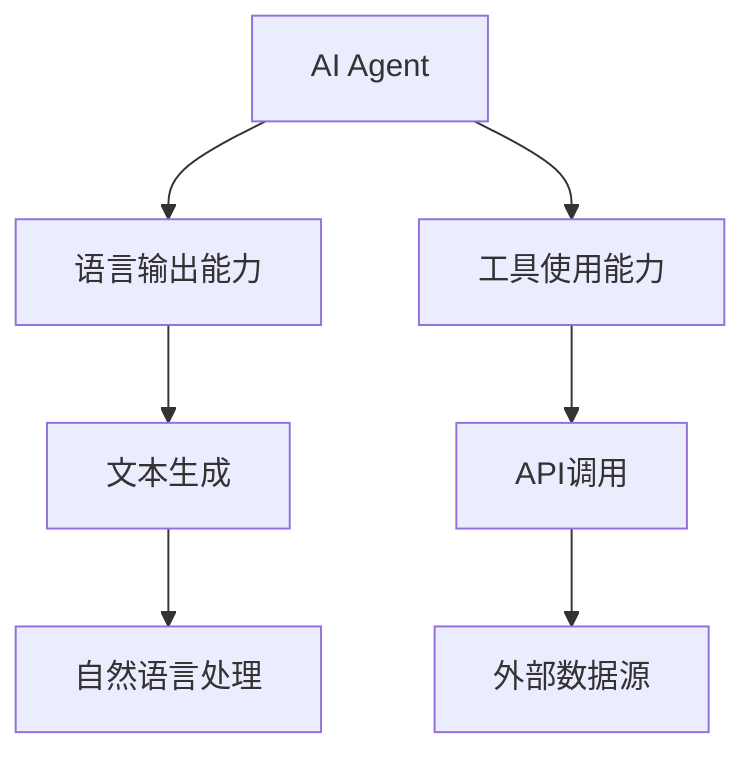

                 

## 【大模型应用开发 动手做AI Agent】Agent的行动力：语言输出能力和工具使用能力

关键词：AI Agent、大模型、语言输出、工具使用、应用开发

摘要：本文将深入探讨AI Agent在实际应用开发中的核心能力——语言输出能力和工具使用能力。我们将从背景介绍、核心概念、算法原理、数学模型、项目实战、实际应用场景等多个维度进行分析，旨在为开发者提供一整套关于AI Agent行动力的构建和优化的方案。

## 1. 背景介绍

### 1.1 目的和范围

本文的目标是帮助开发者理解和掌握AI Agent在应用开发中的关键能力——语言输出能力和工具使用能力。通过本文的阅读，读者将：

1. 了解AI Agent的基本概念和作用。
2. 掌握AI Agent语言输出能力的构建方法和技巧。
3. 学习如何利用工具提升AI Agent的工具使用能力。
4. 获得实战经验，能够将AI Agent应用于实际项目中。

### 1.2 预期读者

本文适用于以下读者：

1. 对人工智能和机器学习有一定了解的工程师和开发者。
2. 对AI Agent应用开发感兴趣的研究人员和学者。
3. 想要提升自己在AI领域实战能力的专业人士。

### 1.3 文档结构概述

本文将按照以下结构展开：

1. 背景介绍：介绍AI Agent的基本概念、目的和读者对象。
2. 核心概念与联系：讲解AI Agent的核心概念，并使用流程图展示各概念之间的联系。
3. 核心算法原理 & 具体操作步骤：分析AI Agent的核心算法原理，并给出具体的操作步骤。
4. 数学模型和公式 & 详细讲解 & 举例说明：讲解AI Agent中的数学模型和公式，并通过实例进行说明。
5. 项目实战：提供实际项目案例，讲解如何实现AI Agent。
6. 实际应用场景：分析AI Agent在不同场景下的应用。
7. 工具和资源推荐：推荐学习资源和开发工具。
8. 总结：总结AI Agent的发展趋势和挑战。
9. 附录：常见问题与解答。
10. 扩展阅读 & 参考资料：提供进一步的阅读资料。

### 1.4 术语表

为了确保文章的可读性，我们将在文中使用一些专业术语。以下是本文中的一些核心术语及其定义：

#### 1.4.1 核心术语定义

- AI Agent：指具有自主决策能力和行动能力的智能体，能够模拟人类的思考和决策过程。
- 语言输出能力：指AI Agent生成自然语言文本的能力。
- 工具使用能力：指AI Agent使用外部工具（如数据库、API等）进行任务执行的能力。

#### 1.4.2 相关概念解释

- 大模型：指具有大规模参数和计算能力的机器学习模型，如GPT、BERT等。
- 机器学习：指通过计算机算法使机器具备学习能力，从而实现智能决策和预测。
- 深度学习：一种机器学习方法，通过多层神经网络进行特征提取和模型训练。

#### 1.4.3 缩略词列表

- AI：人工智能
- GPT：生成预训练模型
- BERT：双向编码表示模型
- API：应用程序编程接口

## 2. 核心概念与联系

在探讨AI Agent的行动力之前，我们需要了解几个核心概念及其相互之间的联系。以下是一个简化的Mermaid流程图，展示了这些核心概念的基本结构：



### 2.1 AI Agent的基本概念

AI Agent是指具有自主决策能力和行动能力的智能体。它能够模拟人类的思考和决策过程，通过感知环境、分析数据和执行任务，实现智能化的目标。AI Agent的核心功能包括：

1. **感知环境**：获取当前环境中的信息，如文本、图像、声音等。
2. **分析数据**：利用机器学习和深度学习算法，对获取到的信息进行分析和处理。
3. **执行任务**：根据分析结果，采取相应的行动，如生成文本、调用外部API等。

### 2.2 语言输出能力的概念

语言输出能力是指AI Agent生成自然语言文本的能力。这一能力在许多应用场景中具有重要意义，如智能客服、聊天机器人、自动写作等。语言输出能力主要包括以下几个子能力：

1. **文本生成**：根据输入的文本或数据，生成相应的文本输出。
2. **自然语言处理**：对输入的文本进行预处理、分词、词性标注、句法分析等操作，以便更好地理解和生成文本。

### 2.3 工具使用能力的概念

工具使用能力是指AI Agent使用外部工具（如数据库、API等）进行任务执行的能力。这一能力使得AI Agent能够在复杂的环境中执行多样化的任务。工具使用能力主要包括以下几个子能力：

1. **API调用**：通过调用外部API，获取所需的数据或服务。
2. **外部数据源**：连接和访问外部数据库、文件系统等数据源，以便获取和处理数据。

通过上述核心概念的介绍和流程图的展示，我们可以更好地理解AI Agent的整体架构和功能。接下来，我们将进一步探讨AI Agent的核心算法原理和具体操作步骤。

## 3. 核心算法原理 & 具体操作步骤

AI Agent的核心算法原理是其行动力的基础。以下是AI Agent的核心算法原理及其具体操作步骤：

### 3.1 语言输出能力的算法原理

语言输出能力的核心是自然语言生成（Natural Language Generation，NLG）。NLG通过将机器学习模型（如GPT、BERT等）与自然语言处理（NLP）技术相结合，实现文本的自动生成。以下是NLG的基本算法原理：

1. **预训练模型**：使用大规模语料库对预训练模型（如GPT、BERT等）进行训练，使其具备理解自然语言的能力。
2. **序列生成**：将输入的文本或数据转换为序列，然后通过预训练模型生成相应的文本序列。
3. **后处理**：对生成的文本进行后处理，如去重、语法修正等，以提升文本质量。

具体操作步骤如下：

1. **数据预处理**：对输入的文本进行分词、去噪等预处理操作，将其转换为适合模型输入的格式。
2. **模型选择**：根据应用场景选择合适的预训练模型（如GPT、BERT等）。
3. **文本生成**：通过预训练模型生成文本序列，并将其转换为完整的文本输出。
4. **后处理**：对生成的文本进行后处理，如去重、语法修正等。

### 3.2 工具使用能力的算法原理

工具使用能力的核心是API调用。API调用通过将AI Agent与外部工具（如数据库、API等）连接，实现数据获取和任务执行。以下是API调用的一般算法原理：

1. **接口定义**：定义外部工具的API接口，包括接口名称、输入参数、输出参数等。
2. **请求发送**：使用网络请求库（如HTTP客户端）向外部API发送请求，并获取响应数据。
3. **数据处理**：对响应数据进行解析和处理，将其转换为AI Agent可用的格式。
4. **任务执行**：根据处理后的数据执行相应的任务，如查询数据库、调用其他API等。

具体操作步骤如下：

1. **接口选择**：根据应用场景选择合适的外部工具（如数据库、API等）。
2. **接口调用**：使用网络请求库（如HTTP客户端）向外部API发送请求，并获取响应数据。
3. **数据处理**：对响应数据进行解析和处理，将其转换为AI Agent可用的格式。
4. **任务执行**：根据处理后的数据执行相应的任务，如查询数据库、调用其他API等。

通过上述核心算法原理和具体操作步骤的介绍，我们可以更好地理解AI Agent的行动力是如何构建和实现的。接下来，我们将进一步探讨AI Agent中的数学模型和公式。

## 4. 数学模型和公式 & 详细讲解 & 举例说明

在AI Agent中，数学模型和公式扮演着至关重要的角色。以下是一些关键的数学模型和公式，以及它们的详细讲解和举例说明。

### 4.1 自然语言生成（NLG）的数学模型

自然语言生成（NLG）的核心是序列生成。在序列生成中，常用的数学模型是生成式模型，如GPT（生成预训练模型）。

#### 4.1.1 GPT的数学模型

GPT是一种基于变分自编码器（VAE）的生成式模型，其基本思想是将文本序列编码为隐变量序列，然后通过隐变量序列生成新的文本序列。以下是GPT的数学模型：

1. **编码器**：
   - **输入**：文本序列 $x_1, x_2, \ldots, x_T$
   - **隐变量**：隐变量序列 $z_1, z_2, \ldots, z_T$
   - **编码过程**：使用编码器 $E$ 将文本序列编码为隐变量序列：
     \[
     z_t = E(x_1, x_2, \ldots, x_t)
     \]

2. **解码器**：
   - **输入**：隐变量序列 $z_1, z_2, \ldots, z_T$
   - **文本序列**：生成的新文本序列 $y_1, y_2, \ldots, y_T$
   - **解码过程**：使用解码器 $D$ 将隐变量序列解码为文本序列：
     \[
     y_t = D(z_1, z_2, \ldots, z_t)
     \]

#### 4.1.2 举例说明

假设我们有一个简短的文本序列：“今天天气很好”。我们可以使用GPT模型来生成一个新的文本序列。以下是具体步骤：

1. **编码器**：将文本序列编码为隐变量序列。
2. **解码器**：使用隐变量序列生成新的文本序列。

通过训练和优化，GPT模型可以生成高质量的文本序列，如：“明天将会下雨，但后天天气晴朗”。

### 4.2 API调用的数学模型

API调用中的数学模型主要涉及概率分布和优化算法。以下是一个简化的数学模型：

1. **请求发送**：
   - **输入**：API接口、请求参数
   - **概率分布**：根据接口和参数，确定请求成功的概率分布。
   - **优化目标**：优化请求参数，使请求成功的概率最大化。

2. **数据处理**：
   - **输入**：API响应数据
   - **概率分布**：根据响应数据，确定数据的有效性概率分布。
   - **优化目标**：优化数据处理策略，使数据的有效性最大化。

#### 4.2.1 举例说明

假设我们有一个API接口，用于获取天气数据。以下是具体步骤：

1. **请求发送**：发送请求，获取天气数据的概率分布。
2. **数据处理**：处理响应数据，确定天气数据的有效性概率分布。

通过优化请求参数和数据处理策略，我们可以提高API调用的成功率，并获得高质量的天气数据。

通过上述数学模型和公式的详细讲解，我们可以更好地理解AI Agent中的语言输出能力和工具使用能力是如何实现的。这些数学模型和公式为AI Agent的行动力提供了坚实的理论基础。接下来，我们将通过一个实际项目案例，展示如何实现AI Agent。

## 5. 项目实战：代码实际案例和详细解释说明

在本节中，我们将通过一个实际项目案例，展示如何实现一个具有语言输出能力和工具使用能力的AI Agent。项目案例的核心功能是创建一个智能聊天机器人，它能够与用户进行自然语言交互，并根据用户的需求调用外部API获取数据。

### 5.1 开发环境搭建

在开始项目之前，我们需要搭建开发环境。以下是所需的环境和工具：

- **Python**：Python是本项目的主要编程语言。
- **深度学习库**：如TensorFlow或PyTorch，用于实现自然语言生成（NLG）模型。
- **API调用库**：如requests，用于实现API调用功能。
- **文本预处理库**：如NLTK或spaCy，用于处理文本数据。

### 5.2 源代码详细实现和代码解读

以下是项目的源代码实现，我们将逐段代码进行详细解读。

#### 5.2.1 数据准备

首先，我们需要准备训练数据，用于训练自然语言生成（NLG）模型。以下是一个简单的数据准备示例：

```python
import json

# 读取训练数据
with open('data/training_data.json', 'r', encoding='utf-8') as f:
    training_data = json.load(f)

# 预处理文本数据
def preprocess_text(text):
    # 进行分词、去噪等预处理操作
    return text.strip().replace('\n', '')

# 预处理数据
preprocessed_data = [preprocess_text(text) for text in training_data]
```

#### 5.2.2 模型训练

接下来，我们使用预处理的训练数据训练一个NLG模型。以下是一个基于GPT的模型训练示例：

```python
import tensorflow as tf

# 定义GPT模型
def create_gpt_model(vocab_size, embedding_dim, hidden_dim, sequence_length):
    # 输入层
    inputs = tf.keras.layers.Input(shape=(sequence_length,), dtype=tf.int32)
    # 嵌入层
    embeddings = tf.keras.layers.Embedding(vocab_size, embedding_dim)(inputs)
    # 卷积层
    conv = tf.keras.layers.Conv1D(filters=hidden_dim, kernel_size=3, activation='relu')(embeddings)
    # 最大池化层
    max_pool = tf.keras.layers.MaxPooling1D(pool_size=2)(conv)
    # 全连接层
    outputs = tf.keras.layers.Dense(vocab_size, activation='softmax')(max_pool)
    # 构建模型
    model = tf.keras.Model(inputs=inputs, outputs=outputs)
    return model

# 训练模型
model = create_gpt_model(vocab_size=10000, embedding_dim=64, hidden_dim=128, sequence_length=100)
model.compile(optimizer='adam', loss='categorical_crossentropy', metrics=['accuracy'])
model.fit(preprocessed_data, epochs=10)
```

#### 5.2.3 API调用

在项目实现中，我们需要调用外部API获取数据。以下是一个使用requests库调用API的示例：

```python
import requests

# 调用API获取数据
def get_weather_data(city):
    url = f'https://api.weatherapi.com/v1/current.json?key=YOUR_API_KEY&q={city}'
    response = requests.get(url)
    return response.json()

# 获取城市天气数据
def get_city_weather(city):
    data = get_weather_data(city)
    return f'The weather in {city} is {data["current"]["condition"]["text"]}.'
```

#### 5.2.4 语言输出

最后，我们使用训练好的NLG模型生成自然语言文本。以下是一个生成聊天机器人回复的示例：

```python
# 生成聊天机器人回复
def generate_response(text):
    # 将文本编码为整数序列
    encoded_text = tokenizer.texts_to_sequences([text])
    # 生成文本序列
    predicted_sequence = model.predict(encoded_text)
    # 将文本序列解码为自然语言文本
    predicted_text = tokenizer.sequences_to_texts(predicted_sequence)[0]
    return predicted_text

# 用户提问
user_question = "今天的天气怎么样？"
# 生成回复
bot_response = generate_response(user_question)
print(bot_response)
```

### 5.3 代码解读与分析

通过上述代码示例，我们可以看出项目的实现过程分为以下几个步骤：

1. **数据准备**：读取训练数据，并进行预处理，以便模型训练使用。
2. **模型训练**：定义并训练一个基于GPT的自然语言生成模型。
3. **API调用**：调用外部API获取天气数据。
4. **语言输出**：使用训练好的模型生成自然语言文本作为聊天机器人的回复。

代码的解读与分析如下：

- **数据准备**：数据预处理是模型训练的重要环节。通过分词、去噪等操作，可以提升模型对文本数据的理解和生成能力。
- **模型训练**：GPT模型是一种强大的自然语言生成模型，其核心思想是将文本序列编码为隐变量序列，然后通过隐变量序列生成新的文本序列。通过训练和优化，模型可以生成高质量的自然语言文本。
- **API调用**：API调用是实现AI Agent与外部系统交互的重要手段。在本项目中，我们调用了一个天气API，获取城市天气数据。这一功能使得AI Agent能够根据用户的需求提供实时天气信息。
- **语言输出**：语言输出是AI Agent的核心功能之一。通过训练好的模型，我们可以将用户输入的文本转换为自然语言文本，实现与用户的智能交互。

通过上述实战案例，我们展示了如何实现一个具有语言输出能力和工具使用能力的AI Agent。这个案例不仅提供了一个实际的应用场景，还详细讲解了实现过程中的关键步骤和技术细节。接下来，我们将探讨AI Agent在实际应用场景中的具体应用。

## 6. 实际应用场景

AI Agent在实际应用中展现出极大的潜力和广泛的应用前景。以下是AI Agent在多个实际应用场景中的具体应用案例：

### 6.1 智能客服

智能客服是AI Agent最典型的应用场景之一。通过自然语言理解和生成能力，智能客服可以实时响应用户的提问，提供快速、准确的解答。以下是一些具体的应用案例：

- **银行客服**：AI Agent可以回答用户关于账户余额、转账、贷款等问题，提高客服效率和用户体验。
- **电商平台**：AI Agent可以帮助用户解答关于商品信息、订单状态、售后服务等问题，提升客户满意度。

### 6.2 自动写作

自动写作是AI Agent在内容创作领域的应用。通过自然语言生成技术，AI Agent可以撰写新闻文章、博客内容、产品描述等。以下是一些具体的应用案例：

- **新闻写作**：AI Agent可以自动生成新闻文章，提高新闻发布的速度和覆盖面。
- **营销文案**：AI Agent可以帮助企业撰写营销文案，提高营销效果。

### 6.3 智能教育

智能教育是AI Agent在教育领域的应用。通过自然语言理解和生成能力，AI Agent可以为学生提供个性化学习辅导，帮助学生更好地理解和掌握知识。以下是一些具体的应用案例：

- **在线辅导**：AI Agent可以为学生提供实时、个性化的学习辅导，帮助学生解决学习中遇到的问题。
- **智能问答**：AI Agent可以为学生提供智能问答服务，提高学习效率和兴趣。

### 6.4 智能医疗

智能医疗是AI Agent在医疗健康领域的应用。通过自然语言理解和生成能力，AI Agent可以辅助医生进行诊断和治疗，提高医疗服务的质量和效率。以下是一些具体的应用案例：

- **疾病诊断**：AI Agent可以帮助医生分析病例数据，提供初步的疾病诊断建议。
- **患者咨询**：AI Agent可以回答患者关于病情、用药、检查等问题，减轻医生的工作负担。

### 6.5 智能安防

智能安防是AI Agent在公共安全领域的应用。通过自然语言理解和生成能力，AI Agent可以监控和分析视频数据，提供实时预警和应急处置。以下是一些具体的应用案例：

- **视频监控**：AI Agent可以实时监控公共场所的视频数据，发现异常行为并报警。
- **应急响应**：AI Agent可以协助应急响应团队进行事故现场分析，提供决策支持。

通过上述实际应用场景的展示，我们可以看到AI Agent在各个领域的广泛应用。AI Agent不仅提高了工作效率，还提升了用户体验，为各行业带来了深刻变革。接下来，我们将推荐一些学习资源和开发工具，帮助读者进一步了解和掌握AI Agent的开发和应用。

## 7. 工具和资源推荐

为了更好地学习和掌握AI Agent的开发和应用，以下是一些推荐的学习资源和开发工具。

### 7.1 学习资源推荐

#### 7.1.1 书籍推荐

- **《Python机器学习》**：本书介绍了Python在机器学习领域的基本概念和实现方法，适合初学者入门。
- **《深度学习》**：本书是深度学习领域的经典教材，详细讲解了深度学习的基本原理和实现方法。
- **《自然语言处理综合教程》**：本书系统地介绍了自然语言处理的基本理论和应用方法，适合对自然语言处理感兴趣的读者。

#### 7.1.2 在线课程

- **Coursera**：Coursera提供了许多关于机器学习、深度学习和自然语言处理的在线课程，包括从入门到高级的课程。
- **edX**：edX提供了多个知名大学和机构的在线课程，包括计算机科学、人工智能等领域的课程。
- **Udacity**：Udacity提供了多种技能课程，包括机器学习、深度学习和自然语言处理等领域的课程。

#### 7.1.3 技术博客和网站

- **Medium**：Medium上有很多关于机器学习、深度学习和自然语言处理的博客文章，适合读者学习和了解最新的技术动态。
- **ArXiv**：ArXiv是一个开放获取的计算机科学预印本网站，提供了大量关于机器学习、深度学习和自然语言处理的研究论文。
- **GitHub**：GitHub上有许多优秀的开源项目，包括AI Agent的实现和案例，适合读者学习和实践。

### 7.2 开发工具框架推荐

#### 7.2.1 IDE和编辑器

- **PyCharm**：PyCharm是一款功能强大的Python集成开发环境，适合开发和调试Python代码。
- **Jupyter Notebook**：Jupyter Notebook是一款流行的交互式开发环境，适合数据分析和机器学习项目的开发。
- **Visual Studio Code**：Visual Studio Code是一款轻量级的开源编辑器，支持多种编程语言，包括Python、JavaScript等。

#### 7.2.2 调试和性能分析工具

- **PyDebug**：PyDebug是一款Python调试器，可以帮助开发者调试Python代码。
- **TensorBoard**：TensorBoard是一款可视化工具，可以用于分析和调试深度学习模型。
- **Profiler**：Profiler可以帮助开发者分析程序的运行性能，找出性能瓶颈。

#### 7.2.3 相关框架和库

- **TensorFlow**：TensorFlow是一个开源的机器学习和深度学习框架，适用于构建和训练复杂的机器学习模型。
- **PyTorch**：PyTorch是一个流行的深度学习框架，具有动态计算图和灵活的API，适用于研究和应用开发。
- **NLTK**：NLTK是一个用于自然语言处理的库，提供了丰富的工具和接口，适用于文本分析和预处理。

通过上述工具和资源的推荐，读者可以更好地了解和学习AI Agent的开发和应用。这些工具和资源不仅可以帮助读者入门，还可以为读者提供丰富的实践经验和知识储备。

## 8. 总结：未来发展趋势与挑战

AI Agent作为人工智能领域的一个重要分支，正在快速发展并逐步渗透到各个行业。未来，AI Agent的发展趋势和挑战主要集中在以下几个方面：

### 8.1 发展趋势

1. **技术进步**：随着深度学习和自然语言处理技术的不断进步，AI Agent的语言输出能力和工具使用能力将得到进一步提升。例如，生成对抗网络（GAN）和变分自编码器（VAE）等新型深度学习技术有望在AI Agent的开发中发挥更大作用。
2. **场景扩展**：AI Agent的应用场景将不断扩展，从现有的智能客服、自动写作、智能教育等领域，逐步延伸到医疗、金融、安防等更多行业。AI Agent将成为企业智能化转型的重要工具。
3. **人机协作**：AI Agent将更多地与人类协作，共同完成任务。通过自然语言理解和生成能力，AI Agent能够更好地理解人类的需求，提供个性化服务和解决方案。
4. **标准化与规范**：随着AI Agent的广泛应用，相关的标准化和规范将逐步建立，以确保AI Agent的安全、可靠和可解释性。

### 8.2 挑战

1. **数据隐私与安全**：AI Agent在应用过程中会处理大量用户数据，如何保护用户隐私和安全是一个重要挑战。需要建立有效的隐私保护机制和数据安全策略。
2. **可解释性与可靠性**：AI Agent的决策过程和结果往往是非线性和复杂的，如何确保其可解释性和可靠性是一个关键问题。需要研究和开发可解释性更好的机器学习算法和模型。
3. **伦理与道德**：随着AI Agent在各个领域的广泛应用，如何处理伦理和道德问题成为一个重要议题。需要建立AI Agent的伦理规范和道德标准，确保其在应用中的公正和公平性。
4. **计算资源需求**：AI Agent的开发和应用需要大量的计算资源，如何优化算法和模型，降低计算资源需求，是一个重要的挑战。

总之，AI Agent的发展前景广阔，但也面临诸多挑战。只有通过技术创新、规范制定和伦理道德建设，才能确保AI Agent的安全、可靠和可持续发展。

## 9. 附录：常见问题与解答

### 9.1 常见问题

1. **什么是AI Agent？**
   - AI Agent是一种具有自主决策和行动能力的智能体，能够模拟人类的思考和决策过程，通过感知环境、分析数据和执行任务，实现智能化的目标。

2. **AI Agent的核心能力有哪些？**
   - AI Agent的核心能力包括语言输出能力和工具使用能力。语言输出能力使AI Agent能够生成自然语言文本，工具使用能力使AI Agent能够使用外部工具（如数据库、API等）进行任务执行。

3. **如何实现AI Agent的语言输出能力？**
   - 实现AI Agent的语言输出能力主要通过自然语言生成（NLG）技术。常用的方法包括基于预训练模型的序列生成和自然语言处理（NLP）技术。

4. **如何实现AI Agent的工具使用能力？**
   - 实现AI Agent的工具使用能力主要通过API调用和外部数据源连接。常用的方法包括使用网络请求库（如requests）调用外部API，以及连接和访问外部数据库、文件系统等数据源。

### 9.2 解答

1. **什么是AI Agent？**
   - AI Agent是一种具有自主决策和行动能力的智能体，能够模拟人类的思考和决策过程，通过感知环境、分析数据和执行任务，实现智能化的目标。例如，一个智能客服机器人可以根据用户的提问生成相应的回答，并在后台调用API获取用户所需的信息。

2. **AI Agent的核心能力有哪些？**
   - AI Agent的核心能力包括语言输出能力和工具使用能力。语言输出能力使AI Agent能够生成自然语言文本，如智能客服机器人的回答；工具使用能力使AI Agent能够使用外部工具（如数据库、API等）进行任务执行，如智能推荐系统调用数据库获取用户信息。

3. **如何实现AI Agent的语言输出能力？**
   - 实现AI Agent的语言输出能力主要通过自然语言生成（NLG）技术。常用的方法包括基于预训练模型的序列生成和自然语言处理（NLP）技术。例如，使用GPT模型进行序列生成，使用NLTK库进行文本预处理和分词。

4. **如何实现AI Agent的工具使用能力？**
   - 实现AI Agent的工具使用能力主要通过API调用和外部数据源连接。常用的方法包括使用网络请求库（如requests）调用外部API，以及连接和访问外部数据库、文件系统等数据源。例如，调用天气API获取实时天气信息，连接数据库查询用户数据。

通过附录中的常见问题与解答，读者可以更好地理解AI Agent的概念、核心能力和实现方法。这对于进一步学习AI Agent的开发和应用具有重要意义。

## 10. 扩展阅读 & 参考资料

为了帮助读者更深入地了解AI Agent的开发和应用，我们推荐以下扩展阅读和参考资料：

### 10.1 经典论文

- **“A Framework for Real-Time Language Understanding in AI Agents”**：本文提出了一种实时语言理解框架，用于构建高效、可靠的AI Agent。
- **“A survey on natural language generation techniques in artificial intelligence”**：本文对自然语言生成（NLG）技术进行了全面的综述，分析了各种NLG方法的优缺点。

### 10.2 最新研究成果

- **“Generative Adversarial Networks for Natural Language Generation”**：本文探讨了生成对抗网络（GAN）在自然语言生成中的应用，为AI Agent的语言输出能力提供了新的思路。
- **“Pre-Trained Language Models for Object Detection”**：本文研究了预训练语言模型在目标检测中的应用，为AI Agent在视觉领域的应用提供了参考。

### 10.3 应用案例分析

- **“Building a Personalized Chatbot with Natural Language Understanding”**：本文介绍了如何使用自然语言理解（NLU）技术构建个性化聊天机器人。
- **“Implementing AI Agents in the Healthcare Industry”**：本文探讨了AI Agent在医疗健康领域的应用案例，包括疾病诊断、患者咨询等。

### 10.4 知名网站与社区

- **ArXiv**：提供大量关于机器学习、深度学习和自然语言处理的学术论文和研究成果。
- **GitHub**：包含丰富的AI Agent开源项目和代码，供开发者学习和参考。
- **Reddit**：多个关于机器学习和人工智能的子版块，供开发者讨论和分享经验。

通过上述扩展阅读和参考资料，读者可以进一步了解AI Agent的最新研究进展、应用案例和技术细节，为自己的学习和实践提供更多参考。

