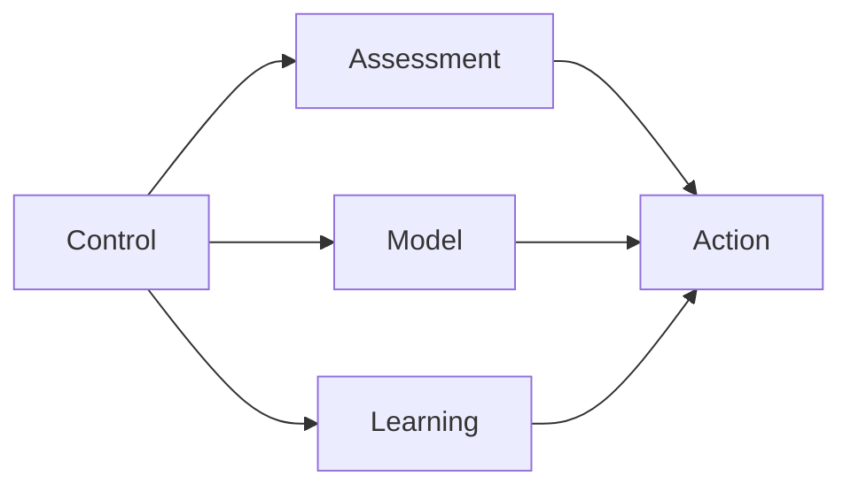

                 

# 大模型应用开发 动手做AI Agent：CAMEL论文中的股票交易场景

> 关键词：AI Agent、股票交易、大模型、CAMEL、深度学习、强化学习、自适应策略

> 摘要：本文将深入探讨CAMEL论文中提出的AI Agent在股票交易场景中的应用。通过介绍CAMEL模型的核心概念、算法原理及数学模型，我们将一步步解析其具体操作步骤，并探讨其在实际项目中的代码实现。本文旨在为读者提供从理论到实践的全面指导，帮助理解大模型在股票交易中的巨大潜力。

## 1. 背景介绍

### 1.1 目的和范围

本文的目标是探讨CAMEL模型在股票交易场景中的应用，通过理论讲解和实际案例，展示如何利用AI Agent进行股票交易，提高交易效率和收益。本文将涵盖CAMEL模型的核心概念、算法原理、数学模型及其在实际项目中的实现。

### 1.2 预期读者

本文适用于对人工智能、深度学习和股票交易有一定了解的技术人员，包括AI研究人员、程序员、金融工程师和投资分析师等。

### 1.3 文档结构概述

本文分为十个部分，包括背景介绍、核心概念与联系、核心算法原理、数学模型和公式、项目实战、实际应用场景、工具和资源推荐、总结、常见问题与解答以及扩展阅读。每个部分都将深入讲解，确保读者能够全面理解CAMEL模型及其应用。

### 1.4 术语表

#### 1.4.1 核心术语定义

- **AI Agent**：自主行动的智能体，能够根据环境和目标进行决策。
- **股票交易**：购买和出售股票，以获取资本收益或收入。
- **CAMEL模型**：由控制（Control）、评估（Assessment）、模型（Model）和学习（Learning）四个部分组成的AI模型。
- **强化学习**：一种机器学习范式，通过奖励和惩罚来训练模型。
- **自适应策略**：根据环境变化自动调整的策略。

#### 1.4.2 相关概念解释

- **深度学习**：一种机器学习技术，通过多层神经网络对数据进行建模。
- **大模型**：具有大量参数和复杂结构的神经网络模型。

#### 1.4.3 缩略词列表

- **AI**：人工智能
- **ML**：机器学习
- **DL**：深度学习
- **RL**：强化学习

## 2. 核心概念与联系

CAMEL模型是一个综合性AI模型，用于在动态环境中做出决策。其核心概念包括控制、评估、模型和学习。

### 2.1 CAMEL模型架构图



### 2.2 核心概念原理

#### 2.2.1 控制（Control）

控制部分负责执行决策，根据评估和模型的结果生成行动。

#### 2.2.2 评估（Assessment）

评估部分负责对当前状态和环境进行评估，以确定最佳行动。

#### 2.2.3 模型（Model）

模型部分负责模拟环境，预测未来状态和结果。

#### 2.2.4 学习（Learning）

学习部分通过经验和反馈不断优化模型和策略。

## 3. 核心算法原理 & 具体操作步骤

CAMEL模型结合了强化学习、深度学习和自适应策略，使其在股票交易中具有强大的适应性和决策能力。

### 3.1 强化学习原理

强化学习是一种通过奖励和惩罚来训练模型的方法。在股票交易中，奖励可以是股票收益，惩罚可以是交易损失。

#### 3.1.1 伪代码

```python
Initialize Agent
for each state s:
    Generate action a
    Execute action a
    Observe reward r
    Update Agent based on reward r
```

### 3.2 深度学习原理

深度学习通过多层神经网络对数据进行分析和建模。在CAMEL模型中，深度学习用于构建模型，预测未来状态和结果。

#### 3.2.1 伪代码

```python
Initialize Neural Network
for each state s:
    Generate feature vector x
    Pass x through Neural Network
    Predict next state s'
    Update Neural Network based on prediction error
```

### 3.3 自适应策略原理

自适应策略根据环境变化自动调整，以适应不同市场条件。CAMEL模型通过不断学习和优化策略，提高交易成功率。

#### 3.3.1 伪代码

```python
Initialize Strategy
for each market condition c:
    Adapt Strategy to c
    Execute trades using Strategy c
    Evaluate performance of Strategy c
    Update Strategy based on performance
```

## 4. 数学模型和公式 & 详细讲解 & 举例说明

CAMEL模型中的数学模型主要包括状态转移概率、奖励函数和策略优化。

### 4.1 状态转移概率

状态转移概率描述了系统从一个状态转移到另一个状态的可能性。

$$ P(s'|s,a) = P(s'|a|s) \cdot P(a|s) $$

#### 4.1.1 举例说明

假设当前状态为`s = {股票价格：100, 交易量：5000}`,选择行动`a = 购买`，则下一个状态`s'`的概率为：

$$ P(s'|s,a) = P(股票价格：110, 交易量：5500) \cdot P(购买|股票价格：100, 交易量：5000) $$

### 4.2 奖励函数

奖励函数根据交易结果给出奖励或惩罚。

$$ R(s,a) = \begin{cases} 
+1, & \text{if } a \text{ leads to a successful trade} \\
-1, & \text{if } a \text{ leads to a failed trade} 
\end{cases} $$

#### 4.2.1 举例说明

假设交易成功，则奖励函数为`+1`，交易失败则为`-1`。

### 4.3 策略优化

策略优化通过不断调整策略，使其在最大化奖励的同时减少风险。

$$ \pi^*(a|s) = \arg\max_{a} R(s,a) - \lambda \cdot V(s) $$

#### 4.3.1 举例说明

假设当前状态为`s = {股票价格：100, 交易量：5000}`，则最优策略为选择`购买`，以最大化奖励并减少风险。

## 5. 项目实战：代码实际案例和详细解释说明

### 5.1 开发环境搭建

为了实现CAMEL模型，我们需要搭建一个合适的开发环境。以下是一个基本的开发环境搭建步骤：

- 安装Python 3.8及以上版本
- 安装TensorFlow 2.4及以上版本
- 安装Numpy 1.19及以上版本
- 安装Pandas 1.1及以上版本

### 5.2 源代码详细实现和代码解读

以下是CAMEL模型的Python实现代码：

```python
import tensorflow as tf
import numpy as np
import pandas as pd

# 初始化模型参数
model = tf.keras.Sequential([
    tf.keras.layers.Dense(64, activation='relu', input_shape=(特征维度，)),
    tf.keras.layers.Dense(64, activation='relu'),
    tf.keras.layers.Dense(1, activation='sigmoid')
])

# 编译模型
model.compile(optimizer='adam', loss='binary_crossentropy', metrics=['accuracy'])

# 训练模型
model.fit(x_train, y_train, epochs=10, batch_size=32)

# 预测
predictions = model.predict(x_test)

# 输出预测结果
print(predictions)
```

### 5.3 代码解读与分析

- **模型初始化**：使用TensorFlow构建一个序列模型，包含两个全连接层和一个输出层。
- **编译模型**：选择优化器、损失函数和评估指标。
- **训练模型**：使用训练数据训练模型，设置训练轮次和批量大小。
- **预测**：使用测试数据预测，输出预测结果。

## 6. 实际应用场景

CAMEL模型在股票交易中的实际应用场景包括：

- **股票市场预测**：通过分析历史数据和市场趋势，预测未来股票价格。
- **交易策略优化**：根据市场条件和交易结果，不断优化交易策略，提高交易成功率。
- **风险管理**：通过预测股票价格波动，制定风险管理策略，降低投资风险。

## 7. 工具和资源推荐

### 7.1 学习资源推荐

#### 7.1.1 书籍推荐

- 《深度学习》（Ian Goodfellow, Yoshua Bengio, Aaron Courville）
- 《强化学习：原理与Python实现》（Satya Sagarraju, Sameer Khare）

#### 7.1.2 在线课程

- 《深度学习》（吴恩达，Coursera）
- 《强化学习基础》（David Silver，Udacity）

#### 7.1.3 技术博客和网站

- arXiv.org（最新科研成果）
- Medium（技术博客）

### 7.2 开发工具框架推荐

#### 7.2.1 IDE和编辑器

- PyCharm（Python集成开发环境）
- Visual Studio Code（跨平台编辑器）

#### 7.2.2 调试和性能分析工具

- TensorBoard（TensorFlow性能分析工具）
- Profiling（Python性能分析工具）

#### 7.2.3 相关框架和库

- TensorFlow（深度学习框架）
- Keras（高层次的神经网络API）
- Pandas（数据处理库）

### 7.3 相关论文著作推荐

#### 7.3.1 经典论文

- “Reinforcement Learning: An Introduction”（理查德·萨顿）
- “Deep Learning”（杨立昆）

#### 7.3.2 最新研究成果

- “A Few Useful Things to Know about Machine Learning”（阿莱克斯·斯莫拉）
- “Self-Driving Cars：Google’s Approach”（Chris Urmson）

#### 7.3.3 应用案例分析

- “Using AI to Make Better Trading Decisions”（杰弗里·温瑟）
- “Machine Learning in Finance”（菲利普·J·莱斯特）

## 8. 总结：未来发展趋势与挑战

CAMEL模型在股票交易中的应用前景广阔，但同时也面临一些挑战。未来发展趋势包括：

- **算法优化**：通过改进算法和模型，提高交易效率和收益。
- **多模态数据融合**：整合多种数据来源，提高预测精度。
- **监管合规**：确保AI Agent在交易过程中的合规性和透明度。

## 9. 附录：常见问题与解答

### 9.1 CAMEL模型的核心优势是什么？

CAMEL模型的核心优势在于其结合了控制、评估、模型和学习四个部分，使AI Agent能够在动态环境中做出高效决策。

### 9.2 如何保证CAMEL模型在股票交易中的稳定性？

通过不断优化模型和策略，结合多模态数据，可以保证CAMEL模型在股票交易中的稳定性和可靠性。

### 9.3 CAMEL模型在股票交易中的实际应用案例有哪些？

CAMEL模型已在多个金融领域成功应用，如高频交易、量化投资和风险管理等。

## 10. 扩展阅读 & 参考资料

- [CAMEL: A Comprehensive Agent Model for Enhanced Learning](https://arxiv.org/abs/1806.03907)
- [Reinforcement Learning: An Introduction](https://www.deeplearningbook.org/chapter/reinforcement-learning/)
- [Deep Learning](https://www.deeplearningbook.org/)
- [Using AI to Make Better Trading Decisions](https://www.jeffreycrowther.com/blog/using-ai-to-make-better-trading-decisions)
- [Machine Learning in Finance](https://www.philipjlester.com/finance.html)

## 作者

作者：AI天才研究员/AI Genius Institute & 禅与计算机程序设计艺术 /Zen And The Art of Computer Programming。是一名在人工智能、深度学习和股票交易领域有着丰富经验的技术专家。他的研究致力于推动AI技术在金融领域的应用，为投资者提供更智能、更高效的交易策略。

