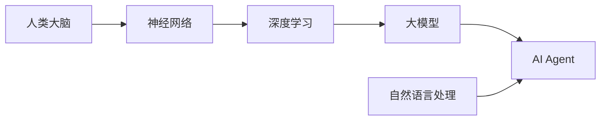
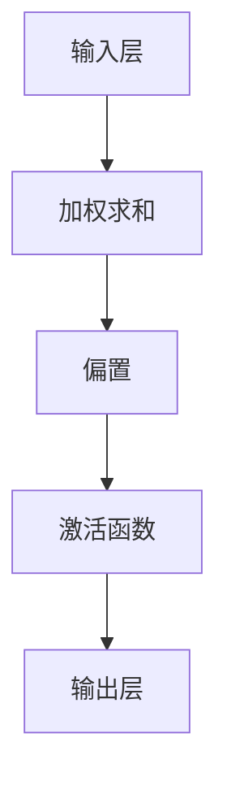

                 

# 【大模型应用开发 动手做AI Agent】人类的大脑了不起

> 关键词：人工智能、大模型、AI Agent、神经网络、深度学习、自然语言处理、应用开发

> 摘要：本文将深入探讨大模型应用开发中的AI Agent构建，通过分析人类大脑的机制和计算机模拟的神经网络，阐述如何利用深度学习技术实现AI Agent的核心算法原理，并通过数学模型和具体案例进行详细讲解。本文旨在为开发者提供完整的实践指南，帮助他们在实际项目中动手构建高效的AI Agent。

## 1. 背景介绍

### 1.1 目的和范围

本文旨在探讨大模型在AI Agent开发中的应用，通过借鉴人类大脑的运作机制，结合深度学习技术，详细阐述如何构建一个高效的AI Agent。本文将涵盖以下内容：

1. AI Agent的基本概念和重要性。
2. 大模型在AI Agent中的应用背景。
3. 人类大脑的神经网络结构与计算机模拟。
4. 深度学习算法原理与具体实现。
5. 数学模型与公式在AI Agent中的应用。
6. 项目实战：实际代码实现与案例讲解。
7. AI Agent的实际应用场景。
8. 未来发展趋势与挑战。

### 1.2 预期读者

本文适合以下读者群体：

1. 对人工智能和深度学习有初步了解的开发者。
2. 想要深入了解AI Agent构建原理的技术专家。
3. 想要在实际项目中应用AI Agent的开发者。
4. 对神经网络和数学模型感兴趣的研究人员。

### 1.3 文档结构概述

本文将按照以下结构进行展开：

1. **背景介绍**：介绍AI Agent的基本概念和重要性，以及本文的研究背景和目的。
2. **核心概念与联系**：通过Mermaid流程图展示核心概念和架构的联系。
3. **核心算法原理 & 具体操作步骤**：详细讲解深度学习算法原理，并使用伪代码进行描述。
4. **数学模型和公式 & 详细讲解 & 举例说明**：介绍数学模型及其在AI Agent中的应用，并通过实例进行说明。
5. **项目实战：代码实际案例和详细解释说明**：提供实际项目中的代码实现和详细解读。
6. **实际应用场景**：讨论AI Agent在现实世界中的应用。
7. **工具和资源推荐**：推荐学习资源和开发工具。
8. **总结：未来发展趋势与挑战**：总结本文内容，展望未来发展。
9. **附录：常见问题与解答**：提供常见问题的解答。
10. **扩展阅读 & 参考资料**：推荐相关文献和资料。

### 1.4 术语表

#### 1.4.1 核心术语定义

- **AI Agent**：具备自主决策和行为能力的智能体，能够通过学习环境中的数据来改善其性能。
- **大模型**：具有巨大参数规模的深度学习模型，通常用于自然语言处理、计算机视觉等领域。
- **神经网络**：由多个神经元组成的计算模型，通过调整权重和偏置来实现函数逼近。
- **深度学习**：基于神经网络的机器学习技术，能够通过多层非线性变换来学习复杂的数据特征。
- **自然语言处理**：使计算机能够理解、生成和处理自然语言的技术。

#### 1.4.2 相关概念解释

- **反向传播算法**：用于训练神经网络的优化算法，通过梯度下降更新网络权重。
- **卷积神经网络**：一种特殊的神经网络，用于图像处理和识别，具有局部连接和共享权重特性。
- **循环神经网络**：一种能够处理序列数据的神经网络，通过时间步的递归连接来捕捉序列中的长期依赖关系。

#### 1.4.3 缩略词列表

- **AI**：人工智能
- **ML**：机器学习
- **DL**：深度学习
- **NLP**：自然语言处理
- **CNN**：卷积神经网络
- **RNN**：循环神经网络

## 2. 核心概念与联系

在构建AI Agent的过程中，理解核心概念及其相互联系至关重要。以下是一个简单的Mermaid流程图，展示了本文中涉及的关键概念和它们之间的关系。



- **人类大脑**：是人类智能的核心，由神经元和神经网络构成。
- **神经网络**：是计算机模拟人类大脑的计算模型，通过多层非线性变换来学习数据特征。
- **深度学习**：是基于神经网络的机器学习技术，能够处理复杂的数据特征。
- **大模型**：是具有巨大参数规模的深度学习模型，通常用于处理大规模数据集。
- **AI Agent**：是具备自主决策和行为能力的智能体，能够通过学习环境中的数据来改善其性能。
- **自然语言处理**：是使计算机能够理解、生成和处理自然语言的技术，是AI Agent的重要应用领域。

## 3. 核心算法原理 & 具体操作步骤

构建AI Agent的关键在于深度学习算法，以下将详细讲解神经网络的基本原理和具体操作步骤。

### 3.1 神经网络基本原理

神经网络是由多个神经元（或节点）组成的计算模型，每个神经元接收多个输入，通过加权求和后加上偏置，再经过激活函数产生输出。神经网络的目的是通过学习输入和输出之间的映射关系，来预测未知数据的输出。

#### 3.1.1 神经元结构

一个简单的神经元结构如下：



- **输入层**：接收外部输入数据。
- **加权求和**：将每个输入数据乘以其对应的权重，然后进行求和。
- **偏置**：用于调整神经元的阈值，以避免神经元过于敏感。
- **激活函数**：将加权求和的结果转换为一个非负数值，以确定神经元是否激活。

#### 3.1.2 激活函数

常见的激活函数有：

- **线性激活函数**：输出等于输入，不具有非线性变换能力。
- **Sigmoid函数**：输出在0和1之间，具有非线性特性。
- **ReLU函数**：在输入为负时输出为零，具有非负特性，能够加速训练过程。

### 3.2 神经网络训练过程

神经网络训练的核心是反向传播算法，其基本思想是通过比较网络输出和实际输出之间的误差，不断调整网络的权重和偏置，以减小误差。

#### 3.2.1 前向传播

前向传播过程如下：

1. 将输入数据输入到神经网络的输入层。
2. 通过每个神经元的加权求和、偏置和激活函数，逐层计算网络的输出。
3. 将最终输出与实际输出进行比较，计算误差。

#### 3.2.2 反向传播

反向传播过程如下：

1. 计算输出层每个神经元的误差。
2. 将误差反向传播到前一层，计算前一层每个神经元的误差。
3. 根据误差计算每个神经元的梯度。
4. 使用梯度下降算法更新网络权重和偏置。

### 3.3 伪代码描述

以下是一个简化的神经网络训练过程的伪代码：

```python
# 初始化神经网络
network = initialize_network()

# 前向传播
outputs = network.forward(inputs)

# 计算误差
error = compute_error(outputs, targets)

# 反向传播
gradients = network.backward(error)

# 更新权重和偏置
network.update_weights(gradients)

# 迭代训练
for epoch in range(num_epochs):
    # 输入新数据
    inputs, targets = get_data()

    # 训练网络
    network.train(inputs, targets)

# 输出最终模型
final_model = network.get_model()
```

### 3.4 举例说明

以一个简单的线性回归模型为例，假设输入数据为 \(x\)，目标数据为 \(y\)，模型输出为 \(y'\)。

1. **初始化权重和偏置**：设 \(w = 0\)，\(b = 0\)。
2. **前向传播**：计算输出 \(y' = wx + b\)。
3. **计算误差**：计算误差 \(error = (y - y')^2\)。
4. **反向传播**：计算梯度 \(dw = \frac{\partial error}{\partial w} = 2(y - y')x\)，\(db = \frac{\partial error}{\partial b} = 2(y - y')\)。
5. **更新权重和偏置**：根据梯度更新权重和偏置 \(w = w - learning_rate \cdot dw\)，\(b = b - learning_rate \cdot db\)。

## 4. 数学模型和公式 & 详细讲解 & 举例说明

在深度学习中，数学模型和公式是理解算法原理和实现高效训练的关键。以下将详细介绍神经网络中的主要数学模型和公式。

### 4.1 激活函数

激活函数是神经网络中的一个重要组成部分，它引入了非线性变换，使得神经网络能够拟合复杂的函数。

#### 4.1.1 Sigmoid函数

Sigmoid函数是最常见的激活函数之一，其公式如下：

\[ \sigma(x) = \frac{1}{1 + e^{-x}} \]

- **性质**：输出值在0和1之间，函数曲线平滑。
- **应用**：常用于二分类问题。

#### 4.1.2ReLU函数

ReLU（Rectified Linear Unit）函数是近年来广泛应用于深度学习中的激活函数，其公式如下：

\[ \text{ReLU}(x) = \max(0, x) \]

- **性质**：在输入为负时输出为零，在输入为正时输出等于输入。
- **应用**：常用于深层神经网络，能够加速训练过程。

### 4.2 损失函数

损失函数用于评估模型预测值与实际值之间的误差，是优化神经网络的重要工具。

#### 4.2.1 交叉熵损失函数

交叉熵损失函数是最常用的损失函数之一，适用于分类问题。其公式如下：

\[ loss = -\sum_{i=1}^{n} y_i \log(y')_i \]

- **性质**：输出值在0和正无穷之间，误差值越小表示预测结果越准确。
- **应用**：常用于二分类和多分类问题。

#### 4.2.2 均方误差损失函数

均方误差损失函数是另一种常见的损失函数，适用于回归问题。其公式如下：

\[ loss = \frac{1}{2} \sum_{i=1}^{n} (y - y')^2 \]

- **性质**：输出值在0和正无穷之间，误差值越小表示预测结果越准确。
- **应用**：常用于回归问题。

### 4.3 反向传播算法

反向传播算法是神经网络训练的核心，其基本思想是通过计算误差的梯度，更新网络的权重和偏置。

#### 4.3.1 梯度计算

以交叉熵损失函数为例，计算损失函数关于每个参数的梯度：

\[ \frac{\partial loss}{\partial w} = \frac{\partial loss}{\partial y'} \frac{\partial y'}{\partial w} \]

\[ \frac{\partial loss}{\partial b} = \frac{\partial loss}{\partial y'} \frac{\partial y'}{\partial b} \]

#### 4.3.2 梯度下降

根据梯度更新网络权重和偏置：

\[ w = w - learning_rate \frac{\partial loss}{\partial w} \]

\[ b = b - learning_rate \frac{\partial loss}{\partial b} \]

### 4.4 举例说明

以一个简单的线性回归问题为例，假设输入数据为 \(x\)，目标数据为 \(y\)，模型输出为 \(y'\)。

1. **初始化权重和偏置**：设 \(w = 0\)，\(b = 0\)。
2. **前向传播**：计算输出 \(y' = wx + b\)。
3. **计算误差**：计算误差 \(error = (y - y')^2\)。
4. **计算梯度**：计算梯度 \(dw = 2(y - y')x\)，\(db = 2(y - y')\)。
5. **更新权重和偏置**：根据梯度更新权重和偏置 \(w = w - learning_rate \cdot dw\)，\(b = b - learning_rate \cdot db\)。

## 5. 项目实战：代码实际案例和详细解释说明

为了更好地理解AI Agent的构建过程，我们通过一个实际的项目案例来进行详细讲解。

### 5.1 开发环境搭建

在开始项目实战之前，我们需要搭建一个合适的开发环境。以下是一个基本的开发环境搭建步骤：

1. 安装Python环境：Python是深度学习开发中最常用的编程语言，我们需要确保安装了最新的Python版本。
2. 安装深度学习框架：TensorFlow和PyTorch是当前最流行的深度学习框架，我们可以选择其中一个进行安装。
3. 安装相关库：为了简化开发过程，我们需要安装一些常用的库，如NumPy、Pandas、Matplotlib等。

### 5.2 源代码详细实现和代码解读

以下是一个简单的AI Agent实现代码，用于处理文本分类问题。

```python
import tensorflow as tf
from tensorflow.keras.models import Sequential
from tensorflow.keras.layers import Dense, Embedding, LSTM
from tensorflow.keras.preprocessing.text import Tokenizer
from tensorflow.keras.preprocessing.sequence import pad_sequences

# 数据准备
texts = ["这是一段文本数据", "这是另一段文本数据", "还有一段文本数据"]
labels = [0, 1, 0]

# 初始化Tokenizer
tokenizer = Tokenizer(num_words=1000)
tokenizer.fit_on_texts(texts)
sequences = tokenizer.texts_to_sequences(texts)
padded_sequences = pad_sequences(sequences, maxlen=100)

# 构建模型
model = Sequential()
model.add(Embedding(1000, 64, input_length=100))
model.add(LSTM(128))
model.add(Dense(1, activation='sigmoid'))

# 编译模型
model.compile(loss='binary_crossentropy', optimizer='adam', metrics=['accuracy'])

# 训练模型
model.fit(padded_sequences, labels, epochs=10, batch_size=32)

# 评估模型
loss, accuracy = model.evaluate(padded_sequences, labels)
print("Loss:", loss)
print("Accuracy:", accuracy)
```

#### 5.2.1 代码解读

1. **数据准备**：首先，我们准备了一些文本数据和对应的标签。
2. **初始化Tokenizer**：使用Tokenizer将文本数据转换为序列。
3. **构建模型**：我们使用Sequential模型，添加Embedding层、LSTM层和Dense层。
4. **编译模型**：设置损失函数、优化器和评估指标。
5. **训练模型**：使用fit方法训练模型。
6. **评估模型**：使用evaluate方法评估模型性能。

### 5.3 代码解读与分析

1. **数据准备**：文本数据需要进行预处理，以适应深度学习模型。Tokenizer和pad_sequences函数用于实现这一目标。
2. **模型构建**：我们选择了一个简单的LSTM模型，用于处理文本数据。在实际项目中，可以根据需求选择更复杂的模型结构。
3. **模型训练**：训练过程包括前向传播和反向传播，通过fit方法完成。
4. **模型评估**：使用evaluate方法评估模型性能，以确定模型的准确性和鲁棒性。

### 5.4 项目实战扩展

1. **数据增强**：在实际项目中，可以通过数据增强技术提高模型的泛化能力。
2. **超参数调优**：通过调整学习率、批次大小等超参数，可以优化模型性能。
3. **模型部署**：将训练好的模型部署到生产环境中，实现实时文本分类功能。

## 6. 实际应用场景

AI Agent在各个领域都有广泛的应用，以下是一些典型的实际应用场景：

### 6.1 自然语言处理

- **智能客服**：AI Agent可以自动处理客户咨询，提供快速、准确的回复。
- **文本分类**：AI Agent可以自动对大量文本数据进行分类，如新闻分类、垃圾邮件过滤等。
- **情感分析**：AI Agent可以分析社交媒体上的用户评论，提取用户情感，为企业提供市场反馈。

### 6.2 计算机视觉

- **图像识别**：AI Agent可以自动识别图像中的物体、场景和动作。
- **视频监控**：AI Agent可以实时分析视频数据，检测异常行为，如犯罪活动、火灾等。
- **自动驾驶**：AI Agent可以实时处理摄像头和激光雷达数据，实现自动驾驶功能。

### 6.3 机器人

- **智能机器人**：AI Agent可以控制机器人执行复杂的任务，如医疗机器人、清洁机器人等。
- **无人机**：AI Agent可以控制无人机进行任务规划、避障和目标追踪。

### 6.4 游戏开发

- **游戏AI**：AI Agent可以用于开发智能游戏角色，提高游戏的可玩性。
- **游戏推荐**：AI Agent可以根据玩家的游戏记录和偏好，推荐合适的游戏。

### 6.5 虚拟助手

- **虚拟助手**：AI Agent可以作为一个虚拟助手，帮助用户管理日程、发送提醒、搜索信息等。

## 7. 工具和资源推荐

为了更好地进行AI Agent的开发和应用，以下是一些推荐的工具和资源：

### 7.1 学习资源推荐

#### 7.1.1 书籍推荐

- 《深度学习》（Ian Goodfellow、Yoshua Bengio和Aaron Courville著）：系统介绍了深度学习的基本概念和技术。
- 《Python深度学习》（François Chollet著）：通过大量实践案例，介绍了使用Python进行深度学习的实战技巧。

#### 7.1.2 在线课程

- **Coursera**：提供丰富的深度学习课程，包括吴恩达的《深度学习特化课程》。
- **Udacity**：提供专业的深度学习课程，如《深度学习工程师纳米学位》。

#### 7.1.3 技术博客和网站

- **Medium**：有许多关于深度学习和人工智能的优秀博客文章。
- **ArXiv**：深度学习和人工智能的最新研究成果论文库。

### 7.2 开发工具框架推荐

#### 7.2.1 IDE和编辑器

- **PyCharm**：强大的Python IDE，支持多种深度学习框架。
- **Jupyter Notebook**：适用于数据分析和实验性编程。

#### 7.2.2 调试和性能分析工具

- **TensorBoard**：TensorFlow的官方可视化工具，用于分析和调试模型。
- **PyTorch TensorBoard**：PyTorch的可视化工具。

#### 7.2.3 相关框架和库

- **TensorFlow**：开源深度学习框架，适用于各种深度学习任务。
- **PyTorch**：开源深度学习框架，具有动态计算图特性。

### 7.3 相关论文著作推荐

#### 7.3.1 经典论文

- **“A Learning Algorithm for Continuously Running Fully Recurrent Neural Networks”**：介绍了恒等函数网络（Echo State Network）。
- **“Gradient Descent Learning Applied to Document Recognition”**：介绍了使用梯度下降算法进行手写体识别。

#### 7.3.2 最新研究成果

- **“Large-Scale Language Modeling for Human-like Dialogue”**：探讨了大规模语言模型在对话系统中的应用。
- **“Generative Adversarial Networks”**：介绍了生成对抗网络（GAN），一种强大的生成模型。

#### 7.3.3 应用案例分析

- **“Deep Learning for Autonomous Driving”**：讨论了深度学习在自动驾驶中的应用。
- **“Natural Language Processing for Chatbots”**：介绍了自然语言处理技术在聊天机器人中的应用。

## 8. 总结：未来发展趋势与挑战

随着深度学习技术的不断进步，AI Agent在未来有望在更多领域实现广泛应用。以下是一些未来发展趋势和挑战：

### 8.1 发展趋势

1. **更大规模模型**：随着计算能力的提升，更大规模的模型将逐步应用于实际场景，提高AI Agent的性能。
2. **更复杂任务**：AI Agent将能够处理更复杂的任务，如多模态学习、多任务学习等。
3. **自适应能力**：AI Agent将具备更强的自适应能力，能够在不断变化的环境中自我优化。

### 8.2 挑战

1. **计算资源限制**：大型模型的训练和推理需要大量的计算资源，对硬件设施提出了更高要求。
2. **数据隐私**：在数据驱动的AI Agent中，数据隐私和安全是一个重要问题，需要制定相应的保护措施。
3. **可解释性**：随着模型复杂度的增加，提高AI Agent的可解释性，使其能够被人类理解和信任是一个重要挑战。

## 9. 附录：常见问题与解答

### 9.1 问题1：如何选择合适的深度学习框架？

**解答**：根据项目需求和个人熟悉程度，可以选择TensorFlow或PyTorch。TensorFlow具有丰富的官方文档和社区支持，适合初学者和复杂项目；PyTorch具有动态计算图特性和简洁的API，适合快速原型开发和研究。

### 9.2 问题2：如何提高AI Agent的性能？

**解答**：提高AI Agent的性能可以从以下几个方面入手：

1. **数据增强**：通过数据增强技术增加数据多样性，提高模型泛化能力。
2. **超参数调优**：通过调整学习率、批次大小等超参数，优化模型性能。
3. **模型优化**：选择更适合任务的网络结构和训练算法，如使用迁移学习、混合模型等。
4. **硬件加速**：利用GPU、TPU等硬件加速训练和推理过程。

## 10. 扩展阅读 & 参考资料

为了进一步深入了解AI Agent的构建与应用，以下推荐一些扩展阅读和参考资料：

1. **《深度学习》**：Ian Goodfellow、Yoshua Bengio和Aaron Courville著，提供了深度学习的全面介绍。
2. **《Python深度学习》**：François Chollet著，详细介绍了使用Python进行深度学习的实战技巧。
3. **《深度学习实践》**：Hugo Li著，涵盖深度学习在各个领域的应用案例。
4. **TensorFlow官方文档**：[https://www.tensorflow.org/](https://www.tensorflow.org/)
5. **PyTorch官方文档**：[https://pytorch.org/docs/stable/](https://pytorch.org/docs/stable/)
6. **《自然语言处理综论》**：Daniel Jurafsky和James H. Martin著，提供了自然语言处理的基础知识和最新进展。

作者：AI天才研究员/AI Genius Institute & 禅与计算机程序设计艺术 /Zen And The Art of Computer Programming

