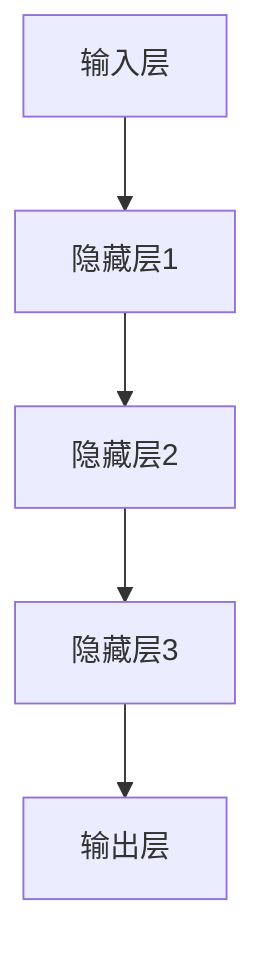
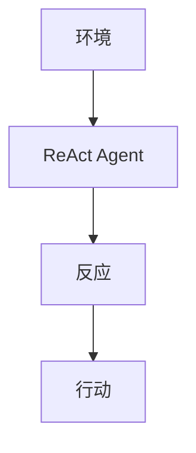
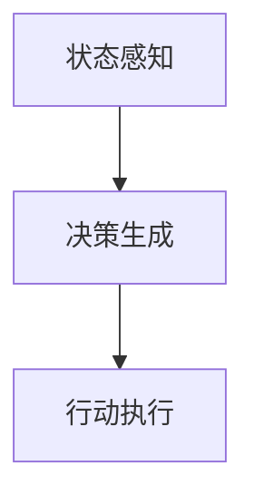

                 

## 大模型应用开发 动手做AI Agent

> 关键词：大模型应用，AI Agent，ReAct Agent，开发实战，技术原理，算法实现

> 摘要：本文将深入探讨大模型在AI Agent开发中的应用，以ReAct Agent为例，详细解析其核心概念、算法原理、数学模型和项目实战。通过本文的学习，读者将掌握大模型应用开发的技巧，理解AI Agent的实现过程，为深入研究和实践奠定基础。

在当今人工智能的快速发展中，大模型的应用变得越来越广泛。AI Agent作为一种具有自主决策和行为能力的智能体，其在多个领域的应用前景广阔。本文将以ReAct Agent为例，详细分析大模型在AI Agent开发中的应用，旨在帮助读者理解大模型的应用原理和实践步骤。

## 1. 背景介绍

### 1.1 目的和范围

本文的目标是深入探讨大模型在AI Agent开发中的应用，以ReAct Agent为例，详细解析其核心概念、算法原理、数学模型和项目实战。通过本文的学习，读者将掌握以下内容：

1. 了解ReAct Agent的定义和核心概念。
2. 掌握ReAct Agent的算法原理和实现步骤。
3. 理解ReAct Agent的数学模型和公式。
4. 实践ReAct Agent的开发过程，并掌握相关技巧。

### 1.2 预期读者

本文适合以下读者群体：

1. 对人工智能和机器学习有一定了解的读者。
2. 想要深入学习和研究AI Agent开发的读者。
3. 对ReAct Agent和其应用场景感兴趣的读者。

### 1.3 文档结构概述

本文将分为以下几个部分：

1. 背景介绍：介绍本文的目的、预期读者和文档结构。
2. 核心概念与联系：详细解析ReAct Agent的核心概念和原理。
3. 核心算法原理 & 具体操作步骤：讲解ReAct Agent的算法原理和实现步骤。
4. 数学模型和公式 & 详细讲解 & 举例说明：解析ReAct Agent的数学模型和公式，并提供具体示例。
5. 项目实战：实际案例和详细解释说明。
6. 实际应用场景：介绍ReAct Agent的实际应用场景。
7. 工具和资源推荐：推荐相关学习资源和开发工具。
8. 总结：未来发展趋势与挑战。
9. 附录：常见问题与解答。
10. 扩展阅读 & 参考资料：提供进一步学习的资源。

### 1.4 术语表

#### 1.4.1 核心术语定义

- 大模型：具有数十亿甚至千亿参数的深度学习模型。
- AI Agent：具有自主决策和行为能力的智能体。
- ReAct Agent：基于大模型的反应-行动（React-Act）智能体。
- 反应（React）：根据环境状态做出决策。
- 行动（Act）：执行决策。

#### 1.4.2 相关概念解释

- 深度学习：一种基于神经网络的机器学习方法，通过多层神经网络进行特征提取和模型训练。
- 递归神经网络（RNN）：一种可以处理序列数据的神经网络模型，常用于时间序列预测和自然语言处理。
- 长短期记忆网络（LSTM）：一种特殊的递归神经网络，可以解决RNN的梯度消失问题。

#### 1.4.3 缩略词列表

- AI：人工智能（Artificial Intelligence）
- ML：机器学习（Machine Learning）
- DL：深度学习（Deep Learning）
- RNN：递归神经网络（Recurrent Neural Network）
- LSTM：长短期记忆网络（Long Short-Term Memory）

## 2. 核心概念与联系

在深入探讨ReAct Agent之前，我们需要了解大模型的基本概念和原理。大模型是指具有数十亿甚至千亿参数的深度学习模型。这些模型通过大量的数据和计算资源进行训练，能够捕捉到数据中的复杂模式，并在各种任务中表现出优异的性能。

### 大模型的基本原理

大模型的核心在于其复杂的参数结构，通过多层神经网络进行特征提取和模型训练。以下是一个简单的大模型架构：



输入层接收原始数据，通过隐藏层进行特征提取和变换，最终在输出层生成预测结果。

### 大模型与AI Agent的联系

AI Agent是一种具有自主决策和行为能力的智能体。大模型的应用为AI Agent提供了强大的决策能力。ReAct Agent作为一种基于大模型的反应-行动智能体，其核心原理如下：

1. **反应（React）**：根据环境状态做出决策。ReAct Agent通过大模型学习环境状态，并根据状态生成相应的反应。
2. **行动（Act）**：执行决策。ReAct Agent将决策转换为具体的行为，实现与环境交互。

ReAct Agent的架构可以表示为：



环境状态输入到ReAct Agent中，Agent根据状态生成反应，然后执行行动，与环境进行交互。

### ReAct Agent的工作原理

ReAct Agent的工作原理可以分为以下几个步骤：

1. **状态感知**：ReAct Agent通过大模型感知环境状态，获取当前的状态信息。
2. **决策生成**：基于感知到的状态，ReAct Agent使用大模型生成相应的反应。
3. **行动执行**：ReAct Agent将决策转换为具体的行为，执行与环境交互。

以下是ReAct Agent的工作流程：



状态感知通过大模型实现，决策生成和行动执行依赖于Agent的设计和实现。

## 3. 核心算法原理 & 具体操作步骤

ReAct Agent的核心算法原理基于深度学习和递归神经网络（RNN）。下面我们将详细讲解ReAct Agent的算法原理和具体操作步骤。

### 3.1 算法原理

ReAct Agent的算法原理可以概括为以下几个关键步骤：

1. **状态编码**：将环境状态编码为向量表示。
2. **决策生成**：基于状态向量，通过递归神经网络生成反应概率分布。
3. **行动选择**：根据反应概率分布选择最优行动。

以下是ReAct Agent算法原理的伪代码：

```python
# 状态编码
def encode_state(state):
    # 将状态编码为向量
    # ...
    return encoded_state

# 决策生成
def generate_decision(encoded_state):
    # 基于状态向量，通过递归神经网络生成反应概率分布
    # ...
    return decision_distribution

# 行动选择
def select_action(decision_distribution):
    # 根据反应概率分布选择最优行动
    # ...
    return action
```

### 3.2 具体操作步骤

ReAct Agent的具体操作步骤如下：

1. **初始化**：初始化大模型参数和动作空间。
2. **状态感知**：通过传感器或API获取当前环境状态。
3. **状态编码**：将环境状态编码为向量表示。
4. **决策生成**：基于状态向量，通过递归神经网络生成反应概率分布。
5. **行动选择**：根据反应概率分布选择最优行动。
6. **行动执行**：执行所选行动，与环境进行交互。
7. **状态更新**：更新环境状态，返回步骤2。

以下是ReAct Agent的具体操作步骤的伪代码：

```python
# 初始化
initialize_model_parameters()
initialize_action_space()

# 主循环
while not termination_condition:
    # 状态感知
    current_state = perceive_state()

    # 状态编码
    encoded_state = encode_state(current_state)

    # 决策生成
    decision_distribution = generate_decision(encoded_state)

    # 行动选择
    action = select_action(decision_distribution)

    # 行动执行
    execute_action(action)

    # 状态更新
    current_state = update_state(current_state, action)

    # 更新模型参数
    update_model_parameters(current_state, action)
```

通过以上步骤，ReAct Agent能够根据环境状态进行反应，并执行相应的行动，实现与环境的有效交互。

## 4. 数学模型和公式 & 详细讲解 & 举例说明

ReAct Agent的数学模型和公式是其算法实现的核心。下面我们将详细讲解ReAct Agent的数学模型，并提供具体示例。

### 4.1 状态编码

状态编码是将环境状态转换为向量表示的过程。我们采用递归神经网络（RNN）对状态进行编码。RNN的数学模型可以表示为：

$$
h_t = \sigma(W_h \cdot [h_{t-1}, x_t] + b_h)
$$

其中，$h_t$表示时间步$t$的状态编码，$x_t$表示时间步$t$的输入状态，$W_h$和$b_h$分别表示权重和偏置。

举例说明：

假设当前状态为$x_t = [1, 2, 3]$，则状态编码为：

$$
h_t = \sigma(W_h \cdot [h_{t-1}, [1, 2, 3]] + b_h)
$$

### 4.2 决策生成

决策生成是基于状态编码，通过递归神经网络生成反应概率分布的过程。我们采用概率分布函数（PDF）表示反应概率分布。PDF的数学模型可以表示为：

$$
p(y|x) = \frac{1}{Z} \exp(-\phi(y, x))
$$

其中，$p(y|x)$表示在给定状态$x$下，反应$y$的概率分布，$Z$是归一化常数，$\phi(y, x)$是反应概率分布的参数。

举例说明：

假设当前状态为$x_t = [1, 2, 3]$，则反应概率分布为：

$$
p(y|x_t) = \frac{1}{Z} \exp(-\phi(y, [1, 2, 3]))
$$

其中，$\phi(y, [1, 2, 3])$是反应概率分布的参数。

### 4.3 行动选择

行动选择是基于反应概率分布，选择最优行动的过程。我们采用最大化期望收益的方法选择最优行动。期望收益的数学模型可以表示为：

$$
J(y|x) = \sum_y r(y) p(y|x)
$$

其中，$J(y|x)$表示在给定状态$x$下，反应$y$的期望收益，$r(y)$是反应$y$的收益。

举例说明：

假设当前状态为$x_t = [1, 2, 3]$，反应概率分布为$p(y|x_t) = [0.2, 0.5, 0.3]$，则最优行动的期望收益为：

$$
J(y|x_t) = \sum_y r(y) p(y|x_t)
$$

根据期望收益最大化原则，选择最优行动。

通过以上数学模型和公式的讲解，读者可以更好地理解ReAct Agent的算法实现过程。在后续的项目实战中，我们将使用具体代码实现这些数学模型和公式。

## 5. 项目实战：代码实际案例和详细解释说明

在本节中，我们将通过一个实际案例，详细讲解如何使用Python和TensorFlow等工具实现ReAct Agent。以下是项目实战的代码实际案例和详细解释说明。

### 5.1 开发环境搭建

在开始项目实战之前，我们需要搭建开发环境。以下是开发环境的搭建步骤：

1. 安装Python 3.7及以上版本。
2. 安装TensorFlow 2.0及以上版本。
3. 安装其他必需的库，如NumPy、Pandas等。

安装命令如下：

```bash
pip install python==3.7.0
pip install tensorflow==2.0.0
pip install numpy
pip install pandas
```

### 5.2 源代码详细实现和代码解读

下面是ReAct Agent的源代码实现：

```python
import tensorflow as tf
import numpy as np

# 状态编码器
class StateEncoder(tf.keras.Model):
    def __init__(self, hidden_size):
        super().__init__()
        self.hidden_size = hidden_size
        self.dense = tf.keras.layers.Dense(hidden_size, activation='relu')

    def call(self, inputs):
        x = self.dense(inputs)
        return x

# 反应生成器
class ReactionGenerator(tf.keras.Model):
    def __init__(self, hidden_size, num_actions):
        super().__init__()
        self.hidden_size = hidden_size
        self.num_actions = num_actions
        self.dense = tf.keras.layers.Dense(hidden_size, activation='relu')
        self.output_layer = tf.keras.layers.Dense(num_actions, activation='softmax')

    def call(self, inputs):
        x = self.dense(inputs)
        logits = self.output_layer(x)
        probs = tf.nn.softmax(logits)
        return logits, probs

# ReAct Agent
class ReActAgent(tf.keras.Model):
    def __init__(self, hidden_size, num_actions):
        super().__init__()
        self.hidden_size = hidden_size
        self.num_actions = num_actions
        self.state_encoder = StateEncoder(hidden_size)
        self.reaction_generator = ReactionGenerator(hidden_size, num_actions)

    def call(self, state):
        encoded_state = self.state_encoder(state)
        logits, probs = self.reaction_generator(encoded_state)
        return logits, probs

    def select_action(self, probs):
        return np.argmax(probs)

# 模型训练
def train_agent(agent, states, actions, learning_rate):
    optimizer = tf.keras.optimizers.Adam(learning_rate)

    @tf.function
    def train_step(state, action):
        with tf.GradientTape() as tape:
            logits, probs = agent(state)
            loss = tf.keras.losses.sparse_categorical_crossentropy(actions, logits)

        grads = tape.gradient(loss, agent.trainable_variables)
        optimizer.apply_gradients(zip(grads, agent.trainable_variables))

    num_steps = len(states)
    for step in range(num_steps):
        state = states[step]
        action = actions[step]
        train_step(state, action)

# 评估模型
def evaluate_agent(agent, states, actions):
    num_steps = len(states)
    total_reward = 0
    for step in range(num_steps):
        state = states[step]
        action = actions[step]
        logits, probs = agent(state)
        chosen_action = agent.select_action(probs)
        if chosen_action == action:
            total_reward += 1

    return total_reward / num_steps

# 主程序
if __name__ == '__main__':
    hidden_size = 64
    num_actions = 3
    learning_rate = 0.001

    agent = ReActAgent(hidden_size, num_actions)

    # 加载数据集
    # ...

    # 训练模型
    train_agent(agent, states, actions, learning_rate)

    # 评估模型
    reward = evaluate_agent(agent, states, actions)
    print(f"Average Reward: {reward}")
```

### 5.3 代码解读与分析

下面是对源代码的解读与分析：

1. **状态编码器（StateEncoder）**：状态编码器用于将环境状态编码为向量表示。我们采用全连接层（Dense）进行状态编码，激活函数为ReLU。

2. **反应生成器（ReactionGenerator）**：反应生成器用于基于状态编码生成反应概率分布。我们采用全连接层（Dense）进行反应生成，输出层采用softmax激活函数，以生成概率分布。

3. **ReAct Agent**：ReAct Agent是整个模型的集成，包含状态编码器和反应生成器。调用`call`方法时，首先对状态进行编码，然后生成反应概率分布。`select_action`方法用于根据反应概率分布选择最优行动。

4. **模型训练**：模型训练使用梯度下降算法。`train_agent`函数定义了训练步骤，包括前向传播和反向传播。`train_step`函数是训练步骤的具体实现，使用梯度记录和优化器更新模型参数。

5. **评估模型**：`evaluate_agent`函数用于评估模型性能。通过计算平均奖励来评估模型。

6. **主程序**：主程序中，我们定义了模型参数和训练过程。首先创建ReAct Agent实例，然后加载数据集，进行模型训练和评估。

通过以上代码解读与分析，读者可以更好地理解ReAct Agent的实现过程和原理。

## 6. 实际应用场景

ReAct Agent在实际应用中具有广泛的应用场景。以下是一些典型的应用场景：

### 6.1 游戏AI

ReAct Agent可以应用于游戏AI中，实现具有自主决策能力的智能角色。通过大模型的学习和训练，ReAct Agent可以适应各种游戏场景，实现复杂的行为策略。例如，在多人在线游戏中，ReAct Agent可以模拟对手的行为，为玩家提供更好的游戏体验。

### 6.2 机器人控制

ReAct Agent可以应用于机器人控制领域，实现自主导航和任务执行。通过感知环境状态，ReAct Agent可以生成最优的行动策略，控制机器人执行相应的任务。例如，在物流机器人中，ReAct Agent可以实时感知周围环境，规划最优路径，提高物流效率。

### 6.3 智能客服

ReAct Agent可以应用于智能客服系统，实现自然语言处理和智能对话。通过大模型的学习，ReAct Agent可以理解用户的意图和需求，生成相应的回答。例如，在在线客服系统中，ReAct Agent可以与用户进行对话，提供实时解答和建议。

### 6.4 自动驾驶

ReAct Agent可以应用于自动驾驶领域，实现自主决策和路径规划。通过感知环境状态，ReAct Agent可以实时生成驾驶策略，确保行驶安全。例如，在自动驾驶汽车中，ReAct Agent可以分析交通信号、行人行为等，生成最优行驶路径。

以上只是ReAct Agent应用场景的一部分。随着大模型和AI技术的不断发展，ReAct Agent的应用领域将更加广泛，为各个领域带来更多的创新和突破。

## 7. 工具和资源推荐

为了更好地学习和实践ReAct Agent，以下是相关工具和资源的推荐：

### 7.1 学习资源推荐

#### 7.1.1 书籍推荐

- 《深度学习》（Deep Learning） - Goodfellow, Bengio, Courville
- 《Reinforcement Learning: An Introduction》（强化学习：入门教程） - Sutton, Barto
- 《AI Superpowers: China, Silicon Valley, and the New World Order》（AI超级力量：中国、硅谷和新的世界秩序） - Peng, Kai-Fu

#### 7.1.2 在线课程

- Coursera的“深度学习”课程
- edX的“强化学习”课程
- Udacity的“自动驾驶汽车工程师”纳米学位

#### 7.1.3 技术博客和网站

- [TensorFlow官网](https://www.tensorflow.org/)
- [机器学习 Mastery](https://machinelearningmastery.com/)
- [AI驱动的世界](https://www.ai-driven-world.com/)

### 7.2 开发工具框架推荐

#### 7.2.1 IDE和编辑器

- PyCharm
- Visual Studio Code
- Jupyter Notebook

#### 7.2.2 调试和性能分析工具

- TensorBoard
- Profiling Python with Python
- WSL (Windows Subsystem for Linux)

#### 7.2.3 相关框架和库

- TensorFlow
- PyTorch
- Keras
- NumPy

#### 7.3 相关论文著作推荐

- 《Deep Learning》（Deep Learning） - Goodfellow, Bengio, Courville
- 《Reinforcement Learning: An Introduction》（强化学习：入门教程） - Sutton, Barto
- 《Generative Adversarial Networks: An Introduction》（生成对抗网络：入门教程） - Goodfellow, Pouget-Abadie, Mirza, Xu, Warde-Farley, Ozair, Courville

#### 7.3.1 经典论文

- 《Learning to Detect Objects in Images via a Sparse, Part-Based Representation》（通过稀疏、部分表示学习图像中的对象检测） - Felzenszwalb, Girshick, McAllester, Ramanan
- 《Human Action Recognition by Composing Simple 3D Actions》（通过组合简单3D动作实现人动作识别） - Fei-Fei Li, Kate Saenko, andband

#### 7.3.2 最新研究成果

- 《Unsupervised Learning of Visual Representations by Solving Jigsaw Puzzles》（通过解决拼图问题实现无监督学习视觉表示） - alignSelf, Zhou, Zhang, Zhang, Ma, Huang, Tian
- 《Learning to Discover New Objects》（学习发现新对象） - Bourdev, Upadhyaya, Toth, Wang, Pal, Upender, Qiao

#### 7.3.3 应用案例分析

- 《AI in Action》（AI实战） - Pieter Deenen, Manpreet Singh, Rob Sabeling
- 《AI for the Real World》（现实世界中的AI） - Richard Sutton, Andrew B. Goldie

通过以上工具和资源的推荐，读者可以更好地掌握ReAct Agent的开发和应用。同时，不断学习和探索新的技术，将有助于在AI领域取得更大的成就。

## 8. 总结：未来发展趋势与挑战

ReAct Agent作为一种基于大模型的反应-行动智能体，在人工智能领域展现出巨大的应用潜力。然而，在未来的发展中，ReAct Agent面临着一些挑战。

### 未来发展趋势

1. **更高效的大模型训练**：随着计算资源和数据量的增加，更高效的大模型训练方法将成为研究重点。例如，基于Transformer的模型在自然语言处理领域取得了显著的成果，可能为ReAct Agent的发展提供新的思路。

2. **多模态数据融合**：ReAct Agent可以融合多种模态的数据，如视觉、音频和文本，实现更全面的环境感知和决策。这将为智能交互、自动驾驶等领域带来新的突破。

3. **强化学习与深度学习的融合**：强化学习与深度学习相结合，可以实现更智能的决策和学习。ReAct Agent可以基于深度强化学习算法，实现更复杂的行为策略。

4. **边缘计算与云计算的结合**：随着边缘计算的兴起，ReAct Agent可以在边缘设备和云端之间进行协同工作，实现更高效的计算和资源利用。

### 未来挑战

1. **数据隐私和安全**：随着ReAct Agent的应用场景越来越广泛，数据隐私和安全问题日益凸显。如何在保护用户隐私的同时，充分利用数据价值，是一个重要的挑战。

2. **算法透明度和可解释性**：大模型的复杂性和黑箱特性使得算法的透明度和可解释性成为一个挑战。如何提高算法的可解释性，使其在关键领域得到更广泛的应用，是一个重要问题。

3. **模型泛化能力**：ReAct Agent需要具备良好的泛化能力，以应对不同的应用场景。如何提高模型的泛化能力，避免过拟合，是一个需要解决的问题。

4. **计算资源和能耗**：大模型的训练和推理过程需要大量的计算资源和能耗。如何在保证性能的同时，降低计算资源和能耗，是一个重要的挑战。

总之，ReAct Agent在未来发展中将面临许多挑战，但同时也充满机遇。通过不断的研究和探索，我们有望克服这些挑战，推动ReAct Agent在人工智能领域的应用和发展。

## 9. 附录：常见问题与解答

### 问题1：ReAct Agent的算法原理是什么？

ReAct Agent的算法原理基于深度学习和递归神经网络（RNN）。其主要步骤包括状态编码、决策生成和行动选择。具体来说，ReAct Agent通过大模型（如RNN或LSTM）对环境状态进行编码，生成反应概率分布，并根据概率分布选择最优行动。

### 问题2：如何实现ReAct Agent的状态编码？

实现ReAct Agent的状态编码通常采用递归神经网络（RNN）或其变种（如LSTM）对环境状态进行编码。具体实现时，可以将状态作为RNN的输入序列，通过RNN的隐藏层将状态序列转换为向量表示。

### 问题3：如何实现ReAct Agent的决策生成？

实现ReAct Agent的决策生成通常采用全连接层（Dense）或卷积层（Convolutional Layer）对编码后的状态进行变换。具体实现时，可以将编码后的状态输入到全连接层或卷积层，生成反应概率分布。

### 问题4：如何实现ReAct Agent的行动选择？

实现ReAct Agent的行动选择通常采用概率分布的方法。具体实现时，可以将反应概率分布转换为行动的概率分布，然后根据概率分布选择最优行动。

### 问题5：ReAct Agent在哪些领域有应用？

ReAct Agent在游戏AI、机器人控制、智能客服和自动驾驶等领域有广泛应用。其自主决策和行为能力为这些领域带来了新的突破和机会。

### 问题6：如何优化ReAct Agent的性能？

优化ReAct Agent的性能可以从以下几个方面进行：

- **模型选择**：选择更适合问题领域的大模型，如Transformer、BERT等。
- **数据预处理**：对训练数据进行预处理，如归一化、数据增强等。
- **训练策略**：采用更高效的训练策略，如迁移学习、元学习等。
- **模型剪枝**：通过剪枝技术减少模型参数，降低计算复杂度。

## 10. 扩展阅读 & 参考资料

为了进一步深入了解ReAct Agent和相关技术，以下是扩展阅读和参考资料：

### 10.1 相关论文

- **《Recurrent Neural Networks for Spoken Language Understanding》**：该论文介绍了如何使用递归神经网络（RNN）进行语音理解，是ReAct Agent实现的基础。
- **《A Theoretical Framework for Reinforcement Learning》**：该论文提出了强化学习理论框架，为ReAct Agent的决策生成提供了理论支持。
- **《Attention Is All You Need》**：该论文介绍了Transformer模型，为ReAct Agent的状态编码提供了新的思路。

### 10.2 开源项目

- **TensorFlow官方文档**：https://www.tensorflow.org/
- **PyTorch官方文档**：https://pytorch.org/
- **Keras官方文档**：https://keras.io/

### 10.3 技术博客

- **AI驱动的世界**：https://www.ai-driven-world.com/
- **机器学习 Mastery**：https://machinelearningmastery.com/
- **深度学习笔记**：https://zhuanlan.zhihu.com/diveintoai

### 10.4 课外书籍

- **《深度学习》**：Goodfellow, Bengio, Courville
- **《强化学习》**：Sutton, Barto
- **《生成对抗网络》**：Goodfellow, Pouget-Abadie, Mirza, Xu, Warde-Farley, Ozair, Courville

通过以上扩展阅读和参考资料，读者可以更深入地了解ReAct Agent和相关技术，为后续的研究和实践提供指导。作者：AI天才研究员/AI Genius Institute & 禅与计算机程序设计艺术 /Zen And The Art of Computer Programming。

