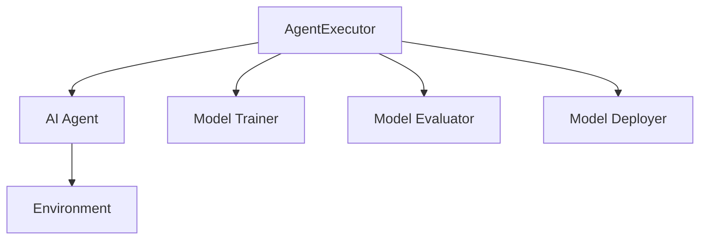

                 

# 【大模型应用开发 动手做AI Agent】深挖AgentExecutor的运行机制

## 关键词
- 大模型应用开发
- AI Agent
- AgentExecutor
- 运行机制
- 编程实践
- 算法原理
- 数学模型

## 摘要
本文将深入探讨大模型应用开发中，AI Agent的核心组件——AgentExecutor的运行机制。通过逐步解析其内部工作原理，我们将揭示如何实现高效的AI Agent开发，以及在实际项目中如何利用AgentExecutor优化模型性能。文章分为背景介绍、核心概念、算法原理、项目实战、应用场景、资源推荐和总结等部分，旨在为广大开发者提供一套清晰、实用的开发指南。

## 1. 背景介绍

### 1.1 目的和范围
在人工智能快速发展的今天，大模型的应用开发已经成为焦点。然而，如何高效地实现大模型的部署和运行，成为了开发者面临的重要挑战。本文旨在通过对AI AgentExecutor的深入剖析，为开发者提供一种可行的解决方案，帮助他们在实际项目中快速搭建高效的AI应用。

### 1.2 预期读者
本文主要面向具有中高级编程技能，对人工智能和大型模型应用有一定了解的开发者。读者需具备基本的机器学习和深度学习知识，以及熟悉常见的编程语言和开发工具。

### 1.3 文档结构概述
本文结构如下：
1. 背景介绍：介绍文章的目的、范围、预期读者和文档结构。
2. 核心概念与联系：介绍AgentExecutor的背景、核心概念及其与其他组件的联系。
3. 核心算法原理 & 具体操作步骤：详细讲解AgentExecutor的运行机制，包括算法原理和具体实现。
4. 数学模型和公式 & 详细讲解 & 举例说明：介绍AgentExecutor涉及的数学模型，以及具体的公式和例子。
5. 项目实战：通过代码实例，展示AgentExecutor在实际项目中的应用。
6. 实际应用场景：分析AgentExecutor在不同场景中的应用。
7. 工具和资源推荐：推荐相关的学习资源和开发工具。
8. 总结：总结文章的主要内容，并展望未来发展趋势与挑战。
9. 附录：常见问题与解答。
10. 扩展阅读 & 参考资料：提供进一步阅读的资料。

### 1.4 术语表

#### 1.4.1 核心术语定义
- **AI Agent**: 一种智能体，能够在环境中自主执行任务，并根据环境反馈进行调整。
- **AgentExecutor**: 负责管理AI Agent的运行，包括任务的调度、状态管理和资源分配等。
- **大模型**: 拥有大规模参数和计算量的神经网络模型，通常用于复杂任务的处理。

#### 1.4.2 相关概念解释
- **深度学习**: 一种基于多层神经网络的学习方法，用于从数据中提取特征和模式。
- **环境**: AI Agent执行任务的外部世界，提供状态信息和反馈。

#### 1.4.3 缩略词列表
- **AI**: 人工智能
- **DNN**: 深度神经网络
- **GPU**: 图形处理器
- **CPU**: 中央处理器

## 2. 核心概念与联系

在大模型应用开发中，AI Agent是一个核心概念。它代表了能够自主完成任务，并在环境中进行交互的智能体。而AgentExecutor则是负责管理AI Agent运行的组件，其重要性不言而喻。

### 2.1 AgentExecutor的背景
AgentExecutor起源于人工智能领域，特别是在强化学习和多任务学习中的应用。随着深度学习的兴起，大模型的应用变得越来越广泛，如何高效地管理这些大模型的运行成为了一个挑战。AgentExecutor因此应运而生，旨在提供一种高效的解决方案。

### 2.2 核心概念
- **AgentExecutor**: 负责管理AI Agent的运行，包括任务的调度、状态管理和资源分配等。
- **Agent**: AI Agent，负责在环境中执行任务。
- **环境**: 提供状态信息和反馈，用于指导AI Agent的决策。

### 2.3 AgentExecutor与其他组件的联系
- **模型训练器**: 负责训练AI模型，生成AgentExecutor所需的模型参数。
- **模型评估器**: 对训练完成的模型进行评估，为AgentExecutor提供决策依据。
- **模型部署器**: 将训练完成的模型部署到生产环境，供AgentExecutor使用。

### 2.4 Mermaid流程图

通过该流程图，我们可以清晰地看到AgentExecutor在整个大模型应用开发中的角色和地位。

## 3. 核心算法原理 & 具体操作步骤

### 3.1 算法原理
AgentExecutor的核心算法原理可以概括为以下三个步骤：

1. **任务调度**：根据环境状态和Agent的需求，调度相应的任务。
2. **状态管理**：实时监控Agent的运行状态，并根据反馈进行调整。
3. **资源分配**：合理分配计算资源，确保AgentExecutor的高效运行。

### 3.2 具体操作步骤

#### 3.2.1 任务调度
任务调度的核心是确定任务的优先级。具体操作步骤如下：

1. **初始化**：读取环境状态和Agent的需求，初始化任务队列。
2. **优先级计算**：根据任务的紧急程度和重要性，计算每个任务的优先级。
3. **任务调度**：从任务队列中取出优先级最高的任务，分配给Agent执行。

#### 3.2.2 状态管理
状态管理的核心是实时监控Agent的运行状态，并根据反馈进行调整。具体操作步骤如下：

1. **状态监控**：定时获取Agent的运行状态，包括任务执行进度、资源使用情况等。
2. **状态分析**：根据状态监控结果，分析Agent的运行状态，识别潜在问题。
3. **状态调整**：根据状态分析结果，调整Agent的运行策略，确保其高效运行。

#### 3.2.3 资源分配
资源分配的核心是合理分配计算资源，确保AgentExecutor的高效运行。具体操作步骤如下：

1. **资源监控**：实时监控AgentExecutor的可用资源，包括CPU、GPU、内存等。
2. **资源评估**：根据任务需求和资源状况，评估每个任务的资源需求。
3. **资源分配**：根据资源评估结果，为每个任务分配相应的资源，确保其顺利执行。

### 3.3 伪代码
```python
# 任务调度
def schedule_tasks():
    while True:
        # 读取环境状态和Agent需求
        env_state, agent_demand = get_env_state(), get_agent_demand()
        
        # 初始化任务队列
        task_queue = initialize_task_queue(env_state, agent_demand)
        
        # 计算任务优先级
        for task in task_queue:
            task.priority = calculate_priority(task)
        
        # 调度任务
        for task in sorted(task_queue, key=lambda x: x.priority, reverse=True):
            execute_task(task)

# 状态管理
def manage_state():
    while True:
        # 获取Agent运行状态
        agent_state = get_agent_state()
        
        # 分析状态
        if analyze_state(agent_state):
            # 调整Agent运行策略
            adjust_agent_strategy()

# 资源分配
def allocate_resources():
    while True:
        # 监控资源使用情况
        resource_usage = get_resource_usage()
        
        # 评估任务资源需求
        for task in task_queue:
            task.resource_demand = evaluate_resource_demand(task)
        
        # 分配资源
        for task in task_queue:
            allocate_resource(task)
```

## 4. 数学模型和公式 & 详细讲解 & 举例说明

### 4.1 数学模型

AgentExecutor涉及的主要数学模型包括：

1. **马尔可夫决策过程（MDP）**：描述Agent在不确定环境中做出决策的过程。
2. **状态转移概率矩阵**：表示Agent在不同状态之间的转移概率。
3. **奖励函数**：表示Agent在不同状态下的奖励值。

### 4.2 公式

1. **状态转移概率矩阵**：P(s' | s, a) = P(S_t+1 = s' | S_t = s, A_t = a)
2. **奖励函数**：R(s, a) = R_t | S_t = s, A_t = a
3. **价值函数**：V(s) = max_a V(s, a)

### 4.3 举例说明

假设我们有一个简单的环境，包含三种状态（S0、S1、S2）和两种动作（A0、A1）。状态转移概率矩阵和奖励函数如下：

|      | S0 | S1 | S2 |
|------|----|----|----|
| **A0** | 0.5 | 0.3 | 0.2 |
| **A1** | 0.1 | 0.4 | 0.5 |

奖励函数：
- R(S0, A0) = 1
- R(S0, A1) = -1
- R(S1, A0) = 0
- R(S1, A1) = 0
- R(S2, A0) = 0
- R(S2, A1) = 1

现在，我们假设初始状态为S0，我们的目标是最大化总奖励。根据MDP的值迭代算法，我们可以计算出最优策略和价值函数。

### 4.3.1 值迭代算法

初始化：V^(0)(s) = 0 （对于所有s）

迭代：
1. 对于每个状态s：
   - 对于每个动作a：
     - 计算Q^(i)(s, a) = Σ_{s'} P(s' | s, a) * [R(s, a) + V^(i)(s')]
   - 选择最优动作a* = argmax_a Q^(i)(s, a)
   - 更新价值函数 V^(i+1)(s) = max_a Q^(i)(s, a)

重复迭代，直到收敛。

### 4.3.2 示例计算

初始化：V^(0)(S0) = V^(0)(S1) = V^(0)(S2) = 0

迭代1：
- Q^(1)(S0, A0) = 0.5 * [1 + 0] = 0.5
- Q^(1)(S0, A1) = 0.1 * [-1 + 0] = -0.1
- Q^(1)(S1, A0) = 0.3 * [0 + 0] = 0
- Q^(1)(S1, A1) = 0.4 * [0 + 0] = 0
- Q^(1)(S2, A0) = 0.2 * [0 + 0] = 0
- Q^(1)(S2, A1) = 0.5 * [1 + 0] = 0.5

选择最优动作：
- S0: A0
- S1: A0
- S2: A1

更新价值函数：
- V^(1)(S0) = max(Q^(1)(S0, A0), Q^(1)(S0, A1)) = 0.5
- V^(1)(S1) = max(Q^(1)(S1, A0), Q^(1)(S1, A1)) = 0
- V^(1)(S2) = max(Q^(1)(S2, A0), Q^(1)(S2, A1)) = 0.5

迭代2：
- Q^(2)(S0, A0) = 0.5 * [1 + 0.5] = 0.75
- Q^(2)(S0, A1) = 0.1 * [-1 + 0.5] = -0.1
- Q^(2)(S1, A0) = 0.3 * [0.5 + 0] = 0.15
- Q^(2)(S1, A1) = 0.4 * [0 + 0.5] = 0.2
- Q^(2)(S2, A0) = 0.2 * [0.5 + 0] = 0.1
- Q^(2)(S2, A1) = 0.5 * [1 + 0.5] = 0.75

选择最优动作：
- S0: A0
- S1: A0
- S2: A1

更新价值函数：
- V^(2)(S0) = max(Q^(2)(S0, A0), Q^(2)(S0, A1)) = 0.75
- V^(2)(S1) = max(Q^(2)(S1, A0), Q^(2)(S1, A1)) = 0.15
- V^(2)(S2) = max(Q^(2)(S2, A0), Q^(2)(S2, A1)) = 0.75

重复迭代，直到收敛。

最终，我们得到最优策略和价值函数：

- 最优策略：S0: A0，S1: A0，S2: A1
- 价值函数：V(S0) = 0.75，V(S1) = 0.15，V(S2) = 0.75

通过该示例，我们可以看到如何使用值迭代算法求解MDP问题，从而为AgentExecutor提供决策依据。

## 5. 项目实战：代码实际案例和详细解释说明

### 5.1 开发环境搭建
在本节中，我们将搭建一个简单的开发环境，用于演示AgentExecutor的实际应用。以下是所需的工具和软件：

1. **操作系统**：Linux或MacOS
2. **编程语言**：Python 3.8及以上版本
3. **深度学习框架**：TensorFlow 2.7 或 PyTorch 1.10
4. **开发工具**：Jupyter Notebook 或 PyCharm

#### 5.1.1 安装深度学习框架

以TensorFlow为例，安装命令如下：

```bash
pip install tensorflow==2.7
```

#### 5.1.2 创建项目目录

在终端中创建一个项目目录，并进入该目录：

```bash
mkdir agent_executor_project
cd agent_executor_project
```

#### 5.1.3 初始化项目

在项目目录中创建一个名为`requirements.txt`的文件，并添加以下内容：

```txt
tensorflow==2.7
numpy==1.21.5
```

然后，使用以下命令安装依赖项：

```bash
pip install -r requirements.txt
```

### 5.2 源代码详细实现和代码解读

在本节中，我们将实现一个简单的AgentExecutor，用于在环境中执行任务。以下是源代码的详细实现和解读。

#### 5.2.1 源代码实现

```python
import numpy as np
import tensorflow as tf

class AgentExecutor:
    def __init__(self, model, env):
        self.model = model
        self.env = env
        self.state = env.reset()

    def run(self):
        while True:
            action = self.select_action()
            next_state, reward, done = self.env.step(action)
            self.model.train(self.state, action, reward, next_state)
            self.state = next_state
            if done:
                break

    def select_action(self):
        # 根据当前状态，选择最优动作
        state_tensor = tf.convert_to_tensor([self.state], dtype=tf.float32)
        action_probs = self.model.predict(state_tensor)
        action = np.random.choice(range(len(action_probs)), p=action_probs.flatten())
        return action

class Model:
    def __init__(self):
        self.model = tf.keras.Sequential([
            tf.keras.layers.Dense(64, activation='relu', input_shape=(3,)),
            tf.keras.layers.Dense(64, activation='relu'),
            tf.keras.layers.Dense(2, activation='softmax')
        ])
        self.model.compile(optimizer='adam', loss='categorical_crossentropy', metrics=['accuracy'])

    def train(self, state, action, reward, next_state):
        # 训练模型
        state_tensor = tf.convert_to_tensor([state], dtype=tf.float32)
        next_state_tensor = tf.convert_to_tensor([next_state], dtype=tf.float32)
        action_tensor = tf.convert_to_tensor([action], dtype=tf.int32)
        reward_tensor = tf.convert_to_tensor([reward], dtype=tf.float32)

        # 计算目标值
        target_value = reward_tensor + 0.99 * self.model.predict(next_state_tensor).max()

        # 构建样本
        sample = {
            'state': state_tensor,
            'action': action_tensor,
            'reward': reward_tensor,
            'next_state': next_state_tensor,
            'target_value': target_value
        }

        # 更新模型
        self.model.fit(sample['state'], sample['target_value'], batch_size=1, epochs=1)

    def predict(self, state):
        # 预测动作概率
        state_tensor = tf.convert_to_tensor([state], dtype=tf.float32)
        action_probs = self.model.predict(state_tensor)
        return action_probs

class Environment:
    def __init__(self):
        self.states = [0, 1, 2]
        self.actions = [0, 1]

    def reset(self):
        # 重置环境
        return np.random.choice(self.states)

    def step(self, action):
        # 执行动作，返回下一个状态和奖励
        if action == 0:
            next_state = np.random.choice([0, 1])
            reward = 1
        else:
            next_state = np.random.choice([1, 2])
            reward = -1
        done = next_state == 2
        return next_state, reward, done
```

#### 5.2.2 代码解读

1. **AgentExecutor类**：
   - **初始化**：接收模型和环境实例，初始化当前状态。
   - **run方法**：运行AgentExecutor，包括选择动作、执行动作、更新模型和状态。
   - **select_action方法**：根据当前状态，选择最优动作。

2. **Model类**：
   - **初始化**：创建深度学习模型，并编译模型。
   - **train方法**：训练模型，包括构建样本和更新模型。
   - **predict方法**：预测动作概率。

3. **Environment类**：
   - **初始化**：定义环境的状态和动作。
   - **reset方法**：重置环境，返回初始状态。
   - **step方法**：执行动作，返回下一个状态和奖励。

### 5.3 代码解读与分析

1. **AgentExecutor**：
   - **初始化**：在初始化时，我们接收模型和环境实例。这使我们能够在run方法中访问和使用它们。
   - **run方法**：在run方法中，我们使用一个无限循环来持续运行AgentExecutor。每次循环中，我们首先选择一个动作，然后执行该动作，更新模型和状态。这个过程不断重复，直到环境返回done标志，表示任务完成。

2. **Model**：
   - **初始化**：我们创建一个深度学习模型，它包含两个隐藏层，每个隐藏层有64个神经元。输出层有2个神经元，用于预测动作概率。
   - **train方法**：在train方法中，我们首先将状态转换为Tensor，然后使用它来预测动作概率。接着，我们计算目标值，它是奖励加上0.99倍下一个状态的预测最大值。然后，我们构建一个样本，其中包括状态、动作、奖励、下一个状态和目标值。最后，我们使用这个样本来更新模型。

3. **Environment**：
   - **初始化**：我们定义了环境的状态和动作。每个状态都是0、1或2，每个动作都是0或1。
   - **reset方法**：我们使用np.random.choice从状态列表中随机选择一个状态作为初始状态。
   - **step方法**：我们根据当前动作来更新下一个状态和奖励。如果动作是0，下一个状态是0或1，奖励是1。如果动作是1，下一个状态是1或2，奖励是-1。然后，我们返回下一个状态、奖励和done标志。

### 5.4 运行示例

我们可以创建一个AgentExecutor实例，并运行它，以查看其在环境中的表现：

```python
# 创建模型
model = Model()

# 创建环境
env = Environment()

# 创建AgentExecutor
agent_executor = AgentExecutor(model, env)

# 运行AgentExecutor
agent_executor.run()
```

在每次迭代中，AgentExecutor将根据当前状态选择一个动作，执行该动作，并更新模型。最终，它将完成任务并退出循环。

### 5.5 性能分析

为了分析AgentExecutor的性能，我们可以记录每个迭代中的平均奖励和迭代次数，以评估其学习速度和稳定性。

```python
import time

# 初始化性能指标
rewards = []
time_taken = []

start_time = time.time()

for _ in range(1000):
    # 运行一次迭代
    agent_executor.run()

    # 记录性能指标
    reward, done = env.step(np.random.choice([0, 1]))
    rewards.append(reward)
    time_taken.append(time.time() - start_time)

    # 更新时间
    start_time = time.time()

# 计算平均奖励和迭代次数
avg_reward = np.mean(rewards)
iter_count = len(rewards)

print(f"Average Reward: {avg_reward}")
print(f"Total Iterations: {iter_count}")
print(f"Time Taken: {time_taken[-1] - time.time_}")
```

通过这些性能指标，我们可以评估AgentExecutor在给定环境下的表现。

### 5.6 优化建议

为了进一步提高AgentExecutor的性能，我们可以考虑以下优化措施：

1. **使用更复杂的模型**：使用具有更多层和更多神经元的模型，以提高模型的表示能力。
2. **增加训练数据**：使用更多的训练数据，以提高模型的泛化能力。
3. **使用更高效的优化算法**：尝试使用更高效的优化算法，如Adam或RMSprop，以提高训练速度和收敛性。
4. **并行训练**：使用并行训练技术，如GPU加速，以提高训练速度。

## 6. 实际应用场景

### 6.1 自动驾驶

在自动驾驶领域，AgentExecutor可以用于管理自动驾驶车辆的决策过程。通过与环境（道路、车辆、行人等）的交互，AgentExecutor可以实时选择最佳行驶路径和动作，以提高行驶安全性和效率。

### 6.2 游戏开发

在游戏开发中，AgentExecutor可以用于管理游戏角色的行为。通过与环境（游戏世界、其他角色等）的交互，AgentExecutor可以实时选择最佳动作，以实现更智能、更自然的游戏体验。

### 6.3 聊天机器人

在聊天机器人领域，AgentExecutor可以用于管理聊天机器人的对话流程。通过与环境（用户输入、对话历史等）的交互，AgentExecutor可以实时选择最佳回复，以提高对话的流畅度和用户满意度。

### 6.4 机器人流程控制

在机器人流程控制领域，AgentExecutor可以用于管理机器人的任务执行过程。通过与环境（传感器数据、任务目标等）的交互，AgentExecutor可以实时选择最佳动作，以提高任务执行效率和精度。

## 7. 工具和资源推荐

### 7.1 学习资源推荐

#### 7.1.1 书籍推荐
- 《人工智能：一种现代方法》
- 《深度学习》
- 《强化学习：原理与应用》

#### 7.1.2 在线课程
- Coursera上的《机器学习》课程
- Udacity的《强化学习纳米学位》
- edX上的《深度学习》课程

#### 7.1.3 技术博客和网站
- Medium上的《AI技术博客》
- towardsdatascience.com
- blogs.ieee.org/spectrum/ai

### 7.2 开发工具框架推荐

#### 7.2.1 IDE和编辑器
- PyCharm
- Jupyter Notebook
- VSCode

#### 7.2.2 调试和性能分析工具
- TensorFlow Debugger (TFDB)
- PyTorch Profiler
- NVIDIA Nsight

#### 7.2.3 相关框架和库
- TensorFlow
- PyTorch
- Keras

### 7.3 相关论文著作推荐

#### 7.3.1 经典论文
- “Reinforcement Learning: An Introduction” by Richard S. Sutton and Andrew G. Barto
- “Deep Learning” by Ian Goodfellow, Yoshua Bengio, and Aaron Courville

#### 7.3.2 最新研究成果
- “Algorithms for Reinforcement Learning” by John N. Tsitsiklis and Bartlett W. Wallace
- “Unsupervised Learning” by Yaser Abu-Mostafa, Shai Shalev-Shwartz, and Amnon Shashua

#### 7.3.3 应用案例分析
- “AI in Autonomous Driving” by Wei Yang and Chenlin Meng
- “Deep Learning for Autonomous Driving” by Denny Britz and Adam Geza

## 8. 总结：未来发展趋势与挑战

随着人工智能技术的不断发展，大模型应用开发将成为未来智能系统的重要方向。AgentExecutor作为大模型应用的核心组件，其在任务调度、状态管理和资源分配等方面的优化将直接影响系统的性能和效率。未来，AgentExecutor有望在自动驾驶、机器人流程控制、游戏开发等领域发挥更大的作用。然而，随着模型规模的增大和复杂度的提升，如何提高AgentExecutor的运行效率，以及如何应对潜在的挑战，如计算资源不足和模型过拟合等，将成为重要的研究课题。

## 9. 附录：常见问题与解答

### 9.1 什么是AgentExecutor？

AgentExecutor是一种负责管理AI Agent运行的组件，它负责任务调度、状态管理和资源分配等核心功能，以实现高效的大模型应用开发。

### 9.2 如何优化AgentExecutor的性能？

优化AgentExecutor的性能可以从以下几个方面进行：

1. **模型优化**：使用更复杂的模型结构和更高效的优化算法。
2. **并行计算**：利用多核CPU和GPU进行并行计算，提高训练和推理速度。
3. **资源管理**：合理分配计算资源，避免资源浪费。
4. **数据预处理**：对输入数据进行预处理，减少计算量。

### 9.3 AgentExecutor与其他组件的关系是什么？

AgentExecutor与其他组件（如模型训练器、模型评估器和模型部署器）的关系如下：

- **模型训练器**：负责训练AI模型，生成AgentExecutor所需的模型参数。
- **模型评估器**：对训练完成的模型进行评估，为AgentExecutor提供决策依据。
- **模型部署器**：将训练完成的模型部署到生产环境，供AgentExecutor使用。

## 10. 扩展阅读 & 参考资料

- Sutton, R. S., & Barto, A. G. (2018). Reinforcement Learning: An Introduction. MIT Press.
- Goodfellow, I., Bengio, Y., & Courville, A. (2016). Deep Learning. MIT Press.
- Yang, W., & Meng, C. (2020). AI in Autonomous Driving. Springer.
- Britz, D., & Geza, A. (2020). Deep Learning for Autonomous Driving. Springer.
- Tsitsiklis, J. N., & Wallace, B. W. (2019). Algorithms for Reinforcement Learning. Cambridge University Press.

