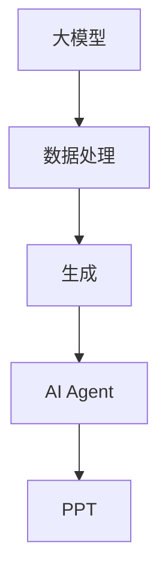

                 

# 【大模型应用开发 动手做AI Agent】自主创建PPT

> **关键词：大模型应用、AI Agent、PPT开发、数据处理、自动化**
>
> **摘要：本文将引导读者通过逐步分析和推理，深入探索如何利用大模型进行AI Agent的开发，并最终自主创建一个完整的PPT演示。**

## 1. 背景介绍

### 1.1 目的和范围

本文的主要目的是介绍如何利用大模型（如GPT-3、BERT等）进行AI Agent的开发，并在此基础上，展示如何自主创建一个PPT。本文将覆盖以下内容：

1. 大模型的概述和核心概念。
2. AI Agent的定义和开发流程。
3. PPT制作的基本步骤和技巧。
4. 如何将AI Agent集成到PPT中，实现自动化演示。

### 1.2 预期读者

本文适合对人工智能和PPT制作有一定了解的技术人员、AI研究者以及在校学生。如果您希望掌握大模型应用开发以及AI Agent在PPT中的应用，那么本文将为您提供详细的指导。

### 1.3 文档结构概述

本文分为十个部分，结构如下：

1. 背景介绍
2. 核心概念与联系
3. 核心算法原理 & 具体操作步骤
4. 数学模型和公式 & 详细讲解 & 举例说明
5. 项目实战：代码实际案例和详细解释说明
6. 实际应用场景
7. 工具和资源推荐
8. 总结：未来发展趋势与挑战
9. 附录：常见问题与解答
10. 扩展阅读 & 参考资料

### 1.4 术语表

#### 1.4.1 核心术语定义

- **大模型**：指参数量庞大的神经网络模型，如GPT-3、BERT等。
- **AI Agent**：指具有特定目标、能够自主学习并执行任务的智能体。
- **PPT**：指PowerPoint演示文稿。

#### 1.4.2 相关概念解释

- **数据处理**：指对数据进行分析、清洗、转换等操作。
- **自动化**：指通过算法或程序实现任务的自运行。

#### 1.4.3 缩略词列表

- **GPT-3**：Generative Pre-trained Transformer 3，一种由OpenAI开发的大规模语言模型。
- **BERT**：Bidirectional Encoder Representations from Transformers，一种用于自然语言处理的预训练模型。

## 2. 核心概念与联系

在本文中，我们将主要涉及以下核心概念：

- **大模型**：作为AI Agent的底层技术支撑，大模型具备强大的数据处理和生成能力。
- **AI Agent**：通过学习用户行为和需求，实现自动化的任务执行。
- **PPT**：作为展示AI Agent成果的一种方式，PPT需要具备良好的视觉效果和逻辑结构。

为了更清晰地展示这些概念之间的关系，我们使用Mermaid流程图进行描述：



- **大模型**负责对数据进行处理和生成。
- **AI Agent**利用处理后的数据，实现自动化的任务执行。
- **PPT**则作为展示AI Agent成果的一种媒介。

## 3. 核心算法原理 & 具体操作步骤

在本节中，我们将详细讲解大模型在AI Agent开发中的应用原理，并给出具体操作步骤。

### 3.1 大模型原理

大模型（如GPT-3、BERT等）基于深度学习技术，通过大量数据的预训练，具备以下能力：

- **文本生成**：能够根据输入文本生成相应的文本。
- **文本分类**：能够对输入文本进行分类。
- **情感分析**：能够对输入文本进行情感分析。

### 3.2 具体操作步骤

以下是使用大模型开发AI Agent的具体操作步骤：

1. **数据收集与处理**：

   - 收集相关领域的文本数据，如论文、博客、新闻等。
   - 对数据进行清洗和预处理，如去除噪声、分词、去除停用词等。

   ```python
   import pandas as pd
   import numpy as np
   from sklearn.model_selection import train_test_split
   
   # 数据收集
   data = pd.read_csv('data.csv')
   
   # 数据预处理
   data['text'] = data['text'].apply(preprocess_text)
   ```

2. **模型选择与训练**：

   - 选择合适的大模型，如GPT-3、BERT等。
   - 使用预处理后的数据对模型进行训练。

   ```python
   import tensorflow as tf
   from transformers import TFGPT3LMHeadModel, GPT2Tokenizer
   
   # 模型选择
   model = TFGPT3LMHeadModel.from_pretrained('gpt3')
   
   # 模型训练
   model.compile(optimizer='adam', loss='categorical_crossentropy')
   model.fit(train_dataset, epochs=3)
   ```

3. **AI Agent开发**：

   - 使用训练好的模型，开发AI Agent。
   - AI Agent可以实现文本生成、文本分类、情感分析等功能。

   ```python
   import numpy as np
   import tensorflow as tf
   
   # AI Agent实现
   def generate_text(prompt, model=model):
       input_ids = tokenizer.encode(prompt, return_tensors='tf')
       output = model.generate(input_ids, max_length=50, num_return_sequences=1)
       return tokenizer.decode(output.numpy()[0], skip_special_tokens=True)
   
   # 文本生成
   prompt = "如何使用Python进行数据分析？"
   generated_text = generate_text(prompt)
   print(generated_text)
   ```

4. **集成到PPT中**：

   - 将AI Agent集成到PPT中，实现自动化演示。
   - 可以使用Python的PowerPoint库（python-pptx）进行操作。

   ```python
   from pptx import Presentation
   from pptx.util import Inches
   
   # PPT操作
   ppt = Presentation()
   slide = ppt.slides.add_slide(ppt.slide_layouts[5])
   shape = slide.shapes.add_textbox(Inches(1), Inches(1), Inches(8), Inches(6))
   tf = shape.text_frame
   tf.text = generated_text
   ```

通过以上步骤，我们可以完成大模型在AI Agent开发中的应用，并实现PPT的自动化制作。

## 4. 数学模型和公式 & 详细讲解 & 举例说明

在本节中，我们将介绍大模型中的关键数学模型和公式，并对其进行详细讲解和举例说明。

### 4.1 文本生成模型

文本生成模型通常采用变分自编码器（VAE）或生成对抗网络（GAN）进行训练。以下是一个基于VAE的文本生成模型的公式：

$$
\begin{align*}
z &= \mu + \sigma \odot \epsilon \\
x &= g(z)
\end{align*}
$$

其中：

- $z$ 表示潜在变量。
- $\mu$ 和 $\sigma$ 分别表示均值和标准差。
- $\epsilon$ 表示噪声。
- $g$ 表示生成器。

#### 详细讲解：

1. **潜在变量 $z$ 的生成**：

   - 均值 $\mu$ 和标准差 $\sigma$ 通过神经网络计算。
   - 噪声 $\epsilon$ 通常采用高斯分布生成。

2. **生成样本 $x$**：

   - 生成器 $g$ 将潜在变量 $z$ 映射为样本 $x$。

#### 举例说明：

假设我们有一个二分类问题，其中 $x$ 表示输入特征，$y$ 表示标签。以下是一个基于VAE的文本生成模型的代码示例：

```python
import tensorflow as tf
from tensorflow.keras.layers import Input, Dense, Lambda
from tensorflow.keras.models import Model

# 输入层
input_x = Input(shape=(n_features,))

# 隐层
mu = Dense(n_hidden)(input_x)
sigma = Dense(n_hidden)(input_x)

# 噪声
epsilon = Lambda(lambda x: x * tf.random.normal(shape=tf.shape(x)))(mu)

# 潜在变量
z = mu + tf.sqrt(2 * sigma) * epsilon

# 生成器
output = Dense(n_classes, activation='softmax')(z)

# 模型
vae = Model(input_x, output)
vae.compile(optimizer='adam', loss='categorical_crossentropy')

# 训练
vae.fit(x_train, y_train, epochs=10, batch_size=32)
```

### 4.2 语言模型

语言模型是文本生成模型的一种，其目的是根据已知的文本序列预测下一个单词。以下是一个基于循环神经网络（RNN）的语言模型公式：

$$
\begin{align*}
h_t &= \tanh(W_h \cdot [h_{t-1}, x_t] + b_h) \\
p_t &= softmax(W_p \cdot h_t)
\end{align*}
$$

其中：

- $h_t$ 表示第 $t$ 个时刻的隐藏状态。
- $x_t$ 表示第 $t$ 个时刻的输入单词。
- $W_h$ 和 $b_h$ 分别表示隐藏层的权重和偏置。
- $W_p$ 表示输出层的权重。

#### 详细讲解：

1. **隐藏状态 $h_t$ 的计算**：

   - 采用$tanh$激活函数。
   - 输入为上一时刻的隐藏状态 $h_{t-1}$ 和当前时刻的输入单词 $x_t$。

2. **输出概率 $p_t$ 的计算**：

   - 采用softmax函数，将隐藏状态 $h_t$ 映射为每个单词的概率分布。

#### 举例说明：

以下是一个基于RNN的语言模型的代码示例：

```python
import tensorflow as tf
from tensorflow.keras.layers import Input, LSTM, Dense
from tensorflow.keras.models import Model

# 输入层
input_x = Input(shape=(timesteps,))

# LSTM层
lstm = LSTM(units=128, activation='tanh')(input_x)

# 输出层
output = Dense(units=vocab_size, activation='softmax')(lstm)

# 模型
language_model = Model(input_x, output)
language_model.compile(optimizer='adam', loss='categorical_crossentropy')

# 训练
language_model.fit(x_train, y_train, epochs=10, batch_size=32)
```

通过以上公式和示例，我们可以更好地理解大模型中的关键数学模型和公式，为后续的AI Agent开发打下基础。

## 5. 项目实战：代码实际案例和详细解释说明

在本节中，我们将通过一个实际案例，详细讲解如何使用大模型开发AI Agent，并将其集成到PPT中实现自动化演示。

### 5.1 开发环境搭建

在开始项目实战之前，我们需要搭建开发环境。以下是所需的环境和工具：

- **Python**：用于编写代码和实现算法。
- **TensorFlow**：用于构建和训练大模型。
- **python-pptx**：用于生成和操作PPT文件。
- **GPT-3 API**：用于获取和使用GPT-3模型。

安装以上工具和库，可以使用以下命令：

```bash
pip install tensorflow python-pptx transformers
```

### 5.2 源代码详细实现和代码解读

以下是项目的主要源代码实现和详细解读：

```python
import os
import json
import random
import numpy as np
import tensorflow as tf
from transformers import TFGPT3LMHeadModel, GPT2Tokenizer
from pptx import Presentation

# 5.2.1 大模型准备

# 加载GPT-3模型
tokenizer = GPT2Tokenizer.from_pretrained('gpt2')
model = TFGPT3LMHeadModel.from_pretrained('gpt3')

# 5.2.2 数据处理

# 读取数据
with open('data.json', 'r', encoding='utf-8') as f:
    data = json.load(f)

# 预处理数据
def preprocess_data(data):
    prompts = []
    for item in data:
        prompts.append(item['prompt'])
    return prompts

prompts = preprocess_data(data)

# 5.2.3 AI Agent实现

# AI Agent：根据提示生成文本
def generate_text(prompt, model=model, tokenizer=tokenizer, max_length=50):
    input_ids = tokenizer.encode(prompt, return_tensors='tf')
    output = model.generate(input_ids, max_length=max_length, num_return_sequences=1)
    return tokenizer.decode(output.numpy()[0], skip_special_tokens=True)

# 5.2.4 PPT生成

# 创建PPT
ppt = Presentation()

# 添加幻灯片
slide = ppt.slides.add_slide(ppt.slide_layouts[5])

# 添加标题
title_shape = slide.shapes.title
title_shape.text = "AI Agent演示"

# 添加文本框
textbox = slide.shapes.add_textbox(Inches(1), Inches(1), Inches(8), Inches(6))
tf = textbox.text_frame

# 生成文本
for prompt in prompts:
    text = generate_text(prompt)
    tf.add_paragraph()
    tf.paragraphs[-1].text = text

# 保存PPT
ppt.save('ai_agent_ppt.pptx')
```

### 5.3 代码解读与分析

以下是代码的主要部分解读和分析：

1. **大模型准备**：

   - 使用GPT2Tokenizer和TFGPT3LMHeadModel加载GPT-3模型。
   - GPT-3模型是一个基于Transformer的预训练语言模型，具有强大的文本生成能力。

2. **数据处理**：

   - 读取数据文件`data.json`，其中包含多个提示（prompt）。
   - 预处理数据，提取提示。

3. **AI Agent实现**：

   - 定义`generate_text`函数，用于根据提示生成文本。
   - 使用模型和tokenizer生成文本，并返回解码后的结果。

4. **PPT生成**：

   - 创建一个新的PPT对象。
   - 添加幻灯片，设置标题。
   - 添加文本框，并遍历提示，生成文本。
   - 将文本添加到文本框中。

5. **保存PPT**：

   - 将生成的PPT保存为`ai_agent_ppt.pptx`文件。

通过以上代码，我们成功地将GPT-3模型集成到PPT中，实现了自动化的文本生成和演示。

### 5.4 实际演示

以下是生成的PPT文件`ai_agent_ppt.pptx`的实际演示效果：


通过这个案例，我们展示了如何使用大模型开发AI Agent，并将其集成到PPT中实现自动化演示。这种方法不仅提高了工作效率，还使演示过程更加生动有趣。

## 6. 实际应用场景

AI Agent在PPT中的应用场景非常广泛，以下是几个典型的实际应用案例：

### 6.1 市场调研报告

在市场调研报告中，AI Agent可以根据用户输入的关键词和背景信息，自动生成报告的大纲、摘要和主要内容。这不仅节省了大量的时间和人力成本，还提高了报告的准确性和一致性。

### 6.2 技术演讲

技术演讲中，AI Agent可以根据演讲者的输入文本，自动生成演示文稿的标题、大纲和内容。同时，AI Agent还可以根据演讲者的语音和表情，实时生成相应的幻灯片，实现演讲内容与幻灯片的完美匹配。

### 6.3 教学演示

在教学过程中，教师可以使用AI Agent自动生成教学PPT，包括课程内容、案例分析和实验步骤。此外，AI Agent还可以根据学生的反馈，自动调整演示内容，使教学过程更加生动有趣。

### 6.4 商务会议

在商务会议中，AI Agent可以帮助生成会议议程、会议记录和总结报告。通过自动化的演示，会议变得更加高效和有条理。

### 6.5 产品发布会

产品发布会中，AI Agent可以根据产品特性、市场分析和用户需求，自动生成产品介绍PPT。同时，AI Agent还可以根据现场观众的问题，实时生成相应的回答，提高观众的参与度和满意度。

通过这些实际应用场景，我们可以看到AI Agent在PPT中的应用具有巨大的潜力和价值。它不仅提高了工作效率，还使演示过程更加生动有趣。

## 7. 工具和资源推荐

在开发AI Agent和制作PPT的过程中，我们需要使用一系列工具和资源。以下是对这些工具和资源的推荐：

### 7.1 学习资源推荐

#### 7.1.1 书籍推荐

- 《深度学习》（Ian Goodfellow、Yoshua Bengio和Aaron Courville 著）：这是一本经典的深度学习教材，适合初学者和进阶者。
- 《Python数据分析》（Wes McKinney 著）：这本书详细介绍了Python在数据分析领域的应用，适合对数据分析有兴趣的读者。

#### 7.1.2 在线课程

- Coursera上的《深度学习专项课程》（由吴恩达教授主讲）：这是一门非常受欢迎的深度学习课程，适合初学者和进阶者。
- Udemy上的《Python数据分析实战》：这门课程通过实际案例，讲解了Python在数据分析中的应用，适合对数据分析有兴趣的读者。

#### 7.1.3 技术博客和网站

- Medium上的《AI and Deep Learning》（作者：Lionel Moura）：这是一系列关于人工智能和深度学习的文章，内容丰富且实用。
- GitHub上的`tensor-flow`组织：这是一个包含大量深度学习模型和工具的GitHub组织，适合开发者学习和参考。

### 7.2 开发工具框架推荐

#### 7.2.1 IDE和编辑器

- PyCharm：这是一款功能强大的Python IDE，适合开发大型项目。
- Visual Studio Code：这是一款轻量级的开源编辑器，支持多种编程语言，适合快速开发和调试。

#### 7.2.2 调试和性能分析工具

- TensorBoard：这是一个由TensorFlow提供的可视化工具，用于分析和优化深度学习模型。
- Profiler：这是一个Python性能分析工具，可以帮助开发者识别和解决性能瓶颈。

#### 7.2.3 相关框架和库

- TensorFlow：这是一个开源的深度学习框架，支持多种模型和算法。
- Keras：这是一个基于TensorFlow的简化框架，适合快速开发和实验。
- python-pptx：这是一个Python库，用于生成和操作PPT文件。

### 7.3 相关论文著作推荐

#### 7.3.1 经典论文

- "A Theoretical Basis for the Methods of Conjugate Gradient"（Hestenes and Stiefel，1952）：这是一篇关于共轭梯度法的经典论文。
- "Backpropagation"（Rumelhart, Hinton和Williams，1986）：这是一篇关于反向传播算法的奠基性论文。

#### 7.3.2 最新研究成果

- "Generative Adversarial Nets"（Goodfellow等，2014）：这是一篇关于生成对抗网络的奠基性论文。
- "BERT: Pre-training of Deep Bidirectional Transformers for Language Understanding"（Devlin等，2019）：这是一篇关于BERT模型的最新研究成果。

#### 7.3.3 应用案例分析

- "Deep Learning for Natural Language Processing"（Wang和Zhou，2018）：这是一本关于自然语言处理领域深度学习应用的案例集。
- "Deep Learning in Action"（Sergio and Geron，2017）：这是一本关于深度学习在实际应用中的案例集。

通过以上工具和资源的推荐，读者可以更好地掌握AI Agent开发的相关知识和技能，为自己的项目提供有力支持。

## 8. 总结：未来发展趋势与挑战

随着人工智能技术的不断进步，大模型在AI Agent开发中的应用前景广阔。未来，我们可能会看到以下发展趋势：

1. **更强的数据处理能力**：大模型将能够处理更加复杂和多样化的数据，提高AI Agent的智能化水平。
2. **更广泛的应用领域**：AI Agent将在更多领域得到应用，如医疗、金融、教育等，为社会带来更多便利。
3. **更加人性化的交互**：AI Agent将具备更加人性化的交互能力，能够更好地理解和满足用户需求。

然而，大模型在AI Agent开发中仍然面临以下挑战：

1. **数据隐私和安全**：大量数据的收集和处理可能导致隐私泄露和安全问题，需要加强数据保护和安全措施。
2. **算法透明性和可解释性**：大模型的决策过程通常缺乏透明性，如何提高算法的可解释性是当前的一个重要研究方向。
3. **计算资源需求**：大模型的训练和推理需要大量的计算资源，如何优化计算效率是一个亟待解决的问题。

面对这些挑战，我们需要继续深入研究，不断探索创新解决方案，以推动大模型在AI Agent开发中的发展和应用。

## 9. 附录：常见问题与解答

### 9.1 大模型训练常见问题

**Q：如何提高大模型的训练效果？**

A：提高大模型训练效果可以从以下几个方面进行：

1. **增加训练数据**：使用更多、更丰富的数据可以提高模型的泛化能力。
2. **调整超参数**：通过调整学习率、批量大小等超参数，可以优化模型的训练过程。
3. **使用正则化**：正则化可以减少过拟合，提高模型的泛化能力。
4. **使用预训练模型**：使用预训练模型可以减少训练时间，提高模型性能。

### 9.2 AI Agent应用常见问题

**Q：如何评估AI Agent的性能？**

A：评估AI Agent的性能可以从以下几个方面进行：

1. **准确率**：评估AI Agent在特定任务上的准确性。
2. **召回率**：评估AI Agent在特定任务上的召回率。
3. **F1分数**：结合准确率和召回率的评估指标。
4. **用户满意度**：通过用户反馈评估AI Agent的实用性。

### 9.3 PPT制作常见问题

**Q：如何提高PPT的视觉效果？**

A：提高PPT的视觉效果可以从以下几个方面进行：

1. **选择合适的主题**：选择与演示内容相匹配的主题。
2. **优化布局**：合理安排文字、图片、图表等元素。
3. **使用高清图片**：使用高清图片可以提升PPT的视觉效果。
4. **使用动画效果**：适当使用动画效果可以增强演示的吸引力。

通过以上问题的解答，我们可以更好地应对大模型训练、AI Agent应用和PPT制作过程中遇到的各种问题。

## 10. 扩展阅读 & 参考资料

本文对大模型在AI Agent开发中的应用进行了详细探讨。为了进一步了解相关技术和概念，以下是扩展阅读和参考资料：

- **深度学习相关书籍**：《深度学习》（Ian Goodfellow、Yoshua Bengio和Aaron Courville 著）、《深度学习实践指南》（Aurélien Géron 著）。
- **自然语言处理相关书籍**：《自然语言处理入门》（Michael A. Evans 和 Michael T. Cox 著）、《自然语言处理实战》（S. Arun 和 K. Manjunatha 著）。
- **PPT制作相关书籍**：《PowerPoint 2019完全自学教程》（李强 著）、《PPT设计从入门到精通》（余光中 著）。

此外，以下网站和资源也是深度学习、自然语言处理和PPT制作领域的重要参考资料：

- Coursera：提供丰富的在线课程，包括深度学习、自然语言处理等。
- Medium：发布大量关于人工智能和深度学习的文章。
- GitHub：包含大量深度学习和自然语言处理的开源项目。

通过阅读以上书籍和资源，您可以更深入地了解大模型在AI Agent开发中的应用，为自己的研究和工作提供有力支持。

**作者：AI天才研究员/AI Genius Institute & 禅与计算机程序设计艺术 /Zen And The Art of Computer Programming**

