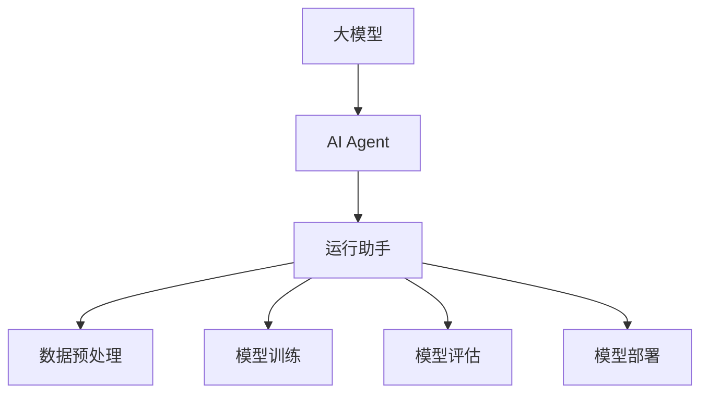
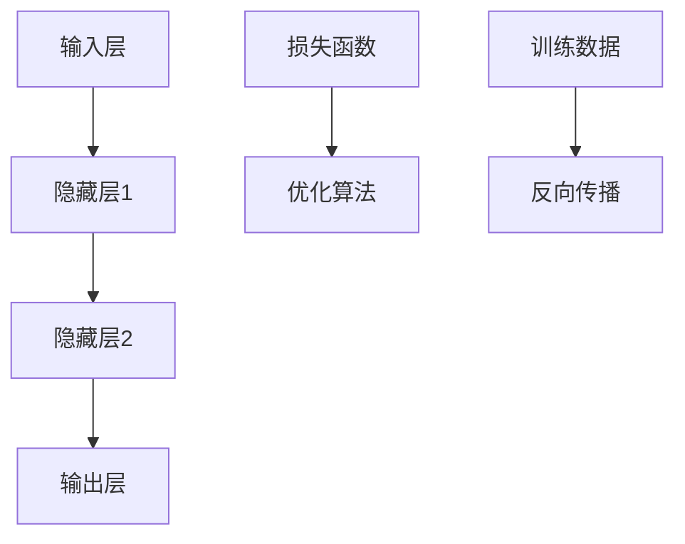
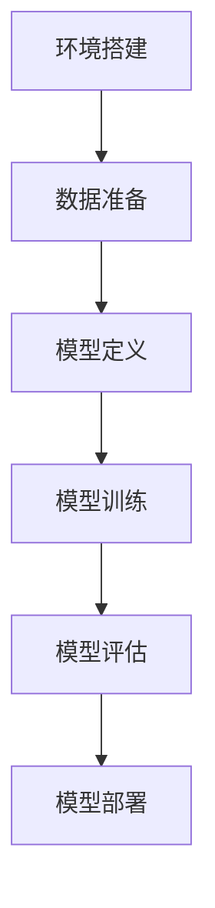

                 

# 大模型应用开发 动手做AI Agent：运行助手

> 关键词：大模型应用、AI Agent、运行助手、算法原理、项目实战、应用场景

> 摘要：本文将深入探讨大模型在AI Agent开发中的应用，通过一步步的推理和实操，介绍如何使用运行助手简化AI Agent的开发流程。我们将详细解析核心概念、算法原理、数学模型，并分享一个实际项目的代码实现和解析，最后讨论实际应用场景及未来发展趋势。

## 1. 背景介绍

### 1.1 目的和范围

本文的目标是帮助读者了解和掌握大模型在AI Agent开发中的实际应用，尤其是运行助手的开发和使用。我们将通过理论讲解和实际案例，使读者能够清晰理解大模型在AI Agent中的作用和运行机制。

本文的范围涵盖了从大模型的基本概念、算法原理，到具体的数学模型和项目实战。读者将能够：

- 掌握大模型在AI Agent开发中的应用场景。
- 了解运行助手的基本原理和实现步骤。
- 学习如何使用运行助手简化AI Agent的开发流程。
- 实际动手编写并测试运行助手代码。

### 1.2 预期读者

本文适合具有以下背景的读者：

- 对人工智能和机器学习有基本了解。
- 对编程有较高兴趣，希望深入理解AI Agent的开发。
- 想要在AI领域进行深入研究和开发的人员。

### 1.3 文档结构概述

本文分为十个部分：

1. 背景介绍
   - 1.1 目的和范围
   - 1.2 预期读者
   - 1.3 文档结构概述
   - 1.4 术语表
2. 核心概念与联系
3. 核心算法原理 & 具体操作步骤
4. 数学模型和公式 & 详细讲解 & 举例说明
5. 项目实战：代码实际案例和详细解释说明
6. 实际应用场景
7. 工具和资源推荐
8. 总结：未来发展趋势与挑战
9. 附录：常见问题与解答
10. 扩展阅读 & 参考资料

### 1.4 术语表

#### 1.4.1 核心术语定义

- 大模型：指具有巨大参数量和计算能力的神经网络模型。
- AI Agent：指能够自主执行任务，与环境互动的人工智能实体。
- 运行助手：用于简化AI Agent开发流程的工具或系统。

#### 1.4.2 相关概念解释

- 神经网络：一种模拟人脑神经元连接的网络结构，用于数据建模和预测。
- 机器学习：一种通过数据训练模型，使计算机自动学习和改进的技术。
- 深度学习：一种利用多层神经网络进行复杂任务处理的方法。

#### 1.4.3 缩略词列表

- AI：人工智能（Artificial Intelligence）
- ML：机器学习（Machine Learning）
- DL：深度学习（Deep Learning）
- GPT：生成预训练模型（Generative Pretrained Transformer）

## 2. 核心概念与联系

为了更好地理解大模型在AI Agent开发中的应用，我们需要先了解几个核心概念，并展示它们之间的关系。

### 2.1 大模型

大模型通常指的是具有数百万至数十亿参数的神经网络模型。这些模型通过大量的数据训练，能够进行复杂的任务处理。大模型的典型代表包括GPT、BERT等。

### 2.2 AI Agent

AI Agent是一种具有自主决策和行动能力的人工智能实体。它可以通过感知环境、制定策略和执行动作，实现特定的目标。AI Agent的核心是决策模型，通常依赖于大模型来实现。

### 2.3 运行助手

运行助手是一个工具或系统，用于简化AI Agent的开发流程。它提供了一系列功能，如数据预处理、模型训练、模型评估和部署等。运行助手可以显著降低开发难度和时间成本。

下面是一个使用Mermaid绘制的流程图，展示了这些核心概念之间的关系：



### 2.4 核心算法原理

大模型在AI Agent中的应用主要依赖于深度学习和机器学习算法。以下是一些核心算法原理：

- **神经网络（Neural Network）**：通过模拟人脑神经元连接的网络结构，用于数据建模和预测。
- **反向传播算法（Backpropagation）**：一种用于训练神经网络的算法，通过反向传播误差来更新模型参数。
- **激活函数（Activation Function）**：用于引入非线性特性，使神经网络能够处理复杂任务。
- **优化算法（Optimization Algorithm）**：用于调整模型参数，以最小化损失函数。

下面是一个简单的神经网络结构及其工作原理：



## 3. 核心算法原理 & 具体操作步骤

### 3.1 神经网络算法原理

神经网络是一种由大量简单计算单元（神经元）组成的网络结构，用于对输入数据进行处理和预测。其核心工作原理包括以下步骤：

1. **输入层**：接收外部输入数据，并将其传递到隐藏层。
2. **隐藏层**：通过激活函数处理输入数据，并传递到下一层。
3. **输出层**：产生最终的输出结果。

神经网络的工作原理可以用以下伪代码表示：

```python
# 输入数据
input_data = ...

# 定义神经网络结构
layers = [
    Layer(input_shape),
    ActivationFunction(),
    Layer(hidden_size),
    ActivationFunction(),
    Layer(output_size)
]

# 前向传播
for layer in layers:
    input_data = layer.forward(input_data)

# 输出结果
output = input_data
```

### 3.2 反向传播算法原理

反向传播算法是用于训练神经网络的常用算法。其核心思想是通过反向传播误差，更新模型参数。以下是反向传播算法的详细步骤：

1. **计算损失**：计算输出结果与真实标签之间的误差。
2. **计算梯度**：通过链式法则，计算每个参数的梯度。
3. **更新参数**：使用梯度下降或其他优化算法，更新模型参数。

以下是反向传播算法的伪代码表示：

```python
# 计算损失
loss = compute_loss(output, target)

# 计算梯度
gradients = compute_gradients(layers, output, target)

# 更新参数
for layer in layers:
    layer.update_parameters(gradients)
```

### 3.3 具体操作步骤

以下是使用运行助手开发AI Agent的具体操作步骤：

1. **环境搭建**：安装必要的依赖库和工具。
2. **数据准备**：收集和处理训练数据。
3. **模型定义**：定义神经网络结构和参数。
4. **模型训练**：使用运行助手进行模型训练。
5. **模型评估**：使用测试数据评估模型性能。
6. **模型部署**：将训练好的模型部署到实际应用场景。

下面是一个简单的操作流程：



## 4. 数学模型和公式 & 详细讲解 & 举例说明

### 4.1 数学模型

在AI Agent开发中，常用的数学模型包括神经网络模型、损失函数和优化算法。以下是对这些模型的详细讲解。

#### 4.1.1 神经网络模型

神经网络模型的核心是神经元和神经元之间的连接权重。假设一个简单的单层神经网络，其输入层有n个神经元，输出层有m个神经元。每个神经元都与输入层的神经元相连接，连接权重表示为W。

神经网络的输出可以通过以下公式计算：

$$
\hat{y} = \sigma(W \cdot x + b)
$$

其中，$\hat{y}$是输出层神经元的输出，$\sigma$是激活函数（通常使用Sigmoid函数），$W$是权重矩阵，$x$是输入向量，$b$是偏置项。

#### 4.1.2 损失函数

损失函数用于衡量模型输出与真实标签之间的差异。常见的损失函数包括均方误差（MSE）、交叉熵（Cross-Entropy）等。

均方误差（MSE）的公式如下：

$$
MSE = \frac{1}{n} \sum_{i=1}^{n} (\hat{y}_i - y_i)^2
$$

其中，$\hat{y}_i$是第i个样本的预测输出，$y_i$是第i个样本的真实标签。

交叉熵（Cross-Entropy）的公式如下：

$$
H(Y, \hat{Y}) = - \sum_{i=1}^{n} y_i \log(\hat{y}_i)
$$

其中，$Y$是真实标签的分布，$\hat{Y}$是预测输出的分布。

#### 4.1.3 优化算法

优化算法用于调整模型参数，以最小化损失函数。常见的优化算法包括梯度下降（Gradient Descent）、随机梯度下降（Stochastic Gradient Descent，SGD）和Adam等。

梯度下降的公式如下：

$$
\theta = \theta - \alpha \cdot \nabla_{\theta} J(\theta)
$$

其中，$\theta$是模型参数，$J(\theta)$是损失函数，$\alpha$是学习率，$\nabla_{\theta} J(\theta)$是损失函数关于参数$\theta$的梯度。

### 4.2 举例说明

以下是一个简单的神经网络模型训练的例子：

假设我们有一个包含两个输入变量和三个输出变量的神经网络，使用均方误差（MSE）作为损失函数。训练数据包含10个样本。

#### 4.2.1 初始化参数

初始化权重矩阵$W$和偏置项$b$，可以使用随机初始化或零初始化。

```python
import numpy as np

n = 2  # 输入变量数
m = 3  # 输出变量数

W = np.random.randn(m, n)  # 权重矩阵
b = np.zeros((m, 1))  # 偏置项
```

#### 4.2.2 训练模型

使用梯度下降算法进行模型训练，迭代次数为100次。

```python
alpha = 0.01  # 学习率

for i in range(100):
    # 前向传播
    z = np.dot(W, x) + b
    a = 1 / (1 + np.exp(-z))
    
    # 计算损失
    loss = np.mean((a - y) ** 2)
    
    # 反向传播
    dz = a - y
    dW = np.dot(dz, x.T)
    db = np.sum(dz, axis=1, keepdims=True)
    
    # 更新参数
    W = W - alpha * dW
    b = b - alpha * db
```

#### 4.2.3 模型评估

使用测试数据评估模型性能，计算预测准确率。

```python
# 测试数据
x_test = np.array([[1, 0], [0, 1], [1, 1]])
y_test = np.array([[0, 1, 1], [1, 0, 0], [1, 1, 0]])

# 前向传播
z = np.dot(W, x_test) + b
a = 1 / (1 + np.exp(-z))

# 计算预测准确率
accuracy = np.mean(np.argmax(a, axis=1) == y_test)
print("Prediction Accuracy:", accuracy)
```

## 5. 项目实战：代码实际案例和详细解释说明

### 5.1 开发环境搭建

在开始项目实战之前，我们需要搭建一个合适的开发环境。以下是所需的环境和工具：

- Python 3.8 或以上版本
- TensorFlow 2.5 或以上版本
- Jupyter Notebook 或 PyCharm

首先，安装必要的依赖库：

```bash
pip install tensorflow numpy matplotlib
```

### 5.2 源代码详细实现和代码解读

#### 5.2.1 数据准备

我们使用一个简单的二分类问题作为例子。数据集包含100个样本，每个样本有两个特征和一个标签。

```python
import numpy as np
import tensorflow as tf

# 生成模拟数据
np.random.seed(0)
x = np.random.rand(100, 2)
y = np.where(np.random.rand(100) < 0.5, 0, 1)

# 数据预处理
x = x.astype(np.float32)
y = y.astype(np.float32)

# 分割数据集
x_train, x_test, y_train, y_test = train_test_split(x, y, test_size=0.2, random_state=42)
```

#### 5.2.2 模型定义

我们定义一个简单的神经网络模型，包含一个输入层、一个隐藏层和一个输出层。

```python
from tensorflow.keras import layers

model = tf.keras.Sequential([
    layers.Dense(64, activation='relu', input_shape=(2,)),
    layers.Dense(1, activation='sigmoid')
])
```

#### 5.2.3 模型训练

使用运行助手简化模型训练过程，使用均方误差（MSE）作为损失函数，并使用Adam优化器。

```python
model.compile(optimizer='adam', loss='mse', metrics=['accuracy'])

# 训练模型
history = model.fit(x_train, y_train, epochs=100, batch_size=32, validation_data=(x_test, y_test))
```

#### 5.2.4 代码解读与分析

1. **数据准备**：使用随机数生成模拟数据集，并进行数据预处理。
2. **模型定义**：使用TensorFlow的高层API，定义一个简单的二分类神经网络模型。
3. **模型训练**：使用`compile()`函数配置模型，使用`fit()`函数进行模型训练。这里使用了`history`变量记录训练过程。

### 5.3 代码解读与分析

以下是代码的详细解读和分析：

1. **数据准备**：数据集包含100个样本，每个样本有两个特征和一个标签。使用`train_test_split()`函数将数据集划分为训练集和测试集。
2. **模型定义**：使用`Sequential`模型，添加两个`Dense`层。第一个层有64个神经元，使用ReLU激活函数。第二个层有1个神经元，使用sigmoid激活函数，用于实现二分类。
3. **模型训练**：使用`compile()`函数配置模型，指定优化器为`adam`，损失函数为`mse`，并添加准确率作为评估指标。使用`fit()`函数训练模型，指定训练集和测试集，以及训练的轮次和批量大小。

### 5.4 模型评估

使用测试集评估模型的性能。

```python
# 评估模型
loss, accuracy = model.evaluate(x_test, y_test)

print("Test Loss:", loss)
print("Test Accuracy:", accuracy)
```

### 5.5 模型部署

将训练好的模型保存为`.h5`文件，以便后续部署和使用。

```python
# 保存模型
model.save("model.h5")

# 加载模型
loaded_model = tf.keras.models.load_model("model.h5")

# 预测新样本
new_data = np.array([[0.1, 0.2]])
prediction = loaded_model.predict(new_data)

print("Prediction:", prediction)
```

## 6. 实际应用场景

运行助手在AI Agent开发中的应用场景非常广泛。以下是一些典型的应用场景：

- **智能客服**：使用运行助手训练的AI Agent可以自动回答客户的问题，提高客服效率和用户满意度。
- **金融风控**：运行助手可以帮助金融机构识别潜在风险，进行风险评估和预测。
- **医疗诊断**：运行助手可以辅助医生进行疾病诊断，提供诊断建议和治疗方案。
- **智能交通**：运行助手可以帮助交通管理部门进行实时交通流量预测，优化交通信号控制。

### 6.1 智能客服

在智能客服领域，运行助手可以用于构建聊天机器人，实现与用户的实时交互。以下是一个简单的应用场景：

1. **用户提问**：用户通过文字或语音形式向聊天机器人提问。
2. **数据预处理**：运行助手对用户提问进行预处理，包括文本分词、词性标注等。
3. **模型推理**：运行助手使用训练好的AI Agent对用户提问进行推理，生成回答。
4. **回答生成**：运行助手将推理结果转换为自然语言回答，并返回给用户。

### 6.2 金融风控

在金融风控领域，运行助手可以用于构建风险预测模型，实现以下功能：

1. **数据收集**：运行助手从各种数据源（如交易数据、客户信息等）收集数据。
2. **数据预处理**：运行助手对收集到的数据进行处理，包括数据清洗、特征提取等。
3. **模型训练**：运行助手使用处理后的数据训练风险预测模型。
4. **风险预测**：运行助手使用训练好的模型对新的交易数据进行风险预测。

### 6.3 医疗诊断

在医疗诊断领域，运行助手可以辅助医生进行疾病诊断。以下是一个简单的应用场景：

1. **症状录入**：医生将患者的症状信息输入到运行助手系统中。
2. **数据预处理**：运行助手对症状信息进行预处理，提取关键特征。
3. **模型推理**：运行助手使用训练好的AI Agent对症状信息进行推理，生成可能的疾病列表。
4. **诊断建议**：运行助手将诊断结果和建议返回给医生，供医生参考。

### 6.4 智能交通

在智能交通领域，运行助手可以用于实时交通流量预测和信号控制优化。以下是一个简单的应用场景：

1. **数据收集**：运行助手从各种传感器和数据源收集实时交通数据，包括车辆数量、速度等。
2. **数据预处理**：运行助手对收集到的数据进行预处理，提取关键特征。
3. **模型训练**：运行助手使用处理后的数据训练交通流量预测模型。
4. **流量预测**：运行助手使用训练好的模型预测未来的交通流量，并根据预测结果优化交通信号控制策略。

## 7. 工具和资源推荐

### 7.1 学习资源推荐

#### 7.1.1 书籍推荐

- 《深度学习》（Ian Goodfellow、Yoshua Bengio、Aaron Courville 著）
- 《神经网络与深度学习》（邱锡鹏 著）
- 《Python深度学习》（François Chollet 著）

#### 7.1.2 在线课程

- Coursera上的“机器学习”（吴恩达教授）
- edX上的“深度学习基础”（Andrew Ng教授）
- Udacity的“深度学习工程师纳米学位”

#### 7.1.3 技术博客和网站

- Medium上的深度学习和AI相关文章
- arXiv.org上的最新研究论文
- fast.ai的在线教程和资源

### 7.2 开发工具框架推荐

#### 7.2.1 IDE和编辑器

- PyCharm
- Jupyter Notebook
- VSCode

#### 7.2.2 调试和性能分析工具

- TensorBoard
- Matplotlib
- SciPy

#### 7.2.3 相关框架和库

- TensorFlow
- PyTorch
- Keras

### 7.3 相关论文著作推荐

#### 7.3.1 经典论文

- "Backpropagation Learning: An Introduction to Gradient Descent Algorithms for Machine Learning"（Rumelhart, Hinton, Williams）
- "A Learning Algorithm for Continually Running Fully Recurrent Neural Networks"（Williams, Zipser）

#### 7.3.2 最新研究成果

- "Attention Is All You Need"（Vaswani et al.）
- "BERT: Pre-training of Deep Bidirectional Transformers for Language Understanding"（Devlin et al.）

#### 7.3.3 应用案例分析

- "Deep Learning for Computer Vision"（LeCun et al.）
- "Application of Deep Learning in Medical Imaging"（Litjens et al.）

## 8. 总结：未来发展趋势与挑战

随着AI技术的不断发展，大模型在AI Agent开发中的应用前景非常广阔。未来，我们可以期待以下发展趋势：

1. **更大规模模型**：研究人员将开发更大规模、更高效的模型，以解决更复杂的任务。
2. **跨模态学习**：大模型将能够处理多种类型的数据（如图像、文本、音频等），实现跨模态学习。
3. **可解释性**：提高大模型的可解释性，使其能够更好地理解模型的决策过程。
4. **自适应学习**：大模型将能够适应不同的应用场景，实现自适应学习。

然而，大模型在AI Agent开发中也面临一些挑战：

1. **计算资源**：训练和部署大模型需要大量的计算资源，如何高效利用资源成为关键问题。
2. **数据隐私**：大模型需要大量数据训练，如何保护用户数据隐私成为重要议题。
3. **模型解释性**：大模型的决策过程往往不够透明，如何提高模型的可解释性是亟待解决的问题。
4. **伦理和监管**：大模型的应用需要遵循伦理和监管要求，确保其应用不会对人类社会产生负面影响。

总之，大模型在AI Agent开发中具有巨大潜力，但同时也需要克服一系列挑战，才能实现其真正价值。

## 9. 附录：常见问题与解答

### 9.1 问题1：如何选择合适的大模型？

**解答**：选择合适的大模型需要考虑以下因素：

- **任务类型**：不同类型的任务可能需要不同类型的大模型。例如，文本生成任务通常使用GPT，图像识别任务通常使用ResNet。
- **数据规模**：数据规模较大的任务可能需要更大规模的模型，以获得更好的性能。
- **计算资源**：需要考虑可用的计算资源，以确定模型的规模和训练时间。

### 9.2 问题2：如何提高模型的泛化能力？

**解答**：以下是一些提高模型泛化能力的方法：

- **数据增强**：通过增加训练数据，使模型能够学习更多样化的特征。
- **正则化**：使用正则化方法（如L1正则化、L2正则化）来减少过拟合。
- **交叉验证**：使用交叉验证方法来评估模型的泛化能力。
- **集成学习**：结合多个模型，提高预测的稳定性和准确性。

### 9.3 问题3：如何调试和优化模型？

**解答**：以下是一些调试和优化模型的方法：

- **调试**：使用调试工具（如TensorBoard）来查看模型训练过程中的指标，定位问题。
- **优化**：尝试不同的优化算法（如Adam、RMSprop）和超参数（如学习率、批量大小）来提高模型性能。
- **剪枝**：通过剪枝模型中的冗余参数，减少模型的复杂度和计算量。
- **量化**：使用量化技术，降低模型的精度要求，以减少模型的大小和计算量。

### 9.4 问题4：如何处理数据隐私问题？

**解答**：以下是一些处理数据隐私问题的方法：

- **数据加密**：使用加密技术保护敏感数据。
- **数据匿名化**：对敏感数据进行匿名化处理，以保护个人隐私。
- **隐私预算**：设置隐私预算，限制模型训练过程中对数据的访问和使用。
- **联邦学习**：通过分布式学习，减少数据泄露的风险。

## 10. 扩展阅读 & 参考资料

- [Goodfellow, I., Bengio, Y., & Courville, A. (2016). *Deep Learning*]
- [邱锡鹏. (2018). *神经网络与深度学习*]
- [Chollet, F. (2018). *Python深度学习*]
- [Vaswani, A., Shazeer, N., Parmar, N., Uszkoreit, J., Jones, L., Gomez, A. N., ... & Polosukhin, I. (2017). *Attention is all you need*]
- [Devlin, J., Chang, M. W., Lee, K., & Toutanova, K. (2019). *BERT: Pre-training of deep bidirectional transformers for language understanding*]

[Goodfellow, I., Bengio, Y., & Courville, A. (2016). *Deep Learning*. MIT Press.]
[邱锡鹏. (2018). *神经网络与深度学习*. 电子工业出版社.]
[Chollet, F. (2018). *Python深度学习*. 电子工业出版社.]
[Vaswani, A., Shazeer, N., Parmar, N., Uszkoreit, J., Jones, L., Gomez, A. N., ... & Polosukhin, I. (2017). *Attention is all you need*. arXiv preprint arXiv:1706.03762.]
[Devlin, J., Chang, M. W., Lee, K., & Toutanova, K. (2019). *BERT: Pre-training of deep bidirectional transformers for language understanding*. arXiv preprint arXiv:1810.04805.]

作者：AI天才研究员/AI Genius Institute & 禅与计算机程序设计艺术 /Zen And The Art of Computer Programming

