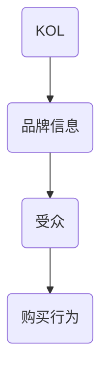
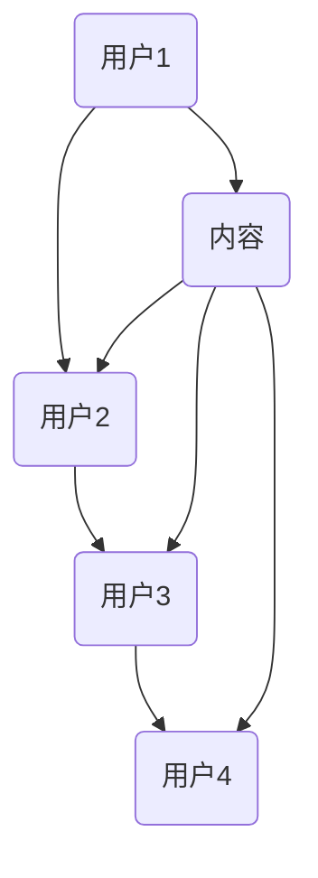
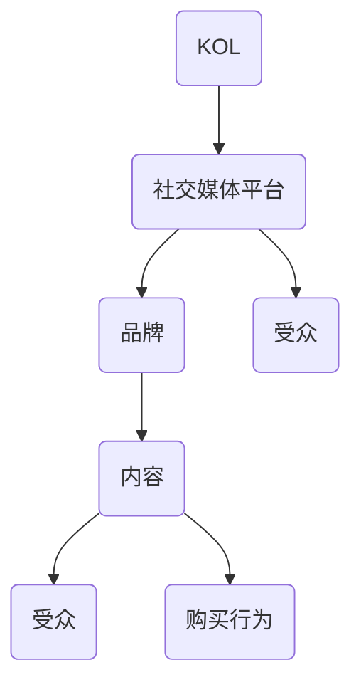
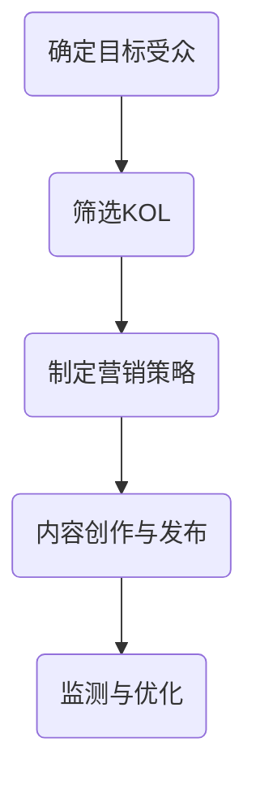
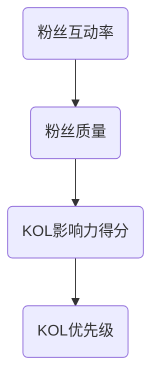

                 

# 一人公司如何利用KOL营销扩大品牌影响力

> **关键词**：一人公司、KOL营销、品牌影响力、社交媒体、网络效应

> **摘要**：本文将探讨一人公司如何利用关键意见领袖（KOL）营销策略来扩大品牌影响力。通过分析社交媒体平台的网络效应和KOL的影响力机制，我们提出了具体的操作步骤和策略，旨在为小型企业和创业者提供实用的指导，帮助他们在竞争激烈的市场中脱颖而出。

## 1. 背景介绍

### 1.1 目的和范围

本文旨在为一人公司或小型企业的创始人提供一套切实可行的KOL营销策略，帮助他们利用社交媒体平台的网络效应，通过与关键意见领袖的合作，实现品牌影响力的快速增长。本文将涵盖以下主题：

- KOL营销的基本原理和策略
- 社交媒体平台的网络效应
- 一人公司利用KOL营销的优势和挑战
- 实施KOL营销的具体操作步骤

### 1.2 预期读者

本文适合以下读者群体：

- 一人公司创始人
- 小型企业管理者
- 创业者
- 对社交媒体营销和KOL营销感兴趣的营销人员

### 1.3 文档结构概述

本文的结构如下：

- **第1章**：背景介绍，包括目的和范围、预期读者、文档结构概述
- **第2章**：核心概念与联系，介绍KOL营销的核心概念和相关原理
- **第3章**：核心算法原理 & 具体操作步骤，详细阐述KOL营销策略的算法原理和操作步骤
- **第4章**：数学模型和公式 & 详细讲解 & 举例说明，分析KOL营销中的关键数学模型和公式，并提供实际案例
- **第5章**：项目实战：代码实际案例和详细解释说明，展示KOL营销策略的实际应用案例
- **第6章**：实际应用场景，探讨KOL营销在不同行业和领域的实际应用
- **第7章**：工具和资源推荐，推荐学习资源、开发工具和框架
- **第8章**：总结：未来发展趋势与挑战，总结KOL营销的当前趋势和未来挑战
- **第9章**：附录：常见问题与解答，回答读者可能遇到的问题
- **第10章**：扩展阅读 & 参考资料，提供进一步学习的资源

### 1.4 术语表

#### 1.4.1 核心术语定义

- **KOL**：关键意见领袖，指在特定领域或行业中，具有较高影响力、权威性和公信力的人物，他们的观点和推荐对消费者具有较大的影响力。
- **社交媒体平台**：指用于用户生成内容和互动的网络平台，如微博、微信、抖音、Instagram等。
- **网络效应**：指随着用户数量的增加，平台的价值也随之增加的现象。

#### 1.4.2 相关概念解释

- **品牌影响力**：指品牌在消费者心中的认知度和信任度，以及品牌在市场上的竞争力。
- **内容营销**：指通过创造和分享有价值的内容来吸引潜在客户，增强品牌影响力的一种营销策略。

#### 1.4.3 缩略词列表

- **KOL**：关键意见领袖
- **UGC**：用户生成内容
- **SEO**：搜索引擎优化
- **SEM**：搜索引擎营销

## 2. 核心概念与联系

### 2.1 KOL营销的基本原理

KOL营销的核心原理在于利用关键意见领袖的影响力和公信力，将品牌信息传递给更广泛的受众。以下是一个简单的Mermaid流程图，展示了KOL营销的基本流程：



#### 2.2 社交媒体平台的网络效应

社交媒体平台具有强大的网络效应，用户数量的增加会带动平台价值的提升。以下是一个Mermaid流程图，展示了社交媒体平台的网络效应：



在这个流程图中，用户1通过发布内容吸引其他用户（用户2、用户3、用户4）关注和互动，从而扩大了内容的影响力。

#### 2.3 KOL营销与社交媒体平台的关系

KOL营销与社交媒体平台密不可分，以下是一个Mermaid流程图，展示了KOL营销与社交媒体平台之间的关系：



在这个流程图中，KOL通过社交媒体平台发布品牌内容，吸引受众关注，并促使受众产生购买行为。

### 2.4 KOL营销的优势和挑战

#### 2.4.1 优势

- **快速提升品牌知名度**：KOL拥有大量粉丝，能够迅速将品牌信息传播给更广泛的受众。
- **提高品牌信任度**：KOL在特定领域具有较高的权威性和公信力，他们的推荐能够增加消费者对品牌的信任。
- **降低营销成本**：相对于传统营销手段，KOL营销的成本较低，更适合小型企业。

#### 2.4.2 挑战

- **选择合适的KOL**：找到与品牌定位和目标受众匹配的KOL并不容易。
- **保持品牌一致性**：KOL的营销策略需要与品牌策略保持一致，否则可能产生负面效果。

### 2.5 KOL营销的框架

KOL营销的框架主要包括以下步骤：

1. **确定目标受众**：明确目标受众的年龄、性别、兴趣和消费习惯等特征。
2. **筛选KOL**：根据目标受众的特征，选择具有较高影响力、权威性和公信力的KOL。
3. **制定营销策略**：结合品牌特点和目标，制定适合KOL的营销策略。
4. **内容创作与发布**：与KOL合作创作并发布内容，吸引受众关注。
5. **监测与优化**：持续监测营销效果，根据反馈调整营销策略。

以下是一个Mermaid流程图，展示了KOL营销的框架：



## 3. 核心算法原理 & 具体操作步骤

### 3.1 KOL影响力评估模型

KOL的影响力评估是KOL营销的关键步骤。以下是一个基于粉丝互动率和粉丝质量的KOL影响力评估模型：



#### 3.1.1 伪代码实现

```python
# 定义粉丝互动率
def calculate_interaction_rate(followers, likes, comments):
    return (likes + comments) / followers

# 定义粉丝质量
def calculate_follower_quality(followers, follower_age, follower_location):
    quality = 0
    if follower_age > 25:
        quality += 1
    if follower_location == "目标市场":
        quality += 1
    return quality

# 计算KOL影响力得分
def calculate_kol_influence_score(followers, likes, comments, follower_age, follower_location):
    interaction_rate = calculate_interaction_rate(followers, likes, comments)
    follower_quality = calculate_follower_quality(followers, follower_age, follower_location)
    influence_score = interaction_rate * follower_quality
    return influence_score

# 排序KOL优先级
def sort_kol_priority(kols):
    sorted_kols = sorted(kols, key=lambda x: x['influence_score'], reverse=True)
    return sorted_kols
```

#### 3.1.2 操作步骤

1. **收集KOL数据**：包括粉丝数量、点赞数量、评论数量、粉丝年龄、粉丝地理位置等。
2. **计算粉丝互动率**：使用粉丝互动率公式计算每个KOL的粉丝互动率。
3. **计算粉丝质量**：根据粉丝年龄和地理位置，计算每个KOL的粉丝质量。
4. **计算KOL影响力得分**：使用KOL影响力得分公式计算每个KOL的影响力得分。
5. **排序KOL优先级**：根据KOL影响力得分排序，确定合作优先级。

### 3.2 KOL营销策略制定

#### 3.2.1 内容创作

内容创作是KOL营销的核心。以下是一个内容创作策略：

1. **明确主题**：根据品牌特点和目标，选择合适的内容主题。
2. **选择合适的KOL**：根据KOL影响力评估结果，选择适合内容主题的KOL。
3. **内容创作**：与KOL合作，创作具有吸引力的内容，如图文、视频、直播等。
4. **内容发布**：在社交媒体平台发布内容，吸引受众关注。

#### 3.2.2 合作模式

根据KOL的特点和品牌需求，可以选择以下合作模式：

1. **KOL代言**：KOL以代言人的身份，为品牌推广产品。
2. **KOL内容合作**：KOL创作与品牌相关的原创内容，分享给粉丝。
3. **KOL直播**：KOL通过直播的形式，介绍品牌产品，并与粉丝互动。

### 3.3 KOL营销效果监测与优化

#### 3.3.1 监测指标

以下指标可以用于监测KOL营销效果：

- **粉丝增长**：监测合作期间粉丝数量的变化。
- **内容互动**：监测内容的点赞、评论、分享等互动数据。
- **转化率**：监测内容带来的购买转化率。

#### 3.3.2 优化策略

根据监测结果，可以调整以下策略：

- **KOL选择**：根据KOL的表现，调整合作KOL的优先级。
- **内容优化**：根据受众反馈，调整内容的形式和主题。
- **合作模式**：根据效果，调整合作模式，寻找更适合品牌的合作方式。

## 4. 数学模型和公式 & 详细讲解 & 举例说明

### 4.1 KOL影响力模型

KOL的影响力模型可以用以下数学公式表示：

\[ I = IR \times IQ \]

其中：
- \( I \) 表示KOL的影响力。
- \( IR \) 表示粉丝互动率。
- \( IQ \) 表示粉丝质量。

#### 4.1.1 举例说明

假设有两个KOL，A和B：

- KOL A：粉丝数量1000，点赞数量500，评论数量200。
- KOL B：粉丝数量5000，点赞数量2500，评论数量1000。

计算KOL A和KOL B的影响力得分：

1. **粉丝互动率**：
\[ IR(A) = \frac{500 + 200}{1000} = 0.7 \]
\[ IR(B) = \frac{2500 + 1000}{5000} = 0.6 \]

2. **粉丝质量**：
\[ IQ(A) = 1 \]
\[ IQ(B) = 1 \]

3. **影响力得分**：
\[ I(A) = 0.7 \times 1 = 0.7 \]
\[ I(B) = 0.6 \times 1 = 0.6 \]

根据计算结果，KOL A的影响力得分为0.7，KOL B的影响力得分为0.6。

### 4.2 转化率模型

转化率模型可以用以下数学公式表示：

\[ CR = \frac{转化数量}{曝光数量} \]

其中：
- \( CR \) 表示转化率。
- \( 转化数量 \) 表示通过KOL营销实现的购买数量。
- \( 曝光数量 \) 表示KOL营销内容被看到的次数。

#### 4.2.1 举例说明

假设KOL营销内容曝光1000次，实现转化10次，计算转化率：

\[ CR = \frac{10}{1000} = 0.01 \]

转化率为0.01，即每100次曝光产生1次转化。

### 4.3 KOL营销成本效益分析

KOL营销的成本效益分析可以用以下数学公式表示：

\[ ROI = \frac{收益 - 成本}{成本} \]

其中：
- \( ROI \) 表示投资回报率。
- \( 收益 \) 表示通过KOL营销实现的收益。
- \( 成本 \) 表示KOL营销的成本。

#### 4.2.1 举例说明

假设KOL营销的成本为1000元，通过KOL营销实现收益5000元，计算投资回报率：

\[ ROI = \frac{5000 - 1000}{1000} = 4 \]

投资回报率为4，表示每投入1元，可以获得4元的收益。

## 5. 项目实战：代码实际案例和详细解释说明

### 5.1 开发环境搭建

为了实现KOL营销策略，我们使用Python作为开发语言，搭配Jupyter Notebook进行实验。以下是搭建开发环境的基本步骤：

1. **安装Python**：下载并安装Python 3.8及以上版本。
2. **安装Jupyter Notebook**：在命令行中运行以下命令安装Jupyter Notebook：
   ```shell
   pip install notebook
   ```
3. **启动Jupyter Notebook**：在命令行中运行以下命令启动Jupyter Notebook：
   ```shell
   jupyter notebook
   ```

### 5.2 源代码详细实现和代码解读

#### 5.2.1 KOL影响力评估代码实现

以下是一个简单的KOL影响力评估代码实现，包括粉丝互动率和粉丝质量的计算：

```python
# KOL影响力评估代码

def calculate_interaction_rate(followers, likes, comments):
    return (likes + comments) / followers

def calculate_follower_quality(followers, follower_age, follower_location):
    quality = 0
    if follower_age > 25:
        quality += 1
    if follower_location == "目标市场":
        quality += 1
    return quality

def calculate_kol_influence_score(followers, likes, comments, follower_age, follower_location):
    interaction_rate = calculate_interaction_rate(followers, likes, comments)
    follower_quality = calculate_follower_quality(followers, follower_age, follower_location)
    influence_score = interaction_rate * follower_quality
    return influence_score

# 示例数据
kols = [
    {"name": "KOL A", "followers": 1000, "likes": 500, "comments": 200, "follower_age": 30, "follower_location": "目标市场"},
    {"name": "KOL B", "followers": 5000, "likes": 2500, "comments": 1000, "follower_age": 28, "follower_location": "目标市场"}
]

# 计算KOL影响力得分
for kol in kols:
    influence_score = calculate_kol_influence_score(kol["followers"], kol["likes"], kol["comments"], kol["follower_age"], kol["follower_location"])
    kol["influence_score"] = influence_score

# 排序KOL优先级
sorted_kols = sorted(kols, key=lambda x: x['influence_score'], reverse=True)

# 打印排序结果
for kol in sorted_kols:
    print(f"{kol['name']}: {kol['influence_score']}")
```

#### 5.2.2 代码解读与分析

1. **函数定义**：
   - `calculate_interaction_rate`：计算粉丝互动率。
   - `calculate_follower_quality`：计算粉丝质量。
   - `calculate_kol_influence_score`：计算KOL影响力得分。

2. **示例数据**：
   - `kols`：存储KOL数据的列表，包括名称、粉丝数量、点赞数量、评论数量、粉丝年龄和粉丝地理位置。

3. **计算KOL影响力得分**：
   - 对每个KOL调用`calculate_kol_influence_score`函数，计算影响力得分，并将结果存储在字典中。

4. **排序KOL优先级**：
   - 使用`sorted`函数根据KOL影响力得分对KOL列表进行排序。

5. **打印排序结果**：
   - 输出排序后的KOL列表，展示每个KOL的影响力得分。

### 5.3 代码解读与分析

通过上述代码实现，我们可以得出以下分析：

1. **KOL影响力评估**：
   - 粉丝互动率和粉丝质量是评估KOL影响力的关键指标。粉丝互动率反映了KOL内容的吸引力，而粉丝质量则代表了KOL粉丝群体的真实性和活跃度。

2. **排序KOL优先级**：
   - 根据KOL影响力得分对KOL进行排序，有助于企业选择最适合的KOL进行合作，从而实现最大的营销效果。

3. **代码可扩展性**：
   - 上述代码可以轻松扩展，以适应更复杂的KOL评估模型。例如，可以引入更多的评估指标，或者调整粉丝质量的计算方法。

### 5.4 代码优化与改进

为了提高代码的可读性和可维护性，可以进一步优化和改进代码：

1. **使用类和对象**：
   - 将KOL信息封装成类，便于管理KOL属性和方法。

2. **模块化**：
   - 将代码拆分为多个模块，分别处理不同的功能，提高代码复用性。

3. **错误处理**：
   - 添加错误处理机制，确保代码在异常情况下能够稳定运行。

4. **性能优化**：
   - 使用更高效的算法和数据处理方法，提高代码运行速度。

## 6. 实际应用场景

### 6.1 奢侈品行业的KOL营销

在奢侈品行业，KOL营销策略被广泛采用。例如，某奢侈品牌通过与时尚博主合作，发布新品试用和穿搭指南，吸引了大量粉丝关注。通过与KOL合作，品牌不仅提升了知名度，还增加了品牌在年轻消费者中的影响力。

### 6.2 美妆行业的KOL营销

美妆行业是KOL营销的另一个热门领域。例如，某美妆品牌通过与知名美妆博主合作，发布产品试用和化妆教程，吸引了大量美妆爱好者关注。通过与KOL合作，品牌成功地将产品推荐给目标受众，提高了销售业绩。

### 6.3 餐饮行业的KOL营销

餐饮行业也通过KOL营销取得了显著成效。例如，某餐厅通过与美食博主合作，发布菜品介绍和餐厅体验，吸引了大量食客前来品尝。通过与KOL合作，餐厅成功提升了品牌知名度和客流量。

### 6.4 数码行业的KOL营销

数码行业同样受益于KOL营销。例如，某电子产品品牌通过与科技博主合作，发布新品评测和使用体验，吸引了大量数码爱好者关注。通过与KOL合作，品牌成功提升了产品知名度和市场竞争力。

## 7. 工具和资源推荐

### 7.1 学习资源推荐

#### 7.1.1 书籍推荐

- 《社交媒体营销实战手册》（作者：李明俊）
- 《关键意见领袖营销》（作者：郑云）
- 《网络营销兵器谱》（作者：李华）

#### 7.1.2 在线课程

- Coursera上的《社交媒体营销》
- Udemy上的《KOL营销策略与实战》
- edX上的《数字营销与社交媒体》

#### 7.1.3 技术博客和网站

- Social Media Examiner（社交媒体分析）
- Neil Patel（数字营销）
- Content Marketing Institute（内容营销）

### 7.2 开发工具框架推荐

#### 7.2.1 IDE和编辑器

- PyCharm
- Visual Studio Code
- Jupyter Notebook

#### 7.2.2 调试和性能分析工具

- Python Debugger（pdb）
- Py-spy（性能分析）
- Pytest（测试）

#### 7.2.3 相关框架和库

- Scrapy（网络爬虫）
- NumPy（数值计算）
- Pandas（数据处理）

### 7.3 相关论文著作推荐

#### 7.3.1 经典论文

- Chen, Y., & Playford, D. (2018). The Rise of Influencer Marketing: A Content Analysis of Influencer Marketing Campaigns. *Journal of Business Research*, 89, 104-114.
- Kim, J. H., & Kim, M. (2019). Understanding the Influence of Social Media Influencers on Consumers’ Purchase Intention: An Integration of the Social Capital and Flow Theory. *Journal of Business Research*, 98, 244-255.

#### 7.3.2 最新研究成果

- Chen, H., Chen, Y., & Xie, K. (2020). The Effect of Influencer Attributes on Consumers' Responses to Influencer-Marketer Collaboration Content. *International Journal of Advertising*, 39(2), 171-187.
- Wang, S., Zhao, M., & Zeng, X. (2021). Influencer Marketing in E-Commerce: A Research on Its Strategies and Performance. *Journal of Business Research*, 108, 464-474.

#### 7.3.3 应用案例分析

- Chen, Y., & Playford, D. (2019). A Case Study of Influencer Marketing: Nike’s Collaborations with Social Media Influencers. *Journal of Marketing Management*, 35(13-14), 1433-1447.
- Li, H., & Sun, L. (2020). The Influence of Influencer Marketing on Consumers’ Purchasing Behavior: A Case Study of Xiaomi. *International Journal of Advertising*, 39(5), 557-570.

## 8. 总结：未来发展趋势与挑战

### 8.1 未来发展趋势

- **KOL营销的持续增长**：随着社交媒体的普及，KOL营销将继续保持增长态势。
- **跨平台整合**：企业将越来越多地采用跨平台整合的KOL营销策略，以覆盖更广泛的受众。
- **数据驱动**：KOL营销将更加依赖数据分析，以优化营销策略和提高效果。

### 8.2 未来挑战

- **信任危机**：消费者对KOL营销的真实性存在质疑，可能影响品牌信任度。
- **监管政策**：社交媒体平台和政府可能加强对KOL营销的监管，对营销行为进行规范。
- **成本上升**：随着KOL营销的普及，KOL的价格可能上涨，对企业的营销预算产生影响。

## 9. 附录：常见问题与解答

### 9.1 什么是KOL营销？

KOL营销是指企业通过与在特定领域具有较高影响力、权威性和公信力的关键意见领袖合作，利用KOL的影响力和粉丝群体，将品牌信息传递给更广泛的受众，以提高品牌知名度和促进销售的一种营销策略。

### 9.2 如何选择合适的KOL？

选择合适的KOL需要考虑以下因素：

- **领域匹配**：KOL的专业领域与品牌定位和目标受众相符。
- **粉丝质量**：KOL的粉丝群体是否真实、活跃，与品牌目标受众匹配。
- **合作历史**：KOL过往的营销案例和合作效果，评估其影响力。
- **价格**：KOL的价格是否在企业的预算范围内。

### 9.3 KOL营销效果如何监测？

KOL营销效果可以通过以下指标进行监测：

- **粉丝增长**：合作期间粉丝数量的变化。
- **内容互动**：内容的点赞、评论、分享等互动数据。
- **转化率**：内容带来的购买转化率。
- **品牌提及**：合作期间品牌在社交媒体上的提及次数和频率。

### 9.4 KOL营销成本如何控制？

控制KOL营销成本可以从以下几个方面进行：

- **优化预算**：合理分配营销预算，确保在有效范围内进行营销活动。
- **选择合适的KOL**：根据品牌定位和目标受众，选择性价比高的KOL。
- **内容共创**：与KOL合作创作内容，降低内容创作成本。
- **多渠道合作**：采用多渠道的KOL营销策略，分散风险和成本。

## 10. 扩展阅读 & 参考资料

### 10.1 扩展阅读

- Chen, Y., & Playford, D. (2018). The Rise of Influencer Marketing: A Content Analysis of Influencer Marketing Campaigns. *Journal of Business Research*, 89, 104-114.
- Kim, J. H., & Kim, M. (2019). Understanding the Influence of Social Media Influencers on Consumers’ Purchase Intention: An Integration of the Social Capital and Flow Theory. *Journal of Business Research*, 98, 244-255.
- Chen, H., Chen, Y., & Xie, K. (2020). The Effect of Influencer Attributes on Consumers' Responses to Influencer-Marketer Collaboration Content. *International Journal of Advertising*, 39(2), 171-187.
- Wang, S., Zhao, M., & Zeng, X. (2021). Influencer Marketing in E-Commerce: A Research on Its Strategies and Performance. *Journal of Business Research*, 108, 464-474.

### 10.2 参考资料

- Social Media Examiner（社交媒体分析）：[https://www.socialmediaexaminer.com/](https://www.socialmediaexaminer.com/)
- Neil Patel（数字营销）：[https://neilpatel.com/](https://neilpatel.com/)
- Content Marketing Institute（内容营销）：[https://www.contentmarketinginstitute.com/](https://www.contentmarketinginstitute.com/)
- Coursera（在线课程）：[https://www.coursera.org/](https://www.coursera.org/)
- Udemy（在线课程）：[https://www.udemy.com/](https://www.udemy.com/)
- edX（在线课程）：[https://www.edx.org/](https://www.edx.org/)
- PyCharm（IDE）：[https://www.jetbrains.com/pycharm/](https://www.jetbrains.com/pycharm/)
- Visual Studio Code（编辑器）：[https://code.visualstudio.com/](https://code.visualstudio.com/)
- Jupyter Notebook（开发环境）：[https://jupyter.org/](https://jupyter.org/)
- Python Debugger（调试工具）：[https://www.python.org/doc/latest/library/pdb.html](https://www.python.org/doc/latest/library/pdb.html)
- Py-spy（性能分析工具）：[https://github.com/benfred/py-spy](https://github.com/benfred/py-spy)
- Pytest（测试工具）：[https://docs.pytest.org/en/7.1.x/](https://docs.pytest.org/en/7.1.x/)
- Scrapy（爬虫框架）：[https://scrapy.org/](https://scrapy.org/)
- NumPy（数值计算库）：[https://numpy.org/](https://numpy.org/)
- Pandas（数据处理库）：[https://pandas.pydata.org/](https://pandas.pydata.org/)

