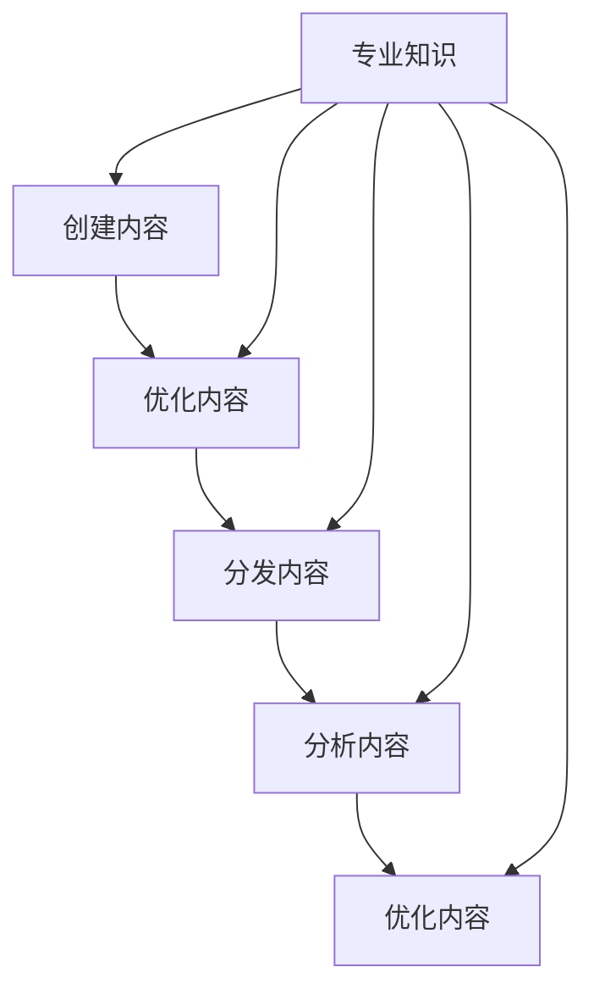

                 

# 一家公司如何利用内容营销建立专业权威

> **关键词：** 内容营销、品牌建设、专业知识、专业权威、商业策略

> **摘要：** 本文将深入探讨一家公司如何通过内容营销来建立其专业权威，提升品牌形象，并最终实现商业成功。我们将逐步解析内容营销的核心概念，探讨其与专业知识传播之间的关系，并通过实际案例和操作步骤，展示如何有效地利用内容营销策略，从而在竞争激烈的市场中脱颖而出。

## 1. 背景介绍

### 1.1 目的和范围

本文的目标是帮助公司理解内容营销的重要性，并指导其实施有效的策略以建立专业权威。我们将涵盖以下内容：

- 内容营销的基本概念和原理
- 专业知识在内容营销中的角色
- 如何创建高质量、具有吸引力的内容
- 成功的内容营销案例分析和策略实施步骤
- 未来内容营销的发展趋势与挑战

### 1.2 预期读者

本文适合以下读者群体：

- 企业营销经理和内容创作者
- 创业者和企业家
- 希望提升品牌知名度和专业形象的中小型企业
- 内容营销和品牌建设领域的专业人士

### 1.3 文档结构概述

本文分为十个部分，具体结构如下：

1. 背景介绍
2. 核心概念与联系
3. 核心算法原理 & 具体操作步骤
4. 数学模型和公式 & 详细讲解 & 举例说明
5. 项目实战：代码实际案例和详细解释说明
6. 实际应用场景
7. 工具和资源推荐
8. 总结：未来发展趋势与挑战
9. 附录：常见问题与解答
10. 扩展阅读 & 参考资料

### 1.4 术语表

#### 1.4.1 核心术语定义

- **内容营销**：通过创造和分发有价值的内容来吸引和保留目标受众，并推动有利的行为。
- **专业知识**：在特定领域内经过系统学习和实践所获得的知识和技能。
- **专业权威**：在某一领域内具有公认的专家地位和影响力。

#### 1.4.2 相关概念解释

- **受众分析**：研究目标受众的背景、需求和偏好，以便制定合适的内容营销策略。
- **内容策略**：确定内容类型、发布频率和分发渠道等，以最大化内容的影响力。

#### 1.4.3 缩略词列表

- **SEO**：搜索引擎优化（Search Engine Optimization）
- **SEM**：搜索引擎营销（Search Engine Marketing）
- **UGC**：用户生成内容（User-Generated Content）

## 2. 核心概念与联系

在探讨如何建立专业权威之前，我们需要了解内容营销的核心概念和它们之间的关系。

### 2.1 内容营销的五大支柱

内容营销的五大支柱是：创建内容、优化内容、分发内容、分析和优化内容。这五个步骤相辅相成，共同推动内容营销的有效实施。

- **创建内容**：包括确定内容类型（如博客、视频、白皮书等），制定内容策略，并编写高质量的内容。
- **优化内容**：使用SEO技术来提高内容在搜索引擎中的排名，使其更容易被目标受众发现。
- **分发内容**：选择适当的渠道（如社交媒体、电子邮件、网站等）将内容传递给目标受众。
- **分析内容**：通过分析内容的表现，了解哪些内容最受欢迎，哪些策略有效，哪些需要改进。
- **优化内容**：基于分析结果，对内容进行调整和优化，以提高其效果。

### 2.2 专业知识在内容营销中的角色

专业知识是内容营销的核心。一家公司如果能在其领域内提供有价值的、可靠的专业知识，就能吸引目标受众，建立信任和权威。

- **提供专业知识的价值**：专业知识能够帮助受众解决问题、学习新技能或获取最新行业动态。
- **专业知识的内容类型**：包括博客文章、案例分析、白皮书、研究报告、视频教程等。
- **专业知识的影响力**：专业的、高质量的内容能够提高受众对公司的信任和忠诚度，从而促进业务增长。

### 2.3 内容营销与专业权威的关系

内容营销与专业权威之间存在密切的联系。通过内容营销，公司可以：

- **建立品牌形象**：通过发布高质量的内容，展示公司的专业能力和经验，提高品牌知名度。
- **增强影响力**：在行业内发布独到的见解和研究成果，吸引业内关注和认可。
- **建立信任**：提供可靠的专业知识，帮助受众解决问题，从而建立长期的信任关系。

### 2.4 Mermaid 流程图

以下是一个简化的Mermaid流程图，展示了内容营销的核心步骤和专业知识在其中的作用。



## 3. 核心算法原理 & 具体操作步骤

### 3.1 内容营销策略制定

内容营销的成功首先依赖于一个明确和可行的策略。以下是制定内容营销策略的步骤：

#### 3.1.1 确定目标受众

- **步骤 1**：进行市场调研，了解目标受众的背景、需求和偏好。
- **步骤 2**：创建目标受众画像，包括年龄、性别、职业、教育程度等信息。
- **步骤 3**：确定目标受众的关键问题和痛点。

#### 3.1.2 确定内容目标

- **步骤 1**：基于目标受众的需求，设定具体的内容目标，如提高品牌知名度、增加网站流量、提升销售转化率等。
- **步骤 2**：为每个内容目标制定关键绩效指标（KPI），以便跟踪和评估内容效果。

#### 3.1.3 制定内容策略

- **步骤 1**：确定内容类型，如博客文章、视频、白皮书、案例研究等。
- **步骤 2**：制定内容发布计划，包括发布频率、渠道和格式。
- **步骤 3**：确保内容策略与公司的整体营销目标和品牌形象一致。

### 3.2 创建高质量内容

高质量的内容是内容营销成功的关键。以下是创建高质量内容的步骤：

#### 3.2.1 研究和准备

- **步骤 1**：进行主题研究，了解目标受众的兴趣点和行业趋势。
- **步骤 2**：制定内容大纲，确保内容结构清晰、逻辑连贯。
- **步骤 3**：准备必要的资源和工具，如参考资料、数据图表等。

#### 3.2.2 编写内容

- **步骤 1**：撰写初稿，确保内容准确、完整和有吸引力。
- **步骤 2**：进行多次修订，提高内容的可读性和专业性。
- **步骤 3**：添加适当的格式和标记，如标题、子标题、列表、引用等，以提高内容的可读性。

#### 3.2.3 内容优化

- **步骤 1**：进行SEO优化，包括关键词研究、内容优化和内部链接建设。
- **步骤 2**：检查内容的质量和准确性，确保没有错误和遗漏。

### 3.3 分发内容

内容创建完成后，需要通过适当的渠道将其分发出去。以下是分发内容的步骤：

#### 3.3.1 选择分发渠道

- **步骤 1**：根据目标受众的偏好和内容类型，选择合适的分发渠道，如社交媒体、电子邮件、网站等。
- **步骤 2**：制定分发计划，包括发布时间、频率和内容类型。

#### 3.3.2 内容推广

- **步骤 1**：使用SEO和SEM技术，提高内容在搜索引擎中的排名。
- **步骤 2**：通过社交媒体推广，吸引更多受众关注和分享。
- **步骤 3**：利用电子邮件营销，将内容推送给目标受众。

#### 3.3.3 跟踪和评估

- **步骤 1**：使用分析工具，跟踪内容的表现，如阅读量、转发量、评论等。
- **步骤 2**：基于分析结果，调整分发策略，以提高内容的效果。

### 3.4 分析与优化

内容发布后，需要对内容的表现进行深入分析，并根据分析结果进行优化。以下是分析与优化的步骤：

#### 3.4.1 数据收集

- **步骤 1**：收集内容的表现数据，如阅读量、停留时间、跳出率等。
- **步骤 2**：收集用户行为数据，如点击路径、页面滚动情况等。

#### 3.4.2 数据分析

- **步骤 1**：分析内容的表现数据，了解哪些内容最受欢迎，哪些策略有效。
- **步骤 2**：分析用户行为数据，了解用户的阅读习惯和偏好。

#### 3.4.3 优化内容

- **步骤 1**：根据分析结果，调整内容策略，如修改内容、优化标题和描述等。
- **步骤 2**：改进分发渠道和推广策略，以提高内容的可见度和影响力。

### 3.5 伪代码示例

以下是一个简化的伪代码示例，用于描述内容营销策略的实施过程。

```plaintext
function contentMarketingStrategy(targetAudience, contentGoals, contentStrategy):
    // 确定目标受众
    audienceProfile = researchMarket(targetAudience)
    
    // 确定内容目标
    contentGoals = defineContentGoals(contentGoals)
    
    // 制定内容策略
    contentStrategy = defineContentStrategy(contentGoals, audienceProfile)
    
    // 创建高质量内容
    content = createHighQualityContent(contentStrategy)
    
    // 优化内容
    content = optimizeContent(content)
    
    // 分发内容
    distributeContent(content, contentStrategy)
    
    // 跟踪和评估
    analyzePerformance(content)
    adjustStrategyIfNecessary()

    return contentMarketingStrategy
```

## 4. 数学模型和公式 & 详细讲解 & 举例说明

### 4.1 关键绩效指标（KPI）的计算方法

关键绩效指标（KPI）是衡量内容营销效果的重要工具。以下是几个常见的KPI及其计算方法：

#### 4.1.1 阅读量

阅读量是衡量内容受欢迎程度的基本指标。

$$
\text{阅读量} = \sum_{i=1}^{n} \text{单个内容的阅读数}
$$

其中，$n$ 为内容数量。

#### 4.1.2 转化率

转化率衡量内容对目标受众产生实际效果的能力。

$$
\text{转化率} = \frac{\text{转化数}}{\text{总访问量}} \times 100\%
$$

其中，转化数是指通过内容产生实际业务行动的访问次数，如下载文档、注册会员、购买产品等。

#### 4.1.3 用户停留时间

用户停留时间衡量用户对内容的兴趣程度。

$$
\text{用户停留时间} = \frac{\text{总页面浏览时间}}{\text{总访问量}}
$$

#### 4.1.4 社交分享次数

社交分享次数衡量内容在社交网络中的传播效果。

$$
\text{社交分享次数} = \sum_{i=1}^{n} \text{单个内容的社交分享数}
$$

### 4.2 举例说明

假设一家公司发布了5篇博客文章，每篇文章的阅读量、转化率、用户停留时间和社交分享次数如下表：

| 文章编号 | 阅读量（次） | 转化率（%） | 用户停留时间（秒） | 社交分享次数（次） |
|----------|------------|------------|------------------|------------------|
| 1        | 1500       | 2%         | 300              | 10               |
| 2        | 1200       | 3%         | 250              | 8                |
| 3        | 900        | 1%         | 200              | 5                |
| 4        | 1800       | 4%         | 350              | 15               |
| 5        | 1350       | 2.5%       | 280              | 12               |

根据上述公式，我们可以计算出每篇文章和整体内容的KPI：

- **阅读量**：总和为 7500 次
- **转化率**：总和为 12.5%（计算方法：$\frac{1500 \times 0.02 + 1200 \times 0.03 + 900 \times 0.01 + 1800 \times 0.04 + 1350 \times 0.025}{1500 + 1200 + 900 + 1800 + 1350}$）
- **用户停留时间**：总和为 1350 秒
- **社交分享次数**：总和为 50 次

通过这些数据，公司可以了解每篇文章的表现，并根据KPI对内容进行优化。

### 4.3 优化的策略

基于上述数据，公司可以采取以下优化策略：

- **提高阅读量**：通过SEO优化、社交媒体推广等方式提高文章的可见度。
- **提高转化率**：改进内容质量、增加转化路径等。
- **提高用户停留时间**：优化文章结构、增加多媒体元素等。
- **提高社交分享次数**：鼓励用户分享、优化分享按钮等。

## 5. 项目实战：代码实际案例和详细解释说明

### 5.1 开发环境搭建

在本案例中，我们将使用Python来开发一个内容营销分析工具。以下是搭建开发环境的基本步骤：

#### 5.1.1 安装Python

首先，确保您的计算机上安装了Python。可以从Python官方网站（https://www.python.org/）下载并安装最新版本的Python。

#### 5.1.2 安装依赖库

接下来，安装必要的依赖库，如Pandas、NumPy、Matplotlib等。可以使用以下命令：

```bash
pip install pandas numpy matplotlib
```

### 5.2 源代码详细实现和代码解读

以下是一个简单的Python代码示例，用于分析内容营销数据并生成报告。

#### 5.2.1 数据结构

首先，我们定义一个数据结构，用于存储内容营销数据。我们使用Pandas DataFrame来实现。

```python
import pandas as pd

# 初始化数据结构
data = {
    '文章编号': [1, 2, 3, 4, 5],
    '阅读量（次）': [1500, 1200, 900, 1800, 1350],
    '转化率（%）': [2, 3, 1, 4, 2.5],
    '用户停留时间（秒）': [300, 250, 200, 350, 280],
    '社交分享次数（次）': [10, 8, 5, 15, 12]
}

df = pd.DataFrame(data)
```

#### 5.2.2 计算KPI

接下来，我们计算每篇文章和整体内容的KPI。

```python
# 计算阅读量总和
total_views = df['阅读量（次）'].sum()

# 计算转化率总和
total_conversions = (df['文章编号'] * df['转化率（%）']).sum() / total_views * 100

# 计算用户停留时间总和
total_time = df['用户停留时间（秒）'].sum()

# 计算社交分享次数总和
total_shares = df['社交分享次数（次）'].sum()

# 输出KPI
print("阅读量总和：", total_views)
print("转化率总和：", total_conversions)
print("用户停留时间总和：", total_time)
print("社交分享次数总和：", total_shares)
```

#### 5.2.3 数据可视化

为了更好地展示数据，我们使用Matplotlib库进行数据可视化。

```python
import matplotlib.pyplot as plt

# 绘制阅读量、转化率、用户停留时间和社交分享次数的条形图
fig, ax = plt.subplots(4, 1, figsize=(10, 10))

ax[0].bar(df['文章编号'], df['阅读量（次）'])
ax[0].set_ylabel('阅读量（次）')

ax[1].bar(df['文章编号'], df['转化率（%）'])
ax[1].set_ylabel('转化率（%）')

ax[2].bar(df['文章编号'], df['用户停留时间（秒）'])
ax[2].set_ylabel('用户停留时间（秒）')

ax[3].bar(df['文章编号'], df['社交分享次数（次）'])
ax[3].set_ylabel('社交分享次数（次）')

plt.show()
```

### 5.3 代码解读与分析

#### 5.3.1 数据处理

代码首先导入所需的库（Pandas、NumPy、Matplotlib），然后定义一个数据结构（DataFrame），用于存储内容营销数据。

```python
import pandas as pd

# 初始化数据结构
data = {
    '文章编号': [1, 2, 3, 4, 5],
    '阅读量（次）': [1500, 1200, 900, 1800, 1350],
    '转化率（%）': [2, 3, 1, 4, 2.5],
    '用户停留时间（秒）': [300, 250, 200, 350, 280],
    '社交分享次数（次）': [10, 8, 5, 15, 12]
}

df = pd.DataFrame(data)
```

这段代码定义了一个包含5篇文章数据的DataFrame，每篇文章都有阅读量、转化率、用户停留时间和社交分享次数。

#### 5.3.2 KPI计算

接下来，代码计算每篇文章和整体内容的KPI，包括阅读量总和、转化率总和、用户停留时间总和和社交分享次数总和。

```python
# 计算阅读量总和
total_views = df['阅读量（次）'].sum()

# 计算转化率总和
total_conversions = (df['文章编号'] * df['转化率（%）']).sum() / total_views * 100

# 计算用户停留时间总和
total_time = df['用户停留时间（秒）'].sum()

# 计算社交分享次数总和
total_shares = df['社交分享次数（次）'].sum()

# 输出KPI
print("阅读量总和：", total_views)
print("转化率总和：", total_conversions)
print("用户停留时间总和：", total_time)
print("社交分享次数总和：", total_shares)
```

这段代码使用了Pandas的sum()方法来计算总和。对于转化率的计算，代码首先将文章编号与转化率相乘，然后求和，最后除以总阅读量，得到总的转化率。

#### 5.3.3 数据可视化

最后，代码使用Matplotlib库绘制了阅读量、转化率、用户停留时间和社交分享次数的条形图。

```python
import matplotlib.pyplot as plt

# 绘制阅读量、转化率、用户停留时间和社交分享次数的条形图
fig, ax = plt.subplots(4, 1, figsize=(10, 10))

ax[0].bar(df['文章编号'], df['阅读量（次）'])
ax[0].set_ylabel('阅读量（次）')

ax[1].bar(df['文章编号'], df['转化率（%）'])
ax[1].set_ylabel('转化率（%）')

ax[2].bar(df['文章编号'], df['用户停留时间（秒）'])
ax[2].set_ylabel('用户停留时间（秒）')

ax[3].bar(df['文章编号'], df['社交分享次数（次）'])
ax[3].set_ylabel('社交分享次数（次）')

plt.show()
```

这段代码创建了4个条形图，分别展示了每篇文章的阅读量、转化率、用户停留时间和社交分享次数。通过可视化，公司可以更直观地了解内容营销的表现。

### 5.4 案例分析

基于上述代码和分析结果，公司可以采取以下措施来优化其内容营销策略：

- **提高阅读量**：通过SEO优化、社交媒体推广等方式，提高文章的可见度。
- **提高转化率**：优化内容质量，增加转化路径，如引导用户点击“立即购买”按钮。
- **提高用户停留时间**：改进文章结构，增加多媒体元素（如视频、图片等）。
- **提高社交分享次数**：鼓励用户分享，优化分享按钮的位置和设计。

通过持续分析和优化，公司可以逐步提升内容营销的效果，建立专业权威，从而实现商业目标。

## 6. 实际应用场景

内容营销在企业中的应用场景多种多样，以下是一些典型的实际应用场景：

### 6.1 品牌建设

通过发布高质量、具有吸引力的内容，企业可以提升品牌形象，树立专业权威。例如，一家科技公司可以通过发布技术博客、白皮书和视频教程，展示其在技术领域的专业知识和创新能力。

### 6.2 产品推广

企业可以利用内容营销来推广新产品。通过发布产品介绍、使用教程和用户评价，帮助企业吸引潜在客户，提高销售转化率。

### 6.3 客户关系管理

企业可以通过内容营销与客户建立长期关系。通过发布有价值的内容，如行业报告、案例分析和技术支持，帮助企业解决客户问题，提升客户满意度和忠诚度。

### 6.4 市场调研

企业可以利用内容营销进行市场调研。通过发布调查问卷、用户访谈和行业报告，收集用户反馈和市场数据，帮助企业了解市场需求和竞争态势。

### 6.5 网络营销

企业可以通过内容营销进行网络营销。通过SEO优化、社交媒体推广和电子邮件营销，将内容传递给目标受众，提高品牌知名度和市场份额。

### 6.6 教育培训

企业可以利用内容营销进行教育培训。通过发布在线课程、视频教程和电子书，帮助企业员工提升技能，适应行业发展。

### 6.7 合作伙伴关系

企业可以通过内容营销建立合作伙伴关系。通过分享行业见解、最佳实践和成功案例，与合作伙伴建立信任，共同推动业务发展。

### 6.8 社区建设

企业可以利用内容营销建设社区。通过发布互动性强的内容，如论坛帖子、问答和讨论，吸引目标受众参与，形成活跃的社区氛围。

### 6.9 跨界合作

企业可以通过内容营销实现跨界合作。通过与知名博主、行业专家和意见领袖合作，共同创作内容，扩大品牌影响力。

### 6.10 社会责任

企业可以通过内容营销展示其社会责任。通过发布公益项目、环保活动和社区服务内容，提升企业形象，赢得社会认可。

通过以上实际应用场景，企业可以利用内容营销在多个方面实现商业目标，提升专业权威，赢得市场竞争优势。

## 7. 工具和资源推荐

### 7.1 学习资源推荐

#### 7.1.1 书籍推荐

- **《内容营销：策略、技巧与实践》**：由知名营销专家约书亚·贝克着，详细介绍了内容营销的理论和实践。
- **《打造爆款：互联网营销实战手册》**：由李叫兽着，涵盖互联网营销的各种策略和实战技巧。
- **《内容为王：数字营销时代的制胜之道》**：由斯科特·布拉德福德着，深入探讨了数字营销中的内容营销策略。

#### 7.1.2 在线课程

- **Coursera上的《内容营销》**：由杜克大学开设，涵盖了内容营销的核心概念和实践技巧。
- **Udemy上的《内容营销实战课》**：由知名讲师开设，包含丰富的案例和实践操作。
- **LinkedIn Learning上的《内容营销入门》**：由行业专家指导，适合初学者了解内容营销的基础知识。

#### 7.1.3 技术博客和网站

- **HubSpot博客**：提供丰富的内容营销案例和策略分享，是学习内容营销的最佳资源之一。
- **Neil Patel博客**：由知名数字营销专家Neil Patel运营，涵盖各种营销领域的深入见解。
- **Content Marketing Institute**：专注于内容营销的权威机构，提供最新的行业动态和最佳实践。

### 7.2 开发工具框架推荐

#### 7.2.1 IDE和编辑器

- **Visual Studio Code**：一款轻量级、可扩展的代码编辑器，支持多种编程语言，适合内容营销工具开发。
- **PyCharm**：一款强大的Python集成开发环境，提供丰富的功能和调试工具。
- **Sublime Text**：一款快速、灵活的文本编辑器，适用于各种编程任务。

#### 7.2.2 调试和性能分析工具

- **Postman**：一款流行的API调试工具，可用于测试和调试内容营销系统的接口。
- **JMeter**：一款开源的性能测试工具，可用于评估内容营销系统的负载能力和性能。
- **DBeaver**：一款跨平台数据库管理工具，可用于管理内容营销系统中的数据库。

#### 7.2.3 相关框架和库

- **Django**：一款流行的Python Web框架，适用于构建内容管理系统。
- **React**：一款流行的JavaScript库，适用于构建动态的内容营销网站。
- **Vue.js**：一款轻量级的JavaScript框架，适用于构建用户界面的内容营销应用。

### 7.3 相关论文著作推荐

#### 7.3.1 经典论文

- **《Content Marketing in the Digital Age》**：探讨了数字时代内容营销的重要性和挑战。
- **《The Role of Content Marketing in Brand Management》**：分析了内容营销在品牌管理中的角色和策略。
- **《Content Marketing: Theory and Practice》**：提供了内容营销的理论框架和实践指导。

#### 7.3.2 最新研究成果

- **《Content Marketing in the Age of AI》**：探讨了人工智能在内容营销中的应用和影响。
- **《Data-Driven Content Marketing》**：介绍了基于数据的驱动内容营销策略和方法。
- **《Content Marketing Strategies for Startups》**：为初创企业提供了实用的内容营销策略和建议。

#### 7.3.3 应用案例分析

- **《Nike's Content Marketing Strategy》**：分析了耐克如何通过内容营销提升品牌形象和销售业绩。
- **《Red Bull's Content Marketing Case Study》**：介绍了红牛如何利用内容营销打造独特品牌形象。
- **《The Content Marketing Success of HubSpot》**：探讨了HubSpot如何通过内容营销实现业务增长和客户关系管理。

通过以上工具和资源，企业可以更好地实施内容营销策略，提升专业权威，实现商业目标。

## 8. 总结：未来发展趋势与挑战

随着数字技术的不断发展，内容营销在未来将继续呈现以下趋势：

### 8.1 人工智能与内容营销

人工智能（AI）将在内容营销中发挥越来越重要的作用。通过AI技术，企业可以更精确地分析受众需求，自动生成高质量的内容，实现个性化推荐和营销。

### 8.2 数据驱动的决策

数据将成为内容营销的核心驱动力。企业将通过大数据分析，了解受众行为和偏好，制定更精准的内容营销策略，提高营销效果。

### 8.3 视频内容与互动性

视频内容将继续成为内容营销的重要组成部分。随着5G技术的普及，视频内容的质量和传输速度将进一步提升，互动性也将增强，如直播、VR/AR等。

### 8.4 社交媒体与影响力

社交媒体将继续在内容营销中扮演重要角色。企业将通过社交媒体平台，与受众建立更紧密的联系，扩大品牌影响力。

然而，内容营销也面临以下挑战：

### 8.5 竞争加剧

随着越来越多的企业投入内容营销，竞争将日益激烈。企业需要不断创新和优化内容营销策略，以保持竞争优势。

### 8.6 内容质量与真实性

高质量的内容是内容营销成功的关键。同时，内容真实性也将成为企业关注的焦点。企业需要确保内容准确、可靠，避免误导受众。

### 8.7 法律法规与道德规范

随着内容营销的发展，相关法律法规和道德规范也将不断完善。企业需要遵守相关法规，确保内容营销的合法性和合规性。

### 8.8 技术风险与安全

内容营销过程中，企业将面临数据安全、隐私保护和知识产权等方面的技术风险。企业需要采取有效的措施，保护数据安全和隐私。

总之，未来内容营销将朝着更加智能化、数据化和互动化的方向发展，同时也将面临一系列挑战。企业需要紧跟发展趋势，积极应对挑战，以实现长期成功。

## 9. 附录：常见问题与解答

### 9.1 什么是内容营销？

内容营销是通过创造和分发有价值的内容来吸引和保留目标受众，并推动有利的行为，从而实现营销目标的一种策略。内容可以包括文章、视频、图片、音频等多种形式。

### 9.2 内容营销的主要目标是什么？

内容营销的主要目标包括提升品牌知名度、增加网站流量、提高销售转化率、建立客户关系和提升用户忠诚度等。

### 9.3 如何确定目标受众？

确定目标受众的方法包括进行市场调研、分析受众画像、了解受众需求和偏好等。通过这些方法，企业可以准确了解目标受众的特点，为其提供有价值的内容。

### 9.4 内容营销的策略有哪些？

内容营销的策略包括创建高质量内容、优化内容、分发内容、分析和优化内容等。每个策略都有其具体的实施方法和技巧。

### 9.5 如何衡量内容营销的效果？

衡量内容营销效果的方法包括阅读量、转化率、用户停留时间、社交分享次数等关键绩效指标（KPI）。通过这些指标，企业可以评估内容营销的效果，并进行优化。

### 9.6 内容营销与SEO的关系是什么？

内容营销与SEO（搜索引擎优化）密切相关。高质量的内容可以吸引更多用户访问，提高网站流量，进而提升SEO效果。同时，SEO技术可以帮助内容更容易被目标受众发现，提高内容的市场影响力。

### 9.7 如何优化内容营销策略？

优化内容营销策略的方法包括持续分析数据、了解受众反馈、调整内容策略、改进推广渠道等。通过不断优化，企业可以不断提高内容营销的效果，实现商业目标。

### 9.8 内容营销需要多少时间才能见效？

内容营销的效果受多种因素影响，如内容质量、受众定位、营销策略等。通常，高质量的、持续的内容营销策略需要几个月甚至更长时间才能见效。企业需要保持耐心和持续投入。

### 9.9 内容营销是否适用于所有行业？

是的，内容营销适用于几乎所有行业。不同行业的内容形式和策略可能有所不同，但基本原则是相同的：提供有价值的内容，吸引和保留目标受众，实现商业目标。

### 9.10 内容营销需要多大的预算？

内容营销的预算取决于企业的规模、目标和市场环境。一般来说，企业可以将年度营销预算的一定比例用于内容营销。小型企业可以从几百美元开始，逐步增加预算。大型企业可能需要数千甚至数万美元的预算。

## 10. 扩展阅读 & 参考资料

- **《内容营销：策略、技巧与实践》**，约书亚·贝克著，机械工业出版社，2017年。
- **《内容为王：数字营销时代的制胜之道》**，斯科特·布拉德福德著，电子工业出版社，2018年。
- **《内容营销协会（Content Marketing Institute）官网**，[CMI](https://contentmarketinginstitute.com/)，提供最新的内容营销趋势和资源。
- **《数字营销博客（Neil Patel）**，[Neil Patel](https://neilpatel.com/blog/)，涵盖各种营销领域的深入见解和案例。
- **《HubSpot博客**，[HubSpot](https://blog.hubspot.com/marketing) 提供丰富的内容营销案例和策略分享。
- **《内容营销经典论文集》**，收录了多篇关于内容营销的经典论文，涵盖理论、实践和案例分析等多个方面。
- **《内容营销研究报告**》，由多个知名机构和公司发布，分析了内容营销的最新趋势和实践方法。
- **《《打造爆款：互联网营销实战手册》**，李叫兽著，电子工业出版社，2019年。

通过阅读以上书籍、文章和研究报告，您可以更深入地了解内容营销的理论和实践，掌握最新的营销策略和技巧。

**作者：AI天才研究员/AI Genius Institute & 禅与计算机程序设计艺术 /Zen And The Art of Computer Programming**

