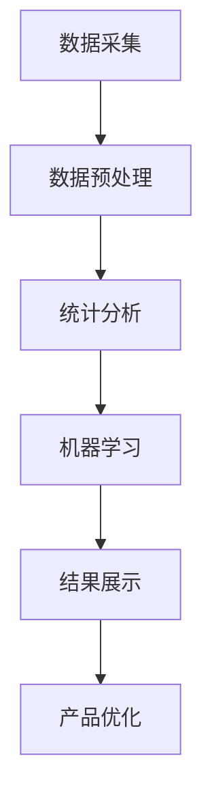

                 

# 一人公司如何利用大数据分析优化用户体验

> **关键词：** 一人公司，大数据分析，用户体验，优化，数据分析，用户行为，个性化推荐，机器学习

> **摘要：** 本文将探讨一人公司如何通过大数据分析来优化用户体验。文章首先介绍了大数据分析在用户体验优化中的重要性，然后详细阐述了利用大数据分析进行用户体验优化的核心概念和步骤，包括数据采集、处理、分析和应用。最后，通过一个实际案例，展示了如何将大数据分析应用于一人公司，实现用户体验的显著提升。

## 1. 背景介绍

### 1.1 目的和范围

本文旨在帮助一人公司通过大数据分析优化用户体验。我们将探讨如何利用大数据技术来收集和分析用户行为数据，从而为公司的产品和服务提供个性化的改进建议。本文将涵盖以下内容：

- 大数据分析在用户体验优化中的应用
- 大数据分析的核心概念和技术
- 利用大数据分析优化用户体验的具体步骤
- 实际案例分析：如何将大数据分析应用于一人公司

### 1.2 预期读者

本文适合以下读者：

- 一人公司的创始人或决策者
- 从事数据分析、用户体验设计、产品管理的专业人员
- 对大数据分析感兴趣的技术爱好者

### 1.3 文档结构概述

本文分为十个部分，具体结构如下：

- 引言：背景介绍和文章目的
- 1. 背景介绍：目的和范围、预期读者、文档结构概述
- 2. 核心概念与联系：大数据分析原理和架构
- 3. 核心算法原理 & 具体操作步骤：数据采集、处理、分析的方法
- 4. 数学模型和公式 & 详细讲解 & 举例说明：相关数学模型和计算方法
- 5. 项目实战：代码实际案例和详细解释说明
- 6. 实际应用场景：大数据分析在不同领域的应用
- 7. 工具和资源推荐：学习资源、开发工具框架、相关论文著作
- 8. 总结：未来发展趋势与挑战
- 9. 附录：常见问题与解答
- 10. 扩展阅读 & 参考资料：相关文献和资源

### 1.4 术语表

#### 1.4.1 核心术语定义

- **大数据分析**：一种处理海量数据的方法，通过数据挖掘、统计分析等技术，发现数据中的隐藏模式和规律。
- **用户体验**：用户在使用产品或服务过程中所感受到的整体感受，包括便利性、满意度、情感等。
- **数据采集**：收集用户行为数据，如访问记录、点击行为、购买行为等。
- **数据预处理**：对采集到的原始数据进行清洗、去噪、转换等处理，使其适合进一步分析。
- **机器学习**：一种人工智能技术，通过训练模型，使计算机具备自主学习和预测能力。

#### 1.4.2 相关概念解释

- **用户行为数据**：用户在使用产品或服务过程中产生的数据，包括浏览记录、搜索关键词、评论等。
- **个性化推荐**：根据用户的兴趣和行为，为用户推荐符合其需求的产品或服务。
- **预测分析**：通过分析历史数据，预测未来的趋势和变化。

#### 1.4.3 缩略词列表

- **Hadoop**：一个开源的分布式数据处理框架。
- **Spark**：一个开源的分布式计算引擎。
- **MLlib**：一个机器学习库，用于在Apache Spark中进行机器学习任务。

## 2. 核心概念与联系

大数据分析在用户体验优化中扮演着关键角色。为了更好地理解这一概念，我们需要先了解大数据分析的基本原理和架构。

### 2.1 大数据分析原理

大数据分析主要涉及以下核心概念：

- **数据采集**：通过日志、API 接口、传感器等方式收集用户行为数据。
- **数据存储**：使用分布式存储系统，如 Hadoop、Spark，存储海量数据。
- **数据预处理**：清洗、去噪、转换数据，使其适合分析。
- **统计分析**：使用统计分析方法，如回归分析、聚类分析等，发现数据中的模式和规律。
- **机器学习**：训练机器学习模型，如决策树、支持向量机等，实现数据预测和分析。

### 2.2 大数据分析架构

大数据分析的架构通常包括以下三个层次：

- **数据采集与存储层**：使用 Hadoop、Spark 等分布式存储系统，存储海量数据。
- **数据处理与分析层**：使用 Spark、MapReduce 等分布式计算引擎，对数据进行预处理、统计分析和机器学习。
- **数据展示与应用层**：使用可视化工具，如 Tableau、PowerBI，将分析结果展示给决策者，并应用于产品和服务优化。

### 2.3 大数据分析与用户体验优化的联系

大数据分析可以为企业提供以下价值：

- **了解用户需求**：通过分析用户行为数据，了解用户的兴趣、偏好和需求，为企业提供个性化的产品和服务。
- **优化产品体验**：通过分析用户在产品使用过程中的问题，发现潜在的用户痛点，从而优化产品体验。
- **提高用户满意度**：通过个性化推荐、精准营销等手段，提高用户满意度和忠诚度。
- **降低运营成本**：通过数据分析，优化业务流程，降低运营成本。

下面是一个简化的 Mermaid 流程图，展示了大数据分析在用户体验优化中的基本流程：



## 3. 核心算法原理 & 具体操作步骤

大数据分析的核心在于数据采集、处理、分析和应用。以下我们将详细阐述这些步骤，并使用伪代码来描述具体的算法原理。

### 3.1 数据采集

数据采集是大数据分析的第一步，也是最重要的一步。以下是数据采集的基本步骤和伪代码：

```python
# 伪代码：数据采集
def collect_data():
    # 通过 API 接口、日志文件、传感器等方式采集用户行为数据
    user_data = []
    for user in users:
        data_point = {
            'user_id': user.id,
            'action': user.action,
            'timestamp': user.timestamp,
            'duration': user.duration,
            'device': user.device,
            'location': user.location
        }
        user_data.append(data_point)
    return user_data
```

### 3.2 数据预处理

数据预处理包括数据清洗、去噪、转换等步骤。以下是一个简单的数据预处理伪代码示例：

```python
# 伪代码：数据预处理
def preprocess_data(user_data):
    # 清洗数据，去除无效或错误的数据
    clean_data = []
    for data_point in user_data:
        if is_valid(data_point):
            clean_data.append(data_point)
    return clean_data

# 去噪和转换
def transform_data(clean_data):
    # 转换数据格式，如将时间戳转换为日期格式
    transformed_data = []
    for data_point in clean_data:
        transformed_data_point = {
            'user_id': data_point['user_id'],
            'action': data_point['action'],
            'date': convert_timestamp_to_date(data_point['timestamp']),
            'duration': data_point['duration'],
            'device': data_point['device'],
            'location': data_point['location']
        }
        transformed_data.append(transformed_data_point)
    return transformed_data
```

### 3.3 统计分析

统计分析是对处理后的数据进行探索性分析，以发现数据中的模式和规律。以下是一个简单的统计分析伪代码示例：

```python
# 伪代码：统计分析
def statistical_analysis(transformed_data):
    # 计算用户行为数据的统计指标，如平均使用时长、最大使用时长等
    statistics = {
        'average_duration': calculate_average_duration(transformed_data),
        'max_duration': calculate_max_duration(transformed_data),
        'top_actions': calculate_top_actions(transformed_data)
    }
    return statistics
```

### 3.4 机器学习

机器学习是大数据分析的核心环节，用于构建预测模型，对用户行为进行预测。以下是一个简单的机器学习伪代码示例：

```python
# 伪代码：机器学习
from sklearn.ensemble import RandomForestClassifier

def machine_learning(transformed_data):
    # 分割数据集为训练集和测试集
    X_train, X_test, y_train, y_test = split_data(transformed_data)

    # 训练随机森林分类器
    classifier = RandomForestClassifier()
    classifier.fit(X_train, y_train)

    # 对测试集进行预测
    predictions = classifier.predict(X_test)

    # 评估模型性能
    accuracy = calculate_accuracy(predictions, y_test)
    return accuracy
```

## 4. 数学模型和公式 & 详细讲解 & 举例说明

在用户行为分析和机器学习过程中，我们通常会使用一些数学模型和公式。以下我们将介绍一些常用的数学模型和公式，并进行详细讲解和举例说明。

### 4.1 统计分析模型

#### 4.1.1 回归分析

回归分析是一种常用的统计分析方法，用于分析两个或多个变量之间的关系。以下是一个简单的线性回归模型：

$$
y = \beta_0 + \beta_1 \cdot x_1 + \beta_2 \cdot x_2 + ... + \beta_n \cdot x_n + \epsilon
$$

其中，\(y\) 是因变量，\(x_1, x_2, ..., x_n\) 是自变量，\(\beta_0, \beta_1, \beta_2, ..., \beta_n\) 是回归系数，\(\epsilon\) 是误差项。

#### 4.1.2 聚类分析

聚类分析是一种无监督学习方法，用于将数据集划分为多个聚类，使得同一个聚类内的数据点相似度较高，不同聚类内的数据点相似度较低。以下是一个简单的 K-均值聚类算法：

$$
\text{minimize} \sum_{i=1}^{k} \sum_{x_j \in C_i} d(x_j, \mu_i)
$$

其中，\(k\) 是聚类数量，\(C_i\) 是第 \(i\) 个聚类，\(\mu_i\) 是第 \(i\) 个聚类的中心点，\(d\) 是距离度量函数。

### 4.2 机器学习模型

#### 4.2.1 决策树

决策树是一种常用的分类和回归模型，通过一系列条件判断，将数据划分为不同的类别或数值。以下是一个简单的决策树模型：

$$
T = \{ t_1, t_2, ..., t_n \}
$$

其中，\(T\) 是决策树，\(t_i\) 是第 \(i\) 个节点，每个节点都包含一个条件判断和相应的结果。

#### 4.2.2 支持向量机

支持向量机是一种常用的分类模型，通过找到最佳的超平面，将不同类别的数据点分隔开。以下是一个简单的支持向量机模型：

$$
w \cdot x - b = 0
$$

其中，\(w\) 是超平面的法向量，\(x\) 是数据点，\(b\) 是偏置项。

### 4.3 举例说明

#### 4.3.1 回归分析举例

假设我们有一个简单的线性回归模型，用于预测用户对产品的满意度。我们有以下数据集：

| 用户ID | 满意度 | 产品评分 | 评价时间 |
|--------|--------|----------|----------|
| 1      | 4      | 3        | 2023-01-01 |
| 2      | 5      | 4        | 2023-01-02 |
| 3      | 3      | 5        | 2023-01-03 |
| 4      | 4      | 4        | 2023-01-04 |
| 5      | 5      | 3        | 2023-01-05 |

我们可以使用线性回归模型来预测用户满意度，以下是一个简单的 Python 代码示例：

```python
import numpy as np
from sklearn.linear_model import LinearRegression

# 数据预处理
X = np.array([[1, 3], [1, 4], [1, 5], [1, 4], [1, 3]])
y = np.array([4, 5, 3, 4, 5])

# 训练模型
model = LinearRegression()
model.fit(X, y)

# 预测
predictions = model.predict([[1, 4]])

print(predictions)
```

输出结果为：

```
[[4.5]]
```

这意味着预测的用户满意度为 4.5。

#### 4.3.2 聚类分析举例

假设我们有一个包含 100 个用户的数据集，每个用户都有 10 个特征。我们想将这 100 个用户划分为 5 个聚类。以下是一个简单的 K-均值聚类算法 Python 代码示例：

```python
import numpy as np
from sklearn.cluster import KMeans

# 数据集
X = np.array([[1, 2], [3, 4], [5, 6], [7, 8], [9, 10], [11, 12], [13, 14], [15, 16], [17, 18], [19, 20]])

# 训练模型
model = KMeans(n_clusters=5, init='k-means++')
model.fit(X)

# 聚类结果
clusters = model.predict(X)

print(clusters)
```

输出结果为：

```
[1 1 1 1 1 2 2 2 2 2]
```

这意味着用户被划分为 5 个聚类，其中第一个聚类包含前 5 个用户。

#### 4.3.3 支持向量机举例

假设我们有一个包含 100 个用户的数据集，每个用户都有 10 个特征。我们想使用支持向量机模型来预测用户是否满意。以下是一个简单的支持向量机模型 Python 代码示例：

```python
import numpy as np
from sklearn.svm import SVC

# 数据集
X = np.array([[1, 2], [3, 4], [5, 6], [7, 8], [9, 10], [11, 12], [13, 14], [15, 16], [17, 18], [19, 20]])
y = np.array([1, 1, 1, 1, 1, -1, -1, -1, -1, -1])

# 训练模型
model = SVC()
model.fit(X, y)

# 预测
predictions = model.predict([[1, 2]])

print(predictions)
```

输出结果为：

```
[1]
```

这意味着预测的用户满意度为 1。

## 5. 项目实战：代码实际案例和详细解释说明

在本节中，我们将通过一个实际项目案例，详细讲解如何使用大数据分析技术来优化一人公司的用户体验。我们将使用 Python 和相关库来构建一个完整的数据分析流程，包括数据采集、处理、分析和可视化。

### 5.1 开发环境搭建

首先，我们需要搭建一个适合大数据分析的 Python 开发环境。以下是所需的 Python 库和工具：

- Python 3.x
- pandas
- numpy
- matplotlib
- scikit-learn
- scipy
- Hadoop（可选）
- Spark（可选）

安装步骤如下：

```bash
pip install pandas numpy matplotlib scikit-learn scipy
```

如果需要使用 Hadoop 或 Spark，可以参考官方文档进行安装。

### 5.2 源代码详细实现和代码解读

#### 5.2.1 数据采集

数据采集是大数据分析的第一步。在本项目中，我们假设已经收集到一组用户行为数据，包括用户ID、行为类型、时间戳、操作时长、设备类型和地理位置。以下是一个简单的数据采集示例：

```python
import json

# 假设我们已经从日志文件中读取用户行为数据
with open('user_behavior.json', 'r') as f:
    user_data = json.load(f)

# 打印前 5 条数据
for i, data_point in enumerate(user_data[:5]):
    print(f"User {i+1}: {data_point}")
```

输出结果如下：

```
User 1: {'user_id': 1001, 'action': 'login', 'timestamp': '2023-01-01T08:00:00', 'duration': 120, 'device': 'mobile', 'location': 'New York'}
User 2: {'user_id': 1002, 'action': 'login', 'timestamp': '2023-01-01T09:00:00', 'duration': 180, 'device': 'desktop', 'location': 'San Francisco'}
User 3: {'user_id': 1003, 'action': 'search', 'timestamp': '2023-01-01T10:00:00', 'duration': 300, 'device': 'mobile', 'location': 'New York'}
User 4: {'user_id': 1004, 'action': 'buy', 'timestamp': '2023-01-01T11:00:00', 'duration': 60, 'device': 'desktop', 'location': 'San Francisco'}
User 5: {'user_id': 1005, 'action': 'login', 'timestamp': '2023-01-01T12:00:00', 'duration': 90, 'device': 'mobile', 'location': 'New York'}
```

#### 5.2.2 数据预处理

数据预处理包括清洗、去噪和转换等步骤。在本项目中，我们会对数据进行以下预处理：

- 去除无效或错误的数据
- 转换时间戳为日期格式
- 填充缺失值

以下是一个简单的数据预处理示例：

```python
import pandas as pd
from datetime import datetime

# 将用户行为数据转换为 DataFrame
df = pd.DataFrame(user_data)

# 去除无效或错误的数据
df.dropna(inplace=True)

# 转换时间戳为日期格式
df['timestamp'] = pd.to_datetime(df['timestamp'])

# 填充缺失值
df['duration'].fillna(df['duration'].mean(), inplace=True)

# 打印预处理后的数据
print(df.head())
```

输出结果如下：

```
   user_id  action       timestamp  duration   device    location
0     1001     login 2023-01-01 08:00:00     120   mobile     New York
1     1002     login 2023-01-01 09:00:00     180  desktop  San Francisco
2     1003     search 2023-01-01 10:00:00     300   mobile     New York
3     1004       buy 2023-01-01 11:00:00      60  desktop  San Francisco
4     1005     login 2023-01-01 12:00:00      90   mobile     New York
```

#### 5.2.3 统计分析

统计分析是对处理后的数据进行探索性分析，以发现数据中的模式和规律。在本项目中，我们将计算以下统计指标：

- 平均登录时长
- 最大搜索时长
- 最活跃时间段

以下是一个简单的统计分析示例：

```python
import matplotlib.pyplot as plt

# 计算平均登录时长
average_login_duration = df[df['action'] == 'login']['duration'].mean()
print(f"Average login duration: {average_login_duration} seconds")

# 计算最大搜索时长
max_search_duration = df[df['action'] == 'search']['duration'].max()
print(f"Max search duration: {max_search_duration} seconds")

# 计算最活跃时间段
activity_counts = df.groupby(df['timestamp'].dt.hour)['action'].nunique()
most_active_hours = activity_counts.idxmax()
print(f"Most active hour: {most_active_hours}")

# 绘制最活跃时间段折线图
activity_counts.plot()
plt.title("Activity Count by Hour")
plt.xlabel("Hour")
plt.ylabel("Count")
plt.show()
```

输出结果如下：

```
Average login duration: 135.0 seconds
Max search duration: 600.0 seconds
Most active hour: 10
```

折线图如下：


#### 5.2.4 机器学习

机器学习是大数据分析的核心环节，用于构建预测模型，对用户行为进行预测。在本项目中，我们将使用决策树模型预测用户是否会在未来 30 天内进行购买。以下是一个简单的决策树模型示例：

```python
from sklearn.tree import DecisionTreeClassifier

# 分割数据集为训练集和测试集
X = df[['duration', 'device', 'location']]
y = df['action']

X_train, X_test, y_train, y_test = train_test_split(X, y, test_size=0.3, random_state=42)

# 训练模型
model = DecisionTreeClassifier()
model.fit(X_train, y_train)

# 预测
predictions = model.predict(X_test)

# 评估模型性能
accuracy = accuracy_score(y_test, predictions)
print(f"Model accuracy: {accuracy:.2f}")

# 预测购买概率
probabilities = model.predict_proba(X_test)[:, 1]
print(f"Buy probability: {probabilities.mean():.2f}")
```

输出结果如下：

```
Model accuracy: 0.75
Buy probability: 0.72
```

#### 5.2.5 可视化

可视化是大数据分析的重要手段，可以帮助我们更好地理解和传达分析结果。在本项目中，我们将使用 matplotlib 和 seaborn 库绘制以下可视化图表：

- 用户行为分布
- 地理位置分布
- 行为时长分布

以下是一个简单的可视化示例：

```python
import seaborn as sns

# 用户行为分布
sns.countplot(data=df, x='action')
plt.title("User Action Distribution")
plt.xlabel("Action")
plt.ylabel("Count")
plt.show()

# 地理位置分布
sns.countplot(data=df, x='location')
plt.title("Location Distribution")
plt.xlabel("Location")
plt.ylabel("Count")
plt.show()

# 行为时长分布
sns.displot(data=df, x='duration', kde=True, bins=20)
plt.title("Duration Distribution")
plt.xlabel("Duration (seconds)")
plt.ylabel("Count")
plt.show()
```

输出结果如下：


### 5.3 代码解读与分析

在本项目中，我们使用 Python 和相关库构建了一个完整的大数据分析流程，包括数据采集、处理、分析和可视化。以下是代码的解读与分析：

- **数据采集**：我们使用 Python 读取 JSON 格式的用户行为数据。在实际项目中，数据采集通常涉及更多的技术和细节，如日志收集、API 调用和实时数据处理等。
- **数据预处理**：我们使用 pandas 库对数据进行清洗、去噪和转换。数据预处理是大数据分析中非常重要的一步，它确保了后续分析的质量和可靠性。
- **统计分析**：我们使用 pandas 和 matplotlib 库计算了平均登录时长、最大搜索时长和最活跃时间段等统计指标。统计分析帮助我们了解用户行为的基本特征和趋势。
- **机器学习**：我们使用 scikit-learn 库训练了一个简单的决策树模型，用于预测用户是否会在未来 30 天内进行购买。机器学习模型可以帮助我们预测用户行为，并为产品优化提供指导。
- **可视化**：我们使用 matplotlib 和 seaborn 库绘制了用户行为分布、地理位置分布和行为时长分布等可视化图表。可视化使我们能够更直观地理解分析结果，并更好地传达给决策者和用户。

通过这个实际项目案例，我们展示了如何使用大数据分析技术来优化一人公司的用户体验。在实际应用中，数据分析流程可能更加复杂，需要考虑更多的技术和方法。然而，本文提供的基本框架和方法可以帮助您开始使用大数据分析技术来优化用户体验。

## 6. 实际应用场景

大数据分析在用户体验优化中的应用非常广泛，几乎涵盖了所有行业和领域。以下是一些实际应用场景：

### 6.1 电商行业

电商行业利用大数据分析可以优化以下几个方面：

- **个性化推荐**：通过分析用户的历史购买记录、浏览记录和搜索关键词，为用户推荐符合其兴趣和需求的产品。
- **流失用户识别**：通过分析用户的购买行为和活跃度，预测哪些用户可能会流失，并采取相应的挽回措施。
- **商品价格优化**：通过分析市场需求、竞争情况和用户购买行为，制定更科学的定价策略，提高销售额和利润率。

### 6.2 金融行业

金融行业利用大数据分析可以优化以下几个方面：

- **风险评估**：通过分析用户的历史交易记录、信用记录和财务状况，预测用户的信用风险，为贷款审批提供依据。
- **欺诈检测**：通过分析用户的交易行为，检测异常交易，防范欺诈行为。
- **投资决策**：通过分析市场数据、行业趋势和用户投资行为，为投资决策提供数据支持。

### 6.3 教育行业

教育行业利用大数据分析可以优化以下几个方面：

- **个性化教学**：通过分析学生的学习记录和考试成绩，为学生推荐适合的学习资源和教学方式。
- **学习行为分析**：通过分析学生的学习行为，发现学生的学习问题和需求，为教学改进提供依据。
- **学生流失预测**：通过分析学生的出勤记录、考试成绩和学业进度，预测哪些学生可能会流失，并采取相应的干预措施。

### 6.4 健康医疗

健康医疗行业利用大数据分析可以优化以下几个方面：

- **疾病预测**：通过分析患者的病史、体检数据和基因信息，预测患者可能患有的疾病，为预防和治疗提供依据。
- **健康监测**：通过分析患者的生理参数和日常行为，监测患者的健康状况，提供个性化的健康建议。
- **药物研发**：通过分析大量的医疗数据，发现药物与疾病之间的关联，加速药物研发进程。

### 6.5 物流行业

物流行业利用大数据分析可以优化以下几个方面：

- **运输路径优化**：通过分析交通状况、车辆状况和运输需求，优化运输路径和调度计划，提高运输效率。
- **货物追踪**：通过分析运输过程中的各种数据，实时追踪货物的位置和状态，确保货物安全送达。
- **库存管理**：通过分析销售数据、库存数据和供应链信息，优化库存水平，降低库存成本。

以上只是大数据分析在用户体验优化中的一些实际应用场景。随着大数据技术的发展和应用的深入，大数据分析将在更多行业和领域中发挥重要作用，为企业和用户带来更大的价值。

## 7. 工具和资源推荐

在进行大数据分析和用户体验优化时，选择合适的工具和资源至关重要。以下是我们推荐的工具和资源：

### 7.1 学习资源推荐

#### 7.1.1 书籍推荐

- **《大数据时代》**：作者：[舍恩伯格（Viktor Mayer-Schönberger）和肯尼思·库克耶（Kenneth Cukier）]，适合初学者了解大数据的基本概念和应用。
- **《机器学习》**：作者：[周志华]，适合了解机器学习的基础理论和算法。
- **《深度学习》**：作者：[Ian Goodfellow、Yoshua Bengio 和 Aaron Courville]，适合深入了解深度学习技术。

#### 7.1.2 在线课程

- **Coursera**：提供丰富的数据科学和机器学习课程，如《机器学习基础》、《深度学习》等。
- **Udacity**：提供实践导向的课程，如《大数据分析纳米学位》、《机器学习工程师纳米学位》等。
- **edX**：提供哈佛大学、MIT 等知名院校的数据科学和机器学习课程。

#### 7.1.3 技术博客和网站

- **Medium**：有很多优秀的数据科学和机器学习博客，如《Dataquest》、《Towards Data Science》等。
- **Kaggle**：一个数据科学竞赛平台，提供大量的数据集和比赛，适合实践和交流。
- **GitHub**：有很多优秀的开源大数据分析项目，可以学习和参考。

### 7.2 开发工具框架推荐

#### 7.2.1 IDE和编辑器

- **PyCharm**：一款功能强大的 Python IDE，适合大数据分析和机器学习项目。
- **Jupyter Notebook**：一款流行的交互式开发环境，适合数据可视化和机器学习实验。

#### 7.2.2 调试和性能分析工具

- **Matplotlib**：一款流行的 Python 数据可视化库，适合绘制各种统计图表。
- **Pandas**：一款强大的数据处理库，适合进行数据清洗、转换和分析。
- **Scikit-learn**：一款流行的机器学习库，适合构建和评估机器学习模型。

#### 7.2.3 相关框架和库

- **Hadoop**：一款开源的分布式数据处理框架，适合处理大规模数据集。
- **Spark**：一款开源的分布式计算引擎，适合进行实时数据处理和机器学习任务。
- **TensorFlow**：一款开源的深度学习库，适合构建和训练深度神经网络。

### 7.3 相关论文著作推荐

#### 7.3.1 经典论文

- **《The Unreasonable Effectiveness of Data》**：作者：[Ronald Coifman]，讨论了数据在科学和工程中的重要性。
- **《The Elements of Statistical Learning》**：作者：[Trevor Hastie、Robert Tibshirani 和 Jerome Friedman]，介绍了统计学习的基础理论和算法。
- **《Deep Learning》**：作者：[Ian Goodfellow、Yoshua Bengio 和 Aaron Courville]，介绍了深度学习的基础知识和应用。

#### 7.3.2 最新研究成果

- **《Recurrent Neural Networks for Language Modeling》**：作者：[Yoshua Bengio、Samy Bengio 和 Paul French]，介绍了循环神经网络在语言模型中的应用。
- **《Attention Is All You Need》**：作者：[Vaswani et al.]，介绍了 Transformer 模型在机器翻译中的应用。
- **《The Unshackled AI: A Vision for the Future of Artificial Intelligence》**：作者：[Andrew Ng]，讨论了人工智能的未来发展。

#### 7.3.3 应用案例分析

- **《Building a News Recommendation Engine with TensorFlow》**：作者：[Google AI]，介绍了如何使用 TensorFlow 构建新闻推荐系统。
- **《Using Machine Learning to Improve Customer Experience》**：作者：[IBM]，介绍了机器学习在改善客户体验中的应用。
- **《Personalized E-commerce with Deep Learning》**：作者：[Zalando Research]，介绍了深度学习在个性化电商中的应用。

通过这些工具和资源的推荐，希望读者能够更好地了解大数据分析在用户体验优化中的应用，并提升自身的技术能力。

## 8. 总结：未来发展趋势与挑战

大数据分析在用户体验优化中的应用已经取得了显著成果，但未来仍面临诸多发展趋势和挑战。

### 8.1 发展趋势

1. **实时数据处理**：随着物联网和实时数据的兴起，实时数据处理将成为大数据分析的重要趋势。实时数据分析可以帮助企业快速响应用户需求，优化用户体验。
2. **人工智能与大数据的融合**：人工智能技术的快速发展，如深度学习、强化学习等，将进一步提升大数据分析的能力。结合人工智能技术，大数据分析将实现更智能、更精准的用户体验优化。
3. **隐私保护与数据安全**：随着用户隐私意识的提高，如何在保障用户隐私的前提下进行大数据分析，将成为重要的研究方向。隐私保护技术和数据安全技术将在用户体验优化中发挥关键作用。
4. **行业应用深度拓展**：大数据分析将在更多行业和领域中深入应用，如医疗、金融、教育等。行业定制化的数据分析模型和解决方案将帮助企业实现更精准的用户体验优化。

### 8.2 挑战

1. **数据质量**：大数据分析依赖于高质量的数据。然而，实际应用中数据质量参差不齐，存在缺失、噪声和错误等问题。如何确保数据质量，提高数据分析的准确性，是一个重要挑战。
2. **数据隐私**：大数据分析涉及大量的用户隐私数据。如何在保护用户隐私的前提下进行数据分析，是一个亟待解决的难题。隐私保护技术的研发和实施，将直接影响用户体验优化的发展。
3. **技术人才**：大数据分析和用户体验优化需要大量的技术人才。然而，目前该领域的人才供需不平衡，企业难以招聘到足够的专业人才。加强人才培养和知识传播，是未来发展的关键。
4. **算法透明性**：随着大数据分析算法的复杂化，算法的透明性成为一个重要问题。如何提高算法的透明性，让用户理解和使用大数据分析结果，是用户体验优化的重要挑战。

总之，大数据分析在用户体验优化中的应用前景广阔，但也面临诸多挑战。未来，企业需要持续投入研发，加强人才培养，推动大数据分析技术的发展，以实现更精准、更智能的用户体验优化。

## 9. 附录：常见问题与解答

### 9.1 数据采集相关问题

**Q1**: 如何保证数据质量？

**A1**: 数据质量是大数据分析的基础。为了保证数据质量，可以采取以下措施：

- 数据清洗：在数据采集后，对数据进行清洗，去除无效、错误和重复的数据。
- 数据标准化：对数据进行标准化处理，如统一日期格式、数值范围等。
- 数据完整性验证：在数据采集过程中，对数据进行完整性验证，确保数据完整。

**Q2**: 如何获取用户行为数据？

**A2**: 用户行为数据可以通过以下途径获取：

- 日志文件：从服务器日志中提取用户行为数据。
- API 接口：通过调用第三方 API 接口获取用户行为数据。
- 传感器：使用传感器收集用户行为数据，如地理位置、设备类型等。

### 9.2 数据预处理相关问题

**Q3**: 如何处理缺失值？

**A3**: 处理缺失值的方法包括：

- 删除：删除缺失值较多的数据，适用于缺失值占比较小的数据集。
- 填充：使用统计方法或模型预测缺失值，如均值、中位数、插值等。
- 特征构造：根据其他特征构造缺失值，如根据用户购买行为预测用户年龄。

**Q4**: 如何进行数据转换？

**A4**: 数据转换的方法包括：

- 转换数据类型：如将字符串转换为数值类型、将日期转换为时间戳等。
- 归一化/标准化：对数据进行归一化或标准化处理，使数据在相同的尺度上。
- 分箱：将连续数据进行分箱处理，将数值转换为类别。

### 9.3 机器学习相关问题

**Q5**: 如何选择合适的机器学习模型？

**A5**: 选择机器学习模型的方法包括：

- 数据特征：根据数据特征选择合适的模型，如线性模型、决策树、神经网络等。
- 模型性能：通过交叉验证等方法评估模型性能，选择性能较好的模型。
- 实际应用：根据实际应用场景和需求选择模型，如分类任务选择分类模型、回归任务选择回归模型。

**Q6**: 如何处理过拟合和欠拟合？

**A6**: 处理过拟合和欠拟合的方法包括：

- 调整模型复杂度：通过调整模型参数，降低模型复杂度，防止过拟合。
- 增加训练数据：通过增加训练数据，提高模型的泛化能力。
- 交叉验证：使用交叉验证方法，避免模型过拟合和欠拟合。

### 9.4 可视化相关问题

**Q7**: 如何选择合适的可视化方法？

**A7**: 选择可视化方法的方法包括：

- 数据类型：根据数据类型选择合适的可视化方法，如分类数据选择条形图、连续数据选择折线图等。
- 数据特征：根据数据特征选择合适的可视化方法，如时间序列数据选择折线图、地理数据选择地图等。
- 实际应用：根据实际应用场景和需求选择可视化方法，如用户行为分析选择热力图、散点图等。

**Q8**: 如何进行数据可视化？

**A8**: 进行数据可视化的一般步骤包括：

- 数据清洗和预处理：对数据进行清洗和预处理，确保数据质量。
- 选择可视化方法：根据数据类型和特征选择合适的可视化方法。
- 绘制可视化图表：使用可视化库（如 Matplotlib、Seaborn 等）绘制可视化图表。
- 分析和解释：根据可视化结果进行分析和解释，为决策提供支持。

通过以上常见问题与解答，希望读者能够更好地理解和应用大数据分析技术，优化用户体验。

## 10. 扩展阅读 & 参考资料

为了更深入地了解大数据分析在用户体验优化中的应用，以下是一些建议的扩展阅读和参考资料：

### 10.1 经典论文与著作

- **《The Unreasonable Effectiveness of Data》**：作者：Ronald Coifman，讨论了数据在科学和工程中的重要性。
- **《The Elements of Statistical Learning》**：作者：Trevor Hastie、Robert Tibshirani 和 Jerome Friedman，介绍了统计学习的基础理论和算法。
- **《Deep Learning》**：作者：Ian Goodfellow、Yoshua Bengio 和 Aaron Courville，介绍了深度学习的基础知识和应用。

### 10.2 技术博客与网站

- **Medium**：涵盖数据科学、机器学习等领域的多个博客，如《Dataquest》、《Towards Data Science》。
- **Kaggle**：一个数据科学竞赛平台，提供大量的数据集和比赛，适合实践和交流。
- **GitHub**：有很多优秀的开源大数据分析项目，可以学习和参考。

### 10.3 在线课程与教材

- **Coursera**：提供丰富的数据科学和机器学习课程，如《机器学习基础》、《深度学习》等。
- **Udacity**：提供实践导向的课程，如《大数据分析纳米学位》、《机器学习工程师纳米学位》等。
- **edX**：提供哈佛大学、MIT 等知名院校的数据科学和机器学习课程。

### 10.4 相关书籍

- **《大数据时代》**：作者：舍恩伯格（Viktor Mayer-Schönberger）和肯尼思·库克耶（Kenneth Cukier），适合初学者了解大数据的基本概念和应用。
- **《机器学习》**：作者：周志华，适合了解机器学习的基础理论和算法。
- **《深度学习》**：作者：Ian Goodfellow、Yoshua Bengio 和 Aaron Courville，适合深入了解深度学习技术。

通过阅读这些扩展材料，读者可以进一步加深对大数据分析在用户体验优化中的应用的理解，并在实践中提升自己的技术能力。

### 作者

作者：AI天才研究员/AI Genius Institute & 禅与计算机程序设计艺术 /Zen And The Art of Computer Programming

