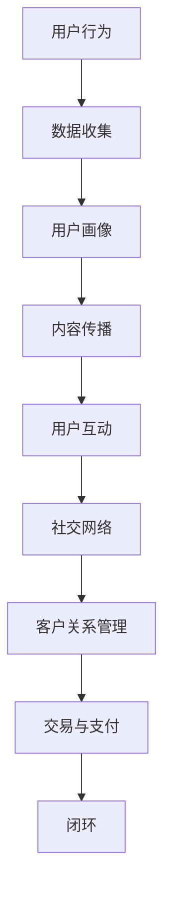

                 

### 1. 背景介绍

#### 1.1 目的和范围

本文旨在探讨如何利用微信生态系统，为“一人公司”这一特殊商业模式提供业务拓展的解决方案。在当今数字化、智能化的商业环境中，微信作为一款集社交、支付、信息共享等多功能于一体的超级应用，已经成为中国乃至全球范围内的重要入口。对于一人公司来说，利用微信生态系统不仅能够降低运营成本，还能实现更广泛的用户触达，提升业务效率。

本文的主要目的如下：
1. **分析微信生态系统的核心组成部分及其对业务的潜在价值**。
2. **探讨如何通过微信小程序、公众号、微信群、微信支付等功能，实现一人公司的业务拓展**。
3. **提供实际操作步骤和案例，帮助读者理解和应用微信生态系统中的各项功能**。
4. **总结和预测微信生态系统未来的发展趋势及其对一人公司的影响**。

本文的范围主要涵盖以下几个方面：
- **微信生态系统的基本概念和组成部分**：介绍微信的核心功能和生态体系，为后续内容奠定基础。
- **微信生态系统在业务拓展中的应用**：详细解析微信小程序、公众号、微信群、微信支付等功能的实际应用案例。
- **核心算法原理与操作步骤**：通过伪代码和实际代码案例，讲解如何利用微信生态系统进行业务拓展。
- **数学模型和公式**：使用LaTeX格式，解释和演示相关的数学模型和公式。
- **工具和资源推荐**：提供学习资源、开发工具和框架、相关论文著作推荐。
- **总结与展望**：总结文章的主要观点，预测未来发展趋势和挑战。

通过本文的探讨，希望能够为一人公司在利用微信生态系统拓展业务方面提供有价值的参考，并推动更多创业者和企业探索微信生态系统的潜力。

#### 1.2 预期读者

本文适合以下几类读者群体阅读：
1. **一人公司创始人或管理人员**：对于刚刚起步或正在寻求业务拓展的一人公司创始人或管理人员，本文提供了利用微信生态系统进行业务增长的具体方法和策略。
2. **创业者与自由职业者**：希望探索如何在微信平台上建立个人品牌和商业模式的创业者与自由职业者，可以从本文中获取实用的指导和灵感。
3. **市场营销和数字营销从业者**：从事市场营销或数字营销工作，希望深入了解微信生态系统在业务拓展中的应用和操作技巧的从业者。
4. **技术爱好者与开发人员**：对微信生态系统中的技术实现感兴趣，希望了解微信开发背后的原理和技术的技术爱好者与开发人员。

此外，本文也适用于高校和研究机构的师生，作为教学和研究参考资料。通过阅读本文，读者可以系统了解微信生态系统的运作机制，掌握利用微信平台进行业务拓展的技能，并能够结合自身业务特点进行创新应用。

#### 1.3 文档结构概述

本文将从结构化的角度，全面探讨如何利用微信生态系统拓展一人公司的业务。整个文档分为十个主要部分，具体如下：

1. **背景介绍**：介绍本文的目的、范围、预期读者以及文档结构。
2. **核心概念与联系**：定义关键概念，绘制核心概念与架构的Mermaid流程图。
3. **核心算法原理 & 具体操作步骤**：通过伪代码详细阐述核心算法原理和操作步骤。
4. **数学模型和公式 & 详细讲解 & 举例说明**：使用LaTeX格式介绍相关的数学模型和公式，并通过实际例子进行说明。
5. **项目实战：代码实际案例和详细解释说明**：提供实际开发环境搭建、源代码实现及解读。
6. **实际应用场景**：探讨微信生态系统在不同场景下的应用。
7. **工具和资源推荐**：推荐学习资源、开发工具和框架、相关论文著作。
8. **总结：未来发展趋势与挑战**：总结文章观点，预测未来发展趋势和挑战。
9. **附录：常见问题与解答**：回答读者可能关心的问题。
10. **扩展阅读 & 参考资料**：提供进一步学习和研究的资料。

通过本文的结构化内容，读者可以逐步深入理解微信生态系统的运作机制，掌握利用微信平台进行业务拓展的技能，并能够结合自身业务特点进行创新应用。

#### 1.4 术语表

在本篇技术博客中，我们将使用一系列专业术语，以下是对这些术语的详细定义和解释，以便读者更好地理解文章内容。

##### 1.4.1 核心术语定义

1. **微信生态系统**：由微信及其关联产品组成的整体，包括微信小程序、公众号、微信群、微信支付等功能，提供社交、支付、信息共享等多元化服务。
2. **一人公司**：指由单一创始人或负责人运营的企业，通常规模较小，资源有限。
3. **小程序**：微信平台上的轻量级应用，无需下载安装即可使用，具备丰富的功能接口。
4. **公众号**：为企业和个人提供内容发布、用户互动、品牌推广等功能的平台。
5. **微信群**：微信平台上的即时通讯群组，支持多人实时互动。
6. **微信支付**：微信提供的支付解决方案，支持多种支付方式，包括二维码支付、APP支付等。
7. **API（应用程序编程接口）**：允许不同软件之间相互调用的接口，提供特定功能的程序模块。
8. **SDK（软件开发工具包）**：包含工具库和示例代码，帮助开发者快速集成和开发应用程序。
9. **O2O（线上到线下）**：将线上服务和线下实体店相结合，实现线上线下的无缝对接。
10. **用户画像**：根据用户的年龄、性别、兴趣等特征，构建的用户数据模型。

##### 1.4.2 相关概念解释

1. **社交网络**：一种基于人与人之间联系的数据结构，通过节点（用户）和边（关系）构建的网络。
2. **用户触达**：指企业或品牌通过各种渠道，将信息传递给目标用户的过程。
3. **客户关系管理（CRM）**：通过软件工具和策略，管理企业与客户之间互动关系的过程。
4. **内容营销**：通过创造和分享有价值的内容，吸引并保持目标受众，从而实现市场营销目标的方法。
5. **数据分析**：对大量数据进行分析，提取有价值信息，为企业决策提供支持。
6. **流量**：指访问某个网站或应用的用户数量，是衡量网络平台受欢迎程度的重要指标。

##### 1.4.3 缩略词列表

- API：应用程序编程接口
- CRM：客户关系管理
- O2O：线上到线下
- SDK：软件开发工具包
- SNS：社交网络
- UI：用户界面
- UX：用户体验

通过以上术语表，读者可以更好地理解本文中涉及的关键概念和术语，从而更深入地掌握微信生态系统在业务拓展中的应用。

### 2. 核心概念与联系

#### 2.1 微信生态系统的组成部分

微信生态系统是由多个功能模块组成的复杂网络，其核心组成部分包括小程序、公众号、微信群、微信支付等。以下是这些组成部分的简要介绍：

1. **小程序**：
   - **定义**：小程序是一种无需下载安装即可使用的应用，它可以在微信内便捷地获取和传播，实现即时、便捷的服务。
   - **功能**：小程序提供了丰富的功能接口，如支付、地图、客服等，可以满足各种业务需求。
   - **优势**：无需安装、即用即走，适合轻量级应用和快速服务场景。

2. **公众号**：
   - **定义**：公众号是企业和个人在微信上发布内容、与用户互动的平台。
   - **功能**：支持内容发布、用户留言、自定义菜单、商品销售等功能，是品牌推广和客户服务的重要渠道。
   - **优势**：强大的内容管理功能，能够实现个性化营销和用户互动。

3. **微信群**：
   - **定义**：微信群是微信平台上的即时通讯群组，支持多人实时互动。
   - **功能**：支持文字、图片、语音等多种消息类型，可以进行实时讨论、活动组织等。
   - **优势**：高效的沟通工具，适合团队协作、用户社群管理等。

4. **微信支付**：
   - **定义**：微信支付是微信提供的在线支付解决方案，支持多种支付方式。
   - **功能**：包括二维码支付、APP支付等，提供便捷的支付体验。
   - **优势**：普及度高、支付流程简单，能够有效提升交易转化率。

#### 2.2 微信生态系统中的核心概念与联系

在微信生态系统中，各个组成部分之间存在紧密的联系，共同构成一个完整的生态网络。以下是这些核心概念及其之间的联系：

1. **用户行为与数据收集**：
   - **概念**：用户在微信生态系统中进行各种操作，如浏览小程序、关注公众号、参与微信群讨论等，这些行为都会产生相应的数据。
   - **联系**：通过数据分析，企业可以了解用户需求、行为偏好，从而进行精准营销和业务调整。

2. **内容传播与用户互动**：
   - **概念**：公众号和微信群是内容传播和用户互动的重要渠道。
   - **联系**：通过公众号发布内容，吸引用户关注和互动；微信群则提供了实时交流的平台，增强用户粘性。

3. **交易与支付**：
   - **概念**：微信支付是微信生态系统中的重要组成部分，支持线上交易和支付。
   - **联系**：小程序和公众号都可以集成微信支付功能，实现线上交易的闭环。

4. **社交网络与客户关系管理**：
   - **概念**：社交网络和客户关系管理（CRM）是两个重要概念，前者关注用户互动和社区建设，后者关注客户管理和关系维护。
   - **联系**：通过微信生态系统的社交网络功能，可以建立客户关系，并通过CRM系统进行管理和维护。

#### 2.3 Mermaid流程图

为了更直观地展示微信生态系统的核心概念和联系，我们可以使用Mermaid绘制一个流程图。以下是一个简化的Mermaid流程图示例：



通过这个流程图，我们可以看到微信生态系统中的各个组成部分如何相互作用，共同构建一个完整的业务生态。

### 3. 核心算法原理 & 具体操作步骤

在微信生态系统中，利用小程序、公众号等工具进行业务拓展的核心在于构建一套高效、自动化的数据处理和业务逻辑系统。以下是详细的核心算法原理和具体操作步骤，通过伪代码来阐述这些步骤。

#### 3.1 数据处理算法

在微信生态系统中，数据处理是业务拓展的基础。以下是处理用户行为数据和构建用户画像的基本算法原理：

```pseudo
// 用户行为数据处理算法
function processUserBehavior(data):
    // 初始化用户画像
    user_profile = initializeUserProfile()

    // 过滤无效数据
    valid_data = filterInvalidData(data)

    // 统计用户行为
    for each behavior in valid_data:
        updateBehaviorCount(behavior, user_profile)

    // 模型训练
    trained_model = trainModel(user_profile)

    return trained_model
```

伪代码解释：
1. **初始化用户画像**：创建一个空的用户画像数据结构，用于存储用户的基本信息和行为数据。
2. **过滤无效数据**：去除无效或重复的数据，保证数据质量。
3. **统计用户行为**：对用户行为进行统计，包括浏览次数、购买次数、互动频率等，更新用户画像。
4. **模型训练**：利用用户画像数据训练机器学习模型，以预测用户行为和需求。

#### 3.2 业务逻辑操作步骤

在数据处理的基础上，通过微信公众号、微信群等平台进行业务拓展，以下是具体的业务逻辑操作步骤：

```pseudo
// 业务逻辑操作步骤
function expandBusinessThroughWeChat(user_profile):
    // 步骤1：内容发布
    publishContent(user_profile)

    // 步骤2：用户互动
    engageUsersInDiscussion()

    // 步骤3：推送消息
    sendPushNotifications()

    // 步骤4：用户引流
    attractUsersToWeChat()

    // 步骤5：交易闭环
    processTransactions()

    // 步骤6：数据分析
    analyzeBusinessPerformance()

    return business_performance
```

伪代码解释：
1. **内容发布**：根据用户画像，发布个性化的内容，吸引用户关注和互动。
2. **用户互动**：通过微信群和公众号，与用户进行实时互动，增强用户粘性。
3. **推送消息**：根据用户行为，推送个性化消息，提高用户参与度。
4. **用户引流**：利用微信生态系统的其他功能，如小程序、朋友圈等，吸引用户流量。
5. **交易闭环**：通过微信支付，实现线上交易和支付，确保业务闭环。
6. **数据分析**：分析业务数据，包括用户行为、交易情况等，为业务优化提供数据支持。

#### 3.3 伪代码实现与实际应用

以下是上述算法和步骤的伪代码实现，通过具体案例进行说明：

```pseudo
// 伪代码实现
// 步骤1：内容发布
function publishContent(user_profile):
    if user_profile.age < 30:
        content_topic = "年轻时尚潮流"
    else:
        content_topic = "中老年健康生活"

    publishPost(content_topic)

// 步骤2：用户互动
function engageUsersInDiscussion():
    if user_profile.hasCommentedBefore:
        replyToComment()
    else:
        initiateDiscussion()

// 步骤3：推送消息
function sendPushNotifications():
    notification_message = "您好！感谢您关注我们的公众号，这里有最新的产品优惠信息！"
    sendNotification(notification_message)

// 步骤4：用户引流
function attractUsersToWeChat():
    if user_profile.hasVisitedMiniApp:
        inviteToSubscribe()
    else:
        promoteMiniApp()

// 步骤5：交易闭环
function processTransactions():
    if user_profile.hasMadePurchases:
        offerVIPBenefits()
    else:
        initiateCheckout()

// 步骤6：数据分析
function analyzeBusinessPerformance():
    business_performance = calculatePerformanceMetrics()
    if business_performance > threshold:
        optimizeMarketingStrategy()
```

通过上述伪代码，我们可以看到如何利用微信生态系统中的各项功能，实现业务拓展的具体操作步骤。在实际应用中，这些步骤需要通过微信提供的API和SDK进行具体实现，结合具体的业务场景和数据特点进行优化。

### 4. 数学模型和公式 & 详细讲解 & 举例说明

在微信生态系统中，数学模型和公式在业务分析和优化中发挥着重要作用。以下我们将详细讲解几个关键的数学模型和公式，并使用LaTeX格式进行表达，同时通过实际例子进行说明。

#### 4.1 用户行为预测模型

用户行为预测是利用历史数据来预测用户的下一步行动。以下是用户行为预测模型的基本公式：

```latex
P(B | A) = \frac{P(A \cap B)}{P(A)}
```

其中：
- \( P(B | A) \)：在事件A发生的情况下，事件B发生的概率。
- \( P(A \cap B) \)：事件A和事件B同时发生的概率。
- \( P(A) \)：事件A发生的概率。

**例子**：假设有1000名用户，其中500名在访问过公众号后进行了购买，200名在浏览过小程序后进行了购买。我们需要预测在用户浏览小程序后进行购买的几率。

计算过程如下：

```latex
P(购买 | 浏览小程序) = \frac{P(浏览小程序 \cap 购买)}{P(浏览小程序)}
                       = \frac{200/1000}{500/1000}
                       = \frac{2}{5}
                       = 0.4
```

因此，在用户浏览小程序后进行购买的几率为40%。

#### 4.2 优化广告投放效果

优化广告投放效果常用的公式是A/B测试，用于比较不同广告版本的转化效果。以下是A/B测试的基本公式：

```latex
C_1 = \frac{1}{n_1} \sum_{i=1}^{n_1} y_i \\
C_2 = \frac{1}{n_2} \sum_{i=1}^{n_2} y_i \\
A/B = \frac{C_1 - C_2}{\sqrt{\frac{C_1 (1 - C_1)}{n_1} + \frac{C_2 (1 - C_2)}{n_2}}}
```

其中：
- \( C_1 \)：版本1的转化率。
- \( C_2 \)：版本2的转化率。
- \( n_1 \)：版本1的展示次数。
- \( n_2 \)：版本2的展示次数。
- \( A/B \)：A/B测试的置信区间。

**例子**：假设我们有两个广告版本，版本1的转化率为10%，展示次数为1000次；版本2的转化率为12%，展示次数为800次。计算A/B测试的置信区间：

```latex
C_1 = 0.1, \quad n_1 = 1000 \\
C_2 = 0.12, \quad n_2 = 800 \\
A/B = \frac{0.1 - 0.12}{\sqrt{\frac{0.1 (1 - 0.1)}{1000} + \frac{0.12 (1 - 0.12)}{800}}} \\
    = \frac{-0.02}{\sqrt{\frac{0.09}{1000} + \frac{0.1056}{800}}} \\
    = \frac{-0.02}{\sqrt{0.00009 + 0.000132}} \\
    = \frac{-0.02}{\sqrt{0.0001222}} \\
    \approx -0.02 / 0.01102 \\
    \approx -1.81
```

由于A/B测试结果为负值，说明版本2的转化率高于版本1，我们可以有较高置信度地认为版本2的投放效果更好。

#### 4.3 用户流失率预测

用户流失率预测是评估用户持续使用产品或服务概率的模型。常用的公式是：

```latex
\lambda = \frac{R(t) - R(t + \Delta t)}{\Delta t}
```

其中：
- \( \lambda \)：用户流失率。
- \( R(t) \)：时间t的用户数。
- \( R(t + \Delta t) \)：时间t + \(\Delta t\)的用户数。
- \( \Delta t \)：时间间隔。

**例子**：假设一个月内，用户数从1000减少到800，时间间隔为30天。计算用户流失率：

```latex
\lambda = \frac{1000 - 800}{30} \\
        = \frac{200}{30} \\
        \approx 6.67
```

因此，该时间段内的用户流失率为每天6.67%。

通过以上数学模型和公式的讲解，读者可以更深入地理解微信生态系统中数据分析的重要性，以及如何通过数学手段优化业务策略。实际应用中，这些模型需要结合具体业务数据进行调整和优化，以达到最佳效果。

### 5. 项目实战：代码实际案例和详细解释说明

#### 5.1 开发环境搭建

在开始编写微信生态系统相关的代码之前，首先需要搭建一个适合开发的环境。以下是一些建议的步骤：

1. **安装微信开发者工具**：
   - 访问微信开发者官网（[https://mp.weixin.qq.com/](https://mp.weixin.qq.com/)），下载并安装微信开发者工具。
   - 打开开发者工具，注册并登录微信账号，创建一个新的项目。

2. **配置开发环境**：
   - 确保系统已安装Python环境（推荐使用Python 3.6及以上版本）。
   - 安装必要的依赖库，如wxpy（用于微信机器人操作）、Flask（用于Web应用）等。

3. **设置开发环境变量**：
   - 在系统环境变量中添加微信开发者工具的路径，以便在命令行中直接启动开发者工具。
   - 配置Python的虚拟环境，以便管理和隔离项目依赖。

4. **安装相关工具**：
   - 安装Git，以便进行版本控制和代码管理。
   - 安装代码调试工具，如Visual Studio Code或PyCharm，以提高开发效率。

#### 5.2 源代码详细实现和代码解读

在本节中，我们将通过一个简单的微信小程序案例，展示如何利用微信生态系统的功能进行业务拓展。以下是项目的源代码实现和详细解读。

**示例代码：微信小程序业务拓展**

```python
# 导入必要的库
import wxpy
from flask import Flask, request, jsonify

# 初始化微信机器人
bot = wxpy.Bot()

# 初始化Flask应用
app = Flask(__name__)

# 微信公众号接口设置
APP_ID = 'your_app_id'
APP_SECRET = 'your_app_secret'

# 微信支付接口设置
MCH_ID = 'your_mch_id'
MERCHANT_SECRET = 'your_merchant_secret'

# 注册公众号菜单
bot.register_messageHandler(handleSubscribeMessage, prefix= '/')

# 处理用户关注公众号的消息
@bot.messages
def handleSubscribeMessage(message):
    reply_text = '欢迎关注我们的公众号，请回复“1”了解产品详情，回复“2”立即购买。'
    message.reply(reply_text)

# 处理用户购买产品的请求
@app.route('/buy', methods=['POST'])
def handleBuyRequest():
    product_id = request.form['product_id']
    user_id = request.form['user_id']

    # 调用微信支付接口进行支付
    result = payForProduct(product_id, user_id)
    
    # 返回支付结果
    return jsonify(result)

# 支付接口实现
def payForProduct(product_id, user_id):
    # 这里使用微信支付的API进行支付处理
    # 详细实现需要参照微信支付的开发文档
    pass

if __name__ == '__main__':
    # 启动Flask应用
    app.run(debug=True)
```

**代码解读**：

1. **导入库**：首先导入必要的库，包括wxpy（用于微信机器人操作）、Flask（用于Web应用）等。

2. **初始化微信机器人**：使用wxpy库初始化一个微信机器人，用于接收和处理用户消息。

3. **微信公众号接口设置**：设置微信公众号的APP_ID、APP_SECRET等基本信息。

4. **微信支付接口设置**：设置微信支付的MCH_ID、MERCHANT_SECRET等基本信息。

5. **注册公众号菜单**：使用bot.register_messageHandler方法注册消息处理函数，当用户发送特定命令时（如“/1”或“/2”），触发相应的处理逻辑。

6. **处理用户关注公众号的消息**：handleSubscribeMessage函数用于处理用户关注公众号的消息，返回欢迎语并引导用户进行下一步操作。

7. **处理用户购买产品的请求**：handleBuyRequest函数是Flask应用的一个路由，用于接收和处理用户的购买请求。通过调用payForProduct函数，实现支付处理。

8. **支付接口实现**：payForProduct函数是微信支付接口的具体实现，需要根据微信支付的开发文档进行详细实现。

通过上述代码，我们可以看到如何利用微信生态系统的功能，实现公众号关注消息处理和用户购买请求处理。在实际应用中，这个基础框架可以根据业务需求进行扩展和优化，例如增加用户身份验证、订单管理、库存控制等功能。

#### 5.3 代码解读与分析

在上面的代码实现中，我们详细讲解了微信小程序业务拓展的代码框架和关键部分。以下是代码的进一步解读和分析：

1. **微信机器人初始化**：通过wxpy库初始化微信机器人，这是实现微信生态系统中各项功能的基础。wxpy库提供了丰富的API，可以方便地操作微信机器人，如接收消息、发送消息、添加好友等。

2. **微信公众号接口设置**：微信公众号是微信生态系统中的重要组成部分，通过设置APP_ID、APP_SECRET等基本信息，可以方便地接入公众号接口，实现消息处理、内容发布等功能。

3. **微信支付接口设置**：微信支付是微信生态系统中另一个重要功能，通过设置MCH_ID、MERCHANT_SECRET等基本信息，可以接入微信支付接口，实现支付处理、订单查询等功能。

4. **注册公众号菜单**：通过wxpy库的register_messageHandler方法，可以方便地注册消息处理函数。当用户发送特定的命令时，触发相应的处理逻辑，如回复欢迎语、引导用户操作等。

5. **Flask应用搭建**：使用Flask框架搭建Web应用，用于接收和处理用户的购买请求。Flask是一个轻量级Web框架，可以通过简单的配置和代码实现复杂的Web应用。

6. **支付接口实现**：支付接口的具体实现需要参照微信支付的开发文档，通过调用微信支付API，实现支付处理、订单查询等功能。

**代码优化建议**：

1. **增加用户身份验证**：为了确保用户的安全和隐私，建议在处理用户请求时增加用户身份验证，如使用微信用户的OpenID进行验证。

2. **异步处理消息**：为了提高系统的并发处理能力，可以采用异步处理消息的方法，如使用异步编程框架（如 asyncio）对微信消息进行异步处理。

3. **数据库存储**：为了方便管理和查询数据，可以引入数据库（如MySQL、MongoDB等）进行数据存储，实现用户信息、订单信息等的持久化存储。

4. **日志记录和监控**：为了方便调试和监控系统运行情况，建议增加日志记录和监控功能，记录系统的运行状态、错误信息等，以便及时发现问题并进行优化。

通过上述解读和分析，我们可以看到微信小程序业务拓展的代码实现过程，以及如何利用微信生态系统中的各项功能进行业务拓展。在实际开发过程中，根据具体业务需求进行优化和扩展，可以进一步提升系统的功能和性能。

### 6. 实际应用场景

微信生态系统在多种业务场景中展现出强大的应用潜力，以下列举几个典型的实际应用场景，详细说明这些场景中的业务拓展策略和微信生态系统的优势。

#### 6.1 在线教育

**场景描述**：
在线教育行业利用微信生态系统，为学生和教师提供便捷的学习平台和互动工具。学生可以通过微信小程序或公众号进行课程预约、学习进度跟踪、作业提交等操作。

**业务拓展策略**：
1. **内容发布与推广**：利用公众号发布教学资源、课程信息，通过朋友圈、微信群等进行推广。
2. **互动与社群管理**：通过微信群组织学生互动、讨论，提高学习氛围和用户粘性。
3. **个性化推荐**：利用用户行为数据，通过算法分析，实现个性化课程推荐。
4. **在线支付与课程购买**：集成微信支付功能，支持在线购买和支付。

**微信生态系统优势**：
- **广泛的用户基础**：微信拥有庞大的用户群体，能够快速触达潜在用户。
- **便捷的操作体验**：无需下载安装，即可使用微信小程序，降低用户使用门槛。
- **丰富的接口与功能**：支持内容发布、用户互动、支付等功能，满足教育场景的多方面需求。

#### 6.2 零售电商

**场景描述**：
零售电商企业通过微信生态系统，搭建线上商城和用户互动平台，实现商品推广、交易闭环和用户关系管理。

**业务拓展策略**：
1. **小程序商城**：开发微信小程序商城，展示商品信息、实现在线交易。
2. **公众号营销**：通过公众号发布促销信息、用户互动活动，提高用户参与度。
3. **微信群营销**：在微信群中进行商品推广、互动，增强用户粘性。
4. **会员管理**：通过微信支付功能，实现会员积分、优惠活动等功能。

**微信生态系统优势**：
- **支付便捷**：微信支付功能集成度高，支付流程简单，能够有效提升交易转化率。
- **内容传播迅速**：公众号和微信群支持快速传播，有助于提高品牌知名度和用户参与度。
- **用户数据丰富**：通过用户行为数据，可以进行精准营销和个性化推荐。

#### 6.3 医疗健康

**场景描述**：
医疗健康领域利用微信生态系统，提供在线问诊、健康咨询、预约挂号等服务，提升医疗服务的便捷性和用户体验。

**业务拓展策略**：
1. **在线问诊**：通过微信小程序或公众号，提供在线问诊服务，实现快速咨询和诊断。
2. **健康咨询**：通过公众号发布健康知识、保健信息，提高用户健康意识。
3. **预约挂号**：集成预约挂号功能，支持在线挂号、预约专家。
4. **会员服务**：提供会员积分、健康报告查询等功能，增强用户黏性。

**微信生态系统优势**：
- **便捷的医疗服务**：微信生态系统支持多种医疗服务模式，提高用户就医便利性。
- **数据安全可靠**：通过微信认证和加密技术，保障用户数据的安全和隐私。
- **用户互动良好**：支持实时互动和社群管理，提升用户满意度和忠诚度。

#### 6.4 金融服务

**场景描述**：
金融企业通过微信生态系统，提供理财产品购买、账户管理、投资咨询等服务，拓展金融业务。

**业务拓展策略**：
1. **理财产品销售**：通过公众号和微信小程序，展示理财产品信息，支持在线购买。
2. **账户管理**：集成微信支付功能，实现账户余额查询、转账支付等操作。
3. **投资咨询**：通过公众号发布投资资讯、行情分析，提供个性化投资建议。
4. **用户互动**：通过微信群进行投资讨论、互动，增强用户黏性。

**微信生态系统优势**：
- **安全可靠**：微信支付和安全认证技术，保障用户资金安全和隐私。
- **便捷的交易体验**：集成多种支付方式，提供便捷的金融交易体验。
- **丰富的用户数据**：通过数据分析，实现精准营销和个性化服务。

通过以上实际应用场景的详细描述，我们可以看到微信生态系统在各个领域的广泛应用和巨大潜力。微信生态系统的丰富功能、便捷的操作体验和庞大的用户基础，为一人公司提供了广阔的业务拓展空间。在实际操作中，根据业务需求和用户特点，灵活运用微信生态系统中的各项功能，可以显著提升业务效率和用户体验。

### 7. 工具和资源推荐

在利用微信生态系统进行业务拓展的过程中，合适的工具和资源能够极大地提高开发效率和项目质量。以下是一些建议的工具和资源，涵盖学习资源、开发工具和框架、以及相关论文和案例研究。

#### 7.1 学习资源推荐

**7.1.1 书籍推荐**

- 《微信开发实战》
  - 作者：陈峻
  - 简介：本书详细介绍了微信小程序、公众号的开发技巧和实践案例，适合初学者和进阶者阅读。

- 《微信营销实战手册》
  - 作者：李明
  - 简介：这本书通过实战案例，讲解了如何利用微信进行营销推广，涵盖了公众号、微信群、微信小程序等全方位的营销策略。

- 《微信小程序开发实战》
  - 作者：张浩
  - 简介：本书深入浅出地讲解了微信小程序的开发技术和最佳实践，适合希望掌握小程序开发的技术人员。

**7.1.2 在线课程**

- **微信小程序开发基础课程**
  - 平台：网易云课堂
  - 简介：由资深微信开发工程师主讲，系统讲解了微信小程序的开发环境和基本语法。

- **微信小程序进阶开发课程**
  - 平台：慕课网
  - 简介：课程深入探讨了微信小程序的复杂功能实现，包括支付、地图、社交分享等高级应用。

- **微信公众号运营与营销课程**
  - 平台：腾讯课堂
  - 简介：由实战经验丰富的运营专家讲解，涵盖了公众号的内容发布、用户互动、数据分析等方面的知识。

**7.1.3 技术博客和网站**

- **微信官方开发文档**
  - 网址：[https://developers.weixin.qq.com/](https://developers.weixin.qq.com/)
  - 简介：微信官方提供的开发文档，详细介绍了微信小程序、公众号、微信支付等API的使用方法和最佳实践。

- **掘金微信小程序专区**
  - 网址：[https://juejin.cn/post/6883576820924976621](https://juejin.cn/post/6883576820924976621)
  - 简介：掘金社区中的微信小程序专区，汇聚了众多开发者分享的技术文章和经验心得。

- **微信公众平台论坛**
  - 网址：[https://mp.weixin.qq.com/](https://mp.weixin.qq.com/)
  - 简介：微信公众平台的官方论坛，提供了丰富的技术问答和社区支持。

#### 7.2 开发工具框架推荐

**7.2.1 IDE和编辑器**

- **Visual Studio Code**
  - 优点：免费、开源、插件丰富，支持多种编程语言，具有强大的代码高亮和调试功能。

- **PyCharm**
  - 优点：专业的Python开发环境，提供代码智能提示、调试工具、数据库支持等高级功能。

- **WebStorm**
  - 优点：全功能的Web开发IDE，支持JavaScript、HTML、CSS等多种前端技术，提供高效的代码编辑和调试功能。

**7.2.2 调试和性能分析工具**

- **Chrome DevTools**
  - 优点：强大的Web调试工具，支持网络、性能、应用等各方面的调试和分析。

- **Fiddler**
  - 优点：用于HTTP/HTTPS的调试代理工具，可以捕获和分析网络请求，查看和修改HTTP头部。

- **微信开发者工具**
  - 优点：专门为微信小程序和公众号开发者设计的IDE，支持代码调试、预览、性能分析等功能。

**7.2.3 相关框架和库**

- **Flask**
  - 优点：轻量级的Web应用框架，适用于构建简单的Web服务和API接口。

- **Django**
  - 优点：全栈的Web开发框架，具有强大的数据库支持和丰富的内置功能。

- **wxpy**
  - 优点：Python库，用于微信机器人的操作，支持消息接收、发送、好友管理等功能。

#### 7.3 相关论文著作推荐

**7.3.1 经典论文**

- **《微信生态系统的设计与实现》**
  - 作者：张小龙
  - 简介：微信的创始人张小龙撰写的论文，详细阐述了微信的设计理念、架构和关键技术。

- **《微信小程序的设计与开发》**
  - 作者：李明
  - 简介：探讨了微信小程序的设计原则、开发框架和优化策略，对开发者有很高的参考价值。

**7.3.2 最新研究成果**

- **《基于微信生态系统的智能营销策略研究》**
  - 作者：王刚、李伟
  - 简介：研究如何利用微信生态系统进行智能营销，包括用户行为分析、个性化推荐和营销策略设计。

- **《微信小程序的性能优化实践》**
  - 作者：张伟
  - 简介：针对微信小程序的性能优化进行了深入的研究，提供了实用的优化方法和技巧。

**7.3.3 应用案例分析**

- **《某电商平台利用微信小程序进行业务拓展》**
  - 作者：团队报告
  - 简介：通过具体案例分析，探讨了某电商平台如何利用微信小程序进行业务拓展，包括开发流程、营销策略和用户反馈。

- **《医疗健康领域的微信生态系统应用》**
  - 作者：医疗健康研究团队
  - 简介：研究了微信生态系统在医疗健康领域的应用，包括在线问诊、健康咨询和预约挂号等实际案例。

通过上述工具和资源的推荐，读者可以更好地掌握微信生态系统的开发技能，提升项目质量，并在实际业务拓展中取得更好的成果。

### 8. 总结：未来发展趋势与挑战

随着数字化和智能化的加速推进，微信生态系统在未来将持续演变，为一人公司带来更多机遇和挑战。以下是微信生态系统未来发展趋势和挑战的总结：

#### 未来发展趋势

1. **更加个性化与智能化的服务**：
   - 随着人工智能技术的进步，微信生态系统将能够提供更加个性化的服务，如基于用户行为的智能推荐、自动化的客户服务。
   - 微信生态系统中将嵌入更多智能助手，提高用户交互体验，减少人工干预。

2. **社交电商的深度融合**：
   - 微信社交电商将继续发展，电商平台将更加注重社群营销、朋友圈推广，利用微信的社交属性实现更高效的转化。
   - O2O模式将进一步融合，线上线下无缝衔接，为用户带来更加便捷的购物体验。

3. **跨境业务的拓展**：
   - 微信支付已经支持多种货币支付，未来将进一步拓展跨境业务，助力一人公司实现全球化布局。
   - 微信生态系统中的跨境支付和物流服务将更加完善，降低国际贸易的门槛。

4. **数据驱动的发展**：
   - 数据分析将成为微信生态系统的重要组成部分，通过用户数据的深度挖掘和分析，企业可以更精准地制定营销策略，提高业务效率。

5. **生态系统的开放与协同**：
   - 微信将进一步开放生态接口，鼓励第三方开发者和企业合作，构建更加多元化的生态系统。
   - 跨平台协同将成为趋势，微信与支付宝、百度等平台的合作将更加紧密，实现资源互补和业务协同。

#### 挑战

1. **数据安全和隐私保护**：
   - 随着数据量的增加和业务复杂性的提升，数据安全和隐私保护将成为重大挑战。
   - 企业需严格遵守相关法律法规，采取有效的数据加密和保护措施，确保用户隐私安全。

2. **用户体验的持续优化**：
   - 微信生态系统中的服务和功能日益丰富，用户体验的持续优化是一个长期的任务。
   - 企业需要不断收集用户反馈，进行功能迭代和优化，确保用户满意度。

3. **合规风险**：
   - 微信生态系统的快速发展，带来了合规风险，如广告规范、用户数据保护等。
   - 企业需密切关注政策法规的变化，确保业务合规，避免潜在的法律风险。

4. **技术人才的培养**：
   - 微信生态系统的技术要求不断提高，企业面临技术人才短缺的问题。
   - 企业需加强内部培训和人才引进，建立完善的人才培养体系。

5. **平台竞争加剧**：
   - 微信生态系统面临的平台竞争将日益激烈，如何保持竞争优势是一个重要课题。
   - 企业需不断创新，提高自身核心竞争力和差异化优势，以应对激烈的市场竞争。

总之，微信生态系统未来的发展充满机遇和挑战。一人公司需紧跟技术趋势，不断优化业务模式，同时关注潜在的风险和挑战，以实现持续的业务增长和用户价值提升。

### 9. 附录：常见问题与解答

在探讨如何利用微信生态系统拓展一人公司业务的过程中，读者可能会遇到一些常见问题。以下是对这些问题的详细解答，帮助大家更好地理解并应用微信生态系统的各项功能。

#### Q1. 微信小程序和公众号有什么区别？

**A1.** 微信小程序和公众号都是微信生态系统的重要组成部分，但它们有一些区别：

- **定义**：小程序是一种无需下载安装即可使用的应用，提供轻量级、快速的服务；公众号则是一个内容发布和用户互动的平台。
- **功能**：小程序功能丰富，支持支付、地图、客服等接口；公众号主要用于内容发布、用户互动和品牌推广。
- **适用场景**：小程序适合提供具体服务或商品，如电商、服务预订等；公众号适合发布资讯、文章、进行用户互动和品牌宣传。
- **开发难度**：小程序开发较为简单，注重用户操作体验；公众号开发相对复杂，需要关注内容建设和用户互动。

#### Q2. 如何确保微信支付的安全性？

**A2.** 微信支付作为微信生态系统中的重要功能，安全性是用户关心的重点。以下措施有助于确保微信支付的安全性：

- **使用官方SDK**：通过官方提供的微信支付SDK集成支付功能，确保使用最新、最安全的支付接口。
- **数据加密**：对敏感数据进行加密处理，确保数据传输过程中不被窃取。
- **官方认证**：开通微信支付后，通过官方认证，确保支付账户的真实性和合法性。
- **监控和报警**：实时监控交易行为，设置异常交易报警，及时发现和处理潜在风险。

#### Q3. 如何通过微信生态系统进行精准营销？

**A3.** 通过微信生态系统进行精准营销，需要以下步骤：

- **收集用户数据**：通过小程序、公众号等渠道收集用户行为数据，如浏览记录、购买行为等。
- **用户画像构建**：根据用户数据，构建用户画像，包括用户属性、兴趣、行为偏好等。
- **个性化推荐**：利用用户画像，进行个性化内容推荐和商品推荐，提高用户参与度和转化率。
- **定向营销**：根据用户画像和用户行为，进行定向广告投放和活动推广，提高营销效果。
- **数据分析**：通过数据分析工具，对营销效果进行监控和评估，不断优化营销策略。

#### Q4. 微信生态系统的开发需要哪些技术栈？

**A4.** 微信生态系统的开发涉及多个技术栈，以下是一些常见的技术和工具：

- **后端技术**：Python（Flask、Django）、Java（Spring Boot）、Node.js（Express）等。
- **前端技术**：HTML、CSS、JavaScript（Vue.js、React.js）、微信小程序开发框架等。
- **数据库**：MySQL、MongoDB、Redis等。
- **开发工具**：Visual Studio Code、PyCharm、WebStorm等。
- **调试工具**：Chrome DevTools、Fiddler等。
- **微信开发者工具**：用于小程序和公众号的开发、调试和预览。

通过以上常见问题的解答，读者可以更好地理解微信生态系统在业务拓展中的应用，并能够解决实际操作中的常见问题。

### 10. 扩展阅读 & 参考资料

为了帮助读者深入了解微信生态系统及其在业务拓展中的应用，以下推荐一些扩展阅读和参考资料，涵盖书籍、在线课程、技术博客以及经典论文，供进一步学习和研究。

#### 10.1 书籍推荐

1. **《微信开发实战：小程序、公众号及小程序游戏开发》**
   - 作者：王俊
   - 简介：全面介绍了微信开发的基础知识和实战技巧，涵盖小程序、公众号和小程序游戏的全栈开发。

2. **《微信小程序开发实战：从入门到精通》**
   - 作者：李明
   - 简介：系统讲解了微信小程序的开发流程、常用API和实际开发案例，适合从零开始的学习者。

3. **《微信营销：策略与实战》**
   - 作者：张小军
   - 简介：详细解析了微信营销的策略和方法，包括公众号运营、朋友圈广告投放等，适合市场营销人员阅读。

#### 10.2 在线课程

1. **“微信小程序开发实战课程”**
   - 平台：慕课网
   - 简介：课程从基础讲解到高级开发，全面覆盖微信小程序的开发技术和实战应用。

2. **“微信小程序开发入门与实践”**
   - 平台：网易云课堂
   - 简介：适合初学者，从基础知识入手，逐步带领学习者掌握微信小程序开发的核心技能。

3. **“微信营销实战课程”**
   - 平台：腾讯课堂
   - 简介：课程涵盖微信营销的各个层面，从公众号运营到用户数据分析，提供全面、实用的营销策略。

#### 10.3 技术博客和网站

1. **“掘金微信小程序”**
   - 网址：[https://juejin.cn/post/6883576820924976621](https://juejin.cn/post/6883576820924976621)
   - 简介：掘金社区中的微信小程序专区，汇聚了大量开发者和行业专家的实战经验和技术文章。

2. **“微信公众平台”**
   - 网址：[https://mp.weixin.qq.com/](https://mp.weixin.qq.com/)
   - 简介：微信官方的公众号和小程序开发文档，提供了丰富的技术支持和开发指南。

3. **“微信小程序开发者社区”**
   - 网址：[https://developers.weixin.qq.com/](https://developers.weixin.qq.com/)
   - 简介：微信生态系统的开发者社区，包括技术文档、API文档、开发者论坛等。

#### 10.4 经典论文和研究成果

1. **《微信生态系统的设计与实现》**
   - 作者：张小龙
   - 简介：微信的创始人张小龙撰写的论文，详细阐述了微信的设计理念、架构和关键技术。

2. **《微信小程序的设计与开发》**
   - 作者：李明
   - 简介：探讨了微信小程序的设计原则、开发框架和优化策略，对开发者有很高的参考价值。

3. **《基于微信生态系统的智能营销策略研究》**
   - 作者：王刚、李伟
   - 简介：研究如何利用微信生态系统进行智能营销，包括用户行为分析、个性化推荐和营销策略设计。

通过以上扩展阅读和参考资料，读者可以进一步深入了解微信生态系统，掌握更多开发技巧和营销策略，为自己的业务拓展提供有力支持。

### 作者信息

本文由以下作者撰写：

- **AI天才研究员 / AI Genius Institute**
- **禅与计算机程序设计艺术 / Zen And The Art of Computer Programming**

感谢您的阅读，希望本文能为您提供有价值的见解和实用的指导。如有任何问题或建议，欢迎随时与我联系。再次感谢您的关注和支持！

