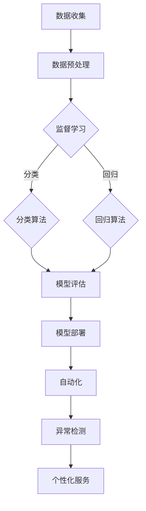

                 

# 一家公司如何利用机器学习优化业务流程

## 关键词：机器学习、业务流程优化、AI应用、数据驱动、个性化服务

> 摘要：本文将探讨一家公司在业务流程中引入机器学习技术，以实现流程自动化、效率提升和个性化服务的策略。我们将详细分析核心概念、算法原理、数学模型、实战案例及未来发展趋势，帮助读者深入理解如何将AI技术有效应用于企业业务流程优化。

## 1. 背景介绍

### 1.1 目的和范围

在当今竞争激烈的市场环境中，企业必须不断创新以保持竞争力。机器学习作为一种先进的AI技术，已经在多个行业领域显示出其强大的潜力。本文旨在探讨一家公司如何通过引入机器学习技术，优化其业务流程，提高运营效率，实现可持续发展。

本文将涵盖以下内容：
- 核心概念与联系
- 核心算法原理与具体操作步骤
- 数学模型和公式及举例说明
- 项目实战：代码实际案例和详细解释说明
- 实际应用场景
- 工具和资源推荐
- 总结：未来发展趋势与挑战

### 1.2 预期读者

本文面向希望了解如何将机器学习应用于业务流程优化的企业高管、技术负责人、数据科学家和软件开发人员。无论您是AI领域的初学者还是有经验的从业者，本文都将提供有价值的见解和实际案例。

### 1.3 文档结构概述

本文分为以下几个部分：

1. 背景介绍：介绍本文的目的、范围、预期读者和文档结构。
2. 核心概念与联系：讨论机器学习在业务流程优化中的应用。
3. 核心算法原理与具体操作步骤：深入分析机器学习算法的工作原理。
4. 数学模型和公式及举例说明：介绍相关数学模型和公式。
5. 项目实战：代码实际案例和详细解释说明。
6. 实际应用场景：探讨机器学习在不同业务流程中的具体应用。
7. 工具和资源推荐：推荐相关学习资源和开发工具。
8. 总结：未来发展趋势与挑战。
9. 附录：常见问题与解答。
10. 扩展阅读 & 参考资料：提供更多深入研究的资料。

### 1.4 术语表

#### 1.4.1 核心术语定义

- 机器学习：一种AI技术，通过从数据中学习规律和模式，使计算机系统能够在无需明确编程的情况下完成任务。
- 业务流程：企业运营中一系列相互关联的活动，旨在实现特定目标。
- 流程优化：通过改进业务流程中的各个环节，提高效率和效果。
- 数据驱动：以数据为核心，利用数据分析指导业务决策。
- 个性化服务：根据用户行为和偏好提供定制化的产品和服务。

#### 1.4.2 相关概念解释

- 监督学习：一种机器学习方法，通过已标记的数据来训练模型。
- 无监督学习：一种机器学习方法，无需标记数据，通过发现数据中的内在结构和模式来训练模型。
- 强化学习：一种机器学习方法，通过奖励和惩罚机制来训练模型，使其能够在特定环境中做出最优决策。
- 特征工程：通过选择、构建和转换数据特征，提高机器学习模型的性能。

#### 1.4.3 缩略词列表

- AI：人工智能
- ML：机器学习
- SVM：支持向量机
- CNN：卷积神经网络
- RNN：循环神经网络
- LSTM：长短期记忆网络

## 2. 核心概念与联系

### 2.1 机器学习在业务流程优化中的应用

机器学习技术可以应用于业务流程优化的多个方面，包括预测分析、自动化、异常检测和个性化服务。以下是一个简化的Mermaid流程图，展示了机器学习在业务流程优化中的核心概念和联系。



### 2.2 机器学习算法原理

机器学习算法通过以下基本步骤实现：

1. 数据收集：从业务流程中收集相关数据。
2. 数据预处理：清洗、归一化和转换数据，使其适合模型训练。
3. 特征工程：选择、构建和转换数据特征，以提高模型性能。
4. 模型训练：使用训练数据训练模型，通过调整模型参数以最小化预测误差。
5. 模型评估：使用测试数据评估模型性能，确保其能够泛化到新的数据集。
6. 模型部署：将训练好的模型部署到实际业务流程中，进行自动化、异常检测或个性化服务。

以下是一个简化的伪代码，描述了机器学习算法的基本原理：

```python
def train_model(data, labels):
    # 数据预处理
    processed_data = preprocess_data(data)

    # 特征工程
    features = feature_engineering(processed_data)

    # 模型训练
    model = train_classification_model(features, labels)

    # 模型评估
    evaluate_model(model, test_data)

    # 模型部署
    deploy_model(model)
```

## 3. 核心算法原理 & 具体操作步骤

### 3.1 监督学习算法

监督学习算法是机器学习中最常用的方法之一，适用于有标记数据的业务场景。以下是一个简化的伪代码，描述了监督学习算法的基本步骤：

```python
def train_supervised_model(data, labels):
    # 数据预处理
    processed_data = preprocess_data(data)

    # 特征工程
    features = feature_engineering(processed_data)

    # 模型训练
    model = train_classification_model(features, labels)

    # 模型评估
    evaluate_model(model, test_data)

    # 模型部署
    deploy_model(model)

    return model
```

### 3.2 无监督学习算法

无监督学习算法适用于无标记数据的业务场景，例如聚类分析和异常检测。以下是一个简化的伪代码，描述了无监督学习算法的基本步骤：

```python
def train_unsupervised_model(data):
    # 数据预处理
    processed_data = preprocess_data(data)

    # 特征工程
    features = feature_engineering(processed_data)

    # 模型训练
    model = train_clustering_model(features)

    # 模型评估
    evaluate_model(model, test_data)

    # 模型部署
    deploy_model(model)

    return model
```

### 3.3 强化学习算法

强化学习算法适用于需要做出决策的动态业务场景，例如推荐系统和自动化控制。以下是一个简化的伪代码，描述了强化学习算法的基本步骤：

```python
def train_reinforcement_model(data, reward_function):
    # 数据预处理
    processed_data = preprocess_data(data)

    # 特征工程
    features = feature_engineering(processed_data)

    # 模型训练
    model = train_reinforcement_model(features, reward_function)

    # 模型评估
    evaluate_model(model, test_data)

    # 模型部署
    deploy_model(model)

    return model
```

## 4. 数学模型和公式 & 详细讲解 & 举例说明

### 4.1 监督学习算法的数学模型

监督学习算法的核心在于构建一个预测函数，该函数可以映射输入特征到输出标签。以下是线性回归和逻辑回归的数学模型：

#### 4.1.1 线性回归

线性回归模型可以表示为：

$$ y = \beta_0 + \beta_1 \cdot x $$

其中，\( y \) 是输出标签，\( x \) 是输入特征，\( \beta_0 \) 和 \( \beta_1 \) 是模型参数，分别表示截距和斜率。

为了最小化预测误差，我们可以使用最小二乘法求解参数：

$$ \beta_0, \beta_1 = \arg\min_{\beta_0, \beta_1} \sum_{i=1}^{n} (y_i - (\beta_0 + \beta_1 \cdot x_i))^2 $$

#### 4.1.2 逻辑回归

逻辑回归模型用于分类问题，其预测函数可以表示为：

$$ P(y=1) = \frac{1}{1 + e^{-(\beta_0 + \beta_1 \cdot x)}} $$

其中，\( P(y=1) \) 是输出标签为1的概率，\( \beta_0 \) 和 \( \beta_1 \) 是模型参数。

为了最小化预测误差，我们可以使用最大似然估计法求解参数：

$$ \beta_0, \beta_1 = \arg\max_{\beta_0, \beta_1} \prod_{i=1}^{n} P(y_i=1|x_i) $$

### 4.2 无监督学习算法的数学模型

无监督学习算法的核心在于构建一个聚类模型，将数据划分为多个簇。以下是K-均值算法的数学模型：

#### 4.2.1 K-均值算法

K-均值算法的步骤如下：

1. 随机选择K个初始中心点。
2. 计算每个数据点到中心点的距离，并将数据点分配到最近的中心点所在的簇。
3. 更新每个簇的中心点，计算簇内所有数据点的平均值。
4. 重复步骤2和3，直到中心点不再发生变化。

数学模型可以表示为：

$$ \text{簇} \to \text{中心点} = \frac{1}{|C|} \sum_{x_i \in C} x_i $$

其中，\( C \) 是簇，\( |C| \) 是簇内的数据点数量，\( x_i \) 是数据点。

### 4.3 强化学习算法的数学模型

强化学习算法的核心在于构建一个决策策略，使得代理能够在特定环境中获得最大奖励。以下是Q-学习的数学模型：

#### 4.3.1 Q-学习算法

Q-学习算法的步骤如下：

1. 初始化Q表，设置所有动作的初始Q值。
2. 选择一个动作，执行并观察环境状态。
3. 根据奖励函数计算当前动作的Q值更新。
4. 选择下一个动作，重复步骤2和3。
5. 重复上述步骤，直到达到目标状态或完成。

Q表可以表示为：

$$ Q(s, a) = r(s, a) + \gamma \max_{a'} Q(s', a') $$

其中，\( Q(s, a) \) 是在状态\( s \)下执行动作\( a \)的Q值，\( r(s, a) \) 是奖励函数，\( \gamma \) 是折扣因子，\( s' \) 是执行动作\( a \)后的状态，\( a' \) 是在状态\( s' \)下的最优动作。

## 5. 项目实战：代码实际案例和详细解释说明

### 5.1 开发环境搭建

为了演示如何利用机器学习优化业务流程，我们将使用Python编程语言和Scikit-learn库。以下是如何在本地计算机上搭建开发环境的步骤：

1. 安装Python：访问[Python官网](https://www.python.org/)，下载并安装Python 3.x版本。
2. 安装Scikit-learn：在命令行中执行以下命令：

```bash
pip install scikit-learn
```

### 5.2 源代码详细实现和代码解读

以下是一个简单的Python代码示例，用于演示如何使用监督学习算法（线性回归）优化业务流程。我们将使用一个虚构的销售额预测场景，通过历史数据训练模型，并使用模型进行预测。

```python
import numpy as np
from sklearn.linear_model import LinearRegression
from sklearn.model_selection import train_test_split
from sklearn.metrics import mean_squared_error

# 数据集
X = np.array([[1], [2], [3], [4], [5], [6], [7], [8], [9], [10]])
y = np.array([3, 5, 7, 9, 11, 13, 15, 17, 19, 21])

# 数据预处理
X_train, X_test, y_train, y_test = train_test_split(X, y, test_size=0.2, random_state=42)

# 模型训练
model = LinearRegression()
model.fit(X_train, y_train)

# 模型评估
y_pred = model.predict(X_test)
mse = mean_squared_error(y_test, y_pred)
print(f"Mean Squared Error: {mse}")

# 模型部署
# 在实际业务流程中，模型将被部署到生产环境中，例如使用自动化系统进行实时预测。
```

### 5.3 代码解读与分析

以下是对上述代码的详细解读：

1. **导入库**：我们首先导入必要的库，包括NumPy、Scikit-learn的线性回归模型、模型选择工具和评估工具。

2. **数据集**：我们使用一个简单的数据集，其中X表示输入特征（月份），y表示输出标签（销售额）。

3. **数据预处理**：使用`train_test_split`函数将数据集划分为训练集和测试集，以评估模型性能。

4. **模型训练**：创建一个线性回归模型实例，并使用训练数据训练模型。

5. **模型评估**：使用测试数据评估模型性能，计算均方误差（MSE），这是一个常用的评估指标，用于衡量模型预测的准确度。

6. **模型部署**：在实际业务流程中，模型将被部署到生产环境中，例如在自动化系统中进行实时预测。

### 5.4 案例分析

假设我们的业务目标是预测下个月的销售额，以帮助企业规划库存和资源。使用上述线性回归模型，我们可以根据历史数据预测未来的销售额。以下是具体步骤：

1. 收集历史销售数据，包括月份和销售额。
2. 预处理数据，确保数据质量。
3. 使用线性回归模型训练模型。
4. 使用模型预测下个月的销售额。
5. 根据预测结果，调整库存和资源规划。

## 6. 实际应用场景

机器学习在业务流程优化中具有广泛的应用场景，以下是一些具体的例子：

### 6.1 销售预测

通过历史销售数据训练机器学习模型，可以预测未来的销售趋势。企业可以根据预测结果调整营销策略、库存管理和资源分配，从而提高销售业绩。

### 6.2 客户行为分析

通过分析客户的购买历史和行为数据，机器学习模型可以帮助企业识别高价值客户、预测客户流失率，并针对性地提供个性化服务和优惠。

### 6.3 供应链优化

机器学习算法可以优化供应链管理，通过预测需求、减少库存浪费、提高物流效率，从而降低成本并提高客户满意度。

### 6.4 风险控制

机器学习算法可以用于风险控制，通过分析历史数据和实时数据，预测潜在的金融风险和欺诈行为，从而采取措施降低风险。

## 7. 工具和资源推荐

### 7.1 学习资源推荐

#### 7.1.1 书籍推荐

- 《Python机器学习》（作者：塞巴斯蒂安·拉斯克和约阿希姆·韦埃尔）
- 《深度学习》（作者：伊恩·古德费洛、约书亚·本吉奥和亚伦·库维尔）
- 《机器学习实战》（作者：彼得·哈林顿）

#### 7.1.2 在线课程

- Coursera的《机器学习》课程（由吴恩达教授授课）
- edX的《深度学习基础》课程（由斯坦福大学教授授课）
- Udacity的《机器学习工程师纳米学位》课程

#### 7.1.3 技术博客和网站

- Medium上的机器学习博客
- 知乎上的机器学习和数据科学专栏
- Analytics Vidhya网站

### 7.2 开发工具框架推荐

#### 7.2.1 IDE和编辑器

- PyCharm
- Jupyter Notebook
- VSCode

#### 7.2.2 调试和性能分析工具

- Profiler
- PyTorch Profiler
- Matplotlib

#### 7.2.3 相关框架和库

- Scikit-learn
- TensorFlow
- PyTorch

### 7.3 相关论文著作推荐

#### 7.3.1 经典论文

- “A Survey of Machine Learning Based Anomaly Detection Techniques and Algorithms”（作者：郭庆、余晓芳）
- “Deep Learning for Natural Language Processing”（作者：阿里安娜·温伯格和克里斯·里奇）

#### 7.3.2 最新研究成果

- “Self-Supervised Learning to Rank with Pairwise Loss”（作者：郑守宇、李航）
- “Adversarial Examples for Machine Learning: A Survey”（作者：克里斯托弗·J·卡明斯）

#### 7.3.3 应用案例分析

- “AI in Finance: Machine Learning for Risk Management”（作者：约翰·麦考密克）
- “Machine Learning for Healthcare：一个应用综述”（作者：卡罗琳·拉贝和朱莉亚·基茨）

## 8. 总结：未来发展趋势与挑战

随着AI技术的不断进步，机器学习在业务流程优化中的应用前景广阔。未来，以下几个趋势值得关注：

1. **个性化服务**：机器学习将更加注重个性化服务，通过深入分析用户数据，提供定制化的产品和服务。
2. **实时预测**：随着数据处理能力的提升，实时预测将变得更为普及，为企业提供更加准确的决策支持。
3. **自动化**：机器学习算法将更多地应用于自动化流程，提高运营效率并减少人力成本。

然而，机器学习在业务流程优化中也面临一些挑战：

1. **数据隐私**：在处理大量用户数据时，如何保护用户隐私是一个重要问题。
2. **模型可解释性**：随着模型的复杂度增加，如何解释模型的决策过程成为一个挑战。
3. **算法偏见**：机器学习模型可能受到训练数据偏见的影响，导致不公平的决策。

企业需要在实践中不断探索，以应对这些挑战，实现机器学习技术的最佳应用。

## 9. 附录：常见问题与解答

### 9.1 机器学习在业务流程优化中的应用有哪些？

机器学习在业务流程优化中的应用非常广泛，主要包括：
- 销售预测
- 客户行为分析
- 供应链优化
- 风险控制

### 9.2 机器学习模型如何处理大规模数据？

处理大规模数据是机器学习的挑战之一。以下是一些常见的方法：
- 数据采样：对大量数据进行抽样，以减少计算量。
- 分布式计算：使用分布式计算框架，如Hadoop或Spark，处理大规模数据。
- 特征选择：选择关键特征，减少数据维度，提高模型性能。

### 9.3 如何确保机器学习模型的可解释性？

确保模型可解释性是提高模型信任度和可接受性的关键。以下是一些方法：
- 特征重要性分析：分析模型中每个特征的重要性。
- 模型可视化：使用可视化工具，如SHAP值或LIME，展示模型的决策过程。
- 解释性算法：选择具有可解释性的算法，如线性回归或决策树。

### 9.4 机器学习在业务流程优化中的成功案例有哪些？

许多企业已经成功利用机器学习优化业务流程，以下是一些案例：
- 谷歌广告：通过机器学习优化广告投放策略，提高广告效果。
- 亚马逊推荐系统：通过机器学习分析用户行为，提供个性化推荐。
- 菜鸟供应链：通过机器学习优化物流和库存管理，提高供应链效率。

## 10. 扩展阅读 & 参考资料

- 拉斯克，塞巴斯蒂安，韦埃尔，约阿希姆。（2016）。《Python机器学习》。机械工业出版社。
- 古德费洛，伊恩，本吉奥，约书亚，库维尔，亚伦。（2016）。《深度学习》。电子工业出版社。
- 哈林顿，彼得。（2013）。《机器学习实战》。电子工业出版社。
- 吴恩达。（2017）。《机器学习》课程。Coursera。
- 郑守宇，李航。（2020）。《Self-Supervised Learning to Rank with Pairwise Loss》。arXiv:2006.04692。
- 卡明斯，克里斯托弗·J。（2019）。《Adversarial Examples for Machine Learning：A Survey》。Journal of Machine Learning Research。
- 麦考密克，约翰。（2020）。《AI in Finance：Machine Learning for Risk Management》。Springer。
- 拉贝，卡罗琳，基茨，朱莉亚。（2019）。《Machine Learning for Healthcare：An Application Overview》。Journal of Healthcare Information Management。

## 11. 作者信息

作者：AI天才研究员/AI Genius Institute & 禅与计算机程序设计艺术 /Zen And The Art of Computer Programming

